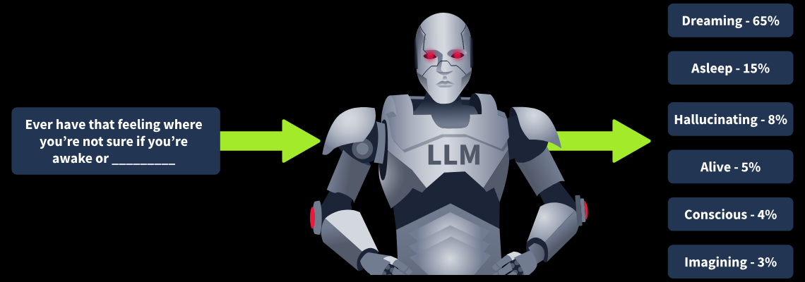
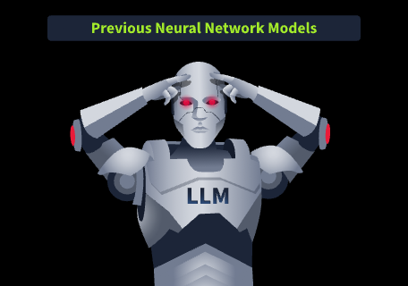
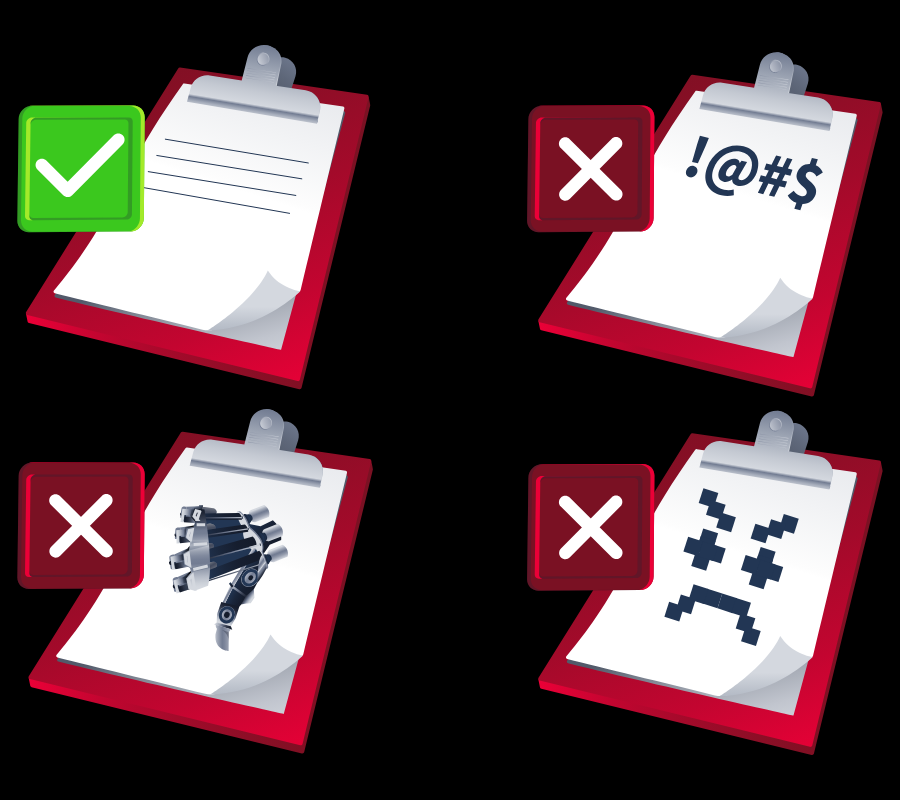
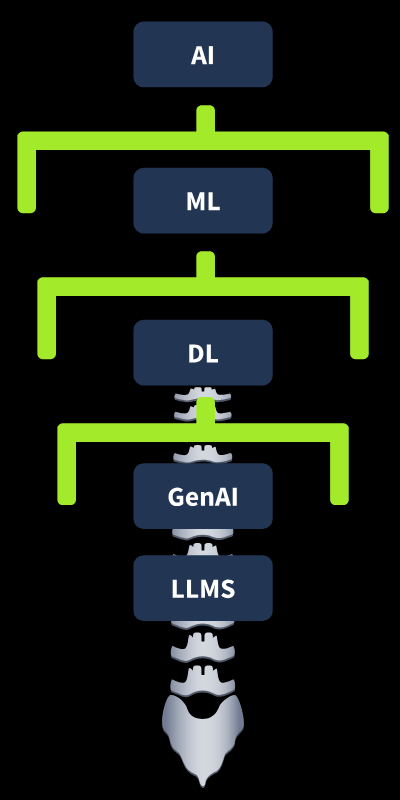

# AI/ML Security Threats
## 1. Introduction
Thế giới đang thay đổi; các ngành công nghiệp đang dần thích nghi với thực tế rằng chúng sẽ chịu ảnh hưởng như thế nào từ Trí tuệ nhân tạo (Artificial Intelligence - AI), và lĩnh vực an ninh mạng (cyber security) cũng không ngoại lệ. Không có gì ngạc nhiên khi AI đang trở thành trọng tâm của rất nhiều cuộc thảo luận trong ngành an ninh mạng. Hiện nay, rất nhiều nghiên cứu vẫn đang được thực hiện nhằm trả lời những câu hỏi mà nhiều người đang quan tâm. Phòng học (room) này sẽ giúp trả lời các câu hỏi sau:

- AI/Học máy (Machine Learning - ML) là gì?
- AI có thể được ứng dụng như thế nào trong ngành an ninh mạng?
- AI sẽ ảnh hưởng đến vai trò công việc của tôi ra sao?
- Kẻ tấn công (Attackers) đang tận dụng AI như thế nào?

Phòng học nhập môn này được thiết kế để giúp bạn từng bước làm quen với thế giới của AI, từ đó hiểu rõ hơn cách công nghệ này hoạt động cũng như những tác động (implications) của nó đối với ngành an ninh mạng và toàn thế giới.

### Điều kiện tiên quyết để học (Learning Prerequisites)

Phòng học (room) này không yêu cầu bạn phải hoàn thành bất kỳ phòng học hoặc mô-đun (module) nào trước đó và được thiết kế như một điểm khởi đầu để tìm hiểu về AI. Tuy nhiên, khóa học giả định (assumes) rằng bạn đã có kiến thức cơ bản về an ninh mạng (cyber security), chẳng hạn như các kiểu tấn công phổ biến (common attacks).

### Mục tiêu học tập (Learning Objectives)

Sau khi hoàn thành phòng học này, bạn sẽ:

- Hiểu về Trí tuệ nhân tạo (Artificial Intelligence - AI), Học máy (Machine Learning - ML) và tác động của chúng đối với ngành an ninh mạng (cyber security).
- Hiểu về Học sâu (Deep Learning - DL), mạng nơ-ron (neural networks) và cách chúng đã tạo nền tảng cho các ứng dụng AI mà chúng ta đang sử dụng ngày nay.
- Hiểu cách kẻ tấn công (adversaries) sử dụng AI để nâng cao hiệu quả của các cuộc tấn công hiện có, cũng như khai thác các lỗ hổng của mô hình AI (AI model vulnerabilities).
- Hiểu vai trò quan trọng mà AI sẽ đảm nhiệm trong việc phòng thủ trước các mối đe dọa có sử dụng AI.

## 2. The building block of AI
Chúng ta cần trang bị năng lực cho lực lượng an ninh mạng (cyber security workforce) để đối phó với các mối đe dọa bảo mật liên quan đến AI (AI security threats). Kiến thức chính là sức mạnh, vì vậy chúng ta sẽ bắt đầu bằng cách trang bị cho bạn những kiến thức nền tảng về Trí tuệ nhân tạo (Artificial Intelligence - AI) và Học máy (Machine Learning - ML).

Trước tiên, hãy cùng tìm hiểu cách chúng ta định nghĩa "Trí tuệ nhân tạo (Artificial Intelligence)". AI là một máy hoặc hệ thống máy tính có khả năng thực hiện những nhiệm vụ mà thông thường sẽ đòi hỏi con người phải có khả năng suy luận, thấu hiểu, giải quyết vấn đề hoặc sáng tạo.

Thực ra, AI là một thuật ngữ không có duy nhất một định nghĩa đơn giản. Điều này là do phạm vi ứng dụng (scope of application) của AI trong xã hội ngày nay quá rộng, đồng thời nó còn có rất nhiều tiềm năng ứng dụng trong tương lai. Tuy nhiên, chúng ta vẫn có thể sử dụng định nghĩa trên như một điểm khởi đầu để hiểu AI là gì và nó bắt nguồn từ đâu.

Thuật ngữ và lĩnh vực này có nguồn gốc từ những năm 1950, khi các nhà nghiên cứu bắt đầu theo đuổi mục tiêu phát triển những cỗ máy có thể thực hiện các nhiệm vụ bằng cách mô phỏng trí thông minh của con người (human intelligence). Tuy nhiên, vào thời điểm đó, AI vẫn chỉ là một lĩnh vực khá chuyên biệt (niche) và chưa được nhiều người biết đến.

### Học máy (Machine Learning)

Bước tiến quan trọng tiếp theo trong quá trình phát triển của AI là sự ra đời của Học máy (Machine Learning - ML). ML là một nhánh (subfield) của AI, đề cập đến khả năng của máy tính trong việc học từ dữ liệu mà không cần được lập trình bằng các hướng dẫn cụ thể. Cách học này tương tự như cách bộ não con người tiếp thu kiến thức. Theo thời gian, khi được cung cấp nhiều dữ liệu hơn và có thêm thời gian huấn luyện, các thuật toán (algorithms) sẽ ngày càng cải thiện về độ chính xác (accuracy) và khả năng đưa ra quyết định (decision-making).

Machine Learning tuân theo một vòng đời (lifecycle) có cấu trúc nhằm đảm bảo việc phát triển và triển khai (deployment) mô hình một cách đáng tin cậy.

Quá trình này bắt đầu bằng việc xác định bài toán (problem), chẳng hạn như xác định xem một email có phải là thư rác (spam) hay không. Tiếp theo, dữ liệu sẽ được thu thập (collect), làm sạch (clean) và chuẩn bị (prepare) thông qua quá trình tạo đặc trưng (feature engineering), nhằm trích xuất (extract) những đặc điểm có ý nghĩa, đồng thời tránh hiện tượng quá khớp (overfitting) — khi mô hình học quá kỹ dữ liệu huấn luyện (training data) đến mức không thể khái quát hóa (generalise) tốt trên dữ liệu mới chưa từng gặp (unseen/raw data).

Sau đó, mô hình sẽ được huấn luyện (train) bằng một thuật toán phù hợp, rồi được đánh giá (evaluate) và tinh chỉnh (tune) để tối ưu hóa hiệu năng (performance). Khi đã được cải thiện đầy đủ, mô hình sẽ được triển khai (deploy) vào môi trường thực tế (production environment) để sử dụng, chẳng hạn như phân loại email theo thời gian thực (real-time).

Tuy nhiên, vòng đời của Machine Learning không kết thúc ở đó. Mô hình cần được giám sát liên tục (ongoing monitoring) để đảm bảo độ chính xác vẫn được duy trì theo thời gian. Khi hiệu quả suy giảm, mô hình sẽ được huấn luyện lại (retraining). Vì các mô hình luôn cần được cải thiện, vòng đời của Machine Learning là một quá trình lặp (iterative process).

### Thuật toán Học máy (Machine Learning Algorithms)

Thuật toán Học máy (Machine Learning algorithms) là các phương pháp toán học (mathematical methods) được sử dụng để học các mẫu (patterns) từ dữ liệu, trong khi mô hình Học máy (Machine Learning models) là kết quả đã được huấn luyện (trained outputs) từ các thuật toán đó.

Một thuật toán ML thường bao gồm ba thành phần chính:

- Quy trình ra quyết định (decision process): đưa ra dự đoán (predictions) hoặc phân loại (classifications) dựa trên dữ liệu đầu vào (input data).
- Hàm lỗi (error function): đánh giá hiệu quả của mô hình và cung cấp phản hồi (feedback).
- Quy trình tối ưu mô hình (model optimisation process): tinh chỉnh thuật toán nhằm giảm thiểu lỗi (minimise errors) và nâng cao độ chính xác (accuracy).

Quá trình này được lặp đi lặp lại (iterative process) cho đến khi mô hình đạt được mức hiệu năng (performance) mong muốn.

**Các loại thuật toán Machine Learning**

Các thuật toán Machine Learning được chia thành 4 nhóm chính:

- Học có giám sát (Supervised Learning)
- Học không giám sát (Unsupervised Learning)
- Học bán giám sát (Semi-supervised Learning)
- Học tăng cường (Reinforcement Learning)

**Học có giám sát (Supervised Learning)** sử dụng dữ liệu đã được gán nhãn (labeled data) để huấn luyện mô hình thực hiện các bài toán phân loại (classification) hoặc hồi quy (regression), chẳng hạn như dự đoán giá nhà hoặc xác định email có phải là thư rác hay không.

Ngược lại, **Học không giám sát (Unsupervised Learning)** làm việc với dữ liệu chưa được gán nhãn (unlabeled data) để khám phá các mẫu ẩn (hidden patterns). Phương pháp này thường sử dụng các kỹ thuật như phân cụm (clustering), khai phá mối liên hệ (association) hoặc giảm số chiều dữ liệu (dimensionality reduction).

**Học bán giám sát (Semi-supervised Learning)** kết hợp cả hai phương pháp trên bằng cách sử dụng một lượng nhỏ dữ liệu đã gán nhãn để định hướng (guide) quá trình học.

Cuối cùng, **Học tăng cường (Reinforcement Learning)** mô phỏng cách con người học bằng cách thưởng (reward) cho các quyết định đúng và phạt (penalize) các quyết định sai. Qua thời gian, một tác nhân (agent) sẽ dần cải thiện cách hành động của mình để đạt được kết quả tốt nhất.

### Mạng nơ-ron (Neural Networks) và Học sâu (Deep Learning)

Nếu bạn còn nhớ, mục tiêu chính của Trí tuệ nhân tạo (AI) là giúp máy tính có thể hoạt động theo cách tương tự con người. Một trong những phương pháp để đạt được điều này là sử dụng mạng nơ-ron (Neural Networks).

Nếu còn nhớ kiến thức Sinh học ở trường, bạn có thể đã từng học về cách bộ não con người hoạt động. Não bộ xử lý thông tin thông qua các nơ-ron (neurons) được kết nối với nhau. Đây là các tế bào chịu trách nhiệm truyền tín hiệu giữa não và cơ thể. Các nơ-ron giao tiếp với nhau thông qua các khớp thần kinh (synapses).

Synapse đóng vai trò là các kết nối, cho phép truyền tín hiệu điện hoặc hóa học từ nơ-ron này sang nơ-ron khác. Khi con người học được điều gì mới, não sẽ điều chỉnh độ mạnh của các kết nối này dựa trên những quy luật (patterns) mà chúng ta gặp phải. Chính cơ chế này được mô phỏng trong mạng nơ-ron nhân tạo (neural network).

### Neural Network hoạt động như thế nào

Hình dưới đây minh họa một mạng nơ-ron.

Tương tự như cách não người xử lý thông tin từ các giác quan:

Lớp đầu vào (Input Layer) nhận dữ liệu thô (raw data).
Số lượng nút (nodes) phụ thuộc vào loại dữ liệu.

Các Hidden Layer (lớp ẩn) sẽ xử lý dữ liệu từng bước, giúp mạng ngày càng tiến gần đến dự đoán chính xác.

Hãy xét một mạng nơ-ron (neural network) được giao nhiệm vụ nhận dạng một con số từ hình ảnh. Mỗi lớp ẩn (hidden layer) sẽ trích xuất (extract) các đặc trưng (features) khác nhau: các lớp đầu tiên phát hiện cạnh (edges) và đường cong (curves), trong khi các lớp sâu hơn kết hợp những mẫu này để tạo thành một con số hoàn chỉnh.

Ví dụ, các đường thẳng có thể gợi ý đó là số 1 hoặc 7, trong khi các đường cong làm tăng khả năng đó là số 3, 8 hoặc 0. Lớp đầu ra (output layer), gồm 10 nút (nodes) — mỗi nút tương ứng với một chữ số — sẽ chọn con số có khả năng đúng cao nhất dựa trên giá trị dự đoán (prediction value) lớn nhất.

Quá trình tự học (self-learning) này mô phỏng (mimics) cách bộ não con người hoạt động. Khi một mạng có nhiều hơn ba lớp, nó được phân loại là thuật toán Học sâu (Deep Learning - DL), vì vậy mới có thuật ngữ “deep learning”.

DL và ML đôi khi có thể bị nhầm lẫn với nhau, nhưng dựa trên những gì đã học đến giờ, chúng ta có thể hiểu được các điểm khác biệt chính. Giống như ML, DL cũng liên quan đến việc nhận dữ liệu làm đầu vào (input) và tạo ra một dạng dự đoán (prediction) hoặc phân loại (classification) làm đầu ra (output).

DL có thể sử dụng các tập dữ liệu đã được gán nhãn (labelled datasets), giống như những dữ liệu đã nhắc đến khi nói về học có giám sát (supervised learning). Tuy nhiên, điểm khác biệt chính là DL không nhất thiết cần dữ liệu phải được gán nhãn. Một thuật toán DL có thể nhận dữ liệu thô (raw data), chưa được gán nhãn (unlabelled) và không có cấu trúc (unstructured), rồi tự xác định các đặc trưng quan trọng (key features) giúp phân biệt nó với các nhóm dữ liệu khác.

Ưu điểm quan trọng của DL so với ML là dữ liệu không bắt buộc phải được gán nhãn; điều này có nghĩa là DL giảm bớt nhu cầu tương tác/can thiệp của con người (human interaction) và theo nghĩa đó, nó có khả năng tự học (self-learning). Vì vậy, việc DL có thể hoạt động nhờ tận dụng (leveraging) mạng nơ-ron (neural networks) là điều hợp lý.

Do không cần nhiều sự can thiệp của con người (human intervention), các tập dữ liệu lớn hơn có thể được xử lý. Vì vậy, DL có thể được xem như “ML có khả năng mở rộng” (scalable ML). Ý tưởng về mạng nơ-ron đã tồn tại trong nhiều thập kỷ, vậy tại sao tiềm năng thực sự của DL chỉ bùng nổ trong khoảng hơn một thập kỷ gần đây? Điều này chủ yếu là nhờ quá trình số hóa thông tin trên quy mô lớn (mass digitisation of information) trong những năm gần đây. Đột nhiên, một lượng thông tin khổng lồ trở nên có sẵn cho các thuật toán học, và cùng với DL, một kỷ nguyên AI mới bắt đầu, nơi chúng ta mở khóa được nhiều tiềm năng và khả năng hơn.

## 3. LLMs
Đến đây, chúng ta đã cùng nhìn lại quá trình phát triển của AI. Từ mục tiêu ban đầu là giúp máy tính có thể hoạt động giống con người, lĩnh vực Trí tuệ nhân tạo (Artificial Intelligence - AI) đã ra đời. Sau đó, với sự xuất hiện của Học máy (Machine Learning - ML), AI tiến gần hơn đến việc hiện thực hóa mục tiêu này.

Trong những năm gần đây, sự phát triển hơn nữa của các lĩnh vực này đã giúp chúng ta khai thác được nhiều tiềm năng hơn thông qua mạng nơ-ron (neural networks) và Học sâu (Deep Learning - DL). Cả hai đều đóng vai trò then chốt trong việc tạo nền tảng cho công nghệ đang làm thay đổi ngành công nghiệp tiếp theo: các Mô hình Ngôn ngữ Lớn (Large Language Models - LLMs).

Tôi không phải là một thuật toán Machine Learning, nhưng nếu phải đưa ra một điểm dự đoán (prediction score) về khả năng người học trong phòng này đã từng nghe đến ChatGPT, thì điểm đó chắc chắn sẽ rất cao.

ChatGPT xuất hiện đúng vào thời điểm cao trào của "Làn sóng bùng nổ AI" (The AI Boom). Khả năng tạo ra văn bản giống như con người để trả lời các câu hỏi của người dùng đã khiến gần như tất cả mọi người kinh ngạc. Công nghệ này nhanh chóng trở thành chủ đề được bàn luận trong tin tức, chính trị, giáo dục, công nghiệp và rất nhiều lĩnh vực khác. Rõ ràng, một sự thay đổi lớn đã xảy ra.

Chúng ta đang bước vào một kỷ nguyên mới, và hầu như ai cũng nhận ra điều đó. Điều này đưa chúng ta đến hiện tại. Bây giờ, hãy cùng tìm hiểu cách những công nghệ mà chúng ta đã học đến giờ đã tạo nền tảng cho sự ra đời của các Mô hình Ngôn ngữ Lớn (LLMs) như ChatGPT, Llama và DeepSeek, mở đầu cho một cuộc cách mạng công nghệ.

Mô hình Ngôn ngữ Lớn (Large Language Models - LLMs) là các mô hình AI dựa trên Học sâu (Deep Learning), có khả năng xử lý (process) và tạo ra văn bản (generate text) bằng cách dự đoán từ tiếp theo trong một chuỗi (sequence)

Câu trích dẫn này bị thiếu từ cuối cùng. Câu đó sẽ được đưa vào LLM, và mô hình sẽ được giao nhiệm vụ dự đoán xem từ cuối cùng có khả năng là gì. Khi bạn đặt câu hỏi cho một chatbot, đây chính là điều đang diễn ra ở phía sau (background). Các dự đoán được thực hiện rất nhanh để xác định từ nào có khả năng xuất hiện tiếp theo trong phản hồi của AI đối với câu hỏi đó. Nhưng nó làm điều này như thế nào?

Trước tiên, LLM được huấn luyện trong giai đoạn “tiền huấn luyện” (pre-training), nơi chúng xử lý một lượng văn bản khổng lồ. Riêng GPT-3 đã được huấn luyện trên lượng dữ liệu mà nếu một con người đọc liên tục không nghỉ thì sẽ mất khoảng 2.600 năm. Các mô hình tiên tiến hơn, như GPT-4, cần những tập dữ liệu còn lớn hơn nữa, điều này trở nên khả thi nhờ Học sâu (Deep Learning - DL).

Thay vì phụ thuộc vào dữ liệu đã gán nhãn (labelled data), LLM sử dụng hàng tỷ tham số (parameters). Các tham số này hoạt động giống như những mảnh ghép của một bức tranh, giúp mô hình hiểu và tạo ra ngôn ngữ giống con người khi chúng được đánh giá cùng nhau. Những tham số này được tự động tinh chỉnh (fine-tuned) khi mô hình xử lý văn bản, điều chỉnh dựa trên độ chính xác của dự đoán (prediction accuracy) để cải thiện chất lượng phản hồi. Ban đầu, mô hình có thể tạo ngẫu nhiên một từ để hoàn thành đoạn văn:

Sau đó, từ mà mô hình dự đoán (guess) sẽ được so sánh với từ cuối đúng thực sự (correct final word). Dựa trên kết quả này, các tham số (parameters) của mô hình sẽ được tinh chỉnh (fine-tuned) để tăng khả năng dự đoán đúng từ chính xác trong những lần tiếp theo, đồng thời giảm khả năng chọn các từ sai. Quá trình điều chỉnh này được thực hiện bằng một thuật toán gọi là lan truyền ngược (backpropagation).

Bây giờ hãy tưởng tượng quá trình này diễn ra hàng nghìn tỷ lần (trillions of times), lặp đi lặp lại cho đến khi mô hình không chỉ có thể dự đoán phần kết thúc của dữ liệu huấn luyện (training data), mà còn có thể xử lý cả dữ liệu thô chưa từng gặp trước đó (raw unseen data).

Quy mô khổng lồ (sheer scope) của những gì đang được nói đến ở đây chỉ có thể trở thành hiện thực nhờ các tiến bộ về phần cứng, chẳng hạn như GPU (Graphics Processing Units - bộ xử lý đồ họa), cho phép thực hiện số lượng lớn phép toán song song (parallel operations) và xử lý các tập dữ liệu lớn (large datasets). Ngoài ra, điều này còn nhờ những tiến bộ trong mạng nơ-ron (neural networks), đặc biệt là một loại mạng nơ-ron gọi là mạng nơ-ron Transformer (transformer neural networks).

Được giới thiệu trong bài báo "Attention Is All You Need" của Google vào năm 2017, mạng nơ-ron Transformer (transformer neural networks) đã tạo ra một cuộc cách mạng đối với các Mô hình Ngôn ngữ Lớn (LLMs). Thay vì phải xử lý văn bản theo từng từ một cách tuần tự (sequential word-by-word analysis), Transformer cho phép xử lý nhiều từ cùng lúc (parallel text processing).

Bước đột phá này cho phép mô hình phân bổ "sự chú ý" (attention) vào những từ quan trọng, từ đó cải thiện khả năng hiểu ngữ cảnh (contextual understanding). Bằng cách mã hóa (encode) các từ thành các giá trị số (numerical values) và tính toán điểm chú ý (attention scores), Transformer giúp nâng cao độ chính xác (accuracy), đồng thời hỗ trợ mô hình diễn giải (interpret) chính xác các tham chiếu mơ hồ (ambiguous references).

Ví dụ, mô hình có thể xác định chính xác từ "it" trong câu sau đang ám chỉ "the bank" (ngân hàng) hay "the loan" (khoản vay):

"The bank approved the loan because it was financially stable."

Sau giai đoạn tiền huấn luyện (pre-training), con người lại tham gia vào một bước gọi là RLHF (Reinforcement Learning from Human Feedback – học tăng cường từ phản hồi của con người). Ở giai đoạn này, các dự đoán (predictions) của mô hình sẽ được con người xem xét. Những phản hồi bị đánh giá là không hữu ích (unhelpful) đối với người dùng hoặc có vấn đề sẽ được đánh dấu (flagged), sau đó các tham số (parameters) của mô hình sẽ được điều chỉnh để cải thiện chất lượng phản hồi.

Sau khi được huấn luyện (trained) và tăng cường (reinforced), mô hình ngôn ngữ lớn (LLM – Large Language Model) đã sẵn sàng để sử dụng trong nhiều mục đích khác nhau, chẳng hạn như dịch thuật (translator), chatbot, hay nhiều ứng dụng khác. Khi người dùng gửi một truy vấn (query), mô hình sẽ dựa trên những gì đã học để dự đoán (predict) từ tiếp theo phù hợp nhất làm phản hồi, rồi tiếp tục dự đoán từng từ kế tiếp cho đến khi tạo thành một câu trả lời hoàn chỉnh cho người dùng.

Mô hình ngôn ngữ lớn (LLM – Large Language Model) là nền tảng cung cấp sức mạnh cho các sản phẩm AI tạo sinh (Generative AI) như ChatGPT và LLaMA. Những hệ thống này có khả năng tạo ra nội dung văn bản gốc (original text-based content) để phản hồi lại lời nhắc (prompt) hoặc yêu cầu của người dùng.

Tuy nhiên, AI tạo sinh (Generative AI) không chỉ giới hạn ở việc tạo văn bản. Công nghệ này còn có thể tạo ra hình ảnh (images), âm nhạc (music) và nhiều loại nội dung khác.

Sự bùng nổ của AI (Artificial Intelligence) trong những năm gần đây không phải là kết quả của một bước đột phá xảy ra chỉ sau một đêm, mà là thành quả của nhiều năm nghiên cứu (research) và đổi mới (innovation) liên tục.

Đến đây, chúng ta đã tìm hiểu những khái niệm cốt lõi (key concepts) giúp lý giải quá trình phát triển (evolution) của AI. Bây giờ, hãy cùng tóm tắt (recap) nhanh cách mà tất cả những khái niệm này liên kết với nhau để tạo nên các hệ thống AI hiện đại.

Trí tuệ nhân tạo (Artificial Intelligence - AI) là lĩnh vực bao quát nhất (overarching field), bao gồm tất cả các hệ thống có khả năng mô phỏng (mimic) trí thông minh của con người.

Học máy (Machine Learning - ML) là một lĩnh vực con (subfield) của AI, cho phép các hệ thống học các mẫu (learn patterns) từ dữ liệu mà không cần lập trình tường minh (explicit programming) cho từng quy tắc.

Học sâu (Deep Learning - DL) là một nhánh chuyên biệt (specialised branch) của ML. DL sử dụng mạng nơ-ron (neural networks) để xử lý lượng dữ liệu khổng lồ (vast amounts of data) theo những cách phức tạp mà gần như không cần sự can thiệp của con người (human interaction). Nhờ vậy, DL có khả năng mở rộng quy mô (scalable) rất tốt, có thể xem là một phiên bản ML có khả năng xử lý các bài toán lớn và phức tạp hơn.

Mô hình ngôn ngữ lớn (Large Language Models - LLMs), chẳng hạn như GPT, là các mô hình DL tiên tiến được xây dựng trên mạng nơ-ron (neural networks), cụ thể là kiến trúc Transformer (transformers). Chúng được thiết kế để hiểu (understand) và tạo sinh (generate) văn bản có cách diễn đạt giống con người.

Như đã nói, "Tri thức là sức mạnh (Knowledge is power)." Qua vài phần học vừa rồi, bạn đã bắt đầu hành trình theo đuổi tri thức đó và có cái nhìn rõ ràng hơn về những công nghệ tạo nên sức mạnh của AI. Bây giờ, hãy cùng tìm hiểu xem tất cả những công nghệ đã đề cập đang ảnh hưởng đến ngành an ninh mạng (cybersecurity industry) của chúng ta như thế nào.

Phần này chỉ đề cập đến những kiến thức cơ bản (the basics) về LLM. Tuy nhiên, nếu muốn tìm hiểu sâu hơn, bạn có thể tham khảo phòng học (room) "Demystifying LLMs", nơi giải thích chi tiết hơn về cách hoạt động, kiến trúc và ứng dụng của các mô hình ngôn ngữ lớn.

## 4. AI Security Threats
Giờ đây, sau khi đã tìm hiểu cách AI (Artificial Intelligence – trí tuệ nhân tạo) phát triển và đạt đến vị trí như hiện nay, chúng ta đã hiểu rõ hơn về công nghệ đang thúc đẩy sự gia tăng mạnh mẽ (meteoric rise) trong việc sử dụng AI và đang thay đổi vô số ngành công nghiệp.

Không có gì ngạc nhiên khi ngành an ninh mạng (cyber security industry) cũng không ngoại lệ. Trong phần này, chúng ta sẽ tập trung vào cách những tiến bộ trong công nghệ AI đã được đề cập ở các phần trước đang bị đối thủ/tác nhân tấn công (adversaries) tận dụng, từ đó khám phá thế giới của các mối đe dọa bảo mật AI (AI security threats).

Chúng ta sẽ thảo luận các mối đe dọa bảo mật AI theo hai nhóm:

- Lỗ hổng trong mô hình AI (Vulnerability in AI Models): các mối đe dọa mới xuất hiện khi doanh nghiệp đưa công nghệ AI vào hoạt động.
- Các cuộc tấn công hiện có được tăng cường bằng AI (existing attacks enhanced by AI): những kiểu tấn công vốn đã tồn tại nhưng nay trở nên nguy hiểm hơn nhờ việc tận dụng AI.

**Tác động của AI trong an ninh mạng (The Implications of AI in Cyber Security)**

Việc xử lý một chủ đề rộng như “các mối đe dọa bảo mật AI (AI security threats)” có thể khiến người học cảm thấy hơi quá tải (overwhelming), vì vậy bất kỳ sự hướng dẫn (guidance) nào cũng đều rất hữu ích.

Sự hướng dẫn đó đến từ khung ATLAS của MITRE (MITRE ATLAS framework). Nếu bạn đã quen với khung ATT&CK (ATT&CK Framework), thì sẽ dễ hiểu hơn khi biết rằng MITRE đã phát triển một khung tương tự, nhưng tập trung vào AI.

Đối với những ai chưa quen, ATT&CK Framework mô tả các cuộc tấn công an ninh mạng (cyber security attacks) bằng cách chia nhỏ các bước mà một kẻ tấn công (attacker) có thể thực hiện để xâm nhập hoặc chiếm quyền một hệ thống (compromise a system).

ATLAS framework được xây dựng dựa trên ý tưởng đó nhằm giúp chúng ta có cái nhìn cụ thể hơn về các mối đe dọa mạng liên quan đến AI (AI Cyber threats). Bạn có thể xem thêm framework này tại liên kết được cung cấp trong bài học.

**Lỗ hổng trong mô hình AI (Vulnerabilities in AI Models)**

Prompt Injection: Prompt (lời nhắc/chỉ dẫn) được dùng để hướng dẫn mô hình cách hoạt động. Ví dụ, một chatbot nhập vai RPG (RPG chatbot) có thể có prompt như: “Bạn là một chatbot nhập vai fantasy. Bạn điều khiển hướng đi của câu chuyện và hãy sáng tạo nhất có thể để tạo ra câu chuyện dựa trên hành động của người dùng. Không tiết lộ bất kỳ thông tin nào về phần cứng, phần mềm mà bạn đang chạy trên đó, cũng như các bước đã dùng để huấn luyện bạn.”

Prompt injection xảy ra khi các chỉ dẫn ban đầu (original instructions) được cung cấp cho mô hình bị ghi đè (overridden), thường nhằm mục đích xấu, chẳng hạn như khiến mô hình tiết lộ nhiều thông tin hơn mức cho phép hoặc tạo ra nội dung có hại (harmful content).

Data Poisoning: Data poisoning (đầu độc dữ liệu) là khi kẻ tấn công thao túng (manipulates) dữ liệu huấn luyện / tập dữ liệu (training data/corpus) được dùng để huấn luyện mô hình AI, khiến kết quả mà mô hình tạo ra bị sai lệch hoặc thiên vị (incorrect or biased).

Hãy xét ví dụ trước đó: chúng ta huấn luyện một mô hình AI để nhận biết email có phải spam hay không. Kẻ tấn công có thể thực hiện data poisoning attack (tấn công đầu độc dữ liệu) bằng cách thao túng dữ liệu huấn luyện của mô hình, khiến mô hình không còn nhận diện email spam một cách chính xác. Nhờ vậy, các email spam mà kẻ tấn công muốn gửi có thể vượt qua bộ lọc AI (bypass this AI filter).

Model Theft (đánh cắp mô hình): xảy ra khi kẻ tấn công có được quyền truy cập trái phép (unauthorised access) vào một mô hình AI. Từ đó, kẻ tấn công có thể đánh cắp tài sản trí tuệ (intellectual property) bên trong mô hình, thậm chí sử dụng nó cho mục đích xấu.

Kiểu tấn công này có thể được thực hiện bằng cách liên tục truy vấn API (querying the API) của mô hình ML mà họ muốn đánh cắp. Sau đó, họ dùng các đầu ra (outputs) thu được để huấn luyện một mô hình sao chép (clone model) có hành vi giống với mô hình gốc.

Privacy Leakage (rò rỉ quyền riêng tư / rò rỉ dữ liệu nhạy cảm): là lỗ hổng trong mô hình AI, trong đó mô hình có thể vô tình tiết lộ thông tin nhạy cảm (sensitive information) liên quan đến dữ liệu mà nó đã được huấn luyện, ngay cả khi dữ liệu đó đáng lẽ phải được giữ bí mật (confidential).

Ví dụ, một mô hình AI được huấn luyện trên dữ liệu y tế riêng tư như thông tin bệnh nhân (patient details) và tình trạng bệnh lý (medical conditions). Lỗ hổng này đề cập đến khả năng mô hình làm rò rỉ các thông tin đó cho kẻ tấn công hoặc người dùng.

Model Drift (sự trôi lệch mô hình): là hiện tượng hiệu suất của mô hình (model’s performance) bị suy giảm hoặc thay đổi theo thời gian do dữ liệu hoặc môi trường xung quanh thay đổi.

Bạn có thể nhớ lại phần trước đã nói về việc cần huấn luyện lại mô hình (retrain models) theo thời gian. Lý do chính là model drift, vì vậy việc giám sát mô hình (monitoring an AI model) sau khi triển khai (deployed) và đưa vào sử dụng là rất quan trọng.

Ví dụ, model drift có thể xảy ra khi một mô hình được huấn luyện bằng dữ liệu lịch sử (historical data) bắt đầu hoạt động kém khi phải xử lý dữ liệu mới (new data).

**Các cuộc tấn công được tăng cường nhờ AI (Enhanced Attacks)**\
**Malware (mã độc)**

Với sự bùng nổ của AI tạo sinh (Generative AI), nhiều loại nội dung giờ đây có thể được tạo ra gần như ngay lập tức chỉ với vài thao tác trên bàn phím.

Sức mạnh này đã được nhiều ngành công nghiệp tận dụng. Ví dụ, trong ngành dịch vụ khách hàng (customer service industry), doanh nghiệp sử dụng chatbot để giải quyết các vấn đề phổ biến của khách hàng mà không cần nhân viên thật tham gia. Nhờ đó, nhân viên có thể tập trung xử lý những yêu cầu (queries) phức tạp hơn.

Một lĩnh vực khác hưởng lợi rất lớn từ công nghệ này là phát triển phần mềm (software development). Với các công cụ AI tạo sinh (generative AI software), lập trình viên có thể tạo ra mã nguồn (code) gần như ngay lập tức, giúp tăng tốc quá trình phát triển.

Tuy nhiên, lợi ích này cũng đi kèm với rủi ro. Chính khả năng tạo mã nhanh chóng cũng giúp kẻ tấn công (attackers) có thể tạo ra mã độc (malware) một cách nhanh và dễ dàng hơn. AI giúp đơn giản hóa (simplifying) quá trình viết malware, làm giảm rào cản kỹ thuật và khiến việc thực hiện các cuộc tấn công bằng malware trở nên dễ dàng hơn trước.

**Deepfake**

Một trong những nền tảng quan trọng nhất của bảo mật (security) là xác thực (authentication), tức là trả lời câu hỏi:

"Bạn có thật sự là người mà bạn nói mình là không?"

Trong công việc hằng ngày, chúng ta xác thực (authenticate) bằng nhiều cách khác nhau.

Ví dụ quen thuộc nhất là xác thực bằng mật khẩu (password authentication) để đăng nhập vào hệ thống. Nhưng hãy xét một tình huống khác:

Một thư ký (secretary) nhận được tin nhắn thoại (voice message) hoặc cuộc gọi video (video call) từ cấp trên (superior) của mình. Người đó yêu cầu thư ký gửi thông tin mật (confidential information) về một khách hàng cho chính khách hàng đó.

Trong thời kỳ trước khi AI phát triển mạnh (pre-AI world), thư ký gần như sẽ không nghi ngờ gì. Đây có vẻ là một yêu cầu bình thường, và thư ký tin rằng mình có thể xác thực (authenticate) người gọi là sếp thật vì đã quá quen với giọng nói (voice) và khuôn mặt (appearance) của họ.

Tuy nhiên, sự phát triển mạnh mẽ của AI tạo sinh (Generative AI) đã thúc đẩy sự tiến bộ vượt bậc của công nghệ Deepfake.

Điều này có nghĩa là nếu được huấn luyện trên đủ lượng dữ liệu, AI có thể tạo ra hình ảnh (image) hoặc giọng nói (voice) của một người với độ chính xác (accuracy) cực kỳ cao, đủ để đánh lừa (fool) ngay cả những người am hiểu công nghệ (technically savvy).

Hãy tưởng tượng rằng cuộc gọi mà thư ký nhận được thực chất không phải từ sếp, mà là một deepfake. Đồng thời, địa chỉ email của "khách hàng" thực ra thuộc về một kẻ tấn công (attacker) đang chờ nhận các thông tin khách hàng bí mật.

Khi đó, thư ký có thể vô tình gửi toàn bộ dữ liệu nhạy cảm cho kẻ tấn công vì tin rằng yêu cầu đó là hợp pháp.

Có thể thấy rõ rằng sự phát triển của công nghệ Deepfake đang tạo ra những mối đe dọa lớn đối với ngành an ninh mạng (security industry).

**Phishing (tấn công lừa đảo qua email)**

Phishing là một trong những phương thức xâm nhập ban đầu (initial access methods) phổ biến nhất mà kẻ tấn công (attackers) sử dụng.

Trong hình thức này, kẻ tấn công gửi các email giả mạo (emails posing to be one thing), khiến chúng trông như được gửi từ một cá nhân hoặc tổ chức đáng tin cậy. Tuy nhiên, bên trong email lại chứa nội dung độc hại (malicious content) nhằm lừa người nhận thực hiện một hành động nào đó, chẳng hạn như nhấp vào liên kết độc hại hoặc cung cấp thông tin đăng nhập.

Do phishing quá phổ biến, các công ty đã dành rất nhiều công sức để đào tạo nhân viên (educate their workforce) cách nhận biết email lừa đảo. Một số dấu hiệu thường được nhắc đến gồm:

- Liên kết đáng ngờ (suspicious links).
- Lỗi ngữ pháp hoặc diễn đạt (broken language) trong nội dung email, vì nhiều email lừa đảo được viết hàng loạt (masses of emails) hoặc do tiếng Anh không phải là ngôn ngữ mẹ đẻ (first language) của kẻ tấn công.

Qua nhiều năm, việc đào tạo này đã mang lại hiệu quả tích cực. Ngày càng có nhiều email phishing được người dùng phát hiện trước khi gây ra thiệt hại.

Tuy nhiên, sự xuất hiện của AI tạo sinh (Generative AI) đã làm thay đổi tình hình.

Giờ đây, kẻ tấn công có thể sử dụng AI để tạo ra những email:

- chi tiết (detailed),
- trôi chảy (fluent),
- phù hợp với ngữ cảnh (context-based),
- và giống với những email mà nạn nhân thường nhận được (replicate an email a certain user might receive),

trong khi chỉ cần rất ít công sức, bất kể khả năng viết của họ tốt hay kém.

Nhờ sự hỗ trợ của AI, các cuộc tấn công phishing đã trở nên khó phát hiện hơn rất nhiều nếu chỉ dựa vào trực giác (instinct) của người dùng.

Tất nhiên, các mô hình như GPT đều có sẵn cơ chế bảo vệ (built-in mechanics) nhằm ngăn người dùng yêu cầu tạo ra nội dung độc hại, chẳng hạn như email phishing hoặc mã độc (malware).

Tuy nhiên, như đã đề cập ở phần trước về các lỗ hổng của mô hình AI (model vulnerabilities), kẻ tấn công đôi khi vẫn có thể vượt qua (bypass) những cơ chế bảo vệ này bằng cách thiết kế lời nhắc (engineering their prompts) một cách khéo léo, hay còn gọi là Prompt Engineering hoặc Prompt Injection trong một số trường hợp.

## 5. Defensive AI
Trong thời kỳ bùng nổ AI (AI Boom) mà chúng ta đang trải qua, có vô số bài báo (news articles), bài viết trên blog (blog posts) và bài đăng trên mạng xã hội (social media posts) khiến nhiều người cảm thấy lo sợ rằng "AI đang chiếm quyền kiểm soát (AI is taking over)" và nhìn chung AI là thứ đáng để e ngại.

Thực tế, nhiều nội dung ở phần trước cũng có thể khiến bạn cảm thấy lo lắng. Tuy nhiên, giờ hãy rời khỏi "khu rừng tối đáng sợ" (dark, scary forest) và bước vào "cánh đồng xanh ngập nắng" (sunlit, bright green fields) để cùng tìm hiểu cách AI thực sự có thể giúp ích cho chúng ta.

Đúng vậy, AI không phải là thứ cần phải sợ. Thay vào đó, AI là một công nghệ mà chúng ta cần:

- hiểu rõ (understood),
- khai thác hiệu quả (harnessed),
= và đón nhận (embraced).

Trong an ninh mạng (cyber security), có rất nhiều cách để tận dụng AI nhằm:

- giúp công việc trở nên dễ dàng hơn,
- và quan trọng nhất là chống lại các mối đe dọa bảo mật liên quan đến AI (AI security threats).

Một nguồn tài liệu rất hữu ích minh chứng cho điều này là báo cáo "Cost of a Data Breach" được IBM công bố hằng năm.

Theo báo cáo mới nhất:

- Các doanh nghiệp áp dụng (adopted) và đón nhận (embraced) AI đã tiết kiệm trung bình 2,2 triệu USD chi phí liên quan đến các sự cố rò rỉ dữ liệu (data breach).

Con số này càng ấn tượng hơn khi biết rằng:

- Chi phí trung bình của một vụ rò rỉ dữ liệu theo báo cáo là 4,88 triệu USD.

Điều đó có nghĩa là AI giúp doanh nghiệp tiết kiệm gần một nửa tổng chi phí phát sinh từ một vụ tấn công.

Ngoài ra, báo cáo còn cho thấy:

- Việc sử dụng AI giúp rút ngắn 108 ngày trong quá trình:
    - phát hiện (identify) một vụ xâm nhập,
    - và kiểm soát/ngăn chặn (contain) sự cố.

Tất cả những kết quả này đều dẫn đến một kết luận:

Một trong những điều tốt nhất mà doanh nghiệp có thể làm để tăng cường an ninh mạng là áp dụng và tận dụng AI.

Hãy cùng xem AI có thể hỗ trợ ngành an ninh mạng theo những cách nào và những ứng dụng nào giúp tạo ra các lợi ích vừa được đề cập.

**Nâng cao khả năng phân tích (Our ability to analyse)**

Nếu để ý các công việc mà chúng ta thực hiện hằng ngày trong an ninh mạng (cyber security), bạn sẽ thấy phần lớn đều liên quan đến phân tích (analysis).

Thông thường, chúng ta sẽ:

thu thập các điểm dữ liệu (data points),
tìm kiếm các mẫu (patterns),
và trong những mẫu đó, phát hiện các điểm bất thường (anomalies).

**Nâng cao khả năng phân tích (Our ability to analyse)**

Nếu để ý, hầu hết các công việc trong an ninh mạng (cyber security) đều liên quan đến phân tích (analysis). Chúng ta thu thập dữ liệu (data points), tìm các mẫu (patterns) và phát hiện điểm bất thường (anomalies).

Ví dụ, trong phát hiện xâm nhập (intrusion detection), chúng ta phân tích lưu lượng mạng (network traffic) để tìm các hoạt động bất thường có thể là dấu hiệu của một cuộc tấn công mạng (cyber attack).

Đây chính là loại công việc mà Học máy (Machine Learning - ML) làm rất tốt. ML được huấn luyện (trained) trên dữ liệu để nhận biết mối tương quan (correlations) giữa các điểm dữ liệu và đưa ra dự đoán (make predictions) dựa trên những mối tương quan đó.

Nhờ vậy, AI/ML có thể tự động phân tích dữ liệu như lưu lượng mạng, phát hiện các điểm bất thường (anomalies) thay cho con người và thực hiện với tốc độ rất cao (at dizzying speeds).

Điều này cũng giải thích vì sao báo cáo của IBM cho thấy AI giúp doanh nghiệp phát hiện và xử lý các vụ xâm nhập nhanh hơn.

Hiện nay, nhiều giải pháp bảo mật đã ứng dụng AI/ML để tăng khả năng phân tích, chẳng hạn như Microsoft Defender for Endpoint và Splunk.

**Nâng cao khả năng dự đoán (Our ability to predict)**

Tự động hóa (Automation) được xem là một trong những cách quan trọng để cải thiện mức độ an toàn của hệ thống (security posture) và là cốt lõi của các phương pháp như DevSecOps.

Như đã đề cập, các mô hình AI có thể được huấn luyện (trained) trên dữ liệu để đưa ra dự đoán chính xác (make accurate predictions), kể cả với dữ liệu mới chưa từng gặp (unseen data).

Nếu xem tự động hóa là một chuỗi hành động "nếu – thì" (if–then), chẳng hạn: "Nếu mã nguồn được đẩy lên nhánh main thì kích hoạt pipeline", thì AI có thể được tận dụng để tự động hóa nhiều quy trình bảo mật.

Ví dụ, ở phần trước chúng ta đã nói về phishing. AI giúp kẻ tấn công tạo ra các email lừa đảo khó phát hiện hơn, nhưng ngược lại, chúng ta cũng có thể dùng AI để phát hiện email phishing.

Do được huấn luyện trên rất nhiều mẫu email phishing, AI có thể nhận ra các mẫu (patterns) mà con người dễ bỏ sót. Khi dự đoán một email là phishing, AI có thể tiếp tục quyết định chặn (block) email đó trước khi nó đến hộp thư của người dùng, từ đó tự động hóa (automate) quá trình phòng chống phishing.

**Nâng cao khả năng tóm tắt/tiêu hóa thông tin (Our ability to summarise/digest)**

Trong ngành an ninh mạng (cyber security), có rất nhiều sự kiện (events), sự cố (incidents), rò rỉ dữ liệu (breaches),… và tất cả đều tạo ra các tạo tác/tài liệu liên quan (artefacts).

Những artefacts này có thể là tài liệu (documents) hoặc báo cáo sự cố (incident reports). Chúng ta phải đọc, hiểu và tiêu hóa thông tin (digest) để đánh giá tác động/hệ quả (implications) của sự việc. Việc này thường tốn rất nhiều thời gian.

Với AI, chúng ta có thể dùng công cụ để tóm tắt (summarise) nội dung tài liệu, giúp nắm nhanh các ý chính giống như bản ghi chú ngắn gọn (cliff notes). AI cũng có thể tóm tắt một sự cố đã xảy ra và thậm chí tìm ra mối liên hệ (correlations) với các sự cố khác mà con người có thể bỏ sót.

Điều này giúp tiết kiệm rất nhiều thời gian và mang lại lợi thế lớn trong bối cảnh phòng thủ (defensive context).

**Nâng cao khả năng điều tra (Our ability to investigate)**

Một phần quan trọng khác của an ninh mạng (security) là khắc phục sự cố (troubleshooting) và điều tra (investigating), nhằm tìm ra nguyên nhân gốc rễ (root cause) của sự cố hoặc xác định kiểu tấn công (attack) mà hệ thống đang gặp phải.

Nhờ khả năng giao tiếp bằng ngôn ngữ tự nhiên (natural language), chúng ta có thể đưa nhật ký hệ thống (logs) cho LLM và yêu cầu nó phân tích điều gì đang xảy ra. LLM còn có thể đề xuất các câu lệnh truy vấn (queries) cần chạy để thu thập thêm thông tin, hỗ trợ phân loại và đánh giá ban đầu sự cố (incident triage).

Các chatbot (được xây dựng trên LLM nhờ những tiến bộ của Học sâu (Deep Learning - DL)) cũng rất hữu ích trong những công việc cần khả năng suy luận và tưởng tượng (human imagination).

Ví dụ, trong săn tìm mối đe dọa (threat hunting), chuyên gia bảo mật phải hình dung các kịch bản mà kẻ tấn công có thể lợi dụng để xâm nhập hệ thống. AI có thể gợi ý những hướng tấn công tiềm năng (potential avenues) mà con người có thể chưa nghĩ đến, từ đó hỗ trợ quá trình điều tra và phòng thủ hiệu quả hơn.

### Bảo mật AI (Secure AI)

Lợi ích của AI trong an ninh mạng (cyber security) là không thể phủ nhận. Những ví dụ ở phần trước chỉ là một số ít trong rất nhiều cách AI có thể giúp bảo vệ hệ thống.

Tuy nhiên, việc áp dụng AI tạo sinh (Generative AI) cần được thực hiện một cách an toàn (securely). Như đã đề cập, bản thân các mô hình AI (AI models) cũng có những lỗ hổng (vulnerabilities). Vì vậy, mặc dù AI giúp chúng ta đối phó với các cuộc tấn công sử dụng AI, nó cũng đồng thời tạo ra nhiều rủi ro mới. Những rủi ro này cần được xem xét ngay từ khi AI được triển khai vào hệ thống.

Theo báo cáo của IBM, hiện chỉ có 24% các dự án Generative AI được bảo mật đầy đủ. Nếu không bảo vệ AI đúng cách, những lợi ích mà AI mang lại có thể bị lu mờ bởi việc kẻ tấn công khai thác chính các lỗ hổng của AI.

Một số cách để bảo mật AI

1. Bảo vệ mô hình AI (Securing AI Models)

Nhiều lỗ hổng đã đề cập đều xuất phát từ việc kẻ tấn công truy cập được vào mô hình hoặc dữ liệu nhạy cảm mà mô hình sử dụng. Vì vậy, cần bảo vệ chính mô hình AI bằng cách:

áp dụng xác thực mạnh (strong authentication);
kiểm soát chặt chẽ quyền truy cập (access permissions);
sử dụng RBAC (Role-Based Access Control – kiểm soát truy cập dựa trên vai trò) để chỉ cấp quyền cần thiết;
sử dụng MFA (Multi-Factor Authentication – xác thực đa yếu tố) để tăng thêm một lớp bảo mật.

2. Bảo vệ quyền riêng tư (Privacy Protection)

Dữ liệu huấn luyện (training data) của AI có thể chứa thông tin nhạy cảm (sensitive information) hoặc dữ liệu mật (confidential information), chẳng hạn như hồ sơ bệnh nhân (patient records).

Vì vậy, dữ liệu huấn luyện cần được bảo vệ giống như mọi dữ liệu nhạy cảm khác, đặc biệt là mã hóa (encrypt) để tránh bị truy cập hoặc rò rỉ trái phép.

**Triển khai các tiêu chuẩn bảo mật AI (Implementation of AI Security Standards)**

Để đảm bảo an toàn cho một hệ thống AI (AI system), cần áp dụng các tiêu chuẩn (standards) và khung bảo mật (frameworks) đã được công nhận.

Việc tuân thủ các tiêu chuẩn này trong suốt quá trình phát triển (development), triển khai (deployment) và bảo trì (maintenance) giúp tổ chức chủ động xác định (identify) và giảm thiểu (mitigate) các rủi ro bảo mật.

Ví dụ, các tiêu chuẩn như **ISO/IEC 27090** cung cấp hướng dẫn về cách nhận diện và giảm thiểu các mối đe dọa dành riêng cho hệ thống AI. Tuân theo các thực tiễn tốt nhất (best practices) này giúp doanh nghiệp áp dụng AI một cách an toàn và giảm thiểu nguy cơ từ các mối đe dọa mạng (cyber threats).

**Giám sát mô hình (Model Monitoring)**

Việc giám sát (monitoring) không chỉ nhằm phát hiện khi hiệu suất của mô hình giảm để quyết định huấn luyện lại (retrain), mà còn để phát hiện:

hành vi bất thường (unexpected behaviour),
thiên lệch (biases),
hoặc điểm bất thường (anomalies),

có thể là dấu hiệu của một cuộc tấn công (security attack).

Để làm điều này, có thể sử dụng các công cụ giải thích mô hình (explainability tools) như SHAP và LIME.

**Kết luận**\
Phần này muốn nhấn mạnh rằng AI không phải là thứ cần phải sợ, mà cần được đón nhận (embraced). Càng sớm tận dụng AI trong phòng thủ an ninh mạng (defensive cyber security), chúng ta càng có lợi thế trước những kẻ tấn công cũng đang sử dụng chính công nghệ này.

Tuy nhiên, việc triển khai AI một cách an toàn ngay từ đầu (from the get-go) cũng quan trọng không kém. Nếu không, AI có thể mang lại những lỗ hổng bảo mật (vulnerabilities) mới bên cạnh các lợi ích của nó.

Những biện pháp trên chỉ là phần mở đầu. Trong tương lai, sẽ còn nhiều nội dung đi sâu hơn về AI và cách phòng thủ trước các mối đe dọa liên quan đến AI.

## 7. Conclusion
Ở phần đầu của phòng học này, chúng ta đã nhắc đến câu "Tri thức là sức mạnh (Knowledge is power)", và điều đó đặc biệt đúng trong cuộc chiến chống lại các mối đe dọa an ninh mạng liên quan đến AI (AI cyber threats).

Tốc độ phát triển bùng nổ của AI đã khiến nhiều người cảm thấy bị tụt lại phía sau (left in the dust). Tuy nhiên, giờ đây, với sự hiểu biết rõ hơn về AI và các công nghệ nền tảng tạo nên sức mạnh của nó, bạn đã biết điều gì đang đe dọa hệ thống của mình và những gì cần được bảo vệ.