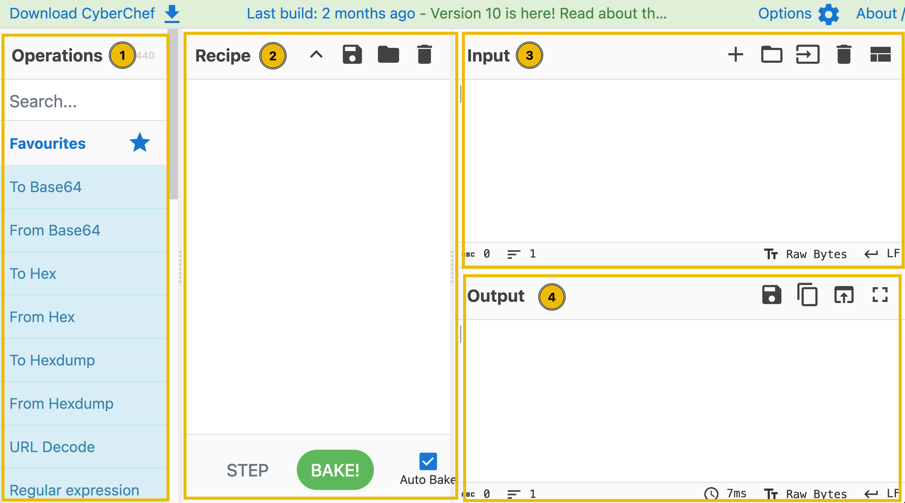
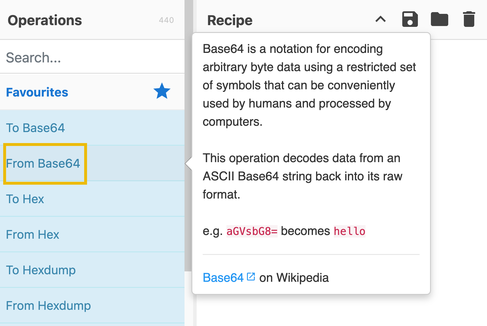
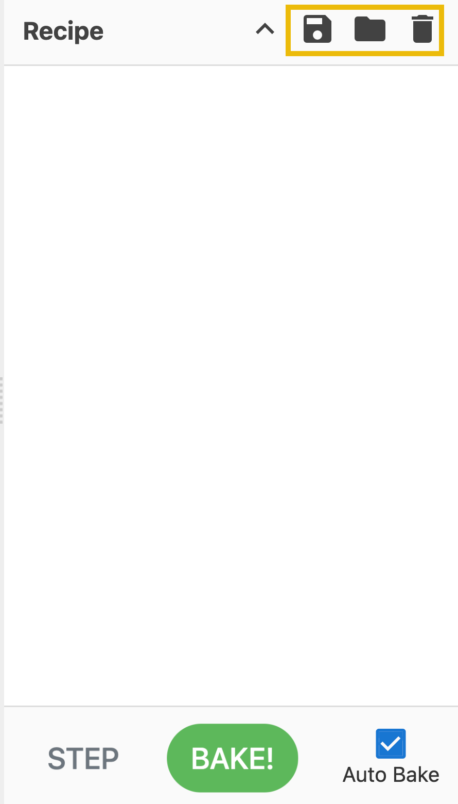
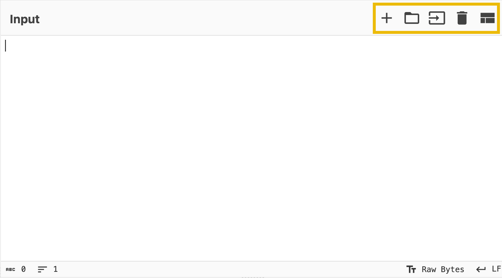
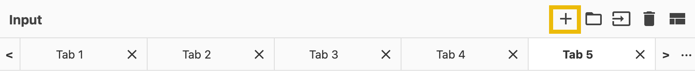
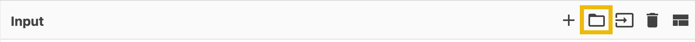
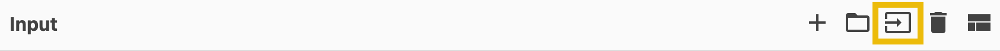
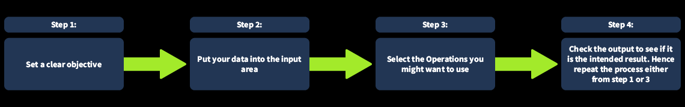
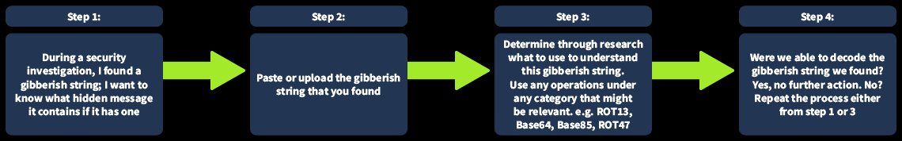

# CyberChef: The Basics
## 1. Introduction
`CyberChef` là một ứng dụng web đơn giản, trực quan được thiết kế để hỗ trợ các tác vụ "an ninh mạng" khác nhau ngay trong trình duyệt web của bạn. Hãy coi nó như một **con dao đa năng Thụy Sĩ** dành cho dữ liệu - giống như một hộp công cụ với nhiều công cụ khác nhau được thiết kế để thực hiện một nhiệm vụ cụ thể. Các tác vụ này bao gồm từ các mã hóa đơn giản như **XOR** hoặc **Base64** đến các thao tác phức tạp như mã hóa **AES** hoặc giải mã **RSA** . CyberChef hoạt động dựa trên **các công thức** , một chuỗi các thao tác được thực hiện theo thứ tự.

**Mục tiêu học tập**:
- Tìm hiểu **CyberChef** là gì?
- Tìm hiểu cách sử dụng giao diện
- Hiểu các thao tác thông thường
- Tìm hiểu cách tạo *công thức giải mã và xử lý dữ liệu*.

## 2. Access the Tool
Có nhiều cách để truy cập và chạy CyberChef. Hãy cùng xem xét hai phương pháp thuận tiện nhất!

**Truy cập trực tuyến**
Bạn chỉ cần một trình duyệt web và kết nối internet. Sau đó, bạn có thể nhấp vào [liên kết](https://gchq.github.io/CyberChef) này để mở CyberChef trực tiếp trong trình duyệt web của mình.

**Bản sao ngoại tuyến hoặc cục bộ**
Bạn có thể chạy chương trình này ngoại tuyến hoặc cục bộ trên máy tính của mình bằng cách tải xuống tệp phát hành mới nhất từ [​​liên kết](https://github.com/gchq/CyberChef/releases) này . Chương trình này hoạt động trên cả nền tảng Windows và Linux . Để có kết quả tốt nhất, bạn nên tải xuống phiên bản ổn định nhất.

## 3. Navigating the Interface
CyberChef bao gồm `4` khu vực. Mỗi khu vực lại bao gồm các thành phần hoặc tính năng khác nhau.

Các lĩnh vực đó bao gồm:
1. Operations (*Hoạt động*)
2. Recipe (*Công thức*)
3. Input (*Đầu vào*)
4. Output (*Kết quả*)

### 1. The Operations Area
Đây là kho lưu trữ thực tiễn và toàn diện về tất cả các thao tác đa dạng mà CyberChef có thể thực hiện. Các thao tác này được phân loại tỉ mỉ, giúp người dùng dễ dàng truy cập vào nhiều chức năng khác nhau. Người dùng có thể sử dụng tính năng tìm kiếm để nhanh chóng định vị các thao tác cụ thể, nâng cao hiệu quả và năng suất làm việc.

Dưới đây là một số thao tác bạn có thể sử dụng trong suốt hành trình bảo mật mạng của mình.

|Operations  |Description  |Examples  |
|---------|---------|---------|
|From Morse Code     |Chuyển đổi mã Morse thành các ký tự chữ và số (viết hoa).|`- .... .-. . .- - ...` giải mã thành `THREATS` khi được sử dụng với các tham số mặc định|
|URL Encode     |Mã hóa các ký tự có vấn đề thành mã hóa phần trăm, một định dạng được hỗ trợ bởi URI/URL.         |`https://tryhackme.com/r/room/cyberchefbasics` sẽ trở thành `https%3A%2F%2Ftryhackme%2Ecom%2Fr%2Froom%2Fcyberchefbasics` khi được sử dụng với tham số **Encode all special chars**         |
|To Base64     |Thao tác này mã hóa dữ liệu thô thành chuỗi ASCII Base64.         |`This is fun!` trở thành `VGhpcyBpcyBmdW4h`         |
|To Hex     |Chuyển đổi chuỗi đầu vào thành các byte thập lục phân được phân tách bởi dấu phân cách được chỉ định.         |`This Hex conversion is awesome!` trở thành `54 68 69 73 20 48 65 78 20 63 6f 6e 76 65 72 73 69 6f 6e 20 69 73 20 61 77 65 73 6f 6d 65 21`         |
|To Decimal     |Chuyển đổi dữ liệu đầu vào thành một mảng số nguyên có thứ tự.         |`This Decimal conversion is awesome!` trở thành `84 104 105 115 32 68 101 99 105 109 97 108 32 99 111 110 118 101 114 115 105 111 110 32 105 115 32 97 119 101 115 111 109 101 33`         |
|ROT13     |Một thuật toán mã hóa thay thế Caesar đơn giản, xoay các ký tự trong bảng chữ cái theo số lượng được chỉ định (*mặc định là 13*).         |`Digital Forensics and Incident Response` trở thành `Qvtvgny Sberafvpf naq Vapvqrag Erfcbafr`         |

Ngoài ra, bạn cũng có thể trực tiếp kiểm tra cách thức hoạt động của các thao tác bằng cách di chuột vào thao tác cụ thể. Thao tác này sẽ hiển thị ví dụ hoặc mô tả và liên kết đến Wikipedia.

### 2. The Recipe Area
Đây được coi là trái tim của công cụ. Trong khu vực này, bạn có thể dễ dàng chọn, sắp xếp và tinh chỉnh các thao tác để phù hợp với nhu cầu của mình. Đây là nơi bạn nắm quyền kiểm soát, xác định chính xác và có mục đích các đối số và tùy chọn của từng thao tác. Khu vực công thức là không gian được chỉ định để chọn và sắp xếp các thao tác cụ thể, sau đó xác định các đối số và tùy chọn tương ứng để tùy chỉnh hành vi của chúng hơn nữa. Trong khu vực công thức, bạn có thể kéo các thao tác bạn muốn sử dụng và chỉ định các đối số và tùy chọn.

`Save recipe`: Tính năng này cho phép người dùng lưu lại các thao tác đã chọn\
`Load recipe`: Cho phép người dùng tải các công thức đã lưu trước đó\
`Clear Recipe`: Tính năng này cho phép người dùng xóa công thức đã chọn trong quá trình sử dụng.

Bạn có thể tìm thấy chúng trong các biểu tượng được đánh dấu bên dưới:

Phần dưới cùng của hình ảnh trên là nút bấm `BAKE!`. Nút này xử lý dữ liệu với công thức đã cho.

Ngoài ra, bạn có thể tích vào `Auto Bake`. Tính năng này cho phép người dùng tự động theo công thức đã chọn mà không cần phải nhấp chuột thủ công `BAKE!` mỗi lần.

### 3. The Input Area
Khu vực nhập liệu cung cấp không gian thân thiện với người dùng, nơi bạn có thể dễ dàng nhập văn bản hoặc tệp bằng cách dán, gõ hoặc kéo để thực hiện các thao tác.

Ngoài ra, nó còn có các tính năng sau:

`Add a new input tab`: Đây là nơi tạo thêm một tab để người dùng sử dụng các giá trị khác với tab trước đó.

`Open folder as input`: Tính năng này cho phép người dùng tải lên toàn bộ thư mục làm giá trị đầu vào.

`Open file as input`: Tính năng này cho phép người dùng tải lên một tệp tin làm giá trị đầu vào.

`Reset pane layout`: Tính năng này đưa giao diện của công cụ về kích thước cửa sổ mặc định

### 4. The Output Area
Khu vực đầu ra là không gian trực quan hiển thị kết quả xử lý dữ liệu. Nó trình bày một cách gọn gàng kết quả của bất kỳ thao tác hoặc phép biến đổi nào bạn đã áp dụng cho dữ liệu đầu vào, cho phép hiển thị thông tin đã xử lý một cách rõ ràng và trực quan.

Các tính năng bao gồm:
`Save output to file`: Tính năng này cho phép người dùng lưu kết quả vào tệp `.dat`.
`Copy raw output to the clipboard`: Tính năng này cho phép người dùng sao chép trực tiếp kết quả thô vào clipboard, giúp họ nhanh chóng sao chép kết quả để sử dụng trong các ứng dụng hoặc tài liệu khác.
`Replace input with output`: Tính năng này cho phép người dùng nhanh chóng ghi đè dữ liệu đầu vào dựa trên kết quả của các thao tác.
`Maximise output pane`: Tính năng này đưa giao diện của công cụ về kích thước cửa sổ mặc định.

## 4. Before Anything Else
Trước khi đi vào chi tiết, hãy cùng điểm qua quy trình tư duy khi sử dụng CyberChef! Quy trình này bao gồm `4` bước khác nhau:

Chúng ta hãy cùng thảo luận chi tiết từng bước.

Việc đặt ra mục tiêu rõ ràng là rất cần thiết. Bước này bao gồm việc xác định các mục tiêu cụ thể và khả thi. Nó giúp trả lời câu hỏi, "**Tôi muốn đạt được điều gì?**". Mục tiêu rất quan trọng trong việc cung cấp định hướng, mục đích và sự tập trung cho các mục tiêu của bạn. Một ví dụ là, "Trong một cuộc điều tra an ninh, tôi đã tìm thấy một chuỗi ký tự vô nghĩa; tôi muốn biết nó chứa thông điệp ẩn gì, nếu có."

Tiếp theo, hãy nhập dữ liệu của bạn vào vùng nhập liệu. Ở bước này, bạn sử dụng dữ liệu của mình. Đây là nơi bạn dán hoặc tải lên chuỗi ký tự vô nghĩa mà bạn đã tìm thấy.

Bước thứ ba là chọn các thao tác bạn muốn sử dụng. Điều này có thể khá khó khăn nếu bạn chưa quen thuộc với những gì mình đang làm việc. Theo ví dụ của chúng tôi, chúng tôi vẫn đang xác định xem nên sử dụng thao tác nào để hiểu chuỗi ký tự khó hiểu này. Trong quá trình nghiên cứu, chúng tôi đã tìm thấy thông tin liên quan cho thấy chuỗi ký tự khó hiểu này có thể sử dụng bất cứ thứ gì liên quan đến mã hóa. Do đó, chúng tôi quyết định sử dụng bất kỳ thao tác nào thuộc danh mục Mã hóa/Mã hóa lại , bao gồm nhưng không giới hạn ở  ROT13, Base64, Base85, hoặc ROT47. Lưu ý rằng chúng ta có thể sử dụng rất nhiều thao tác trong danh mục này. 

Cuối cùng, hãy kiểm tra kết quả để xem đó có phải là kết quả mong muốn hay không. Điều này đặt ra câu hỏi, " Chúng ta đã đạt được mục tiêu chưa? ". Trong ví dụ này, điều đó có nghĩa là, chúng ta có giải mã được chuỗi ký tự vô nghĩa mà chúng ta tìm thấy hay không? Nếu có, thì thế là xong! Nếu không, chúng ta có thể cần lặp lại các bước đã thực hiện.

Để minh họa rõ hơn ví dụ này, hãy xem hình bên dưới:

## 6. The Official Cook

