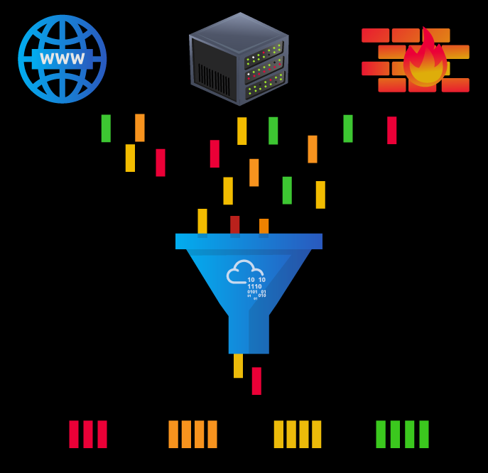
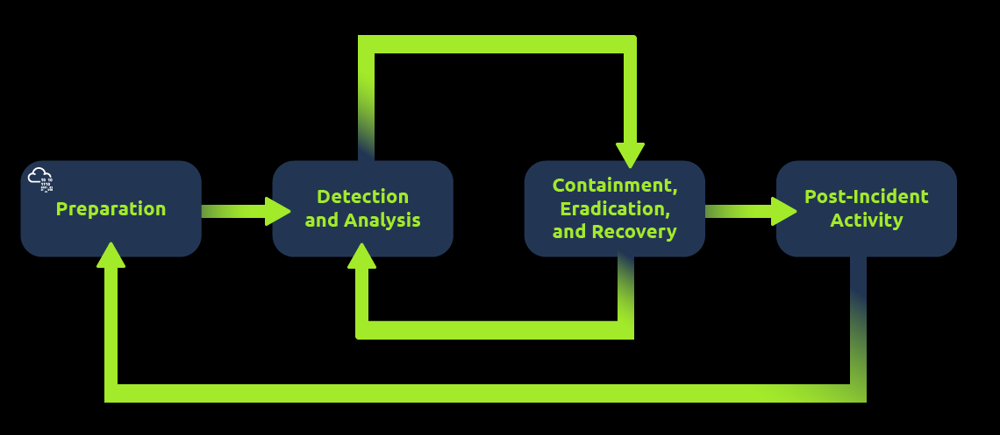
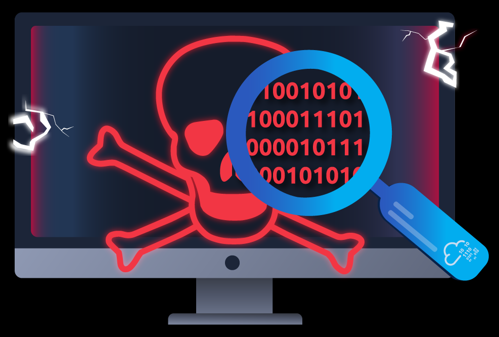

# Defensive Security Intro
## 1. Introduction to Defensive Security
Trong phần trước, chúng ta đã học về **tấn công**, nó tập trung vào xác định và khai thác hệ thống tồn tại lỗ hổng để nâng cao nhận thức về an ninh mạng. Nó bao gồm khai thác lỗi phần mềm, tận dụng những hệ thống thiết lập lỗi, và nói về lợi ích của những policy. Red team và pentester là những người có chuyên môn này

Trong phần học này, chúng ta sẽ phân tích defensive security. Nó tập trung vào 2 phần chính:
1. Chống lại sự xâm nhập
2. Phát hiện xâm nhập khi nó xảy ra và báo cáo chi tiết

Blue team là 1 phần của defensive security 

Một số nhiệm vụ bao gồm:
- Nhận thức của người dùng về an ninh mạng: đào tạo người dùng về an ninh mạng giúp chống lại mục tiêu tấn công
- Lập hồ sơ và quản lí tài sản: chúng ta cần biết về hệ thống và thiết bị chúng ta quản lí và bảo vệ chúng đầy đủ(_adequately_)
- Nâng cấp và vá hệ thống: đảm bảo những máy tính, server, và các thiết bị mạng được update đầy đủ và đúng cách để chống lại những lỗ hổng đã được công bố(_weakness_)
- Thiết lập những thiết bị bảo mật: firewall và những hệ thống phát hiện tấn công(_IPS_) là những thứ cần để phòng thủ. Firewall điều khiển lưu lượng mạng có thể đi vào và đi ra từ hệ thống mạng. **IPS** chặn những lưu lượng mạng xuất hiện đáng ngờ trên mạng, chúng sẽ phát hiện được sự xâm nhập đó

Bài học này sẽ tìm hiểu về defensive security. Bên cạnh những thứ bên trên, chúng ta cũng sẽ tìm hiểu về những chủ đề:
- Security Operations Center(SOC)
- Thread Intelligence
- Digital Forensics And Incident Response
- Malware Analysis

## 2. Areas of Defensives Security
Trong phần này, chúng ta sẽ tìm hiểu về 2 phần chính có liên quan đến defensive security:
- SOC, nó liên quan đến Threat Intelligence
- Digital Forensics and Incident Response(DFIR), nó liên quan đến Malware Analysis

### 1. SOC
SOC là một đội chuyên nghiệp trong an ninh mạng, có nhiệm vụ giám mạng và phát hiện những hoạt động độc hại. Một số phần chính của SOC:
- Lỗ hổng: Khi 1 hệ thống phát hiện có lỗ hổng, điều cần thiết nhất để sửa nó là update và vá nó. Khi việc sửa chưa sẵn sàng, hành động cần thiết phải phòng chống việc attacker khai thác lỗ hổng đó. Mặc dù khắc phục lỗ hổng là cần thiết dành cho SOC nhưng không nhất thiết nhiệm vụ đó được gán cho SOC
- Vi phạm chính sách: 1 chính sách bảo mật là 1 tập hợp các quyền yêu cầu để bảo vệ mạng và hệ thống. Ví dụ, người dùng cố tình đấy tài liệu mật của tổ chức lên trực truyến
- Hoạt động trái phép: Ví dụ 1 trường hợp ở đó thông tin đăng nhập của người dùng bị lấy cắp, và attacker sử dụng nó để login vào hệ thống mạng. SOC phải phát hiện và chặn những hành động đó sớm nhất có thể trước khi nó làm tổn hại đến hệ thống
- Xâm nhập mạng: không có hệ thống nào không có lỗ hổng bảo mật, nó luôn có thể bị xâm nhập. 1 xâm nhập có thể xảy ra khi user click vào 1 link độc hoặc attacker khai thác server công khai. Trường hợp khác, khi xâm nhập xảy ra, chúng ta cần phải phát hiện nó sớm nhất có thể

### 2. Threat Intelligence
Trong phần này, intelligence đề cập tới việc thu thập thông tin về những kẻ tấn công. 1 threat là những hành động có thể làm ảnh hưởng tới hệ thống. Threat Intelligence kết hợp thông tin để giúp tổ chức tốt hơn trong việc chống lại những đối thủ khác. Một số đối thủ tìm kiếm để có thể lấy được dữ liệu người, tuy nhiên, có thể chúng quan tâm đến việc tấn công để gây tổn hại về vật lí

Tình báo cần dữ liệu. Dữ liệu cần được thu thập, xử lý và phân tích. Dữ liệu được thu thập từ các nguồn cục bộ như nhật ký mạng và các nguồn công cộng như diễn đàn. Xử lý dữ liệu sắp xếp chúng thành định dạng phù hợp cho việc phân tích. Giai đoạn phân tích nhằm mục đích tìm thêm thông tin về những kẻ tấn công và động cơ của chúng; hơn nữa, nó nhằm mục đích tạo ra một danh sách các khuyến nghị và các bước hành động cụ thể.

Tìm hiểu về đối thủ giúp bạn nắm được chiến thuật, kỹ thuật và quy trình của chúng. Nhờ thông tin tình báo về mối đe dọa, chúng ta xác định được tác nhân gây ra mối đe dọa (đối thủ) và dự đoán hoạt động của chúng. Do đó, chúng ta có thể giảm thiểu các cuộc tấn công và chuẩn bị chiến lược ứng phó.

### 3. DFIR
Phần này đề cập đến Điều tra pháp y kỹ thuật số và Ứng phó sự cố ( DFIR ), và chúng ta sẽ tìm hiểu về:

- Digital Forensics(*Điều tra pháp y kỹ thuật số*)
- Incident Response(*Ứng phó sự cố*)
- Malware Analysis(*Phân tích phần mềm độc hại*)

#### 1. Digital Forensics
Digital Forensics là việc ứng dụng khoa học để điều tra tội phạm và xác lập sự thật. Với sự phát triển và phổ biến của các hệ thống kỹ thuật số, như máy tính và điện thoại thông minh, một nhánh mới của khoa học pháp y đã ra đời để điều tra các tội phạm liên quan: khoa học pháp y máy tính, sau này phát triển thành  khoa học pháp y kỹ thuật số

Trong lĩnh vực an ninh phòng thủ, trọng tâm của pháp y kỹ thuật số chuyển sang phân tích bằng chứng về một cuộc tấn công và thủ phạm của nó, cũng như các lĩnh vực khác như đánh cắp sở hữu trí tuệ, gián điệp mạng và sở hữu nội dung trái phép. Do đó, pháp y kỹ thuật số sẽ tập trung vào các lĩnh vực khác nhau, chẳng hạn như:
- Hệ thống tập tin : Phân tích ảnh pháp y kỹ thuật số (bản sao cấp thấp) của bộ nhớ hệ thống tiết lộ nhiều thông tin, chẳng hạn như các chương trình đã cài đặt, các tập tin đã tạo, các tập tin bị ghi đè một phần và các tập tin đã bị xóa.
- Bộ nhớ hệ thống: Nếu kẻ tấn công chạy chương trình độc hại của chúng trong bộ nhớ mà không lưu vào ổ đĩa, việc tạo ảnh sao lưu cấp thấp (forensic image) của bộ nhớ hệ thống là cách tốt nhất để phân tích nội dung và tìm hiểu về cuộc tấn công.
- Nhật ký hệ thống: Mỗi máy khách và máy chủ đều duy trì các tệp nhật ký khác nhau về những gì đang xảy ra. Các tệp nhật ký cung cấp rất nhiều thông tin về những gì đã xảy ra trên hệ thống. Ngay cả khi kẻ tấn công cố gắng xóa dấu vết của chúng, một số dấu vết vẫn sẽ còn lại.
- Nhật ký mạng: Nhật ký các gói dữ liệu mạng đã truyền qua mạng sẽ giúp trả lời thêm nhiều câu hỏi về việc liệu một cuộc tấn công có đang xảy ra hay không và hậu quả của nó là gì.

#### 2. Incident Response
Sự cố thường đề cập đến việc rò rỉ dữ liệu hoặc tấn công mạng; tuy nhiên, trong một số trường hợp, nó có thể là điều gì đó ít nghiêm trọng hơn, chẳng hạn như cấu hình sai, nỗ lực xâm nhập hoặc vi phạm chính sách. Ví dụ về tấn công mạng bao gồm việc kẻ tấn công làm cho mạng hoặc hệ thống của chúng ta không thể truy cập được, thay đổi giao diện trang web công cộng và rò rỉ dữ liệu (đánh cắp dữ liệu của công ty). Bạn sẽ phản ứng như thế nào trước một cuộc tấn công mạng? Phản ứng sự cố xác định phương pháp luận cần tuân theo để xử lý trường hợp như vậy. Mục tiêu là giảm thiểu thiệt hại và phục hồi trong thời gian ngắn nhất có thể. Lý tưởng nhất là bạn nên xây dựng một kế hoạch sẵn sàng cho việc phản ứng sự cố.

4 giai đoạn chính của quy trình ứng phó sự cố là:
1. **Chuẩn bị**: Điều này đòi hỏi một đội ngũ được đào tạo và sẵn sàng xử lý các sự cố. Lý tưởng nhất là nên áp dụng nhiều biện pháp để ngăn ngừa sự cố xảy ra ngay từ đầu.
2. **Phát hiện và Phân tích**: Nhóm có đầy đủ nguồn lực cần thiết để phát hiện bất kỳ sự cố nào; hơn nữa, việc phân tích kỹ lưỡng bất kỳ sự cố nào được phát hiện là rất cần thiết để tìm hiểu mức độ nghiêm trọng của nó.
3. **Ngăn chặn, Diệt trừ và Khôi phục**: Khi một sự cố được phát hiện, điều quan trọng là phải ngăn chặn nó ảnh hưởng đến các hệ thống khác, loại bỏ nó và khôi phục các hệ thống bị ảnh hưởng. Ví dụ, khi chúng ta nhận thấy một hệ thống bị nhiễm virus máy tính, chúng ta muốn ngăn chặn (ngăn chặn) virus lây lan sang các hệ thống khác, làm sạch (diệt trừ) virus và đảm bảo khôi phục hệ thống đúng cách.
4. **Hoạt động sau sự cố**: Sau khi khắc phục sự cố thành công, một báo cáo sẽ được lập và bài học kinh nghiệm sẽ được chia sẻ để ngăn ngừa các sự cố tương tự trong tương lai.

#### 3. Malware Analysis
**Malware** là thuật ngữ chỉ phần mềm độc hại. Phần mềm bao gồm các chương trình, tài liệu và tập tin mà bạn có thể lưu trên đĩa hoặc gửi qua mạng. Malware có nhiều loại, ví dụ như:
- **Virus** là một đoạn mã (một phần của chương trình) tự gắn vào một chương trình khác. Nó được thiết kế để lây lan từ máy tính này sang máy tính khác và hoạt động bằng cách thay đổi, ghi đè và xóa các tập tin sau khi lây nhiễm vào máy tính. Hậu quả có thể khiến máy tính hoạt động chậm hoặc thậm chí không thể sử dụng được.
- **Trojan Horse** là một chương trình hiển thị một chức năng có ích nhưng lại che giấu một chức năng độc hại bên trong. Ví dụ, nạn nhân có thể tải xuống một trình phát video từ một trang web đáng ngờ, điều này cho phép kẻ tấn công kiểm soát hoàn toàn hệ thống của họ.
- **Ransomware** là một chương trình độc hại mã hóa các tập tin của người dùng. Việc mã hóa khiến các tập tin không thể đọc được nếu không biết mật khẩu giải mã. Kẻ tấn công sẽ đề nghị cung cấp mật khẩu giải mã cho người dùng nếu người dùng sẵn lòng trả một khoản "tiền chuộc".

Phân tích phần mềm độc hại nhằm mục đích tìm hiểu về các chương trình độc hại đó bằng nhiều phương pháp khác nhau:
1. **Phân tích tĩnh** hoạt động bằng cách kiểm tra chương trình độc hại mà không cần chạy nó. Điều này thường đòi hỏi kiến ​​thức vững chắc về ngôn ngữ lập trình hợp ngữ (tập lệnh của bộ xử lý, tức là các lệnh cơ bản của máy tính).
2. **Phân tích động** hoạt động bằng cách chạy phần mềm độc hại trong một môi trường được kiểm soát và theo dõi các hoạt động của nó. Điều này cho phép bạn quan sát cách phần mềm độc hại hoạt động khi đang chạy.

