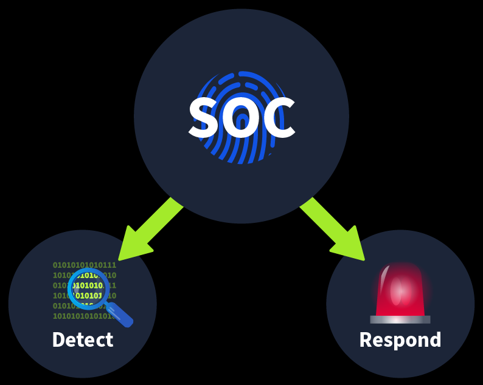
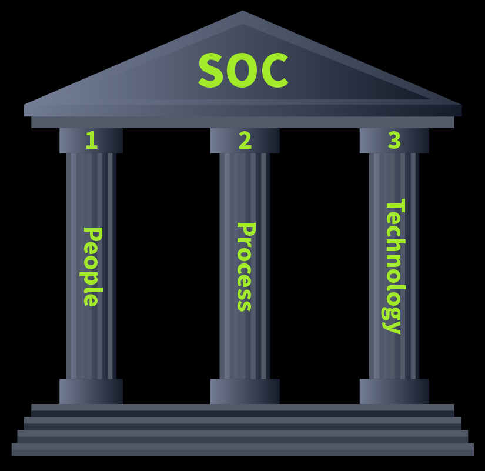
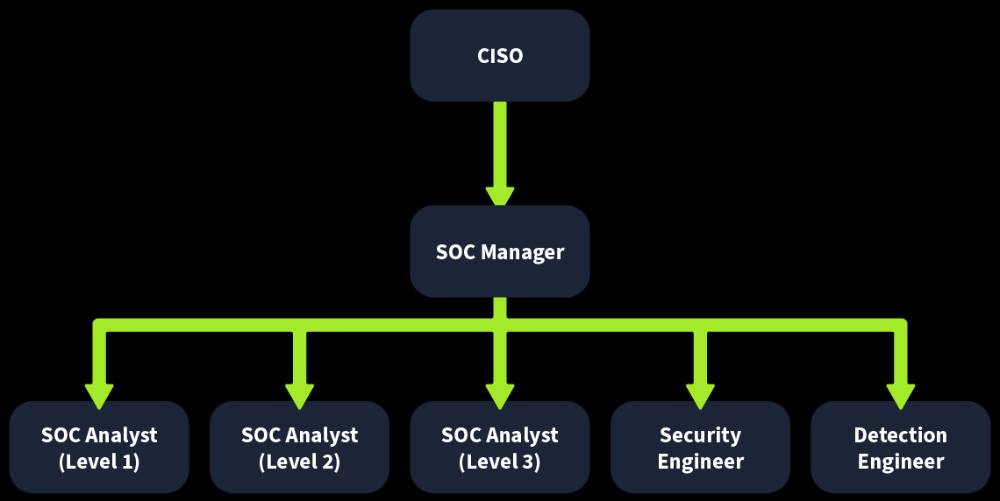

# SOC Fundamentals
## 1. Introduction to SOC
Công nghệ đã giúp cuộc sống của chúng ta hiệu quả hơn, nhưng đi kèm với hiệu quả đó là trách nhiệm lớn hơn. Nỗi lo sợ hiện đại đã khác xa so với việc khai thác tài sản vật chất. Dữ liệu quan trọng, được gọi là bí mật, không còn được lưu trữ trong các tập tin vật lý nữa. Các tổ chức lưu trữ hàng tấn dữ liệu bí mật trong mạng lưới và hệ thống của họ. Bất kỳ sự gián đoạn, mất mát hoặc sửa đổi trái phép nào đối với dữ liệu này đều có thể gây ra thiệt hại lớn cho họ. Các tác nhân đe dọa phát hiện và khai thác các lỗ hổng mới trong các mạng lưới và hệ thống này hàng ngày, trở thành mối lo ngại lớn trong an ninh mạng. Các biện pháp bảo mật truyền thống có thể không đủ để ngăn chặn nhiều mối đe dọa này. Việc dành riêng một nhóm để quản lý an ninh cho tổ chức của bạn là rất quan trọng.

*Trung tâm điều hành an ninh* (`SOC`) là một cơ sở chuyên dụng được vận hành bởi một đội ngũ an ninh chuyên trách. Đội ngũ này có nhiệm vụ liên tục giám sát mạng lưới và tài nguyên của tổ chức, đồng thời xác định các hoạt động đáng ngờ để ngăn chặn thiệt hại. Đội ngũ này làm việc 24/7

Buổi học này sẽ đi sâu vào một số khái niệm chính của SOC , một trong những lĩnh vực quan trọng nhất trong an ninh phòng thủ.

**MỤC TIÊU**:
- Xây dựng nền tảng cơ bản cho SOC
- Phát hiện và phản hồi trong SOC
- Vai trò của Con người, Quy trình và Công nghệ
- Thực hành

## 2. Purpose and component
Trọng tâm chính của nhóm SOC là duy trì khả năng phát hiện và phản hồi . Nhóm SOC có một số nguồn lực sẵn có dưới dạng các giải pháp bảo mật giúp họ thực hiện điều này. Các giải pháp này tích hợp toàn bộ mạng lưới của công ty và tất cả các hệ thống để giám sát chúng từ một vị trí tập trung. Việc giám sát liên tục là cần thiết để phát hiện và phản hồi bất kỳ sự cố bảo mật nào.

### 1. Detection
- **Phát hiện lỗ hổng** : Lỗ hổng là điểm yếu mà kẻ tấn công có thể khai thác để thực hiện các hành động vượt quá quyền hạn của chúng. Lỗ hổng có thể được phát hiện trong phần mềm của bất kỳ thiết bị nào (hệ điều hành và chương trình), chẳng hạn như máy chủ hoặc máy tính. Ví dụ, SOC  có  thể phát hiện một nhóm máy tính chạy hệ điều hành MS Windows cần được vá lỗi đối với một lỗ hổng cụ thể đã được công bố. Nói một cách chính xác, các lỗ hổng không nhất thiết là  trách nhiệm của SOC ; tuy nhiên, các lỗ hổng chưa được khắc phục sẽ ảnh hưởng đến mức độ an ninh của toàn bộ công ty.
- **Phát hiện hoạt động trái phép** : Hãy xem xét trường hợp kẻ tấn công phát hiện ra tên người dùng và mật khẩu của một nhân viên và sử dụng chúng để đăng nhập vào hệ thống của công ty. Việc phát hiện loại hoạt động trái phép này một cách nhanh chóng trước khi nó gây ra bất kỳ thiệt hại nào là rất quan trọng. Nhiều manh mối, chẳng hạn như vị trí địa lý, có thể giúp chúng ta phát hiện ra điều này.
- **Phát hiện vi phạm chính sách** : Chính sách bảo mật là một tập hợp các quy tắc và thủ tục được tạo ra để giúp bảo vệ công ty khỏi các mối đe dọa an ninh và đảm bảo tuân thủ. Những gì được coi là vi phạm sẽ khác nhau tùy thuộc vào từng công ty; ví dụ như tải xuống các tệp phương tiện lậu và gửi các tệp bí mật của công ty một cách không an toàn.
- **Phát hiện xâm nhập** : Xâm nhập đề cập đến việc truy cập trái phép vào các hệ thống và mạng. Một trường hợp là kẻ tấn công khai thác thành công ứng dụng web của chúng ta. Một trường hợp khác là người dùng truy cập vào một trang web độc hại và máy tính của họ bị nhiễm virus.

### 2. Response
- **Hỗ trợ trong quá trình xử lý sự cố** : Khi một sự cố được phát hiện, các bước nhất định sẽ được thực hiện để xử lý. Việc xử lý này bao gồm giảm thiểu tác động và phân tích nguyên nhân gốc rễ của sự cố. Nhóm SOC cũng hỗ trợ nhóm xử lý sự cố thực hiện các bước này.

Một trung tâm điều hành an ninh mạng (SOC) được xây dựng dựa trên 3 trụ cột . Với tất cả các trụ cột này, đội ngũ SOC sẽ trở nên trưởng thành và có khả năng phát hiện cũng như ứng phó hiệu quả với các sự cố khác nhau. Ba trụ cột đó là **Con người** , **Quy trình** và **Công nghệ**

Trong môi trường SOC , **con người** , **quy trình** và **công nghệ** cùng tồn tại . Một nhóm các chuyên gia làm việc với các công cụ bảo mật hiện đại cùng với các quy trình phù hợp là điều tạo nên một môi trường SOC hoàn thiện .

Trong các bài tập sắp tới, chúng ta sẽ thảo luận riêng từng trụ cột này và xem xét tầm quan trọng của chúng đối với SOC .

## 3. People(_Con người_)
Bất kể sự phát triển của việc tự động hóa phần lớn các tác vụ bảo mật, con người trong trung tâm điều hành an ninh (SOC) vẫn luôn đóng vai trò quan trọng. Một giải pháp bảo mật có thể tạo ra vô số cảnh báo nguy hiểm trong môi trường SOC , gây ra sự nhiễu loạn thông tin rất lớn

Hãy tưởng tượng bạn là thành viên của một đội cứu hỏa và có một phần mềm tập trung tích hợp tất cả các báo cháy của thành phố. Giả sử bạn nhận được nhiều thông báo cháy cùng một lúc, từ nhiều địa điểm khác nhau. Khi đến nơi, đội của bạn phát hiện ra hầu hết các vụ cháy đó chỉ do khói quá nhiều từ việc nấu nướng gây ra. Cuối cùng, mọi nỗ lực sẽ trở nên vô ích về thời gian và nguồn lực

Trong một trung tâm điều hành an ninh (SOC) , với các giải pháp bảo mật được thiết lập mà không cần sự can thiệp của con người, bạn sẽ tập trung vào những vấn đề không liên quan nhiều. Luôn có những  người giúp giải pháp bảo mật xác định các hoạt động thực sự nguy hiểm và cho phép phản ứng kịp thời.

Những người này được gọi là nhóm SOC . Nhóm này có các vai trò và trách nhiệm sau đây.

- **Chuyên viên phân tích SOC (Cấp độ 1)**: Bất kỳ mối đe dọa nào được giải pháp bảo mật phát hiện đều sẽ được các chuyên viên phân tích này xử lý trước tiên. Họ là những người phản hồi đầu tiên đối với bất kỳ phát hiện nào. Chuyên viên phân tích SOC cấp độ 1 thực hiện phân loại cảnh báo cơ bản để xác định xem một phát hiện cụ thể có gây hại hay không. Họ cũng báo cáo những phát hiện này thông qua các kênh thích hợp.
- **Chuyên viên phân tích SOC (Cấp độ 2)** :Trong khi Chuyên viên cấp độ 1 thực hiện phân tích ở cấp độ đầu tiên, một số phát hiện có thể yêu cầu điều tra sâu hơn. Chuyên viên cấp độ 2 giúp họ đi sâu hơn vào quá trình điều tra và đối chiếu dữ liệu từ nhiều nguồn dữ liệu để thực hiện phân tích chính xác.
- **Chuyên viên Phân tích SOC (Cấp độ 3)** : Chuyên viên phân tích cấp độ 3 là những chuyên gia giàu kinh nghiệm, chủ động tìm kiếm các dấu hiệu đe dọa và hỗ trợ các hoạt động ứng phó sự cố. Các sự cố nghiêm trọng được phát hiện bởi chuyên viên phân tích cấp độ 1 và cấp độ 2 thường là các sự cố bảo mật cần phản ứng chi tiết, bao gồm ngăn chặn, loại bỏ và phục hồi. Đây là lúc kinh nghiệm của chuyên viên phân tích cấp độ 3 phát huy tác dụng.
- **Kỹ sư bảo mật(Security Engineer)**: Tất cả các nhà phân tích đều làm việc với các giải pháp bảo mật. Các giải pháp này cần được triển khai và cấu hình. Kỹ sư bảo mật sẽ triển khai và cấu hình các giải pháp bảo mật này để đảm bảo chúng hoạt động trơn tru.
- **Kỹ sư phát hiện(Dectection Engineer)**: Các quy tắc bảo mật là logic được xây dựng đằng sau các giải pháp bảo mật để phát hiện các hoạt động độc hại. Các chuyên viên phân tích cấp 2 và 3 thường tạo ra các quy tắc này, trong khi nhóm SOC đôi khi cũng có thể sử dụng vai trò kỹ sư phát hiện một cách độc lập cho trách nhiệm này.
- **SOC Manager**: chịu trách nhiệm quản lý các quy trình mà nhóm SOC tuân theo và cung cấp hỗ trợ. Quản lý SOC cũng duy trì liên lạc với CISO (Giám đốc An ninh Thông tin) của tổ chức để cập nhật tình hình và nỗ lực bảo mật hiện tại của nhóm SOC .

_*Lưu ý_: Vai trò trong nhóm SOC có thể tăng hoặc giảm tùy thuộc vào quy mô và mức độ quan trọng của tổ chức.

