# Digital Forensic Fundamentals
## 1. Introduction to Digital Forensics Fundamentals
**Digital Forensics** là việc áp dụng các phương pháp và quy trình để điều tra và giải quyết tội phạm. Ngành khoa học pháp y chuyên điều tra tội phạm mạng được gọi là khoa học pháp y kỹ thuật số. Tội phạm mạng là bất kỳ hoạt động tội phạm nào được thực hiện trên hoặc sử dụng thiết bị kỹ thuật số. Nhiều công cụ và kỹ thuật được sử dụng để điều tra kỹ lưỡng các thiết bị kỹ thuật số sau khi xảy ra tội phạm nhằm tìm kiếm và phân tích bằng chứng cho các hành động pháp lý cần thiết.

Các thiết bị kỹ thuật số đã giải quyết được nhiều vấn đề của chúng ta. Việc liên lạc trên toàn cầu chỉ đơn giản là một tin nhắn hoặc cuộc gọi. Do việc sử dụng rộng rãi các thiết bị kỹ thuật số, bên cạnh việc làm cho cuộc sống dễ dàng hơn, tội phạm kỹ thuật số - tội phạm mạng - cũng gia tăng. Nhiều loại tội phạm được thực hiện bằng các thiết bị kỹ thuật số.

Hãy xem xét ví dụ về việc cơ quan thực thi pháp luật đột kích vào nhà của một tên cướp ngân hàng với lệnh khám xét hợp lệ. Một số thiết bị kỹ thuật số, bao gồm máy tính xách tay, điện thoại di động, ổ cứng và USB, đã được tìm thấy trong nhà của tên cướp. Cơ quan thực thi pháp luật đã chuyển giao vụ án cho đội pháp y kỹ thuật số. Nhóm này đã thu thập bằng chứng một cách an toàn và tiến hành điều tra kỹ lưỡng trong phòng thí nghiệm pháp y kỹ thuật số được trang bị các công cụ pháp y. Các bằng chứng sau đây đã được tìm thấy trên các thiết bị kỹ thuật số:
- Một bản đồ kỹ thuật số của ngân hàng đã được tìm thấy trên máy tính xách tay của nghi phạm, thứ mà hắn giữ lại để lên kế hoạch cho vụ cướp.
- Một tài liệu chứa sơ đồ lối vào và lối thoát hiểm của ngân hàng đã được tìm thấy trên ổ cứng của nghi phạm.
- Một tài liệu trên ổ cứng liệt kê tất cả các biện pháp kiểm soát an ninh vật lý của ngân hàng. Nghi phạm đã lên kế hoạch để vượt qua các biện pháp an ninh này.
- Một số tập tin đa phương tiện, bao gồm ảnh và video về các vụ cướp trước đó của nghi phạm, được tìm thấy trong máy tính xách tay của nghi phạm.
- Sau khi tiến hành điều tra kỹ lưỡng điện thoại di động của nghi phạm, cảnh sát cũng tìm thấy một số nhóm chat bất hợp pháp và nhật ký cuộc gọi liên quan đến vụ cướp ngân hàng.

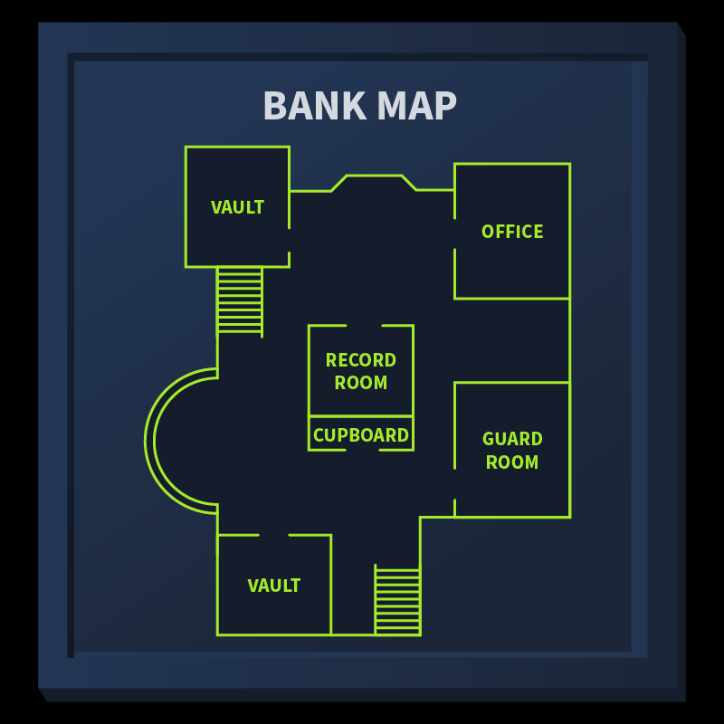

Tất cả những bằng chứng này đã giúp cơ quan thực thi pháp luật trong quá trình tố tụng vụ án. Tình huống này thảo luận về một vụ án từ đầu đến cuối. Nhóm pháp y kỹ thuật số tuân theo một số quy trình nhất định trong quá trình thu thập bằng chứng, lưu trữ, phân tích và báo cáo. Phần học này sẽ tập trung vào việc giúp học viên hiểu rõ các quy trình này. Sau đây là các mục tiêu học tập của phần học này:

**Mục tiêu học tập**
- Các giai đoạn của điều tra pháp y kỹ thuật số
- Các loại pháp y kỹ thuật số
- Quy trình thu thập bằng chứng
- Điều tra pháp y Windows
- Giải quyết một vụ án pháp y

## 2. Digital Forensics Methodology
Nhóm pháp y kỹ thuật số xử lý nhiều vụ việc khác nhau, đòi hỏi các công cụ và kỹ thuật khác nhau. Tuy nhiên, Viện Tiêu chuẩn và Công nghệ Quốc gia ( NIST ) đã định nghĩa một quy trình chung cho mọi trường hợp. NIST đang nỗ lực định hình các khuôn khổ cho các lĩnh vực công nghệ khác nhau, bao gồm an ninh mạng, nơi họ giới thiệu quy trình pháp y kỹ thuật số theo 4 giai đoạn.
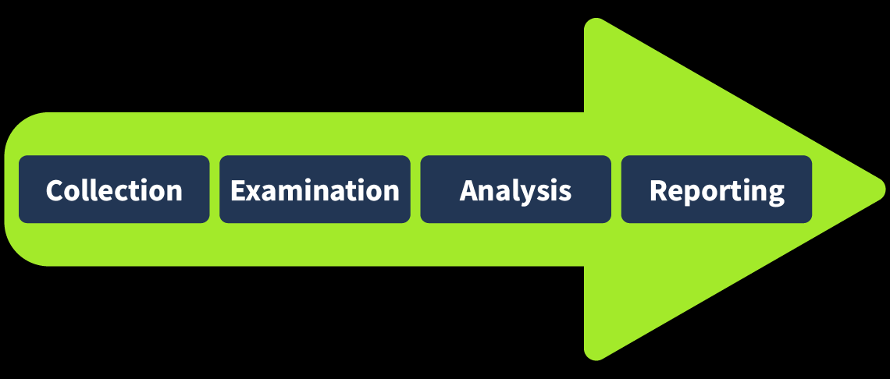

1. **Thu thập(Collection)**: Giai đoạn đầu tiên của điều tra pháp y kỹ thuật số là thu thập dữ liệu. Việc xác định tất cả các thiết bị có thể thu thập dữ liệu là rất cần thiết. Thông thường, điều tra viên có thể tìm thấy máy tính cá nhân, máy tính xách tay, máy ảnh kỹ thuật số, USB, v.v., tại hiện trường vụ án. Điều cần thiết là phải đảm bảo dữ liệu gốc không bị giả mạo trong quá trình thu thập bằng chứng và phải lưu giữ đầy đủ tài liệu ghi chép chi tiết các vật phẩm đã thu thập. Chúng ta cũng sẽ thảo luận về các thủ tục thu thập bằng chứng trong các bài tập sắp tới.
2. **Kiểm tra(Examination)**: Lượng dữ liệu thu thập được có thể quá lớn khiến các nhà điều tra choáng ngợp. Dữ liệu này thường cần được lọc và trích xuất những dữ liệu cần thiết. Ví dụ, với tư cách là một nhà điều tra, bạn đã thu thập tất cả các tệp phương tiện từ một máy ảnh kỹ thuật số tại hiện trường vụ án. Bạn có thể chỉ cần một số tệp phương tiện nhất định vì bạn quan tâm đến dữ liệu được ghi lại vào một ngày và giờ cụ thể. Vì vậy, trong giai đoạn kiểm tra, bạn sẽ lọc các tệp phương tiện theo thời gian cần thiết và chuyển chúng sang giai đoạn tiếp theo. Tương tự, bạn có thể chỉ cần dữ liệu của một người dùng cụ thể từ một hệ thống chứa nhiều tài khoản người dùng. Giai đoạn kiểm tra giúp bạn lọc dữ liệu cụ thể này để phân tích.
3. **Phân tích(Analys)**: Đây là giai đoạn then chốt. Các nhà điều tra lúc này phải phân tích dữ liệu bằng cách đối chiếu với nhiều bằng chứng khác nhau để đưa ra kết luận. Việc phân tích phụ thuộc vào tình huống cụ thể và dữ liệu hiện có. Mục tiêu của phân tích là trích xuất các hoạt động liên quan đến vụ án theo trình tự thời gian.
4. **Báo cáo(Reporting)**: Ở giai đoạn cuối cùng của điều tra pháp y kỹ thuật số, một báo cáo chi tiết được lập ra. Báo cáo này bao gồm phương pháp điều tra và các phát hiện chi tiết từ bằng chứng thu thập được. Nó cũng có thể bao gồm các khuyến nghị. Báo cáo này được trình bày cho cơ quan thực thi pháp luật và ban quản lý cấp cao. Điều quan trọng là phải bao gồm các bản tóm tắt dành cho ban quản lý trong báo cáo, xem xét mức độ hiểu biết của tất cả các bên nhận báo cáo.

Trong giai đoạn thu thập chứng cứ, chúng tôi nhận thấy có thể tìm thấy nhiều loại chứng cứ khác nhau tại hiện trường vụ án. Việc phân tích các loại chứng cứ này đòi hỏi nhiều công cụ và kỹ thuật khác nhau. Có nhiều loại pháp y kỹ thuật số, mỗi loại đều có phương pháp thu thập và phân tích riêng. Một số loại phổ biến nhất được liệt kê dưới đây.

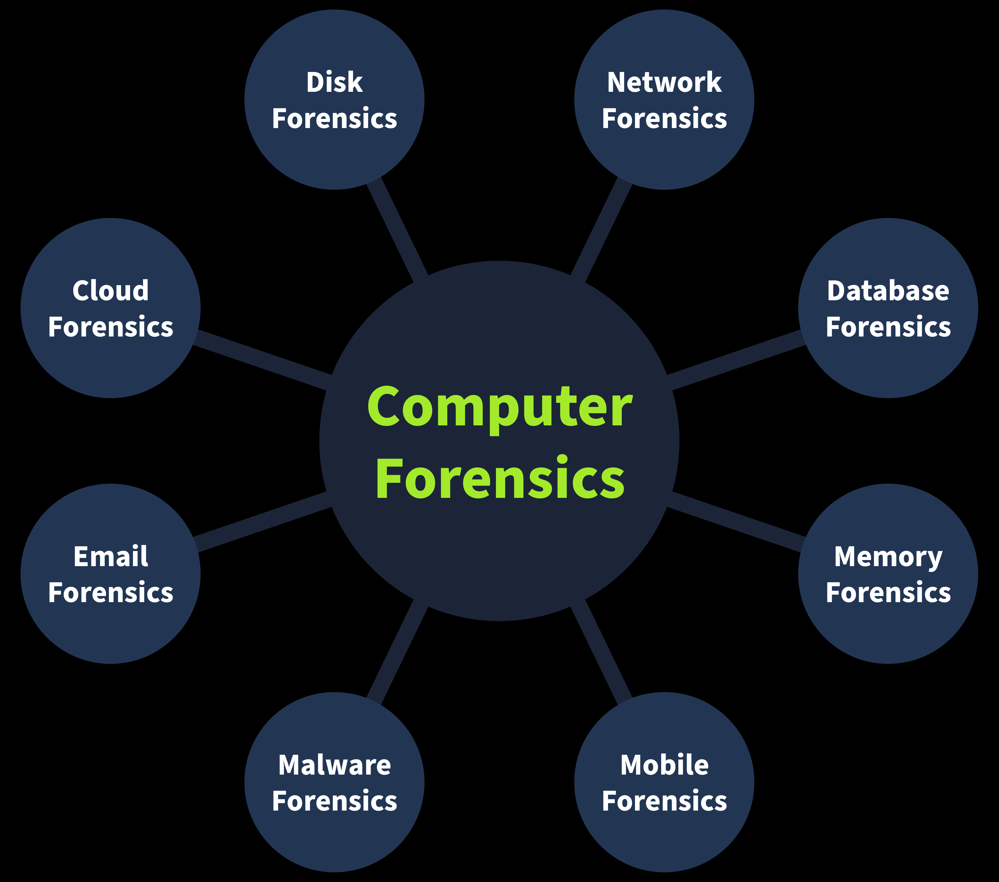

- **Computer Forensics**:  Loại điều tra tội phạm kỹ thuật số phổ biến nhất là điều tra tội phạm máy tính, tập trung vào việc điều tra máy tính, thiết bị thường được sử dụng nhất trong các vụ án hình sự.
- **Mobile Forensics**: Điều tra pháp y thiết bị di động bao gồm việc điều tra các thiết bị di động và trích xuất bằng chứng như _nhật ký cuộc gọi, tin nhắn văn bản, vị trí GPS, v.v._
- **Network Forensics**: Lĩnh vực pháp y này bao gồm điều tra không chỉ các thiết bị riêng lẻ mà còn toàn bộ mạng lưới. Phần lớn bằng chứng được tìm thấy trong mạng lưới là **nhật ký lưu lượng mạng**.
- **Database Forensics**: Nhiều dữ liệu quan trọng được lưu trữ trong các cơ sở dữ liệu chuyên dụng. Điều tra pháp y cơ sở dữ liệu sẽ điều tra bất kỳ sự xâm nhập nào vào các cơ sở dữ liệu này dẫn đến việc sửa đổi hoặc đánh cắp dữ liệu.
- **Cloud Forensics**: Điều tra pháp y trên đám mây là loại điều tra pháp y liên quan đến việc nghiên cứu dữ liệu được lưu trữ trên cơ sở hạ tầng đám mây. Loại điều tra pháp y này đôi khi khá khó khăn đối với các nhà điều tra vì có rất ít bằng chứng trên cơ sở hạ tầng đám mây.
- **Email Forensics**: Email, phương thức liên lạc phổ biến nhất giữa các chuyên gia, đã trở thành một phần quan trọng của phân tích kỹ thuật số. Email được điều tra để xác định xem chúng có phải là một phần của các chiến dịch lừa đảo hoặc gian lận hay không.

## 3. Evidence Acquisition(_Thu thập bằng chứng_)
Thu thập bằng chứng là một công việc vô cùng quan trọng. Nhóm pháp y phải thu thập tất cả bằng chứng một cách an toàn mà không làm thay đổi dữ liệu gốc. Phương pháp thu thập bằng chứng đối với các thiết bị kỹ thuật số phụ thuộc vào loại thiết bị kỹ thuật số đó. Tuy nhiên, cần tuân thủ một số quy trình chung trong quá trình thu thập bằng chứng. Chúng ta hãy cùng thảo luận về một số quy trình quan trọng đó.

### 1. Proper Authorization(_Ủy quyền thu thập_)
Nhóm pháp y cần phải được sự cho phép của các cơ quan có thẩm quyền trước khi thu thập bất kỳ dữ liệu nào. Bằng chứng thu thập được mà không có sự chấp thuận trước có thể bị coi là không thể chấp nhận được tại tòa án. Bằng chứng pháp y chứa dữ liệu riêng tư và nhạy cảm của một tổ chức hoặc cá nhân. Việc được cấp phép đúng cách trước khi thu thập dữ liệu này là điều cần thiết để tiến hành điều tra theo đúng giới hạn của pháp luật.

### 2. Chain of Custody(_Chuỗi bằng chứng thu thập_)
Hãy tưởng tượng một nhóm điều tra viên thu thập tất cả bằng chứng từ hiện trường vụ án, và một số bằng chứng bị mất tích sau vài ngày, hoặc có bất kỳ sự thay đổi nào về bằng chứng. Trong trường hợp này, không ai có thể chịu trách nhiệm vì không có quy trình thích hợp để ghi nhận chủ sở hữu bằng chứng. Vấn đề này có thể được giải quyết bằng cách duy trì một tài liệu chuỗi giám sát bằng chứng . Chuỗi giám sát bằng chứng là một tài liệu chính thức chứa tất cả các chi tiết về bằng chứng. Một số chi tiết quan trọng được liệt kê dưới đây:
- Mô tả bằng chứng (tên, loại).
- Tên của những cá nhân đã thu thập bằng chứng.
- Ngày và giờ thu thập bằng chứng.
- Vị trí lưu trữ của từng bằng chứng.
- Thời gian truy cập và hồ sơ cá nhân của người đã truy cập bằng chứng.

Điều này tạo ra một chuỗi bằng chứng rõ ràng và giúp bảo quản chúng. Tài liệu chuỗi bằng chứng có thể được sử dụng để chứng minh tính toàn vẹn và độ tin cậy của bằng chứng được đưa ra trước tòa. Bạn có thể tải xuống  mẫu chuỗi bằng chứng [từ đây](https://www.nist.gov/document/sample-chain-custody-formdocx)

### 3. Use of Write Blockers(_Sử dụng các công cụ ngăn việc chỉnh sửa_)
**Write Blockers** là một phần thiết yếu trong bộ công cụ của nhóm điều tra pháp y kỹ thuật số. Giả sử bạn đang thu thập bằng chứng từ ổ cứng của nghi phạm và kết nối ổ cứng với máy trạm pháp y. Trong quá trình thu thập, một số tác vụ nền trên máy trạm pháp y có thể thay đổi dấu thời gian của các tệp trên ổ cứng. Điều này có thể gây trở ngại trong quá trình phân tích, cuối cùng dẫn đến kết quả không chính xác. Giả sử dữ liệu được thu thập từ ổ cứng bằng cách sử dụng bộ chặn ghi trong cùng kịch bản đó. Lần này, ổ cứng của nghi phạm sẽ vẫn ở trạng thái ban đầu vì bộ chặn ghi có thể ngăn chặn mọi hành động thay đổi bằng chứng.

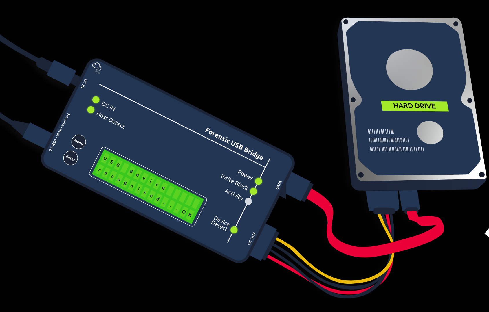

## 4. Windows Forensics
Các loại bằng chứng phổ biến nhất được thu thập từ hiện trường vụ án là máy tính để bàn và máy tính xách tay, vì hầu hết các hoạt động tội phạm đều liên quan đến hệ thống cá nhân. Các thiết bị này chạy các hệ điều hành khác nhau. Trong bài tập này, chúng ta sẽ thảo luận về việc thu thập và phân tích bằng chứng của hệ điều hành Windows, một hệ điều hành rất phổ biến đã được điều tra trong nhiều vụ án.

Trong giai đoạn thu thập dữ liệu, các ảnh sao lưu pháp y của hệ điều hành Windows được tạo ra. Những ảnh sao lưu pháp y này là bản sao từng bit của toàn bộ hệ điều hành. Có hai loại ảnh sao lưu pháp y khác nhau được tạo ra từ hệ điều hành Windows.

- **Disk image**: Ảnh đĩa chứa tất cả dữ liệu có trên thiết bị lưu trữ của hệ thống (HDD, SSD, v.v.). Dữ liệu này là dữ liệu không biến đổi, có nghĩa là dữ liệu trên đĩa sẽ vẫn còn nguyên vẹn ngay cả sau khi khởi động lại hệ điều hành. Ví dụ: tất cả các tệp như phương tiện truyền thông, tài liệu, lịch sử duyệt web, và nhiều hơn nữa.

- **Memory image**: Ảnh bộ nhớ chứa dữ liệu bên trong RAM của hệ điều hành . Bộ nhớ này là bộ nhớ khả biến, nghĩa là dữ liệu sẽ bị mất sau khi hệ thống tắt nguồn hoặc khởi động lại. Ví dụ, để thu thập các tệp đang mở, các tiến trình đang chạy, các kết nối mạng hiện tại, v.v., ảnh bộ nhớ cần được ưu tiên và chụp trước tiên từ hệ điều hành của nghi phạm; nếu không, bất kỳ việc khởi động lại hoặc tắt hệ thống nào cũng sẽ dẫn đến việc tất cả dữ liệu khả biến bị xóa. Khi thực hiện điều tra pháp y kỹ thuật số trên hệ điều hành Windows, việc thu thập ảnh đĩa và ảnh bộ nhớ là rất quan trọng.

Hãy cùng thảo luận về một số công cụ phổ biến được sử dụng để thu thập và phân tích ảnh đĩa và bộ nhớ của hệ điều hành Windows.

**FTK Imager**: FTK Imager là một công cụ được sử dụng rộng rãi để tạo ảnh đĩa của hệ điều hành Windows. Nó cung cấp giao diện đồ họa thân thiện với người dùng để tạo ảnh ở nhiều định dạng khác nhau. Công cụ này cũng có thể phân tích nội dung của ảnh đĩa. Nó có thể được sử dụng cho cả mục đích thu thập và phân tích.

**Autopsy**: Autopsy là một nền tảng pháp y kỹ thuật số mã nguồn mở phổ biến. Điều tra viên có thể nhập ảnh đĩa thu được vào công cụ này, và công cụ sẽ tiến hành phân tích chuyên sâu ảnh đó. Nó cung cấp nhiều tính năng trong quá trình phân tích ảnh, bao gồm tìm kiếm từ khóa, khôi phục tập tin đã xóa, siêu dữ liệu tập tin, phát hiện lỗi không khớp phần mở rộng, và nhiều hơn nữa.

**DumpIt**: DumpIt cung cấp tiện ích tạo ảnh bộ nhớ từ hệ điều hành Windows. Công cụ này tạo ảnh bộ nhớ bằng giao diện dòng lệnh và một vài lệnh. Ảnh bộ nhớ cũng có thể được tạo ở nhiều định dạng khác nhau.

**Volatility**: Volatility là một công cụ mã nguồn mở mạnh mẽ để phân tích ảnh bộ nhớ. Nó cung cấp một số plugin cực kỳ hữu ích. Mỗi hiện vật có thể được phân tích bằng một plugin cụ thể. Công cụ này hỗ trợ nhiều hệ điều hành khác nhau, bao gồm *Windows, Linux , macOS và Android*.

Lưu ý: Nhiều công cụ khác cũng được sử dụng để thu thập và phân tích ảnh đĩa và bộ nhớ của hệ điều hành Windows.

## 5. Ví dụ về Digital Forensics
Mọi hoạt động chúng ta thực hiện trên các thiết bị kỹ thuật số, từ điện thoại thông minh đến máy tính, đều để lại dấu vết. Hãy cùng xem chúng ta có thể sử dụng điều này như thế nào trong cuộc điều tra tiếp theo.

Con mèo nhà chúng tôi, Gado, đã bị bắt cóc. Kẻ bắt cóc đã gửi cho chúng tôi một tài liệu với các yêu cầu của chúng ở định dạng MS Word. Chúng tôi đã chuyển đổi tài liệu đó sang định dạng PDF và trích xuất hình ảnh từ tệp MS Word để thuận tiện cho các bạn.

Khi bạn tạo một tệp văn bản, `TXT` một số siêu dữ liệu sẽ được hệ điều hành lưu lại, chẳng hạn như ngày tạo tệp và ngày sửa đổi cuối cùng. Tuy nhiên, nhiều thông tin hơn được lưu giữ trong siêu dữ liệu của tệp khi bạn sử dụng trình soạn thảo nâng cao hơn, chẳng hạn như **MS Word**. Có nhiều cách để đọc siêu dữ liệu của tệp; bạn có thể mở chúng bằng trình xem/soạn thảo chính thức hoặc sử dụng công cụ phân tích pháp y phù hợp. Lưu ý rằng việc xuất tệp sang các định dạng khác, chẳng hạn như `PDF`, sẽ giữ lại hầu hết siêu dữ liệu của tài liệu gốc, tùy thuộc vào trình ghi `PDF` được sử dụng.

Hãy xem chúng ta có thể học được gì từ tập tin PDF. Chúng ta có thể thử đọc siêu dữ liệu bằng chương trình ` pdfinfo`. `pdfinfo` hiển thị nhiều siêu dữ liệu liên quan đến tập tin PDF, chẳng hạn như tiêu đề, chủ đề, tác giả, người tạo và ngày tạo. (AttackBox đã cài đặt sẵn `pdfinfo`; tuy nhiên, nếu bạn đang sử dụng Kali Linux và chưa cài đặt `pdfinfo`, bạn có thể cài đặt nó bằng `sudo apt install poppler-utils npm install pdfinfo`.) Hãy xem ví dụ sau về cách sử dụng `pdfinfo DOCUMENT.pdf`:

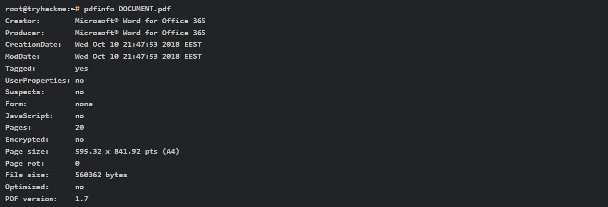

Thông tin siêu dữ liệu của tệp PDF cho thấy rõ ràng rằng nó được tạo bằng **MS Word cho Office 365** vào **ngày 10 tháng 10 năm 2018**.

**Photo EXIF Data**
**EXIF** là viết tắt của **Exchangeable Image File Format** (Định dạng Tệp Hình ảnh Có thể Trao đổi); đây là một tiêu chuẩn để lưu trữ siêu dữ liệu vào các tệp hình ảnh. Mỗi khi bạn chụp ảnh bằng điện thoại thông minh hoặc máy ảnh kỹ thuật số, rất nhiều thông tin sẽ được nhúng vào hình ảnh. Sau đây là một số ví dụ về siêu dữ liệu có thể tìm thấy trong các hình ảnh kỹ thuật số gốc:

- Mẫu máy ảnh / Mẫu điện thoại thông minh
- Ngày và giờ chụp ảnh
- Các thiết lập chụp ảnh như tiêu cự, khẩu độ, tốc độ màn trập và cài đặt ISO.

Vì điện thoại thông minh được trang bị cảm biến GPS, nên việc tìm thấy tọa độ GPS được nhúng trong hình ảnh là rất có thể. Tọa độ GPS, tức là vĩ độ và kinh độ, thường cho biết vị trí chụp ảnh.

Có rất nhiều công cụ trực tuyến và ngoại tuyến để đọc dữ liệu EXIF ​​từ hình ảnh. Một công cụ dòng lệnh là **ExifTool**. ExifTool được sử dụng để đọc và ghi siêu dữ liệu trong nhiều loại tệp khác nhau, chẳng hạn như hình ảnh JPEG. AttackBox đã cài đặt sẵn ExifTool; tuy nhiên, nếu bạn đang sử dụng Kali Linux và chưa cài đặt, bạn có thể cài đặt nó bằng lệnh `sudo apt install libimage-exiftool-perl`. Trong cửa sổ terminal sau, chúng ta đã thực hiện lệnh `npm install ExifTool` để đọc tất cả dữ liệu EXIF ​​được nhúng trong hình ảnh này `exiftool IMAGE.jpg`

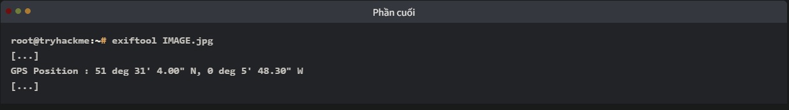

Nếu bạn lấy tọa độ trên và tìm kiếm trên một trong các bản đồ trực tuyến, bạn sẽ biết thêm về vị trí này. Tìm kiếm trên **Microsoft Bing Maps** hoặc **Google Maps** sẽ hiển thị con phố nơi bức ảnh được chụp. Lưu ý rằng để tìm kiếm hoạt động, chúng tôi đã phải thay thế `deg` bằng `°` và loại bỏ khoảng trắng thừa. Nói cách khác, chúng tôi đã nhập `51°30'51.9"N 0°05'38.7"W` vào thanh tìm kiếm bản đồ.

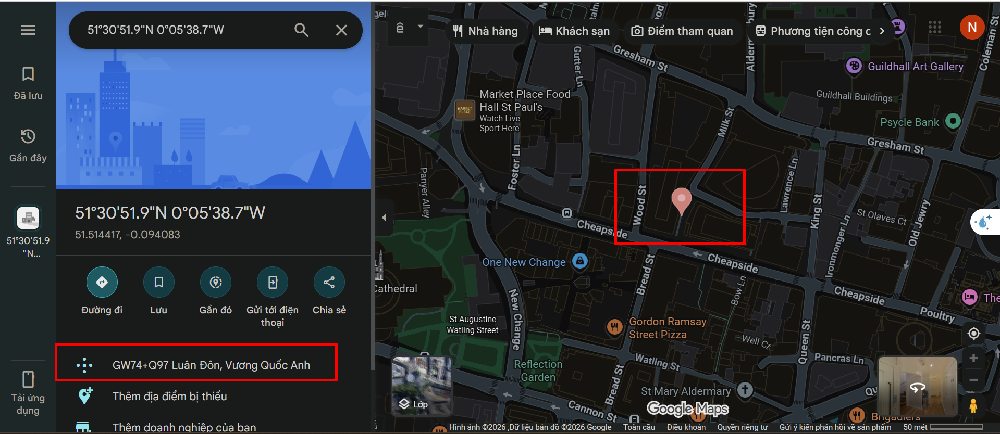

### 1.  hãy tìm tác giả của tệp PDF đính kèm ransom-letter.pdf
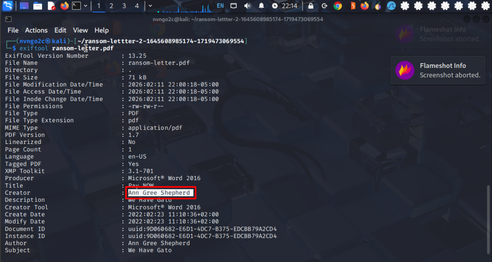

### 2. Sử dụng Google Maps exiftool hoặc bất kỳ công cụ tương tự nào, hãy thử tìm xem bọn bắt cóc đã lấy bức ảnh chúng đính kèm vào tài liệu ở đâu. Tên đường là gì?

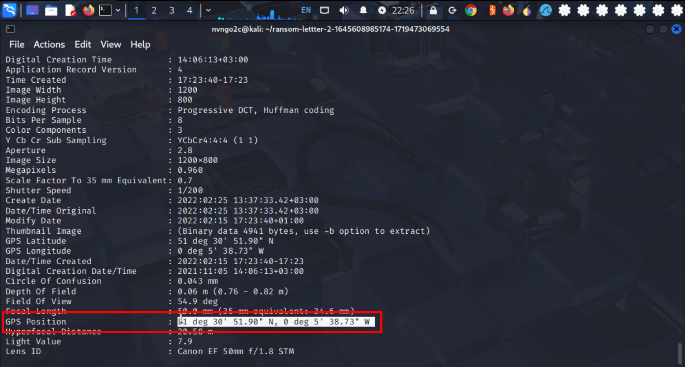

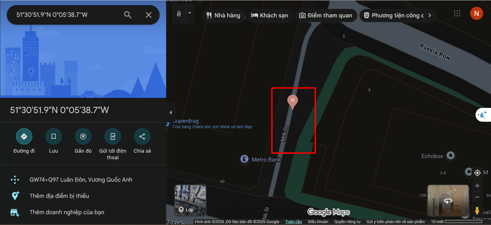

### 3. Tên của máy ảnh
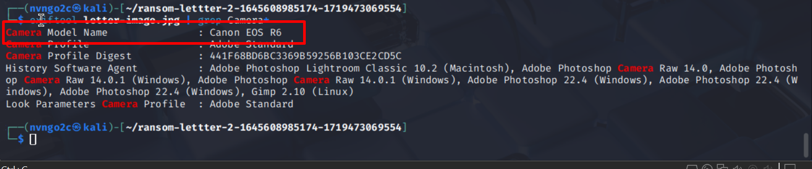

