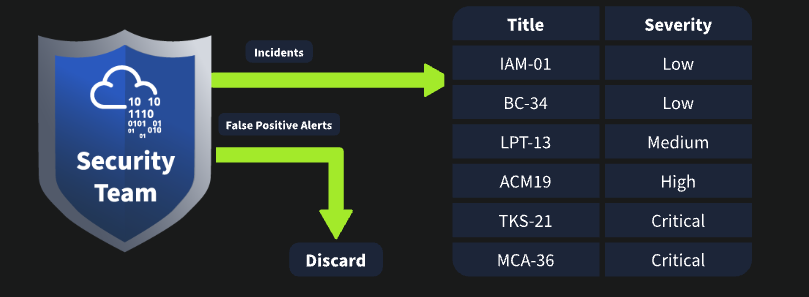
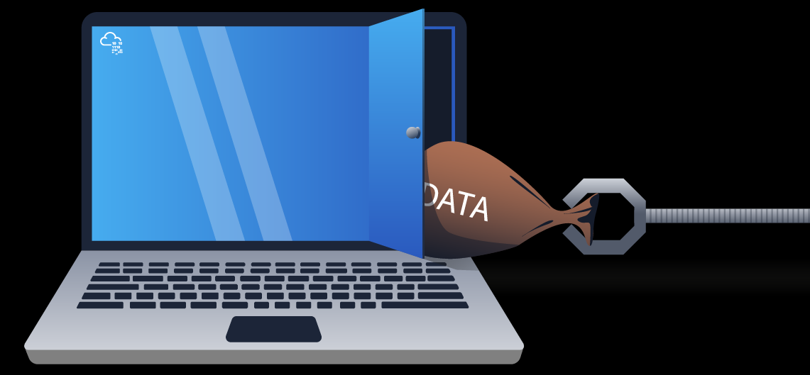
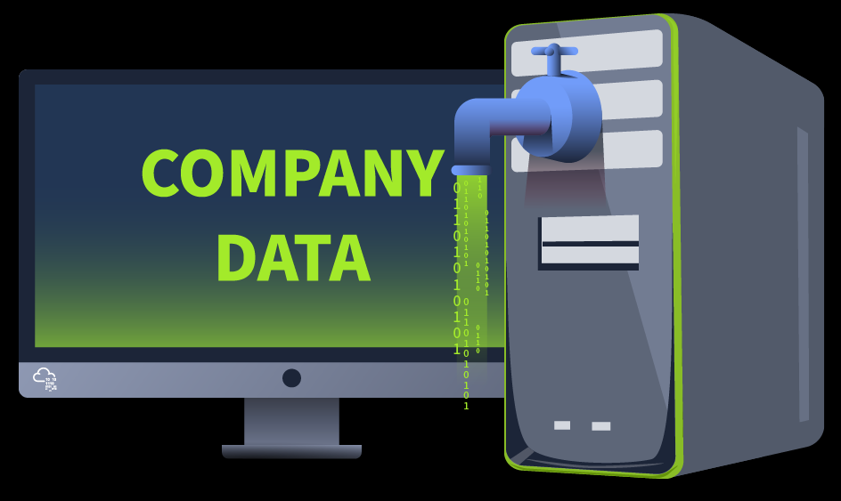
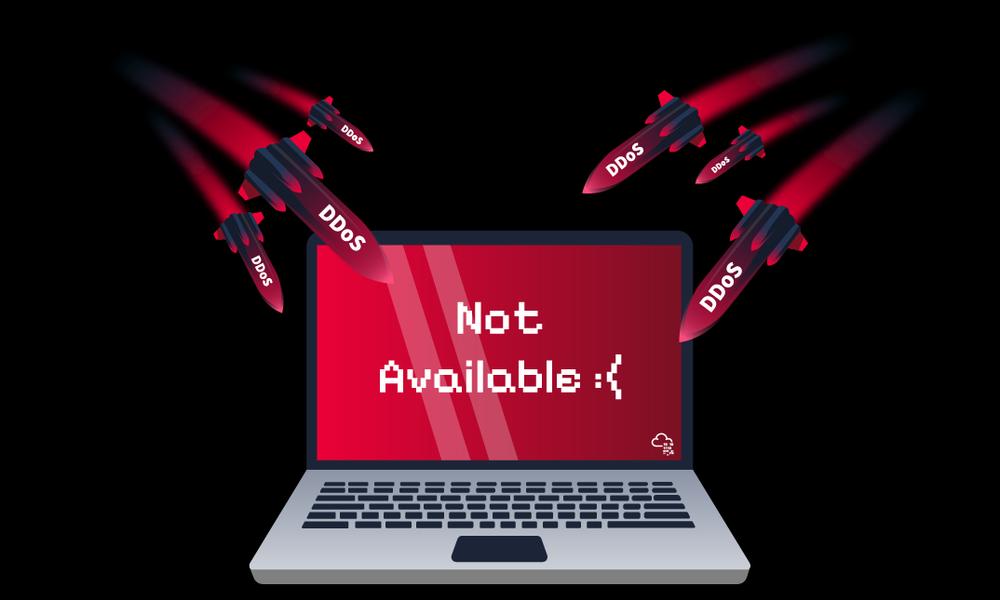
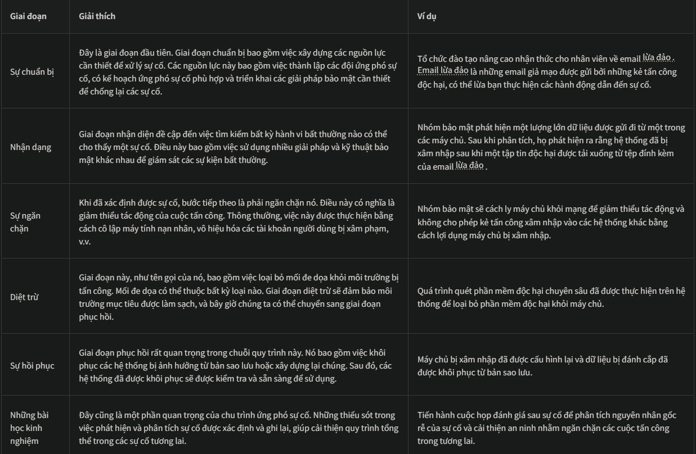
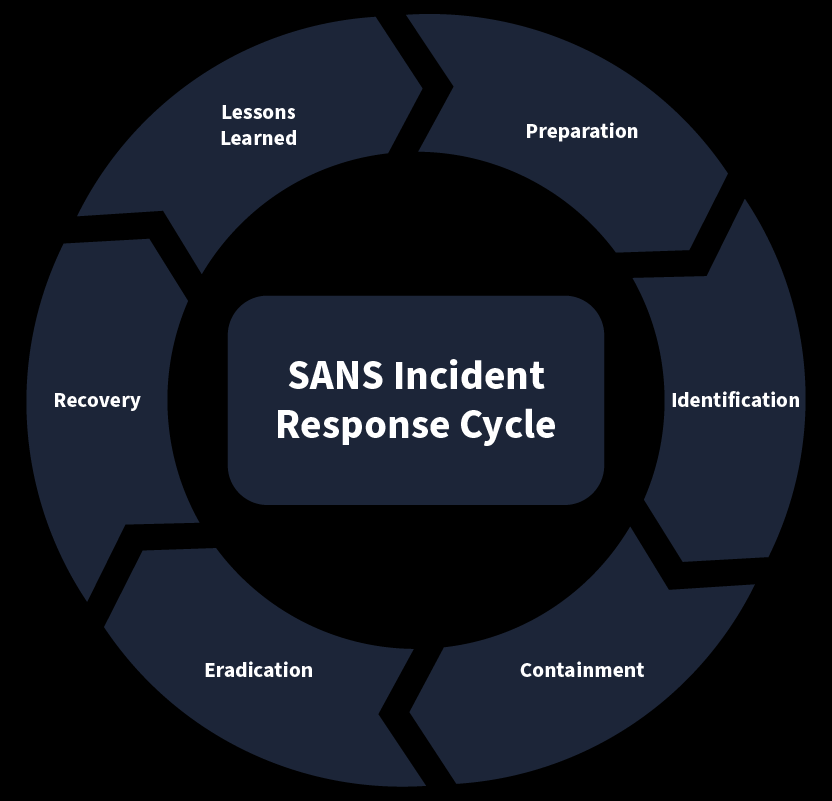
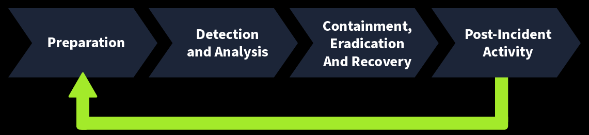
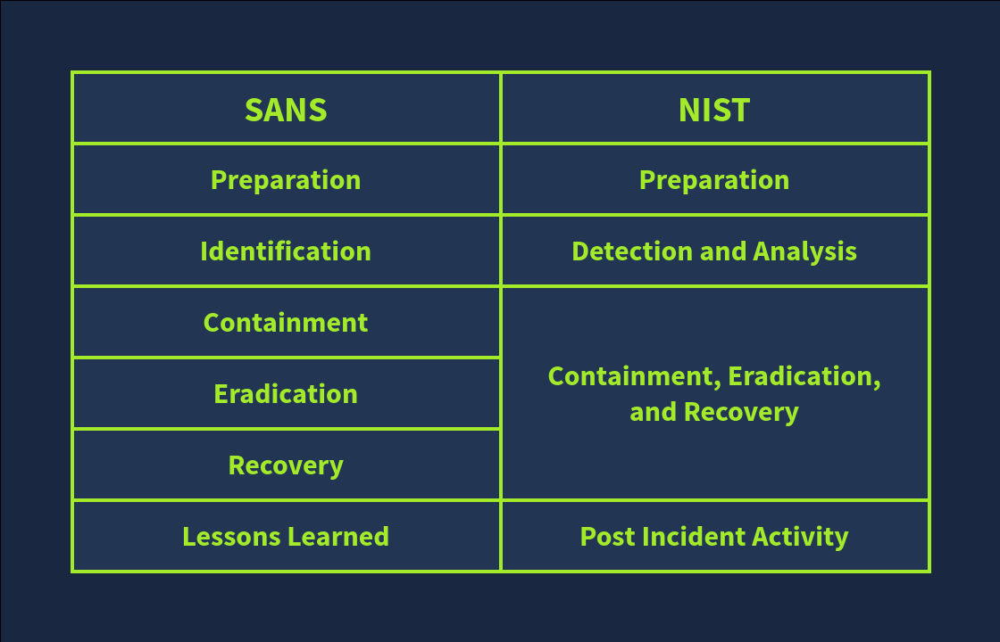
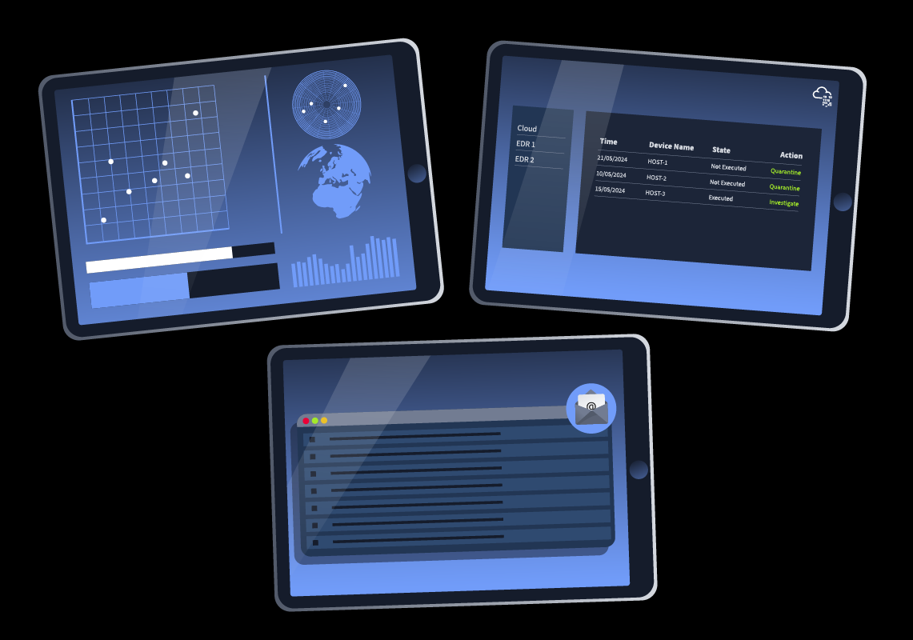

# Incident Response Fundamentals
## 1. Introduction to Incident Response
Hãy tưởng tượng bạn sống trong một con phố không an toàn lắm với nhiều đồ vật đắt tiền trong nhà. Chắc hẳn bạn đang nghĩ đến việc thuê bảo vệ và lắp đặt vài camera giám sát. Giấu những đồ vật đắt tiền trong một căn phòng bí mật dưới lòng đất là một ý tưởng hay nếu kẻ đột nhập thành công vào nhà. Đó là những điều bạn cần lên kế hoạch để đảm bảo an toàn cho ngôi nhà của mình, ngay cả trước khi bất kỳ cuộc tấn công nào xảy ra.

Bên cạnh những biện pháp chủ động này, bạn đã bao giờ nghĩ đến việc mọi thứ sẽ diễn ra như thế nào nếu ai đó vượt qua thành công các cơ chế an ninh bên ngoài và xâm nhập vào nhà bạn? Bạn cũng cần thực hiện một số biện pháp khác sau khi nhà bạn bị tấn công.

Hãy cùng xem xét vấn đề trên trong thế giới kỹ thuật số. Chắc hẳn bạn đã từng nghe về các cuộc tấn công mạng nhằm vào các tổ chức, khiến họ thiệt hại hàng nghìn đô la. Hàng ngày, trên internet có rất nhiều báo cáo về các trường hợp như vậy. Chúng được gọi là các **sự cố an ninh mạng** . Cũng giống như trường hợp bạn lên kế hoạch bảo vệ ngôi nhà của mình, các sự cố an ninh mạng cũng cần có kế hoạch và nguồn lực để tránh những tổn thất lớn.

Ứng phó sự cố xử lý một sự cố từ khi bắt đầu đến khi kết thúc. Từ việc triển khai an ninh ở nhiều khu vực để ngăn ngừa sự cố đến việc đối phó với chúng và giảm thiểu tác động, ứng phó sự cố là một hướng dẫn toàn diện.

Phòng học này sẽ giúp bạn hiểu các khái niệm quan trọng về ứng phó sự cố và cho bạn cơ hội giải quyết sự cố đầu tiên một cách thực tế.

**Mục tiêu học tập**
- Tổng quan về sự cố và mức độ nghiêm trọng của chúng.
- Các loại sự cố thường gặp
- Các giai đoạn ứng phó sự cố theo khung tiêu chuẩn SANS và NIST.
- Các công cụ phát hiện và ứng phó sự cố cùng với vai trò của các kế hoạch hành động (PlayBooks)
- Kế hoạch ứng phó sự cố

## 2. What are Incident?
Trên các thiết bị điện toán của bạn, ví dụ như máy tính xách tay, điện thoại di động, v.v., có nhiều tiến trình khác nhau chạy. Một số tiến trình này có tính tương tác, nghĩa là bạn thực hiện các hành động, ví dụ như chơi trò chơi hoặc xem video. Cũng sẽ có một số tiến trình không tương tác chạy ngầm mà có thể không cần sự tương tác của bạn. Chúng chỉ cần thiết cho thiết bị của bạn. Cả hai loại tiến trình này đều tạo ra một số sự kiện. Bất cứ điều gì chúng làm, một sự kiện sẽ được ghi lại.

Các sự kiện được tạo ra với số lượng lớn một cách thường xuyên. Điều này là do nhiều tiến trình chạy trên thiết bị, mỗi tiến trình thực hiện các tác vụ thường xuyên khác nhau, tạo ra vô số sự kiện. Những sự kiện này đôi khi có thể chỉ ra điều gì đó nghiêm trọng đang xảy ra trên thiết bị của bạn. Làm thế nào để chúng ta kiểm tra số lượng lớn các sự kiện này và xem liệu chúng có chỉ ra hoạt động phá hoại nào không? Có các giải pháp bảo mật để giải quyết vấn đề này. Các sự kiện này được ghi lại trong các giải pháp bảo mật dưới dạng nhật ký, và các giải pháp bảo mật có thể tìm thấy các hoạt động độc hại trong đó. Điều này đã giúp công việc của chúng ta dễ dàng hơn rất nhiều! Nhưng khoan đã; thách thức thực sự nằm ở chỗ sau khi giải pháp bảo mật chỉ ra các hoạt động này.

Vì vậy, khi một giải pháp bảo mật phát hiện ra một sự kiện hoặc một nhóm sự kiện liên quan đến hoạt động có khả năng gây hại, nó sẽ kích hoạt cảnh báo. Sau đó, nhóm bảo mật sẽ phân tích các cảnh báo này. Một số cảnh báo có thể là **cảnh báo sai (False Positive)** , trong khi một số khác là **cảnh báo đúng (True Positive)**. Các cảnh báo chỉ ra điều gì đó nguy hiểm nhưng không gây hại được gọi là **cảnh báo sai**. Ngược lại, các cảnh báo chỉ ra điều gì đó có hại và thực sự nguy hiểm được gọi là **cảnh báo đúng**. Bạn có thể hiểu rõ hơn về điều này qua ví dụ dưới đây:

**Cảnh báo sai**: Một giải pháp bảo mật đã đưa ra cảnh báo về lượng dữ liệu lớn được truyền từ một hệ thống đến một địa chỉ IP bên ngoài. Sau khi phân tích cảnh báo này, nhóm bảo mật phát hiện ra rằng hệ thống đó đang thực hiện quá trình sao lưu lên dịch vụ lưu trữ đám mây, dẫn đến cảnh báo này. Đây được gọi là **cảnh báo sai**.

**Phát hiện đúng (True Positive)**: Một giải pháp bảo mật đã đưa ra cảnh báo về một nỗ lực tấn công lừa đảo nhắm vào một người dùng của tổ chức. Sau khi phân tích cảnh báo này, nhóm bảo mật phát hiện ra rằng email đó là email lừa đảo được gửi đến người dùng này nhằm mục đích xâm nhập hệ thống. Đây được gọi là phát hiện đúng.

Những cảnh báo tích cực thực sự này đôi khi được gọi là **Sự cố** . Giả sử cảnh báo hiện được phân loại là sự cố, giai đoạn tiếp theo là xác định mức độ nghiêm trọng của sự cố. Hãy tưởng tượng bạn là thành viên của nhóm bảo mật và nhận được nhiều sự cố cùng lúc. Bạn sẽ chọn sự cố nào để xử lý trước tiên? Đây là lúc khái niệm về mức độ nghiêm trọng của sự cố trở nên hữu ích. Các sự cố có thể được phân loại là **thấp, trung bình, cao hoặc nghiêm trọng** dựa trên tác động mà chúng có thể gây ra. Các sự cố có mức độ nghiêm trọng nghiêm trọng luôn được ưu tiên cao nhất, tiếp theo là mức độ nghiêm trọng cao, v.v.

## 3. Type of Incidents
Mọi người thường gán nhãn cho mọi hoạt động gây hại liên quan đến thế giới kỹ thuật số là một nỗ lực tấn công mạng. Điều này có thể đúng, nhưng nó rất chung chung trong lĩnh vực an ninh mạng. Các sự cố an ninh có thể thuộc nhiều loại khác nhau. Trong các bài tập trên, chúng ta đã thấy một ví dụ về cảnh báo tích cực thực sự, sau khi được nhóm an ninh phân tích, nó đã trở thành một sự cố. Sự cố này liên quan đến email lừa đảo , có thể đi kèm với một tệp đính kèm độc hại. Nếu được tải xuống hệ thống, tệp đính kèm này có thể gây ra hậu quả nguy hiểm. Đây là một loại sự cố. Có nhiều loại sự cố khác. Các loại này có thể xảy ra độc lập hoặc cùng nhau trong cùng một nạn nhân.

- **Nhiễm phần mềm độc hại** : Phần mềm độc hại là một chương trình nguy hiểm có thể gây hại cho hệ thống, mạng hoặc ứng dụng. Phần lớn các sự cố đều liên quan đến nhiễm phần mềm độc hại.  Có nhiều loại phần mềm độc hại khác nhau, mỗi loại đều có khả năng gây hại riêng. Nhiễm phần mềm độc hại chủ yếu do các _tệp tin_ gây ra, có thể là _văn bản_, _tài liệu_, _tệp thực thi_, v.v.

- **Vi phạm an ninh**: Vi phạm an ninh xảy ra khi một người không được ủy quyền truy cập vào dữ liệu bí mật (những dữ liệu mà chúng ta không muốn họ xem hoặc sở hữu). Vi phạm an ninh vô cùng quan trọng vì nhiều doanh nghiệp phụ thuộc vào dữ liệu bí mật của họ, và dữ liệu này chỉ được phép truy cập bởi những người được ủy quyền.
Kẻ tấn công truy cập trái phép vào dữ liệu máy tính.

- **Rò rỉ dữ liệu**: Rò rỉ dữ liệu là những sự cố trong đó thông tin mật của một cá nhân hoặc tổ chức bị lộ cho các thực thể không được phép. Nhiều kẻ tấn công sử dụng rò rỉ dữ liệu để gây tổn hại danh tiếng cho nạn nhân hoặc sử dụng kỹ thuật này để đe dọa nạn nhân và lấy được những gì chúng cần. Không giống như vi phạm an ninh, rò rỉ dữ liệu cũng có thể do lỗi của con người hoặc cấu hình sai gây ra một cách vô ý.

- **Tấn công nội bộ**: Các sự cố xảy ra từ bên trong một tổ chức được gọi là tấn công nội bộ. Hãy nghĩ về một nhân viên bất mãn lây nhiễm toàn bộ mạng thông qua USB vào ngày làm việc cuối cùng của mình. Đây là một ví dụ về tấn công nội bộ. Việc ai đó trong tổ chức của bạn cố ý khởi xướng một cuộc tấn công thuộc loại này. Những cuộc tấn công này có thể rất nguy hiểm, vì người nội bộ luôn có quyền truy cập vào nhiều tài nguyên hơn người ngoài.

- **Tấn công từ chối dịch vụ (DoS)**: **Tính khả dụng** là một trong ba trụ cột của an ninh mạng. Các giải pháp và con người trong lĩnh vực an ninh mạng luôn tìm cách bảo vệ thông tin; họ đảm bảo dữ liệu luôn sẵn sàng cho người dùng. Điều này là bởi vì không có ích gì khi bảo vệ thứ mà chúng ta không thể sử dụng được. **Tấn công từ chối dịch vụ**, hay **tấn công DoS** , là những sự cố mà kẻ tấn công làm quá tải hệ thống/mạng/ứng dụng bằng các yêu cầu giả mạo, cuối cùng khiến nó không thể sử dụng được đối với người dùng hợp pháp. Điều này xảy ra do tài nguyên có sẵn để đáp ứng các yêu cầu bị cạn kiệt.

Tất cả những sự cố này đều có tiềm năng gây ảnh hưởng tiêu cực riêng biệt đến nạn nhân. Không thể so sánh các sự cố này về mức độ nghiêm trọng của tác động mà chúng gây ra. Điều này là bởi vì một sự cố cụ thể có thể gây ra thảm họa cho một tổ chức trong khi chỉ gây ra thiệt hại nhỏ cho một tổ chức khác. Ví dụ, tập đoàn _XYZ_ có thể không bị ảnh hưởng nặng nề bởi việc rò rỉ dữ liệu vì thông tin mà họ lưu trữ có thể vô dụng đối với bất kỳ ai khác. Tuy nhiên, họ có thể chịu tổn thất lớn trong trường hợp bị tấn công từ chối dịch vụ (DoS) vào trang web chính của mình, vì các dịch vụ của họ phụ thuộc vào trang web đó.

## 4.Incident Repsonse Process (_Quy trình ứng phó sự cố_)
Trong bài tập trên, chúng ta đã thấy nhiều loại sự cố khác nhau. Đôi khi, việc xử lý nhiều loại sự cố trong một môi trường có thể rất khó khăn. Do tính chất đặc thù của các sự cố trong các tổ chức, cần phải có một quy trình có cấu trúc để ứng phó với sự cố. Các khung ứng phó sự cố giúp chúng ta trong vấn đề này. Đây là những phương pháp chung cần tuân theo trong bất kỳ sự cố nào để ứng phó hiệu quả. Chúng ta sẽ thảo luận về hai khung ứng phó sự cố được sử dụng rộng rãi: **SANS** và **NIST** .

**SANS** và **NIST** là hai tổ chức nổi tiếng đóng góp vào lĩnh vực an ninh mạng. **SANS** đã cung cấp nhiều khóa học và chứng chỉ về an ninh mạng, còn **NIST** đóng vai trò quan trọng trong việc phát triển các tiêu chuẩn và hướng dẫn về an ninh mạng. Cả **SANS** và **NIST** đều có khung ứng phó sự cố khá tương đồng.

Khung ứng phó sự cố **SANS** gồm 6 giai đoạn, có thể gọi tắt là 'PICERL' để dễ nhớ hơn.

Khung ứng phó sự cố của NIST tương tự như khung SANS mà chúng ta đã nghiên cứu ở trên. Số lượng các giai đoạn trong khung này được giảm xuống còn 4.

Sau đây là bảng so sánh giữa hai sản phẩm:

Các tổ chức có thể xây dựng quy trình ứng phó sự cố của mình bằng cách tuân theo các khuôn khổ này. Mỗi quy trình đều có một tài liệu chính thức liệt kê tất cả các thủ tục liên quan của tổ chức. Tài liệu ứng phó sự cố chính thức được gọi là **Kế hoạch Ứng phó Sự cố** . Tài liệu có cấu trúc này nêu rõ cách tiếp cận trong bất kỳ sự cố nào. Nó được ban quản lý cấp cao phê duyệt chính thức và bao gồm các thủ tục cần tuân theo trước, trong và sau khi sự cố kết thúc.

Các thành phần chính của kế hoạch này bao gồm (nhưng không giới hạn ở):
- Vai trò và trách nhiệm
- Phương pháp ứng phó sự cố
- Kế hoạch truyền thông với các bên liên quan, bao gồm cả cơ quan thực thi pháp luật.
- Lộ trình leo thang cần tuân theo

## 5. Incident Response Techniques(_Kĩ thuật ứng phó sự cố_)
Hãy nhớ rằng chúng ta đã nghiên cứu giai đoạn thứ hai của chu trình ứng phó sự cố, "Nhận diện" trong tiêu chuẩn SANS và "Phát hiện và Phân tích" trong tiêu chuẩn NIST . Việc tìm kiếm hành vi bất thường và xác định sự cố một cách thủ công là rất khó khăn. Có nhiều giải pháp bảo mật đóng vai trò riêng biệt trong việc phát hiện bất kỳ sự cố nào. Một số giải pháp thậm chí còn có khả năng ứng phó với sự cố và thực hiện các giai đoạn khác của chu trình, chẳng hạn như ngăn chặn, loại bỏ, v.v. Một số giải pháp này được giải thích ngắn gọn dưới đây:
- **SIEM**: Giải pháp Quản lý Thông tin và Sự kiện An ninh ( SIEM ) thu thập tất cả các nhật ký quan trọng tại một vị trí tập trung và đối chiếu chúng để xác định các sự cố.
- **AV**:  Phần mềm diệt virus (AV) phát hiện các chương trình độc hại đã biết trong hệ thống và thường xuyên quét hệ thống của bạn để tìm chúng.
- **EDR** : Hệ thống phát hiện và phản hồi điểm cuối (EDR) được triển khai trên mọi hệ thống, bảo vệ hệ thống khỏi một số mối đe dọa cấp cao. Giải pháp này cũng có thể ngăn chặn và loại bỏ mối đe dọa.

Sau khi xác định được sự cố, cần tuân theo một số quy trình nhất định, bao gồm điều tra mức độ thiệt hại do cuộc tấn công gây ra, thực hiện các hành động cần thiết để ngăn chặn thiệt hại thêm và loại bỏ tận gốc vấn đề. Các bước này có thể khác nhau đối với các loại sự cố khác nhau. Trong trường hợp này, việc có hướng dẫn từng bước để xử lý từng loại sự cố sẽ giúp bạn tiết kiệm được rất nhiều thời gian. Những loại hướng dẫn này được gọi là **Sổ tay Hướng dẫn (Playbooks)** .

Sổ tay hướng dẫn là những chỉ dẫn cho việc ứng phó toàn diện với sự cố.

Dưới đây là một ví dụ về quy trình xử lý sự cố: Email lừa đảo (Phishing Email):
1. Thông báo cho tất cả các bên liên quan về sự cố email lừa đảo .
2. Xác định xem email đó có phải là email độc hại hay không bằng cách phân tích tiêu đề và nội dung email.
3. Hãy tìm kiếm bất kỳ tệp đính kèm nào trong email và phân tích chúng.
4. Xác định xem có ai đã mở các tệp đính kèm hay không.
5. Tách biệt các hệ thống bị nhiễm khỏi mạng.
6. Chặn người gửi email

**Ngược lại, sổ tay hướng dẫn** xử lý sự cố (runbook) là bản hướng dẫn chi tiết, từng bước thực hiện các thao tác cụ thể trong các sự cố khác nhau. Các bước này có thể thay đổi tùy thuộc vào nguồn lực sẵn có để điều tra.

