# Log Fundamentals
## 1. Introduction to Logs
Những kẻ tấn công rất tinh ranh. Chúng tránh để lại tối đa dấu vết trên máy chủ của nạn nhân để tránh bị phát hiện. Tuy nhiên, đội ngũ an ninh vẫn xác định được cách thức tấn công được thực hiện và thậm chí đôi khi còn tìm ra được kẻ đứng sau vụ tấn công.

Giả sử một vài cảnh sát đang điều tra vụ mất tích một chiếc dây chuyền quý giá trong một căn nhà gỗ giữa rừng tuyết. Họ nhận thấy cánh cửa gỗ của căn nhà bị hư hại nghiêm trọng và trần nhà bị sập. Có một số dấu chân trên con đường tuyết dẫn đến căn nhà đó. Cuối cùng, họ phát hiện một số đoạn phim camera giám sát từ một ngôi nhà lân cận. Bằng cách ghép nối tất cả các manh mối này, cảnh sát đã xác định thành công kẻ đứng sau vụ việc. Nhiều manh mối khác nhau được tìm thấy trong các vụ án tương tự; việc ghép nối tất cả chúng lại sẽ giúp bạn tiến gần hơn đến thủ phạm.

Có vẻ như những dấu vết này đóng vai trò rất quan trọng trong các cuộc điều tra.

Điều gì sẽ xảy ra nếu có sự cố bên trong thiết bị kỹ thuật số? Chúng ta sẽ tìm thấy tất cả những dấu vết đó ở đâu để điều tra thêm?

Trong một hệ thống, có nhiều vị trí có thể tìm thấy dấu vết của một cuộc tấn công. Nhật ký hệ thống(**logs**) chứa hầu hết các dấu vết này. Nhật ký hệ thống là dấu vết kỹ thuật số do bất kỳ hoạt động nào để lại. Hoạt động đó có thể là hoạt động bình thường hoặc hoạt động có ý đồ xấu. Việc truy tìm hoạt động và cá nhân đứng sau hoạt động đó trở nên dễ dàng hơn thông qua nhật ký hệ thống.

### Các trường hợp sử dụng nhật ký

Dưới đây là một số lĩnh vực quan trọng mà nhật ký ghi chép đóng vai trò không thể thiếu.

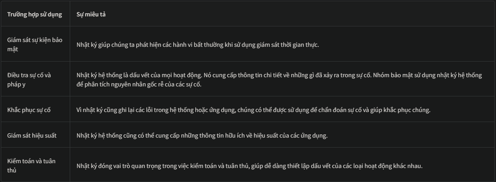

Phòng học này sẽ trang bị cho bạn kiến ​​thức về các loại nhật ký khác nhau được lưu trữ trong các hệ thống khác nhau. Chúng ta cũng sẽ thực hành điều tra nhật ký như là dấu vết của các cuộc tấn công khác nhau.

### Mục tiêu học tập
Sau khi hoàn thành căn phòng này, bạn sẽ tìm hiểu được những điều sau:
- Các loại logs khác nhau
- Cách phân tích nhật ký
- Phân tích nhật ký sự kiện Windows
- Phân tích nhật ký truy cập web

## 2. Types of logs
Trong bài tập trước, chúng ta đã thấy nhiều trường hợp sử dụng nhật ký. Nhưng vẫn còn một thách thức. Hãy tưởng tượng bạn phải điều tra một sự cố trong hệ thống thông qua nhật ký; bạn mở tệp nhật ký của hệ thống đó, và giờ bạn bị lạc lối sau khi thấy vô số sự kiện thuộc các danh mục khác nhau.

Đây là giải pháp: Các tệp nhật ký được phân loại thành nhiều nhóm dựa trên loại thông tin mà chúng cung cấp. Vì vậy, bây giờ bạn chỉ cần xem tệp nhật ký cụ thể liên quan đến sự cố đó.

Ví dụ, bạn cần điều tra các lần đăng nhập thành công từ hôm qua vào một khung thời gian cụ thể trên hệ điều hành Windows . Thay vì xem xét tất cả các nhật ký, bạn chỉ cần xem **Security Logs** của hệ thống để tìm thông tin đăng nhập. Chúng ta cũng có các loại nhật ký khác hữu ích trong việc điều tra các sự cố khác nhau. Hãy cùng xem xét chúng.

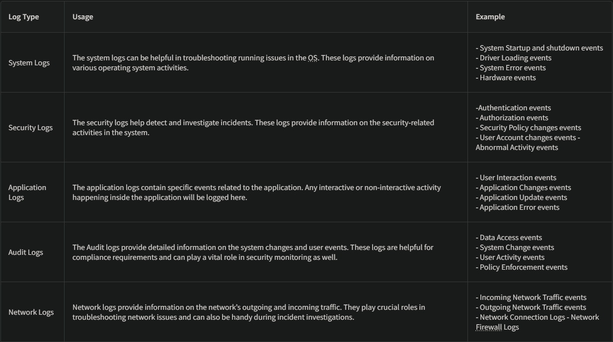
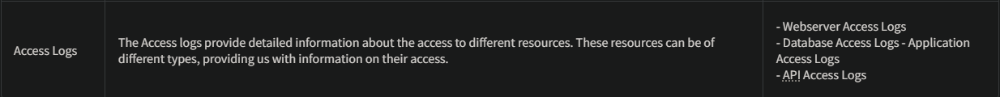

Lưu ý: Có thể có nhiều loại nhật ký khác nhau tùy thuộc vào các ứng dụng và dịch vụ mà chúng cung cấp.

## 3. Windows Event Logs Analysis
Giống như các hệ điều hành khác, hệ điều hành Windows cũng ghi lại nhiều hoạt động diễn ra. Những hoạt động này được lưu trữ trong các tệp nhật ký riêng biệt, mỗi tệp có một danh mục nhật ký cụ thể. Một số loại nhật ký quan trọng được lưu trữ trong hệ điều hành Windows là:
- **Application**: Có rất nhiều ứng dụng đang chạy trên hệ điều hành. Mọi thông tin liên quan đến các ứng dụng đó đều được ghi lại trong tập tin này. Thông tin này bao gồm lỗi, cảnh báo, vấn đề tương thích, v.v.
- **System**: Bản thân hệ điều hành có nhiều hoạt động khác nhau. Mọi thông tin liên quan đến các hoạt động này đều được ghi lại trong tệp nhật ký Hệ thống. Thông tin này bao gồm các vấn đề về trình điều khiển, vấn đề về phần cứng, thông tin khởi động và tắt hệ thống, thông tin dịch vụ, v.v.
- **Security**: Đây là tập tin nhật ký quan trọng nhất trong hệ điều hành Windows về mặt bảo mật. Nó ghi lại tất cả các hoạt động liên quan đến bảo mật, bao gồm xác thực người dùng, thay đổi tài khoản người dùng, thay đổi chính sách bảo mật, v.v.

Bên cạnh đó, một số tệp nhật ký khác trong hệ điều hành Windows được thiết kế để ghi lại các hoạt động liên quan đến các hành động và ứng dụng cụ thể.

Không giống như các tập tin nhật ký khác đã được nghiên cứu trong các bài tập trước, vốn không có ứng dụng tích hợp sẵn để xem, hệ điều hành Windows có một tiện ích gọi là Trình xem sự kiện (**Event Viewer**), cung cấp giao diện người dùng đồ họa thân thiện để xem và tìm kiếm bất cứ thứ gì trong các tập tin nhật ký này.

Để mở Event Viewer, hãy nhấp vào nút Bắt đầu của Windows và gõ 'Event Viewer'. Event Viewer sẽ được mở ra như hình bên dưới. Vùng được tô sáng trong ảnh chụp màn hình bên dưới hiển thị các nhật ký khác nhau có sẵn. 

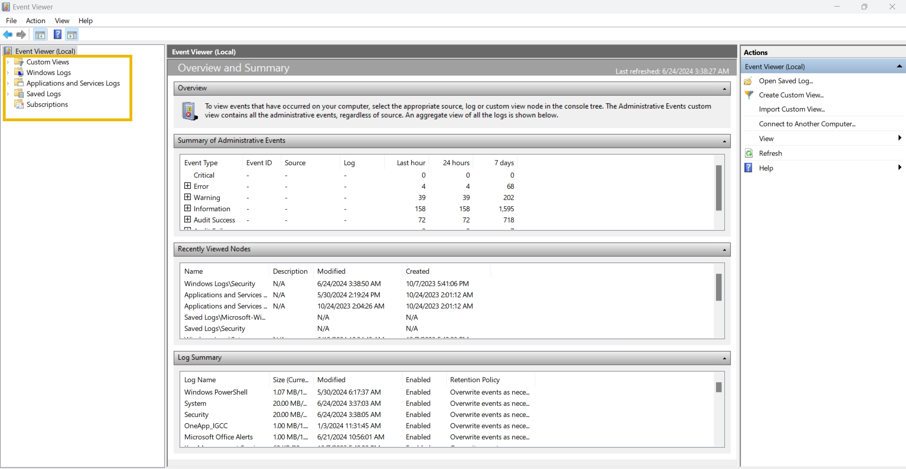

Bạn có thể nhấp vào 'Nhật ký Windows' từ phần được tô sáng để xem các loại nhật ký khác nhau mà chúng ta đã thảo luận ở đầu bài tập này. 
Phần được tô sáng đầu tiên hiển thị các tệp nhật ký khác nhau. Khi chúng ta nhấp vào một trong các tệp nhật ký này, chúng ta sẽ thấy các nhật ký khác nhau, như có thể thấy trong phần được tô sáng thứ hai. Cuối cùng, trong phần được tô sáng thứ ba, chúng ta có các tùy chọn khác nhau để phân tích nhật ký.

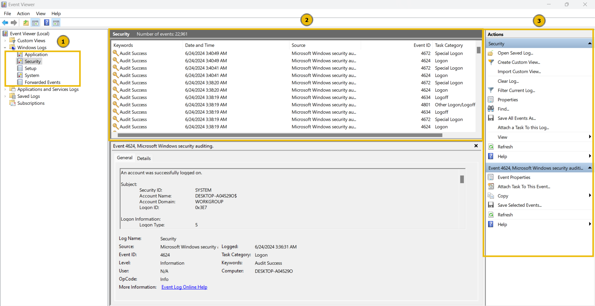

Hãy nhấp đúp vào một trong những tệp nhật ký này để xem nội dung của nó. 

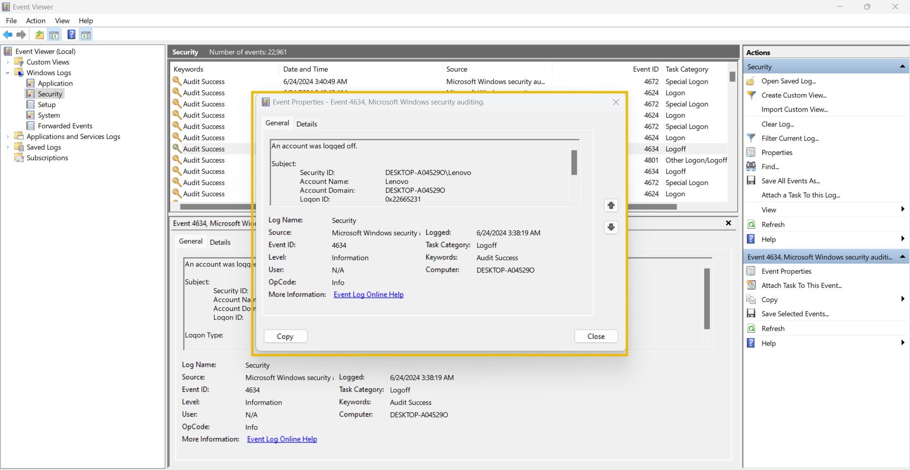

Đây là giao diện của nhật ký sự kiện Windows. Nó có nhiều trường khác nhau. Các trường chính được thảo luận bên dưới:
- Description: Trường này chứa thông tin chi tiết về hoạt động.
- Log Name: Tên nhật ký cho biết tên tệp nhật ký.
- Logged: Trường này cho biết thời gian diễn ra hoạt động.
- Event ID: Mã sự kiện là mã định danh duy nhất cho một hoạt động cụ thể.

Có rất nhiều mã định danh sự kiện (event ID ) trong nhật ký sự kiện của Windows. Chúng ta có thể sử dụng các mã định danh sự kiện này để tìm kiếm bất kỳ hoạt động cụ thể nào. Ví dụ, mã định danh sự kiện 4624 xác định duy nhất hoạt động đăng nhập thành công, vì vậy bạn chỉ cần tìm kiếm mã định danh sự kiện 4624 khi điều tra các lần đăng nhập thành công.

Dưới đây là bảng liệt kê một số ID sự kiện quan trọng trong hệ điều hành Windows.

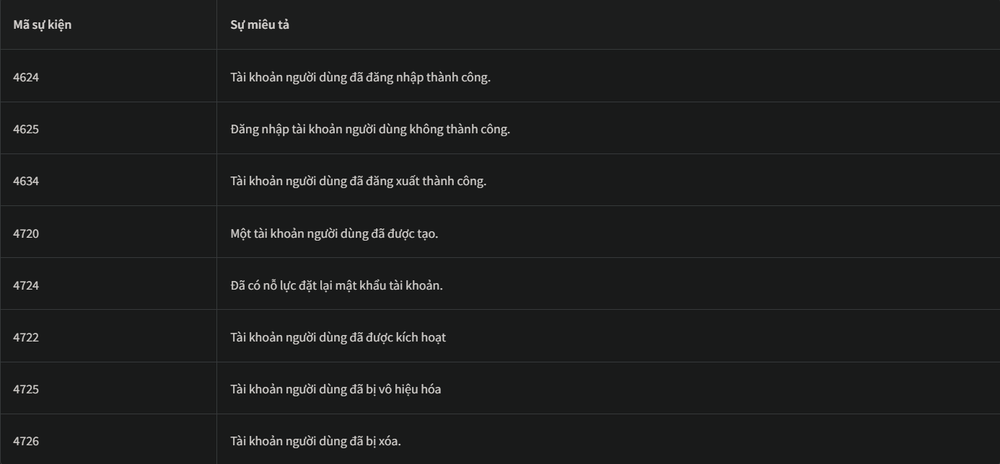

Có rất nhiều mã định danh sự kiện khác nữa . Không cần thiết phải nhớ hết tất cả, nhưng nên nhớ những mã định danh sự kiện quan trọng .

Trình xem sự kiện cho phép chúng ta tìm kiếm nhật ký liên quan đến một ID sự kiện cụ thể bằng tính năng `Filter Current Log`. Chúng ta có thể nhấp vào tính năng này để áp dụng bất kỳ bộ lọc nào. 

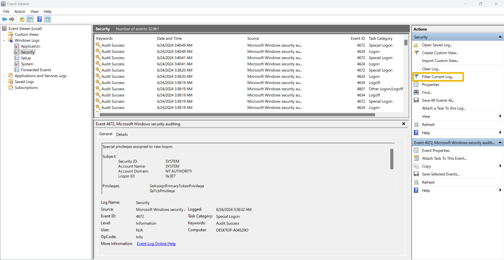

Khi nhấp vào tùy chọn 'Lọc nhật ký hiện tại', chúng ta sẽ được yêu cầu nhập ID sự kiện muốn lọc. Trong ảnh chụp màn hình bên dưới, tôi đã lọc ID sự kiện 4624. 

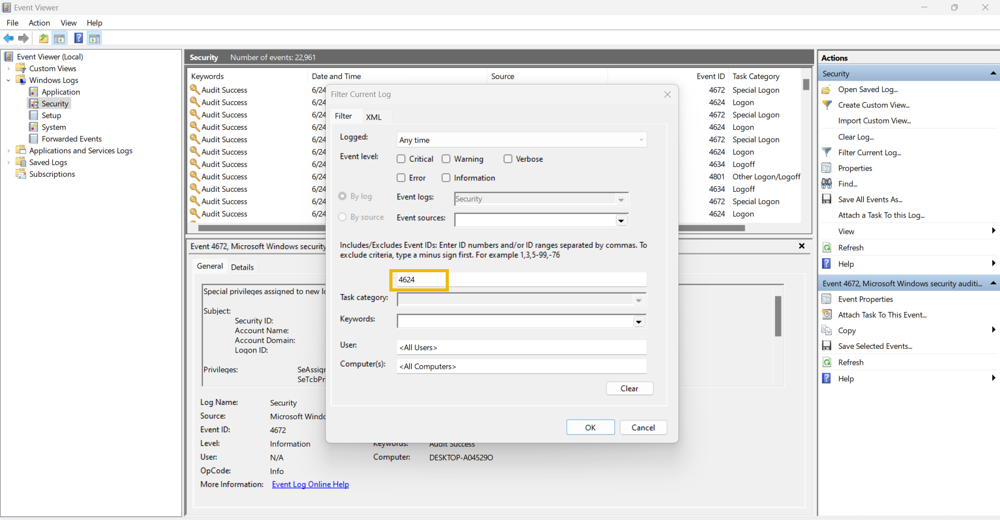

Sau khi nhấn nút 'OK', tôi có thể thấy tất cả các nhật ký có ID sự kiện: 4624. Giờ đây, tôi có thể xem bất kỳ nhật ký nào trong số này bằng cách nhấp đúp vào chúng. 

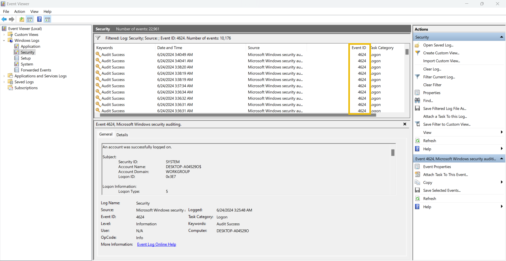

### PRACTICE
Hôm thứ Sáu, một tổ chức quan trọng đã báo cáo trở thành nạn nhân của một cuộc tấn công mạng. Sau khi điều tra, dữ liệu quan trọng đã bị đánh cắp từ máy chủ tập tin trong mạng lưới của tổ chức. Nhóm bảo mật đã xác định được tên người dùng và địa chỉ IP của hệ thống bị xâm nhập trong mạng, hệ thống này có quyền truy cập vào máy chủ tập tin vào thời điểm xảy ra cuộc tấn công.

Nhiệm vụ của bạn là tìm hiểu các hoạt động của kẻ tấn công trong hệ thống bị xâm nhập này trước khi hắn truy cập vào máy chủ tập tin.

*1. Tên của tài khoản người dùng cuối cùng được tạo trên hệ thống này là gì?*
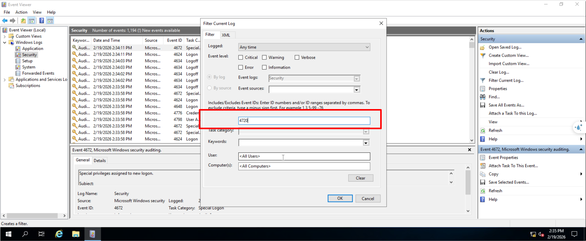

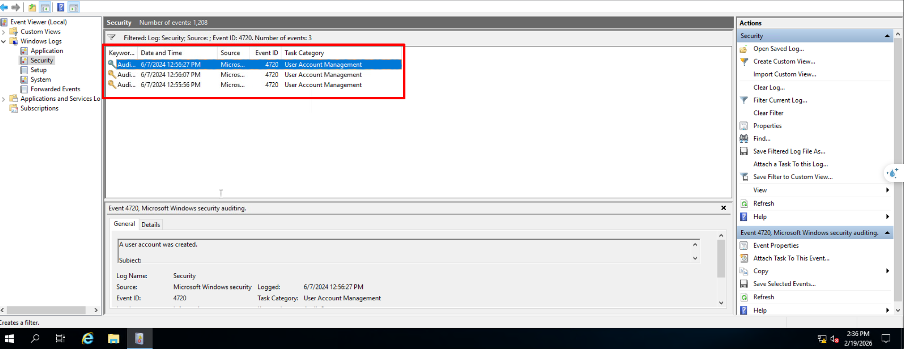

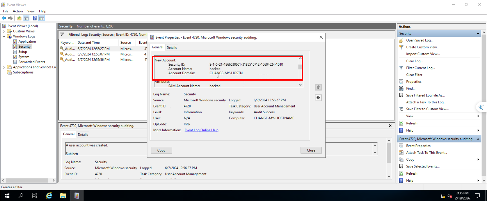

--> `hacked`

*2. Tài khoản trên được tạo bởi tài khoản người dùng nào?*
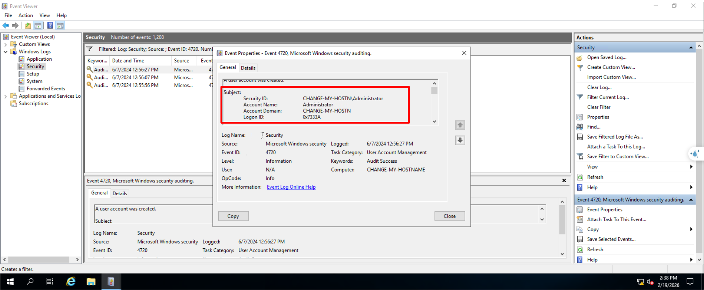

--> `Administrator`

*3. Tài khoản người dùng này được kích hoạt vào ngày nào? Định dạng: Tháng/Ngày/Năm*
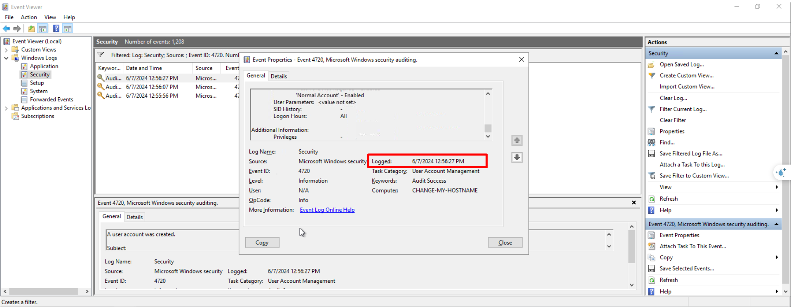

--> `6/7/2024`

*4. Tài khoản này cũng đã được đặt lại mật khẩu phải không?*
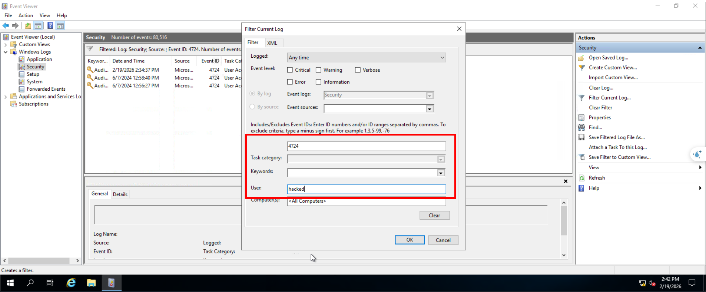

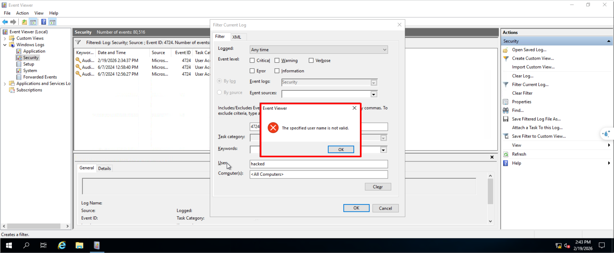

--> `No`

## 4. Web Server Access Logs Analysis
Hàng ngày chúng ta tương tác với rất nhiều trang web. Đôi khi, chúng ta chỉ muốn xem trang web, và đôi khi, chúng ta muốn đăng nhập hoặc tải lên một tập tin vào bất kỳ trường nhập liệu nào có sẵn. Đây chỉ là những loại yêu cầu khác nhau mà chúng ta gửi đến một trang web. Tất cả các yêu cầu này đều được trang web ghi lại và lưu trữ trong một tập tin nhật ký trên máy chủ web đang chạy trang web đó.

Tệp nhật ký này chứa tất cả các yêu cầu được gửi đến trang web cùng với thông tin về khung thời gian, địa chỉ IP được yêu cầu, loại yêu cầu và URL. Sau đây là các trường được trích từ một tệp nhật ký mẫu từ tệp nhật ký truy cập máy chủ web Apache , có thể tìm thấy trong thư mục: `/var/log/apache2/access.log`  

- **IP address**: `172.16.0.1` - Địa chỉ IP của người dùng đã thực hiện yêu cầu.
- **Dấu thời gian**: `[06/Jun/2024:13:58:44]` - Thời điểm yêu cầu được gửi đến trang web.
- Yêu cầu: Chi tiết yêu cầu.
    - Phương thức HTTP : “GET” - Cho trang web biết hành động cần thực hiện đối với yêu cầu.
    - URL: “/” - Tài nguyên được yêu cầu.
- **Mã trạng thái**: `200` - Phản hồi từ máy chủ. Các mã số khác nhau biểu thị các kết quả phản hồi khác nhau
- **User-Agent**: “Mozilla/5.0 (Macintosh; Intel Mac OS X 10_12_3) AppleWebKit/537.36 (KHTML, like Gecko) Chrome/58.0.3029.110 Safari/537.36” - Thông tin về hệ điều hành, trình duyệt, v.v. của người dùng khi thực hiện yêu cầu.

Chúng ta có thể thực hiện phân tích nhật ký thủ công bằng cách sử dụng một số tiện ích dòng lệnh trong hệ điều hành Linux . Sau đây là một số lệnh có thể hữu ích trong quá trình phân tích nhật ký thủ công. 

`cat` là một tiện ích phổ biến để hiển thị nội dung của một tệp văn bản. Chúng ta có thể sử dụng lệnh `cat` để hiển thị nội dung của một tệp nhật ký, vì chúng thường ở định dạng văn bản.

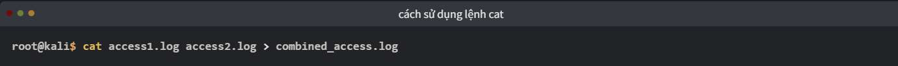

`grep` là một tiện ích dòng lệnh rất hữu ích cho phép bạn tìm kiếm các chuỗi và mẫu bên trong tệp nhật ký. Ví dụ, bạn có thể cần tìm xem một địa chỉ IP cụ thể có xuất hiện trong tệp nhật ký của mình hay không. Bạn có thể thực hiện điều này bằng cách sử dụng lệnh sau: Lệnh sau sẽ tìm kiếm trong tệp access.log chuỗi `192.168.1.1` và hiển thị tất cả các dòng có chứa chuỗi này.

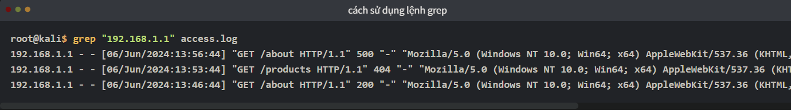

Lệnh `less` hữu ích để xử lý nhiều tệp nhật ký. Bạn có thể cần phân tích từng phần cụ thể một. Để làm điều này, bạn có thể sử dụng tiện ích dòng lệnh less, giúp bạn xem từng trang một.

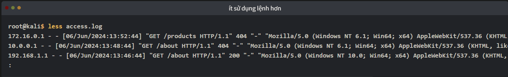

Sử dụng phím `spacebar` để chuyển sang trang tiếp theo và `b` trang trước đó.

Sau khi chạy lệnh này, nhật ký sẽ được hiển thị theo từng trang, giúp việc phân tích thủ công dễ dàng hơn. Nếu bạn muốn tìm kiếm nội dung trong nhật ký, bạn có thể nhập `/` theo sau là mẫu tìm kiếm và nhấn `Enter`. 

Sử dụng phím `n` để chuyển đến vị trí tìm kiếm tiếp theo và phím `N` để chuyển đến vị trí tìm kiếm trước đó.

Trong bài tập này, chúng tôi cung cấp một tệp nhật ký truy cập máy chủ web mẫu. Hãy tải xuống tệp bằng cách nhấp vào nút “Tải xuống tệp bài tập” bên dưới.

*1. Địa chỉ IP nào đã thực hiện yêu cầu GET cuối cùng đến URL: “/contact”?*
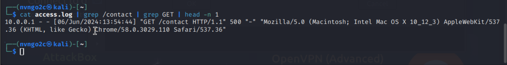

*2. Lần cuối cùng yêu cầu POST được thực hiện bởi địa chỉ IP “172.16.0.1” là khi nào?*
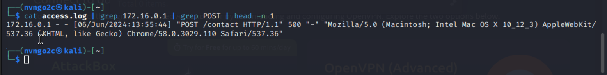

*3. Dựa vào câu trả lời ở câu hỏi số 2, yêu cầu POST được gửi đến URL nào?*

`/contact`
