# Metasploit: Exploitation
## 1. Introduction
Trong phòng này, chúng ta sẽ học cách sử dụng Metasploit để quét và khai thác lỗ hổng bảo mật. Chúng ta cũng sẽ tìm hiểu cách tính năng cơ sở dữ liệu giúp quản lý dễ dàng hơn các hoạt động kiểm thử xâm nhập với phạm vi rộng hơn. Cuối cùng, chúng ta sẽ xem xét việc tạo payload bằng `msfvenom` và cách bắt đầu phiên Meterpreter trên hầu hết các nền tảng mục tiêu.

Cụ thể hơn, các chủ đề chúng ta sẽ đề cập đến là:
- Hướng dẫn cách quét hệ thống mục tiêu bằng Metasploit .
- Hướng dẫn sử dụng tính năng cơ sở dữ liệu của Metasploit .
- Hướng dẫn cách sử dụng Metasploit để quét lỗ hổng bảo mật.
- Hướng dẫn cách sử dụng Metasploit để khai thác các dịch vụ dễ bị tổn thương trên hệ thống mục tiêu.
- Làm thế nào `msfvenom` có thể sử dụng nó để tạo payload và lấy được phiên Meterpreter trên hệ thống mục tiêu?

## 2. Scan
### 1. Port scan
Metasploit có một số mô-đun để quét các cổng mở trên hệ thống và mạng mục tiêu. Bạn có thể liệt kê các mô-đun quét cổng tiềm năng bằng `search portscan`.
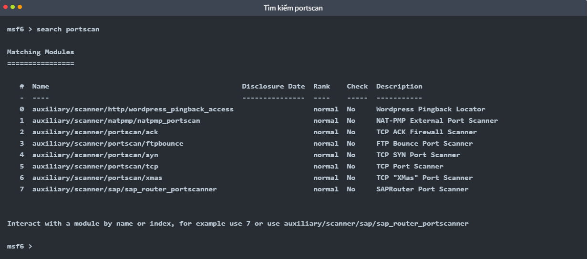

Các mô-đun quét cổng sẽ yêu cầu bạn thiết lập một vài tùy chọn:
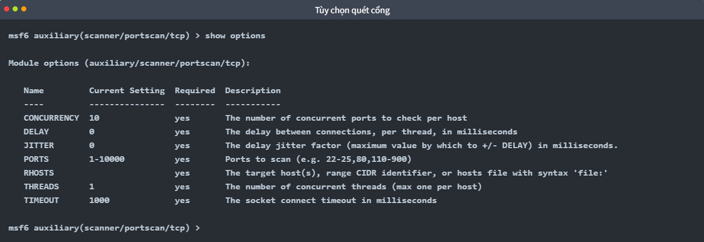
- **CONCURRENCY**:  Số lượng mục tiêu được quét cùng lúc.
- **PORTS**: Phạm vi cổng cần quét. Xin lưu ý rằng phạm vi 1-1000 ở đây sẽ không giống với khi sử dụng Nmap với cấu hình mặc định. Nmap sẽ quét 1000 cổng được sử dụng nhiều nhất, trong khi Metasploit sẽ quét các cổng từ 1 đến 10000.
- **RHOSTS**: Mục tiêu hoặc mạng mục tiêu cần được quét.
- **THREADS**: Số lượng luồng sẽ được sử dụng đồng thời. Càng nhiều luồng thì tốc độ quét càng nhanh.

Bạn có thể thực hiện quét **Nmap** trực tiếp từ dấu nhắc msfconsole nhanh hơn như hình bên dưới:
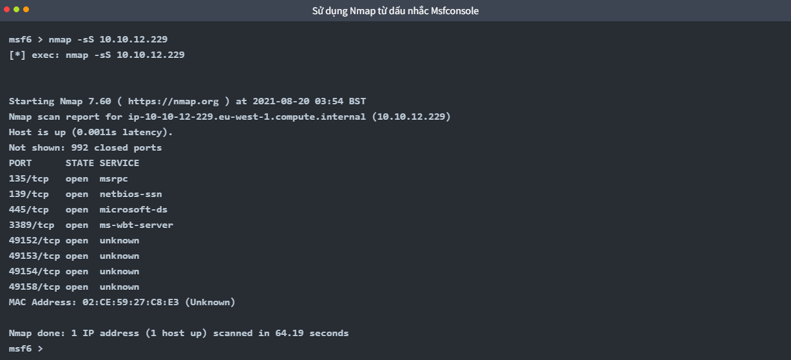

Về việc thu thập thông tin, nếu công việc của bạn yêu cầu phương pháp quét cổng nhanh hơn, Metasploit có thể không phải là lựa chọn hàng đầu. Tuy nhiên, một số mô-đun khiến Metasploit trở thành công cụ hữu ích cho giai đoạn quét.

### 2. UDP service Identification(_Định danh dịch vụ UDP_)
Mô-đun `scanner/discovery/udp_sweep` cho phép bạn nhanh chóng xác định các dịch vụ đang chạy trên giao thức `UDP` (_User Datagram Protocol_). Như bạn thấy bên dưới, mô-đun này sẽ không thực hiện quét toàn diện tất cả các dịch vụ UDP có thể có , nhưng nó cung cấp một cách nhanh chóng để xác định các dịch vụ như DNS hoặc NetBIOS.
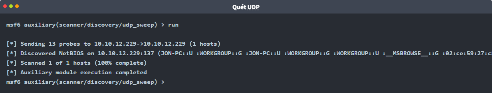

### 3. SMB Scans
Metasploit cung cấp một số mô-đun phụ trợ hữu ích cho phép chúng ta quét các dịch vụ cụ thể. Dưới đây là một ví dụ dành cho doanh nghiệp vừa `smb_enumshares` và nhỏ (SMB). Đặc biệt hữu ích trong mạng doanh nghiệp là các mô-đun này, `smb_version` nhưng hãy dành chút thời gian để xác định các công cụ quét mà phiên bản Metasploit được cài đặt trên hệ thống của bạn cung cấp.
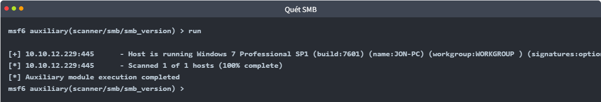

Khi thực hiện quét dịch vụ, điều quan trọng là không được bỏ sót các dịch vụ "đặc biệt" hơn như NetBIOS . NetBIOS (Network Basic Input Output System), tương tự như SMB , cho phép các máy tính giao tiếp qua mạng để chia sẻ tệp hoặc gửi tệp đến máy in. Tên NetBIOS của hệ thống mục tiêu có thể cho bạn biết về vai trò và thậm chí cả tầm quan trọng của nó (ví dụ: CORP- DC , DEVOPS , SALES, v.v.). Bạn cũng có thể bắt gặp một số tệp và thư mục được chia sẻ có thể truy cập mà không cần mật khẩu hoặc được bảo vệ bằng mật khẩu đơn giản (ví dụ: admin, administrator, root, toor, v.v.).

Hãy nhớ rằng, Metasploit có nhiều mô-đun có thể giúp bạn hiểu rõ hơn về hệ thống mục tiêu và có thể giúp bạn tìm ra các lỗ hổng. Luôn luôn nên thực hiện một tìm kiếm nhanh để xem có mô-đun nào có thể hữu ích dựa trên hệ thống mục tiêu của bạn hay không.

## 3. The Metasploit Database
Metasploit có chức năng cơ sở dữ liệu giúp đơn giản hóa việc quản lý dự án và tránh nhầm lẫn khi thiết lập giá trị tham số.

**Xin lưu ý rằng** các bước sau đây đã được thực hiện sẵn trong TryHackMe AttackBox, vì vậy bạn chỉ cần thực hiện chúng nếu bạn đang sử dụng Kali hoặc đã tự cài đặt Metasploit .

Trước tiên, bạn cần khởi động cơ sở dữ liệu PostgreSQL, mà Metasploit sẽ sử dụng bằng lệnh sau: `systemctl start postgresql`.

Tiếp theo, bạn cần khởi tạo Cơ sở dữ liệu Metasploit bằng `msfdb init`. Tuy nhiên, nếu cố gắng chạy `msfdb init` với quyền root sẽ xuất hiện thông báo lỗi sau: *"Vui lòng chạy `msfdb` với tư cách người dùng không phải root."* Bạn có thể khắc phục điều này bằng cách chạy lệnh với `postgres` tài khoản thông thường bằng lệnh `sudo -u postgres msfdb init`

Cửa sổ terminal bên dưới hiển thị ví dụ về kết quả đầu ra. Như đã đề cập, các bước dưới đây đã được thực hiện trên AttackBox; tuy nhiên, nếu bạn muốn lặp lại chúng, trước tiên bạn cần xóa cơ sở dữ liệu hiện có bằng cách sử dụng lệnh `sudo -u postgres msfdb delete`.
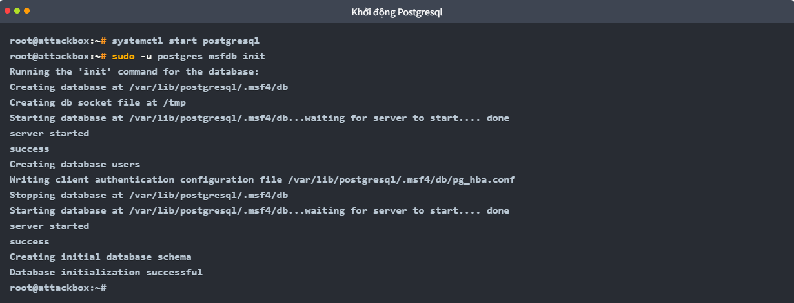

Giờ đây bạn có thể khởi chạy `msfconsole` và kiểm tra trạng thái cơ sở dữ liệu bằng `db_status`.
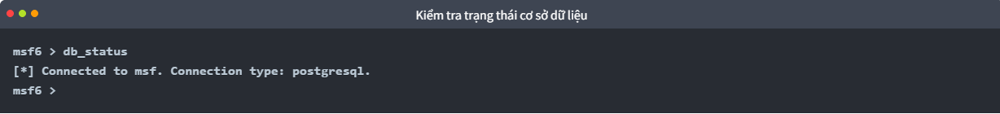

Tính năng cơ sở dữ liệu cho phép bạn tạo các không gian làm việc để phân tách các dự án khác nhau. Khi khởi chạy lần đầu, bạn sẽ ở trong không gian làm việc mặc định. Bạn có thể liệt kê các không gian làm việc khả dụng bằng `workspace`.
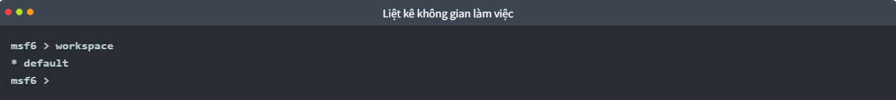

Bạn có thể thêm không gian làm việc bằng `-a` hoặc xóa không gian làm việc bằng `-d`. Ảnh chụp màn hình bên dưới cho thấy một không gian làm việc mới có tên "tryhackme" đã được tạo.
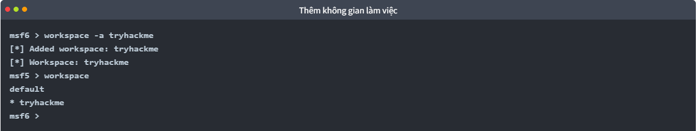

Bạn cũng sẽ nhận thấy rằng tên cơ sở dữ liệu mới được in màu đỏ, bắt đầu bằng một ký hiệu `*`.

Bạn có thể sử dụng lệnh workspace để điều hướng giữa các workspace bằng cách chỉ cần gõ lệnh `workspace` theo sau là tên workspace mong muốn
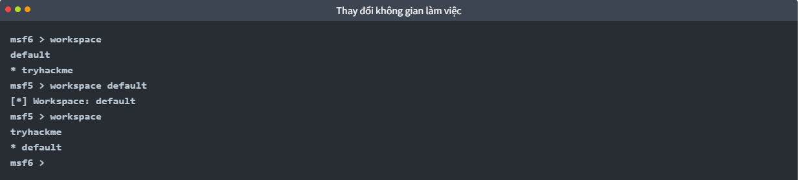

Bạn có thể sử dụng workspace `-h` để liệt kê các tùy chọn có sẵn cho workspacelệnh đó
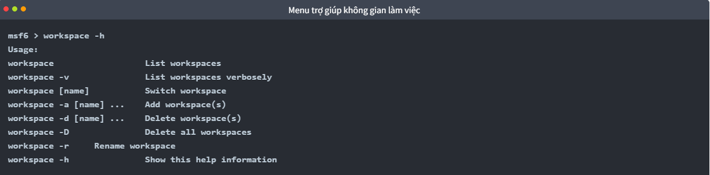

Khác với cách sử dụng Metasploit thông thường, khi Metasploit được khởi chạy với một cơ sở dữ liệu, `help` sẽ hiển thị menu Lệnh Cơ sở dữ liệu phụ trợ (_Database Backends Commands_).
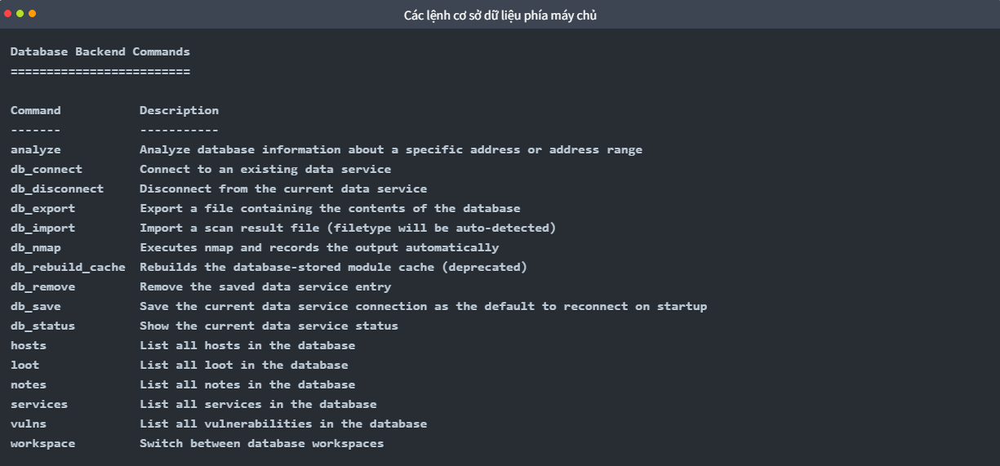

Nếu bạn chạy quét Nmap bằng lệnh `db_nmap` được hiển thị bên dưới, tất cả kết quả sẽ được lưu vào cơ sở dữ liệu.
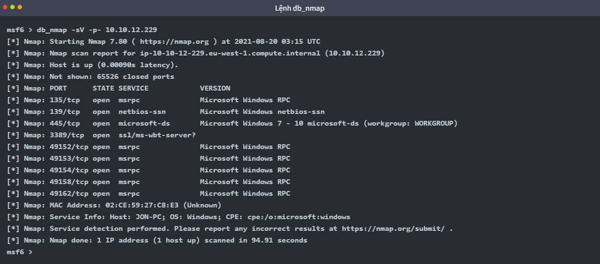

Giờ đây, bạn có thể truy cập thông tin liên quan đến các máy chủ và dịch vụ đang chạy trên hệ thống mục tiêu bằng các lệnh `hosts` và `services` tương ứng. 

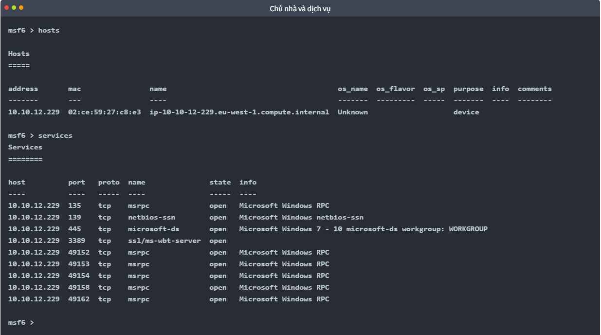

Các lệnh `hosts -h` và `services -h` có thể giúp bạn làm quen hơn với các tùy chọn có sẵn. Sau khi thông tin máy chủ được lưu trữ trong cơ sở dữ liệu, bạn có thể sử dụng `hosts -R` lệnh để thêm giá trị này vào tham số **RHOSTS**.

**Ví dụ về quy trình làm việc**
- Chúng ta sẽ sử dụng mô-đun quét lỗ hổng bảo mật để tìm các lỗ hổng MS17-010 tiềm ẩn bằng `use auxiliary/scanner/smb/smb_ms17_010`.
- Chúng tôi đặt giá trị RHOSTS bằng cách sử dụng `hosts -R`.
- Chúng ta nhập lệnh `show options` để kiểm tra xem tất cả các giá trị đã được gán chính xác hay chưa. (Trong ví dụ này, 10.10.138.32 là địa chỉ IP mà chúng ta đã quét trước đó bằng `db_nmap`).
- Sau khi thiết lập tất cả các tham số, chúng ta sẽ khởi chạy mã khai thác bằng lệnh `run` hoặc `exploit` .

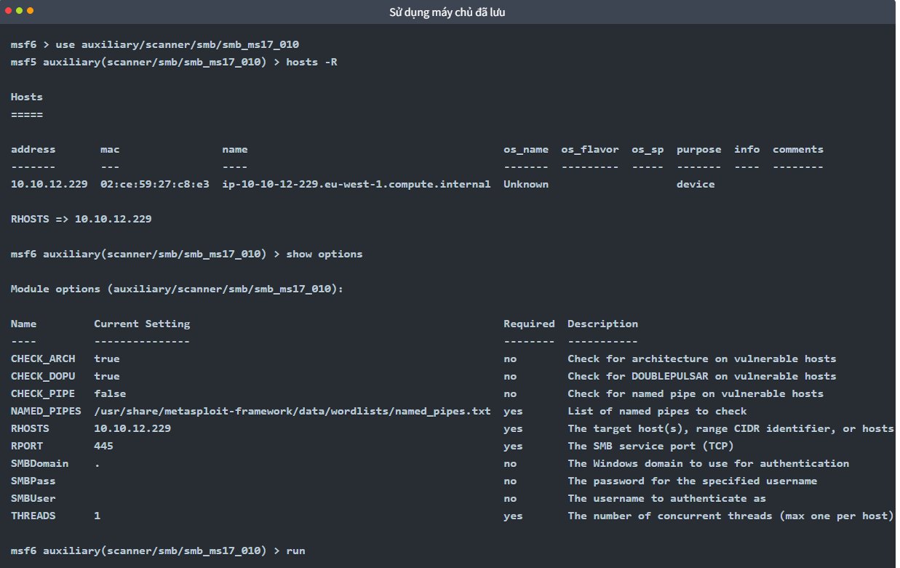

Nếu có nhiều hơn một máy chủ được lưu trong cơ sở dữ liệu, tất cả các địa chỉ IP sẽ được sử dụng khi `hosts -R` được thực thi.\
Trong một dự án kiểm thử xâm nhập điển hình, chúng ta có thể gặp phải tình huống sau: 
- Tìm kiếm các máy chủ khả dụng bằng `db_nmap`
- Quét các cổng này để tìm thêm lỗ hổng bảo mật hoặc cổng mở (sử dụng mô-đun quét cổng). 
- Lệnh `services` được sử dụng với `-S` sẽ cho phép bạn tìm kiếm các dịch vụ cụ thể trong môi trường.
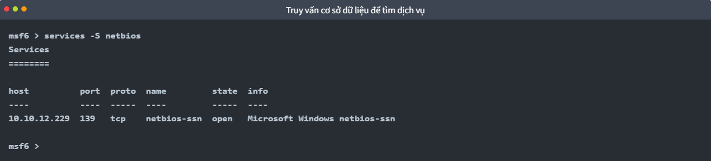

Bạn có thể muốn tìm kiếm những cơ hội dễ dàng đạt được như:
- `HTTP` : Có khả năng lưu trữ một ứng dụng web nơi bạn có thể tìm thấy các lỗ hổng như tấn công SQL injection hoặc thực thi mã từ xa ( RCE ).
- `FTP` : Có thể cho phép đăng nhập ẩn danh và cung cấp quyền truy cập vào các tập tin quan trọng.
- `SMB` : Có thể dễ bị tấn công bằng các lỗ hổng SMB như MS17-010
- `SSH` : Có thể sử dụng thông tin đăng nhập mặc định hoặc dễ đoán.
- `RDP` : Có thể dễ bị tấn công bởi Bluekeep hoặc cho phép truy cập vào màn hình máy tính nếu sử dụng thông tin đăng nhập yếu. 

Như bạn thấy, Metasploit có nhiều tính năng hỗ trợ các hoạt động tấn công, chẳng hạn như khả năng phân chia các hoạt động thành các không gian làm việc, phân tích kết quả ở cấp độ cao và nhanh chóng nhập cũng như khám phá dữ liệu.

## 4. Vulnerability Scanning
Metasploit cho phép bạn nhanh chóng xác định một số lỗ hổng nghiêm trọng có thể được coi là "lỗ hổng dễ khai thác". Thuật ngữ "lỗ hổng dễ khai thác" thường đề cập đến các lỗ hổng dễ nhận biết và dễ khai thác, có khả năng cho phép bạn giành được quyền kiểm soát hệ thống và, trong một số trường hợp, giành được các đặc quyền cấp cao như root hoặc quản trị viên.

Việc tìm kiếm lỗ hổng bằng Metasploit phụ thuộc rất nhiều vào khả năng quét và nhận dạng mục tiêu của bạn. Bạn càng giỏi ở các bước này, Metasploit càng cung cấp cho bạn nhiều tùy chọn hơn. Ví dụ, nếu bạn xác định được dịch vụ VNC đang chạy trên mục tiêu, bạn có thể sử dụng searchchức năng trên Metasploit để liệt kê các mô-đun hữu ích. Kết quả sẽ bao gồm các mô-đun payload và post. Ở giai đoạn này, những kết quả này chưa thực sự hữu ích vì chúng ta chưa phát hiện ra một lỗ hổng tiềm năng nào để khai thác. Tuy nhiên, trong trường hợp của VNC, có một số mô-đun quét mà chúng ta có thể sử dụng.
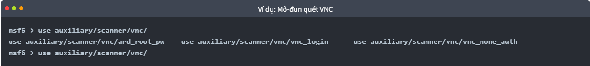

Bạn có thể sử dụng `info` - lệnh này cho bất kỳ mô-đun nào để hiểu rõ hơn về cách sử dụng và mục đích của nó.
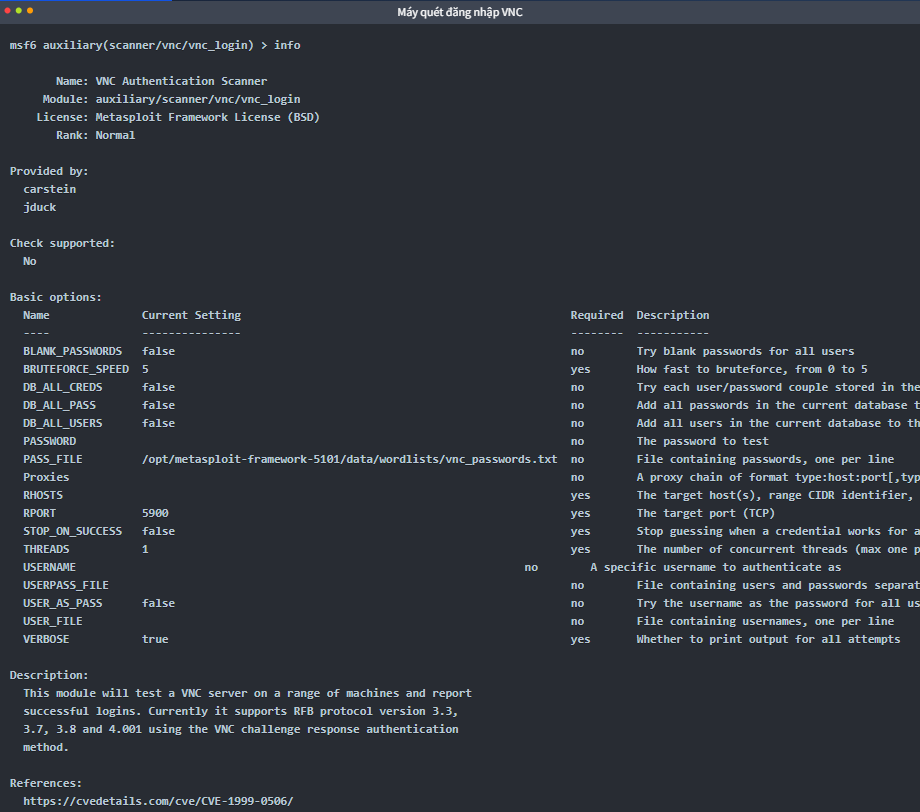

## 5. Exploitation
Như tên gọi cho thấy, Metasploit là một framework khai thác lỗ hổng. Khai thác lỗ hổng là loại module phổ biến nhất.
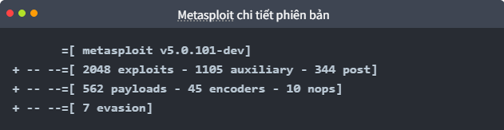

Bạn có thể tìm kiếm các lỗ hổng bảo mật bằng `search` , lấy thêm thông tin về lỗ hổng bằng `info` , và khởi chạy lỗ hổng bằng `exploit` . Mặc dù quy trình khá đơn giản, hãy nhớ rằng kết quả thành công phụ thuộc vào sự hiểu biết thấu đáo về các dịch vụ đang chạy trên hệ thống mục tiêu.

Hầu hết các lỗ hổng bảo mật sẽ có một payload mặc định được thiết lập sẵn. Tuy nhiên, bạn luôn có thể sử dụng `show payloads` để liệt kê các lệnh khác mà bạn có thể sử dụng với lỗ hổng cụ thể đó.
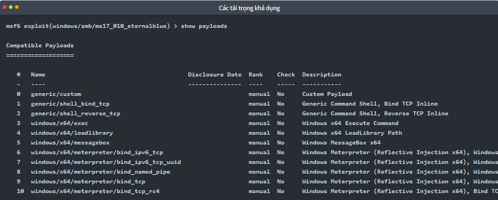

Sau khi đã quyết định payload, bạn có thể sử dụng `set payload` để thực hiện lựa chọn của mình.
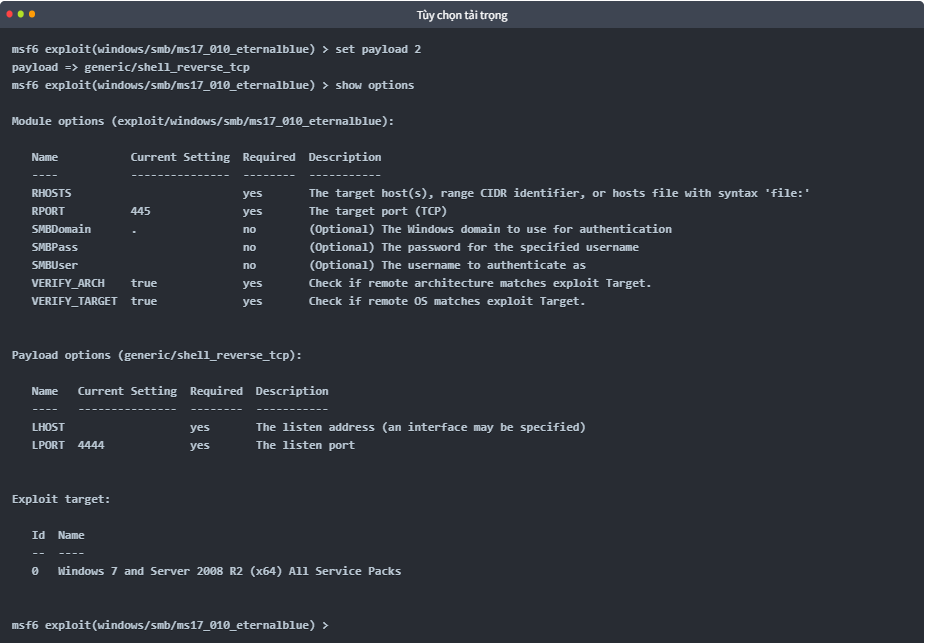

Lưu ý rằng việc lựa chọn payload hoạt động có thể trở thành một quá trình thử và sai do các hạn chế về môi trường hoặc hệ điều hành như quy tắc tường lửa, phần mềm chống vi-rút, ghi tập tin hoặc chương trình thực thi payload không khả dụng (ví dụ: `payload/python/shell_reverse_tcp`).

Một số payload sẽ mở ra các tham số mới mà bạn có thể cần thiết lập; chạy lại `show options` lệnh một lần nữa có thể hiển thị các tham số này. Như bạn có thể thấy trong ví dụ trên, một payload đảo ngược ít nhất sẽ yêu cầu bạn thiết lập `LHOST`.
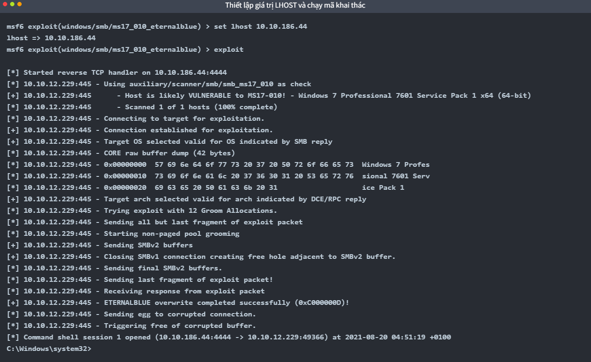

Sau khi mở một phiên, bạn có thể cho nó chạy ngầm bằng lệnh `CTRL+Z` hoặc hủy bỏ bằng lệnh `CTRL+C`. Việc cho phiên chạy ngầm sẽ hữu ích khi làm việc đồng thời trên nhiều mục tiêu hoặc trên cùng một mục tiêu với các khai thác và/hoặc shell khác nhau.
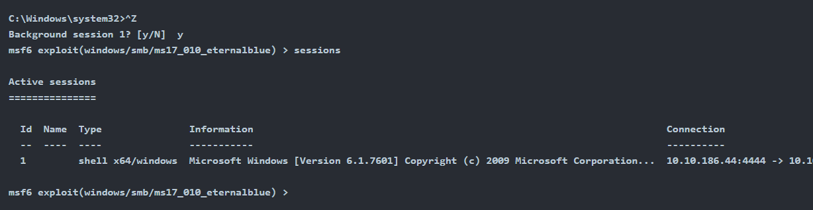

### Working with sessions
Lệnh `sessions` sẽ liệt kê tất cả các phiên đang hoạt động. Lệnh hỗ trợ một số tùy chọn giúp bạn quản lý các phiên tốt hơn.
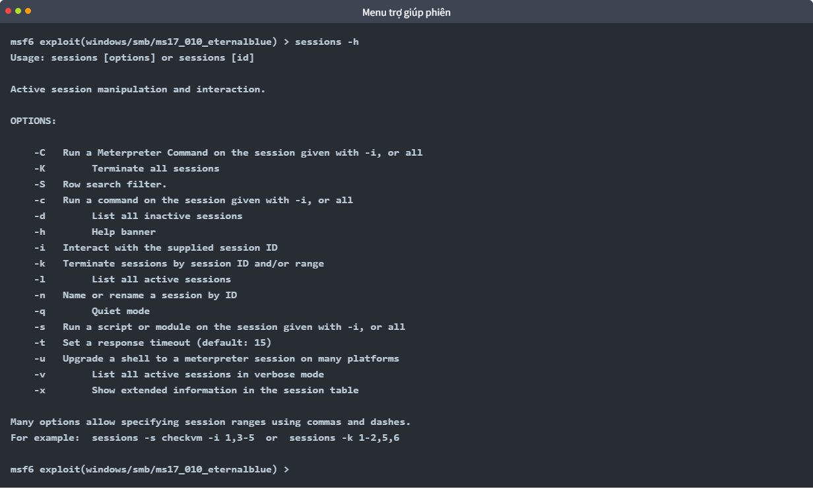

Bạn có thể tương tác với bất kỳ phiên hiện có nào bằng cách sử dụng `sessions -i` lệnh theo sau là ID phiên.
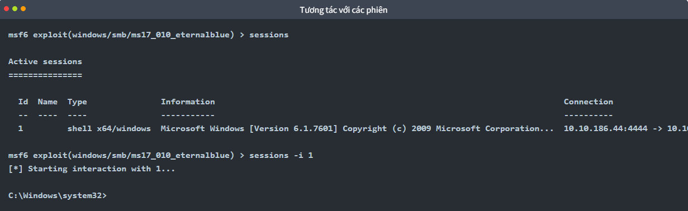

