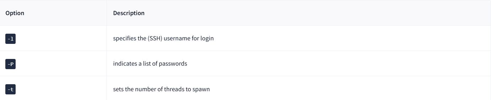
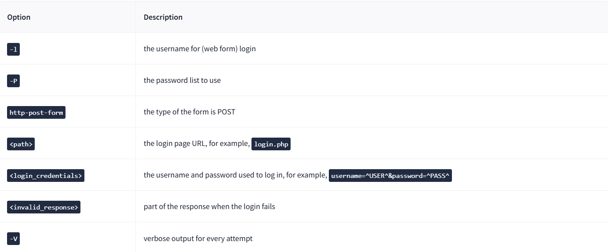
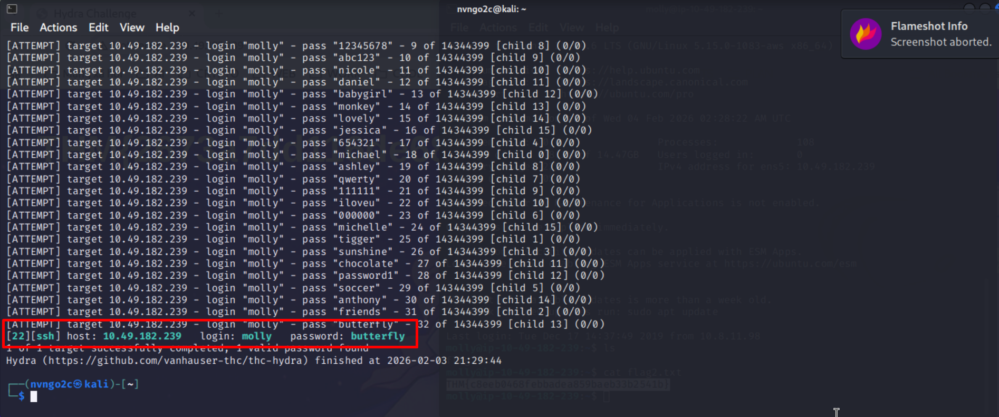
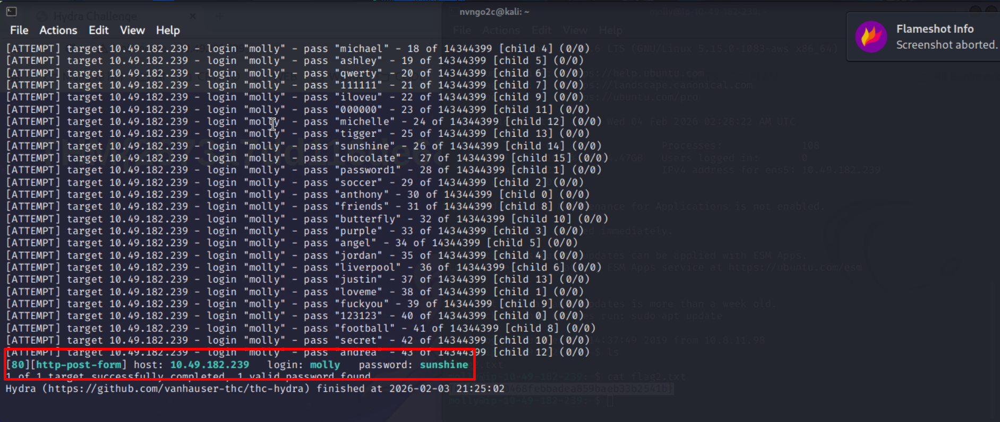

# Hydra
## 1. Hydra Introduction
**Hydra là gì?**

Hydra là một chương trình **bẻ khóa mật khẩu** trực tuyến theo phương thức tấn công vét cạn (**brute force**), một công cụ "hack" mật khẩu đăng nhập hệ thống rất nhanh chóng.

Hydra có thể chạy qua một danh sách và "tấn công vét cạn" một số dịch vụ xác thực. Hãy tưởng tượng việc bạn cố gắng đoán mật khẩu của ai đó một cách thủ công trên một dịch vụ cụ thể (*như SSH, Biểu mẫu ứng dụng Web, FTP hoặc SNMP*) - chúng ta có thể sử dụng Hydra để chạy qua một danh sách mật khẩu và tăng tốc quá trình này, nhằm xác định mật khẩu chính xác.

Theo [kho lưu trữ chính thức](https://github.com/vanhauser-thc/thc-hydra), Hydra hỗ trợ (tức là có khả năng tấn công vét cạn) các giao thức sau: Asterisk, AFP, Cisco AAA, Cisco auth, Cisco enable, CVS, Firebird, FTP, HTTP-FORM-GET, HTTP-FORM-POST, HTTP-GET, HTTP-HEAD, HTTP-POST, HTTP-PROXY, HTTPS-FORM-GET, HTTPS-FORM-POST, HTTPS-GET, HTTPS-HEAD, HTTPS-POST, HTTP-Proxy, ICQ, IMAP, IRC, LDAP, MEMCACHED, MONGODB, MS-SQL, MYSQL, NCP, NNTP, Oracle Listener, Oracle SID, Oracle, PC-Anywhere, PCNFS, POP3, POSTGRES, Radmin, RDP, Rexec, Rlogin, Rsh, RTSP, SAP/R3, SIP, SMB, SMTP, SMTP Enum, SNMP v1+v2+v3, SOCKS5, SSH (v1 và v2), SSHKEY, Subversion, TeamSpeak (TS2), Telnet, VMware-Auth, VNC và XMPP.

Để biết thêm thông tin về các tùy chọn của từng giao thức trong Hydra, bạn có thể kiểm tra [trang công cụ Hydra của Kali](https://en.kali.tools/?p=220).

Điều này cho thấy tầm quan trọng của việc sử dụng một mật khẩu mạnh; nếu mật khẩu của bạn phổ biến, không chứa các ký tự đặc biệt và không dài trên tám ký tự, nó sẽ rất dễ bị đoán ra. Một danh sách chứa một trăm triệu mật khẩu thường bao gồm các mật khẩu phổ thông, vì vậy khi một ứng dụng mới cài đặt sử dụng mật khẩu dễ để đăng nhập, hãy thay đổi nó ngay lập tức khỏi giá trị mặc định! Camera giám sát (CCTV) và các khung phần mềm web (web frameworks) thường sử dụng `admin:password` làm thông tin đăng nhập mặc định, điều này rõ ràng là không đủ an toàn.

**Cài đặt**
Nếu bạn muốn sử dụng máy ảo Kali trực tiếp trên máy ảo, Hydra cũng đã được cài đặt sẵn giống như trên tất cả các bản phân phối Kali khác. Bạn có thể truy cập bằng cách chọn Use Kali Linux và nhấn vào nút Start Kali Linux.

Tuy nhiên, bạn có thể kiểm tra các kho lưu trữ chính thức của nó nếu muốn sử dụng một bản phân phối Linux khác. Ví dụ: bạn có thể cài đặt Hydra trên hệ thống Ubuntu hoặc Fedora bằng cách thực thi lệnh `apt install hydra` hoặc `dnf install hydra`. Ngoài ra, bạn cũng có thể tải nó từ kho lưu trữ chính thức của `THC-Hydra`.

## 2. Using Hydra
### 1. Hydra commands
Các tùy chọn mà chúng ta truyền vào Hydra phụ thuộc vào dịch vụ (giao thức) mà chúng ta đang tấn công. Ví dụ, nếu chúng ta muốn tấn công vét cạn giao thức `FTP` với tên người dùng là `user` và danh sách mật khẩu là `passlist.txt`, chúng ta sẽ sử dụng câu lệnh sau:

`hydra -l user -P passlist.txt ftp://MACHINE_IP`

Đối với máy ảo đã triển khai này, dưới đây là các câu lệnh để sử dụng Hydra trên giao thức `SSH` và một biểu mẫu web (phương thức POST).

### 2. SSH

`hydra -l <tên_người_dùng> -P <đường_dẫn_đến_file_mật_khẩu> 10.49.182.239 -t 4 ssh`

Ví dụ, lệnh: `hydra -l root -P passwords.txt 10.49.182.239 -t 4 ssh` sẽ chạy với các đối số như sau:
- Hydra sẽ sử dụng `root` làm tên đăng nhập cho dịch vụ `SSH`.
- Nó sẽ thử lần lượt các mật khẩu nằm trong file `passwords.txt`.
- Sẽ có bốn luồng chạy song song cùng lúc như được chỉ định bởi `-t 4`.

### 3. Post web form
Chúng ta cũng có thể sử dụng Hydra để tấn công vét cạn các biểu mẫu trên web. Bạn phải biết loại yêu cầu (request) mà biểu mẫu đó đang thực hiện là gì; các phương thức GET hoặc POST thường được sử dụng phổ biến nhất. Bạn có thể sử dụng tab Network (Mạng) trong trình duyệt của mình (trong công cụ dành cho nhà phát triển - Developer Tools) để xem loại yêu cầu hoặc xem mã nguồn của trang web.

`sudo hydra <username> <wordlist> 10.49.182.239 http-post-form "<path>:<login_credentials>:<invalid_response>"`

`hydra -l <tên_người_dùng> -P <danh_sách_mật_khẩu> 10.49.182.239 http-post-form Your username or password is incorrect.

- Trang đăng nhập chỉ là /: Tức là ngay tại địa chỉ IP chính.
- `username`: Là tên trường (field) trong biểu mẫu mà bạn nhập tên đăng nhập vào.
- `^USER^`: Hydra sẽ thay thế chỗ này bằng (các) tên đăng nhập bạn đã chỉ định.
- `password`: Là tên trường trong biểu mẫu mà bạn nhập mật khẩu vào.
- `^PASS^`: Hydra sẽ thay thế chỗ này bằng các mật khẩu từ danh sách bạn cung cấp.
- `F=incorrect`: Là chuỗi ký tự xuất hiện trong phản hồi từ máy chủ khi đăng nhập thất bại.
- `-V`: Hiển thị chi tiết quá trình thử từng cặp tài khoản/mật khẩu.

`hydra -l molly -P /usr/share/wordlists/rockyou.txt 10.49.182.239 ssh -V`

`hydra -l molly -P /usr/share/wordlists/rockyou.txt 10.49.182.239 http-post-form "/login:username=^USER^&password=^PASS^:F=Your username or password is incorrect." -V`

