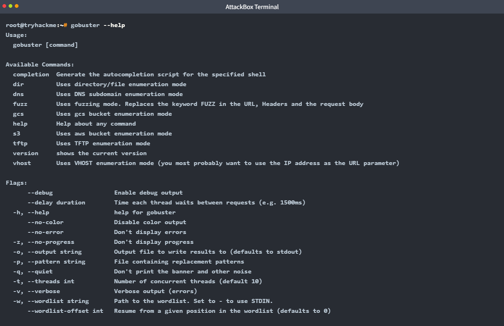
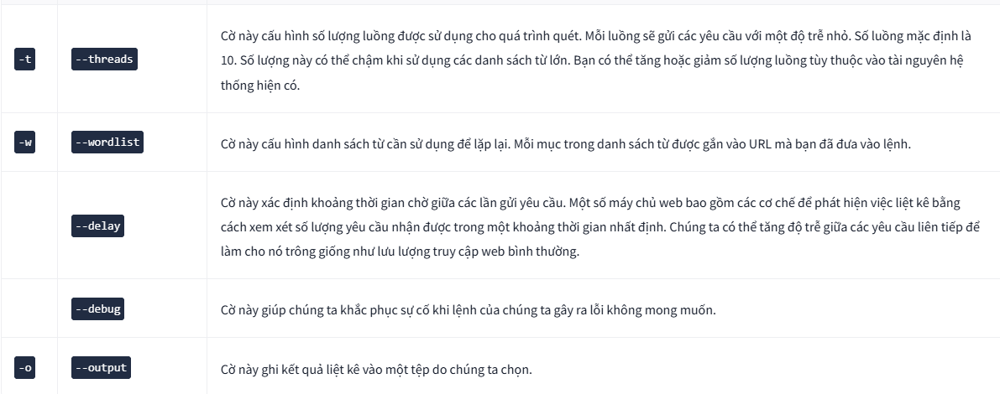
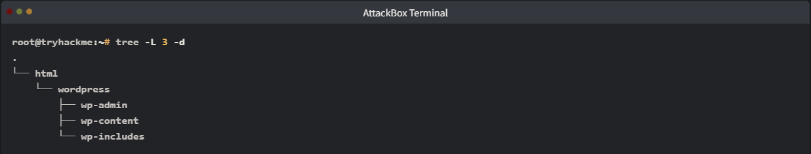
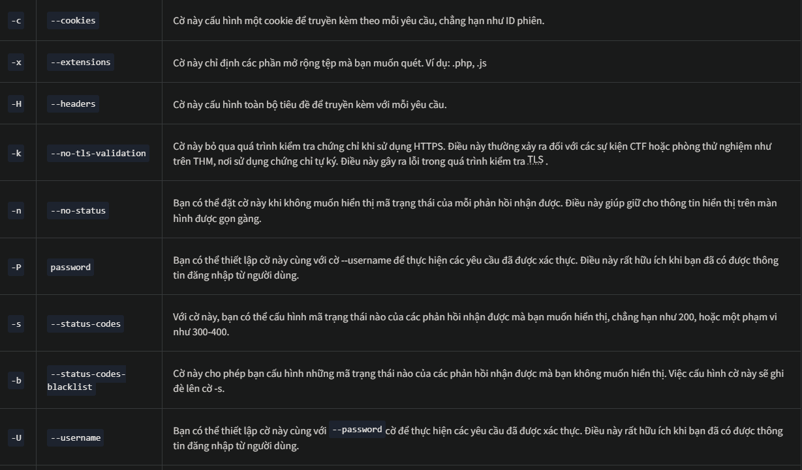
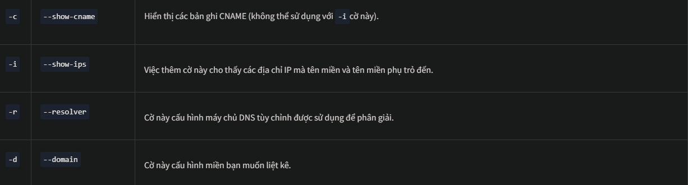
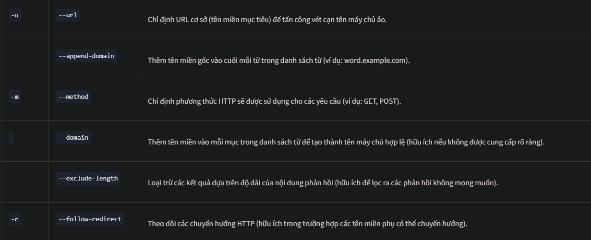
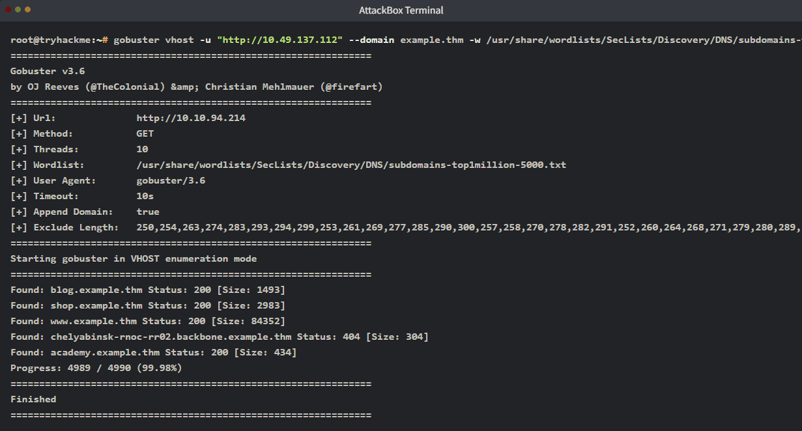

# Gobuster: The Basics
## 1. Introduction
Phòng thực hành này tập trung vào công cụ bảo mật tấn công **Gobuster**, thường được sử dụng trong giai đoạn trinh sát (_reconnaissance_). Chúng ta sẽ tìm hiểu cách công cụ này liệt kê (enumerate) các thư mục web, tên miền phụ (subdomains) và máy chủ ảo (virtual hosts). Bài học này sẽ đi theo hướng thực hành, nơi bạn có thể làm theo các câu lệnh được giải thích và tự mình thực thi chúng để xem kết quả.

- Mục tiêu học tập của bài này bao gồm:
    - **Hiểu các khái niệm cơ bản về liệt kê** (enumeration): Nắm vững nguyên lý cốt lõi của việc dò quét thông tin.

    - **Cách sử dụng Gobuster để liệt kê các thư mục và tệp tin web**: Tìm ra những đường dẫn ẩn trên máy chủ.

    - **Cách sử dụng Gobuster để liệt kê các tên miền phụ** (subdomains): Mở rộng phạm vi tấn công thông qua các subdomain.

    - **Cách sử dụng Gobuster để liệt kê các máy chủ ảo** (virtual hosts): Xác định các cấu hình máy chủ ảo khác nhau trên cùng một IP.

    - **Cách sử dụng danh sách từ** (wordlist): Hiểu tầm quan trọng và cách chọn lựa tệp dữ liệu mẫu để dò quét hiệu quả.

## 2. Environmant and Setup
## 3. Gobuster: Introduction
`Gobuster` là một công cụ bảo mật tấn công mã nguồn mở được viết bằng ngôn ngữ **Golang**. Công cụ này thực hiện liệt kê các thư mục web, tên miền phụ (DNS subdomains), máy chủ ảo (vhosts), các phân vùng lưu trữ Amazon S3 và Google Cloud Storage bằng phương pháp **tấn công vét cạn** (_brute force_). Nó sử dụng các danh sách từ (wordlists) cụ thể và xử lý các phản hồi nhận được từ máy chủ.

- **Liệt kê** (_Enumeration_) Liệt kê là hành động liệt kê tất cả các tài nguyên có sẵn, bất kể chúng có thể truy cập được hay không. Ví dụ, Gobuster liệt kê các thư mục web để tìm ra cấu trúc của trang web đó.

- **Tấn công vét cạn** (_Brute Force_) Tấn công vét cạn là hành động thử mọi khả năng có thể cho đến khi tìm thấy một kết quả khớp. Nó giống như việc bạn có mười chiếc chìa khóa và thử lần lượt từng chiếc vào ổ khóa cho đến khi có một chiếc vừa vặn. Gobuster sử dụng các danh sách từ (wordlists) cho mục đích này.

### 1. Gobuster: Overview(_Tổng quan_)
Gobuster được tích hợp sẵn theo mặc định trong các bản phân phối như Kali Linux. Hãy bắt đầu bằng cách xem qua trang trợ giúp của Gobuster. Trang này sẽ cung cấp cho chúng ta một cái nhìn tổng quan về các chức năng và tùy chọn của công cụ.

Nhập lệnh sau: `gobuster --help`. Bạn sẽ nhận được trang trợ giúp của công cụ Gobuster như hình bên dưới:

Trang trợ giúp của Gobuster được chia thành nhiều phần chính như sau:
- **Usage** (Cách dùng): Hiển thị cú pháp chuẩn để thực thi câu lệnh.
- **Available Commands** (Các lệnh khả dụng): Cung cấp nhiều chế độ khác nhau để hỗ trợ liệt kê thư mục, tệp tin, tên miền phụ (DNS), các thùng lưu trữ Google Cloud và Amazon AWS S3. Trong phạm vi bài học này, chúng ta sẽ tập trung vào ba lệnh: dir, dns, và vhost. Mỗi lệnh sẽ được hướng dẫn chi tiết trong các phần tiếp theo.
- **Flags** (Cờ/Tham số): Đây là các tùy chọn cụ thể mà chúng ta có thể cấu hình để tùy biến câu lệnh theo nhu cầu.

Dưới đây là các **Flags** (tham số) mà chúng ta sẽ thường xuyên sử dụng trong suốt phòng thực hành này:

Dưới đây là phần giải thích chi tiết hơn cho ví dụ lệnh quét thư mục mà bạn vừa nêu:

`gobuster dir -u "http://www.example.thm/" -w /usr/share/wordlists/dirb/small.txt -t 64`

*Phân tích chi tiết các thành phần:
- `gobuster dir`: Đây là lệnh bắt buộc để báo cho công cụ biết bạn muốn quét thư mục và tệp tin (Directory/File mode).
- `-u` "http://www.example.thm/": Cờ này chỉ định mục tiêu. Luôn đảm bảo bạn có đầy đủ giao thức (http:// hoặc https://).
- `-w /usr/share/wordlists/dirb/small.txt`: Đây là "bộ não" của cuộc tấn công. Gobuster sẽ lấy từng dòng trong file small.txt để ghép vào sau URL mục tiêu.

*Ví dụ*: Nếu trong file có từ `admin`, Gobuster sẽ kiểm tra `http://www.example.thm/admin`.

- `-t 64`: Đây là số lượng công việc được xử lý cùng một lúc. Thay vì hỏi từng cái một, Gobuster sẽ gửi 64 yêu cầu cùng lúc. Điều này giúp tốc độ quét nhanh gấp nhiều lần so với mặc định (thường là 10)

## 4. Use Case: Directory and File Enumerration
Chế độ `dir` của **Gobuster** cho phép người dùng liệt kê các *thư mục* và *tệp tin* của một trang web. Chế độ này cực kỳ hữu ích khi bạn đang thực hiện kiểm thử xâm nhập và muốn nắm rõ cấu trúc thư mục cũng như các tệp tin hiện có.

Thông thường, cấu trúc thư mục của các trang web và ứng dụng web tuân theo một số quy ước nhất định, điều này khiến chúng dễ bị **tấn công vét cạn** (Brute Force) bằng cách **sử dụng danh sách từ khóa** (wordlists).

Ví dụ, cấu trúc thư mục trên một máy chủ web chạy WordPress thường trông như thế này:

Gobuster thực sự mạnh mẽ nhờ khả năng quét website và trả về các mã trạng thái HTTP (status codes) một cách nhanh chóng. Những mã trạng thái này ngay lập tức cho bạn biết rằng, với tư cách là một người dùng từ bên ngoài, bạn có quyền yêu cầu truy cập vào thư mục đó hay không.

Thay vì phải ngồi đoán và nhập từng URL vào trình duyệt, Gobuster tự động hóa quá trình này và phân loại kết quả cho bạn.

Nếu bạn muốn xem toàn bộ những gì lệnh gobuster dir có thể làm, bạn có thể kiểm tra trang trợ giúp của nó. Nhìn vào danh sách hướng dẫn đồ sộ của lệnh dir có thể khiến bạn cảm thấy hơi "ngợp", vì vậy trong phòng thực hành này, chúng ta sẽ chỉ tập trung vào những cờ (flags) thiết yếu nhất.

### 1. Help
Hãy nhập lệnh sau để hiển thị nội dung trợ giúp: `gobuster dir --help`.

Có rất nhiều cờ được sử dụng để tinh chỉnh lệnh `gobuster dir`. Việc đi sâu vào từng cái một nằm ngoài phạm vi của bài này, nhưng bảng dưới đây liệt kê những cờ quan trọng nhất, đáp ứng được hầu hết các tình huống thực tế:

### . How To Use dir Mode
Để chạy Gobuster ở chế độ dir, hãy sử dụng định dạng lệnh sau:

`gobuster dir -u "http://www.example.thm" -w /path/to/wordlist`

_*Lưu ý_ rằng lệnh này bao gồm các cờ `-u` và `-w`, cùng với từ khóa `dir`. Hai cờ này là bắt buộc để quá trình liệt kê thư mục của Gobuster có thể hoạt động. Hãy cùng xem một ví dụ thực tế về cách liệt kê các thư mục và tệp tin:

`gobuster dir -u "http://www.example.thm" -w /usr/share/wordlists/dirbuster/directory-list-2.3-medium.txt -r`

Câu lệnh này thực hiện quét toàn bộ các thư mục tại địa chỉ `www.example.thm` bằng cách sử dụng danh sách từ khóa `directory-list-2.3-medium.txt`. Hãy cùng phân tích kỹ hơn từng thành phần của câu lệnh:

1. `gobuster dir`
Thiết lập Gobuster ở chế độ liệt kê thư mục và tệp tin.

2. `-u http://www.example.thm`
Điểm bắt đầu: URL này là đường dẫn cơ sở nơi Gobuster bắt đầu tìm kiếm. Ví dụ trên đang sử dụng thư mục gốc của trang web.

Ví dụ: Trong một cài đặt Apache điển hình trên Linux, thư mục này là `/var/www/html`. Nếu bạn có một thư mục tên là "resources" và muốn liệt kê thư mục đó, bạn sẽ đặt URL là `http://www.example.thm/resources`.

**Giao thức là bắt buộc**: URL phải chứa giao thức (trong trường hợp này là HTTP). Đây là yêu cầu bắt buộc; nếu bạn nhập sai giao thức, quá trình quét sẽ thất bại.

**IP hay Hostname**: Bạn có thể nhập địa chỉ IP hoặc tên miền (Hostname). Tuy nhiên, nếu sử dụng IP, bạn có thể quét nhầm trang web khác vì một máy chủ có thể lưu trữ nhiều website trên cùng một IP (kỹ thuật này gọi là Virtual Hosting). **Hãy sử dụng Hostname để đảm bảo độ chính xác.**

**Tính đệ quy**: Gobuster không liệt kê đệ quy theo mặc định. Nghĩa là nếu kết quả hiển thị một thư mục con mà bạn quan tâm, bạn sẽ phải thực hiện một lệnh quét mới dành riêng cho thư mục đó.

3. `-w /usr/share/wordlists/dirbuster/directory-list-2.3-medium.txt`
Cấu hình Gobuster sử dụng danh sách từ khóa này để liệt kê. Mỗi mục trong danh sách sẽ được thêm vào sau URL đã cấu hình để thử nghiệm.

4. `-r` (_Follow Redirects_)
Cấu hình Gobuster để tự động đi theo các phản hồi chuyển hướng (redirect) nhận được. Nếu nhận được mã trạng thái `301`, Gobuster sẽ tự động truy cập vào URL chuyển hướng có trong phản hồi đó để kiểm tra kết quả cuối cùng.

Trong ví dụ này, chúng ta sẽ đi sâu vào việc tìm kiếm không chỉ thư mục mà cả các tệp tin cụ thể bằng cách sử dụng cờ -x.

`gobuster dir -u "http://www.example.thm" -w /usr/share/wordlists/dirbuster/directory-list-2.3-medium.txt -x .php,.js`

**Chức năng**: Cờ `-x` cho phép bạn chỉ định danh sách các phần mở rộng (đuôi tệp) mà bạn muốn Gobuster kiểm tra.

## 5. Use case: Subdomain Enumertation

Chế độ tiếp theo mà chúng ta sẽ tìm hiểu là chế độ `dns`. Chế độ này cho phép Gobuster thực hiện tấn công vét cạn (brute force) các tên miền phụ (subdomains).

Trong một cuộc kiểm thử xâm nhập, việc kiểm tra các subdomain của tên miền chính là bước cực kỳ thiết yếu. Ngay cả khi tên miền chính đã được vá lỗi và bảo mật kỹ càng, điều đó không đồng nghĩa với việc các subdomain cũng được an toàn tương tự. Một lỗ hổng có thể tồn tại ở một trong các subdomain này mà bạn có thể khai thác.

Ví dụ: Nếu TryHackMe sở hữu tên miền `tryhackme.thm` và `mobile.tryhackme.thm`, có thể có một lỗ hổng xuất hiện trên trang `mobile` nhưng lại không có trên trang chủ. Đó là lý do tại sao việc tìm kiếm subdomain lại quan trọng đến thế!

### 1. Help
Nếu bạn muốn có cái nhìn đầy đủ về tất cả những gì lệnh `gobuster nds` có thể cung cấp, bạn có thể xem qua trang trợ giúp của nó. Việc nhìn thấy một trang trợ giúp dài dằng dặc đôi khi có thể gây nản lòng, vì vậy chúng ta sẽ chỉ tập trung vào những cờ (flags) quan trọng nhất trong phòng thực hành này.

Hãy nhập lệnh sau để hiển thị nội dung trợ giúp: `gobuster dns --help`

Chế độ `dns` cung cấp ít cờ hơn so với chế độ `dir`, nhưng bấy nhiêu là quá đủ để bao quát hầu hết các kịch bản liệt kê tên miền phụ DNS. Dưới đây là bảng tổng hợp các cờ thường được sử dụng nhất:

### 2. Cách sử dụng chế độ DNS
Để chạy Gobuster ở chế độ `dns`, hãy sử dụng cú pháp câu lệnh sau:

`gobuster dns -d example.thm -w /path/to/wordlist`

_*Lưu ý_ rằng ngoài từ khóa `dns`, câu lệnh còn bao gồm các cờ `-d` và `-w`. Đây là 2 cờ bắt buộc để quá trình liệt kê tên miền phụ của Gobuster có thể hoạt động. Hãy cùng xem một ví dụ về cách liệt kê các subdomain:

`gobuster dns -d example.thm -w /usr/share/wordlists/SecLists/Discovery/DNS/subdomains-top1million-5000.txt`

- Phân tích chi tiết câu lệnh:
    - `gobuster dns`: Thực hiện liệt kê các subdomain trên tên miền đã cấu hình.

    - `-d example.thm`: Thiết lập mục tiêu là tên miền example.thm.
    - `-w .../subdomains-top1million-5000.txt`: Thiết lập danh sách từ khóa sẽ sử dụng. Gobuster lấy từng mục trong danh sách này để tạo ra một truy vấn DNS mới.

Ví dụ: Nếu mục đầu tiên trong danh sách là all, Gobuster sẽ thực hiện truy vấn cho địa chỉ `all.example.thm`.

## 6. Use Case: Vhost Enumeration
Chế độ `vhost` giúp tìm kiếm các **máy chủ ảo** (Virtual Hosts) cùng chạy trên một địa chỉ IP. Dù trông giống subdomain, nhưng chúng khác nhau về bản chất:
- **Virtual Hosts**: Chạy trên cùng một máy chủ vật lý (dựa vào IP).
- **Subdomains**: Được cấu hình trên hệ thống DNS.

_*Sự khác biệt khi quét:_

- **vhost mode** (`-u`): Truy cập trực tiếp URL bằng cách kết hợp Hostname với từ điển (dựa vào HTTP Header).
- **dns mode** (`-d`): Truy vấn DNS để tìm tên miền đầy đủ (FQDN).

### 1. Help
Nếu muốn xem toàn bộ khả năng của lệnh `gobuster vhost`, bạn có thể xem trang trợ giúp (help page). Vì danh sách tùy chọn rất dài và có thể gây bối rối, chúng ta sẽ chỉ tập trung vào những tham số quan trọng nhất.

Để hiển thị hướng dẫn, hãy nhập lệnh: `gobuster vhost --help`

Chế độ `vhost` có các tham số (flags) khá tương đồng với chế độ `dir`. Dưới đây là một số tham số thường dùng:

### 2. Cách sử dụng chế độ vhost
Để thực hiện dò tìm virtual host, hãy sử dụng cấu trúc lệnh sau:

`gobuster vhost -u "http://example.thm" -w /path/to/wordlist`

_*Lưu ý quan trọng_:

- Ngoài từ khóa `vhost`, bạn bắt buộc phải có hai tham số: `-u` (URL mục tiêu) và `-w` (đường dẫn danh sách từ khóa).
- Đây là hai thành phần thiết yếu để Gobuster có thể bắt đầu quá trình liệt kê.

`root@tryhackme:~# gobuster vhost -u "http://10.49.137.112" --domain example.thm -w /usr/share/wordlists/SecLists/Discovery/DNS/subdomains-top1million-5000.txt --append-domain --exclude-length 250-320 `

Bạn sẽ thấy câu lệnh này phức tạp hơn nhiều so với cú pháp cơ bản. Trong các bài kiểm tra thực tế, việc thêm nhiều tham số (flags) là rất phổ biến, tùy thuộc vào cách thiết lập hạ tầng của mục tiêu.

Vì chúng ta không có hạ tầng DNS đầy đủ, ta cần sử dụng thêm các tham số bổ sung như `--domain` và `--append-domain`. Để hiểu rõ cách chúng hoạt động, hãy nhìn vào bản chất của yêu cầu HTTP (GET request) mà Gobuster gửi đi:

Giải thích cơ chế:

`--domain`: Xác định tên miền gốc mà bạn đang nhắm tới.

`--append-domain`: Tự động nối tên miền gốc vào sau mỗi từ khóa trong wordlist để tạo thành một FQDN (tên miền đầy đủ) chuẩn chỉnh.

_Tại sao phải làm vậy?_ Khi không có DNS, Gobuster phải tự "chế" ra tiêu đề Host chuẩn trong yêu cầu HTTP để đánh lừa Web Server, khiến nó tưởng rằng chúng ta đang truy cập vào một subdomain hợp lệ.

Gobuster sẽ gửi hàng loạt yêu cầu, mỗi lần lại thay đổi phần Host: trong tiêu đề (header). Ví dụ với `www.example.thm`, chúng ta có thể chia làm 3 phần:

`www`: Đây là subdomain. Gobuster sẽ tự động thay thế phần này bằng từng từ khóa có trong danh sách wordlist.

`.example`: Đây là tên miền cấp hai (SLD).

`.thm`: Đây là tên miền cao cấp nhất (TLD).

Lưu ý kỹ thuật: Bạn cấu hình cả phần `.example` và `.thm` cùng lúc thông qua tham số `--domain`. Khi đó, Gobuster sẽ lấy `[từ khóa trong wordlist]` + `[giá trị của --domain]` để tạo ra tiêu đề Host hoàn chỉnh cho mỗi lần quét.

Khi sử dụng các tham số nâng cao, Gobuster sẽ hoạt động theo cơ chế sau:

`gobuster vhost`: Chỉ định chế độ liệt kê máy chủ ảo (virtual hosts).

`-u "http://10.49.137.112"`: Đặt địa chỉ IP mục tiêu mà Gobuster sẽ truy cập.

`-w [đường_dẫn_wordlist]`: Sử dụng danh sách từ khóa. Gobuster sẽ lấy từng từ trong này để ghép vào tên miền. Nếu không có tham số `--domain`, nó sẽ tự trích xuất tên miền từ URL.

`--domain example.thm`: Xác định phần tên miền gốc (domain chính) sẽ xuất hiện trong tiêu đề Host của yêu cầu HTTP.

`--append-domain`: Bắt buộc phải có để nối thêm tên miền gốc vào sau từ khóa (ví dụ: test thành test.example.thm). Nếu thiếu, Gobuster chỉ gửi tên máy chủ đơn lẻ (test, blog), dẫn đến kết quả sai lệch.

`--exclude-length`: Bộ lọc cực kỳ quan trọng. Nó giúp loại bỏ các "kết quả giả" (false positives).

_Tại sao cần `--exclude-length`?_ Nhiều máy chủ được cấu hình để trả về một trang lỗi mặc định có cùng kích thước (ví dụ: 279 bytes) cho mọi subdomain không tồn tại. Bằng cách loại bỏ kích thước này, bạn sẽ chỉ thấy các kết quả thực sự khác biệt (thường là mã `200` OK), giúp tiết kiệm thời gian phân tích.