# SQLMap: The Basics
## 1. Introduction
Tấn công `SQL injection` là một lỗ hổng phổ biến và từ lâu đã là chủ đề nóng trong lĩnh vực an ninh mạng. Để hiểu rõ lỗ hổng này, trước tiên chúng ta cần tìm hiểu cơ sở dữ liệu là gì và cách các trang web tương tác với cơ sở dữ liệu.

Cơ sở dữ liệu là một tập hợp dữ liệu có thể được lưu trữ, sửa đổi và truy xuất. Nó lưu trữ dữ liệu từ nhiều ứng dụng theo định dạng có cấu trúc, giúp việc lưu trữ, sửa đổi và truy xuất trở nên dễ dàng và hiệu quả. Hàng ngày bạn tương tác với nhiều trang web. Trang web chứa một số trang web yêu cầu người dùng nhập thông tin. Ví dụ, một trang web có trang đăng nhập yêu cầu bạn nhập thông tin đăng nhập, và sau khi bạn nhập, nó sẽ kiểm tra xem thông tin đăng nhập có chính xác hay không và cho phép bạn đăng nhập nếu đúng. Vì có nhiều người dùng đăng nhập vào trang web đó, làm thế nào trang web đó ghi lại tất cả dữ liệu của những người dùng này và xác minh chúng trong quá trình xác thực? Tất cả điều này được thực hiện nhờ cơ sở dữ liệu. Các trang web này có cơ sở dữ liệu lưu trữ thông tin người dùng và các thông tin khác và truy xuất chúng khi cần thiết. Vì vậy, khi bạn nhập thông tin đăng nhập của mình vào trang đăng nhập của một trang web, trang web sẽ tương tác với cơ sở dữ liệu của nó để kiểm tra xem thông tin đăng nhập đó có chính xác hay không. Tương tự, nếu bạn có một trường nhập liệu để tìm kiếm thứ gì đó, ví dụ, trường nhập liệu của một trang web bán sách cho phép bạn tìm kiếm những cuốn sách đang được bán. Khi bạn tìm kiếm bất kỳ cuốn sách nào, trang web sẽ tương tác với cơ sở dữ liệu để lấy thông tin về cuốn sách đó và hiển thị trên trang web.

Giờ đây, chúng ta biết rằng trang web yêu cầu cơ sở dữ liệu truy xuất, lưu trữ hoặc sửa đổi bất kỳ dữ liệu nào. Vậy, quá trình tương tác này diễn ra như thế nào? Cơ sở dữ liệu được quản lý bởi các Hệ thống Quản lý Cơ sở dữ liệu (DBMS), chẳng hạn như MySQL, PostgreSQL, SQLite hoặc Microsoft SQL Server. Các hệ thống này hiểu Ngôn ngữ Truy vấn Có cấu trúc ( SQL ). Vì vậy, bất kỳ ứng dụng hoặc trang web nào cũng sử dụng các truy vấn SQL khi tương tác với cơ sở dữ liệu.

Phòng học này sẽ dạy bạn những kiến ​​thức cơ bản về tấn công SQL injection và cách sử dụng công cụ tự động để thực hiện tấn công SQL injection. Nó cũng sẽ đi sâu vào thực hành thông qua một bài tập thực hành.

**Mục tiêu học tập**
- Tìm hiểu lỗ hổng tấn công SQL injection
- Tìm kiếm lỗ hổng SQL injection thông qua công cụ **SQLMap**

## 2. SQL Injection Vulnerability
Trong task trước, ta đã học làm thế nào web tương tác với DB để lưu trữ, chỉnh sửa, và lấy dữ liệu của chúng ta trong DB. Trong task này, ta sẽ xem làm thế nào để tương tác giữ một web app và một DB thông qua truy vấn SQL và làm thế nào để attacker có thể lợi dụng những câu truy vấn đó để thực hiện **SQLi**

_*Note_: trước khi học, hãy chắc chắn rằng chỉ được sử dụng SQLi để thử trên những trang web ta được phép test

Một ví dụ về trang đăng nhập, nó sẽ hỏi **username/password**, web sẽ nhận được nó, truy vấn với thông tin cá nhân đó, và gửi nó đến DB

`SELECT * FROM users WHERE username = 'John' AND password = 'Un@detectable444';`

Truy vấn đó sẽ thực thi trong DB. Đầu tiên, DB sẽ kiểm tra user name `John` và password `Un@detectable444`. Nếu nó tìm thấy, nó sẽ trả về thông tin chi tiết của người dùng. Lưu ý rằng truy vấn trên sẽ thành công chỉ khi đúng, tức là biểu thức truy vấn trả về **TRUE**

Thỉnh thoảng, khi input không được xác thực đúng cách, nghĩa là thông tin người dùng đẩy lên không được xác thực, attacker có thể thao túng, lợi dụng input và ghi những truy vấn SQL thực thi trong DB và thực hiện các hành động mong muốn của kẻ tấn công. Tấn công SQL injection gây ra tác hại rất lớn trong thế giới kỹ thuật số hiện nay vì tất cả các tổ chức đều lưu trữ dữ liệu của họ, bao gồm cả thông tin quan trọng, trong cơ sở dữ liệu, và một cuộc tấn công SQL injection thành công có thể làm tổn hại đến dữ liệu quan trọng của họ.

Giả sử trang đăng nhập của trang web mà chúng ta đã thảo luận ở trên thiếu tính năng xác thực và làm sạch dữ liệu đầu vào. Điều này có nghĩa là nó dễ bị tấn công SQL injection. Kẻ tấn công không biết mật khẩu của người dùng John. Chúng sẽ nhập các dữ liệu sau vào các ô được cung cấp:

>>Username: john
>>Password: abc' OR 1=1;-- -

Lần này, kẻ tấn công đã nhập một chuỗi ký tự ngẫu nhiên abc và một chuỗi ký tự được chèn vào ' OR 1=1;-- -. Truy vấn SQL mà trang web sẽ gửi đến cơ sở dữ liệu giờ đây sẽ trở thành như sau:

`SELECT * FROM users WHERE username = 'John' AND password = 'abc' OR 1=1;-- -';`

Câu lệnh này trông tương tự như truy vấn SQL trước đó nhưng giờ đây thêm một điều kiện khác với toán tử ` OR.`. Truy vấn này sẽ kiểm tra xem có người dùng tên John hay không. Sau đó, nó sẽ kiểm tra xem John có mật khẩu hay không abc(điều mà anh ta không thể có vì kẻ tấn công đã nhập một mật khẩu ngẫu nhiên). Về lý tưởng, truy vấn sẽ thất bại ở đây vì nó mong đợi cả tên người dùng và mật khẩu đều chính xác, do có ANDtoán tử `.` giữa chúng. Nhưng, truy vấn này có một điều kiện khác, `.` OR, giữa mật khẩu và một câu lệnh `.` 1=1. Bất kỳ điều kiện nào trong số đó đúng sẽ làm cho toàn bộ truy vấn SQL thành công. Mật khẩu không đúng, vì vậy truy vấn sẽ kiểm tra điều kiện tiếp theo, kiểm tra xem ` 1=1`. Như chúng ta đã biết, `1=1` luôn đúng, vì vậy nó sẽ bỏ qua mật khẩu ngẫu nhiên được nhập trước đó và coi câu lệnh này là đúng, điều này sẽ thực thi thành công truy vấn này. `-- -` ở cuối truy vấn sẽ bình luận bất cứ điều gì sau `1=1`, có nghĩa là truy vấn sẽ được thực thi thành công và kẻ tấn công sẽ đăng nhập được vào tài khoản người dùng của John.

Một trong những điều quan trọng cần lưu ý ở đây là việc sử dụng dấu ngoặc đơn 'sau abc. Nếu không có dấu ngoặc đơn này, 'toàn bộ chuỗi `abc OR 1=1;-- -` sẽ được coi là mật khẩu, điều này không đúng. Tuy nhiên, nếu chúng ta thêm dấu ngoặc đơn `'` sau abc, mật khẩu sẽ trông giống như `'abc' OR 1=1;-- -`, bao gồm chuỗi gốc abc trong truy vấn và cho phép chúng ta đưa vào một điều kiện logic OR `1=1`, điều này luôn đúng.

## 3. Automated SQLi Tool

Việc thực hiện một cuộc tấn công SQL injection bao gồm việc phát hiện lỗ hổng SQL injection bên trong ứng dụng và thao tác với cơ sở dữ liệu. Tuy nhiên, việc thực hiện tất cả các bước này bằng tay có thể tốn thời gian và công sức.

Lưu ý:  Trước khi tiếp tục, điều cần thiết là phải lưu ý rằng các lệnh được giải thích trong nhiệm vụ này sẽ không hoạt động bên trong AttackBox vì đây chỉ là một URL giả định dễ bị tấn công để minh họa. Tuy nhiên, nhiệm vụ tiếp theo sẽ cung cấp cho bạn một ví dụ thực tế thông qua một URL dễ bị tấn công để thực hiện cuộc tấn công này.

**SQLMap** là một công cụ tự động để phát hiện và khai thác các lỗ hổng SQL injection trong các ứng dụng web. Nó đơn giản hóa quá trình xác định các lỗ hổng này. Công cụ này được tích hợp sẵn trong một số bản phân phối Linux , nhưng bạn có thể dễ dàng cài đặt nó nếu không có.

Vì đây là công cụ dòng lệnh, bạn phải mở cửa sổ terminal của hệ điều hành Linux để sử dụng nó. Lệnh với SQLMap sẽ liệt kê tất cả các cờ (flags) có sẵn mà bạn có thể sử dụng. Nếu bạn không muốn thêm thủ công các cờ vào từng lệnh, hãy sử dụng cờ với SQLMap . Khi sử dụng cờ này, công cụ sẽ hướng dẫn bạn qua từng bước và đặt câu hỏi để hoàn tất quá trình quét, khiến đây trở thành lựa chọn hoàn hảo cho người mới bắt đầu.`--help--wizard`

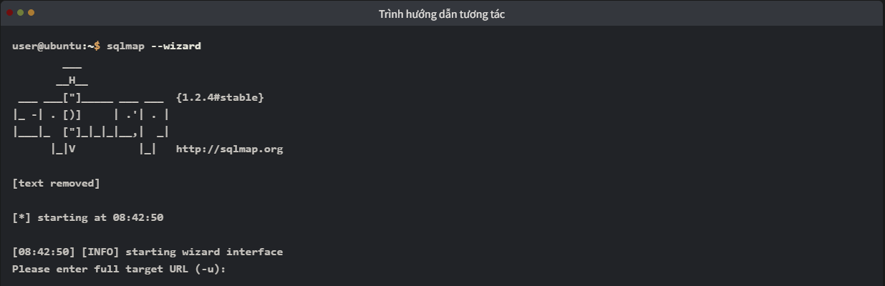

Cờ này `--dbs` giúp bạn trích xuất tất cả tên cơ sở dữ liệu. Sau khi biết được tên cơ sở dữ liệu, bạn có thể trích xuất thông tin về các bảng của cơ sở dữ liệu đó bằng cách sử dụng `-D database_name --tables`. Sau khi có được các bảng, nếu bạn muốn liệt kê các bản ghi trong các bảng đó, bạn có thể sử dụng `-D database_name -T table_name --dump`. Các cờ khác nhau trong công cụ SQLMap cho phép bạn trích xuất thông tin chi tiết từ các cơ sở dữ liệu. Bây giờ, hãy xem xét một kịch bản thực tế và sử dụng tất cả các cờ trên để khai thác một ứng dụng web dễ bị tấn công SQL injection.

Bước đầu tiên là tìm kiếm URL hoặc yêu cầu có khả năng dễ bị tấn công. Bạn thường có thể bắt gặp một số URL sử dụng tham số GET để truy xuất dữ liệu. Ví dụ, một URL như `http://sqlmaptesting.thm/search?cat=1` sử dụng tham số `cat` có giá trị là  `1`. Nếu bạn thấy bất kỳ ứng dụng web nào sử dụng tham số **GET** trong URL để truy xuất dữ liệu, bạn có thể kiểm tra URL đó bằng cờ `-u` trong công cụ SQLMap. Đây được coi là kiểm thử dựa trên HTTP GET. Phương pháp này được áp dụng khi ứng dụng sử dụng tham số GET trong URL để truy xuất dữ liệu từ các tìm kiếm.

Trong thực tế, nhiều ứng dụng web dựa vào cookie để duy trì phiên người dùng, thực thi xác thực hoặc áp dụng kiểm soát truy cập. Khi kiểm thử các ứng dụng như vậy, chỉ cung cấp URL với SQLMap có thể không đủ, vì các yêu cầu chưa được xác thực có thể bị chuyển hướng, bị từ chối hoặc trả về nội dung khác. SQLMap hỗ trợ kiểm thử dựa trên cookie thông qua cờ `--cookie`, cho phép bạn bao gồm các cookie phiên (chẳng hạn như **PHPSESSID, JSESSIONID**, hoặc mã thông báo xác thực) trực tiếp trong yêu cầu của mình. Điều này đảm bảo rằng SQLMap tương tác với ứng dụng trong cùng ngữ cảnh đã được xác thực hoặc ủy quyền như người dùng thông thường. Ví dụ, sau khi đăng nhập vào ứng dụng thông qua trình duyệt và thu thập cookie phiên, bạn có thể chuyển nó cho SQLMap bằng cách sử dụng `--cookie="SESSIONID=abcdef123456"` để kiểm thử chính xác các điểm tấn công chỉ có thể truy cập được sau khi xác thực.

Chúng ta sẽ sử dụng một URL trang web được cho là dễ bị tấn công: `http://sqlmaptesting.thm` để minh họa. Giả sử trang web này có tùy chọn tìm kiếm, và khi bạn nhấp vào tùy chọn tìm kiếm này và tìm kiếm thứ gì đó, URL sẽ trở thành `http://sqlmaptesting.thm/search/cat=1`, sử dụng tham số GET `cat=1` trong URL để trích xuất thông tin từ cơ sở dữ liệu. Như chúng ta đã biết, các URL có tham số GET có thể dễ bị tấn công SQL injection; hãy quét URL này để xác định xem nó có bất kỳ lỗ hổng SQL injection nào hay không.

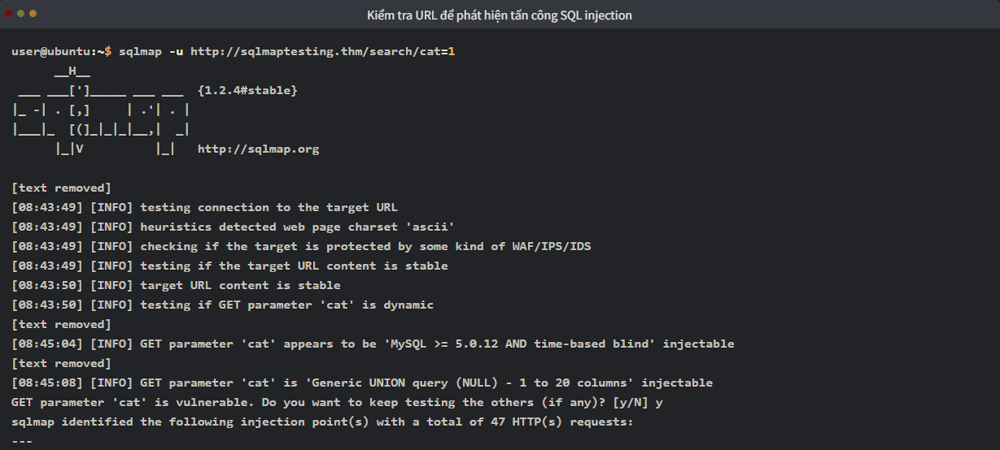
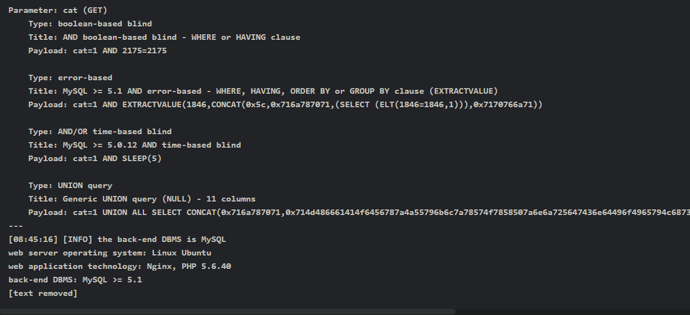

Kết quả hiển thị trên cửa sổ terminal cho thấy nhiều loại tấn công SQL injection khác nhau , chẳng hạn như tấn công mù dựa trên boolean, tấn công dựa trên lỗi, tấn công mù dựa trên thời gian và truy vấn UNION, được xác định trong URL mục tiêu. Đây là các kỹ thuật khác nhau để khai thác lỗ hổng SQL injection. Ví dụ, trong tấn công SQL injection mù dựa trên boolean , truy vấn SQL được sửa đổi và một biểu thức boolean (luôn đúng, ví dụ: 1=1) được thêm vào truy vấn để trích xuất thông tin. Trong khi đó, trong tấn công SQL injection dựa trên lỗi, một số truy vấn được cố ý sửa đổi để tạo ra lỗi trong kết quả được gửi bởi cơ sở dữ liệu. Những lỗi này thường chứa thông tin có giá trị về dữ liệu. Tương tự, các kỹ thuật SQL injection khác cũng có thể được sử dụng để khai thác cơ sở dữ liệu.

Kết quả từ lệnh chúng ta đã thực thi cho mục tiêu `http://sqlmaptesting.thm/search/cat=1` cho thấy rằng có thể xảy ra nhiều loại tấn công SQL injection khác nhau trên URL này. Hãy sử dụng các cờ của SQLMap mà chúng ta đã nghiên cứu trước đó để khai thác chúng và trích xuất một số dữ liệu có giá trị từ cơ sở dữ liệu.

Để truy xuất cơ sở dữ liệu, chúng ta sử dụng cờ `--dbs`. Hãy thử cờ này với URL dễ bị tấn công của chúng ta:
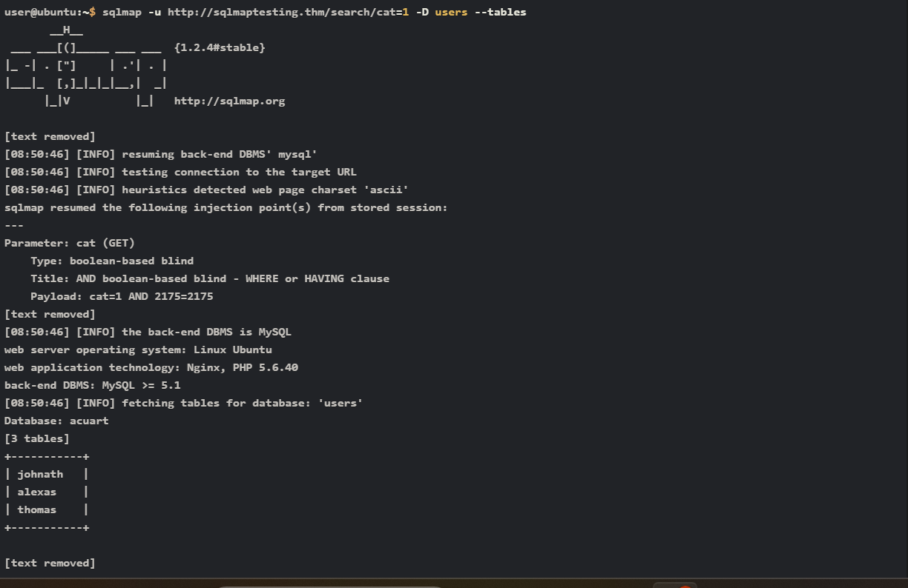

Giờ chúng ta đã có tất cả tên bảng có sẵn trong cơ sở dữ liệu, hãy trích xuất các bản ghi có trong `thomas` bảng. Để làm điều đó, chúng ta sẽ định nghĩa cơ sở dữ liệu bằng `-D` , bảng bằng `-T`, và để trích xuất các bản ghi của bảng, chúng ta sẽ sử dụng `--dump`.

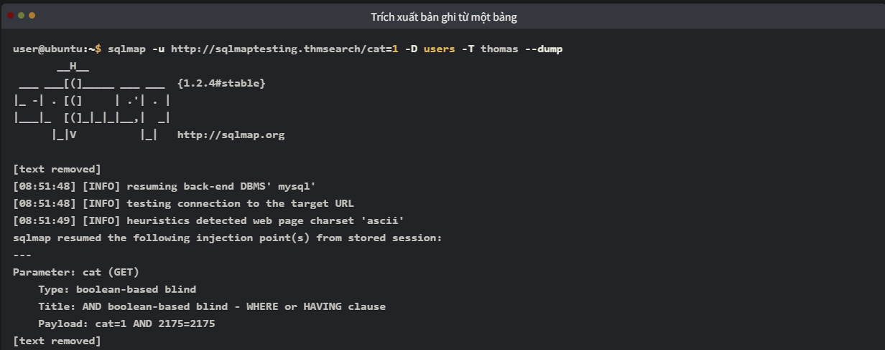
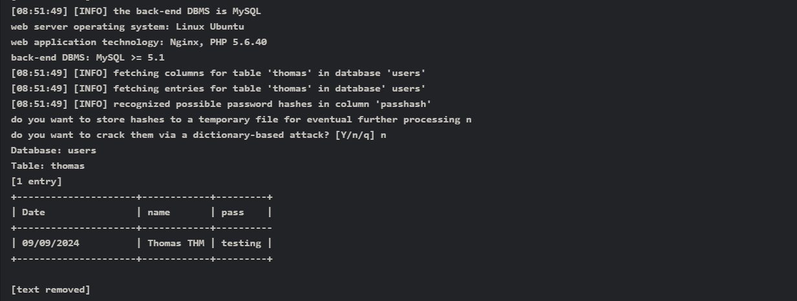

Tuy nhiên, không giống như URL được sử dụng để kiểm thử ở trên, bạn cũng có thể sử dụng kiểm thử dựa trên phương thức POST, trong đó ứng dụng gửi dữ liệu trong phần thân yêu cầu thay vì URL. Ví dụ về điều này có thể là các biểu mẫu đăng nhập, biểu mẫu đăng ký, v.v. Để thực hiện theo cách tiếp cận này, bạn phải chặn một yêu cầu POST trên trang đăng nhập hoặc đăng ký và lưu nó dưới dạng tệp văn bản. Bạn có thể sử dụng lệnh sau để nhập yêu cầu đã lưu trong tệp văn bản đó vào công cụ SQLMap :

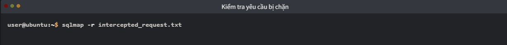

## 4. Practices
### 1. How many databases are available in this web application?
Từ đầu ta lấy một request chuẩn(_từ Burp_), tạo một file **target.txt** rồi dán nội dung vào

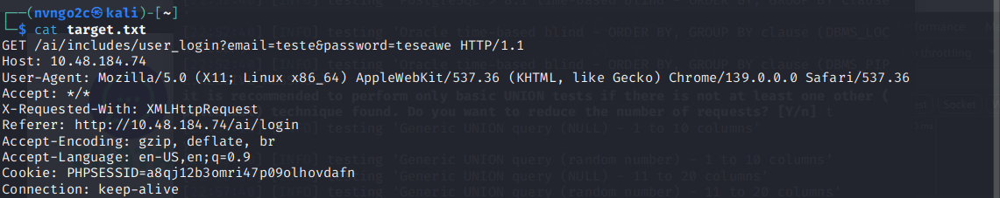

Sau đó dùng lệnh sau để có thể khai thác:

`sqlmap -r taget.txt -p email --dbs --batch`

Sau khi chạy được một lúc thì nó phát hiện vị trí bị SQLi và xác định phương pháp khai thác là **time-based blind** và dùng **query SLEEP**
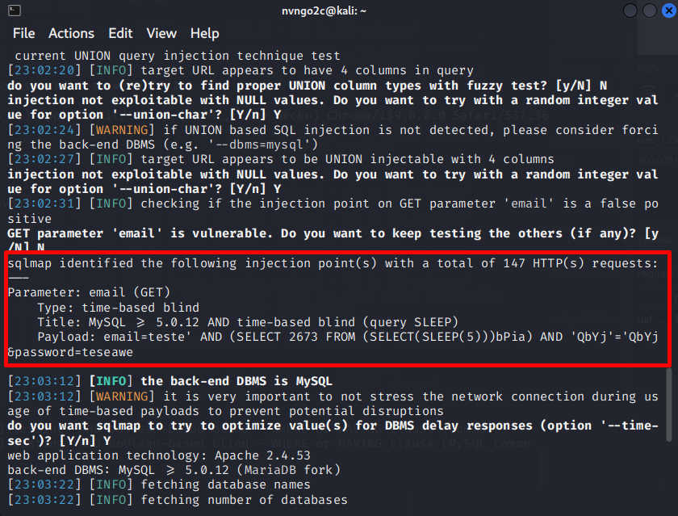

Sau khi khai thác, ta thu được `6` cơ sở dữ liệu trong DB

### 2. What is the name of the table available in the "ai" database?
`sqlmap -r target.txt -D ai --tables`  

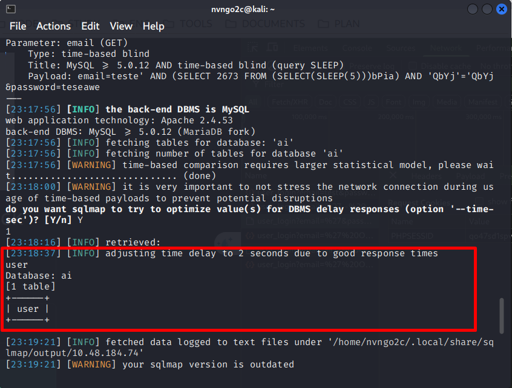

--> `user`

### 3. What is the password of the email test@chatai.com?

`sqlmap -r target.txt -D ai -T user -C "email,password" --dump`

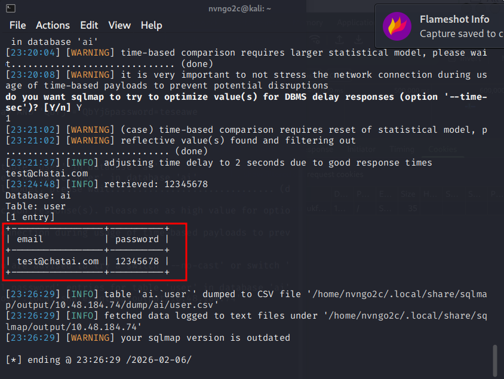