# Introduction to SIEM
## 1. Introduction
Hệ thống quản lý thông tin và sự kiện bảo mật (*Security Information and Event Management system*) là giải pháp bảo mật cốt lõi mà một nhà phân tích SOC sử dụng trong trung tâm điều hành an ninh. Trong phòng này, chúng ta sẽ tìm hiểu cách các thiết bị khác nhau trong mạng tạo ra nhật ký và tại sao việc có một giải pháp tập trung để thu thập, chuẩn hóa và đối chiếu các nhật ký này lại rất cần thiết.  

### Mục tiêu học tập
- Hiểu rõ các loại nguồn nhật ký khác nhau
- Xác định những hạn chế khi làm việc với các tệp nhật ký riêng lẻ.
- Nhận thức tầm quan trọng của giải pháp SIEM.
- Khám phá các tính năng của giải pháp SIEM
- Tìm hiểu các loại nguồn nhật ký khác nhau và cách chúng được tích hợp vào hệ thống SIEM.
- Hiểu rõ quy trình cảnh báo và phân tích cảnh báo.

## 2. Logs Everywhere, Answers Nowhere(Logs ở mọi nơi nhưng không có kết luận)
### 1. Logs Everywhere
Nhiều thiết bị trong một mạng giao tiếp với nhau và, trong hầu hết các trường hợp, với Internet thông qua bộ định tuyến. Hình ảnh bên dưới cho thấy một ví dụ về mạng đơn giản bao gồm nhiều thiết bị đầu cuối chạy hệ điều hành Linux /Windows, một máy chủ dữ liệu và một trang web.

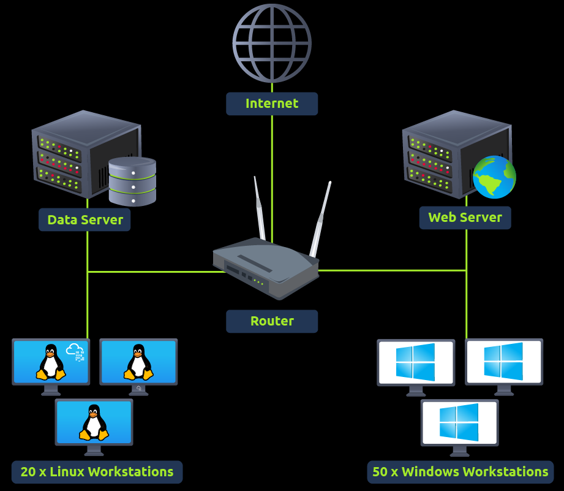

Các thiết bị này liên tục tạo ra nhật ký về các hoạt động diễn ra bên trong chúng. Chúng ta cũng có thể gọi các thiết bị này là nguồn nhật ký. Nhật ký mà chúng tạo ra đóng vai trò như một dấu vết của tất cả các hoạt động và cực kỳ hữu ích để xác định các hoạt động độc hại hoặc khắc phục sự cố nói chung. Các nguồn nhật ký này chủ yếu được chia thành hai loại, sẽ được thảo luận bên dưới.

#### 1. Host-Centric Log Sources(Logs từ các host)
Các nguồn nhật ký này ghi lại các sự kiện xảy ra bên trong hoặc liên quan đến máy chủ. Các thiết bị tạo ra nhật ký tập trung vào máy chủ bao gồm Windows, Linux , máy chủ, v.v. Một số ví dụ về nhật ký tập trung vào máy chủ là:
- Người dùng truy cập vào một tập tin
- Người dùng đang cố gắng xác thực.
- Một hoạt động thực thi quy trình
- Một quy trình thêm/chỉnh sửa/xóa khóa hoặc giá trị trong registry.
- Thực thi PowerShell

#### 2. Network-Centric Log Sources(Logs từ mạng)
Các nhật ký liên quan đến mạng được tạo ra khi các máy chủ giao tiếp với nhau hoặc truy cập internet để truy cập một trang web. Các thiết bị tạo ra nhật ký tập trung vào mạng bao gồm tường lửa, hệ thống phát hiện/ngăn chặn xâm nhập (IDS / IPS) , bộ định tuyến, v.v. Một số ví dụ về nhật ký tập trung vào mạng là:
- Kết nối SSH
- Tệp tin đang được truy cập qua FTP
- Lưu lượng truy cập web
- Người dùng truy cập tài nguyên của công ty thông qua VPN .
- Hoạt động chia sẻ tệp mạng
Nhìn chung, các nguồn nhật ký tập trung vào máy chủ và tập trung vào mạng này liên tục tạo ra vô số nhật ký trong mạng. 

### 2. Answers Nowhere
Cho đến nay, có vẻ khá đơn giản khi các nguồn nhật ký này tạo ra nhật ký, chúng ta phân tích chúng và xác định các hoạt động độc hại. Tuy nhiên, mọi chuyện không đơn giản như vậy. Nó có một số thách thức. Một số thách thức đó được thảo luận dưới đây:
- **Nhiều nguồn ghi nhật ký**: Một mạng lưới có rất nhiều nguồn ghi nhật ký, tạo ra hàng trăm sự kiện mỗi giây. Các nhật ký này nằm rải rác trên nhiều thiết bị khác nhau, và việc kiểm tra nhật ký trên từng thiết bị một trong trường hợp xảy ra sự cố có thể rất tốn thời gian.
- **Không có sự tập trung hóa**: Vì nhật ký nằm trên các máy tạo ra chúng, bạn có thể cần kết nối với từng nguồn nhật ký thông qua SSH , RDP , v.v., để phân tích nhật ký từ nhiều nguồn khác nhau. Điều này rất kém hiệu quả và có thể lãng phí rất nhiều thời gian quý báu của bạn trong quá trình điều tra. 
- **Thông tin hạn chế**: Các nhật ký riêng lẻ không thể kể hết toàn bộ câu chuyện về một hoạt động. Trong bất kỳ sự cố nào, các hoạt động riêng lẻ trên các nguồn nhật ký khác nhau có vẻ vô hại. Nhưng nếu các nhật ký này được đối chiếu, chúng có thể cho thấy một câu chuyện hoàn toàn khác. Ví dụ, bạn quan sát thấy một sự kiện truy cập tệp trong hệ thống, đây thường là hoạt động bình thường. Tuy nhiên, nếu bạn đối chiếu các nguồn nhật ký khác nhau, bạn có thể biết rằng tệp này đã được truy cập bởi một người dùng đã truy cập vào máy này thông qua di chuyển ngang sau khi xâm nhập vào một máy khác trong mạng.
- **Phân tích hạn chế** : Các nguồn nhật ký tạo ra vô số nhật ký mỗi giây, và việc phân tích thủ công tất cả nhật ký từ tất cả các thiết bị để xác định bất kỳ hoạt động bất thường nào là gần như bất khả thi đối với con người. Trên thực tế, các nhà phân tích sẽ bỏ sót rất nhiều nhật ký quan trọng trong quá trình phân tích do số lượng quá lớn.
- **Vấn đề về định dạng**: Các nguồn nhật ký khác nhau tạo ra nhật ký ở nhiều định dạng khác nhau. Các nhà phân tích cần phải biết tất cả các định dạng này để phân tích chúng, điều này có thể cực kỳ khó khăn, đặc biệt là khi xử lý nhiều nguồn nhật ký trong một mạng.

Trong bài tập tiếp theo, chúng ta sẽ tìm hiểu về một công nghệ mạnh mẽ có thể giải quyết tất cả những vấn đề này.

## 3. Why SIEM?
Trong bài tập trước, chúng ta đã thấy các nguồn nhật ký khác nhau tạo ra vô số nhật ký thuộc nhiều loại khác nhau và những thách thức liên quan đến việc phân tích các nhật ký đó. Vậy, làm thế nào chúng ta có thể quản lý lượng dữ liệu khổng lồ này một cách hiệu quả hơn và trích xuất được những kết quả có giá trị?

Đây là lúc SIEM phát huy tác dụng. *Hệ thống Quản lý Thông tin và Sự kiện An ninh* (**SIEM**) là một giải pháp bảo mật thu thập nhật ký từ nhiều nguồn khác nhau, chuẩn hóa định dạng của chúng thành một định dạng nhất quán, đối chiếu chúng và phát hiện các hoạt động độc hại bằng cách sử dụng các quy tắc phát hiện.

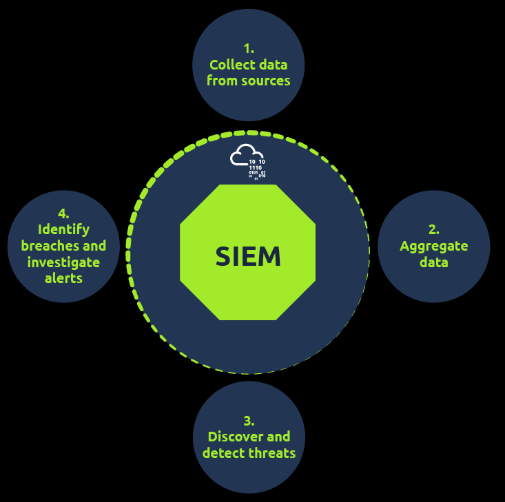

### Purposes of SIEM
Giải pháp SIEM không chỉ giải quyết các vấn đề chúng ta đã thảo luận trong nhiệm vụ trước mà còn cung cấp các khả năng để tăng cường hoạt động bảo mật. Hãy cùng thảo luận một số tính năng cốt lõi mà SIEM cung cấp.

- Hệ thống SIEM **thu thập nhật ký tập trung thu thập nhật ký** từ tất cả các nguồn (thiết bị đầu cuối, máy chủ, tường lửa, v.v.) và tập trung chúng ở một nơi. Các nhật ký này được lấy thông qua các tác nhân nhẹ hoặc API và được đưa vào giải pháp SIEM . Điều này giải quyết được vấn đề phải truy cập từng máy riêng lẻ để phân tích nhật ký của nó. 
- **Chuẩn hóa nhật ký**: Nhật ký thô có định dạng và kích thước khác nhau. Nhật ký Windows không giống với nhật ký Linux . Vì giải pháp SIEM tập trung các nhật ký này ở một nơi, nó cũng đảm bảo rằng tất cả các nhật ký được phân tích thành các trường khác nhau và được trình bày theo một định dạng nhất quán. Việc phân tích nhật ký thành nhiều trường để dễ hiểu hơn được gọi là Phân tích cú pháp, và việc chuyển đổi tất cả các nhật ký từ các nguồn nhật ký khác nhau thành một định dạng nhất quán được gọi là **Chuẩn hóa**. 
- **Đối chiếu nhật ký**: Các nhật ký riêng lẻ không thực sự hữu ích. SIEM đối chiếu nhật ký từ các nguồn khác nhau và tìm ra bất kỳ mối quan hệ nào giữa chúng. Điều này giúp xác định hoạt động độc hại bằng cách phân tích mô hình của nó. Ví dụ, hãy xem xét các hoạt động sau đây xảy ra trong hệ thống trong khoảng thời gian 5 phút. 
    - Haris đăng nhập qua VPN từ một địa chỉ IP mà anh ta chưa từng sử dụng trước đây.
    - Haris truy cập một số tài liệu trên ổ đĩa dùng chung.
    - Haris đã thực thi một kịch bản PowerShell.
    - Hệ thống thực hiện kết nối mạng đi ra ngoài.

Nếu đánh giá riêng lẻ, các hoạt động này có vẻ bình thường, nhưng giải pháp SIEM sẽ liên kết các hoạt động này lại với nhau, điều này có thể chỉ ra hoạt động đánh cắp dữ liệu tiềm ẩn do thông tin đăng nhập VPN của Haris bị xâm phạm .
- Hệ thống SIEM cảnh báo thời gian thực phát hiện các hoạt động độc hại dựa trên các quy tắc mà nó chứa. Nhiều quy tắc được tích hợp sẵn trong SIEM theo mặc định. Tuy nhiên, các nhà phân tích tạo ra các quy tắc phát hiện mới dựa trên yêu cầu của họ để hoàn thiện khả năng phát hiện trong tương lai. Khi các điều kiện của các quy tắc phát hiện này được đáp ứng, cảnh báo sẽ được kích hoạt và các nhà phân tích sẽ nhận được thông báo. Sau đó, các nhà phân tích có thể điều tra các cảnh báo này trong nền tảng SIEM .  
- **Bảng điều khiển và báo cáo**: Bảng điều khiển là thành phần quan trọng nhất của bất kỳ hệ thống SIEM nào . SIEM trình bày dữ liệu để phân tích sau khi được chuẩn hóa và thu thập. Tóm tắt của phân tích này được trình bày dưới dạng thông tin chi tiết có thể hành động được với sự trợ giúp của nhiều bảng điều khiển. Mỗi giải pháp SIEM đều đi kèm với một số bảng điều khiển mặc định và cung cấp tùy chọn tạo bảng điều khiển tùy chỉnh. Dưới đây là một số thông tin có thể tìm thấy trong bảng điều khiển:
    - Thông báo nổi bật
    - Thông báo hệ thống
    - Cảnh báo sức khỏe
    - Danh sách các lần đăng nhập không thành công
    - Số lượng sự kiện đã được nhập
    - Các quy tắc đã được kích hoạt
    - Các tên miền được truy cập nhiều nhất

Dưới đây là một ví dụ về bảng điều khiển được tạo trong Splunk SIEM :
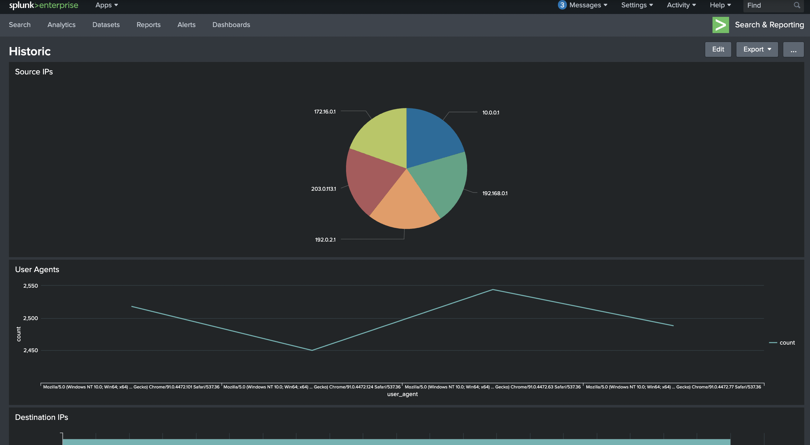

Có một số tính năng khác của SIEM mà chúng ta sẽ không đề cập chi tiết trong buổi này. Những tính năng này bao gồm tích hợp với các nguồn cấp dữ liệu tình báo về mối đe dọa, khả năng lưu trữ dữ liệu rộng rãi, khả năng tìm kiếm mạnh mẽ và nhiều tính năng khác. 

Trong bài tập tiếp theo, chúng ta sẽ thảo luận về các nguồn nhật ký khác nhau bằng cách xem xét nhật ký của chúng và xem cách chúng được đưa vào giải pháp SIEM .

### 4. Logs Source and Ingestion(Nguồn logs và quá trình thu thập)
#### 1. Logs source
Mỗi thiết bị trong mạng đều tạo ra một loại nhật ký nào đó mỗi khi có hoạt động được thực hiện trên nó, chẳng hạn như người dùng truy cập một trang web, kết nối SSH , đăng nhập vào máy trạm của họ, v.v. Hãy cùng xem nhật ký của một số thiết bị phổ biến thường thấy trong môi trường mạng trông như thế nào.

#### 2. Windows
Windows ghi lại mọi sự kiện có thể xem được thông qua `Event Viewer`. Nó gán một ID duy nhất cho mỗi loại hoạt động nhật ký, giúp nhà phân tích dễ dàng kiểm tra và theo dõi. Để xem các sự kiện trong môi trường Windows, hãy nhập `Event Viewer` vào thanh tìm kiếm. Thao tác này sẽ đưa bạn đến công cụ nơi lưu trữ và xem các nhật ký khác nhau, như hình bên dưới. Các nhật ký này từ tất cả các thiết bị đầu cuối Windows được chuyển tiếp đến giải pháp SIEM để giám sát và có cái nhìn tổng quan tốt hơn.

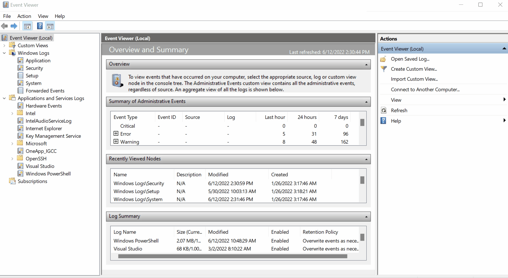

### 3. Linux
Hệ điều hành Linux lưu trữ tất cả các nhật ký liên quan, chẳng hạn như sự kiện, lỗi, cảnh báo, v.v. Sau đó, chúng được đưa vào SIEM để giám sát liên tục. Một số vị trí phổ biến mà Linux lưu trữ nhật ký là:
- `/var/log/httpd`: Chứa nhật ký yêu cầu/phản hồi HTTP và nhật ký lỗi.
- `/var/log/cron`: Các sự kiện liên quan đến các tác vụ cron được lưu trữ tại vị trí này.
- `/var/log/auth.log` và `/var/log/secure`: Lưu trữ các nhật ký liên quan đến xác thực.
- `/var/log/kern`: Tệp này lưu trữ các sự kiện liên quan đến nhân hệ điều hành.

Đây là một ví dụ về nhật ký cron:
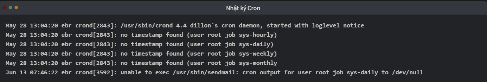

###  4. Web server
Việc giám sát tất cả các yêu cầu/phản hồi đến và đi từ máy chủ web là rất quan trọng để phát hiện bất kỳ nỗ lực tấn công mạng tiềm tàng nào. Trong Linux , các vị trí phổ biến để ghi tất cả nhật ký liên quan đến Apache là `/var/log/apache` hoặc `/var/log/httpd`.

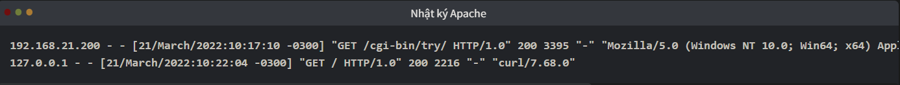

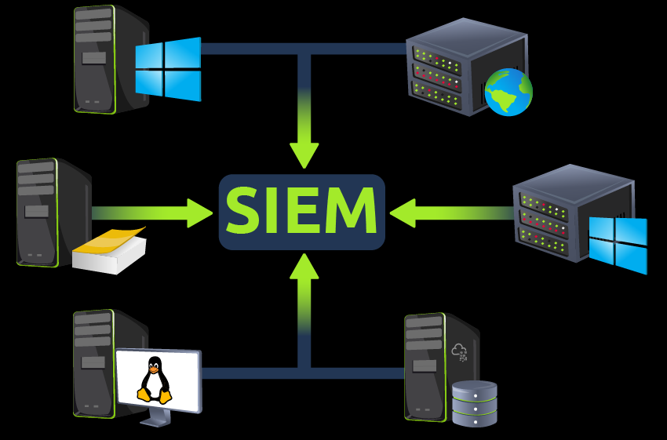

### 5. Log Ingestion(Thu thập logs)
Tất cả các nhật ký này cung cấp một lượng thông tin phong phú và có thể giúp xác định các vấn đề bảo mật. Mỗi giải pháp SIEM có cách thu thập nhật ký riêng. Một số phương pháp phổ biến được các giải pháp SIEM sử dụng được giải thích bên dưới:
1. **Agent/Forwarder**: Các giải pháp SIEM này cung cấp một công cụ nhẹ gọi là agent (forwarder của Splunk ) được cài đặt trên thiết bị đầu cuối. Nó được cấu hình để thu thập và gửi tất cả các nhật ký quan trọng đến máy chủ SIEM .
2. **Syslog** là một giao thức được sử dụng rộng rãi để thu thập dữ liệu từ nhiều hệ thống khác nhau như máy chủ web, cơ sở dữ liệu, v.v., và gửi dữ liệu thời gian thực đến đích tập trung.
3. **Tải lên thủ công**: Một số giải pháp SIEM , như Splunk , ELK , v.v., cho phép người dùng nhập dữ liệu ngoại tuyến để phân tích nhanh chóng. Sau khi dữ liệu được nhập, nó sẽ được chuẩn hóa và sẵn sàng cho việc phân tích.
4. **Các giải pháp SIEM chuyển tiếp cổng** cũng có thể được cấu hình để lắng nghe trên một cổng nhất định, sau đó các thiết bị đầu cuối sẽ chuyển tiếp dữ liệu đến phiên bản SIEM trên cổng đang lắng nghe đó.

Dưới đây là ví dụ về cách Splunk cung cấp nhiều phương pháp khác nhau để thu thập nhật ký:
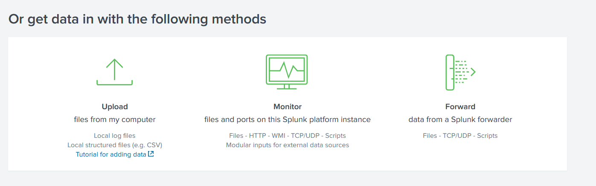

## 5. Alerting Process and Analysis(*Quá trình cảnh báo và phân tích*)
### 1. Đằng sau những cảnh báo được kích hoạt
Chúng ta đã biết rằng giải pháp SIEM phát hiện các mối đe dọa bằng cách đối chiếu nhật ký từ các nguồn nhật ký và kích hoạt cảnh báo, nhưng liệu chúng ta có hiểu được "bí quyết" đằng sau những phát hiện này?

Giải pháp SIEM có các quy tắc phát hiện giúp bắt giữ các mối đe dọa. Các quy tắc này đóng vai trò quan trọng trong việc phát hiện mối đe dọa kịp thời, cho phép các nhà phân tích hành động đúng lúc. Các quy tắc phát hiện về cơ bản là các biểu thức logic được thiết lập để kích hoạt. Một vài ví dụ về quy tắc phát hiện là:
- Nếu người dùng đăng nhập không thành công năm lần trong vòng 10 giây, hãy đưa ra cảnh báo `Multiple Failed Login Attempts`
- Nếu đăng nhập thành công sau nhiều lần đăng nhập thất bại, hãy tạo cảnh báo `Successful Login After multiple Login Attempts`
- Một quy tắc đã được thiết lập để cảnh báo mỗi khi người dùng cắm USB (Hữu ích nếu việc sử dụng USB bị hạn chế theo chính sách của công ty).
- Nếu lưu lượng truy cập đi ra vượt quá 25 MB, hãy đưa ra cảnh báo về khả năng rò rỉ dữ liệu (Thông thường, điều này phụ thuộc vào chính sách của công ty).

### 2. Quy tắc phát hiện được tạo ra như thế nào?
Để giải thích cách thức hoạt động của quy tắc này, hãy xem xét các trường hợp sử dụng Nhật ký sự kiện sau:
#### 1. Trường hợp sử dụng 1
Kẻ thù thường xóa nhật ký trong giai đoạn sau khi khai thác để xóa dấu vết của chúng. Một ID sự kiện duy nhất là `104` được ghi lại mỗi khi người dùng cố gắng xóa hoặc làm sạch nhật ký sự kiện. Để tạo một quy tắc dựa trên hoạt động này, chúng ta có thể đặt điều kiện như sau:

Quy tắc: Nếu nguồn nhật ký là WinEventLog VÀ EventID là 104 - Kích hoạt cảnh báo `Event Log Cleared`
#### 2. Trường hợp sử dụng 2
Kẻ thù sử dụng các lệnh như `whoami` sau giai đoạn khai thác/leo thang đặc quyền. Các trường sau đây sẽ hữu ích để đưa vào quy tắc.
- **Nguồn nhật ký**: Xác định nguồn nhật ký ghi lại các sự kiện.
- **Mã sự kiện**: Mã sự kiện nào được liên kết với hoạt động Thực thi quy trình? Trong trường hợp này, Mã sự kiện `4688` sẽ hữu ích.
- **NewProcessName**: Tên quy trình nào sẽ hữu ích để đưa vào quy tắc?

Quy tắc: Nếu Nguồn nhật ký là WinEventLog VÀ Mã sự kiện là `4688`, và NewProcessName chứa `whoami`, thì Kích hoạt CẢNH BÁO `WHOAMI command Execution DETECTED`

Trong bài tập trước, tầm quan trọng của các cặp *fiel-value* đã được thảo luận. Các quy tắc phát hiện theo dõi giá trị của một số trường nhất định để kích hoạt chúng. Đó là lý do tại sao việc thu thập nhật ký đã được chuẩn hóa lại quan trọng.

### 3. Điều tra cảnh báo
Khi giám sát SIEM , các nhà phân tích dành phần lớn thời gian cho bảng điều khiển, vì chúng hiển thị nhiều chi tiết quan trọng về mạng một cách tóm tắt. Khi một cảnh báo được kích hoạt, các sự kiện/luồng liên quan đến cảnh báo sẽ được kiểm tra và quy tắc được kiểm tra để xem điều kiện nào được đáp ứng. Dựa trên quá trình điều tra, nhà phân tích sẽ xác định xem đó là cảnh báo Đúng hay Sai. Một số hành động được thực hiện sau khi phân tích là:
- Cảnh báo này là cảnh báo sai. Có thể cần điều chỉnh quy tắc để tránh các cảnh báo sai tương tự xảy ra lần nữa.
- Cảnh báo này là kết quả dương tính thật. Cần tiến hành điều tra thêm.
- Hãy liên hệ với chủ sở hữu tài sản để hỏi về hoạt động đó.
- Đã xác nhận có hoạt động đáng ngờ. Cách ly hệ thống bị nhiễm.
- Chặn địa chỉ IP đáng ngờ.

## 6. Lab Work
Trong bài thực hành tĩnh đính kèm, một bảng điều khiển mẫu và các sự kiện được hiển thị. Khi có hoạt động đáng ngờ xảy ra, một cảnh báo sẽ được kích hoạt, điều này có nghĩa là một số sự kiện phù hợp với điều kiện của một số quy tắc đã được cấu hình. Hoàn thành bài thực hành và trả lời các câu hỏi sau.

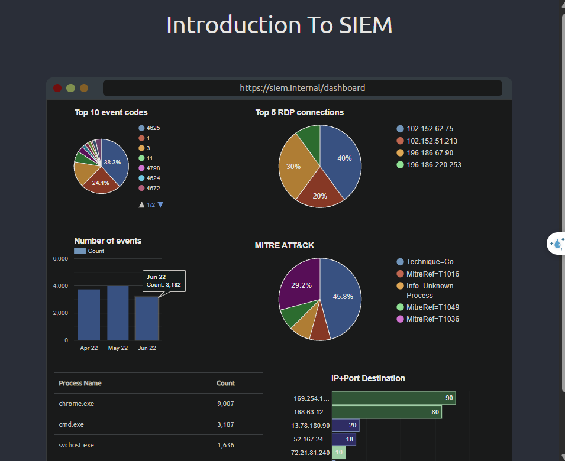

*1. Sau khi nhấp vào nút "Bắt đầu hoạt động đáng ngờ", tiến trình nào đã gây ra cảnh báo?*
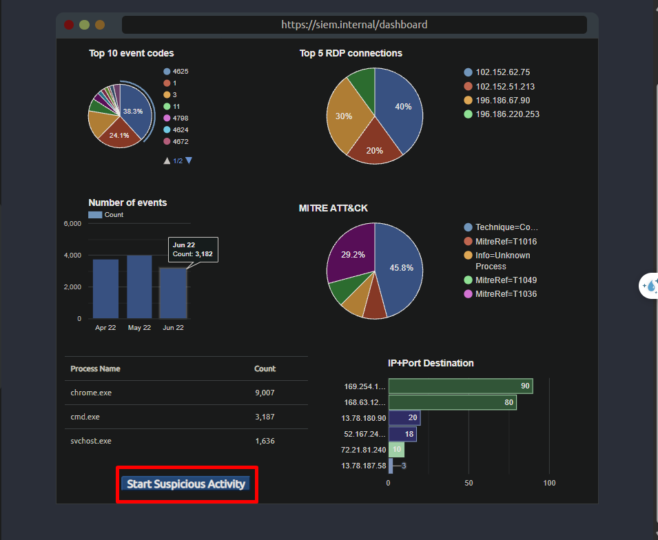

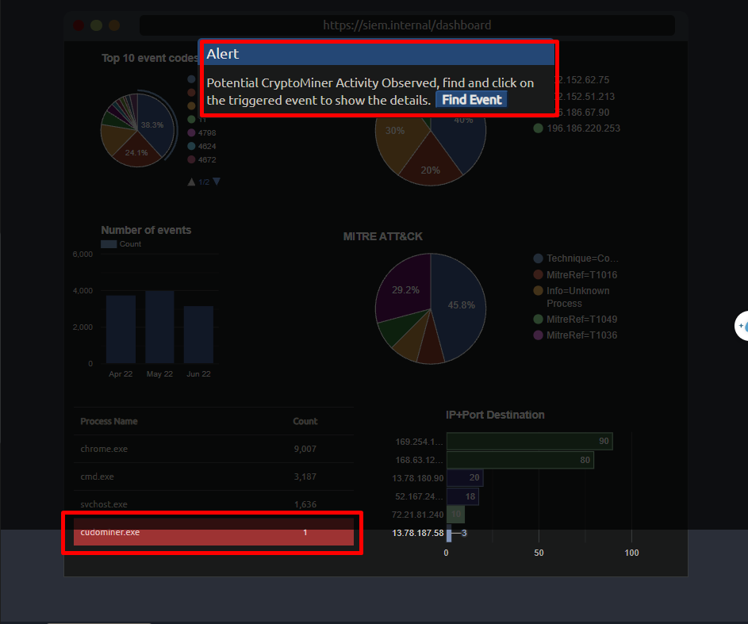

`cudominer.exe`
*2. Hãy tìm sự kiện gây ra cảnh báo và xác định người dùng chịu trách nhiệm thực thi quy trình đó.*

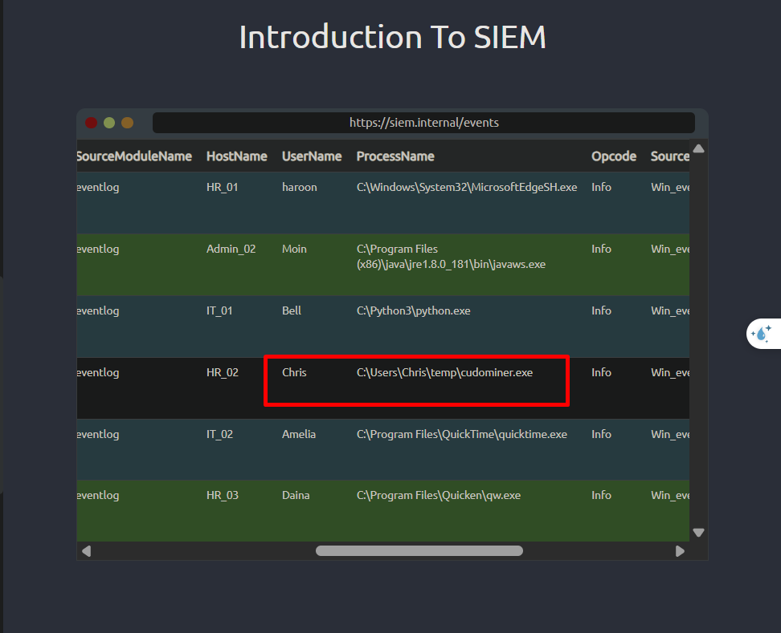

`Chris`

*3. Tên máy ch

HR_02ủ của người dùng khả nghi là gì?*

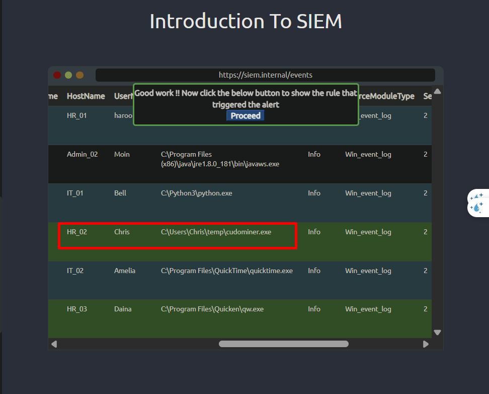

`HR_02`

*4. Hãy xem xét quy tắc và quy trình đáng ngờ; thuật ngữ nào khớp với quy tắc đã gây ra cảnh báo?*
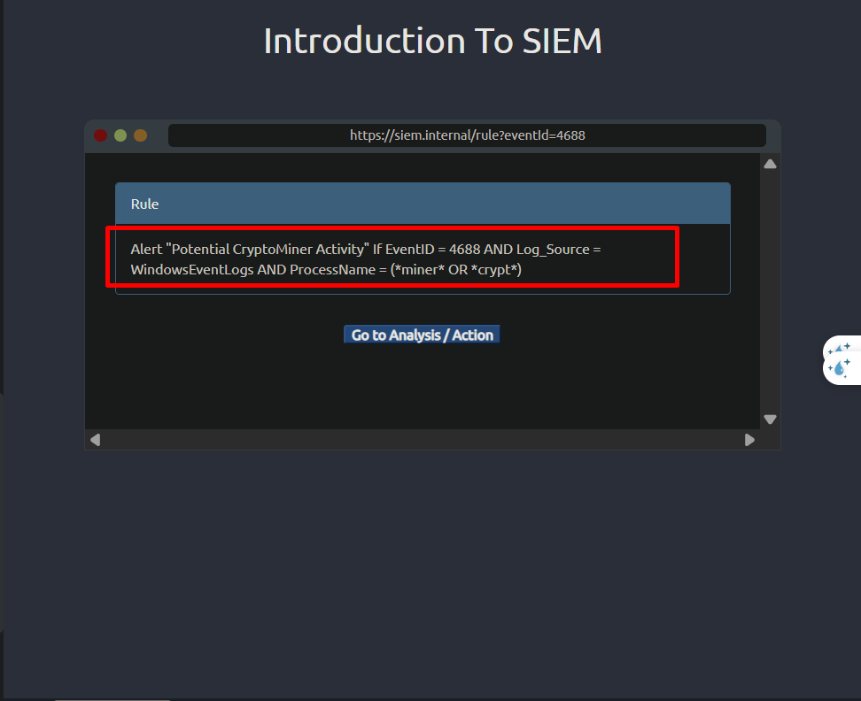

