# Firewall Fundamentals
## 1. What is purpose of a Firewall
Chúng ta thường thấy bảo vệ bên ngoài các trung tâm mua sắm, ngân hàng, nhà hàng và nhà ở. Những người bảo vệ này được bố trí ở lối vào các khu vực này để kiểm soát người ra vào. Mục đích của việc kiểm soát này là để đảm bảo không ai lẻn vào mà không được phép. Người bảo vệ đóng vai trò như một bức tường ngăn cách giữa khu vực của họ và người ra vào.

Hàng ngày, có rất nhiều lưu lượng truy cập đến và đi giữa các thiết bị kỹ thuật số của chúng ta và Internet mà chúng được kết nối. Điều gì sẽ xảy ra nếu ai đó lẻn vào giữa lượng truy cập khổng lồ này mà không bị phát hiện? Khi đó, chúng ta cũng cần một người bảo vệ cho các thiết bị kỹ thuật số của mình, người có thể kiểm tra dữ liệu đến và đi. Người bảo vệ này chính là tường lửa . Tường lửa được thiết kế để kiểm tra lưu lượng truy cập đến và đi của mạng hoặc thiết bị kỹ thuật số. Mục tiêu cũng giống như người bảo vệ ngồi bên ngoài một tòa nhà: không cho phép bất kỳ khách truy cập trái phép nào vào hệ thống hoặc mạng. Bạn hướng dẫn tường lửa bằng cách cung cấp cho nó các quy tắc để kiểm tra tất cả lưu lượng truy cập. Bất cứ thứ gì đến hoặc đi khỏi thiết bị hoặc mạng của bạn đều sẽ phải đối mặt với tường lửa trước tiên. Tường lửa sẽ cho phép hoặc từ chối lưu lượng truy cập đó dựa trên các quy tắc được duy trì của nó. Hầu hết các tường lửa hiện nay đều vượt xa việc lọc dựa trên quy tắc và cung cấp thêm các chức năng để bảo vệ thiết bị hoặc mạng của bạn khỏi thế giới bên ngoài. Chúng ta sẽ thảo luận về tất cả các tường lửa này và thực hiện các bài thực hành trong phòng thí nghiệm trên một vài loại. 

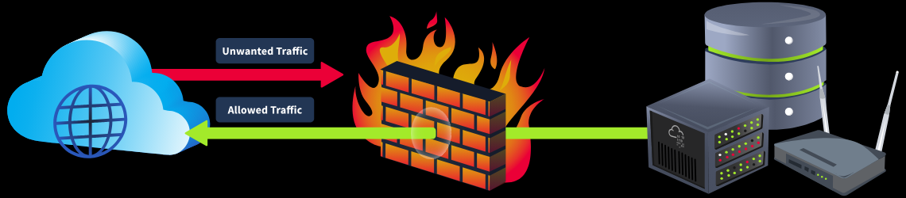

### Mục tiêu học tập
Sau khi hoàn thành việc thiết kế phòng, bạn sẽ có hiểu biết cơ bản về các lĩnh vực sau:
- Các loại tường lửa
- Các quy tắc tường lửa và các thành phần của nó
- Hướng dẫn sử dụng tường lửa tích hợp sẵn của Windows 
- Hướng dẫn sử dụng tường lửa tích hợp sẵn trên Linux 

## 2. Types of Firewall
Việc triển khai tường lửa trở nên phổ biến trong các mạng sau khi các tổ chức phát hiện ra khả năng lọc lưu lượng truy cập độc hại khỏi hệ thống và mạng của họ. Sau đó, nhiều loại tường lửa khác nhau đã được giới thiệu, mỗi loại phục vụ một mục đích riêng biệt. Điều quan trọng cần lưu ý là các loại tường lửa khác nhau hoạt động trên các lớp khác nhau của mô hình OSI. Tường lửa được phân loại thành nhiều loại. 

Hãy cùng xem xét một vài loại tường lửa phổ biến nhất và vai trò của chúng trong mô hình OSI.

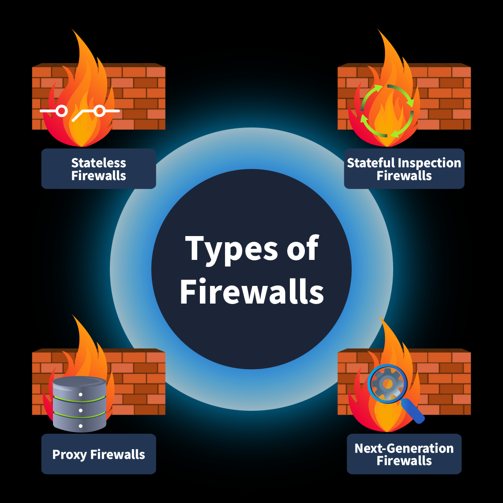

### 1. Stateless Firewall
Loại tường lửa này hoạt động ở lớp 3 và lớp 4 của mô hình OSI và chỉ hoạt động bằng cách lọc dữ liệu dựa trên các quy tắc đã được xác định trước mà không ghi nhận trạng thái của các kết nối trước đó. Điều này có nghĩa là nó sẽ khớp mọi gói tin với các quy tắc bất kể gói tin đó có thuộc về một kết nối hợp lệ hay không. Nó không lưu giữ thông tin về trạng thái của các kết nối trước đó để đưa ra quyết định cho các gói tin trong tương lai. Do đó, các tường lửa này có thể xử lý các gói tin nhanh chóng. Tuy nhiên, chúng không thể áp dụng các chính sách phức tạp cho dữ liệu dựa trên mối quan hệ của nó với các kết nối trước đó. Giả sử tường lửa từ chối một vài gói tin từ một nguồn duy nhất dựa trên các quy tắc của nó. Lý tưởng nhất, nó nên loại bỏ tất cả các gói tin trong tương lai từ nguồn này vì các gói tin trước đó không tuân thủ các quy tắc của tường lửa . Tuy nhiên, tường lửa liên tục quên điều này, và các gói tin trong tương lai từ nguồn này sẽ được coi là mới và được khớp lại với các quy tắc của nó.

### 2. Stateful Inspection Firewall
Không giống như tường lửa không trạng thái, loại tường lửa này không chỉ lọc gói tin theo các quy tắc đã định trước. Nó còn theo dõi các kết nối trước đó và lưu trữ chúng trong bảng trạng thái. Điều này bổ sung thêm một lớp bảo mật bằng cách kiểm tra các gói tin dựa trên lịch sử kết nối của chúng. Tường lửa có trạng thái hoạt động ở lớp `3` và lớp `4` của mô hình OSI. Giả sử tường lửa chấp nhận một vài gói tin từ một địa chỉ nguồn dựa trên các quy tắc của nó. Trong trường hợp đó, nó sẽ ghi lại kết nối này trong bảng trạng thái của mình và cho phép tất cả các gói tin trong tương lai cho kết nối này được tự động chấp nhận mà không cần kiểm tra từng gói tin. Tương tự, tường lửa có trạng thái ghi lại các kết nối mà chúng từ chối một vài gói tin, và dựa trên thông tin này, chúng từ chối tất cả các gói tin tiếp theo đến từ cùng một nguồn.

### 3. Proxy Firewall
Vấn đề của các tường lửa trước đây là chúng không thể kiểm tra nội dung của gói dữ liệu. Tường lửa proxy , hay cổng ứng dụng, hoạt động như trung gian giữa mạng riêng và Internet và hoạt động ở lớp `7` của mô hình OSI. Chúng cũng kiểm tra nội dung của tất cả các gói dữ liệu. Các yêu cầu do người dùng trong mạng đưa ra được proxy này chuyển tiếp sau khi kiểm tra và che giấu chúng bằng địa chỉ IP của chính nó để cung cấp tính ẩn danh cho các địa chỉ IP nội bộ. Các chính sách lọc nội dung có thể được áp dụng cho các tường lửa này để cho phép/từ chối lưu lượng truy cập đến và đi dựa trên nội dung của chúng.

### 4. Next-Generation Firewall
Đây là loại tường lửa tiên tiến nhất , hoạt động từ lớp 3 đến lớp 7 của mô hình OSI, cung cấp khả năng kiểm tra gói tin chuyên sâu và các chức năng khác giúp tăng cường bảo mật cho lưu lượng mạng đến và đi. Nó có hệ thống ngăn chặn xâm nhập, chặn các hoạt động độc hại trong thời gian thực. Nó cung cấp phân tích dựa trên kinh nghiệm bằng cách phân tích các mẫu tấn công và chặn chúng ngay lập tức trước khi tiếp cận mạng. NGFW có khả năng giải mã SSL/ TLS , kiểm tra các gói tin sau khi giải mã và đối chiếu dữ liệu với nguồn cấp dữ liệu tình báo về mối đe dọa để đưa ra các quyết định hiệu quả.

Bảng dưới đây liệt kê các đặc điểm của từng tường lửa , giúp bạn lựa chọn tường lửa phù hợp nhất cho các trường hợp sử dụng khác nhau.

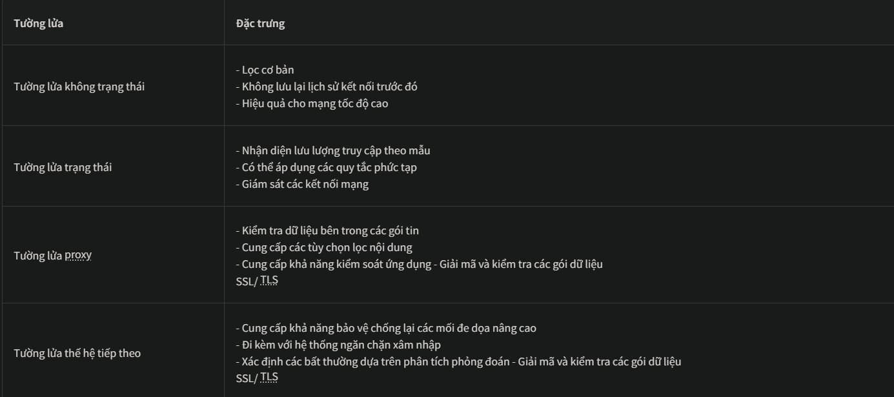

## 3. Rules in Firewalls
Tường lửa cho phép bạn kiểm soát lưu lượng truy cập mạng. Mặc dù nó lọc lưu lượng dựa trên các quy tắc được tích hợp sẵn, nhưng bạn cũng có thể định nghĩa một số quy tắc tùy chỉnh cho các mạng khác nhau. Ví dụ, có những mạng muốn từ chối tất cả lưu lượng SSH đi vào mạng của họ. Tuy nhiên, mạng của bạn lại cần cho phép lưu lượng SSH từ một vài địa chỉ IP cụ thể. Các quy tắc cho phép bạn cấu hình các cài đặt tùy chỉnh này cho lưu lượng truy cập đến và đi của mạng.

Các thành phần cơ bản của một quy tắc tường lửa được mô tả dưới đây:
- **Địa chỉ nguồn**: Địa chỉ IP của máy tính tạo ra lưu lượng truy cập.
- **Địa chỉ đích**: Địa chỉ IP của máy sẽ nhận dữ liệu.
- **Cổng**: Số hiệu cổng cho lưu lượng truy cập.
- **Giao thức**: Giao thức sẽ được sử dụng trong quá trình giao tiếp.
- **Hành động**:  Mục này xác định hành động sẽ được thực hiện khi phát hiện bất kỳ lưu lượng truy cập nào có tính chất đặc biệt này.
- **Hướng**: Trường này xác định phạm vi áp dụng của quy tắc đối với lưu lượng truy cập đến hoặc đi.

### Các loại hành động
Thành phần “Hành động” của một quy tắc cho biết các bước cần thực hiện sau khi một gói dữ liệu thuộc loại được định nghĩa trong quy tắc đó. Ba hành động chính có thể áp dụng cho một quy tắc được giải thích bên dưới.

#### 1. Allow(*Cho phép*)
Hành động "Cho phép" của một quy tắc cho biết rằng lưu lượng truy cập cụ thể được định nghĩa bên trong quy tắc đó sẽ được cho phép.

Ví dụ, chúng ta hãy tạo một quy tắc với hành động cho phép tất cả lưu lượng truy cập đi ra từ mạng của chúng ta qua cổng 80 (được sử dụng cho lưu lượng HTTP ra Internet).

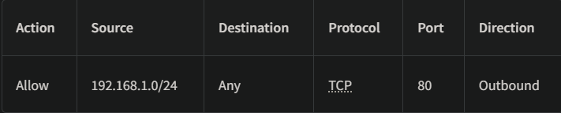

#### 2. Deny(*Từ chối*)
Hành động “Từ chối” của một quy tắc có nghĩa là lưu lượng truy cập được định nghĩa bên trong quy tắc đó sẽ bị chặn và không được cho phép. Những quy tắc này rất quan trọng đối với nhóm bảo mật để từ chối lưu lượng truy cập cụ thể đến từ các địa chỉ IP độc hại và tạo ra nhiều quy tắc hơn nhằm giảm thiểu bề mặt tấn công của mạng.

Ví dụ, chúng ta hãy tạo một quy tắc với hành động từ chối tất cả lưu lượng truy cập đến cổng 22 (*được sử dụng để kết nối từ xa đến một máy thông qua SSH*) của máy chủ quan trọng của chúng ta.

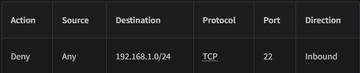

#### 3. Forward(*Chuyển tiếp*)
Thao tác “Chuyển tiếp” sẽ chuyển hướng lưu lượng truy cập đến một phân đoạn mạng khác bằng cách sử dụng các quy tắc chuyển tiếp được tạo trên tường lửa. Điều này áp dụng cho các tường lửa cung cấp chức năng định tuyến và hoạt động như cổng kết nối giữa các phân đoạn mạng khác nhau.

Ví dụ, chúng ta hãy tạo một quy tắc với hành động chuyển tiếp tất cả lưu lượng truy cập đến trên cổng 80 (được sử dụng cho lưu lượng HTTP ) đến máy chủ web `192.168.1.8`

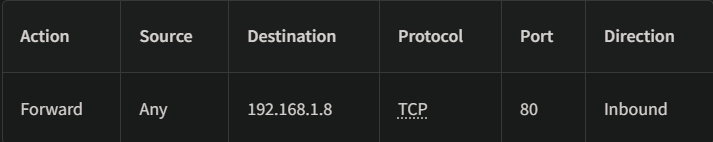

### Tính định hướng của các quy tắc
Tường lửa có nhiều loại quy tắc khác nhau, mỗi loại được phân loại dựa trên hướng lưu lượng truy cập mà các quy tắc đó được tạo ra. Chúng ta hãy cùng xem xét từng hướng này.

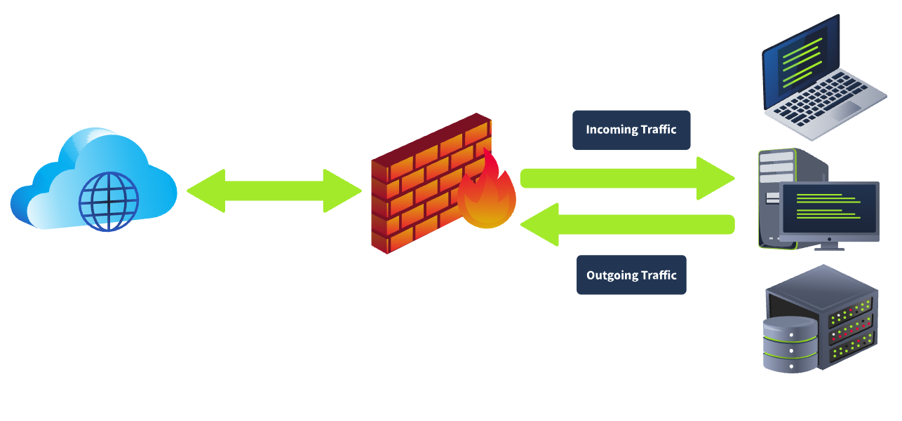

#### 1. Inbound Rules
Các quy tắc được phân loại là quy tắc đến khi chúng chỉ được áp dụng cho lưu lượng truy cập đến. Ví dụ, bạn có thể cho phép lưu lượng truy cập HTTP đến (cổng 80) trên máy chủ web của mình.
#### 2. Outbound Rules
Các quy tắc này chỉ áp dụng cho lưu lượng truy cập đi ra. Ví dụ, chặn tất cả lưu lượng SMTP đi ra (cổng 25) từ tất cả các thiết bị ngoại trừ máy chủ thư.
#### 3. Forward Rules
Các quy tắc chuyển tiếp được tạo ra để chuyển tiếp lưu lượng truy cập cụ thể bên trong mạng. Ví dụ, một quy tắc chuyển tiếp có thể được tạo để chuyển tiếp lưu lượng HTTP (cổng 80) đến máy chủ web nằm trong mạng của bạn.

## 4. Windows Defender Firewall
### 1. Tường lửa Windows Defender
**Windows Defender** là tường lửa tích hợp sẵn do Microsoft giới thiệu trong hệ điều hành Windows . Tường lửa này chứa tất cả các chức năng cơ bản để tạo, cho phép hoặc từ chối các chương trình cụ thể hoặc tạo các quy tắc tùy chỉnh. Bài viết này được thiết kế để giới thiệu một số thành phần thiết yếu của Tường lửa Windows Defender , mà bạn có thể sử dụng để hạn chế lưu lượng mạng đến và đi của hệ thống. Để mở tường lửa này , bạn cần mở tìm kiếm Windows và nhập `Windows Defender Firewall`

Trang chủ của Tường lửa Windows Defender hiển thị "Cấu hình mạng" và các tùy chọn có sẵn. Đây là bảng điều khiển chính với tất cả các tùy chọn dành cho tường lửa

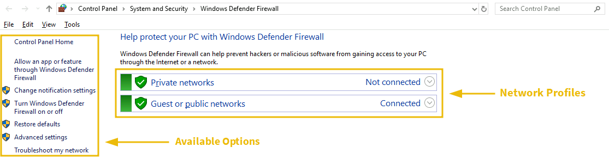

### 2. Hồ sơ mạng
Có hai cấu hình mạng khả dụng. Tường lửa Windows xác định mạng hiện tại của bạn dựa trên Nhận biết vị trí mạng (NLA) và áp dụng các cài đặt tường lửa của cấu hình đó cho bạn. Chúng ta có thể có các cài đặt tường lửa khác nhau cho mỗi cấu hình.


1. **Private Network**: Điều này bao gồm cấu hình tường lửa cần áp dụng khi kết nối với mạng gia đình của chúng ta.
2. **Guest Network** hoặc **Public Network**: Phần này bao gồm cấu hình tường lửa cần áp dụng khi kết nối với mạng công cộng hoặc mạng không đáng tin cậy như quán cà phê, nhà hàng hoặc những nơi tương tự. Ví dụ, khi kết nối với mạng công cộng, bạn có thể cấu hình cài đặt tường lửa để chặn tất cả các kết nối mạng đến và chỉ cho phép một số kết nối đi ra cần thiết. Các cài đặt này sẽ được áp dụng cho cấu hình mạng công cộng và sẽ không được thực hiện khi bạn đang ở trong mạng gia đình riêng của mình.

Để cho phép/không cho phép bất kỳ ứng dụng nào trong bất kỳ cấu hình mạng nào của bạn, hãy nhấp vào tùy chọn (được đánh dấu là 1 trong ảnh chụp màn hình). Thao tác này sẽ đưa bạn đến trang liệt kê tất cả các ứng dụng và tính năng được cài đặt trong hệ thống của bạn. Bạn có thể đánh dấu chọn những ứng dụng bạn muốn cho phép trong bất kỳ cấu hình mạng nào hoặc bỏ chọn những ứng dụng nếu không cần thiết.  Tường lửa Windows Defender được bật theo mặc định. Tuy nhiên, nếu bạn muốn bật/tắt nó, bạn có thể nhấp vào tùy chọn (được đánh dấu là 2 trong ảnh chụp màn hình). Thao tác này sẽ đưa bạn đến cài đặt cho cả hai cấu hình mạng của bạn. Thay vì tắt hoàn toàn, điều mà Microsoft không khuyến nghị, bạn cũng có thể chặn tất cả các kết nối đến. Bạn cũng có thể nhấp vào "Khôi phục mặc định" (được đánh dấu là 3 trong ảnh chụp màn hình) từ bảng điều khiển chính bất cứ lúc nào để khôi phục tất cả các cài đặt mặc định của tường lửa

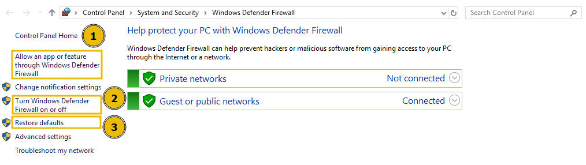

### 3. Tùy chỉnh rule
Tường lửa Windows Defender cũng cho phép bạn tạo các quy tắc tùy chỉnh cho mạng của mình để cho phép/chặn lưu lượng truy cập cụ thể khi cần. Hãy tạo một quy tắc tùy chỉnh để chặn tất cả lưu lượng truy cập đi ra trên HTTP (cổng 80) hoặc HTTPS (cổng 443). Sau khi tạo quy tắc này, chúng ta sẽ không thể truy cập bất kỳ trang web nào trên Internet vì các trang web đó hoạt động trên cổng `80` hoặc `443`, mà chúng ta sẽ chặn.

Trước khi tạo quy tắc này, hãy kiểm tra xem chúng ta có thể truy cập trang web hay không. Để kiểm tra, hãy truy cập trang web này `http://10.10.10.10/`. Như hình ảnh bên dưới cho thấy, chúng ta có thể truy cập trang web này.

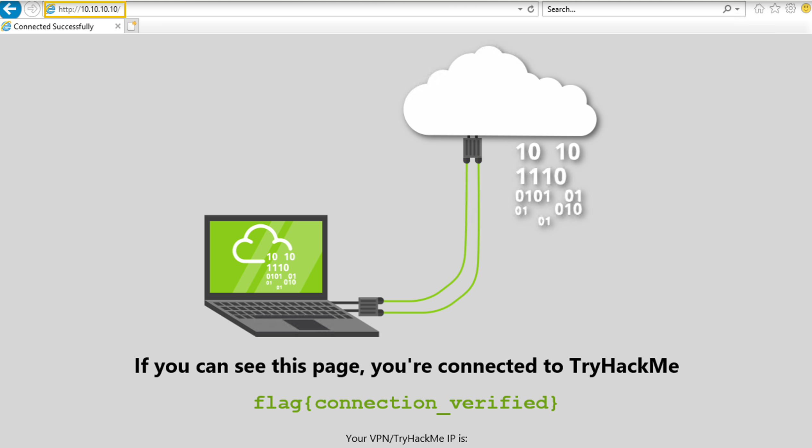

Để tạo quy tắc tùy chỉnh, hãy chọn `Advance Settings` từ các tùy chọn có sẵn trên bảng điều khiển chính. Thao tác này sẽ mở một tab mới, nơi bạn có thể tạo các quy tắc riêng của mình.

*Lưu ý*: Quy tắc được tạo bên dưới đã có sẵn trong máy ảo đính kèm. Nếu bạn muốn kiểm tra, bạn có thể tạo nó trên máy chủ Windows của mình hoặc bất kỳ máy nào khác.

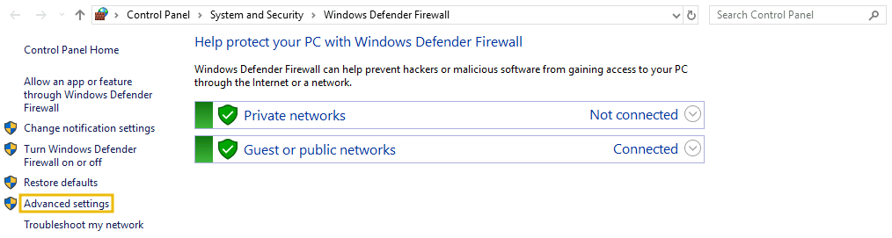

Bạn có thể xem các tùy chọn có sẵn để tạo quy tắc đến và đi.

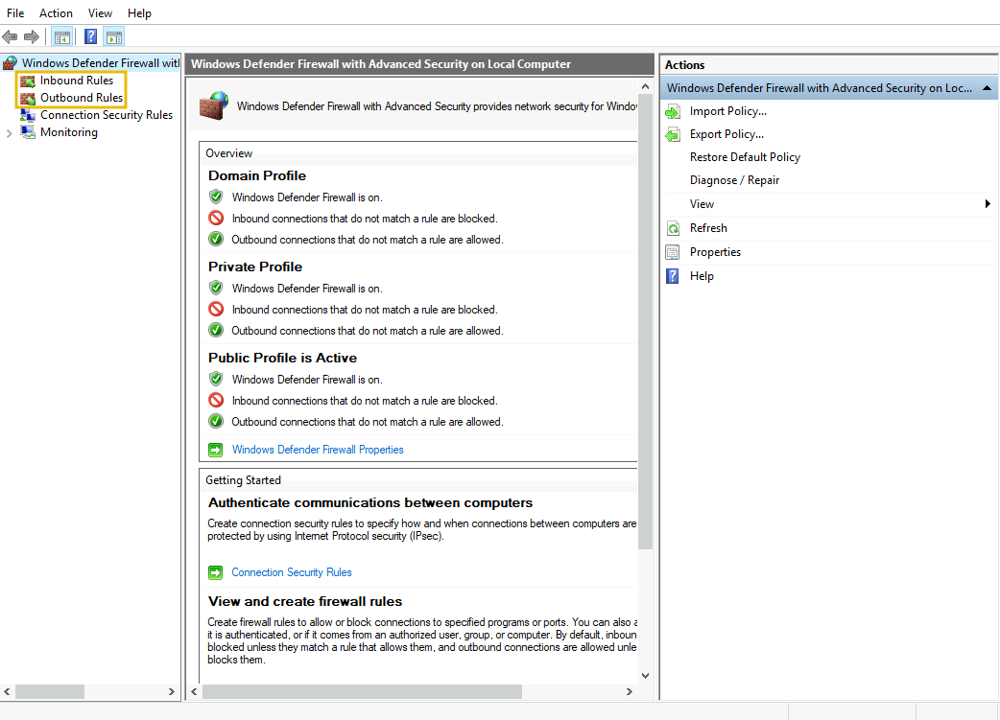

Hãy tạo một quy tắc đi ra để chặn tất cả lưu lượng HTTP và HTTPS đi ra. Để làm điều này, hãy nhấp vào tùy chọn `Outbound Rules` đi ra ở bên trái, sau đó nhấp vào `New Rule` ở bên phải. Trình hướng dẫn quy tắc sẽ mở ra. Ở bước đầu tiên, hãy chọn tùy chọn `Custom` và nhấn `Next`

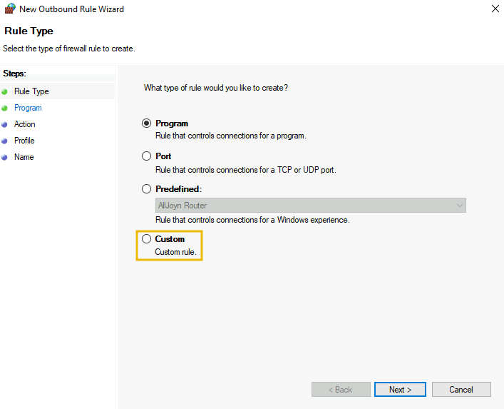

Bước tiếp theo chọn `All programs` từ tùy chọn từ bước nhấn `Next` từ trước. Nó sẽ hỏi bạn chọn giao thức trong bước thứ 3. Chọn `Protocol type` là `TCP`, giữ nguyên `Local port` và thay đổi `Remote Port` bằng `Specific Ports` từ menu được mở ra. Nhập `port number` vào trường bên dưới (ví dụ: `80, 443`). Tiếp theo chọn `Next`

*Lưu ý*: Hãy phân tách các số cổng bằng dấu phẩy và không để khoảng trắng giữa chúng.


Trong tab `Scope`, giữ local và remote IP và nhấn `Next`. Trong tab `Action`, kích hoạt tùy chọn `Block the connection` và nhấn `Next`

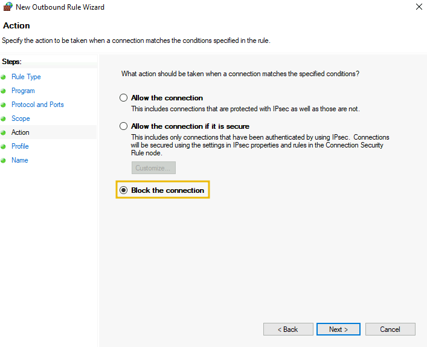

Trong tab `Profile`, chúng ta giữ tất cả các **network profiles check-marked**. Cuối cùng, đặt tên cho rule và giải thích, sau đó nhấn nút `Finish`

Chúng ta có thể nhìn thấy rule ở trong `outbound rules`

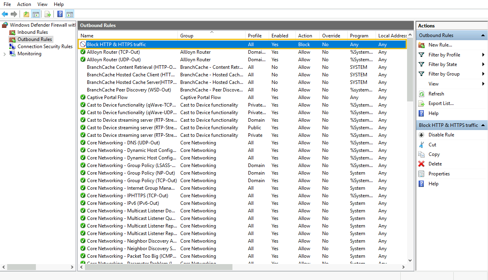

Bây giờ hãy thử truy cập URL `http://10.10.10.10/`. Chúng ta nhận được lỗi nói rằng không thể truy cập được, có nghĩa là rule đã được hoạt động

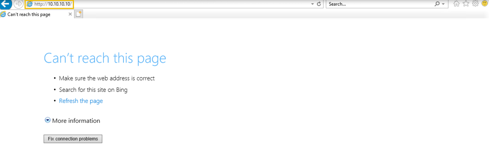

### 4. Bài tập
Nhóm bảo mật đã phát hiện lưu lượng truy cập đến và đi đáng ngờ trên hệ thống Windows quan trọng của họ. Họ đã tạo các quy tắc trên tường lửa Windows Defender để chặn một số lưu lượng mạng cụ thể. Nhiệm vụ của bạn là trả lời một vài câu hỏi được đưa ra ở cuối bài tập này bằng cách xem xét các quy tắc đã tạo.

*Tên của quy tắc được tạo ra để chặn tất cả lưu lượng truy cập đến cổng SSH là gì?*
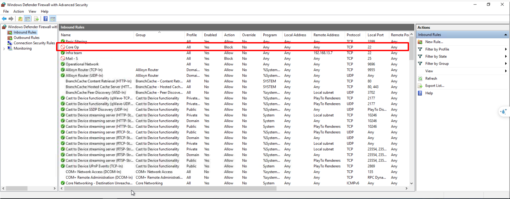

`Core OP`

*Một quy tắc đã được tạo để cho phép SSH từ một địa chỉ IP duy nhất. Tên của quy tắc đó là gì?*

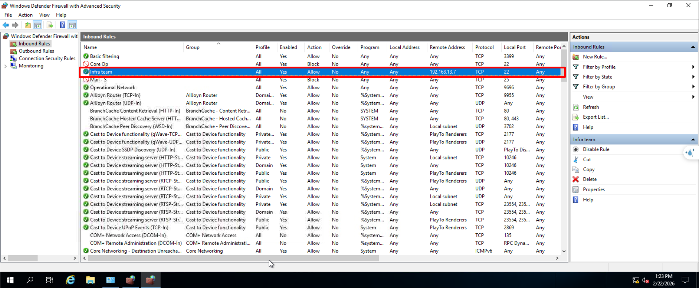

`Infra team`

*Địa chỉ IP nào được phép theo quy tắc này?*

`192.168.13.7`

## 5. Linux iptables Firewall
Trong bài tập trước, chúng ta đã thảo luận về tường lửa tích hợp sẵn trong hệ điều hành Windows . Vậy nếu bạn là người dùng Linux thì sao ? Bạn vẫn cần kiểm soát lưu lượng mạng của mình. Linux cũng cung cấp chức năng tường lửa tích hợp sẵn . Chúng ta có nhiều tùy chọn tường lửa khác nhau. Hãy cùng điểm qua hầu hết chúng và tìm hiểu chi tiết về một trong số đó.

### 1. Netfilter
Netfilter là khung phần mềm bên trong hệ điều hành Linux với các chức năng tường lửa cốt lõi , bao gồm lọc gói tin, NAT và theo dõi kết nối. Khung phần mềm này đóng vai trò là nền tảng cho nhiều tiện ích tường lửa có sẵn trong Linux để kiểm soát lưu lượng mạng. Một số tiện ích tường lửa phổ biến sử dụng khung phần mềm này được liệt kê bên dưới:
- **iptables**: Đây là tiện ích được sử dụng rộng rãi nhất trong nhiều bản phân phối Linux . Nó sử dụng khung Netfilter cung cấp nhiều chức năng để kiểm soát lưu lượng mạng.
- **nftables**: Đây là phiên bản kế nhiệm của tiện ích “iptables”, với khả năng lọc gói tin và NAT được nâng cao. Nó cũng dựa trên khung Netfilter.
- **firewalld**: Tiện ích này cũng hoạt động trên nền tảng Netfilter và có các bộ quy tắc được định sẵn. Nó hoạt động khác với các tiện ích khác và đi kèm với các cấu hình vùng mạng được xây dựng sẵn khác nhau.

### 2. ufw
`ufw` (**Uncomplicated Firewall**), đúng như tên gọi, loại bỏ sự phức tạp khi tạo các quy tắc bằng cú pháp phức tạp trong “iptables” (hoặc phiên bản kế nhiệm của nó) bằng cách cung cấp cho bạn một giao diện dễ sử dụng hơn. Nó thân thiện hơn với người mới bắt đầu. Về cơ bản, bất kỳ quy tắc nào bạn cần trong “iptables”, bạn đều có thể định nghĩa chúng bằng một số lệnh đơn giản thông qua ufw, sau đó ufw sẽ cấu hình các quy tắc mong muốn của bạn trong “iptables”. Hãy cùng xem một số lệnh ufw cơ bản bên dưới.

Để kiểm tra trạng thái của tường lửa , bạn có thể sử dụng lệnh sau:

```
user@ubuntu:~$ sudo ufw status
Status: inactive
```

Nếu nó hiển thị ở trạng thái không hoạt động, bạn có thể kích hoạt nó bằng lệnh sau:

```
user@ubuntu:~$ sudo ufw enable
Firewall is active and enabled on system startup
```

Để tắt tường lửa , hãy nhập `disable` thay vì `enable` trong lệnh trên.

Dưới đây là một quy tắc được tạo ra để cho phép tất cả các kết nối đi ra từ một máy Linux. Trong lệnh  `default` có nghĩa là chúng ta đang định nghĩa chính sách này như một chính sách mặc định, cho phép tất cả lưu lượng truy cập đi ra trừ khi chúng ta định nghĩa một hạn chế lưu lượng truy cập đi ra trên bất kỳ ứng dụng cụ thể nào trong một quy tắc riêng biệt. Bạn cũng có thể tạo một quy tắc để cho phép/từ chối lưu lượng truy cập đến máy của mình bằng cách thay thế  `outgoing` bằng `incoming` trong lệnh sau:

```
user@ubuntu:~$ sudo ufw default allow outgoing
Default outgoing policy changed to 'allow'
(be sure to update your rules accordingly)
```

Bạn có thể từ chối lưu lượng truy cập đến bất kỳ cổng nào trong hệ thống của mình. Giả sử chúng ta muốn chặn lưu lượng SSH đến. Chúng ta có thể thực hiện điều này bằng lệnh `ufw deny 22/tcp` . Như bạn thấy, trước tiên chúng ta đã chỉ định hành động `deny` trong trường hợp này; hơn nữa, chúng ta đã chỉ định cổng và giao thức truyền tải, đó là cổng TCP 22, hoặc đơn giản là ` 22/tcp`

```
user@ubuntu:~$ sudo ufw deny 22/tcp
Rule added
Rule added (v6)
```

Để liệt kê tất cả các quy tắc đang hoạt động theo thứ tự số, bạn có thể sử dụng lệnh sau:

```bash
user@ubuntu:~$ sudo ufw status numbered
     To                         Action      From
     --                         ------      ----
[ 1] 22/tcp                     DENY IN     Anywhere                  
[ 2] 22/tcp (v6)                DENY IN     Anywhere (v6)
```

Để xóa bất kỳ quy tắc nào, hãy thực hiện lệnh sau cùng với số thứ tự của quy tắc cần xóa:

```
user@ubuntu:~$ sudo ufw delete 2
Deleting:
 deny 22/tcp
Proceed with operation (y|n)? y
Rule deleted (v6)
```

Các tiện ích khác nhau này có thể được sử dụng để quản lý Netfilter. Việc chọn tiện ích phù hợp cho hệ điều hành Linux phụ thuộc vào nhiều yếu tố, chẳng hạn như mức độ quen thuộc với hệ điều hành và yêu cầu của bạn. Bạn có thể kiểm tra kiến ​​thức của mình về tường lửa Linux bằng cách tạo một số quy tắc được định nghĩa trong nhiệm vụ này và kiểm tra chúng để đảm bảo chúng hoạt động như mong đợi.

