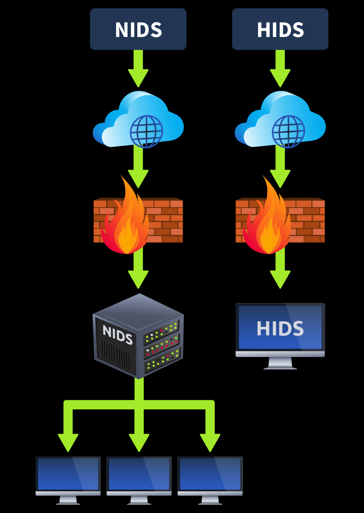
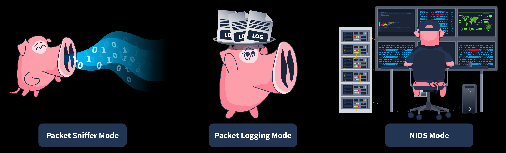
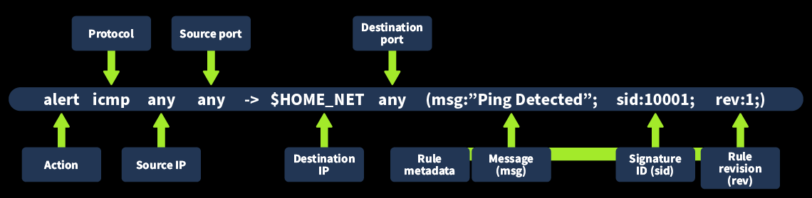
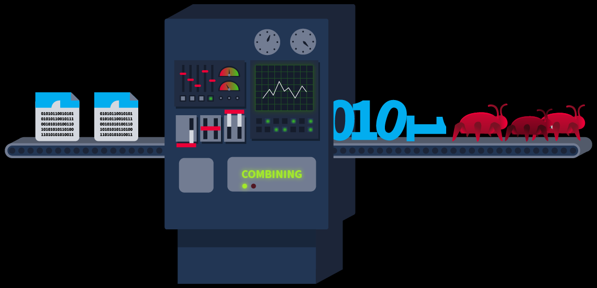
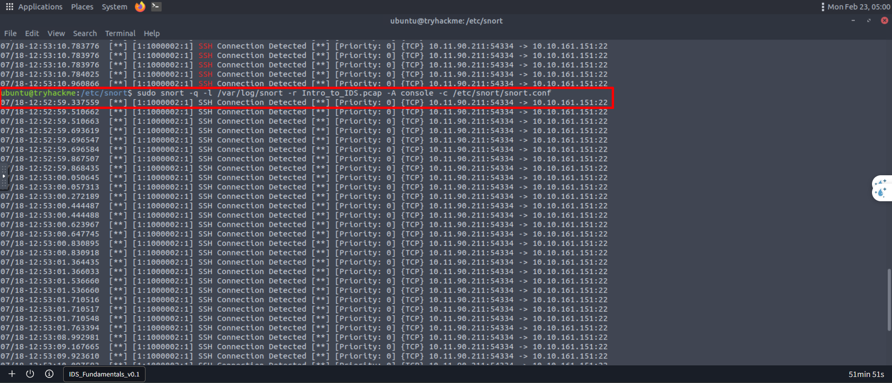
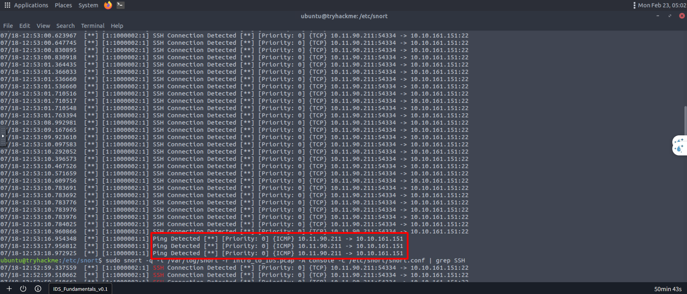

# IDS Fundamentals
## 1. What is an IDS?
Như chúng ta đã biết, firewall là giải pháp bảo mật thường được triển khai trước bề mặt của mạng để bảo vệ những traffic đi vào và ra. Firewall kiểm tra traffic khi kết nối được thiết lập và từ chối khi vi phạm rule. Tuy nhiên, cần phải có một số biện pháp bảo mật để phát hiện các hoạt động của kết nối đã vượt qua tường lửa và đã được thực hiện. Vì vậy, nếu kẻ tấn công thành công vượt qua tường lửa thông qua một kết nối trông có vẻ hợp pháp và sau đó thực hiện bất kỳ hoạt động độc hại nào bên trong mạng, cần phải có thứ gì đó để phát hiện nó kịp thời. Vì mục đích này, chúng ta có một giải pháp bảo mật bên trong mạng. Giải pháp này được gọi là tường lửa (ANC) **Intrusion Detection System** (`IDS`)

Hãy nghĩ đến một ví dụ về an ninh của một tòa nhà. Tường lửa đóng vai trò như người gác cổng, kiểm tra người ra vào. Luôn có khả năng một kẻ xấu nào đó sẽ xâm nhập thành công và bắt đầu thực hiện các hoạt động độc hại. Hắn ta đã bị bỏ sót ở cổng, nhưng điều gì sẽ xảy ra nếu chúng ta bắt được hắn ta ngay cả sau khi hắn đã vào bên trong? Điều này có thể được thực hiện bởi các camera giám sát được bố trí khắp tòa nhà. Hệ thống phát hiện xâm nhập (IDS) đóng vai trò như các camera giám sát. Nó được đặt ở một góc, giám sát lưu lượng mạng dựa trên chữ ký và các phát hiện dựa trên sự bất thường, và phát hiện bất kỳ lưu lượng truy cập bất thường nào đi ra hoặc vào mạng. Sau mỗi lần phát hiện, một cảnh báo sẽ được tạo ra cho các quản trị viên an ninh. IDS không hành động dựa trên những phát hiện đó; nó chỉ thông báo cho các quản trị viên an ninh về hoạt động độc hại.

Phòng học này sẽ trang bị cho bạn kiến ​​thức vững chắc về các giải pháp IDS . Chúng ta cũng sẽ tìm hiểu về giải pháp IDS mã nguồn mở phổ biến nhất trong các bài tập sắp tới. 

### Mục tiêu học tập
Các loại hệ thống phát hiện xâm nhập (IDS) và khả năng phát hiện của chúng
- Nguyên lý hoạt động của **Snort IDS**
- Các quy tắc mặc định và tùy chỉnh trong **Snort IDS**
- Tạo quy tắc tùy chỉnh trong **Snort IDS**

## 2. Types of IDS
Hệ thống phát hiện xâm nhập (IDS) có thể được phân loại khác nhau tùy thuộc vào một số yếu tố. Phân loại chính của IDS phụ thuộc vào phương thức triển khai và phát hiện của nó.

### 1. Chế độ triển khai
Hệ thống phát hiện xâm nhập (IDS) có thể được triển khai theo các cách sau:
- **Host Intrusion Detection System** ( `HIDS` ): Các giải pháp IDS dựa trên máy chủ được cài đặt riêng lẻ trên từng máy chủ và chỉ chịu trách nhiệm phát hiện các mối đe dọa an ninh tiềm ẩn liên quan đến máy chủ cụ thể đó. Chúng cung cấp khả năng hiển thị chi tiết về các hoạt động của máy chủ. Tuy nhiên, các hệ thống phát hiện xâm nhập máy chủ có thể khó quản lý trong các mạng lớn vì chúng tiêu tốn nhiều tài nguyên và yêu cầu quản lý trên từng máy chủ.
- **Network Intrusion Detection System** ( `NIDS` ): Các giải pháp IDS dựa trên mạng rất quan trọng trong việc phát hiện các hoạt động có khả năng độc hại trong toàn bộ mạng, bất kể máy chủ cụ thể nào. Chúng giám sát lưu lượng mạng của tất cả các máy chủ liên quan để phát hiện các hoạt động đáng ngờ. Nó cung cấp một cái nhìn tổng quan tập trung về tất cả các phát hiện bên trong toàn bộ mạng.



### 2. Chế độ phát hiện
- **Hệ thống phát hiện xâm nhập dựa trên chữ ký** (`Signature-Based IDS`): Mỗi ngày có rất nhiều cuộc tấn công xảy ra. Mỗi cuộc tấn công đều có một mô hình riêng biệt, được gọi là chữ ký. Các chữ ký này được hệ thống IDS lưu giữ trong cơ sở dữ liệu của chúng để nếu cùng một cuộc tấn công xảy ra trong tương lai, nó sẽ được phát hiện bằng chữ ký và báo cáo cho các quản trị viên an ninh để xử lý. Cơ sở dữ liệu chữ ký của hệ thống IDS càng mạnh thì khả năng phát hiện các mối đe dọa đã biết càng hiệu quả. Tuy nhiên, hệ thống IDS dựa trên chữ ký không thể phát hiện các cuộc tấn công zero-day. Các cuộc tấn công zero-day không có chữ ký (mô hình) nào được lưu trữ trước đó và không được lưu trong cơ sở dữ liệu của hệ thống IDS . Do đó, hệ thống IDS dựa trên chữ ký chỉ có thể phát hiện các cuộc tấn công đã xảy ra trước đó và chữ ký (mô hình) của chúng được lưu trong cơ sở dữ liệu. Trong các bài tập tiếp theo, chúng ta sẽ tìm hiểu về một hệ thống IDS dựa trên chữ ký có tên là Snort.

- **Hệ thống phát hiện xâm nhập dựa trên sự bất thường** (`Anomaly-Based IDS`): Loại IDS này trước tiên học hành vi bình thường (đường cơ sở) của mạng hoặc hệ thống và thực hiện phát hiện nếu có bất kỳ sự sai lệch nào so với hành vi bình thường. IDS dựa trên sự bất thường cũng có thể phát hiện các cuộc tấn công zero-day vì chúng không dựa vào các chữ ký có sẵn để phát hiện. Chúng phát hiện các bất thường bên trong mạng hoặc hệ thống bằng cách so sánh trạng thái hiện tại với hành vi bình thường (đường cơ sở). Tuy nhiên, loại IDS này có thể tạo ra rất nhiều kết quả dương tính giả (đánh dấu các hoạt động lành tính là độc hại) vì bản chất của hầu hết các chương trình hợp pháp trùng khớp với các chương trình độc hại. IDS dựa trên sự bất thường sẽ đánh dấu chúng là độc hại và tin rằng bất cứ điều gì hoạt động bất thường đều là độc hại. Chúng ta cũng có thể giảm thiểu các kết quả dương tính giả do IDS dựa trên sự bất thường tạo ra bằng cách tinh chỉnh nó (xác định thủ công hành vi bình thường trong IDS ).

- **Hệ thống phát hiện xâm nhập lai** (`Hybrid IDS`): Hệ thống phát hiện xâm nhập lai kết hợp các phương pháp phát hiện của hệ thống phát hiện xâm nhập dựa trên chữ ký và hệ thống phát hiện xâm nhập dựa trên bất thường để tận dụng thế mạnh của mỗi phương pháp. Một số mối đe dọa đã biết có thể đã có một số chữ ký trong cơ sở dữ liệu của hệ thống phát hiện xâm nhập ; trong trường hợp này, hệ thống phát hiện xâm nhập lai sẽ sử dụng kỹ thuật phát hiện của hệ thống phát hiện xâm nhập dựa trên chữ ký . Nếu gặp phải mối đe dọa mới, nó có thể tận dụng phương pháp phát hiện của hệ thống phát hiện xâm nhập dựa trên bất thường .

Hệ thống phát hiện xâm nhập dựa trên chữ ký có thể phát hiện các mối đe dọa nhanh chóng, trong khi các hệ thống phát hiện xâm nhập khác có thể có chi phí xử lý cao. Tuy nhiên, điều cần thiết là phải xem xét hệ thống phát hiện xâm nhập dựa trên nhiều yếu tố khác nhau. Hệ thống phát hiện xâm nhập dựa trên chữ ký có thể là một lựa chọn tốt để bao phủ một bề mặt mối đe dọa nhỏ. Hệ thống phát hiện xâm nhập dựa trên sự bất thường và hệ thống phát hiện xâm nhập lai có thể giúp phát hiện các cuộc tấn công zero-day hiện đại, đang gia tăng hàng ngày và có thể gây ra thiệt hại lớn cho các tổ chức.

## 3. IDS Example: Snort
**Snort** là một trong những giải pháp IDS mã nguồn mở được sử dụng rộng rãi nhất , được phát triển vào năm 1998. Nó sử dụng phương pháp phát hiện dựa trên chữ ký và dựa trên sự bất thường để xác định các mối đe dọa đã biết. Những mối đe dọa này được định nghĩa trong các tệp quy tắc của công cụ Snort. Một số tệp quy tắc tích hợp sẵn đã được cài đặt sẵn trong gói phần mềm này. Các tệp quy tắc tích hợp sẵn này chứa nhiều mẫu tấn công đã biết. Các quy tắc tích hợp sẵn của Snort có thể phát hiện nhiều lưu lượng truy cập độc hại. Tuy nhiên, bạn có thể cấu hình Snort để phát hiện các loại lưu lượng mạng cụ thể không được bao phủ bởi các tệp quy tắc mặc định. Bạn có thể tạo các quy tắc tùy chỉnh dựa trên yêu cầu của mình để phát hiện lưu lượng truy cập cụ thể. Bạn cũng có thể vô hiệu hóa bất kỳ quy tắc phát hiện tích hợp sẵn nào nếu chúng không nhắm đến lưu lượng truy cập có hại cho hệ thống hoặc mạng của bạn và thay vào đó định nghĩa một số quy tắc tùy chỉnh. Trong nhiệm vụ tiếp theo, chúng ta sẽ tìm hiểu các quy tắc tích hợp sẵn và tạo các quy tắc tùy chỉnh để phát hiện lưu lượng truy cập cụ thể.

### 1. Types of Snort


|MODE|MIÊU TẢ|TRƯỜNG HỢP SỬ DỤNG|
|-|-|-|
|Packet Sniffer Mode|Chế độ này đọc và hiển thị các gói mạng mà không thực hiện bất kỳ phân tích nào. Chế độ bắt gói tin của Snort không liên quan trực tiếp đến khả năng phát hiện xâm nhập (IDS) , nhưng nó có thể hữu ích trong việc giám sát và khắc phục sự cố mạng. Trong một số trường hợp, quản trị viên hệ thống có thể cần đọc luồng lưu lượng mà không cần thực hiện bất kỳ phát hiện nào để chẩn đoán các sự cố cụ thể. Trong trường hợp này, họ có thể sử dụng chế độ bắt gói tin của Snort. Chế độ này cho phép bạn hiển thị lưu lượng mạng trên bảng điều khiển hoặc thậm chí xuất nó ra một tệp.|Nhóm mạng nhận thấy một số vấn đề về hiệu suất mạng. Để chẩn đoán vấn đề, họ cần có thông tin chi tiết về lưu lượng mạng. Vì mục đích này, họ có thể sử dụng chế độ bắt gói tin của Snort.|
|Packet Logging Mode|Snort thực hiện phát hiện lưu lượng mạng theo thời gian thực và hiển thị các phát hiện dưới dạng cảnh báo trên bảng điều khiển để các quản trị viên bảo mật có thể hành động. Tuy nhiên, trong một số trường hợp, lưu lượng mạng cần được ghi nhật ký để phân tích sau này. Chế độ ghi nhật ký gói của Snort cho phép bạn ghi nhật ký lưu lượng mạng dưới dạng tệp PCAP (định dạng bắt gói chuẩn). Điều này bao gồm tất cả lưu lượng mạng và bất kỳ phát hiện nào từ đó. Các nhà điều tra pháp y có thể sử dụng các tệp nhật ký Snort này để thực hiện phân tích nguyên nhân gốc rễ của các cuộc tấn công trước đó.|Nhóm bảo mật cần tiến hành điều tra pháp y về một cuộc tấn công mạng. Họ cần nhật ký lưu lượng truy cập để thực hiện phân tích nguyên nhân gốc rễ. Nhật ký lưu lượng mạng được ghi lại thông qua chế độ ghi nhật ký gói của Snort có thể giúp họ.|
|NIDS Mode|Chế độ NIDS của Snort là chế độ chính giám sát lưu lượng mạng theo thời gian thực và áp dụng các tập tin quy tắc để xác định bất kỳ sự trùng khớp nào với các mẫu tấn công đã biết được lưu trữ dưới dạng chữ ký. Nếu có sự trùng khớp, nó sẽ tạo ra cảnh báo. Chế độ này cung cấp chức năng chính của một giải pháp IDS .|Nhóm bảo mật phải chủ động giám sát mạng hoặc hệ thống của họ để phát hiện các mối đe dọa tiềm tàng. Họ có thể tận dụng chế độ NIDS của Snort để thực hiện điều này.|

Ứng dụng phù hợp nhất của Snort với vai trò là hệ thống phát hiện xâm nhập (IDS) đến từ chế độ phát hiện xâm nhập mạng (NIDS ). Tuy nhiên, Snort có thể được sử dụng ở bất kỳ chế độ nào nêu trên tùy thuộc vào yêu cầu.

## 4. Snort Usage
Trong quá trình cài đặt Snort, bạn phải cung cấp giao diện mạng và dải địa chỉ IP của mình. Bạn có thể chạy Snort ở chế độ bình thường, trong đó nó chỉ thu thập lưu lượng truy cập hướng đến máy chủ của bạn. Tuy nhiên, nếu bạn muốn sử dụng Snort để thu thập và phát hiện các cuộc xâm nhập trên toàn bộ mạng của mình, bạn phải bật chế độ `promiscuous` của giao diện mạng máy chủ. 

Snort có một số tệp quy tắc tích hợp sẵn, một tệp cấu hình và các tệp khác. Chúng được lưu trữ trong /etc/snortthư mục. Tệp quan trọng nhất của Snort là tệp cấu hình snort.conf, nơi bạn có thể chỉ định các tệp quy tắc nào cần bật, phạm vi mạng nào cần giám sát và cho phép các thiết lập khác. Các tệp quy tắc được lưu trữ trong rulesthư mục. Hãy sử dụng lslệnh để liệt kê tất cả các tệp và thư mục có trong thư mục chính của Snort:

```
ubuntu@tryhackme:~$ ls /etc/snort
classification.config  reference.config  snort.debian.conf
community-sid-msg.map  rules             threshold.conf
gen-msg.map            snort.conf        unicode.map
...
```

### 1. Định dạng quy tắc
Bây giờ, chúng ta hãy thảo luận về cách tạo ra các quy tắc trong Snort. Có một cách cụ thể để viết các quy tắc. Một quy tắc mẫu sẽ phát hiện các gói ICMP (thường được sử dụng khi bạn ping một máy chủ) đến từ bất kỳ địa chỉ IP và cổng nào và đến mạng gia đình (phạm vi mạng được xác định trong tệp cấu hình của Snort) đến bất kỳ cổng nào. Khi lưu lượng truy cập như vậy được phát hiện, nó sẽ tạo ra cảnh báo **Ping Detected**



Chi tiết về các thành phần liên quan đến quy định này được nêu dưới đây:
- **alert**: Mục này chỉ định hành động cần thực hiện khi quy tắc được kích hoạt. Trong trường hợp này, chúng ta có hành động "cảnh báo" khi lưu lượng truy cập khớp với quy tắc này.
- **protocol**: Điều này đề cập đến giao thức phù hợp với quy tắc này. Trong trường hợp này, chúng ta sử dụng giao thức "ICMP" khi ping một máy chủ.
- **source IP**: Tham số này xác định địa chỉ IP bắt nguồn từ lưu lượng truy cập. Vì chúng ta muốn phát hiện lưu lượng truy cập từ bất kỳ địa chỉ IP nguồn nào, nên chúng ta đặt tham số này là "bất kỳ".
- **source port**: Tham số này xác định cổng mà từ đó lưu lượng truy cập bắt nguồn. Vì chúng ta muốn phát hiện lưu lượng truy cập từ bất kỳ cổng nguồn nào, nên chúng ta đặt tham số này là **any**
- **destination IP**: Tham số này chỉ định địa chỉ IP đích mà lưu lượng truy cập phù hợp sẽ đến; nó tạo ra cảnh báo. Trong trường hợp này, chúng tôi đã sử dụng "$HOME_NET". Đây là một biến, và chúng tôi đã định nghĩa giá trị của nó là toàn bộ dải địa chỉ mạng của chúng tôi trong tệp cấu hình của Snort.
- **destination port**: Tham số này chỉ định cổng mà lưu lượng truy cập sẽ đến. Vì chúng ta muốn phát hiện lưu lượng truy cập đến từ bất kỳ cổng nào, nên chúng ta đặt nó thành **any**
- **rule metadata**: Mỗi quy tắc đều có một số siêu dữ liệu. Siêu dữ liệu này được định nghĩa ở cuối quy tắc trong ngoặc đơn. Các thành phần của nó bao gồm:
    - **Thông báo (msg)**: Phần này mô tả thông báo được hiển thị khi quy tắc chủ thể được kích hoạt. Thông báo nên cho biết loại hoạt động được phát hiện. Trong trường hợp này, chúng ta đã sử dụng "Ping Detected".
    - **Signature ID**: Mỗi quy tắc đều có một mã định danh duy nhất để phân biệt nó với các quy tắc khác. Mã định danh này được gọi là mã định danh chữ ký (sid). Trong trường hợp này, chúng ta đặt sid là `10001`
    - **rule revision** (rev): Tham số này thiết lập số phiên bản sửa đổi của quy tắc. Mỗi khi quy tắc được sửa đổi, số phiên bản sửa đổi của nó sẽ được tăng lên, giúp theo dõi các thay đổi đối với bất kỳ quy tắc nào.

### 2. Tạo quy tắc
Hãy dán đoạn quy tắc mẫu đã giải thích ở trên vào tệp `local.rules` tùy chỉnh trong thư mục quy tắc của Snort.

Trước tiên, hãy mở tệp `local.rules` bằng trình soạn thảo văn bản:

```
ubuntu@tryhackme:~$ sudo nano /etc/snort/rules/local.rules
```

Bây giờ, hãy thêm quy tắc sau vào sau các quy tắc đã có sẵn trong tệp:

`alert icmp any any -> 127.0.0.1 any (msg:"Loopback Ping Detected"; sid:10003; rev:1;)`

*Lưu ý*: Chúng ta sẽ cần các quy tắc khác trong bài tập tiếp theo, vì vậy đừng xóa chúng.

Sau khi chỉnh sửa tệp thành công, nhấn `Ctrl+X` và hệ thống sẽ hỏi bạn có muốn lưu thay đổi bằng `Y` hay không. Nhấn `Y` để lưu thay đổi.

### 3. Kiểm thử quy tắc
Trước tiên, hãy khởi động công cụ Snort để phát hiện bất kỳ sự xâm nhập nào được định nghĩa trong tệp quy tắc. Để làm điều này, chúng ta phải thực hiện lệnh sau với quyền sudo trong cửa sổ dòng lệnh:

```
ubuntu@tryhackme:~$ sudo snort -q -l /var/log/snort -i lo -A console -c /etc/snort/snort.conf
```

Vì quy tắc này được thiết kế để cảnh báo chúng ta về bất kỳ gói ICMP nào gửi đến địa chỉ loopback của chúng ta, hãy thử ping địa chỉ loopback để xem quy tắc có hoạt động hay không:

```
ubuntu@tryhackme:~$ ping 127.0.0.1
```

Ảnh chụp màn hình bên dưới hiển thị cảnh báo "Loopback Ping Detected" do Snort tạo ra khi chúng ta ping địa chỉ IP loopback của máy chủ. Điều này có nghĩa là quy tắc của chúng ta đang hoạt động tốt.

```
ubuntu@tryhackme:~$ sudo snort -q -l /var/log/snort -i lo -A console -c /etc/snort/snort.conf
07/24-10:46:52.401504  [**] [1:1000001:1] Loopback Ping Detected [**] [Priority: 0] {ICMP} 127.0.0.1 -> 127.0.0.1
07/24-10:46:53.406552  [**] [1:1000001:1] Loopback Ping Detected [**] [Priority: 0] {ICMP} 127.0.0.1 -> 127.0.0.1
07/24-10:46:54.410544  [**] [1:1000001:1] Loopback Ping Detected [**] [Priority: 0] {ICMP} 127.0.0.1 -> 127.0.0.1
```

### 4. Chạy Snort trên các tệp PCAP
Chúng ta đã thấy cách Snort có thể được sử dụng để phát hiện xâm nhập trên lưu lượng truy cập thời gian thực. Tuy nhiên, đôi khi bạn có thể gặp phải trường hợp lưu lượng mạng lịch sử được ghi lại trong một tệp và bạn phải thực hiện điều tra pháp y để xác định bất kỳ dấu hiệu xâm nhập nào thông qua lưu lượng đó. Lưu lượng này thường được ghi lại ở định dạng bắt gói chuẩn "PCAP". Snort cũng được trang bị để thực hiện phát hiện trên các tệp PCAP chứa lưu lượng mạng lịch sử.



Bạn có thể sử dụng lệnh sau với quyền sudo để thực hiện thao tác này:

```
ubuntu@tryhackme:~$ sudo snort -q -l /var/log/snort -r Task.pcap -A console -c /etc/snort/snort.conf
```

### 5. LAB
Tình huống: Bạn là một nhà điều tra pháp y độc lập. Một công ty liên hệ với bạn để điều tra một cuộc tấn công gần đây vào mạng lưới của họ. Họ đã cung cấp cho bạn một tập tin PCAP có tên `Intro_to_IDS.pcap`, chứa lưu lượng mạng được ghi lại trong cuộc tấn công. Nhiệm vụ của bạn là chạy Snort trên tập tin PCAP này và trả lời các câu hỏi được đưa ra trong nhiệm vụ này.

**Lưu ý**: Tệp PCAP `Intro_to_IDS.pcap` được đặt trong thư mục `/etc/snort/`. Bạn phải thay đổi thư mục của mình `/etc/snort` và chạy lệnh phân tích PCAP trên tệp PCAP mới đó theo cách tương tự như chúng ta đã làm trong bài tập 4.



*Địa chỉ IP của máy tính đã cố gắng kết nối với máy tính cần tìm bằng SSH là gì?*

`10.11.90.211`

*Ngoài thông báo SSH, còn có thông báo quy tắc nào khác được phát hiện trong tệp PCAP không?*



`Ping Detected`

*SID của quy tắc phát hiện SSH là gì?*

`1000002`

