# Vulnerability Scanner Overview
## 1. What are Vulnerabilities
Hãy tưởng tượng bạn đang sống trong một ngôi nhà nhỏ xinh xắn. Một ngày nọ, bạn nhận thấy mái nhà của mình có nhiều lỗ nhỏ. Nếu không được xử lý, những lỗ nhỏ này có thể gây ra những vấn đề nghiêm trọng. Khi trời mưa, nước có thể thấm qua những chỗ rò rỉ này và làm hư hại đồ đạc của bạn. Bụi bẩn và côn trùng có thể xâm nhập vào nhà qua những lỗ nhỏ này. Những lỗ nhỏ này là điểm yếu của ngôi nhà bạn, có thể dẫn đến những vấn đề nghiêm trọng trong tương lai nếu không được giải quyết kịp thời. Những điểm yếu này được gọi là **vulnerabilities** (*các lỗ hổng bảo mật*) . Bạn bắt đầu sửa chữa mái nhà để khắc phục vấn đề này và giữ cho ngôi nhà của mình an toàn. Quá trình khắc phục các lỗ hổng bảo mật này được gọi là **patch**(*vá*)

Các thiết bị kỹ thuật số cũng có những lỗ hổng bảo mật bên trong phần mềm hoặc phần cứng của chúng. Đây là những điểm yếu trong các chương trình phần mềm hoặc phần cứng mà kẻ tấn công có thể khai thác để xâm nhập vào thiết bị kỹ thuật số. Những lỗ hổng này có vẻ bình thường đối với bạn, giống như những lỗ nhỏ trên mái nhà có thể được sửa chữa bất cứ lúc nào. Tuy nhiên, các lỗ hổng trong thiết bị kỹ thuật số có thể dẫn đến thiệt hại lớn nếu không được phát hiện kịp thời. Tin tặc luôn tìm kiếm những điểm yếu này khi chúng xâm nhập vào hệ thống hoặc mạng của bạn bằng cách khai thác chúng. Điều thú vị về các lỗ hổng bảo mật của thiết bị kỹ thuật số là bạn không thể dễ dàng nhận ra chúng như những lỗ hổng trên mái nhà cho đến khi bạn dành thời gian để tìm kiếm chúng. Sau khi tìm ra các lỗ hổng này, quá trình vá lỗi bắt đầu, trong đó các bản vá được áp dụng để bảo vệ chống lại các lỗ hổng.


Phòng học này tập trung vào việc học cách tìm kiếm các lỗ hổng bảo mật trên thiết bị kỹ thuật số. Chúng ta sẽ nghiên cứu một số công cụ hiện có để tự động hóa quá trình tìm kiếm này và sử dụng một trong những công cụ đó để minh họa cách thực hiện trên thực tế. 

### Mục tiêu học tập
- Quét lỗ hổng bảo mật và các loại hình quét lỗ hổng.
- Các công cụ được sử dụng để quét lỗ hổng bảo mật.
- Thực hành quét lỗ hổng `OpenVAS`.
- Bài tập thực hành.

## 2. Vunerability Scanning
**Vunerability Scanning** là quá trình kiểm tra các hệ thống kỹ thuật số để tìm ra các điểm yếu. Các tổ chức lưu trữ thông tin quan trọng trong cơ sở hạ tầng kỹ thuật số của họ. Họ phải thường xuyên quét các hệ thống và mạng lưới của mình để tìm kiếm các lỗ hổng, vì kẻ tấn công có thể lợi dụng những lỗ hổng này để xâm phạm cơ sở hạ tầng kỹ thuật số, dẫn đến tổn thất đáng kể. Quét lỗ hổng bảo mật cũng là một yêu cầu tuân thủ quan trọng của nhiều cơ quan quản lý. Một số tiêu chuẩn bảo mật khuyến cáo thực hiện quét lỗ hổng bảo mật hàng quý, trong khi một số khác khuyến cáo thực hiện mỗi năm một lần.

Chúng ta đã thấy tầm quan trọng của việc quét lỗ hổng bảo mật thường xuyên trong môi trường kỹ thuật số; tuy nhiên, việc tìm kiếm các điểm yếu này một cách thủ công có thể rất tốn thời gian và bỏ sót một số lỗ hổng nghiêm trọng. Mạng càng lớn, quá trình quét lỗ hổng thủ công càng chậm. Tuy nhiên, điều này không còn là vấn đề nữa vì hiện nay trên thị trường đã có một số phần mềm quét lỗ hổng hiệu quả thực hiện quét tự động. Việc quét lỗ hổng tự động này đã giúp cuộc sống dễ dàng hơn rất nhiều. Bạn chỉ cần cài đặt công cụ và cung cấp địa chỉ IP cho máy chủ hoặc dải mạng cho mạng; nó sẽ bắt đầu kiểm tra các lỗ hổng và cung cấp cho bạn một báo cáo dễ đọc với chi tiết về các lỗ hổng được tìm thấy.

Sau khi xác định các lỗ hổng, các tổ chức sẽ khắc phục chúng bằng cách thực hiện các thay đổi đối với chương trình hoặc hệ thống phần mềm. Những thay đổi này được gọi là **các bản vá lỗi** (`Patch`)

Quét lỗ hổng bảo mật có thể được phân loại thành nhiều loại; tuy nhiên, các phân loại chính của các loại quét này được giải thích dưới đây:

### 1. Bản quét đã được xác thực so với bản quét chưa được xác thực
Quét có xác thực yêu cầu thông tin đăng nhập của máy chủ mục tiêu và chi tiết hơn so với quét không xác thực. Loại quét này hữu ích trong việc phát hiện bề mặt tấn công bên trong máy chủ. Tuy nhiên, quét không xác thực được thực hiện mà không cần cung cấp bất kỳ thông tin đăng nhập nào của máy chủ mục tiêu. Loại quét này giúp xác định bề mặt tấn công từ bên ngoài máy chủ.

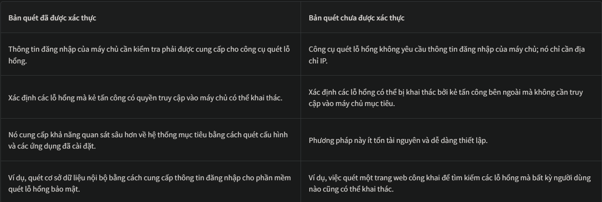

### 2. Quét bên trong so với quét bên ngoài

Quét nội bộ được thực hiện từ bên trong mạng, trong khi quét bên ngoài được thực hiện từ bên ngoài mạng. Hãy cùng xem một vài điểm khác biệt giữa chúng dưới đây.

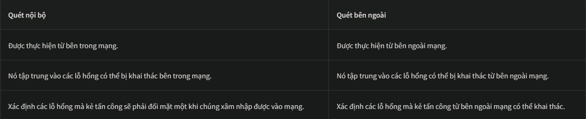

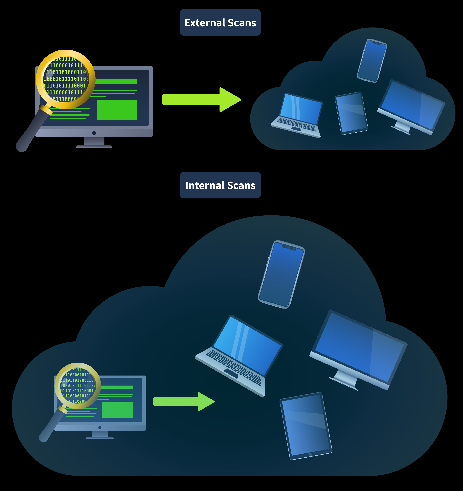

Việc lựa chọn giữa các loại quét lỗ hổng bảo mật phụ thuộc vào nhiều yếu tố. Quét có xác thực thường được sử dụng để quét lỗ hổng bảo mật nội bộ, trong khi quét không xác thực chủ yếu được sử dụng để quét lỗ hổng bảo mật bên ngoài.

## 3. Tools for Vulnerability Scanning
Hiện có rất nhiều công cụ để thực hiện quét lỗ hổng bảo mật tự động, mỗi công cụ đều có những tính năng riêng biệt. Chúng ta hãy cùng thảo luận về một số công cụ quét lỗ hổng bảo mật được sử dụng rộng rãi.

### 1. Nessus
[Nessus](https://www.tenable.com/products/nessus) được phát triển như một dự án mã nguồn mở vào năm 1998. Sau đó, nó được Tenable mua lại vào năm 2005 và trở thành phần mềm độc quyền. Nó có nhiều tùy chọn quét lỗ hổng bảo mật và được sử dụng rộng rãi bởi các doanh nghiệp lớn. Nó có cả phiên bản miễn phí và trả phí. Phiên bản miễn phí cung cấp một số tính năng quét hạn chế. Ngược lại, phiên bản thương mại cung cấp các tính năng quét nâng cao, số lần quét không giới hạn và hỗ trợ chuyên nghiệp. Nessus cần được triển khai và quản lý tại chỗ.


### 2. Qualys
[Qualys](https://qualys.com/) được phát triển vào năm 1999 như một giải pháp quản lý lỗ hổng bảo mật dựa trên đăng ký. Cùng với việc quét lỗ hổng liên tục, nó cung cấp các chức năng kiểm tra tuân thủ và quản lý tài sản. Nó tự động cảnh báo về các lỗ hổng được tìm thấy trong quá trình giám sát liên tục. Điều tuyệt vời nhất về Qualys là nó là một nền tảng dựa trên đám mây, có nghĩa là không có thêm chi phí hoặc công sức để duy trì và quản lý nó trên phần cứng vật lý của chúng ta.


### 3. Nexpose

[Nexpose](https://www.rapid7.com/products/nexpose/) được Rapid7 phát triển vào năm 2005 như một giải pháp quản lý lỗ hổng bảo mật dựa trên đăng ký. Nó liên tục phát hiện các tài sản mới trong mạng và thực hiện quét lỗ hổng trên chúng. Nó đưa ra điểm rủi ro lỗ hổng tùy thuộc vào giá trị tài sản và tác động của lỗ hổng. Nó cũng cung cấp các kiểm tra tuân thủ theo nhiều tiêu chuẩn khác nhau. Nexpose cung cấp cả hai chế độ triển khai tại chỗ và lai (đám mây và tại chỗ).


### 3. OpenVAS (Open Vulnerability Assessment System)
[OpenVAS](https://www.openvas.org/) là một giải pháp đánh giá lỗ hổng bảo mật mã nguồn mở được phát triển bởi Greenbone Security. Nó cung cấp các tính năng cơ bản với các lỗ hổng đã biết được quét thông qua cơ sở dữ liệu của nó. Nó không toàn diện như các công cụ thương mại; tuy nhiên, nó mang lại cho bạn trải nghiệm của một công cụ quét lỗ hổng hoàn chỉnh. Nó hữu ích cho các tổ chức nhỏ và các hệ thống riêng lẻ. Phần tiếp theo sẽ khám phá công cụ này chi tiết hơn bằng cách thực hiện quét lỗ hổng.

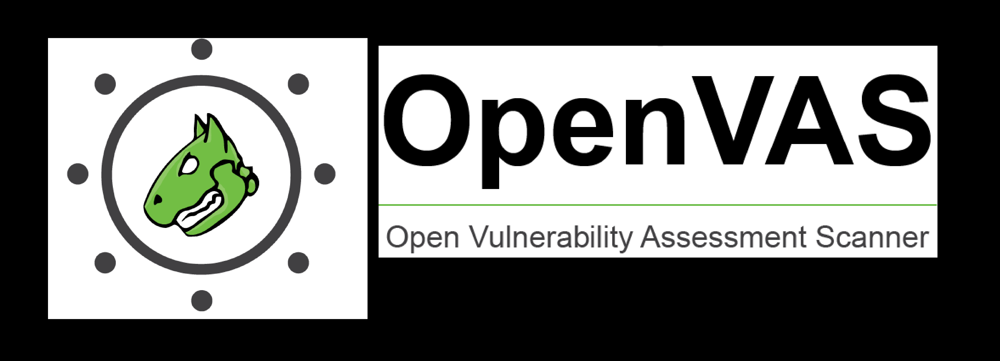

Hầu hết các phần mềm quét lỗ hổng bảo mật đều cung cấp khả năng tạo báo cáo. Chúng tạo ra một báo cáo chi tiết sau mỗi lần quét lỗ hổng. Các báo cáo này bao gồm danh sách các lỗ hổng được phát hiện, điểm rủi ro và mô tả chi tiết. Một số phần mềm quét lỗ hổng bảo mật cung cấp các khả năng báo cáo nâng cao, đưa ra các phương pháp khắc phục cho tất cả các lỗ hổng được phát hiện và cho phép bạn xuất các báo cáo đánh giá lỗ hổng này ở nhiều định dạng khác nhau.

Mỗi công cụ được đề cập ở trên đều có những điểm mạnh riêng. Khi lựa chọn một công cụ quét lỗ hổng bảo mật phù hợp cho tài sản kỹ thuật số của mình, bạn cần xem xét phạm vi, tài nguyên, độ sâu phân tích và các yếu tố khác.

## 4. CVE & CVSS
Hãy tưởng tượng bạn là người đang ngồi ở bàn hỗ trợ kỹ thuật của một văn phòng xử lý khiếu nại CNTT, quản lý nhiều khách hàng. Mỗi ngày bạn phải xử lý hàng trăm khiếu nại liên quan đến sự cố CNTT hoặc nhiều vấn đề khác cần sự hỗ trợ từ công ty. Hãy cùng xem CVE và CVSS giúp bạn theo dõi tất cả các yêu cầu và khiếu nại này như thế nào.

### 1. CVE
`CVE` là viết tắt của **Common Vulnerabilities and Exposures** (Các lỗ hổng và điểm yếu phổ biến). Hãy coi CVE như một mã số duy nhất cho mỗi yêu cầu và khiếu nại của bạn. Nếu có bất kỳ cập nhật nào về vấn đề nào, bạn có thể dễ dàng theo dõi bằng cách sử dụng mã số CVE duy nhất đó . Như trong ví dụ về bộ phận hỗ trợ kỹ thuật, mã số CVE là một mã số duy nhất được gán cho các lỗ hổng bảo mật. Mã số này được phát triển bởi Tập đoàn MITRE . Bất cứ khi nào một lỗ hổng mới được phát hiện trong bất kỳ ứng dụng phần mềm nào, nó sẽ được gán một mã số CVE duy nhất để tham chiếu và được công bố trực tuyến trong cơ sở dữ liệu CVE . Việc công bố này nhằm mục đích giúp mọi người nhận thức được các lỗ hổng này để họ có thể áp dụng các biện pháp bảo vệ nhằm khắc phục chúng. Bạn có thể tìm thấy thông tin chi tiết về bất kỳ lỗ hổng nào đã được phát hiện trước đó trong cơ sở dữ liệu CVE . Một ví dụ về mã số CVE được gán cho một lỗ hổng có thể được thấy trong hình bên dưới:

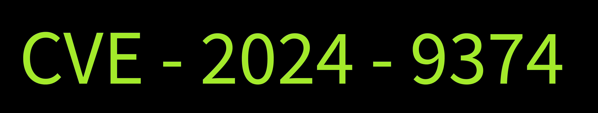

- **Tiền tố CVE** : Mỗi mã số CVE đều có tiền tố “ CVE ” ở đầu.
- **Năm**: Phần thứ hai của mỗi mã CVE chứa năm phát hiện ra lỗ hổng (ví dụ: 2024).
- **Chữ số ngẫu nhiên**: Phần cuối của mã số CVE chứa bốn hoặc nhiều chữ số ngẫu nhiên (ví dụ: `9374`)

### 2. CVSS
`CVSS` là viết tắt của **Common Vulnerability Scoring System** (Hệ thống chấm điểm lỗ hổng phổ biến). Quay lại ví dụ về bộ phận hỗ trợ kỹ thuật, bạn luôn cần phải ưu tiên các khiếu nại. Cách hiệu quả nhất để ưu tiên các khiếu nại là dựa trên mức độ nghiêm trọng của chúng. Điều gì sẽ xảy ra nếu tất cả các khiếu nại của bạn được ghi nhận với điểm số từ 0 đến 10, trong đó điểm số càng cao thì khiếu nại càng nghiêm trọng? Điều này sẽ giải quyết được vấn đề ưu tiên các khiếu nại quan trọng. Đây được gọi là điểm CVSS . Trong thế giới máy tính, cũng giống như mỗi lỗ hổng có một mã số CVE duy nhất để nhận dạng nó, mỗi lỗ hổng cũng có một điểm CVSS cho biết mức độ nghiêm trọng của nó. Điểm CVSS được tính toán bằng cách xem xét nhiều yếu tố, bao gồm tác động, mức độ dễ khai thác, v.v. Mức độ nghiêm trọng theo điểm CVSS có thể được thấy trong bảng dưới đây:

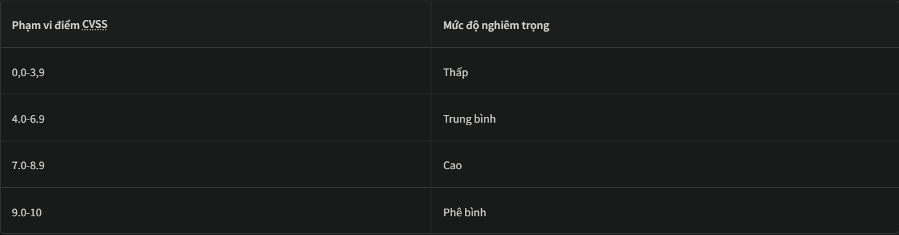

## 5. OpenVAS
Như đã thảo luận trong Nhiệm vụ số 3, OpenVAS là một công cụ quét lỗ hổng bảo mật mã nguồn mở hoàn chỉnh. Trong nhiệm vụ này, chúng ta sẽ xem cách thực hiện quét lỗ hổng bảo mật bằng công cụ quét OpenVAS.

### 1. Setup
Chúng ta sẽ cài đặt OpenVAS trên máy Ubuntu. Việc cài đặt OpenVAS có thể khá phức tạp vì nó có nhiều phụ thuộc. Chúng ta sẽ sử dụng Docker để cài đặt OpenVAS. Docker là một nền tảng giúp bạn tạo và phân phối các gói ứng dụng khác nhau. Các gói này được gọi là container. Một container của ứng dụng đã có sẵn tất cả các phụ thuộc được cài đặt bên trong, vì vậy chúng ta không cần phải mất thêm thời gian để cài đặt các phụ thuộc của ứng dụng. Để thuận tiện cho bạn, chúng tôi đã cài đặt sẵn công cụ OpenVAS trên máy được cung cấp cho bài tập thực hành trong nhiệm vụ tiếp theo. Tuy nhiên, chỉ để bạn tham khảo, các bước cài đặt được nêu dưới đây:

```
sudo apt install docker.io
```

Sau khi cài đặt Docker trên máy tính, chúng ta có thể tiến hành cài đặt OpenVAS trong một container Docker. Để đơn giản, chúng ta sẽ sử dụng ảnh Docker do [Immauss](https://immauss.github.io/openvas/) cung cấp vì nó chứa mọi thứ trong một ảnh Docker duy nhất. Điều này là đủ cho bài thực hành của chúng ta. Chúng ta sẽ chạy lệnh sau để cài đặt container OpenVAS với tất cả các phụ thuộc đã được cài đặt:

```
sudo docker run -d -p 443:443 --name openvas immauss/openvas
```

### 2. Truy cập OpenVAS
Sau khi hoàn tất quá trình cài đặt như đã nêu ở trên, bạn có thể truy cập giao diện web OpenVAS bằng cách mở bất kỳ trình duyệt nào và nhập địa chỉ sau vào thanh địa chỉ: `https://127.0.0.1`

Thao tác này sẽ đưa bạn đến trang đăng nhập của OpenVAS.  Sau khi nhập thông tin đăng nhập chính xác, bảng điều khiển sau sẽ mở ra. Bảng điều khiển này cung cấp tổng quan toàn diện về tất cả các lần quét lỗ hổng bảo mật của bạn:

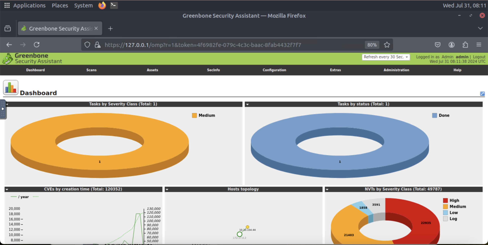

### 3. Thực hiện quét lỗ hổng bảo mật
Bây giờ, chúng ta sẽ tiến hành quét lỗ hổng bảo mật trên một máy. Bước đầu tiên là tạo một tác vụ trong bảng điều khiển OpenVAS. Chúng ta sẽ điền đầy đủ thông tin chi tiết cho tác vụ này và thực thi nó để chạy quá trình quét lỗ hổng bảo mật.

Nhấp vào tùy chọn `Task` nằm trong mục `Scan` hiển thị trên bảng điều khiển:

Bạn sẽ đến trang hiển thị tất cả các tác vụ đang chạy. Chúng ta sẽ không thấy bất kỳ tác vụ nào trên trang này vì chúng ta chưa thực hiện bất kỳ lần quét nào. Để tạo tác vụ, hãy nhấp vào biểu tượng ngôi sao và sau đó chọn tùy chọn `New Task` như được đánh dấu trong ảnh chụp màn hình:

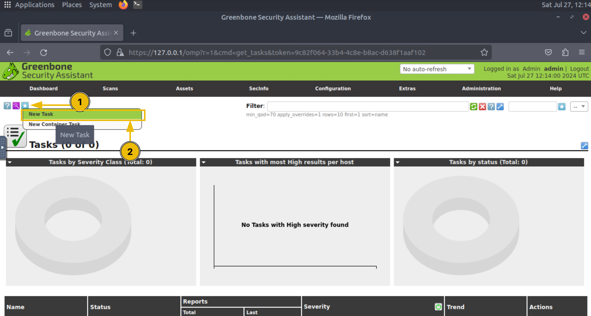

Nhập tên tác vụ và nhấp vào tùy chọn `Scan Targets` như được đánh dấu trong ảnh chụp màn hình:

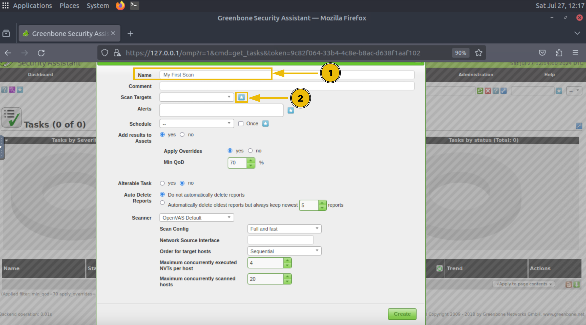

Nhập tên máy mục tiêu và địa chỉ IP của nó, rồi nhấn `Create`:
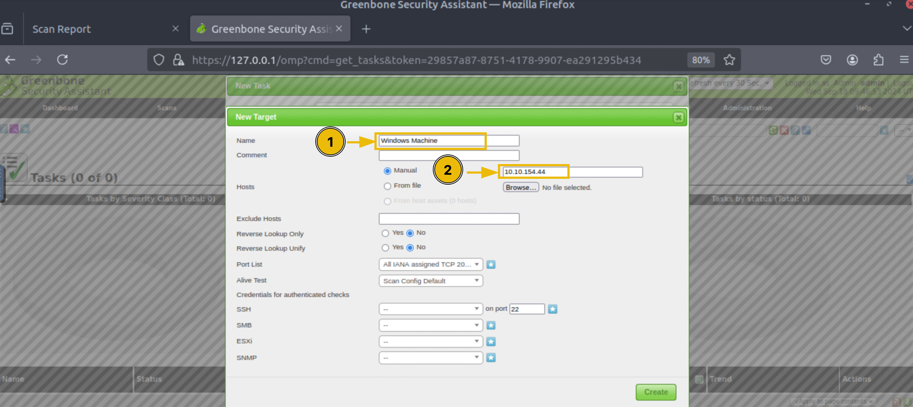

Bạn sẽ có nhiều tùy chọn quét khác nhau. Mỗi tùy chọn quét có phạm vi quét riêng; bạn có thể xem chi tiết từng loại quét và chọn loại phù hợp, sau đó nhấp vào nút `Create`:

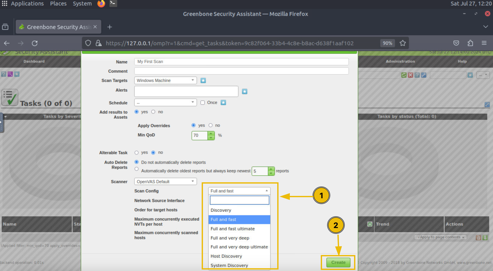

Nhiệm vụ đã được tạo và sẽ hiển thị cho bạn trên bảng điều khiển Nhiệm vụ. Để bắt đầu quét, hãy nhấp vào nút phát trong tùy chọn `Actions` của nhiệm vụ:

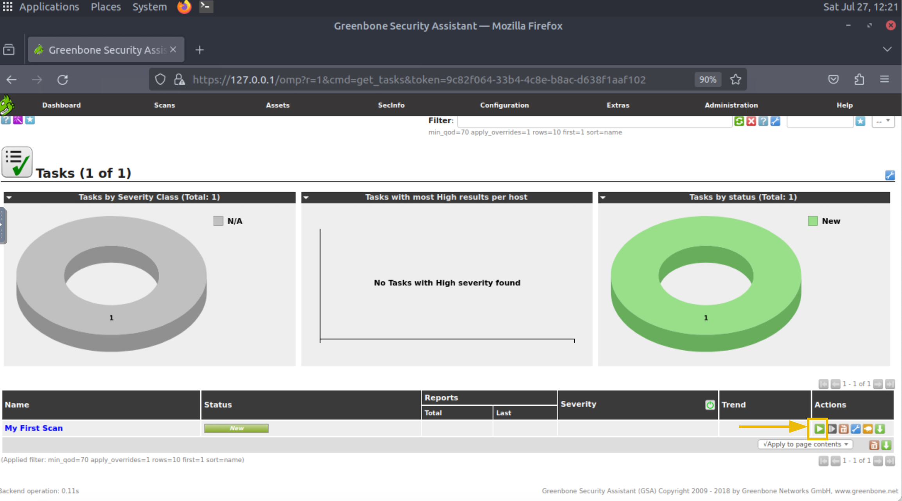

Quá trình quét sẽ mất vài phút để hoàn tất. Sau khi quét xong, bạn sẽ thấy trạng thái được đánh dấu là `Done`. Các hình ảnh trực quan trong bảng điều khiển Tác vụ sẽ hiển thị một số con số cho biết mức độ nghiêm trọng của các lỗ hổng được tìm thấy. Để xem chi tiết quá trình quét, bạn cần nhấp vào tên tác vụ:

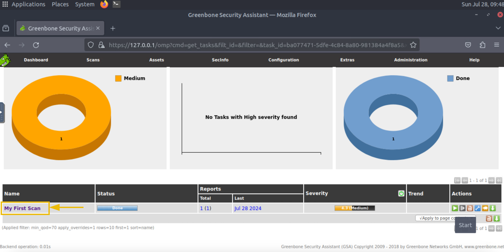

Để xem chi tiết tất cả các lỗ hổng được phát hiện trong quá trình quét, bạn có thể nhấp vào con số hiển thị số lượng lỗ hổng được tìm thấy trên máy chủ cần quét:

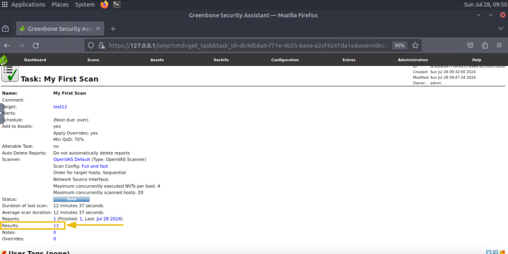

Giờ đây, chúng ta đã có danh sách tất cả các lỗ hổng được tìm thấy trong máy này và mức độ nghiêm trọng của chúng. Chúng ta cũng có thể nhấp vào bất kỳ lỗ hổng nào để xem thêm chi tiết:

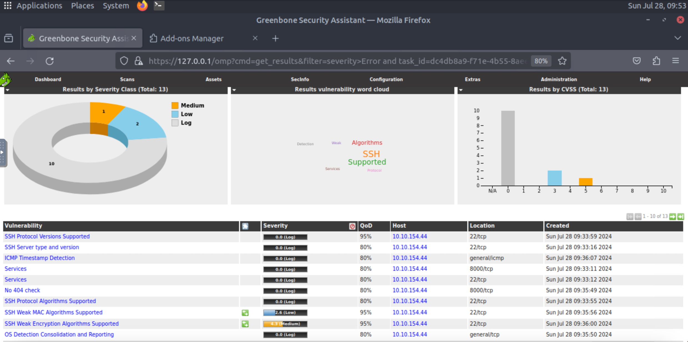

Giống như các phần mềm quét lỗ hổng bảo mật khác, OpenVAS cho phép chúng ta xuất các kết quả này dưới dạng báo cáo. Bạn có thể truy xuất báo cáo ở bất kỳ định dạng nào từ bảng điều khiển Tác vụ.

## 5. LAB
Tình huống: Một công ty uy tín đã tiến hành quét lỗ hổng bảo mật trên máy chủ (10.49.150.164) trong mạng lưới của họ, nơi lưu trữ thông tin quan trọng. Hoạt động này nhằm mục đích tăng cường khả năng bảo mật của tổ chức. Nhóm bảo mật đã thực hiện hoạt động này bằng cách sử dụng công cụ quét lỗ hổng OpenVAS, và báo cáo quét lỗ hổng đã được đặt trên màn hình máy tính. Bạn là một kỹ sư bảo mật thông tin làm việc cho công ty đó. Nhiệm vụ của bạn là xem xét báo cáo này. Bạn có thể chỉ cần mở báo cáo trên màn hình hoặc thực hiện lại quá trình quét lỗ hổng để trả lời các câu hỏi bên dưới. OpenVAS đã được cài đặt sẵn trên máy chủ mà bạn được cấp quyền truy cập.

Sau khi máy ảo khởi động, nếu bạn muốn tự thực hiện quét lỗ hổng bảo mật thay vì phân tích báo cáo quét, bạn cần khởi động container Docker của OpenVAS để truy cập. Bạn có thể thực hiện điều này bằng cách chạy lệnh sau với quyền root:

```
root@tryhackme$ docker start openvas
```

Sau khi Docker khởi động, bạn có thể truy cập OpenVAS bằng cách nhập URL sau vào trình duyệt:

`https://127.0.0.1/login/login.html`

Thông tin đăng nhập mặc định của công cụ được nêu bên dưới:

`Username: admin`

`Password: admin`

*Lưu ý: Quá trình quét có thể diễn ra chậm.*

*Điểm số của lỗ hổng bảo mật nghiêm trọng duy nhất được tìm thấy trong quá trình quét là bao nhiêu?*

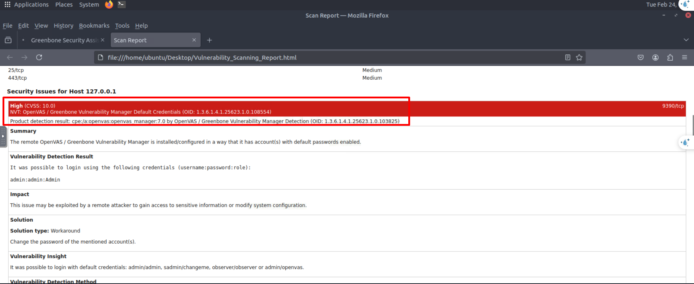

`10.0`

*OpenVAS đề xuất giải pháp nào cho lỗ hổng này?*

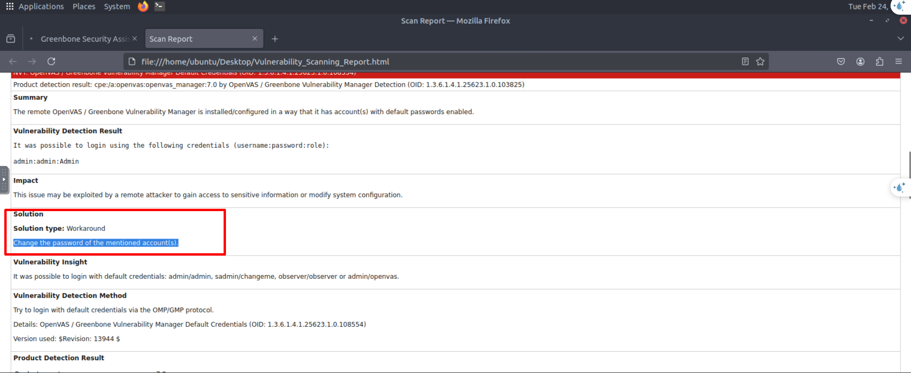

`Change the password of the mentioned account(s).`