# JavaScript Essentials
## 1. Introduction
JavaScript (JS) là một ngôn ngữ lập trình kịch bản phổ biến cho phép các nhà phát triển web thêm các tính năng tương tác vào các trang web chứa HTML và CSS (kiểu dáng). Sau khi các phần tử HTML được tạo, bạn có thể thêm các tính năng tương tác như xác thực, hành động khi nhấp chuột, hoạt ảnh, v.v., thông qua JS. Học ngôn ngữ này cũng quan trọng như học HTML và CSS. Các đoạn mã JS chủ yếu được sử dụng với HTML.

Phòng học này được thiết kế như một khóa học tổng quan giới thiệu về JavaScript, đặc biệt dành cho người mới bắt đầu với kinh nghiệm JavaScript hạn chế. Trọng tâm chính là giảng dạy các nguyên tắc cơ bản của JavaScript từ góc độ an ninh mạng và cách tin tặc lợi dụng các chức năng hợp pháp để đạt được mục đích xấu.

### Mục tiêu học tập

- Nắm vững kiến ​​thức cơ bản về JavaScript.
- Tích hợp JavaScript vào HTML
- Lạm dụng chức năng hội thoại
- Bỏ qua các câu lệnh điều khiển luồng
- Khám phá các tệp tin được thu nhỏ

## 2. Essential Concepts(_Khái niệm_)
### 1. Biến
Biến là các vùng chứa cho phép bạn lưu trữ các giá trị dữ liệu trong đó. Giống như bất kỳ ngôn ngữ nào khác, biến trong JavaScript cũng tương tự như các vùng chứa để lưu trữ dữ liệu. Khi bạn lưu trữ thứ gì đó trong một cái xô, bạn cũng cần phải gắn nhãn cho nó để có thể dễ dàng tham chiếu lại sau này. Tương tự, trong JavaScript, mỗi biến đều có một tên; khi chúng ta lưu trữ một giá trị nhất định trong một biến, chúng ta gán cho nó một tên để tham chiếu lại sau này.Có 3 cách để khai báo biến trong JavaScript: `var`, `let`, `const`. Trong khi `var` có phạm vi hàm, cả `let`, `const` đều có phạm vi khối, cho phép kiểm soát tốt hơn khả năng hiển thị của biến trong các khối mã cụ thể.

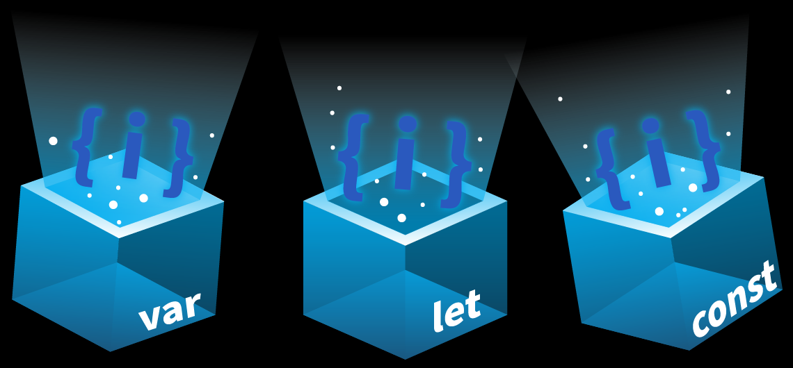

### 2. Các kiểu dữ liệu
Trong JavaScript, kiểu dữ liệu xác định loại giá trị mà một biến có thể chứa. Ví dụ bao gồm `string`(văn bản), `number`, `boolean`(đúng/sai), `null`, `undefined` và `object` (dành cho dữ liệu phức tạp hơn như mảng hoặc đối tượng).

### 3. Chức năng
Hàm là một khối mã được thiết kế để thực hiện một nhiệm vụ cụ thể. Bên trong một hàm, bạn nhóm các đoạn mã cần thực hiện cùng một nhiệm vụ. Ví dụ, bạn đang phát triển một ứng dụng web mà bạn cần in kết quả học sinh lên trang web. Trường hợp lý tưởng là tạo một hàm `PrintResult(rollNum)` nhận số báo danh của người dùng làm đối số.

Vì vậy, thay vì viết cùng một đoạn mã in cho tất cả học sinh, chúng ta sẽ sử dụng một hàm đơn giản để in kết quả.

### 4. Vòng lặp
Vòng lặp cho phép bạn chạy một khối mã nhiều lần miễn là điều kiện được thỏa mãn **true**. Các vòng lặp phổ biến trong JavaScript là `while`, `for` , `do...while`, được sử dụng để lặp lại các tác vụ, chẳng hạn như duyệt qua một danh sách các mục. Ví dụ, nếu chúng ta muốn in kết quả của 100 học sinh, chúng ta có thể gọi hàm `PrintResult(rollNum)` 100 lần bằng cách viết nó 100 lần, hoặc chúng ta có thể tạo một vòng lặp sẽ lặp qua từ 1 đến 100 và sẽ gọi hàm `PrintResult(rollNum)` như được hiển thị bên dưới.
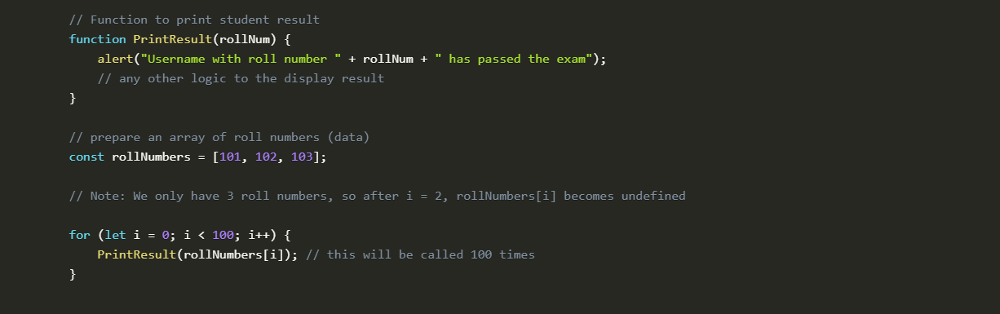

## 3. JavaScript Overview(_Tổng quan_)
Trong bài tập này, chúng ta sẽ sử dụng JavaScript để tạo chương trình đầu tiên. JavaScript là một ngôn ngữ **thông dịch** , nghĩa là mã được thực thi trực tiếp trong trình duyệt mà không cần biên dịch trước. Dưới đây là một đoạn mã JavaScript mẫu minh họa các khái niệm chính, chẳng hạn như **định nghĩa biến** , **hiểu về kiểu dữ liệu** , **sử dụng câu lệnh điều khiển luồng** và viết các hàm đơn giản. Những khối xây dựng thiết yếu này giúp tạo ra các ứng dụng web năng động và tương tác hơn. Đừng lo lắng nếu nó trông có vẻ hơi mới mẻ - chúng ta sẽ thảo luận chi tiết từng khái niệm này sau
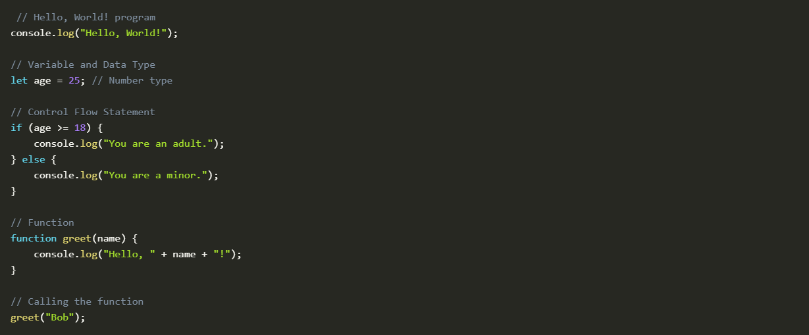

JavaScript chủ yếu được thực thi ở phía máy khách, điều này giúp dễ dàng kiểm tra và tương tác với HTML trực tiếp trong trình duyệt. Chúng ta sẽ sử dụng `Google Chrome Console` tính năng này để chạy chương trình JavaScript đầu tiên, cho phép chúng ta viết và thực thi mã JavaScript một cách dễ dàng mà không cần công cụ bổ sung. Hãy làm theo các bước sau để bắt đầu:
- Mở `Google Chrome` bằng cách nhấp vào biểu tượng `Google Chrome` trên màn hình Desktop của máy ảo.

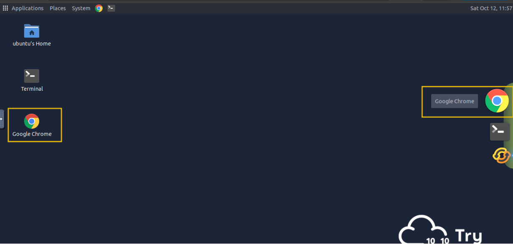

- Sau khi mở Chrome, nhấn `Ctrl + Shift + I` để mở `Console` hoặc nhấp chuột phải vào bất kỳ đâu trên trang và chọn `Inspect`.

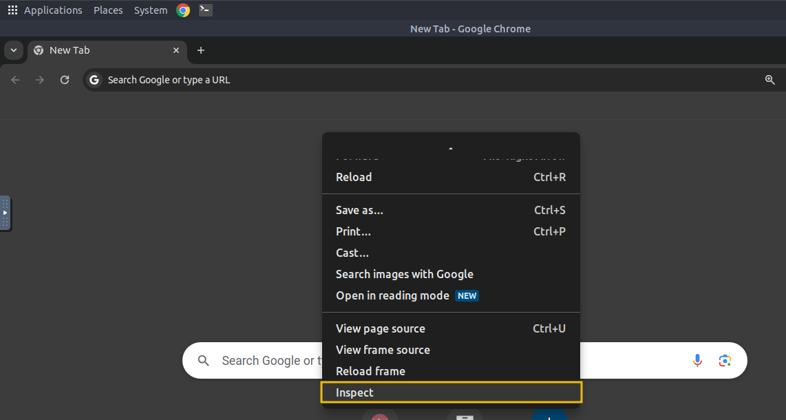

- Sau đó, nhấp vào `Console` tab. Bảng điều khiển này cho phép bạn chạy mã JS trực tiếp trong trình duyệt mà không cần cài đặt thêm phần mềm.

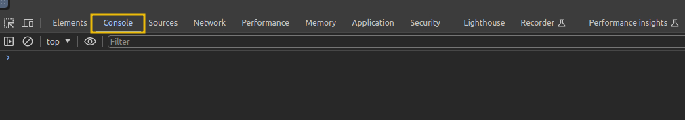

- Hãy cùng tạo một chương trình JavaScript đơn giản để cộng hai số và hiển thị kết quả. Dưới đây là đoạn mã:

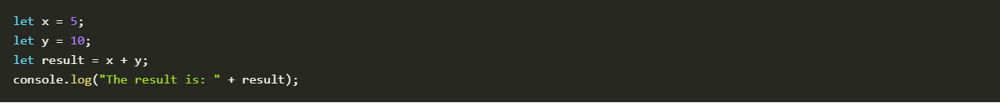

- Trong đoạn mã trên, `x` và `y` là các biến lưu trữ các số. `x + y`  một biểu thức cộng hai số lại với nhau, trong khi `console.log`  là một hàm được sử dụng để in kết quả ra màn hình console.\
Sao chép đoạn mã trên và dán vào bảng điều khiển bằng cách nhấn phím `Ctrl + V`. Sau khi dán, nhấn phím `Enter`. Bạn sẽ thấy kết quả hiển thị như sau

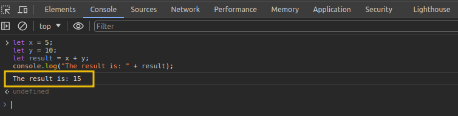

## 4. Integrating JavaScript in HTML(_Tich hợp JS vào HTML_)
Nhiệm vụ này giả định bạn có hiểu biết cơ bản về HTML và cấu trúc của nó. Phần này sẽ khám phá cách tích hợp JavaScript vào HTML. Thông thường, JavaScript không được sử dụng để hiển thị nội dung; nó hoạt động cùng với HTML và CSS để tạo ra các trang web động và tương tác. Có hai cách chính để tích hợp JavaScript vào HTML: nội bộ và bên ngoài.

### 1. Internal JS
JavaScript nội tuyến (Internal JS) đề cập đến việc nhúng mã JavaScript trực tiếp vào bên trong tài liệu HTML. Phương pháp này được ưa chuộng cho người mới bắt đầu vì nó cho phép họ thấy cách mã tương tác với HTML. Mã được chèn giữa các thẻ `<script>`. Các thẻ này có thể được đặt bên trong `<head>`, thường được sử dụng cho các mã cần được tải trước khi nội dung trang được hiển thị, hoặc bên trong `<body>`, nơi mã có thể được sử dụng để tương tác với các phần tử khi chúng được tải trên trang web.

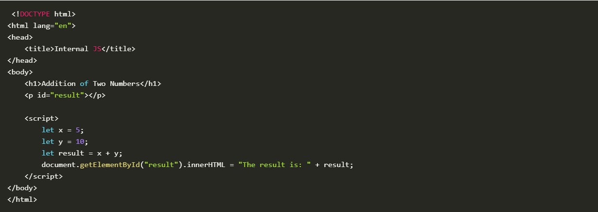

Trong tài liệu HTML này, chúng ta đang sử dụng JavaScript nội bộ, nghĩa là mã được đặt trực tiếp bên trong tệp HTML trong thẻ `<script>` . Đoạn mã thực hiện một nhiệm vụ đơn giản: cộng hai số (`x` và `y`) và sau đó hiển thị kết quả trên trang web. JavaScript tương tác với HTML bằng cách chọn một phần tử `
` với **id="result"**  và cập nhật nội dung của nó bằng cách sử dụng `document.getElementById("result").innerHTML <script>`. Đoạn mã JavaScript nội bộ này được thực thi khi trình duyệt tải tệp HTML.

### 2. External JS
JavaScript bên ngoài (**External JS**) là việc tạo và lưu trữ mã JavaScript trong một tệp riêng biệt có phần mở rộng `.js`. Phương pháp này giúp các nhà phát triển giữ cho tài liệu HTML sạch sẽ và có tổ chức. Tệp JavaScript bên ngoài có thể được lưu trữ trên cùng máy chủ web với tài liệu HTML hoặc được lưu trữ trên một máy chủ web bên ngoài, chẳng hạn như trên đám mây.

Chúng ta sẽ sử dụng ví dụ tương tự cho JavaScript bên ngoài nhưng tách mã JavaScript đó ra thành một tệp riêng.

Đầu tiên, hãy tạo một tệp mới có tên `script.js` và lưu nó vào thư mục Desktop với đoạn mã sau:

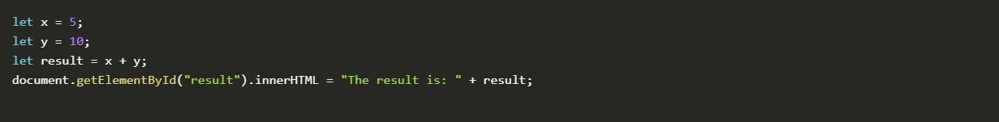

Tiếp theo, tạo một tệp mới có tên `external.html` và dán đoạn mã sau vào đó (lưu ý rằng mã HTML giống với ví dụ trước):

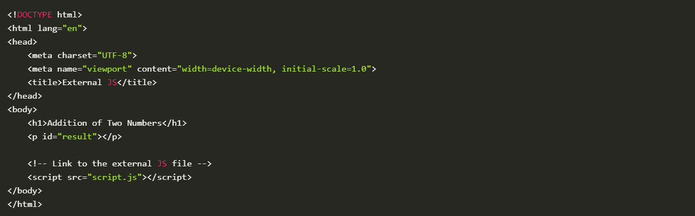

Bây giờ, hãy nhấp đúp vào tệp external.html và kiểm tra kết quả. Bạn có thấy sự khác biệt nào không? Không, kết quả vẫn giống như ví dụ trước.

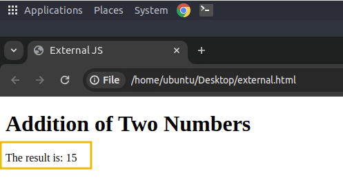

Điều chúng tôi làm khác biệt là sử dụng thuộc tính `src` trong thẻ `<script>` để tải mã JavaScript từ một tệp bên ngoài. Khi trình duyệt tải trang, nó sẽ tìm `script.js` và tải nội dung của nó vào tài liệu HTML. Cách tiếp cận này cho phép chúng ta tách biệt mã JavaScript khỏi HTML, giúp mã được tổ chức tốt hơn và dễ bảo trì hơn, đặc biệt là khi làm việc với các dự án lớn.

### 3. Xác minh JavaScript Internal hoặc External
Khi kiểm thử bảo mật một ứng dụng web, điều quan trọng là phải kiểm tra xem trang web đó có sử dụng JavaScript nội bộ hay bên ngoài. Điều này có thể dễ dàng được xác minh bằng cách xem mã nguồn của trang. Để làm điều này, hãy mở trang `external_test.html` nằm trong `exercise` thư mục `Chrome`, nhấp chuột phải vào bất kỳ đâu trên trang và chọn `View Page Source`.

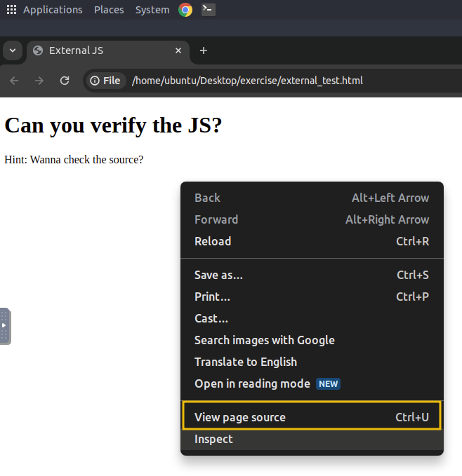

Thao tác này sẽ hiển thị mã HTML của trang đã được render. Bên trong mã nguồn, bất kỳ mã JavaScript nào được viết trực tiếp trên trang sẽ xuất hiện giữa các thẻ `<script>` mà không có thuộc tính `src`. Nếu bạn thấy một thẻ `<script>` có thuộc tính `src` , điều đó cho thấy trang đang tải mã JavaScript external từ một tệp riêng biệt.

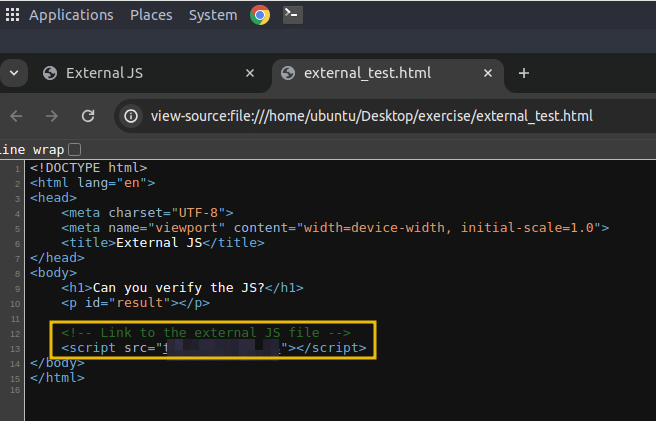

## 5. Abusing Dialogue Functions(_Lợi dụng các hàm hội thoại_)
Một trong những mục tiêu chính của JavaScript là cung cấp các hộp thoại để tương tác với người dùng và cập nhật nội dung động trên các trang web. JavaScript cung cấp các hàm tích hợp sẵn như `alert`, `prompt`, và `confirm` để tạo điều kiện thuận lợi cho sự tương tác này. Các hàm này cho phép các nhà phát triển hiển thị thông báo, thu thập thông tin đầu vào và nhận xác nhận từ người dùng. Tuy nhiên, nếu không được triển khai một cách an toàn, kẻ tấn công có thể khai thác các tính năng này để thực hiện các cuộc tấn công như Cross-Site Scripting (XSS), mà bạn sẽ tìm hiểu sau trong mô-đun này.

Chúng ta sẽ sử dụng chúng  `Google Chrome console` trong các bài tập sắp tới.

### 1. alert
Chức năng cảnh báo hiển thị một thông báo trong hộp thoại với nút `OK`, thường được sử dụng để truyền đạt thông tin hoặc cảnh báo cho người dùng. Ví dụ, nếu chúng ta muốn hiển thị _" Hello THM"_ cho người dùng, chúng ta sẽ sử dụng nút  `alert("HelloTHM")`;. Để thử, hãy mở bảng điều khiển Chrome, nhập `alert("Hello THM")`, và nhấn Enter. Một hộp thoại với thông báo sẽ xuất hiện trên màn hình.

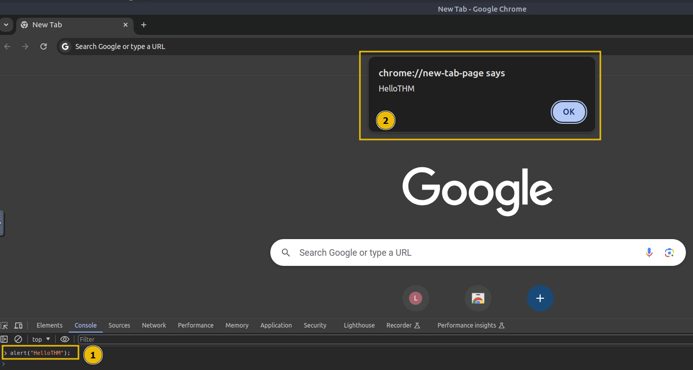

### 2. promt
Hàm `prompt` hiển thị một hộp thoại yêu cầu người dùng nhập liệu. Nó trả về giá trị đã nhập khi người dùng nhấp vào "OK", hoặc trả về null nếu người dùng nhấp vào "Cancel". Ví dụ, để hỏi người dùng tên của họ, chúng ta sẽ sử dụng `prompt("What is your name?")`;.

Để kiểm tra điều này, hãy mở bảng điều khiển Chrome và dán đoạn mã sau, đoạn mã này sẽ yêu cầu người dùng nhập tên đăng nhập rồi gửi lời chào.

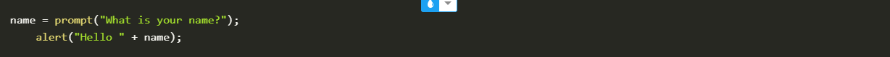

Sau khi bạn dán mã và nhấn Enter, một hộp thoại sẽ hiện ra và giá trị do người dùng nhập sẽ được trả về bảng điều khiển. 

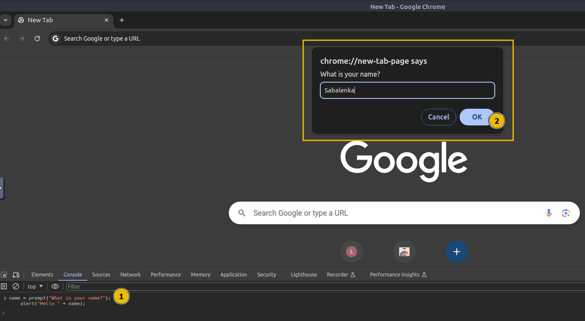

### 3. confirm
Hàm xác nhận hiển thị một hộp thoại với thông báo và hai nút: "OK" và "Cancel". Hàm trả về true nếu người dùng nhấp vào "OK" và false nếu người dùng nhấp vào "Cancel". Ví dụ, để yêu cầu người dùng xác nhận, chúng ta sẽ sử dụng `confirm("Are you sure?");`. Để thử điều này, hãy mở bảng điều khiển Chrome, nhập `confirm("Do you want to proceed?")`, và nhấn Enter.

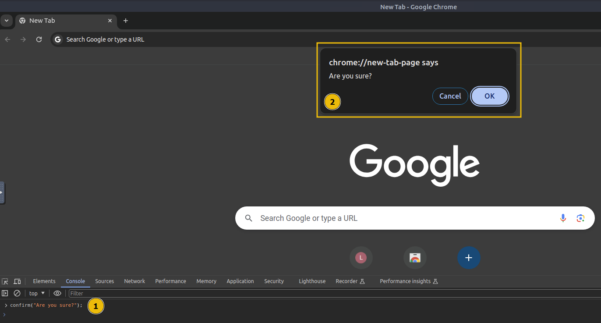

### 4. Cách kẻ tấn công có thể khai thác
Hãy tưởng tượng bạn nhận được một email từ người lạ kèm theo một tệp HTML. Tệp này trông có vẻ vô hại, nhưng khi bạn mở nó ra, nó chứa mã JavaScript làm gián đoạn trải nghiệm duyệt web của bạn. Ví dụ, đoạn mã sau sẽ hiển thị hộp thoại cảnh báo với thông báo "Đã bị hack " 3 lần:

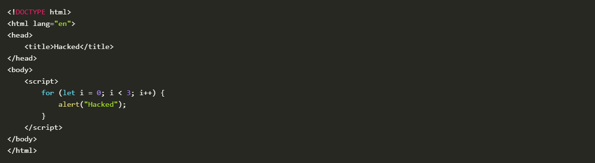

Trên màn hình Desktop của máy ảo được gắn kèm, hãy tạo một tệp có tên `invoice.html` và dán đoạn mã trên vào đó. Nhấp đúp vào tệp để mở, và thông báo lỗi sẽ hiện lên ba lần, gây ra trải nghiệm không mong muốn.

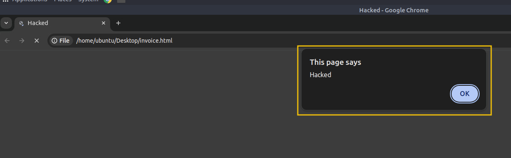

Hãy tưởng tượng nếu một kẻ xấu gửi cho bạn một tập tin tương tự, nhưng thay vì hiển thị cảnh báo ba lần, số lần hiển thị lại được đặt thành `500`. Bạn sẽ buộc phải liên tục đóng các hộp thoại cảnh báo này đến hộp thoại khác. Đây là một ví dụ đơn giản về cách mã JavaScript độc hại có thể được sử dụng để gây ra sự bất tiện hoặc thậm chí tệ hơn. Do đó, việc đảm bảo bạn chỉ thực thi các tập tin JavaScript từ các nguồn đáng tin cậy là rất quan trọng để tránh những trải nghiệm không mong muốn như vậy.

## 6. Bypassing Control Flow Statements(_Bỏ qua các câu lệnh luồng điều khiển_)
Luồng điều khiển trong JavaScript đề cập đến thứ tự thực thi các câu lệnh và khối mã dựa trên các điều kiện nhất định. JavaScript cung cấp một số cấu trúc luồng điều khiển như câu lệnh điều kiện (require), `if-else` câu lệnh điều khiển `switch` để đưa ra quyết định, và các vòng lặp như `for`, `while` và ` do...while` để lặp lại các hành động. Sử dụng luồng điều khiển đúng cách đảm bảo rằng chương trình có thể xử lý hiệu quả các điều kiện khác nhau.
### 1. Câu điều kiện trong thực tiễn
Một trong những câu lệnh điều kiện được sử dụng nhiều nhất là câu `if-else` lệnh điều kiện (request), cho phép bạn thực thi các khối mã khác nhau tùy thuộc vào việc điều kiện đó đúng `true` hay sai `false`.

Để kiểm tra điều này trên thực tế, hãy tạo một tệp `age.html` trên màn hình Desktop của máy ảo được gắn kèm và dán đoạn mã sau:

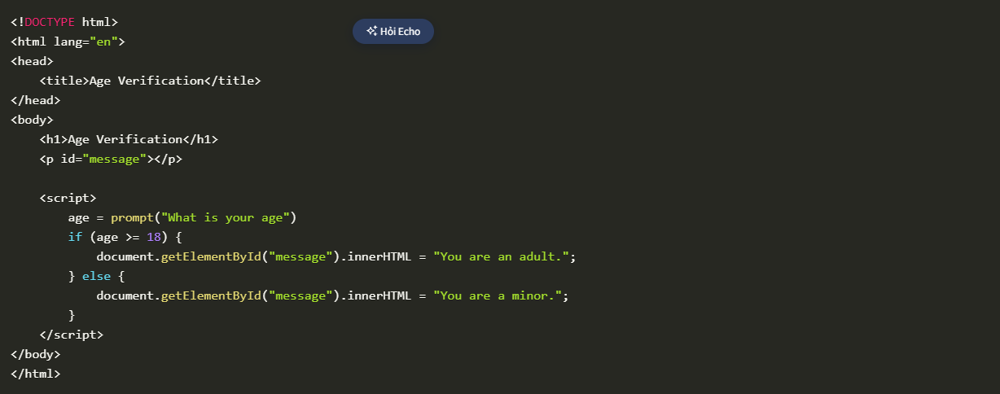

Nhấp đúp vào tệp để mở bằng Google Chrome. Bạn sẽ thấy hình ảnh sau:

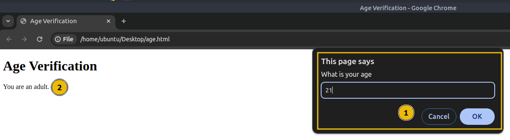

Trong đoạn mã trên, một lời nhắc sẽ hỏi tuổi của bạn. Nếu tuổi của bạn lớn hơn hoặc bằng 18, nó sẽ hiển thị một thông báo có nội dung "You are an adult.". Ngược lại, nó sẽ hiển thị một thông báo khác. Hành vi này được điều khiển bởi câu lệnh **if-else**, kiểm tra giá trị của biến tuổi và hiển thị thông báo thích hợp dựa trên điều kiện.

### 2. Bypassing Login Forms
Giả sử một lập trình viên đã triển khai chức năng xác thực trong JavaScript, trong đó chỉ những người dùng có tên người dùng "admin" và mật khẩu khớp với một giá trị cụ thể mới được phép đăng nhập. Để xem điều này hoạt động như thế nào, hãy mở `login.html`

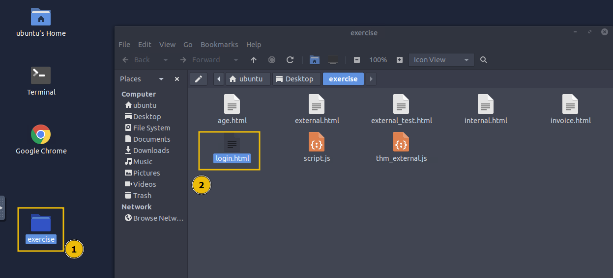

Khi bạn nhấp đúp vào tệp và mở nó trong trình duyệt, hệ thống sẽ yêu cầu bạn nhập tên người dùng và mật khẩu. Nếu nhập đúng thông tin đăng nhập, hệ thống sẽ hiển thị thông báo xác nhận bạn đã đăng nhập thành công, như hình bên dưới:

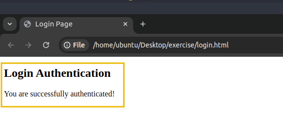

## 7. Exploring Minified Files(_Khám phá các tệp tin đã được nén_)
Cho đến nay, chúng ta đã hiểu cách JavaScript hoạt động và cách đọc mã nguồn của nó, nhưng điều gì sẽ xảy ra nếu tệp tin đó không thể đọc được bằng mắt thường và đã được thu nhỏ lại ?

Thu nhỏ mã JavaScript là quá trình nén các tệp JavaScript bằng cách loại bỏ tất cả các ký tự không cần thiết, chẳng hạn như khoảng trắng, xuống dòng, chú thích và thậm chí cả việc rút ngắn tên biến. Điều này giúp giảm kích thước tệp và cải thiện thời gian tải trang web, đặc biệt là trong môi trường sản xuất. Các tệp đã được thu nhỏ làm cho mã ngắn gọn hơn và khó đọc hơn đối với con người, nhưng chúng vẫn hoạt động chính xác như cũ.

Tương tự, việc **làm rối mã nguồn** thường được sử dụng để khiến JavaScript khó hiểu hơn bằng cách thêm mã không mong muốn, đổi tên biến và hàm thành những tên vô nghĩa, và thậm chí chèn mã giả.

### 1. Ví dụ thực tế
Tạo một tệp trên màn hình Desktop của máy ảo được gắn kèm với tên `hello.html` và dán đoạn mã HTML sau:

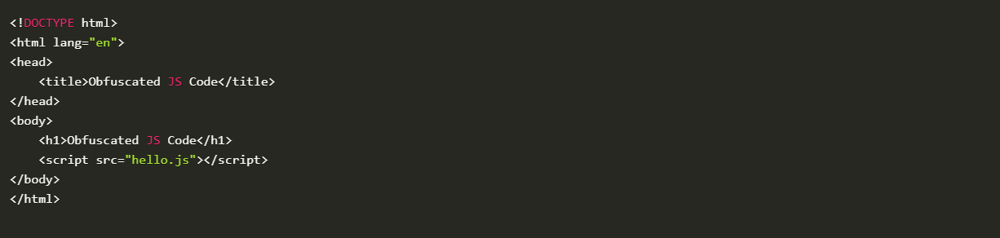

Tiếp theo, tạo một tệp khác với tên đó `hello.js` và thêm đoạn mã sau:

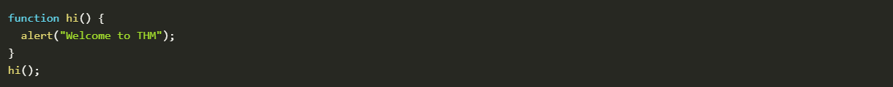

Bây giờ, hãy nhấp đúp vào `hello.html` để mở nó trong Google Chrome. Sau khi tệp được mở, bạn sẽ thấy một thông báo chào mừng với nội dung " Welcome to THM".

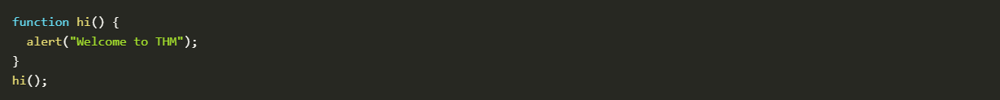

Nhấp chuột `OK` để đóng hộp thoại cảnh báo. Nhấp chuột phải vào bất kỳ đâu trên trang và nhấp vào `Inspect` để mở công cụ dành cho nhà phát triển. Trong công cụ dành cho nhà phát triển, điều hướng đến `Sources` và nhấp vào `hello.js` tệp để xem mã nguồn. Bạn sẽ thấy rằng mã JS dễ dàng truy cập và xem được, như hình bên dưới:

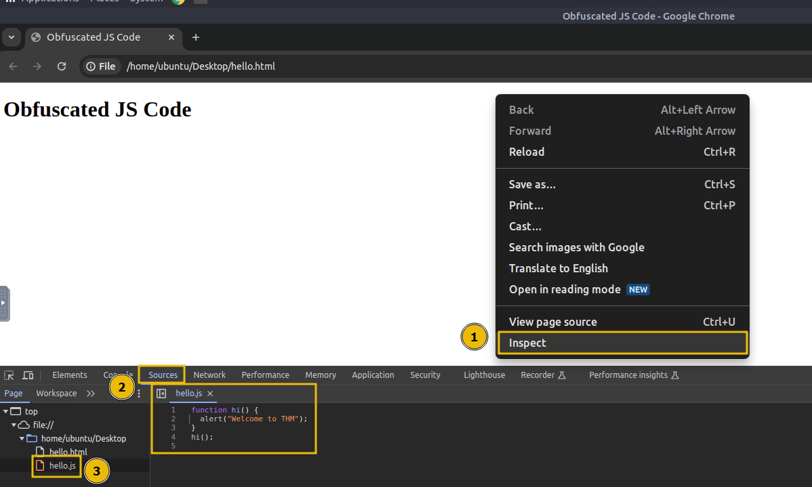

### 2. Obfuscation trong thực tế
Bây giờ, chúng ta sẽ thử thu nhỏ và làm xáo trộn mã JavaScript bằng một công cụ trực tuyến. Hãy truy cập trang web và sao chép nội dung của `hello.js`, rồi dán vào hộp thoại trên trang web. Công cụ sẽ "nén" và làm xáo trộn mã, biến nó thành một chuỗi ký tự vô nghĩa như hình bên dưới:

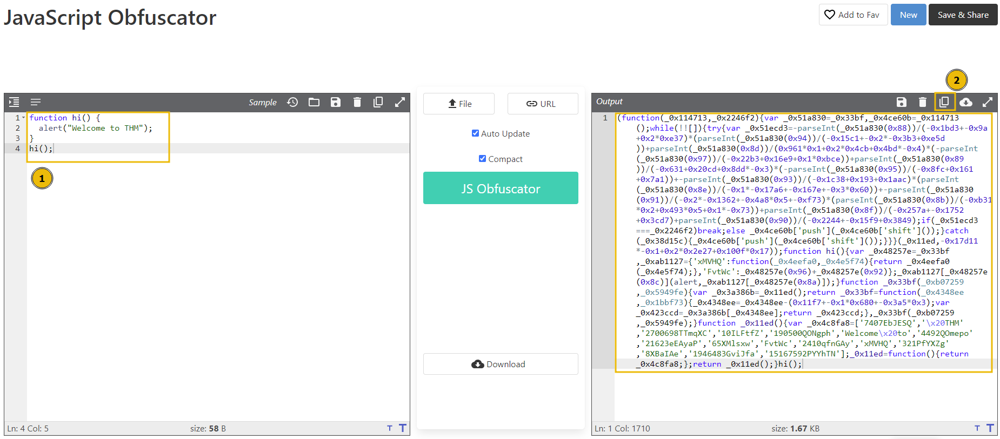

Nhưng nếu chúng tôi nói với bạn rằng những ký tự vô nghĩa này vẫn là mã nguồn hoạt động đầy đủ chức năng thì sao? Sự khác biệt duy nhất là chúng không thể đọc được bằng mắt thường, nhưng trình duyệt vẫn có thể thực thi chúng một cách chính xác. Trang web đã chuyển đổi mã JS của chúng tôi thành mã này:

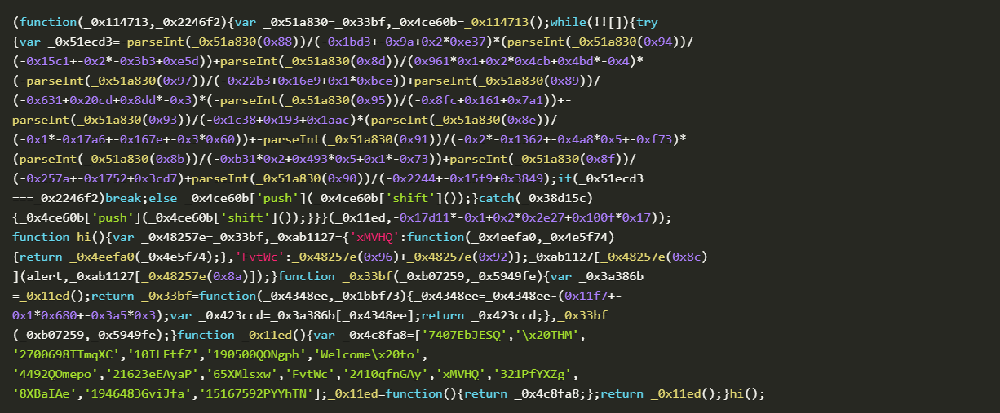

Nhấp vào nút Copy to Clipboard(được đánh dấu là số 2 trong hình ảnh trên) như hiển thị trên trang web. Sau đó, xóa nội dung hiện có `hello.js` trên máy ảo được đính kèm và dán nội dung đã được mã hóa vào tệp.

Tải lại `hello.html` trong Google Chrome và kiểm tra lại mã nguồn trong `Sources` đó. Bạn sẽ nhận thấy rằng mã hiện đã được làm mờ nhưng vẫn hoạt động chính xác như trước.

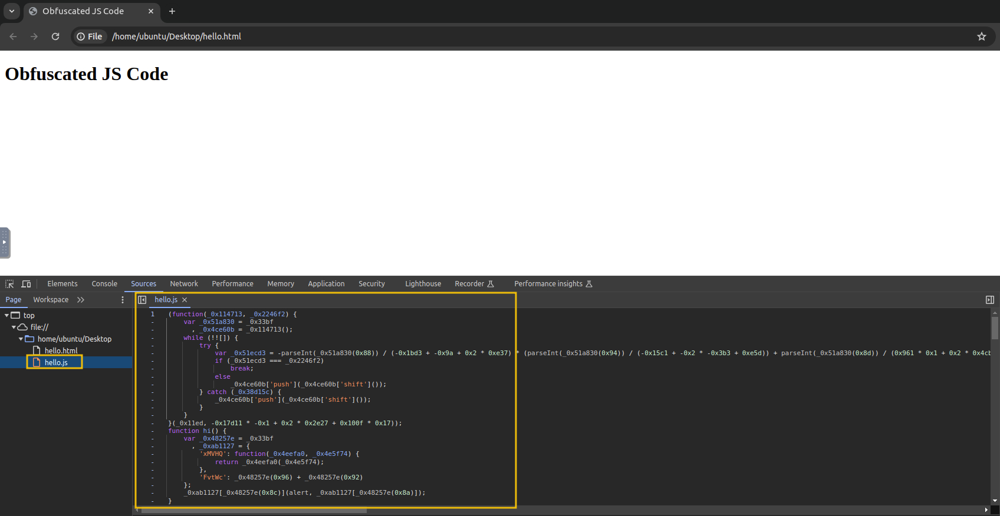

### 3. Giải mã Obfuscation
Chúng ta cũng có thể giải mã mã nguồn bị làm mờ bằng công cụ trực tuyến. Hãy truy cập trang web , sau đó dán mã bị làm mờ vào hộp thoại được cung cấp. Trang web sẽ tạo ra mã JavaScript tương đương, dễ đọc, giúp bạn dễ dàng hiểu và phân tích kịch bản gốc hơn.

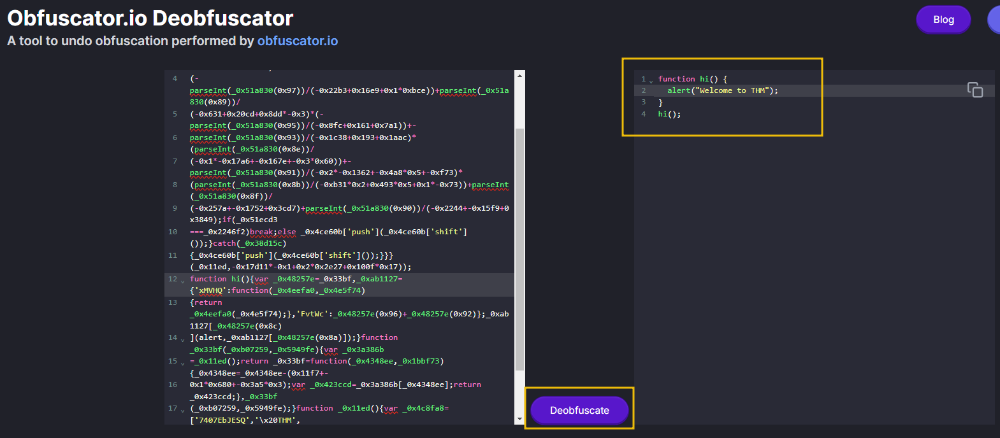

## 8. Best Practices
Bài tập này nêu rõ các phương pháp tốt nhất để đánh giá một trang web hoặc viết mã cho một trang web. Nếu bạn đang phát triển một ứng dụng web, rất có thể bạn sẽ sử dụng JavaScript trên trang web của mình. Các phương pháp dưới đây sẽ giúp bạn giảm thiểu bề mặt tấn công và giảm thiểu nguy cơ bị tấn công. 

### 1. Tránh chỉ dựa vào xác thực phía máy khách.
Một trong những chức năng chính của JavaScript là thực hiện xác thực phía máy khách. Đôi khi, các nhà phát triển sử dụng nó để xác thực biểu mẫu và hoàn toàn dựa vào nó, điều này không phải là một thực hành tốt. Vì người dùng có thể **vô hiệu hóa/thao tác** JavaScript ở phía máy khách, nên việc thực hiện xác thực ở phía máy chủ cũng rất cần thiết.

### 2. Tránh thêm các thư viện không đáng tin cậy
Như đã thảo luận trong các bài tập trước, JavaScript cho phép bạn bao gồm bất kỳ tập lệnh JavaScript nào khác bằng cách sử dụng thuộc tính `src` bên trong thẻ `<script>`. Nhưng bạn đã cân nhắc xem thư viện mà chúng ta bao gồm có đến từ một nguồn đáng tin cậy hay không? Những kẻ xấu đã tải lên một loạt thư viện trên internet với tên gọi giống với các thư viện hợp pháp. Vì vậy, nếu bạn mù quáng bao gồm một thư viện độc hại, bạn sẽ khiến ứng dụng web của mình dễ bị tấn công.

### 3. Tránh mã hóa bí mật cứng.
Tuyệt đối không nên mã hóa cứng các dữ liệu nhạy cảm như khóa API , mã thông báo truy cập hoặc thông tin đăng nhập vào mã JavaScript của bạn, vì người dùng có thể dễ dàng kiểm tra mã nguồn và lấy được mật khẩu. 

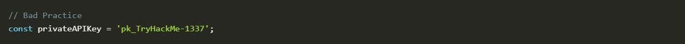

### 4. Thu nhỏ và làm xáo trộn mã JavaScript của bạn
Việc thu nhỏ và làm xáo trộn mã JavaScript giúp giảm kích thước, cải thiện thời gian tải và khiến kẻ tấn công khó hiểu logic của mã hơn. Do đó, hãy luôn  thu nhỏ  và  làm xáo trộn  mã khi sử dụng mã trong môi trường sản xuất. Kẻ tấn công cuối cùng vẫn có thể đảo ngược kỹ thuật, nhưng việc lấy được mã gốc sẽ tốn ít nhất một số công sức. 