# SQL Fundamentals
## 1. Introduction
### 1. Giới thiệu
An ninh mạng là một chủ đề rộng lớn bao gồm nhiều lĩnh vực, nhưng ít lĩnh vực nào phổ biến như cơ sở dữ liệu. Cho dù bạn đang làm việc để bảo mật một ứng dụng web, làm việc trong trung tâm điều hành an ninh (SOC) và sử dụng hệ thống quản lý thông tin và sự kiện ( SIEM ), cấu hình xác thực người dùng/kiểm soát truy cập, hay sử dụng các công cụ phân tích phần mềm độc hại/phát hiện mối đe dọa (và còn nhiều nữa), bạn đều sẽ dựa vào cơ sở dữ liệu theo một cách nào đó. Ví dụ, về phía tấn công an ninh, nó có thể giúp chúng ta hiểu rõ hơn về các lỗ hổng SQL , chẳng hạn như tấn công SQL injection, và tạo ra các truy vấn giúp chúng ta can thiệp hoặc truy xuất dữ liệu trong một dịch vụ bị xâm phạm. Mặt khác, về phía phòng thủ, nó có thể giúp chúng ta điều hướng qua các cơ sở dữ liệu và tìm thấy hoạt động đáng ngờ hoặc thông tin liên quan; nó cũng có thể giúp chúng ta bảo vệ dịch vụ tốt hơn bằng cách triển khai các hạn chế khi cần thiết.

Vì cơ sở dữ liệu hiện diện ở khắp mọi nơi, việc hiểu về chúng rất quan trọng, và phòng học này sẽ là bước đầu tiên của bạn theo hướng đó. Chúng ta sẽ cùng tìm hiểu những kiến ​​thức cơ bản về cơ sở dữ liệu, bao gồm các thuật ngữ, khái niệm chính và các loại khác nhau trước khi đi sâu vào làm quen với SQL .

### 2. Mục tiêu học tập
- Hiểu rõ cơ sở dữ liệu là gì, cũng như các thuật ngữ và khái niệm chính.
- Hiểu rõ các loại cơ sở dữ liệu khác nhau 
- Hiểu SQL là gì
- Hiểu và có khả năng sử dụng các **thao tác CRUD** trong SQL.
- Hiểu và có khả năng sử dụng các **mệnh đề và thao tác** SQL.
- Hiểu và có khả năng sử dụng các **thao tác** SQL.
- Hiểu và có khả năng sử dụng các **toán tử** SQL.
- Hiểu và có khả năng sử dụng các **hàm** SQL.

## 2. Database 101
### 1. Giới thiệu về cơ sở dữ liệu
Được rồi, vậy là bạn đã được cho biết tầm quan trọng của chúng. Giờ là lúc để hiểu chúng là gì. Như đã đề cập trong phần giới thiệu, cơ sở dữ liệu phổ biến đến mức rất có thể bạn đang tương tác với các hệ thống sử dụng chúng. Cơ sở dữ liệu là một tập hợp thông tin hoặc dữ liệu có cấu trúc được tổ chức, dễ dàng truy cập và có thể được thao tác hoặc phân tích. Dữ liệu đó có thể có nhiều dạng, chẳng hạn như dữ liệu xác thực người dùng (như tên người dùng và mật khẩu), được lưu trữ và kiểm tra khi xác thực vào một ứng dụng hoặc trang web (ví dụ như TryHackMe), dữ liệu do người dùng tạo trên mạng xã hội (như Instagram và Facebook) nơi dữ liệu như bài đăng, bình luận, lượt thích, v.v. của người dùng được thu thập và lưu trữ, cũng như thông tin như lịch sử xem được lưu trữ bởi các dịch vụ phát trực tuyến như Netflix và được sử dụng để tạo ra các đề xuất. 

Chắc hẳn bạn đã hiểu ý tôi: cơ sở dữ liệu được sử dụng rộng rãi và có thể chứa nhiều thứ khác nhau. Không chỉ các doanh nghiệp quy mô lớn mới sử dụng cơ sở dữ liệu. Các doanh nghiệp quy mô nhỏ hơn, khi thành lập, hầu như chắc chắn sẽ phải cấu hình cơ sở dữ liệu để lưu trữ dữ liệu của họ. Nói về các loại cơ sở dữ liệu, bây giờ chúng ta hãy cùng xem xét chúng là gì.

### 2. Các loại cơ sở dữ liệu khác nhau
Giờ thì việc một thứ gì đó được nhiều người sử dụng và sử dụng trong thời gian (tương đối) dài dẫn đến nhiều loại hình triển khai khác nhau là điều dễ hiểu. Có khá nhiều loại cơ sở dữ liệu khác nhau có thể được xây dựng, nhưng trong buổi giới thiệu này, chúng ta sẽ tập trung vào hai loại chính: **cơ sở dữ liệu quan hệ** (hay còn gọi là `SQL` ) và **cơ sở dữ liệu phi quan hệ** (hay còn gọi là `NoSQL`). 

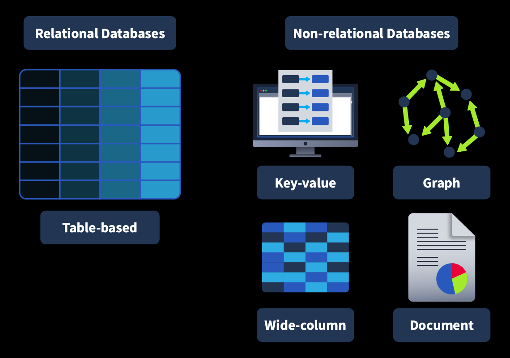

**Cơ sở dữ liệu quan hệ**:  Lưu trữ dữ liệu có cấu trúc, nghĩa là dữ liệu được chèn vào cơ sở dữ liệu này tuân theo một cấu trúc nhất định. Ví dụ, dữ liệu thu thập về người dùng bao gồm tên, họ, địa chỉ email, tên người dùng và mật khẩu. Khi một người dùng mới tham gia, một mục nhập sẽ được tạo trong cơ sở dữ liệu theo cấu trúc này. Dữ liệu có cấu trúc này được lưu trữ trong các hàng và cột trong một bảng (tất cả sẽ được đề cập chi tiết hơn ở phần sau); sau đó, các mối quan hệ có thể được thiết lập giữa hai hoặc nhiều bảng (ví dụ: người dùng và lịch sử đơn hàng), do đó có thuật ngữ cơ sở dữ liệu quan hệ.

**Cơ sở dữ liệu phi quan hệ**: Thay vì lưu trữ dữ liệu theo cách trên, hãy lưu trữ dữ liệu ở định dạng phi bảng. Ví dụ, nếu các tài liệu đang được quét, có thể chứa nhiều loại và số lượng dữ liệu khác nhau, và được lưu trữ trong cơ sở dữ liệu yêu cầu định dạng phi bảng. Đây là một ví dụ về cách thức đó có thể trông như thế nào: 

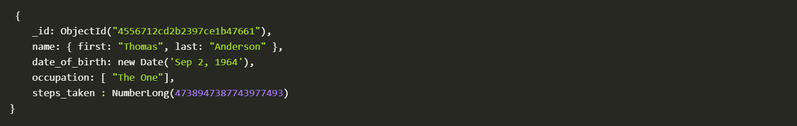

Về việc lựa chọn loại cơ sở dữ liệu nào, điều quan trọng nhất là bối cảnh sử dụng. Cơ sở dữ liệu quan hệ thường được sử dụng khi dữ liệu được lưu trữ sẽ được nhận một cách đáng tin cậy với định dạng nhất quán, nơi độ chính xác là rất quan trọng, chẳng hạn như khi xử lý các giao dịch thương mại điện tử.  Mặt khác, cơ sở dữ liệu phi quan hệ phù hợp hơn khi dữ liệu nhận được có thể rất khác nhau về định dạng nhưng cần được thu thập và sắp xếp ở cùng một nơi, chẳng hạn như các nền tảng truyền thông xã hội thu thập nội dung do người dùng tạo ra.

### 3. Bảng, Hàng và Cột
Bây giờ chúng ta đã định nghĩa hai loại cơ sở dữ liệu chính, chúng ta sẽ tập trung vào cơ sở dữ liệu quan hệ. Chúng ta sẽ bắt đầu bằng cách giải thích về **bảng** , **hàng** và **cột** . Tất cả dữ liệu được lưu trữ trong cơ sở dữ liệu quan hệ sẽ được lưu trữ trong một bảng ; ví dụ, một bộ sưu tập sách có sẵn tại một hiệu sách có thể được lưu trữ trong một bảng có tên là “Sách”. 

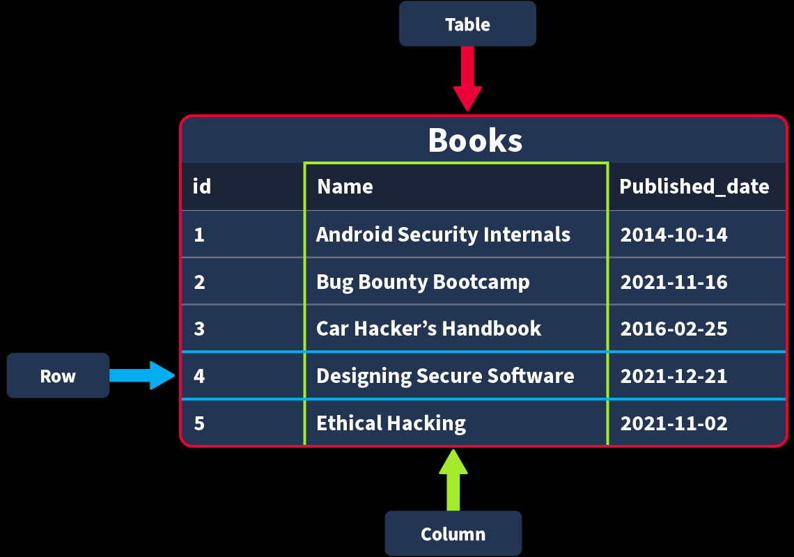

Khi tạo bảng này, bạn cần xác định những thông tin cần thiết để định nghĩa một bản ghi sách, ví dụ: “id”, “Name” và “Published_date”. Đây sẽ là các cột của bạn ; khi định nghĩa các cột này, bạn cũng cần xác định kiểu dữ liệu mà cột đó nên chứa; nếu cố gắng chèn một bản ghi vào cơ sở dữ liệu mà kiểu dữ liệu không khớp, thao tác sẽ bị từ chối. Các kiểu dữ liệu có thể được định nghĩa có thể khác nhau tùy thuộc vào cơ sở dữ liệu bạn đang sử dụng, nhưng các kiểu dữ liệu cốt lõi được sử dụng bởi tất cả bao gồm **string** (một tập hợp các từ và ký tự), **Interger** (số nguyên), **float** (số có dấu thập phân) và **Times/Dates**. 

Sau khi bảng được tạo với các cột đã được định nghĩa, bản ghi đầu tiên sẽ được chèn vào cơ sở dữ liệu, ví dụ: một cuốn sách có tên “Android Security Internals” với ID là “1” và ngày xuất bản là “2014-10-14”. Sau khi được chèn, bản ghi này sẽ được biểu diễn dưới dạng một hàng .

### 4. Khóa chính và khóa ngoại
Sau khi một bảng đã được định nghĩa và điền dữ liệu, có thể cần lưu trữ thêm dữ liệu. Ví dụ, chúng ta muốn tạo một bảng có tên “Tác giả” để lưu trữ thông tin về tác giả của các cuốn sách được bán trong cửa hàng. Đây là một ví dụ rất rõ ràng về mối quan hệ. Một cuốn sách (được lưu trữ trong bảng Sách) được viết bởi một tác giả (được lưu trữ trong bảng Tác giả). Nếu chúng ta muốn truy vấn một cuốn sách trong câu chuyện của mình nhưng cũng muốn nhận được thông tin về tác giả của cuốn sách đó, dữ liệu của chúng ta cần phải được liên kết với nhau bằng cách nào đó; chúng ta thực hiện điều này bằng cách sử dụng khóa. Có hai loại `khóa` :

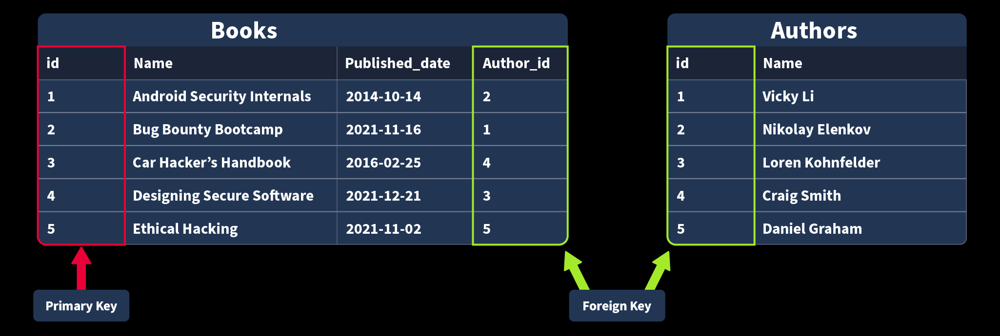

`Khóa chính` : Khóa chính được sử dụng để đảm bảo dữ liệu được thu thập trong một cột nhất định là duy nhất. Nghĩa là, cần có một cách để xác định mỗi bản ghi được lưu trữ trong một bảng, một giá trị duy nhất cho bản ghi đó và không trùng lặp với bất kỳ bản ghi nào khác trong bảng đó. Hãy nghĩ về mã số sinh viên trong trường đại học; đây là những số được cấp cho sinh viên để họ có thể được xác định duy nhất trong hồ sơ (vì đôi khi sinh viên có thể có cùng tên). Một cột phải được chọn trong mỗi bảng làm khóa chính; trong ví dụ của chúng ta, "id" sẽ là lựa chọn hợp lý nhất vì mỗi cuốn sách được tạo một id duy nhất, trong khi sách có thể có cùng ngày xuất bản hoặc (trong trường hợp hiếm hơn) cùng tiêu đề sách. Lưu ý rằng chỉ có thể có một cột khóa chính trong một bảng.

`Khóa ngoại` : Khóa ngoại là một cột (hoặc nhiều cột) trong một bảng cũng tồn tại trong một bảng khác trong cùng cơ sở dữ liệu, do đó tạo ra liên kết giữa hai bảng. Trong ví dụ này, hãy xem xét việc thêm trường “author_id” vào bảng “Books”; điều này sẽ hoạt động như một khóa ngoại vì author_id trong bảng Books tương ứng với cột “id” trong bảng author. Khóa ngoại cho phép thiết lập mối quan hệ giữa các bảng khác nhau trong cơ sở dữ liệu quan hệ. Lưu ý rằng có thể có nhiều hơn một cột khóa ngoại trong một bảng.

## 3. SQL
### 1. SQL là gì?
Về lý thuyết, tất cả những điều này nghe có vẻ tuyệt vời, nhưng trên thực tế, cơ sở dữ liệu hoạt động như thế nào? Làm thế nào bạn có thể tạo bảng đầu tiên và điền dữ liệu vào đó? Bạn sẽ sử dụng công cụ nào? Cơ sở dữ liệu thường được quản lý bằng Hệ thống Quản lý Cơ sở dữ liệu (DBMS). Hoạt động như một giao diện giữa người dùng cuối và cơ sở dữ liệu, DBMS là một chương trình phần mềm cho phép người dùng truy xuất, cập nhật và quản lý dữ liệu được lưu trữ. Một số ví dụ về DBMS bao gồm MySQL, MongoDB, Oracle Database và Maria DB. 

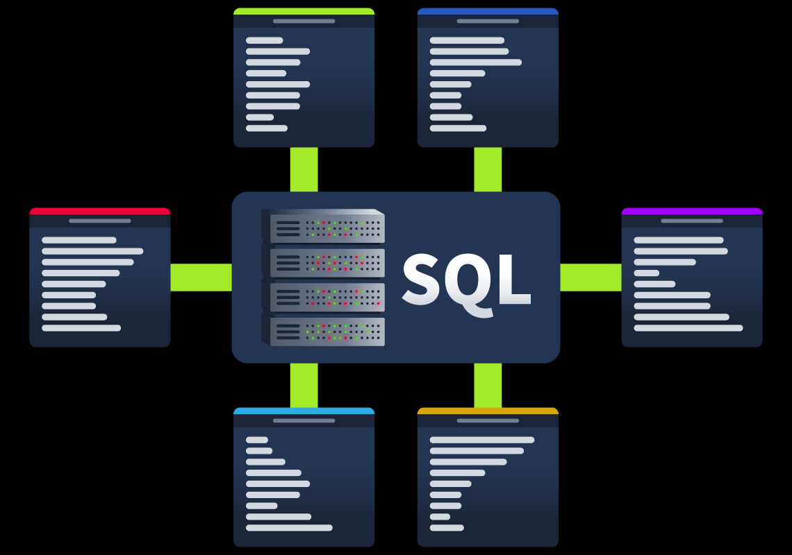

Sự tương tác giữa người dùng cuối và cơ sở dữ liệu có thể được thực hiện bằng SQL (Ngôn ngữ truy vấn có cấu trúc). SQL là một ngôn ngữ lập trình có thể được sử dụng để truy vấn, định nghĩa và thao tác dữ liệu được lưu trữ trong cơ sở dữ liệu quan hệ. 

### 2. Những lợi ích của SQL và cơ sở dữ liệu quan hệ
SQL phổ biến gần như ngang ngửa với chính các cơ sở dữ liệu, và điều này hoàn toàn có lý do. Dưới đây là một số lợi ích khi học và sử dụng SQL :
- **Nó rất nhanh** :  Cơ sở dữ liệu quan hệ (hay còn gọi là cơ sở dữ liệu sử dụng SQL ) có thể trả về lượng dữ liệu khổng lồ gần như ngay lập tức nhờ dung lượng lưu trữ ít và tốc độ xử lý cao. 
- **Dễ học**:  Không giống như nhiều ngôn ngữ lập trình khác, SQL được viết bằng tiếng Anh đơn giản, giúp người học dễ dàng nắm bắt hơn. Tính chất dễ đọc của ngôn ngữ này cho phép người dùng tập trung vào việc học các hàm và cú pháp.
- **Đáng tin cậy**:  Như đã đề cập trước đó, cơ sở dữ liệu quan hệ có thể đảm bảo mức độ chính xác về dữ liệu bằng cách xác định một cấu trúc nghiêm ngặt mà các tập dữ liệu phải tuân theo để được chèn vào.
- **Linh hoạt**:  SQL cung cấp đầy đủ các khả năng khi truy vấn cơ sở dữ liệu; điều này cho phép người dùng thực hiện các tác vụ phân tích dữ liệu quy mô lớn một cách rất hiệu quả.

### 3. Getting Hands ON(_Trải nghiệm thực tế_)
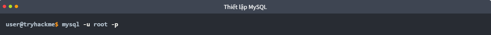

Khi được yêu cầu nhập mật khẩu, hãy nhập:

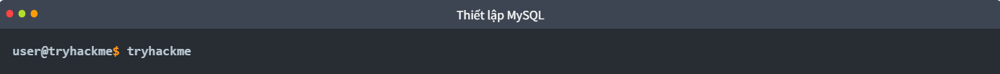

Kết quả đầu ra sẽ có dạng như sau:

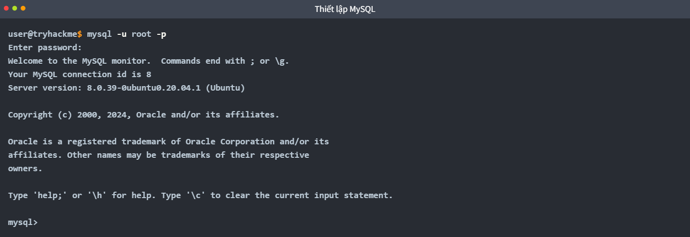

Sau khi đã nắm rõ những điều đó, bạn đã sẵn sàng bắt đầu sử dụng (và học) SQL !

## 4. Database and Table Statements(_Bảng và câu lệnh_)
Trong bài tập này, chúng ta sẽ bắt đầu bằng cách học cách sử dụng các câu lệnh về cơ sở dữ liệu và bảng. Sau cùng, đây chính là những câu lệnh chúng ta cần để tạo cơ sở dữ liệu/bảng ban đầu và bắt đầu công việc. 

### 1. Câu lệnh cơ sở dữ liệu
**TẠO CƠ SỞ DỮ LIỆU**

Nếu cần tạo một cơ sở dữ liệu mới, bước đầu tiên bạn cần làm là tạo nó. Việc này có thể được thực hiện trong SQL bằng cách sử dụng câu lệnh `CREATE DATABASE`. Cú pháp sẽ như sau:

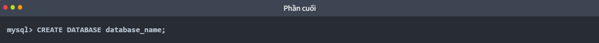

Chạy lệnh sau để tạo cơ sở dữ liệu có tên **thm_bookmarket_db**:

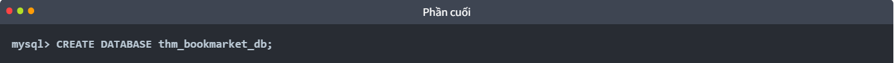

**HIỂN THỊ CƠ SỞ DỮ LIỆU**

Bây giờ chúng ta đã tạo xong cơ sở dữ liệu, chúng ta có thể xem nó bằng câu lệnh `SHOW DATABASES`. Câu lệnh này sẽ trả về danh sách các cơ sở dữ liệu hiện có. Chạy câu lệnh như sau:

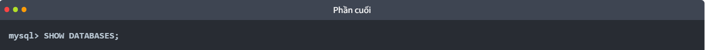

Trong danh sách trả về, bạn sẽ thấy cơ sở dữ liệu bạn vừa tạo và một số cơ sở dữ liệu được bao gồm theo mặc định (mysql, information_scheme, performance_scheme và sys), được sử dụng cho nhiều mục đích khác nhau giúp mysql hoạt động. Ngoài ra còn có một số bảng cần thiết cho bài học này.

**SỬ DỤNG CƠ SỞ DỮ LIỆU**

Sau khi cơ sở dữ liệu được tạo, bạn có thể muốn tương tác với nó. Trước khi có thể tương tác với nó, chúng ta cần cho mysql biết cơ sở dữ liệu nào chúng ta muốn tương tác (để nó biết cơ sở dữ liệu nào cần chạy các truy vấn tiếp theo). Để đặt cơ sở dữ liệu chúng ta vừa tạo làm cơ sở dữ liệu hoạt động, chúng ta sẽ chạy câu lệnh `USE` như sau (hãy chắc chắn chạy câu lệnh này trên máy của bạn):

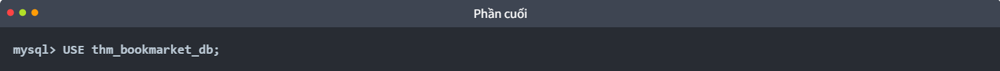

**XÓA CƠ SỞ DỮ LIỆU**

Khi một cơ sở dữ liệu không còn cần thiết nữa (có thể nó được tạo ra cho mục đích thử nghiệm, hoặc không còn cần thiết), nó có thể được xóa bằng `DROP`. Để xóa một cơ sở dữ liệu, chúng ta sẽ sử dụng cú pháp lệnh sau (mặc dù, trong trường hợp này, chúng ta muốn giữ lại cơ sở dữ liệu của mình, vì vậy không cần phải tự chạy câu lệnh này!):

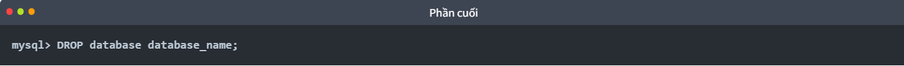

### 2. Bảng
Giờ bạn đã có thể tạo, liệt kê, sử dụng và xóa cơ sở dữ liệu, đã đến lúc xem xét cách chúng ta sẽ điền dữ liệu vào các cơ sở dữ liệu đó bằng các bảng và tương tác với các bảng đó. 

**TẠO BẢNG**

Theo logic của các câu lệnh cơ sở dữ liệu, việc tạo bảng cũng sử dụng một câu lệnh `CREATE`. Sau khi cơ sở dữ liệu được kích hoạt (bạn đã chạy câu lệnh `USE` trên đó), một bảng có thể được tạo trong đó bằng cú pháp câu lệnh sau:

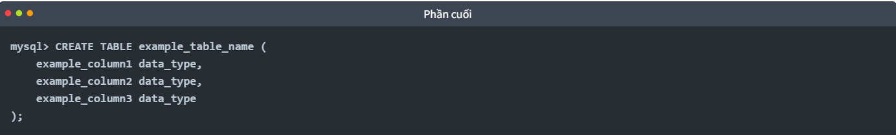

Như bạn thấy, ở đây có nhiều yếu tố liên quan hơn một chút. Trong bài tập Cơ sở dữ liệu 101, chúng ta đã tìm hiểu cách thức và thời điểm tạo một bảng; cần phải quyết định những cột nào sẽ tạo nên một bản ghi trong bảng đó, cũng như kiểu dữ liệu nào được mong đợi sẽ chứa trong cột đó. Đó là những gì được thể hiện bằng cú pháp này. Trong ví dụ, có 3 cột ví dụ, nhưng SQL hỗ trợ nhiều cột hơn (hơn 1000). Hãy thử điền dữ liệu **thm_bookmarket_db** vào một bảng bằng câu lệnh sau:

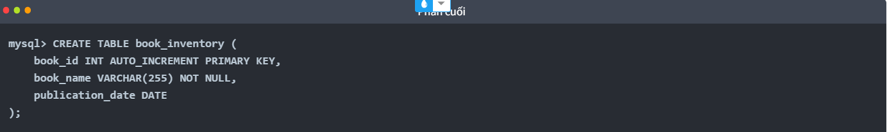

Câu lệnh này sẽ tạo một bảng `book_inventory` với 3 cột:  `book_id`, `book_name` và `publication_date`. `book_id` là một số nguyên (`Integer`) vì nó chỉ được phép là số, `AUTO_INCREMENT` có mặt, nghĩa là cuốn sách đầu tiên được chèn sẽ được gán `book_id` là 1, cuốn sách thứ hai được chèn sẽ được gán book_id là 2, v.v. Cuối cùng,  `book_id` được đặt là **khóa chính** ( PRIMARY KEYprimary) vì đây sẽ là cách chúng ta xác định duy nhất một bản ghi sách trong bảng của mình (và phải có khóa chính trong bảng).

Trường `Book_name` có kiểu dữ liệu `VARCHAR(255)`, nghĩa là nó có thể sử dụng các ký tự biến đổi (văn bản/số/dấu câu) và giới hạn là `255` ký tự  `NOT NULL`, nghĩa là nó không thể trống (vì vậy nếu ai đó cố gắng chèn một bản ghi vào bảng này nhưng trường `book_name` trống thì sẽ bị từ chối). Trường `Publication_date` được đặt là kiểu dữ liệu `DATE`.

**HIỂN THỊ BẢNG**

Tương tự như việc chúng ta có thể liệt kê các cơ sở dữ liệu bằng câu lệnh `SHOW`, chúng ta cũng có thể liệt kê các bảng trong cơ sở dữ liệu hiện đang hoạt động (cơ sở dữ liệu mà chúng ta đã sử dụng câu lệnh `USE` lần cuối). Chạy lệnh sau, và bạn sẽ thấy bảng mà bạn vừa tạo:

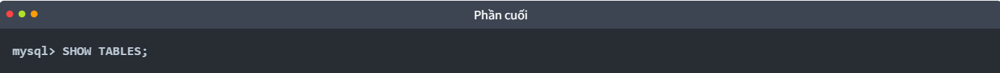

**MÔ TẢ** 

Nếu muốn biết bảng nào chứa những cột nào (và kiểu dữ liệu của chúng), ta có thể mô tả chúng bằng lệnh `DESCRIBE` (cũng có thể viết tắt là `DESC`). Hãy mô tả bảng vừa tạo bằng lệnh sau:

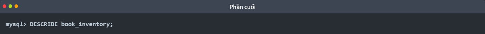

Điều này sẽ giúp bạn xem chi tiết bảng như sau:

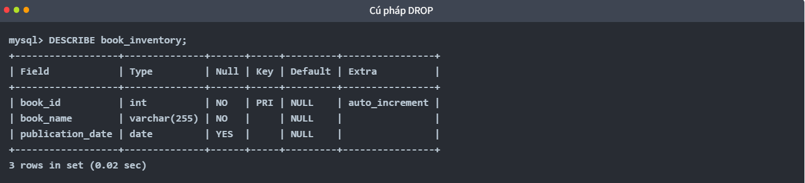

**THAY ĐỔI** 

Sau khi tạo bảng, có thể sẽ có lúc nhu cầu sử dụng dữ liệu của bạn thay đổi và bạn cần sửa đổi bảng. Điều này có thể được thực hiện bằng cách sử dụng câu lệnh `ALTER`. Bây giờ hãy tưởng tượng rằng chúng ta đã quyết định muốn có một cột trong kho sách của mình chứa số trang của mỗi cuốn sách. Hãy thêm cột này vào bảng bằng câu lệnh sau:

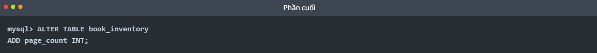

Câu lệnh này `ALTER` có thể được sử dụng để thực hiện các thay đổi đối với một bảng, chẳng hạn như đổi tên cột, thay đổi kiểu dữ liệu trong một cột hoặc xóa một cột. 

**DROP**

Tương tự như việc xóa cơ sở dữ liệu, bạn cũng có thể xóa các bảng bằng câu lệnh `DROP`. Chúng ta không cần phải làm điều này, nhưng cú pháp bạn sẽ sử dụng là:

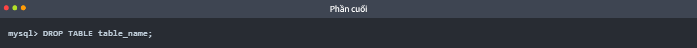

## 5. CRUD Operations
### 1. CRUD
`CRUD` là viết tắt của **Create** (Tạo), **Read** (Đọc) , **Update** (Cập nhật) và **Delete** ( Xóa), được coi là các thao tác cơ bản trong bất kỳ hệ thống nào quản lý dữ liệu.

Hãy cùng khám phá tất cả các thao tác khác nhau khi làm việc với MySQL . Trong hai bài tập tiếp theo, chúng ta sẽ sử dụng bảng `books` thuộc cơ sở dữ liệu `thm_books` . Chúng ta có thể truy cập nó bằng câu lệnh `use thm_books;`.

### 2. Thao tác tạo mới (INSERT)

Thao tác **Tạo** (Create) sẽ tạo các bản ghi mới trong một bảng. Trong MySQL, điều này có thể được thực hiện bằng cách sử dụng câu lệnh `INSERT INTO`, như được hiển thị bên dưới

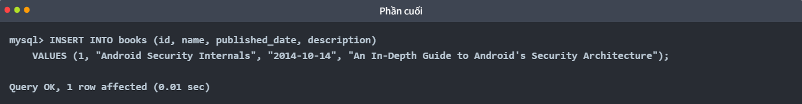

Như chúng ta có thể thấy, câu lệnh `INSERT INTO` chỉ định một bảng, trong trường hợp này là  bảng `books` , nơi bạn có thể thêm một bản ghi mới; các cột **id , name , published_date** và **description** là các bản ghi trong bảng. Trong ví dụ này, một bản ghi mới với **id** là  **1** , **tên** là "**Android Security Internals**", **published_date** là "**2014-10-14**" và **mô tả** là "*Android Security Internals cung cấp sự hiểu biết đầy đủ về các thành phần bảo mật bên trong của thiết bị Android*" đã được thêm vào.

### 3. Thao tác đọc (SELECT)
Thao tác **Đọc** , như tên gọi cho thấy, được sử dụng để đọc hoặc truy xuất thông tin từ một bảng. Chúng ta có thể lấy một cột hoặc tất cả các cột từ một bảng bằng câu lệnh `SELECT`, như được hiển thị trong ví dụ tiếp theo.

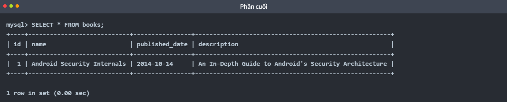

### 4. Thao tác cập nhật (UPDATE)
Thao tác **Cập nhật** sửa đổi một bản ghi hiện có trong bảng, và cùng một câu lệnh `UPDATE` có thể được sử dụng cho việc này.

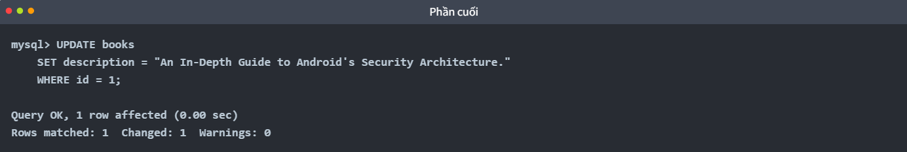

Câu lệnh `UPDATE` chỉ định bảng, trong trường hợp này là  bảng `books` , và sau đó chúng ta có thể sử dụng `SET` theo sau là tên cột mà chúng ta sẽ cập nhật. Mệnh `WHERE` đề chỉ định hàng nào sẽ được cập nhật khi mệnh đề được đáp ứng, trong trường hợp này là hàng có id `1` .

### 5. Thao tác xóa (DELETE)
Thao tác xóa loại bỏ các bản ghi khỏi một bảng. Chúng ta có thể thực hiện điều này bằng câu lệnh `DELETE`.

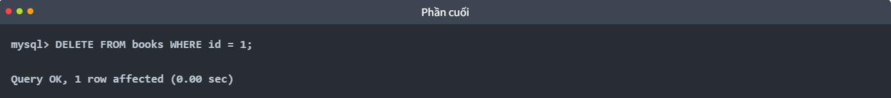

Ở trên, ta có thể thấy câu lệnh `DELETE` được theo sau bởi mệnh đề `FROM`, cho phép ta chỉ định bảng mà bản ghi sẽ bị xóa, trong trường hợp này là bảng `books` , tiếp theo là mệnh đề `WHERE` chỉ ra rằng đó phải là bảng có id là `1` .

## 6. Clauses
Mệnh đề là một phần của câu lệnh, thường được xác định bởi một câu lệnh ban đầu, dùng để chỉ rõ các tiêu chí của dữ liệu đang được xử lý. Các mệnh đề có thể giúp chúng ta xác định loại dữ liệu và cách thức dữ liệu đó nên được truy xuất hoặc sắp xếp. 

Trong các bài tập trước, chúng ta đã sử dụng một số mệnh đề, chẳng hạn như mệnh đề `FROM` dùng để chỉ định bảng mà chúng ta đang truy cập bằng câu lệnh của mình và mệnh đề `WHERE` chỉ định những bản ghi nào nên được sử dụng

Bài tập này sẽ tập trung vào các mệnh đề khác: `DISTINCT`, `GROUP BY`, `ORDER BY`, và `HAVING`.

Trong bài tập này, chúng ta sẽ tiếp tục sử dụng bảng books thuộc cơ sở dữ liệu `thm_books` . Chúng ta có thể truy cập nó bằng câu lệnh `use thm_books;`

### 1. DISTINCT 
Mệnh đề này `DISTINCT` được sử dụng để tránh các bản ghi trùng lặp khi thực hiện truy vấn, chỉ trả về các giá trị duy nhất.

Hãy sử dụng một truy vấn `SELECT * FROM books` và quan sát kết quả bên dưới.

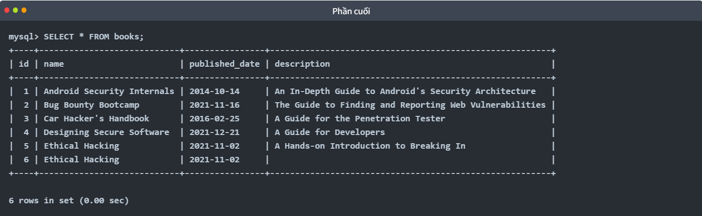

Kết quả truy vấn hiển thị toàn bộ nội dung của bảng `books` , và bản ghi `Ethical Hacking` được hiển thị 2 lần. Hãy thực hiện lại truy vấn, nhưng lần này, sử dụng mệnh đề `DISTINCT`.

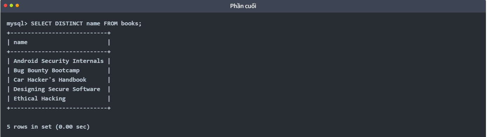

Kết quả cho thấy chỉ có 5 hàng được trả về và chỉ có 1 bản ghi về `Ethical Hacking` được hiển thị.

### 2. GROUP BY
Mệnh đề `GROUP BY` tổng hợp dữ liệu từ nhiều bản ghi và nhóm các kết quả truy vấn vào các cột. Điều này có thể hữu ích cho các hàm tổng hợp.

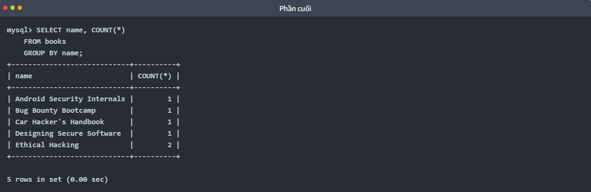

Trong ví dụ trên, các bản ghi trong bảng `books` được nhóm lại theo kết quả của hàm `COUNT`. Chúng ta đã biết rằng "Ethical hacking" được liệt kê 2 lần, vì vậy tổng số lần xuất hiện là 2, được đặt ở cuối vì nó được  nhóm theo số lần xuất hiện.

### 3. ODER BY
Mệnh đề `ORDER BY` có thể được sử dụng để sắp xếp các bản ghi được trả về bởi một truy vấn theo thứ tự tăng dần hoặc giảm dần. Sử dụng các hàm như `ASC` và `DESC` có thể giúp chúng ta thực hiện điều đó, như được minh họa bên dưới trong hai ví dụ tiếp theo.

**THỨ TỰ TĂNG DẦN**

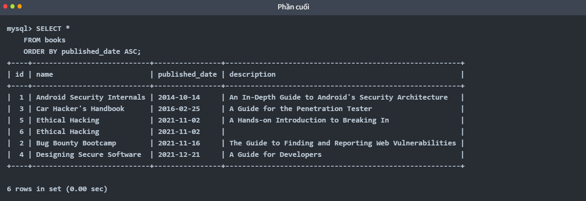

**THỨ TỰ GIẢM DẦN**

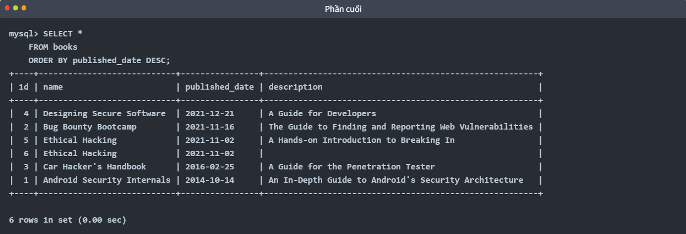

Chúng ta có thể quan sát sự khác biệt khi sắp xếp theo thứ tự tăng dần bằng cách sử dụng `ASC` và theo thứ tự giảm dần bằng cách sử dụng `DESC`, cả hai đều sử dụng `published_date` làm tham chiếu.

### 4. HAVING
Mệnh đề `HAVING` được sử dụng cùng với các mệnh đề khác để lọc các nhóm hoặc kết quả bản ghi dựa trên một điều kiện. Trong trường hợp của `GROUP BY`, nó đánh giá điều kiện thành `TRUE` hoặc `FALSE`, không giống như `WHERE` mệnh đề `HAVING` lọc kết quả sau khi quá trình tổng hợp được thực hiện.

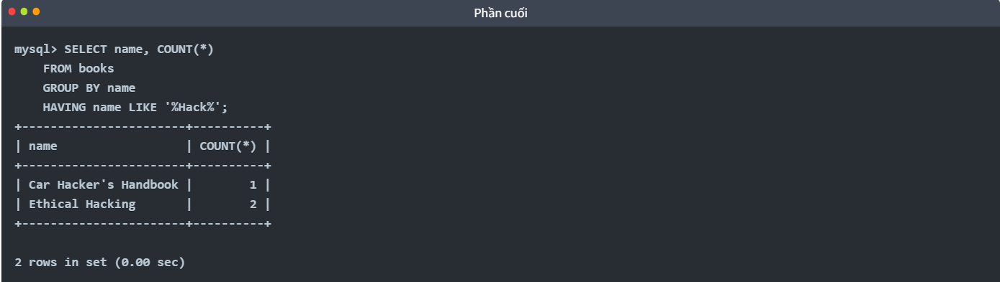

Trong ví dụ trên, chúng ta có thể thấy rằng truy vấn trả về các cuốn sách có tên chứa từ "**hack**" và số lượng chính xác, như chúng ta đã học trước đó.

## 7. Operators
Khi làm việc với SQL và xử lý logic cũng như các phép so sánh, toán tử là cách để chúng ta lọc và thao tác dữ liệu một cách hiệu quả.  Hiểu rõ các toán tử này sẽ giúp chúng ta tạo ra các truy vấn chính xác và mạnh mẽ hơn.  Trong hai bài tập tiếp theo, chúng ta sẽ sử dụng bảng `books` thuộc cơ sở dữ liệu `thm_books2` . Chúng ta có thể truy cập nó bằng câu lệnh `use thm_books2;`

### 1. Toán tử logic
Các toán tử này kiểm tra tính đúng sai của một điều kiện và trả về giá trị boolean là  "**TRUE**" hoặc "**FALSE**". Chúng ta hãy cùng tìm hiểu một số toán tử này ở phần tiếp theo.

### 2. LIKE
Toán tử `LIKE` thường được sử dụng kết hợp với các mệnh đề như `WHERE` để lọc các mẫu cụ thể trong một cột. Chúng ta hãy tiếp tục sử dụng cơ sở dữ liệu của mình để truy vấn một ví dụ về cách sử dụng nó.

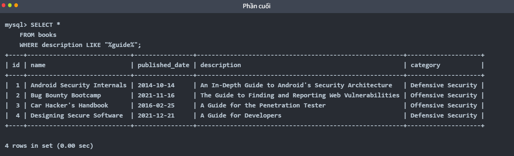

Truy vấn trên trả về danh sách các bản ghi từ các cuốn sách đã được lọc, nhưng chỉ những bản ghi sử dụng mệnh đề `WHERE` chứa từ "guide" bằng cách sử dụng `LIKE`.

### 2. AND
Toán tử này `AND` sử dụng nhiều điều kiện trong một truy vấn và trả về giá trị `TRUE` nếu tất cả các điều kiện đều đúng.

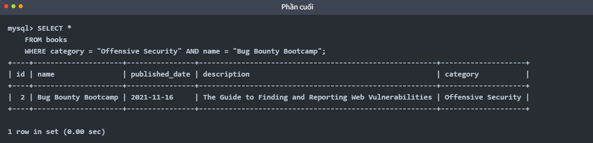

Truy vấn trên trả về cuốn sách có tên `Bug Bounty Bootcamp` , thuộc thể loại `Bảo mật tấn công` .

### 3. OR
Toán tử `OR` kết hợp nhiều điều kiện trong các truy vấn và trả về kết quả `TRUE` nếu ít nhất một trong các điều kiện đó đúng.

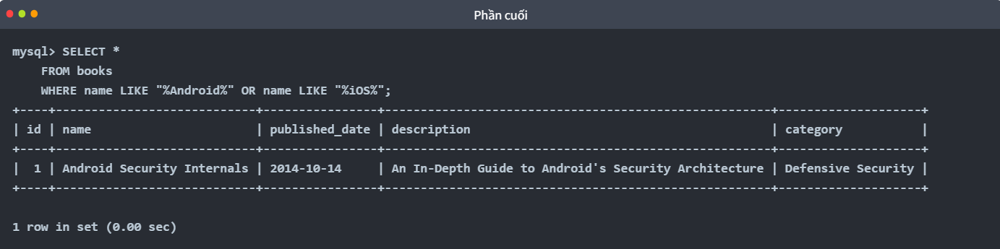

Truy vấn trên trả về các cuốn sách có tên chứa từ "**Android**"  hoặc "**IOS**" .

### 4. NOT
Toán tử này `NOT` đảo ngược giá trị của một toán tử boolean, cho phép chúng ta loại trừ một điều kiện cụ thể.

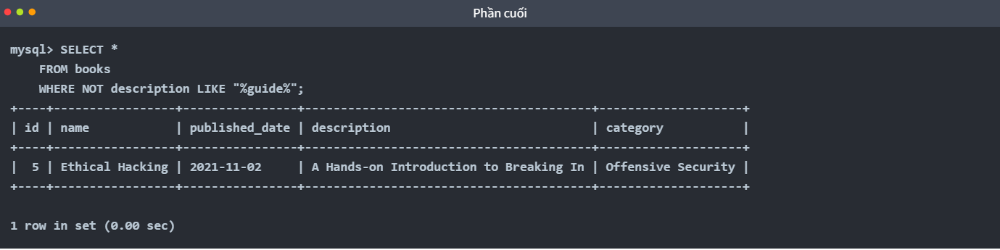

Truy vấn trên trả về kết quả trong đó phần mô tả không chứa từ "**guide**" .

### 5. BETWEEN
Toán tử này `BETWEEN` cho phép chúng ta kiểm tra xem một giá trị có tồn tại trong một phạm vi xác định hay không .

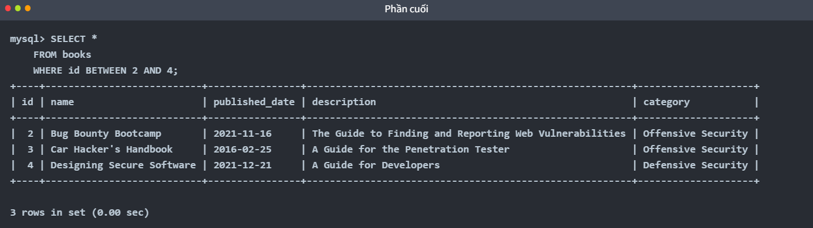

Truy vấn trên trả về các cuốn sách có ID nằm trong khoảng từ `2` đến `4`.

### 6. Toán tử so sánh
Các toán tử so sánh được sử dụng để so sánh các giá trị và kiểm tra xem chúng có đáp ứng các tiêu chí đã xác định hay không.

**=**

Toán `=` tử (**Bằng**) so sánh hai biểu thức và xác định xem chúng có bằng nhau hay không, hoặc nó có thể kiểm tra xem một giá trị có khớp với một giá trị khác trong một cột cụ thể hay không.

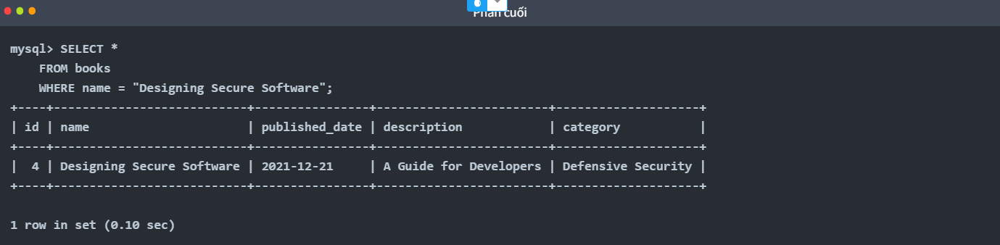

Truy vấn trên trả về cuốn sách có tên chính xác là *Designing Secure Software* .

**!=**

Toán `!=` tử (**không bằng**) so sánh các biểu thức và kiểm tra xem chúng có khác nhau hay không; nó cũng kiểm tra xem một giá trị có khác với giá trị trong một cột hay không.

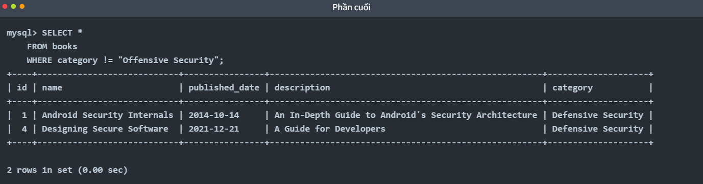

Truy vấn trên trả về sách ngoại trừ những sách thuộc thể loại **Bảo mật Tấn công** .

**<**

Toán tử `<` (**nhỏ hơn**) so sánh xem biểu thức có giá trị cho trước có nhỏ hơn giá trị được cung cấp hay không.

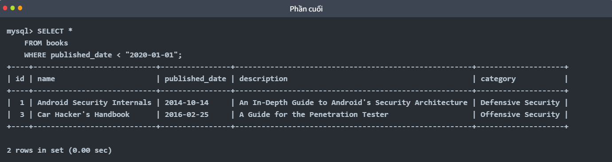

Truy vấn trên trả về các cuốn sách được xuất bản trước `ngày 1 tháng 1 năm 2020`.

**>**

Toán tử `>` (l**ớn hơn**) so sánh xem biểu thức có giá trị cho trước có lớn hơn giá trị được cung cấp hay không.

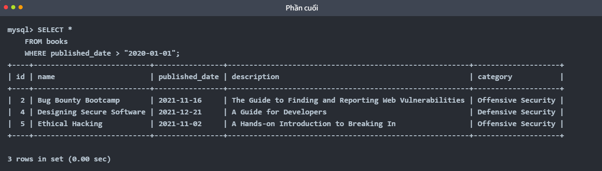

Truy vấn trên trả về các cuốn sách được xuất bản sau `ngày 1 tháng 1 năm 2020` .

**<=**

Toán `<=` tử (**nhỏ hơn hoặc bằng**) so sánh xem biểu thức có giá trị cho trước nhỏ hơn hoặc bằng giá trị được cung cấp hay không. Mặt khác, >= toán tử (lớn hơn hoặc bằng) so sánh xem biểu thức có giá trị cho trước lớn hơn hoặc bằng giá trị được cung cấp hay không. Hãy cùng xem một số ví dụ về cả hai bên dưới đây.

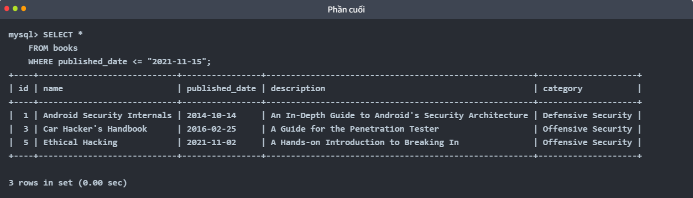

Truy vấn trên trả về các cuốn sách được xuất bản vào hoặc trước `ngày 15 tháng 11 năm 2021` .

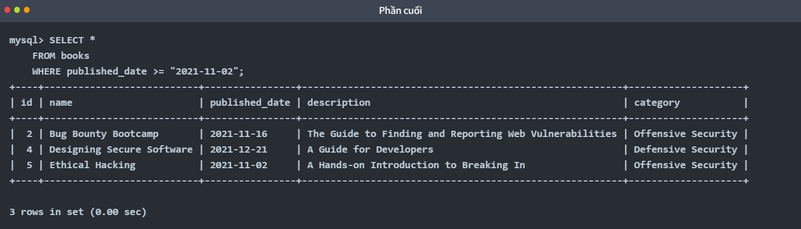

Truy vấn trên trả về các cuốn sách được xuất bản vào hoặc sau `ngày 2 tháng 11 năm 2021`.

## 8. Funcions
Khi làm việc với dữ liệu, các hàm có thể giúp chúng ta đơn giản hóa các truy vấn và thao tác cũng như xử lý dữ liệu. Hãy cùng khám phá một số hàm này ở phần tiếp theo.

### 1. String Funcions
Các hàm xử lý chuỗi thực hiện các thao tác trên một chuỗi, trả về một giá trị được liên kết với chuỗi đó.

**CONCAT**
Hàm này được sử dụng để cộng hai hoặc nhiều chuỗi lại với nhau. Nó hữu ích để kết hợp văn bản từ các cột khác nhau.

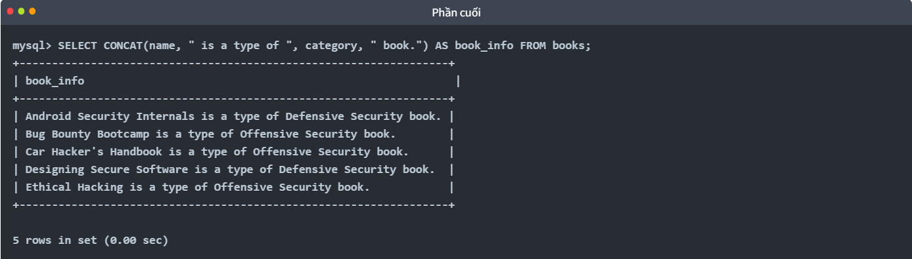

Truy vấn này nối các cột **tên** và **danh mục** từ bảng **sách** thành một cột duy nhất có tên là **book_info** .

**GROUP_CONCAT**

Chức năng này giúp chúng ta ghép nối dữ liệu từ nhiều hàng thành một trường duy nhất. Hãy cùng xem một ví dụ về cách sử dụng nó.

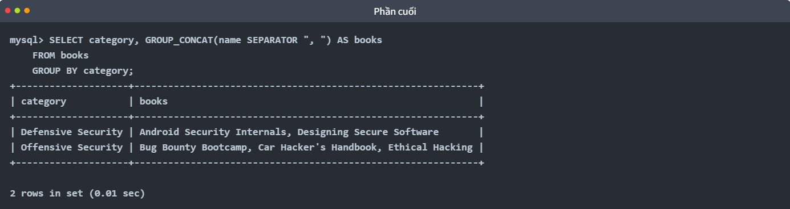

Truy vấn trên nhóm các **cuốn sách** theo **thể loại** và nối các tiêu đề sách trong mỗi thể loại thành một **chuỗi duy nhất**.

**SUBSTRING**
Chức năng này sẽ trích xuất một chuỗi con từ một chuỗi trong truy vấn, bắt đầu từ một vị trí được xác định. Độ dài của chuỗi con này cũng có thể được chỉ định.

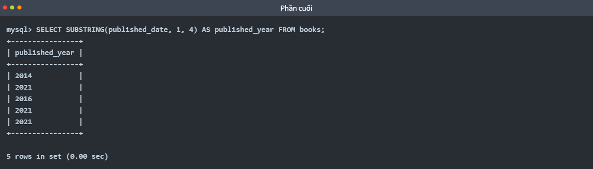

Trong truy vấn trên, ta có thể thấy cách nó trích xuất bốn ký tự đầu tiên từ cột `published_date` và lưu trữ chúng trong cột `published_year` 

**LENGTH**

Hàm này trả về số lượng ký tự trong một chuỗi. Số lượng này bao gồm cả khoảng trắng và dấu câu. Ví dụ minh họa có thể được tìm thấy bên dưới.

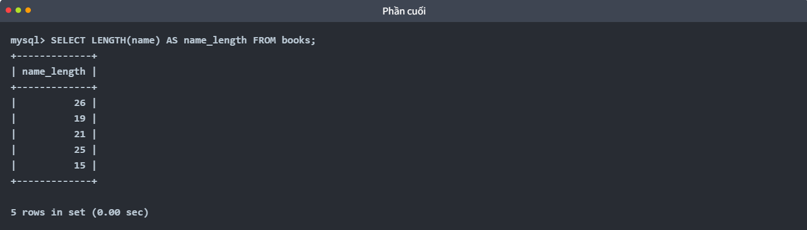

Như chúng ta có thể thấy ở trên, truy vấn tính toán độ dài của chuỗi trong cột tên và lưu trữ nó trong một cột có tên là **name_length** .

### 2. Aggregate Functions(_Hàm tập hợp_)

Các hàm này tổng hợp giá trị của nhiều hàng trong một tiêu chí được chỉ định trong truy vấn; chúng có thể kết hợp nhiều giá trị thành một kết quả duy nhất.

**COUNT**
Hàm này trả về số lượng bản ghi nằm trong một biểu thức, như ví dụ bên dưới cho thấy.

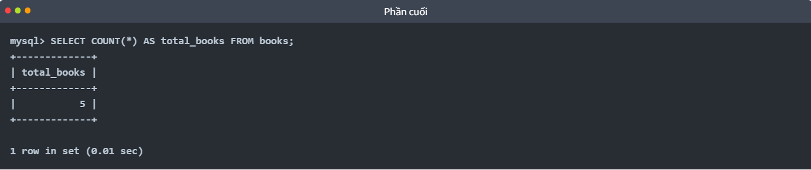

Truy vấn trên đếm tổng số hàng trong bảng books . Kết quả là 5, vì có năm cuốn sách trong bảng `books`, và thông tin này được lưu trữ trong cột `total_books`.

**SUM**
Hàm này tính tổng tất cả các giá trị (**không phải NULL**) của một cột được chỉ định.

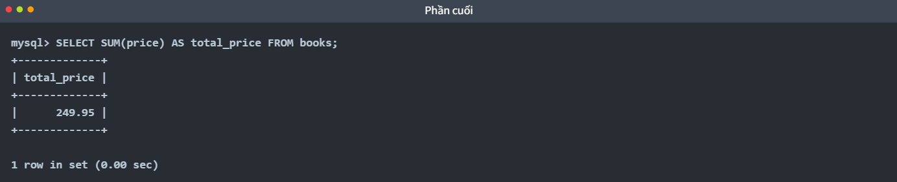

Truy vấn trên tính tổng giá của cột `giá` . Kết quả trả về tổng giá của tất cả các cuốn sách trong cột `total_price` .

**MAX**
Hàm này tính toán giá trị lớn nhất trong một cột được cung cấp trong một biểu thức.

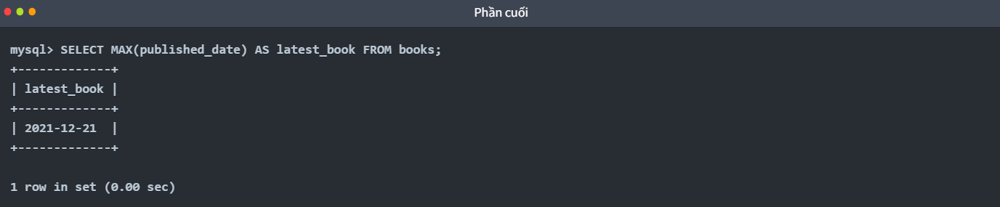

Truy vấn trên lấy ngày xuất bản mới nhất (*giá trị lớn nhất*) từ bảng sách . Kết quả `2021-12-21` được lưu trữ trong cột `latest_book` .

**MIN**
Hàm này tính giá trị nhỏ nhất trong một cột được cung cấp trong một biểu thức.

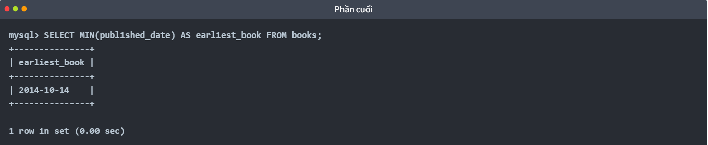

Truy vấn trên lấy ngày xuất bản sớm nhất (*giá trị nhỏ nhất*) từ bảng sách . Kết quả `2014-10-14` được lưu trữ trong cột `earliest_book` .

