# Burp Suite: The Basics
## 1. Introduction
**Chào mừng bạn đến với những kiến ​​thức cơ bản về Burp Suite !**
Mục tiêu của buổi học này là giúp học viên hiểu những kiến ​​thức cơ bản về khung kiểm thử bảo mật ứng dụng web Burp Suite . Chúng ta sẽ tập trung vào các khía cạnh chính sau:
- Giới thiệu chi tiết về Burp Suite .
- Tổng quan toàn diện về các công cụ khác nhau có sẵn trong khuôn khổ này.
- Hướng dẫn chi tiết về quy trình cài đặt Burp Suite trên hệ thống của bạn.
- Hướng dẫn sử dụng và cấu hình Burp Suite 

Chúng tôi cũng sẽ giới thiệu phần cốt lõi của Burp Suite , đó là **Burp Proxy** . Điều quan trọng cần lưu ý là phòng học này chủ yếu đóng vai trò là nguồn tài liệu nền tảng để nắm vững kiến ​​thức về Burp Suite . Các phòng học tiếp theo trong mô-đun Burp sẽ áp dụng cách tiếp cận thực tiễn hơn. Do đó, phòng học này sẽ tập trung nhiều hơn vào nội dung lý thuyết. Nếu bạn chưa từng sử dụng Burp Suite , chúng tôi khuyên bạn nên đọc kỹ thông tin được cung cấp và tích cực sử dụng công cụ này. Thực hành là điều cần thiết để nắm vững các nguyên tắc cơ bản của khung phần mềm này. Kết hợp thông tin được trình bày ở đây với việc thực hành sẽ tạo nền tảng vững chắc cho việc sử dụng khung phần mềm. Điều này sẽ hỗ trợ bạn đáng kể trong các phòng học sau này.

### 2. What is Burp Suite
Về bản chất, **Burp Suite** là một framework dựa trên Java được thiết kế để trở thành giải pháp toàn diện cho việc thực hiện kiểm thử xâm nhập ứng dụng web. Nó đã trở thành công cụ tiêu chuẩn trong ngành để đánh giá bảo mật thực tế các ứng dụng web và di động, bao gồm cả những ứng dụng dựa trên giao diện lập trình ứng dụng (API).

Nói một cách đơn giản, Burp Suite thu thập và cho phép thao tác tất cả lưu lượng HTTP /HTTPS giữa trình duyệt và máy chủ web. Khả năng cơ bản này tạo nên xương sống của khung phần mềm. Bằng cách chặn các yêu cầu, người dùng có thể linh hoạt định tuyến chúng đến các thành phần khác nhau trong khung Burp Suite , điều mà chúng ta sẽ tìm hiểu trong các phần tiếp theo. Khả năng chặn, xem và sửa đổi các yêu cầu web trước khi chúng đến máy chủ đích hoặc thậm chí thao tác các phản hồi trước khi chúng được trình duyệt của chúng ta nhận được, khiến Burp Suite trở thành một công cụ vô giá cho việc kiểm thử ứng dụng web thủ công.

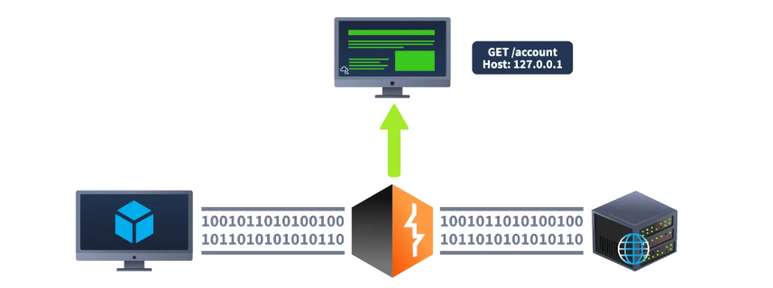

Burp Suite có nhiều phiên bản khác nhau. Trong bài viết này, chúng ta sẽ tập trung vào phiên bản **Burp Suite Community Edition** , phiên bản này được cung cấp miễn phí cho mục đích phi thương mại trong phạm vi pháp luật. Tuy nhiên, cần lưu ý rằng Burp Suite cũng cung cấp các phiên bản Professional và Enterprise, đi kèm với các tính năng nâng cao và yêu cầu giấy phép:

1. **Burp Suite Professional** là phiên bản không giới hạn của Burp Suite Community. Nó đi kèm với các tính năng như:

- Một công cụ quét lỗ hổng bảo mật tự động.
- Một công cụ kiểm thử lỗi/tấn công vét cạn không bị giới hạn tốc độ.
- Lưu trữ các dự án để sử dụng trong tương lai và tạo báo cáo.
API tích hợp sẵn cho phép kết nối với các công cụ khác.
- Quyền truy cập không hạn chế để thêm các tiện ích mở rộng mới nhằm tăng cường chức năng.
- Quyền truy cập vào Burp Suite Collaborator (về cơ bản cung cấp một trình bắt yêu cầu độc đáo được tự lưu trữ hoặc chạy trên máy chủ thuộc sở hữu của Portswigger).

Tóm lại, **Burp Suite Professional** là một công cụ vô cùng mạnh mẽ, trở thành lựa chọn ưu tiên của các chuyên gia trong lĩnh vực này.

2. Khác với các phiên bản cộng đồng và chuyên nghiệp, **Burp Suite Enterprise** chủ yếu được sử dụng để quét liên tục. Nó có một trình quét tự động định kỳ quét các ứng dụng web để tìm lỗ hổng, tương tự như cách các công cụ như Nessus thực hiện quét cơ sở hạ tầng tự động. Không giống như các phiên bản khác cho phép tấn công thủ công từ máy tính cục bộ, Burp Suite Enterprise được cài đặt trên máy chủ và liên tục quét các ứng dụng web mục tiêu để tìm các lỗ hổng tiềm ẩn.

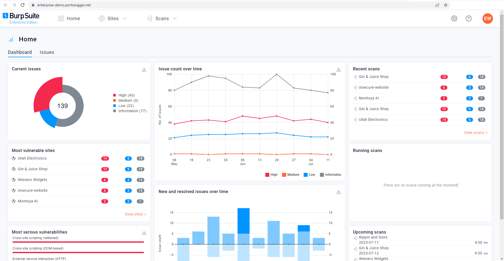

Do các phiên bản Professional và Enterprise yêu cầu giấy phép, chúng ta sẽ tập trung vào bộ tính năng cốt lõi được cung cấp bởi phiên bản **Burp Suite Community Edition**.

## 3. Feaures of Burp Community(_Những tính năng của Burp Community_)
Mặc dù Burp Suite Community cung cấp bộ tính năng hạn chế hơn so với phiên bản Professional, nhưng nó vẫn cung cấp một loạt công cụ ấn tượng và rất có giá trị cho việc kiểm thử ứng dụng web. Hãy cùng khám phá một số tính năng chính:
- **Proxy** : Burp Proxy là khía cạnh nổi tiếng nhất của Burp Suite . Nó cho phép chặn và sửa đổi các yêu cầu và phản hồi khi tương tác với các ứng dụng web.
- **Repeater**: cho phép thu thập, sửa đổi và gửi lại cùng một yêu cầu nhiều lần. Chức năng này đặc biệt hữu ích khi tạo ra các payload thông qua phương pháp thử và sai (ví dụ: trong tấn công SQLi) hoặc kiểm tra chức năng của một endpoint để tìm lỗ hổng bảo mật.
- **Intruder**: Mặc dù có giới hạn về tốc độ trong Burp Suite Community, Intruder cho phép gửi nhiều yêu cầu đến các điểm cuối. Nó thường được sử dụng cho các cuộc tấn công vét cạn hoặc kiểm thử lỗi (fuzzing) các điểm cuối.
- **Decoder**: Mặc dù có giới hạn về tốc độ trong Burp Suite Community, Intruder cho phép gửi nhiều yêu cầu đến các điểm cuối. Nó thường được sử dụng cho các cuộc tấn công vét cạn hoặc kiểm thử lỗi (fuzzing) các điểm cuối.
- **Comparer**: cho phép so sánh hai đoạn dữ liệu ở cấp độ từ hoặc byte. Mặc dù không phải là tính năng độc quyền của Burp Suite , khả năng gửi trực tiếp các đoạn dữ liệu lớn đến công cụ so sánh chỉ bằng một phím tắt giúp tăng tốc đáng kể quá trình này.
- **Sequencer**: thường được sử dụng khi đánh giá tính ngẫu nhiên của các mã thông báo, chẳng hạn như giá trị cookie phiên hoặc các dữ liệu được cho là tạo ngẫu nhiên khác. Nếu thuật toán được sử dụng để tạo ra các giá trị này thiếu tính ngẫu nhiên an toàn, nó có thể tạo ra các lỗ hổng cho các cuộc tấn công nghiêm trọng.

Ngoài các tính năng tích hợp sẵn, mã nguồn Java của Burp Suite tạo điều kiện thuận lợi cho việc phát triển các tiện ích mở rộng để nâng cao chức năng của khung phần mềm. Các tiện ích mở rộng này có thể được viết bằng Java, Python (sử dụng trình thông dịch Java Jython) hoặc Ruby (sử dụng trình thông dịch Java JRuby). Mô-đun **Burp Suite Extender** cho phép tải các tiện ích mở rộng vào khung phần mềm một cách nhanh chóng và dễ dàng, trong khi cửa hàng ứng dụng, được gọi là **BApp Store** , cho phép tải xuống các mô-đun của bên thứ ba. Mặc dù một số tiện ích mở rộng có thể yêu cầu giấy phép chuyên nghiệp để tích hợp, vẫn có một số lượng đáng kể các tiện ích mở rộng dành cho cộng đồng Burp. Ví dụ, mô-đun `Logger++` có thể mở rộng chức năng ghi nhật ký tích hợp sẵn của Burp Suite .

## 4. Installation(*Cài đặt*)
Burp Suite là một trong những công cụ rất hữu ích, dù là để đánh giá ứng dụng web hay di động, kiểm thử xâm nhập, săn tìm lỗi bảo mật, hay thậm chí là gỡ lỗi trong quá trình phát triển ứng dụng web. Dưới đây là hướng dẫn cài đặt Burp Suite trên các nền tảng khác nhau:

**DOWNLOAD**
Để tải xuống phiên bản Burp Suite mới nhất cho các hệ thống khác, bạn có thể nhấp vào [đây](https://portswigger.net/burp/releases/) để truy cập trang tải xuống của họ.

**Kali Linux** : Burp Suite được cài đặt sẵn trên Kali Linux . Nếu thiếu Burp Suite trên bản cài đặt Kali của bạn, bạn có thể dễ dàng cài đặt nó từ kho lưu trữ apt của Kali .

**Linux , macOS và Windows**: Đối với các hệ điều hành khác, PortSwigger cung cấp trình cài đặt riêng cho Burp Suite Community và Burp Suite Professional trên trang tải xuống Burp Suite . Chọn hệ điều hành của bạn từ menu thả xuống và chọn Burp Suite Community Edition . Sau đó, nhấp vào nút Tải xuống để bắt đầu tải xuống.

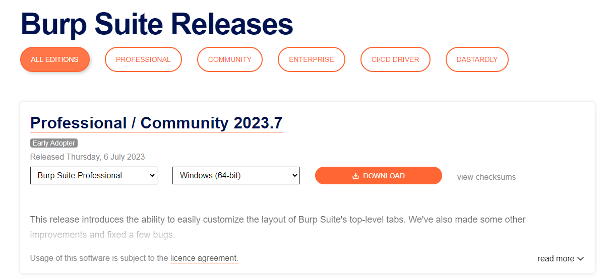

**INSTALL**
Cài đặt Burp Suite bằng phương pháp phù hợp với hệ điều hành của bạn. Trên Windows, chạy tệp thực thi, trong khi trên Linux , chạy tập lệnh từ terminal (có hoặc không có sudo). Nếu bạn chọn không sử dụng sudosudo trong quá trình cài đặt trên Linux, Burp Suite sẽ được cài đặt trong thư mục chính của bạn tại ~/BurpSuiteCommunity/BurpSuiteCommunityvà sẽ không được thêm vào biến môi trường PATH của bạn PATH.

Trình hướng dẫn cài đặt cung cấp các hướng dẫn rõ ràng, và nhìn chung bạn có thể chấp nhận các cài đặt mặc định một cách an toàn. Tuy nhiên, bạn luôn nên xem xét kỹ trình cài đặt.

Sau khi cài đặt Burp Suite thành công, bạn có thể khởi chạy ứng dụng. Trong nhiệm vụ tiếp theo, chúng ta sẽ tìm hiểu về thiết lập và cấu hình ban đầu.

## 5. The Dashboard
Sau khi khởi chạy Burp Suite và chấp nhận các điều khoản và điều kiện, bạn sẽ được yêu cầu chọn loại dự án. Trong Burp Suite Community, các tùy chọn bị hạn chế và bạn chỉ cần nhấp vào Tiếp theo để tiếp tục.

Cửa sổ tiếp theo cho phép bạn chọn cấu hình cho Burp Suite. Nói chung, nên giữ nguyên các cài đặt mặc định, phù hợp với hầu hết các trường hợp. Nhấp vào Start Burp  để mở giao diện chính của Burp Suite .

Khi mở Burp Suite lần đầu tiên, bạn có thể thấy màn hình hiển thị các tùy chọn hướng dẫn. Chúng tôi đặc biệt khuyến khích bạn xem qua các tài liệu hướng dẫn này khi có thời gian.

Nếu bạn không thấy màn hình huấn luyện (hoặc trong các phiên tiếp theo), bạn sẽ được hiển thị Bảng điều khiển Burp, thoạt nhìn có vẻ hơi khó hiểu. Tuy nhiên, bạn sẽ nhanh chóng quen thuộc với nó.

Bảng điều khiển Burp được chia thành bốn phần, được đánh dấu theo chiều ngược kim đồng hồ bắt đầu từ phía trên bên trái:

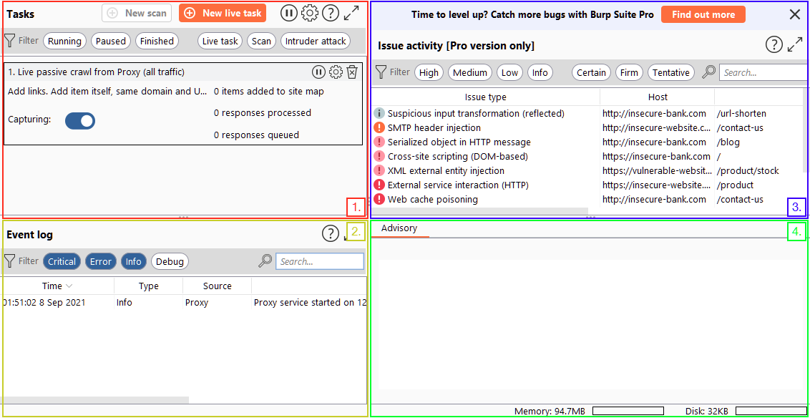

1. **Tasks** : Menu Tác vụ cho phép bạn định nghĩa các tác vụ nền mà Burp Suite sẽ thực hiện trong khi bạn sử dụng ứng dụng. Trong Burp Suite Community, tác vụ mặc định “Live Passive Crawl”, tự động ghi lại các trang đã truy cập, là đủ cho mục đích của chúng ta trong mô-đun này. Burp Suite Professional cung cấp các tính năng bổ sung như quét theo yêu cầu.
2. **Event log**: Nhật ký sự kiện cung cấp thông tin về các hành động được thực hiện bởi Burp Suite , chẳng hạn như khởi động proxy , cũng như chi tiết về các kết nối được thực hiện thông qua Burp.
3. **Issue activity**: Phần này dành riêng cho Burp Suite Professional. Nó hiển thị các lỗ hổng được xác định bởi trình quét tự động, được xếp hạng theo mức độ nghiêm trọng và có thể lọc dựa trên mức độ chắc chắn của lỗ hổng.
4. **Advisory**: Phần Thông báo cung cấp thông tin chi tiết hơn về các lỗ hổng đã được xác định, bao gồm tài liệu tham khảo và các biện pháp khắc phục được đề xuất. Thông tin này có thể được xuất ra báo cáo. Trong Burp Suite Community, phần này có thể không hiển thị bất kỳ lỗ hổng nào.

Trong các tab và cửa sổ khác nhau của Burp Suite , bạn sẽ thấy các biểu tượng dấu hỏi (biểu tượng dấu hỏi).

Nhấp chuột vào các biểu tượng này sẽ mở một cửa sổ mới với thông tin hữu ích dành riêng cho từng phần. Các biểu tượng trợ giúp này vô cùng hữu ích khi bạn cần hỗ trợ hoặc làm rõ về một tính năng cụ thể, vì vậy hãy chắc chắn sử dụng chúng một cách hiệu quả.

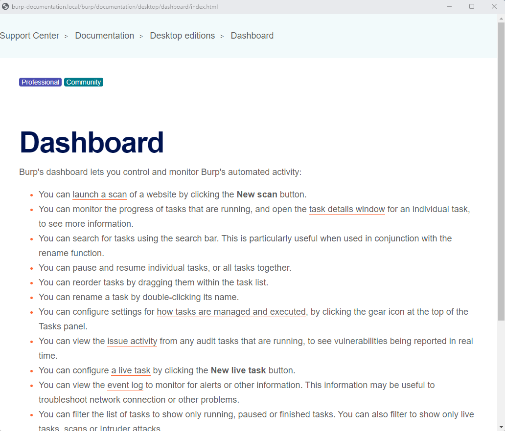

Bằng cách khám phá các tab và chức năng khác nhau của Burp Suite , bạn sẽ dần dần làm quen với khả năng của nó.

## 6. Navigation
Trong Burp Suite , điều hướng mặc định chủ yếu được thực hiện thông qua thanh menu trên cùng, cho phép bạn chuyển đổi giữa các mô-đun và truy cập các tab phụ khác nhau trong mỗi mô-đun. Các tab phụ xuất hiện trong thanh menu thứ hai ngay bên dưới thanh menu chính.

Đây là cách thức hoạt động của hệ thống điều hướng:
1. **Lựa chọn mô-đun** : Hàng trên cùng của thanh menu hiển thị các mô-đun có sẵn trong Burp Suite . Bạn có thể nhấp vào từng mô-đun để chuyển đổi giữa chúng. Ví dụ, mô-đun Burp Proxy được chọn trong hình bên dưới.

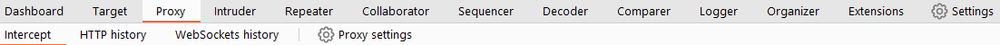

2. **Các tab phụ** : Nếu một mô-đun được chọn có nhiều tab phụ, bạn có thể truy cập chúng thông qua thanh menu thứ hai xuất hiện ngay bên dưới thanh menu chính. Các tab phụ này thường chứa các cài đặt và tùy chọn dành riêng cho mô-đun. Ví dụ, trong hình ảnh trên, tab phụ Proxy Intercept được chọn trong mô-đun Burp Proxy.

3. **Tách các tab** : Nếu bạn muốn xem nhiều tab riêng biệt, bạn có thể tách chúng thành các cửa sổ riêng. Để làm điều này, hãy vào tùy chọn Cửa sổ trong menu ứng dụng phía trên thanh Chọn mô-đun . Từ đó, chọn tùy chọn "Tách", và tab đã chọn sẽ mở trong một cửa sổ riêng. Các tab đã tách có thể được gắn lại bằng phương pháp tương tự.

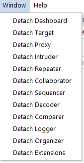

Burp Suite cũng cung cấp các phím tắt để điều hướng nhanh đến các tab quan trọng. Theo mặc định, các phím tắt sau đây có sẵn:

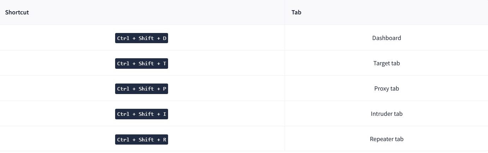

## 7. Options
Trước khi đi sâu vào Burp Proxy , hãy cùng khám phá các tùy chọn có sẵn để cấu hình Burp Suite . Có hai loại cài đặt: Cài đặt toàn cục (còn được gọi là User Settings) và cài đặt dự án.

- **Cài đặt Toàn cục** : Các cài đặt này ảnh hưởng đến toàn bộ quá trình cài đặt Burp Suite và được áp dụng mỗi khi bạn khởi động ứng dụng. Chúng cung cấp cấu hình cơ bản cho môi trường Burp Suite của bạn .
- **Cài đặt Dự án** : Các cài đặt này chỉ áp dụng cho dự án hiện tại và chỉ có hiệu lực trong suốt phiên làm việc. Tuy nhiên, xin lưu ý rằng Burp Suite Community Edition không hỗ trợ lưu dự án, vì vậy mọi tùy chọn dành riêng cho dự án sẽ bị mất khi bạn đóng Burp.

Để truy cập **Settings**, hãy nhấp vào nút Cài đặt trên thanh điều hướng phía trên. Thao tác này sẽ mở một cửa sổ cài đặt riêng biệt.

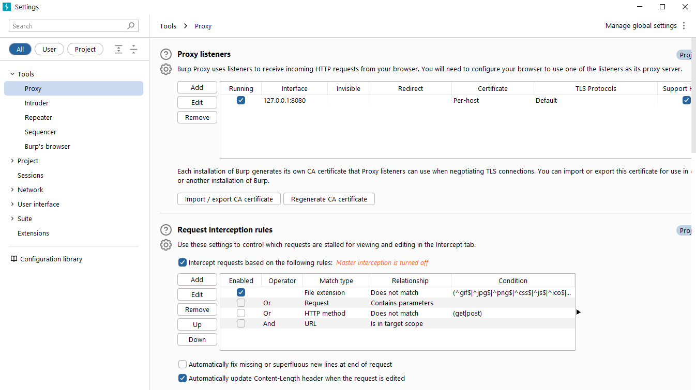

Trong cửa sổ Cài đặt, bạn sẽ thấy một menu ở phía bên trái. Menu này cho phép bạn chuyển đổi giữa các loại cài đặt khác nhau, bao gồm:

1. **Search** : Cho phép tìm kiếm các cài đặt cụ thể bằng từ khóa.
2. **Type filter**: Lọc các cài đặt cho tùy chọn Người dùng và Dự án  
- **User settings**:  Hiển thị các cài đặt ảnh hưởng đến toàn bộ quá trình cài đặt Burp Suite .
- **Project settings**: Hiển thị các cài đặt dành riêng cho dự án hiện tại.
3. **Categories**: Cho phép chọn cài đặt theo danh mục.

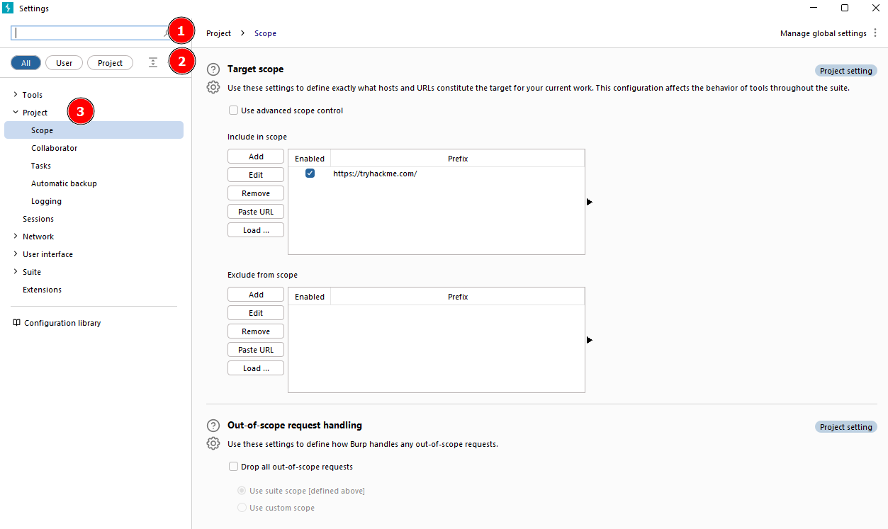

Điều đáng chú ý là nhiều công cụ trong Burp Suite cung cấp các phím tắt đến các danh mục cài đặt cụ thể. Ví dụ, mô-đun `Proxy` bao gồm nút **cài đặt Proxy** , khi nhấn vào sẽ mở cửa sổ cài đặt trực tiếp đến phần proxy liên quan .

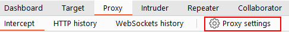

## 8. Introduction to the Burp Proxy
Burp Proxy là một công cụ cơ bản và quan trọng trong Burp Suite . Nó cho phép thu thập các yêu cầu và phản hồi giữa người dùng và máy chủ web mục tiêu. Lưu lượng truy cập bị chặn này có thể được xử lý, gửi đến các công cụ khác để xử lý tiếp hoặc cho phép tiếp tục đến đích.

### 1. Những điểm quan trọng cần hiểu về Burp Proxy
- **Intercepting Requests**(_Chạn request_): Khi các yêu cầu được gửi qua Burp Proxy , chúng sẽ bị chặn và giữ lại không cho đến khi đến được máy chủ đích. Các yêu cầu sẽ xuất hiện trong tab Proxy , cho phép thực hiện các hành động tiếp theo như chuyển tiếp, loại bỏ, chỉnh sửa hoặc gửi chúng đến các mô-đun Burp khác.  Để tắt tính năng chặn và cho phép các yêu cầu đi qua proxy mà không bị gián đoạn, hãy nhấp vào nút này. **Intercept is on** 

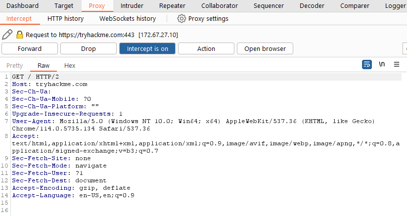

- **Taking Control**(_Kiểm soát_): Khả năng chặn các yêu cầu cho phép người kiểm thử có được quyền kiểm soát hoàn toàn lưu lượng truy cập web, điều này làm cho nó trở nên vô cùng hữu ích cho việc kiểm thử các ứng dụng web.
- **Capture and Logging**(_Bắt và ghi lại request_): Burp Suite ghi nhận và lưu nhật ký các yêu cầu được thực hiện thông qua máy chủ proxy , ngay cả khi tính năng chặn yêu cầu bị tắt. Chức năng lưu nhật ký này có thể hữu ích cho việc phân tích và xem xét lại các yêu cầu trước đó sau này.
- **WebSocket Support**: Burp Suite cũng thu thập và ghi lại nhật ký giao tiếp WebSocket, cung cấp thêm hỗ trợ khi phân tích các ứng dụng web.
- **Logs and History**: Các request đã được ghi lại có thể được xem trong các tab phụ **HTTP History**  và **WebSockets History**  , cho phép phân tích lại và gửi các yêu cầu đến các mô-đun Burp khác khi cần.

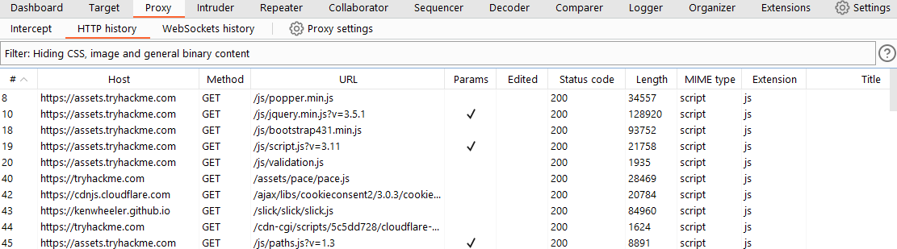

Bạn có thể truy cập các tùy chọn dành riêng cho Proxy bằng cách nhấp vào nút `Proxy setting` . Các tùy chọn này cung cấp khả năng kiểm soát toàn diện đối với hành vi và chức năng của Proxy . Hãy làm quen với các tùy chọn này để tối ưu hóa việc sử dụng Burp Proxy của bạn.

### 2. Một số tính năng đáng chú ý trong cài đặt Proxy
- **Response Interception**(*Chặn response*):  Theo mặc định, máy chủ proxy không chặn response của máy chủ trừ khi được yêu cầu rõ ràng cho từng yêu cầu. "Intercept responses based on the following rules", cùng với các quy tắc đã định nghĩa, cho phép chặn phản hồi linh hoạt hơn.

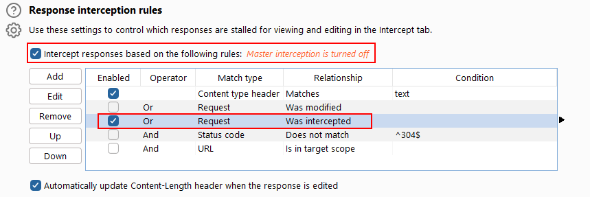

- **Match and Replace**(_Tìm và thay thế_):  Mục "Match and Replace" trong Proxy settings cho phép sử dụng biểu thức chính quy (regex) để sửa đổi các request đến và đi. Tính năng này cho phép thực hiện các thay đổi động, chẳng hạn như sửa đổi tác nhân người dùng hoặc thao tác với cookie.

## 9. Connecting through the (Foxy Proxy)
Để sử dụng Burp Suite Proxy , chúng ta cần cấu hình trình duyệt web cục bộ để chuyển hướng lưu lượng truy cập thông qua Burp Suite . Trong bài tập này, chúng ta sẽ tập trung vào việc cấu hình proxy bằng tiện ích mở rộng **FoxyProxy** trong Firefox.

Dưới đây là các bước cấu hình Burp Suite Proxy với FoxyProxy:
1. **Cài đặt FoxyProxy**: Tải xuống và cài đặt tiện ích mở rộng FoxyProxy Basic .
2. **Truy cập Tùy chọn FoxyProxy**: Sau khi cài đặt, một nút sẽ xuất hiện ở góc trên bên phải của trình duyệt Firefox. Nhấp vào nút FoxyProxy để mở cửa sổ bật lên tùy chọn FoxyProxy

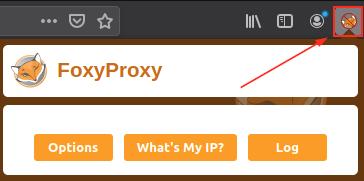

3. **Tạo cấu hình proxy Burp** : Trong cửa sổ tùy chọn FoxyProxy, nhấp vào nút **Options** . Thao tác này sẽ mở một tab trình duyệt mới với các cấu hình FoxyProxy. Nhấp vào nút **Add** để tạo cấu hình proxy mới .

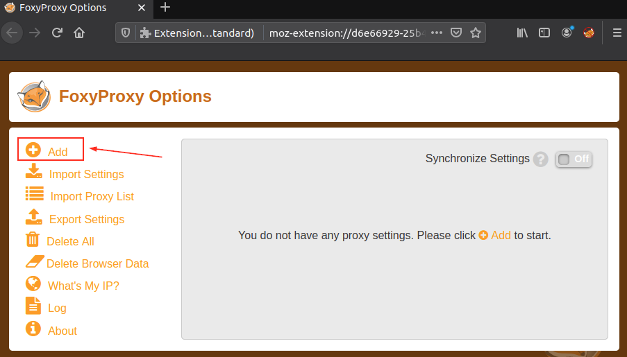

4. **Add Proxy Details** : Trên trang "Add Proxy", hãy điền các thông tin sau:
- **Title**: Burp(hoặc bất kỳ tên nào bạn muốn)
- **Proxy IP**: 127.0.0.1
- **Port**: 8080

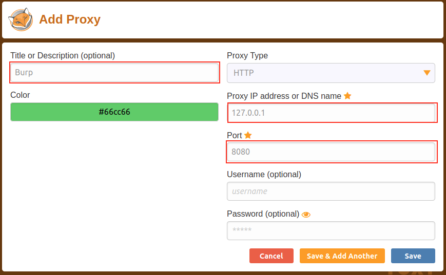

5. **Save Configuration**: Nhấp vào **Save** để lưu cấu hình Burp Proxy.
6. **Activate Proxy Configuration**: Nhấp vào biểu tượng FoxyProxy ở góc trên bên phải trình duyệt Firefox và chọn `Burp` cấu hình. Thao tác này sẽ chuyển hướng lưu lượng truy cập trình duyệt của bạn thông qua `127.0.0.1:8080`. Lưu ý rằng Burp Suite phải đang chạy để trình duyệt của bạn có thể thực hiện các yêu cầu khi cấu hình này được kích hoạt.

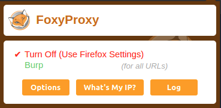

7. **Enable Proxy Intercept in Burp Suite**: Mở Burp Suite và đảm bảo rằng tính năng Chặn đã được bật trong tab **Proxy**.
8. **Test the Proxy**: Mở Firefox và thử truy cập một trang web, ví dụ như trang chủ của  `http://10.48.150.10/`. Trình duyệt của bạn sẽ bị treo và proxy sẽ hiển thị yêu cầu HTTP . Chúc mừng, bạn đã chặn thành công yêu cầu đầu tiên!

**Hãy nhớ những điều sau:**
- Khi cấu hình proxy được kích hoạt và chức năng chặn được bật trong Burp Suite , trình duyệt của bạn sẽ bị treo mỗi khi bạn thực hiện yêu cầu.
- Hãy cẩn thận đừng để chức năng chặn truy cập vô tình được bật, vì nó có thể ngăn trình duyệt của bạn thực hiện bất kỳ yêu cầu nào.
- Trong Burp Suite , nhấp chuột phải vào một yêu cầu cho phép bạn thực hiện nhiều hành động khác nhau, chẳng hạn như chuyển tiếp, xóa, gửi đến các công cụ khác hoặc chọn các tùy chọn từ menu chuột phải.

## 10. Site Map and Issue Definitions(_Sơ đồ và các vấn đề_)
Tab **Target** trong Burp Suite không chỉ cung cấp khả năng kiểm soát phạm vi thử nghiệm mà còn bao gồm ba tab con:
- **Sơ đồ trang web** (Site Map): Tự động xây dựng "bản đồ" cấu trúc cây của ứng dụng web (bao gồm cả các điểm cuối API) dựa trên lịch sử duyệt web của bạn qua Proxy. Nó giúp bạn hình dung toàn bộ các trang và liên kết của mục tiêu một cách trực quan.
- **Định nghĩa vấn đề** (Issue Definitions): Một "cuốn từ điển" khổng lồ về các lỗ hổng bảo mật. Dù bản Community không tự quét lỗi, bạn vẫn có thể vào đây để xem mô tả chi tiết, tài liệu tham khảo và cách khắc phục của từng loại lỗ hổng để phục vụ việc kiểm thử thủ công và viết báo cáo.
- **Cài đặt phạm vi** (Scope Settings): Bộ lọc giúp bạn giới hạn mục tiêu (tên miền, IP) cụ thể. Việc này giúp Burp Suite tập trung vào đúng đối tượng cần hack, loại bỏ các lưu lượng rác từ các trang web khác (như quảng cáo, Facebook, Google) xuất hiện trong khi bạn đang làm việc.

## 11. Burp Suite Browser
Ngoài việc điều chỉnh trình duyệt web thông thường của chúng ta để hoạt động với máy chủ proxy , Burp Suite cũng bao gồm một trình duyệt Chromium tích hợp sẵn, được cấu hình để sử dụng máy chủ proxy mà không cần bất kỳ sửa đổi nào mà chúng ta vừa phải thực hiện.

Để khởi động Burp Browser, hãy nhấp vào nút `Open Browser` trong tab proxy. Một cửa sổ Chromium sẽ hiện ra, và mọi yêu cầu được thực hiện trong trình duyệt này sẽ đi qua proxy.

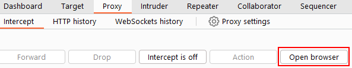

***Vấn đề**: Khi bạn chạy Burp Suite bằng quyền root (như trên các máy ảo AttackBox/Kali), trình duyệt tích hợp của Burp thường bị lỗi không khởi động được vì cơ chế bảo mật sandbox của Chromium không cho phép chạy dưới quyền cao nhất.
- Giải pháp an toàn (Recommended): Tạo một tài khoản người dùng bình thường (không phải root) để chạy Burp. Cách này giúp trình duyệt hoạt động ổn định và giữ cho hệ thống của bạn an toàn trước các mã độc web.
- Giải pháp nhanh (Lối tắt): Vào Settings -> Tools -> Burp's browser và tích chọn "Allow Burp's browser to run without a sandbox". Cách này giúp trình duyệt chạy ngay lập tức nhưng sẽ kém an toàn hơn vì lớp bảo vệ sandbox đã bị gỡ bỏ.

## 12. Scoping and Targeting
Phần **Scoping** (Xác định phạm vi) là kỹ năng quan trọng nhất để giữ cho lịch sử Proxy của bạn sạch sẽ và chuyên nghiệp. Dưới đây là tóm tắt cách thực hiện và lợi ích của nó:

**Mục đích**: Giúp Burp Suite tập trung duy nhất vào ứng dụng web bạn đang kiểm thử, loại bỏ các lưu lượng rác từ các tab trình duyệt khác, quảng cáo hoặc dịch vụ nền của hệ điều hành.

**Cách thiết lập nhanh nhất**: Tại tab Target -> Site map, chuột phải vào tên miền mục tiêu ở cột bên trái và chọn Add to Scope.

**Hành động tiếp theo**: Khi Burp hỏi bạn có muốn dừng lưu nhật ký (logging) cho các mục ngoài phạm vi không, hãy chọn Yes. Việc này sẽ kích hoạt bộ lọc giúp tab Proxy chỉ hiển thị những gì thực sự liên quan đến mục tiêu.

## 12. Scoping and Targeting(*Phạm vi và mục tiêu*)

**Tầm quan trọng**: **Scoping** giúp lọc bỏ "nhiễu" từ các lưu lượng truy cập không liên quan, giúp bạn tập trung hoàn toàn vào ứng dụng web mục tiêu mà không bị choáng ngợp bởi dữ liệu rác.

*Cách thiết lập nhanh*: Tại tab `Target`, chuột phải vào mục tiêu trong danh sách bên trái và chọn `Add To Scope`.

**Tối ưu hóa**: Khi Burp hỏi có muốn dừng ghi nhật ký các mục ngoài phạm vi không, hãy chọn `Yes`. Điều này giúp bộ nhớ và lịch sử Proxy của bạn luôn sạch sẽ, chỉ chứa những gì cần thiết để kiểm thử.

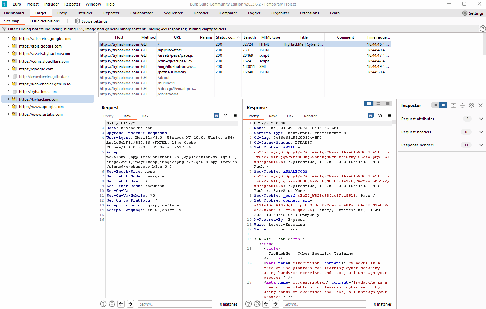

**Kiểm tra & Tùy chỉnh**: Bạn có thể xem và chỉnh sửa danh sách các domain/IP đã thêm vào tại tab `Target` -> `Scope settings`. Tại đây, bạn có quyền thêm (*Include*) hoặc loại trừ (*Exclude*) thủ công các mục tiêu cụ thể.

Vấn đề tồn tại: Mặc dù bạn đã tắt ghi nhật ký (*logging*) cho các mục ngoài Scope, nhưng tab **Proxy** vẫn sẽ tự động chặn (*intercept*) mọi yêu cầu từ các trang web khác, gây phiền hà khi đang thao tác.

Giải pháp triệt để: Để Proxy chỉ chặn đúng những gì bạn muốn hack, hãy vào `Proxy settings`, tìm phần `Intercept Client Requests` và thêm điều kiện: "**And URL Is in target scope**".

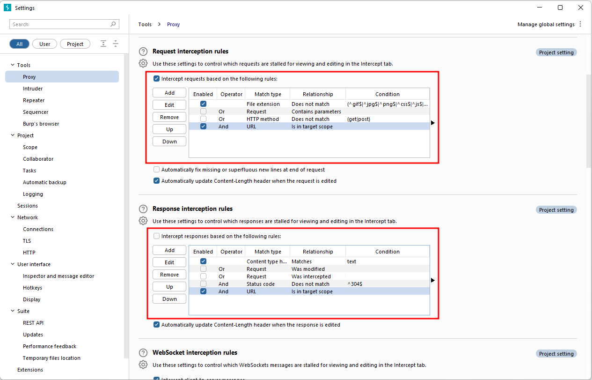

## 13. Proxy HTTPS
Khi truy cập các trang web có giao thức bảo mật (HTTPS/TLS) thông qua Burp Suite, bạn thường sẽ gặp cảnh báo lỗi chứng chỉ. Dưới đây là tóm tắt nguyên nhân và cách hiểu vấn đề này:
- **Vấn đề**: Trình duyệt báo lỗi "không an toàn" hoặc "CA không được ủy quyền" khi bạn vào các trang như Google qua Proxy của Burp.
- **Nguyên nhân**: Để chặn và đọc được dữ liệu mã hóa (HTTPS), Burp Suite phải tự tạo ra một chứng chỉ giả để thay thế chứng chỉ gốc của trang web. Vì trình duyệt không biết PortSwigger CA (cơ quan cấp chứng chỉ của Burp) là ai, nên nó sẽ chặn kết nối để bảo vệ bạn.

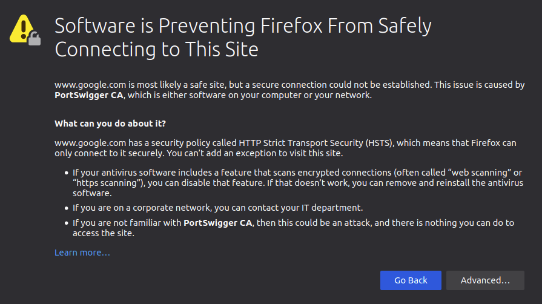

Để khắc phục lỗi chứng chỉ HTTPS khi dùng Burp Suite, bạn cần thực hiện 2 bước quan trọng để trình duyệt "tin tưởng" Proxy này:

1. Tải chứng chỉ: Khi Burp Proxy đang bật, bạn truy cập địa chỉ `http://burp/cert`. Trình duyệt sẽ tải về một tệp có tên là `cacert.der`. Đây chính là "giấy thông hành" để Burp có thể can thiệp vào các kết nối mã hóa.

2. Cài đặt vào Firefox: Bạn truy cập `about:preferences` trong thanh địa chỉ, tìm kiếm từ khóa "**certificates**" và chọn **View Certificates**. Tại đây, bạn sử dụng nút `Import` để tải tệp `cacert.der` lên.

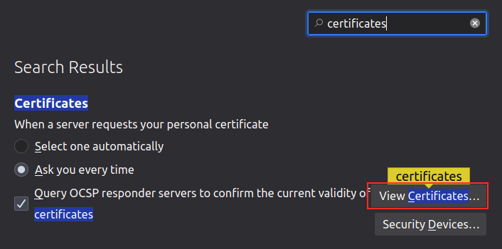

3. **Nhập chứng chỉ** (*Import*): Trong cửa sổ `Certificate Manager`, nhấn nút `Import` và chọn tệp `cacert.der` bạn vừa tải về.
4. **Thiết lập tin cậy** (*Set Trust*): Khi hộp thoại xác nhận hiện ra, hãy tích chọn ô "*Trust this CA to identify websites*" rồi nhấn OK. Bước này cực kỳ quan trọng vì nếu không tích chọn, trình duyệt sẽ vẫn coi các trang web HTTPS đi qua Burp là không an toàn.

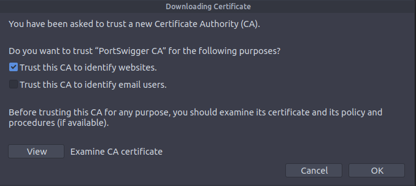

Việc hoàn tất các bước trên có nghĩa là bạn đã thiết lập xong "mối quan hệ tin cậy" giữa trình duyệt và Burp Suite. Từ giờ, bạn có thể thoải mái bắt giữ (intercept) và phân tích các gói tin HTTPS mà không bị trình duyệt ngăn cản.

Dưới đây là tóm tắt ý nghĩa của việc này:

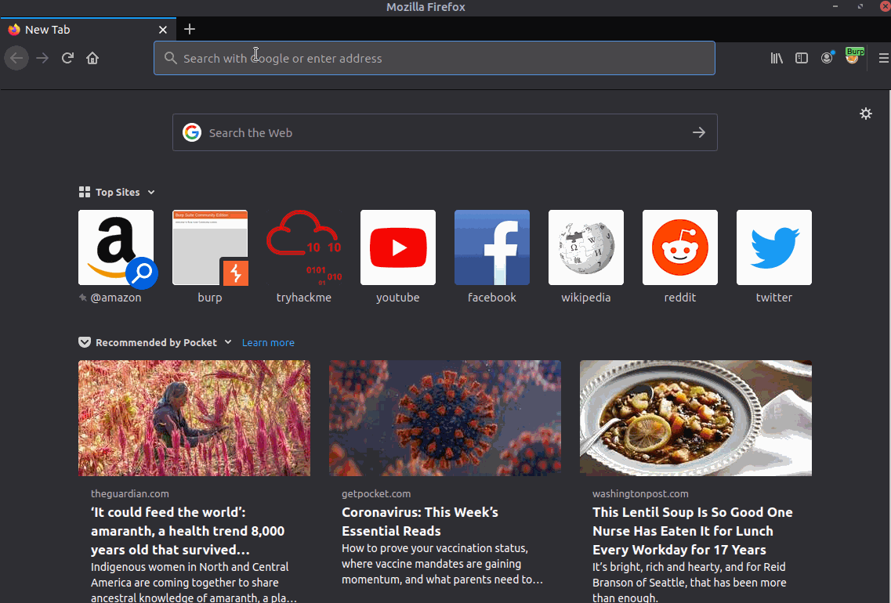

## 14. Example Attack
Sau khi đã tìm hiểu cách thiết lập và cấu hình proxy, chúng ta hãy cùng xem xét một ví dụ thực tế đơn giản. Chúng ta sẽ bắt đầu bằng việc xem qua biểu mẫu hỗ trợ tại địa chỉ `http://MACHINE_IP/ticket/`:

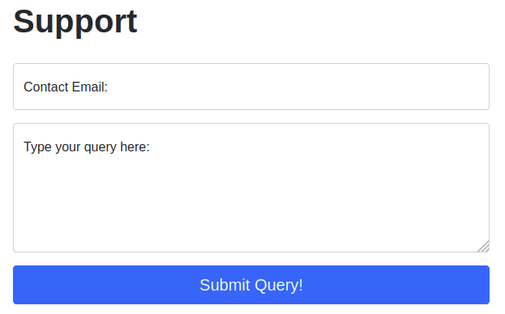

Trong một cuộc kiểm thử xâm nhập ứng dụng web thực tế, chúng ta sẽ kiểm tra biểu mẫu này với nhiều lỗi khác nhau, một trong số đó là **Cross-Site Scripting** (hay *XSS*). Nếu bạn chưa từng gặp XSS, có thể hiểu đơn giản đây là việc chèn một đoạn mã kịch bản phía máy khách (thường là Javascript) vào trang web sao cho đoạn mã đó được thực thi. Có nhiều loại XSS khác nhau – loại mà chúng ta đang sử dụng ở đây được gọi là XSS "Reflected" (phản xạ), vì nó chỉ ảnh hưởng đến người thực hiện yêu cầu web đó.

Hướng dẫn từng bước

Hãy thử nhập: `` vào trường "Contact Email". Bạn sẽ thấy rằng có một bộ lọc phía máy khách đang hoạt động để ngăn cản bạn thêm bất kỳ ký tự đặc biệt nào không được phép dùng trong địa chỉ email:

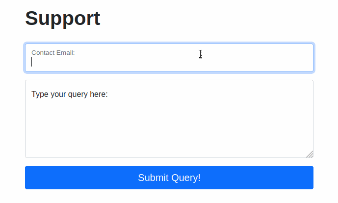

May mắn thay cho chúng ta, các bộ lọc phía máy khách (client-side filters) cực kỳ dễ bị vượt qua. Có rất nhiều cách để chúng ta vô hiệu hóa script hoặc đơn giản là ngăn nó tải ngay từ đầu.

Bây giờ, hãy tập trung vào việc đơn giản là vượt qua bộ lọc đó.

Đầu tiên, hãy đảm bảo rằng Burp Proxy của bạn đang hoạt động và chế độ chặn (intercept) đang được bật.

Tiếp theo, hãy nhập một số dữ liệu hợp lệ vào biểu mẫu hỗ trợ. Ví dụ: `pentester@example.thm` cho địa chỉ email và "Test Attack" cho phần truy vấn.

Gửi biểu mẫu — yêu cầu này sẽ bị chặn lại bởi proxy.

Với yêu cầu đã được bắt giữ trong proxy, giờ đây chúng ta có thể thay đổi trường email thành mã khai thác (payload) cực kỳ đơn giản ở trên: ``. Sau khi dán payload vào, chúng ta cần bôi đen nó, sau đó mã hóa URL bằng phím tắt `Ctrl + U` để đảm bảo nó an toàn khi gửi đi. Quá trình này được hiển thị trong ảnh GIF dưới đây:

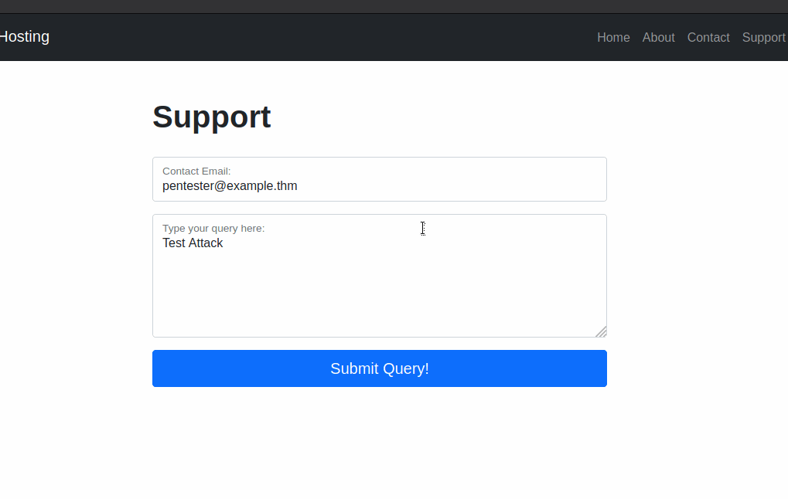

Cuối cùng, hãy nhấn nút "Forward" để gửi yêu cầu đi.

Bạn sẽ thấy một hộp thoại cảnh báo (alert box) từ trang web hiện lên, báo hiệu rằng cuộc tấn công XSS đã thành công!

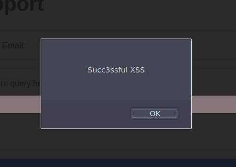

