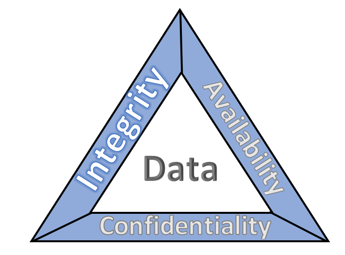
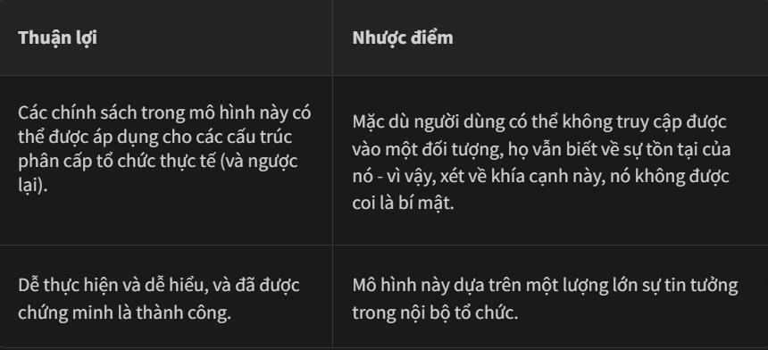
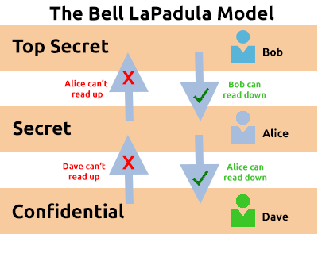
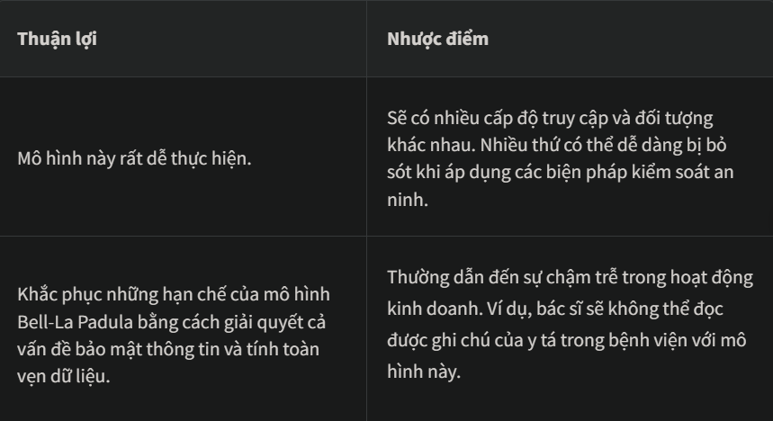

# Principles of Sercurity (*Các nguyên tắc của bảo mật*)
## 1. Introduction
Phần trình bày tiếp theo sẽ nêu ra một số nguyên tắc cơ bản về an ninh thông tin. Từ các khuôn khổ được sử dụng để bảo vệ dữ liệu và hệ thống đến các yếu tố cấu thành nên sự an toàn của dữ liệu.

Các biện pháp, khuôn khổ và quy trình được thảo luận trong căn phòng này đều đóng một vai trò nhỏ trong "Phòng thủ nhiều lớp".

Phòng thủ đa lớp là việc sử dụng nhiều lớp bảo mật khác nhau cho các hệ thống và dữ liệu của một tổ chức với hy vọng rằng nhiều lớp bảo mật sẽ tạo ra sự dư thừa trong phạm vi bảo mật của tổ chức đó.

## 2. CIA
**CIA Triad** là một mô hình bảo mật thông tin được sử dụng trong suốt quá trình xây dựng chính sách bảo mật. Mô hình này có lịch sử lâu đời, được sử dụng từ năm 1998.

Lịch sử này là vì bảo mật thông tin không chỉ bắt đầu và/hoặc kết thúc với an ninh mạng, mà còn áp dụng cho các trường hợp như lưu trữ hồ sơ, sắp xếp tài liệu, v.v.

Gồm `3` phần:  *Bảo mật*, *Toàn vẹn* và *Khả dụng* (*Mô hình này đã nhanh chóng trở thành tiêu chuẩn ngành hiện nay*). Mô hình này giúp xác định giá trị của dữ liệu mà nó áp dụng, và từ đó, mức độ quan tâm mà doanh nghiệp cần dành cho dữ liệu đó.

**CIA Triad** không giống như mô hình truyền thống với các phần riêng lẻ; thay vào đó, nó là một chu kỳ liên tục. Trong khi ba yếu tố của **CIA** này có thể chồng chéo lên nhau; nếu chỉ một yếu tố không được đáp ứng, thì hai yếu tố còn lại sẽ trở nên vô dụng (tương tự như tam giác lửa). Nếu một chính sách bảo mật không đáp ứng được cả ba yếu tố này, thì hiếm khi đó là một chính sách bảo mật hiệu quả.

### Confidentiality (*Tính bảo mật*)
Yếu tố này đảm bảo bảo vệ dữ liệu khỏi sự truy cập và lạm dụng trái phép. Các tổ chức luôn lưu trữ một số dữ liệu nhạy cảm trên hệ thống của mình. Việc đảm bảo tính bảo mật là để bảo vệ dữ liệu này khỏi các bên không được phép tiếp cận.

Có rất nhiều ví dụ thực tế về điều này, ví dụ như hồ sơ nhân viên và các tài liệu kế toán được coi là nhạy cảm. Tính bảo mật được đảm bảo ở chỗ chỉ có các quản trị viên nhân sự mới được truy cập hồ sơ nhân viên, nơi có quy trình kiểm tra và kiểm soát truy cập chặt chẽ. Hồ sơ kế toán ít giá trị hơn (và do đó ít nhạy cảm hơn), nên các biện pháp kiểm soát truy cập sẽ không quá nghiêm ngặt đối với các tài liệu này. Hoặc, ví dụ, các chính phủ sử dụng hệ thống xếp hạng mức độ nhạy cảm (tối mật, mật, không mật).

### Integrity (*Tính toàn vẹn*)
tính toàn vẹn là điều kiện mà thông tin được giữ chính xác và nhất quán trừ khi có những thay đổi được ủy quyền. Thông tin có thể bị thay đổi do truy cập và sử dụng bất cẩn, lỗi trong hệ thống thông tin hoặc truy cập và sử dụng trái phép. Trong...CIATheo nguyên tắc bộ ba, tính toàn vẹn được duy trì khi thông tin không bị thay đổi trong quá trình lưu trữ, truyền tải và sử dụng mà không có sự sửa đổi nào đối với thông tin. Cần phải thực hiện các bước để đảm bảo dữ liệu không thể bị thay đổi bởi những người không được phép (ví dụ, trong trường hợp vi phạm bảo mật).

Có thể áp dụng nhiều biện pháp bảo vệ để đảm bảo tính toàn vẹn. Kiểm soát truy cập và xác thực nghiêm ngặt có thể giúp ngăn chặn người dùng được ủy quyền thực hiện các thay đổi trái phép. Xác minh mã băm và chữ ký số có thể giúp đảm bảo các giao dịch là xác thực và các tệp không bị sửa đổi hoặc bị hỏng.

### Availability (*Tính sẵn sàng*)
Để dữ liệu có ích, nó phải được cung cấp và người dùng có thể truy cập được.

Mối quan ngại chính trongCIANguyên tắc cốt lõi là thông tin phải luôn sẵn sàng khi người dùng được ủy quyền cần truy cập.

Tính khả dụng thường là một tiêu chí quan trọng đối với một tổ chức. Ví dụ, đạt được thời gian hoạt động 99,99% trên các trang web hoặc hệ thống của họ (điều này được quy định trong Thỏa thuận Mức độ Dịch vụ). Khi một hệ thống không khả dụng, điều đó thường dẫn đến thiệt hại về danh tiếng và tổn thất tài chính cho tổ chức. Tính khả dụng đạt được thông qua sự kết hợp của nhiều yếu tố, bao gồm:

Sở hữu phần cứng đáng tin cậy và đã được kiểm thử kỹ lưỡng cho các máy chủ công nghệ thông tin của họ (tức là các máy chủ có uy tín).
Việc trang bị công nghệ và dịch vụ dự phòng trong trường hợp hệ thống chính gặp sự cố là rất quan trọng.
Áp dụng các giao thức bảo mật bài bản để bảo vệ công nghệ và dịch vụ khỏi các cuộc tấn công.

## 3. Principles of Privilleges (*Nguyên tắc về đặc quyền*)
Việc quản lý và xác định chính xác các cấp độ truy cập khác nhau mà cá nhân cần vào hệ thống công nghệ thông tin là vô cùng quan trọng. 

Mức độ truy cập được cấp cho từng cá nhân được xác định dựa trên hai yếu tố chính:

- Vai trò/chức năng của cá nhân trong tổ chức
- Mức độ nhạy cảm của thông tin được lưu trữ trên hệ thống.

Hai khái niệm chính được sử dụng để phân bổ và quản lý quyền truy cập của cá nhân: Quản lý danh tính đặc quyền `PIM` (Privileged Identity Management)và Quản lý quyền truy cập đặc quyền (hay gọi tắt là `PAM`).

Thoạt nhìn, hai khái niệm này có vẻ trùng lặp; tuy nhiên, chúng lại khác nhau. `PIM` được sử dụng để chuyển đổi vai trò của người dùng trong một tổ chức thành vai trò truy cập trên hệ thống. Trong khi đó, `PAM` là việc quản lý các đặc quyền mà vai trò truy cập của hệ thống có, cùng với nhiều chức năng khác.

Điều cốt yếu khi thảo luận về đặc quyền và kiểm soát truy cập là nguyên tắc đặc quyền tối thiểu. Nói một cách đơn giản, người dùng chỉ nên được cấp số lượng đặc quyền tối thiểu, và chỉ những đặc quyền thực sự cần thiết để họ thực hiện nhiệm vụ của mình. Người khác cần có thể tin tưởng vào những gì người dùng viết ra.

Như đã đề cập trước đó, PAM không chỉ đơn thuần là việc cấp quyền truy cập. Nó còn bao gồm việc thực thi các chính sách bảo mật như quản lý mật khẩu, chính sách kiểm toán và giảm thiểu bề mặt tấn công mà hệ thống phải đối mặt

## 4. Security Models (*Continued*)
Trước khi thảo luận sâu hơn về các mô hình bảo mật, chúng ta hãy nhớ lại ba yếu tố của CIA: Bảo mật, Toàn vẹn và Khả dụng. Chúng ta đã từng đề cập đến những yếu tố này và tầm quan trọng của chúng. Tuy nhiên, có một phương pháp chính thức để đạt được điều này.

Theo mô hình bảo mật, bất kỳ hệ thống hoặc thiết bị công nghệ nào lưu trữ thông tin đều được gọi là hệ thống thông tin, và đó là cách chúng ta sẽ gọi các hệ thống và thiết bị trong bài tập này.

Hãy cùng tìm hiểu một số mô hình bảo mật phổ biến và hiệu quả được sử dụng để đạt được ba yếu tố của CIA.

### Mô hình Bell-La Padula
Mô hình Bell-La Padula được sử dụng để đảm bảo tính bảo mật. Mô hình này có một vài giả định, chẳng hạn như cấu trúc phân cấp của tổ chức mà nó được sử dụng, trong đó trách nhiệm/vai trò của mọi người được xác định rõ ràng.

Mô hình này hoạt động bằng cách cấp quyền truy cập vào các phần dữ liệu (gọi là đối tượng) dựa trên nguyên tắc "chỉ những người cần biết mới được cấp quyền". Mô hình này sử dụng quy tắc "Không đọc lên, không ghi xuống".

 

Mô hình Bell-LaPadula phổ biến trong các tổ chức như chính phủ và quân đội. Điều này là bởi vì các thành viên của các tổ chức này được cho là đã trải qua một quy trình gọi là kiểm tra lý lịch. Kiểm tra lý lịch là một quy trình sàng lọc, trong đó lý lịch của người nộp đơn được kiểm tra để xác định rủi ro mà họ gây ra cho tổ chức. Do đó, những người nộp đơn đã được kiểm tra lý lịch thành công được cho là đáng tin cậy - và đó là lý do mô hình này phù hợp.

### Mô hình Biba
Mô hình Biba có thể được coi là tương đương với mô hình Bell-La Padula, nhưng xét về **tính toàn vẹn** của CIA

Mô hình này áp dụng quy tắc cho các đối tượng (dữ liệu) và chủ thể (người dùng) có thể được tóm tắt là "không ghi lên, không đọc xuống". Quy tắc này có nghĩa là các chủ thể  có thể  tạo hoặc ghi nội dung vào các đối tượng ở cùng cấp độ hoặc thấp hơn cấp độ của họ, nhưng  chỉ có thể  đọc nội dung của các đối tượng ở cấp độ cao hơn cấp độ của chủ thể.

Mô hình Biba được sử dụng trong các tổ chức hoặc tình huống mà tính toàn vẹn quan trọng hơn tính bảo mật. Ví dụ, trong phát triển phần mềm, các nhà phát triển chỉ có thể được phép truy cập vào mã nguồn cần thiết cho công việc của họ. Họ có thể không cần truy cập vào các thông tin quan trọng như cơ sở dữ liệu, v.v. 

