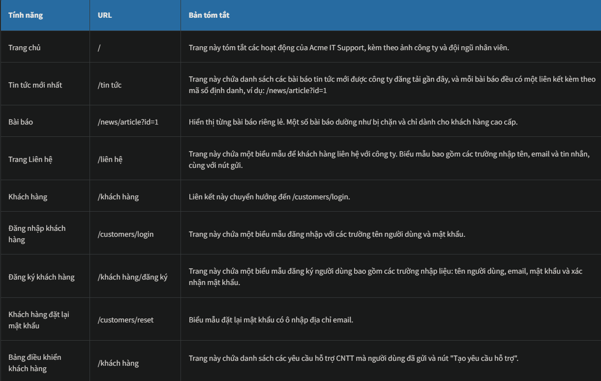

# Walking An Application 
## 1. Walking An Application (*Tìm hiểu về Web App*)
Trong phòng học này, bạn sẽ học cách tự mình kiểm tra tính bảo mật của một ứng dụng web chỉ bằng các công cụ tích hợp sẵn trong trình duyệt. Thông thường, các công cụ và kịch bản bảo mật tự động sẽ bỏ sót nhiều lỗ hổng tiềm ẩn và thông tin hữu ích.

Dưới đây là tóm tắt ngắn gọn về các công cụ trình duyệt tích hợp sẵn mà bạn sẽ sử dụng trong suốt phòng học này:
- **View Source**: Sử dụng trình duyệt của bạn để xem mã nguồn dễ đọc của một trang web.
- **Inspector**: Tìm hiểu cách kiểm tra các thành phần trang và thực hiện thay đổi để xem nội dung thường bị ẩn
- **Debugger**: Kiểm tra và điều khiển luồng JavaScript của trang.
- **Network**: Xem tất cả các yêu cầu mạng mà một trang thực hiện

## 2. Explorer the Website
Với tư cách là một chuyên gia kiểm thử xâm nhập, vai trò của bạn khi xem xét một trang web hoặc ứng dụng web là phát hiện các tính năng có khả năng dễ bị tổn thương và cố gắng khai thác chúng để đánh giá xem chúng có thực sự dễ bị tấn công hay không. Những tính năng này thường là các phần của trang web yêu cầu sự tương tác với người dùng.

Việc tìm kiếm các phần tương tác của trang web có thể dễ dàng như việc phát hiện một biểu mẫu đăng nhập hoặc đơn giản như việc tự mình xem xét mã JavaScript của trang web. Một cách tuyệt vời để bắt đầu là chỉ cần sử dụng trình duyệt của bạn để khám phá trang web và ghi lại các trang/khu vực/tính năng riêng lẻ, kèm theo tóm tắt cho mỗi mục.

## 3. Viewing the Page Source (*Xem mã nguồn của trang*)
Mã nguồn trang là đoạn mã mà con người có thể đọc được, được máy chủ web trả về trình duyệt/máy khách của chúng ta mỗi khi chúng ta thực hiện một yêu cầu.

Mã trả về bao gồm HTML (Ngôn ngữ đánh dấu siêu văn bản), CSS (Bảng định kiểu xếp tầng) và JavaScript, và chính mã này cho trình duyệt biết nội dung nào cần hiển thị, cách hiển thị nội dung đó và bổ sung yếu tố tương tác bằng JavaScript

Đối với mục đích của chúng ta, việc xem mã nguồn trang có thể giúp chúng ta khám phá thêm thông tin về ứng dụng web.

### Hãy cùng xem mã nguồn trang!
Hãy thử xem mã nguồn trang chủ của trang web Hỗ trợ CNTT Acme. Thật không may, việc giải thích mọi thứ bạn thấy ở đây nằm ngoài phạm vi của cuộc thảo luận này, và bạn cần tham gia các khóa học thiết kế/phát triển website để hiểu đầy đủ hơn. Điều chúng ta có thể làm là chọn ra những thông tin quan trọng đối với chúng ta.

Ở đầu trang, bạn sẽ thấy một số đoạn mã bắt đầu <!--và kết thúc bằng --> dấu gạch ngang. Đây là các chú thích. Chú thích là những thông báo do nhà phát triển trang web để lại, thường là để giải thích điều gì đó trong mã cho các lập trình viên khác hoặc thậm chí là ghi chú/nhắc nhở cho chính họ. Những chú thích này không được hiển thị trên trang web thực tế. Chú thích này mô tả trang chủ hiện tại chỉ là tạm thời trong khi trang chủ mới đang được phát triển. Xem trang web trong chú thích để nhận được cờ đầu tiên của bạn.

Các liên kết đến các trang khác nhau trong HTML được viết bằng thẻ neo (đây là các phần tử HTML bắt đầu bằng `<a>`), và liên kết mà bạn sẽ được chuyển hướng đến được lưu trữ trong attribute `href`

Nếu bạn xem thêm mã nguồn trang ở phía dưới, sẽ có một liên kết ẩn đến một trang bắt đầu bằng "secr", hãy xem liên kết này để nhận được một cờ khác. Rõ ràng bạn sẽ không nhận được cờ trong tình huống thực tế, nhưng bạn có thể phát hiện ra một số khu vực riêng tư được doanh nghiệp sử dụng để lưu trữ thông tin công ty/nhân viên/khách hàng.

Các tệp bên ngoài như CSS, JavaScript và hình ảnh có thể được bao gồm bằng mã HTML. Trong ví dụ này, bạn sẽ nhận thấy rằng tất cả các tệp này đều được lưu trữ trong cùng một thư mục. Nếu bạn xem thư mục này trong trình duyệt web của mình, sẽ có lỗi cấu hình. Những gì đáng lẽ phải hiển thị là một trang trống hoặc trang 403 Forbidden với thông báo lỗi cho biết bạn không có quyền truy cập vào thư mục. Thay vào đó, tính năng liệt kê thư mục đã được bật, trên thực tế, nó liệt kê mọi tệp trong thư mục. Đôi khi điều này không phải là vấn đề, và tất cả các tệp trong thư mục đều an toàn để công chúng xem, nhưng trong một số trường hợp, các tệp sao lưu, mã nguồn hoặc thông tin bí mật khác có thể được lưu trữ ở đây. Trong trường hợp này, chúng ta nhận được một cờ trong tệp `flag.txt`.

Nhiều trang web hiện nay không được xây dựng từ đầu mà sử dụng cái gọi là framework. Framework là một tập hợp các đoạn mã được viết sẵn, cho phép nhà phát triển dễ dàng tích hợp các tính năng phổ biến mà một trang web cần, chẳng hạn như blog, quản lý người dùng, xử lý biểu mẫu, và nhiều hơn nữa, giúp nhà phát triển tiết kiệm hàng giờ hoặc thậm chí hàng ngày phát triển.

Xem mã nguồn trang thường có thể cung cấp cho chúng ta manh mối về việc liệu framework có đang được sử dụng hay không, và nếu có, đó là framework nào và thậm chí là phiên bản nào. Biết được framework và phiên bản có thể là một phát hiện mạnh mẽ vì có thể có các lỗ hổng bảo mật công khai trong framework, và trang web có thể không sử dụng phiên bản mới nhất. Ở cuối trang, bạn sẽ tìm thấy một bình luận về framework và phiên bản đang được sử dụng cùng với một liên kết đến trang web của framework. Khi xem trang web của framework, bạn sẽ thấy rằng trang web của chúng ta thực sự đã lỗi thời. Hãy đọc thông báo cập nhật và sử dụng thông tin bạn tìm thấy để phát hiện ra một flag khác.

### 4. DevTools - Inspector

### 5. DevTools - Debugger

### 6. DevTools - Network

