# Guided Pentest: Web

### 1. Introduction
#### Mục tiêu học tập
- **Reconnaissance and enumeration** (Trinh sát và điều tra): Khám phá những gì ứng dụng tiết lộ
- **Insecure Direct Object Reference** (IDOR): Truy cập dữ liệu của người dùng khác
- **Weak password reset** (Cơ chế đặt lại mật khẩu yếu): Chiếm đoạt tài khoản thông qua cơ chế thiết lập lại thiếu sót
- **Admin panel access** (Truy cập bảng điều kiển của Admin): Leo thang từ người dùng thông thường lên Admin
- **Remote code execution**: Thực thi lệnh từ xa
### 2. Reconnaissance and enumeration
Trước khi động vào 1 web app nào đó thì bước đầu tiên luôn là trinh thám và điều tra những thông tin cần thiết liên quan để có thể làm tiếp đến những bước tiếp theo

#### 1. Port Scanning
Tìm những dịch vụ đang chạy trên IP, ta sẽ sử dụng `nmap`

```bash
nmap -sV -sC -p- 10.48.132.115
```

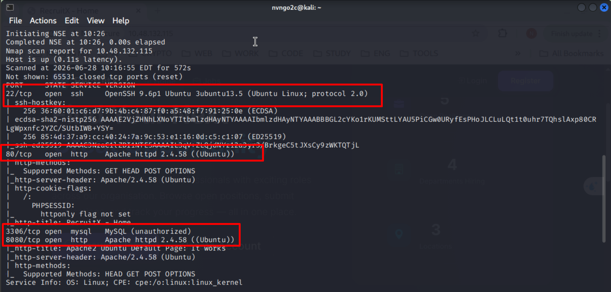

--> Sau khi quét ta được những port:
- `22`: SSH
- `80`, `8080`: chạy máy chủ web dịch vụ _Apache_ phiên bản `2.4.58` 
- `3306`: cổng của dịch vụ `MySQL`

#### 2. Exploring the Application
Sử dụng `curl` kết hợp `-i` - chỉ lấy Header --> Cùng với những thông tin port đã quét được để suy ra được kiến trúc của web

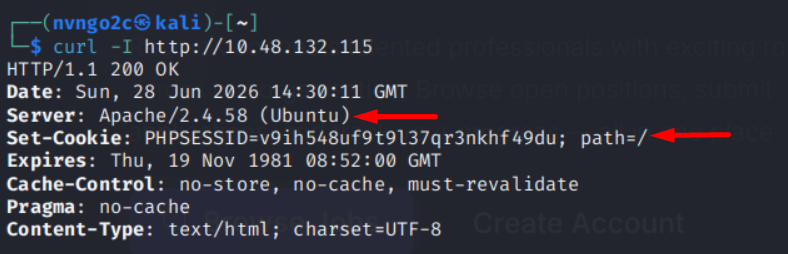

--> Ta có thể phân tích được web đang chạy theo kiến trúc `LAMP`:
- Linux
- Apache
- MySQL
- PHP

#### 3. Directory Enumeration

Lấy những thư mục ẩn của web bằng `gobuster`

```bash
gobuster dir -u http://10.48.132.115 -w /usr/share/wordlists/dirbuster/directory-list-2.3-small.txt -x php 
```

`-x php` giúp tự thêm đuôi file vào sau mỗi thư mục để mở rộng khả năng tìm kiếm. VD: `admin` --> `admin.php`

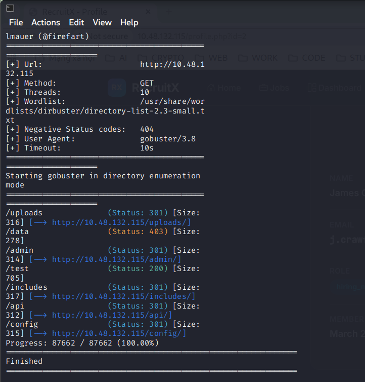

#### 4. Exploring the API
Khai phá API

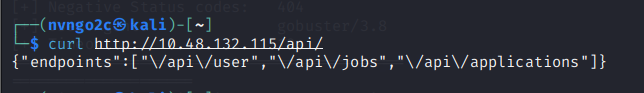


Vì bước trước ta đã dò được đường dẫn API, nên ta xem thử những `API endpoint`


### 3. IDOR

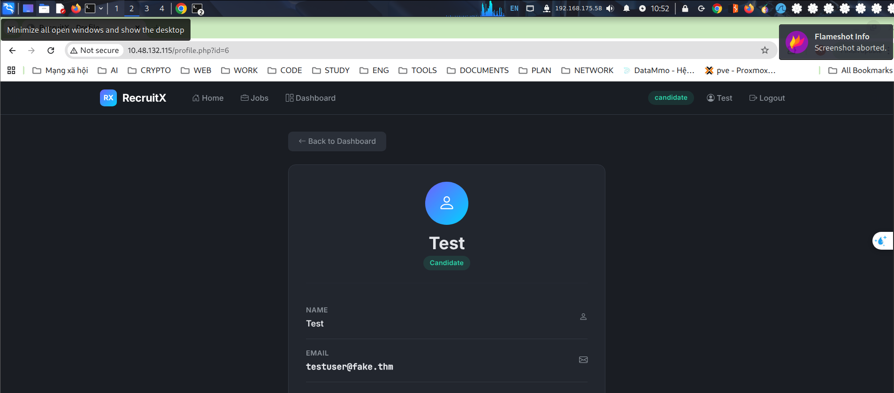

Khi vào profile cá nhân, ta để ý trên URL có tham số ID, và ID của chúng ta là `6`\
Điều gì xảy ra khi thay đổi tham số đó sang giá trị khác

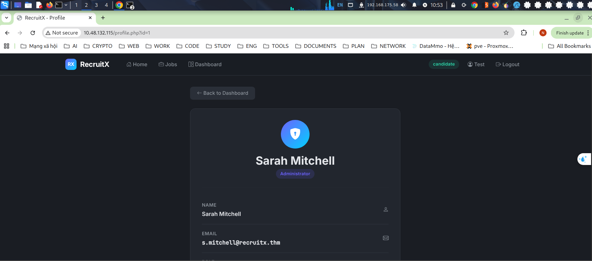

Ta thấy rằng chỉ cần thay đổi tham số thì ta sẽ chuyển sang profile của người có ID tương ứng mà ta chuyển

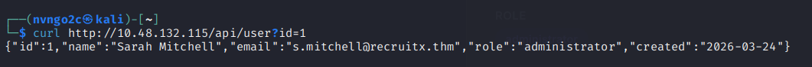

Ta thử với API thì vấn đề tương tự cũng xảy ra, thậm chí còn đầy đủ hơn dưới dạng `JSON`

Các lỗ hổng IDOR luôn được xếp hạng trong số các lỗi ứng dụng web phổ biến nhất. Chúng xảy ra do các nhà phát triển cho rằng người dùng sẽ chỉ truy cập vào tài nguyên của riêng họ, một giả định sẽ phá vỡ thời điểm ai đó thay đổi tham số URL. Cách khắc phục rất đơn giản: máy chủ phải xác minh rằng người dùng hiện được xác thực có quyền truy cập vào đối tượng được yêu cầu. Nhưng trên thực tế, việc kiểm tra này thường xuyên bị thiếu.

### 4. Week Password Reset
Các bước trước đó ta đã lấy được email của Admin là `s.mitchell@recruitx.thm`, chúng ta có thể dò mật khẩu, nhưng điều đó khá tốn thời gian và có thể là bất khả thi\
Thay vào đó, ta tập trung vào chức năng đổi mật khẩu của web, đây là 1 trong những chức năng có thể bị lỗi ngay cả trong thực tế

Trước khi làm bằng tài khoản Admin, ta thực hiện trước bằng tài khoản test của ta: `testuser@fake.thm`

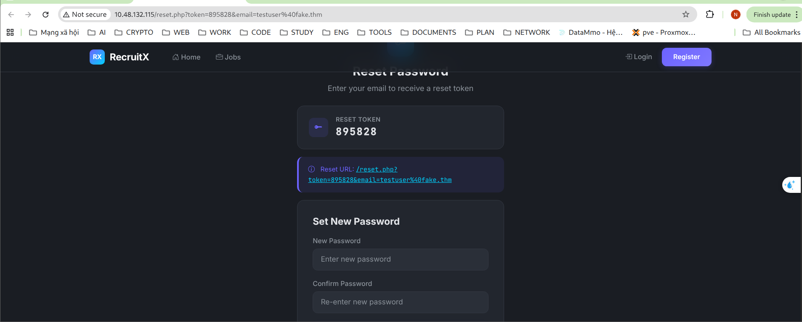

Thông thường, Token sẽ được gửi về mail của người dùng, nhưng ở đây, nó đã in trực tiếp ra màn hình\
Ta có thể truy cập bằng URL đính kèm Token để có thể đổi mật khẩu 1 cách dễ dàng

Tương tự với tài khoản Admin, ta đổi mật khẩu và đăng nhập vào

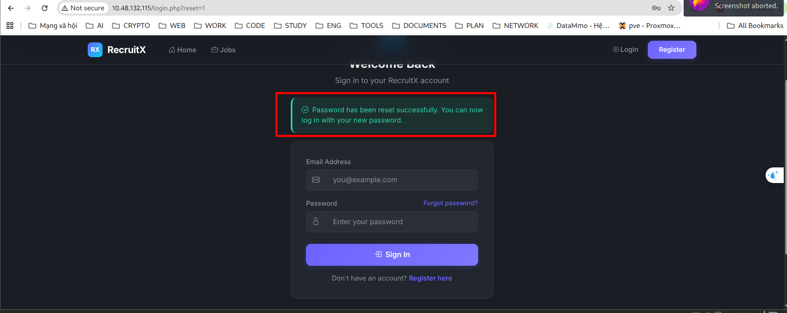

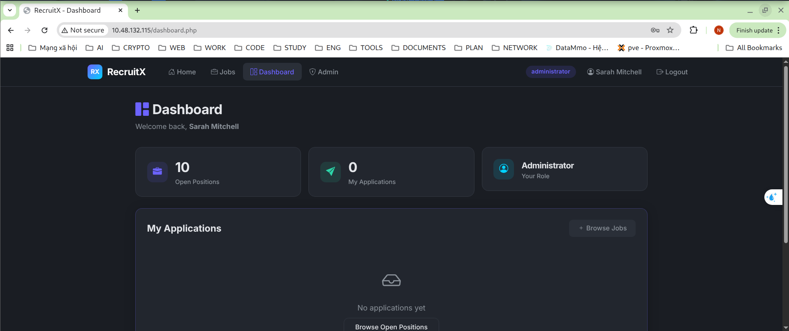


Bây giờ chúng tôi đã đăng nhập với tư cách quản trị viên. Chúng ta hãy dành chút thời gian để tìm hiểu chuỗi cho đến nay: chúng tôi đã sử dụng IDOR để khám phá email của quản trị viên, sau đó khai thác cơ chế đặt lại mật khẩu yếu làm lộ mã thông báo trực tiếp trong phản hồi. Không phải riêng lỗ hổng nào cũng có thể cấp cho chúng tôi quyền truy cập quản trị viên, nhưng khi kết hợp với nhau, chúng có sức tàn phá khủng khiếp.

Điều gì đã xảy ra:
Cơ chế đặt lại mật khẩu có ba lỗi khác nhau:
- Mã thông báo được hiển thị để phản hồi: Mã thông báo chỉ được gửi đến email của chủ sở hữu tài khoản, không bao giờ được hiển thị trên màn hình.
- Tạo mã thông báo yếu - Mã thông báo số gồm sáu chữ số có không gian phím nhỏ và dễ bị tấn công vũ phu.
- Không giới hạn tỷ lệ - Ứng dụng không giới hạn số lượng yêu cầu đặt lại hoặc đoán mã thông báo.

### 5. Admin Panel Access
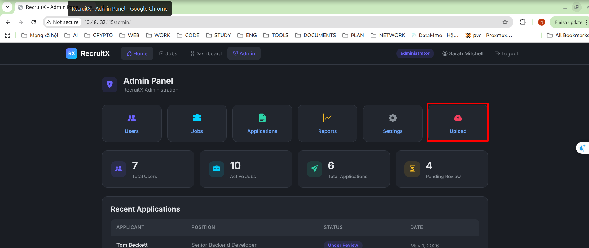

Khi đăng nhập được vào tài khoản Admin, ta có thể thấy được những chức năng cần thiết của Admin. Nhưng trong đó, ta thấy có 1 chức năng có thể có lỗ hổng RCE, đó chính là chức năng `Upload`

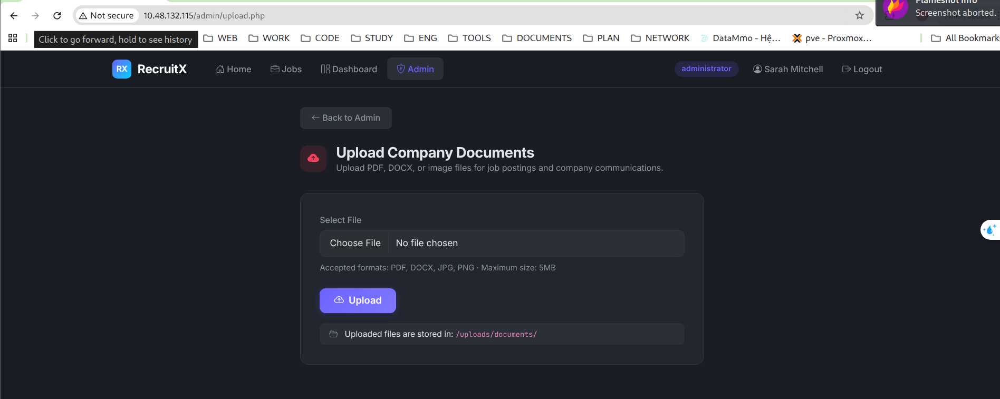

Ta có thể thấy web có ghi là chỉ chấp nhận những định dạng đơn giản như `PDFX`, `DOCX`, `JPG`, `PNG`\
Và thư mục lưu những file đã up lên là `/uploads/documents/`

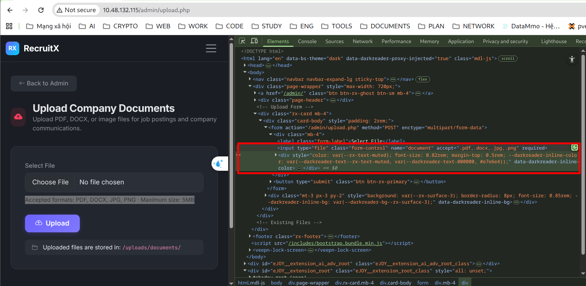

Mở Devtools thì ta thấy được web có lẽ chỉ xác minh file ở phần đuôi file và chỉ ở client 

Nhưng khi thử xóa phần xác thực bên client, ta thấy server vẫn kiểm tra, chứng tỏ có cả xác thực phía server

--> Thử gửi file `.php` thì thấy server bỏ qua, nhưng chuyển file thành `.phtml` 

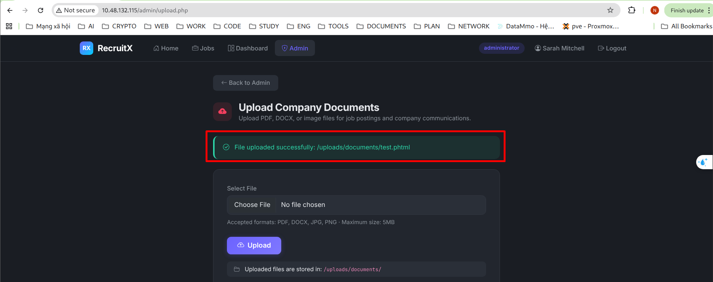

Thì web vẫn cho phép

--> Truy cập vào file đó

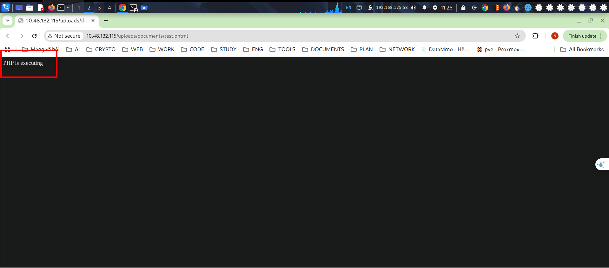

Ta thấy file `PHP` đã được thực thi

### 6. Remote Code Excution
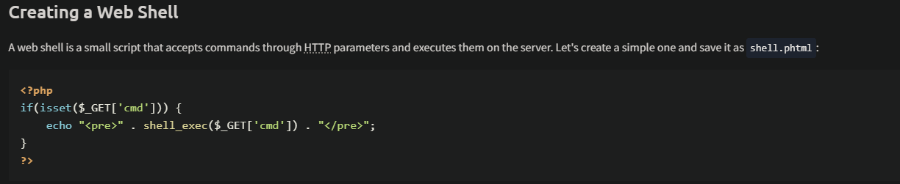

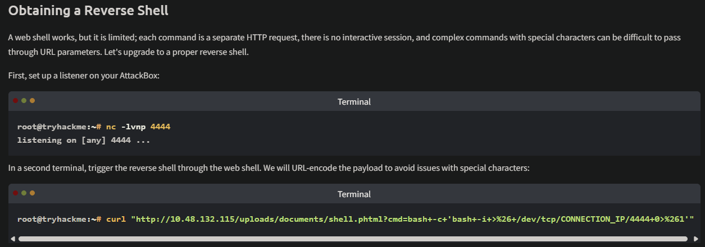

### 8. Conclusion
Trong phòng này, chúng tôi đã thực hiện một cuộc kiểm tra thâm nhập ứng dụng web hoàn chỉnh, từ lần quét Nmap ban đầu đến việc thực thi mã từ xa trên máy chủ cơ bản. Trong quá trình này, bạn đã rèn luyện tư duy phân biệt người kiểm tra thâm nhập tốt với người giỏi: sự kiên nhẫn, khả năng quan sát và khả năng kết nối các phát hiện giữa các phần khác nhau của ứng dụng.

Hãy tóm tắt lại những bài học quan trọng từ sự tham gia này:

- Việc liệt kê là tất cả. Các lỗ hổng mà chúng tôi khai thác có thể được phát hiện vì chúng tôi đã dành thời gian để lập bản đồ cấu trúc, tiêu đề, điểm cuối và hành vi của ứng dụng trước khi thử khai thác.
- Những sai sót nhỏ sẽ tạo thành những thỏa hiệp lớn. Không có vấn đề nào ở đây là kỳ lạ hoặc đặc biệt phức tạp. IDOR, đặt lại mật khẩu yếu và bỏ qua tải lên là những lỗ hổng được hiểu rõ. Tác động của họ đến từ cách họ kết nối với nhau.
- Hạn chế phía client không phải là bảo mật. Biểu mẫu tải tệp lên đã sử dụng thuộc tính chấp nhận để hạn chế các loại tệp trong trình duyệt. Quá trình kiểm tra phía máy chủ đã sử dụng danh sách chặn bỏ sót các phần mở rộng PHP thay thế. Bảo mật thực sự yêu cầu xác thực phía máy chủ bằng cách tiếp cận danh sách cho phép.
- Cơ chế đặt lại mật khẩu đáng được quan tâm cẩn thận. Chúng rất phức tạp để triển khai một cách an toàn và một lỗi thiết kế duy nhất, chẳng hạn như làm lộ mã thông báo trong phản hồi, có thể dẫn đến việc chiếm đoạt tài khoản.
- Hãy suy nghĩ như một kẻ tấn công, báo cáo như một nhà tư vấn. Tìm ra các lỗ hổng là một nửa công việc. Ghi lại chúng một cách rõ ràng với xếp hạng mức độ nghiêm trọng và lời khuyên khắc phục có thể thực hiện được là điều làm cho sự tham gia trở nên có giá trị đối với khách hàng.
- 
Bạn đã hoàn thành pentest được hướng dẫn. Đã đến lúc áp dụng những gì bạn đã học được vào những thử thách sắp tới. 

