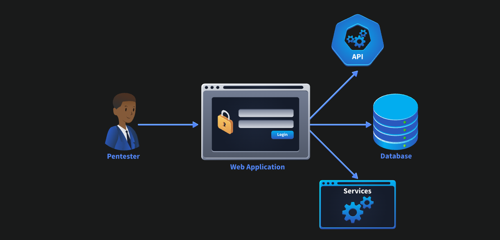
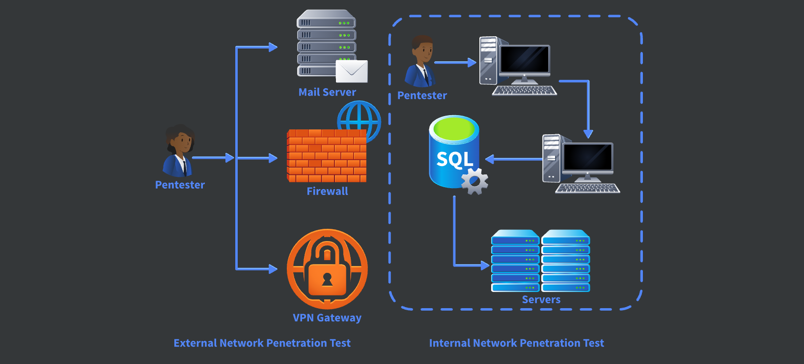

# Dive Into Pentesting
## 1. Introduction
### Khái niệm
- Kiểm thử bảo mật **được cấp phép** để tìm lỗ hổng trước hacker.
- Mục tiêu: Tìm lỗ hổng → Đánh giá rủi ro → Đề xuất khắc phục.

### Pentest vs Hacker
- Pentest: Có phép, có phạm vi, có báo cáo.
- Hacker: Không phép, khai thác để trục lợi.

### Phạm vi
- **Web:** Authentication, Authorization, Input Validation, Session, API.
- **Network:** Port, Service, OS, Misconfiguration, Password.

### Khái niệm quan trọng
- **Vulnerability:** Lỗ hổng.
- **Threat:** Mối đe dọa.
- **Risk:** Rủi ro.

> **Risk = Vulnerability × Threat**

### Quản lý rủi ro
- Identify → Assess → Treat → Monitor.
- Treat:
  - Mitigate (Giảm)
  - Accept (Chấp nhận)
  - Transfer (Chuyển giao)

### Nguyên nhân lỗ hổng
- Human error
- Software bugs
- System complexity
- Over-customisation
- Design/Technical flaws

### Mindset Pentester
- Chú ý chi tiết.
- Hiểu ngữ cảnh.
- Không phụ thuộc tool.
- Tránh tunnel vision.

### Best Practices
- Ghi chú đầy đủ.
- Thu thập bằng chứng.
- Quản lý thời gian.
- Giao tiếp tốt.
- Chuyên nghiệp.

### Ethics
- Có sự cho phép.
- Đúng phạm vi.
- Bảo mật thông tin.
- Trung thực.

## 2. Penetration testing and Malicious testing
### What is Penetration Testing?

- Kiểm thử bảo mật **được cấp phép (authorized)** trên hệ thống, ứng dụng hoặc mạng.
- Mục tiêu:
  - Tìm lỗ hổng trước kẻ tấn công.
  - Đánh giá mức độ rủi ro.
  - Đề xuất khắc phục.
- Giúp bảo vệ dữ liệu, đáp ứng các tiêu chuẩn bảo mật và đảm bảo hệ thống an toàn.

#### Penetration Testing vs Malicious Hacking

| Penetration Tester | Malicious Attacker |
|--------------------|--------------------|
| Có sự cho phép (Authorization) | Không có sự cho phép |
| Có phạm vi rõ ràng (Scope) | Không giới hạn phạm vi |
| Đánh giá toàn diện hệ thống (Coverage) | Chỉ tập trung mục tiêu mang lại lợi ích |
| Chịu trách nhiệm, chuyên nghiệp (Responsibility) | Không chịu trách nhiệm về thiệt hại |

## 3. Penetration Testing Focus Areas
1. Web Application Penetration Testing

Mục tiêu: Tìm lỗ hổng trong ứng dụng web thông qua giao diện người dùng (UI) và API.

Các khu vực kiểm tra:

- Authentication (Xác thực): mật khẩu, MFA, brute-force, credential stuffing, reset password.
- Authorisation (Phân quyền): kiểm tra người dùng chỉ truy cập đúng quyền, chống privilege escalation.
- Session Management (Quản lý phiên): session fixation, logout, timeout, cookie bảo mật, CSRF.
- Input & Output Validation (Kiểm tra dữ liệu vào/ra): chống injection, kiểm tra kiểu dữ liệu, xử lý đầu ra.
- Security Configuration (Cấu hình bảo mật): security headers, error handling, rate limiting, mã hóa, dịch vụ không cần thiết.



2. Network Penetration Testing

Mục tiêu: Tìm lỗ hổng trong hạ tầng mạng.

**External Network Pentest**
- Góc nhìn từ Internet.
- Đánh giá:
    - Internet-facing servers
    - Firewalls
    - VPN gateways
    - Remote access (SSH, RDP,...)
**Internal Network Pentest**
- Giả định attacker đã xâm nhập mạng (assumed breach).
- Kiểm tra:
    - Lateral movement
    - Privilege escalation
    - Truy cập dữ liệu nhạy cảm
    - Network segmentation
Trust relationships
3. Các khu vực kiểm tra trong Network
- Authentication mechanisms: password policy, MFA, credential reuse, default credentials.
- Authorisation & Access Controls: quyền truy cập tài nguyên.
- Network Segmentation & Trust Relationships: firewall rules, phân vùng mạng, isolation.
- Configuration & Patch Management: phần mềm lỗi thời, cấu hình mặc định không an toàn, giao thức mã hóa yếu.



## 4. Vulnerability, Threat, Risk

1. Vulnerability (Lỗ hổng)

Định nghĩa: Điểm yếu trong hệ thống có thể bị khai thác.

- Do lỗi lập trình.
- Cấu hình không an toàn.
- Thiết kế hệ thống chưa tốt.
- Bản mềm/phần mềm lỗi thời.

Ví dụ:\
Web server chạy phiên bản cũ có lỗ hổng.\
Chỉ có lỗ hổng thì chưa gây hại, phải có người hoặc thứ gì đó khai thác.

2. Threat (Mối đe dọa)

Định nghĩa: Bất kỳ tác nhân nào có thể khai thác lỗ hổng để gây hại.

Có thể là:

2. Threat (Mối đe dọa)

Định nghĩa: Bất kỳ tác nhân nào có thể khai thác lỗ hổng để gây hại.

Có thể là:

- Insider.
- Malware.
- Công cụ tự động.
- AI.
- Lỗi con người.
- Thiên tai.

Ví dụ:

Hacker quét Internet để tìm server chưa cập nhật.

3. Risk (Rủi ro)

Định nghĩa: Mức độ thiệt hại nếu Threat khai thác thành công Vulnerability.

Công thức ghi nhớ
```
Vulnerability × Threat = Risk
```

(Đây chỉ là mô hình đơn giản để giải thích mối quan hệ.)

Risk phụ thuộc vào:

- Impact (Mức độ ảnh hưởng)
- Likelihood (Khả năng bị khai thác)

**Ví dụ**\
**Low Risk**\
Vulnerability: Hiện thông báo lỗi chi tiết (Verbose Error Messages).\
Threat: Hacker cố tình gây lỗi để thu thập thông tin.\
Risk: Rò rỉ một ít thông tin phục vụ reconnaissance.

**High Risk**
Vulnerability: Broken Access Control.\
Threat: Hacker sửa Account ID để xem dữ liệu người khác.\
Risk: Lộ hoặc chỉnh sửa dữ liệu khách hàng → vi phạm bảo mật.

### Risk Management (Quản lý rủi ro)

Quy trình gồm 4 bước:

1. Identification (Xác định)
2. Analysis (Phân tích)
3. Mitigation (Giảm thiểu)
4. Monitoring (Giám sát)

*Ngoài Mitigation còn có*\
**Accept Risk (Chấp nhận rủi ro)**

Áp dụng khi:
- Rủi ro nhỏ.
- Chi phí sửa lớn hơn lợi ích.

**Transfer Risk (Chuyển giao rủi ro)**

Chuyển trách nhiệm cho bên thứ ba.\
Ví dụ:
- Mua Cyber Insurance.
- Nếu bị Data Breach thì bảo hiểm chịu một phần chi phí.

## 5. Why Vulnerabilities Exsist


Lỗ hổng tồn tại vì phần mềm và hệ thống được thiết kế, phát triển, cấu hình và vận hành bởi con người. Sai sót trong lập trình, cấu hình hoặc thiết kế đều có thể tạo ra điểm yếu để kẻ tấn công khai thác.

### 1. Human Assumptions (Giả định của con người)

Nhà phát triển hoặc quản trị viên đưa ra giả định sai về cách người dùng sử dụng hệ thống.

- Tin rằng người dùng chỉ upload ảnh.
- Không kiểm tra (validate) dữ liệu đầu vào.

**Ví dụ:** Unrestricted File Upload → Hacker upload web shell.

---

### 2. Software Bugs (Lỗi phần mềm)

Lỗi lập trình hoặc kiểm tra dữ liệu không đầy đủ tạo ra lỗ hổng.

Nguyên nhân:
- Lỗi logic.
- Thiếu kiểm tra đầu vào.
- Code không an toàn.

**Ví dụ:** SQL Injection do ghép trực tiếp dữ liệu người dùng vào câu lệnh SQL.

---

### 3. System Complexity (Độ phức tạp của hệ thống)

Hệ thống hiện đại gồm nhiều thành phần kết nối với nhau như API, Microservices, Database và dịch vụ bên thứ ba.

- Càng nhiều thành phần → càng dễ cấu hình sai (Misconfiguration).
- Cấu hình sai có thể tạo ra lỗ hổng.

**Ví dụ:** Exposed Admin API do cấu hình sai API quản trị.

---

### 4. Over-Customisation (Tùy chỉnh quá mức)

Tự xây dựng quá nhiều chức năng thay vì sử dụng giải pháp chuẩn.

Hậu quả:
- Khó bảo trì.
- Khó cập nhật.
- Không tuân theo chuẩn bảo mật.

**Ví dụ:** Weak Authentication do thuật toán băm yếu hoặc quản lý Session không an toàn.

---

### 5. Technical & Design Flaws (Lỗi kỹ thuật và thiết kế)

Bảo mật không được đưa vào ngay từ giai đoạn thiết kế, hoặc thêm tính năng bảo mật sau nhưng không thay đổi luồng xử lý.

**Ví dụ:** MFA Bypass do Session Cookie được cấp trước khi hoàn thành MFA.

---

### Tóm tắt

| Nguyên nhân | Lỗ hổng có thể gây ra |
|-------------|-----------------------|
| Human Assumptions | Unrestricted File Upload |
| Software Bugs | SQL Injection |
| System Complexity | Exposed Admin API |
| Over-Customisation | Weak Authentication |
| Technical & Design Flaws | MFA Bypass |

## 6. The Pentester Mindset
### Good Mindset

- Understand the system → Hiểu hệ thống trước khi test.
- Attention to detail → Chú ý chi tiết.
- Stay curious → Luôn hỏi "What if?".
- Prioritise critical areas → Ưu tiên chức năng quan trọng.
- Think in context → Xem xét tác động thực tế.
- Think creatively → Sáng tạo, kết hợp nhiều lỗ hổng.

### Bad Mindset

- Rush to exploit → Khai thác quá sớm.
- Ignore context → Chỉ quan tâm kỹ thuật.
- Over-rely on tools → Phụ thuộc tool.
- Make assumptions → Tự suy đoán.
- Tunnel vision → Chỉ tập trung một hướng.
- Blindly follow checklist → Chỉ làm theo checklist.

### Best Practices

- Good notes → Ghi chú đầy đủ.
- Collect evidence → Thu thập bằng chứng.
- Manage time → Quản lý thời gian, report song song.
- Proactive communication → Chủ động cập nhật, báo blocker.
- Stay professional → Chuyên nghiệp, đúng scope, bảo mật dữ liệu.

### Communication

Khi báo cáo:
- Giải thích **Business Impact** trước.
- Không chỉ nói Technical Details.
- Giúp Stakeholders hiểu mức độ nghiêm trọng.

## 7. Ethic, Permission and Trust
### Ethics (Đạo đức)

- Respect scope → Không vượt phạm vi.
- Avoid disruption → Không làm gián đoạn hệ thống.
- Handle sensitive data responsibly → Bảo mật dữ liệu.
- Report unexpected access → Báo ngay nếu truy cập ngoài phạm vi.
- Redact sensitive data → Che dữ liệu nhạy cảm trong báo cáo.

### Permission (Sự cho phép)

- Written authorisation → Có văn bản cho phép.
- Define & follow scope → Xác định và tuân thủ phạm vi.
- Confirm testing window/method → Xác nhận thời gian & phương pháp test.
- Ask when unsure → Hỏi khi chưa rõ.
- Pause if out of scope → Dừng và thông báo nếu vượt phạm vi.

### Trust (Niềm tin)

- Give regular updates → Cập nhật tiến độ.
- Be transparent → Minh bạch về blocker/hạn chế.
- Report accurately → Báo cáo chính xác.
- Provide actionable recommendations → Đưa ra cách khắc phục.
- Adapt communication → Giao tiếp phù hợp với từng đối tượng.

### Ghi nhớ

**Ethics + Permission + Trust**
→ Professional + Reliable + Safe Penetration Testing.

