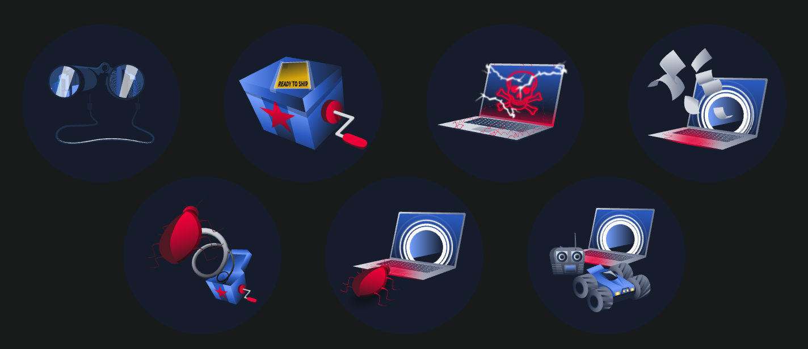

# Cyber Kill Chain
## 1. Introduction

Cyber Kill Chain\
- Được Lockheed Martin giới thiệu năm 2011, lấy cảm hứng từ Military Kill Chain.
- Là framework mô tả 7 giai đoạn của một cuộc tấn công mạng, giúp tổ chức hiểu cách hacker hoạt động để phát hiện và ngăn chặn cuộc tấn công ở từng bước.

### 7 giai đoạn
- Reconnaissance (Trinh sát)\
Thu thập thông tin mục tiêu (OSINT, quét cổng, DNS, email...).
- Weaponisation (Chuẩn bị vũ khí)\
Tạo hoặc tùy chỉnh payload/exploit phù hợp với lỗ hổng của mục tiêu.
- Delivery (Phát tán)\
Gửi payload đến nạn nhân (email phishing, USB, website độc hại...).
- Exploitation (Khai thác)\
Payload khai thác lỗ hổng để thực thi mã độc.
- Installation (Cài đặt)\
Cài malware/backdoor để duy trì quyền truy cập (persistence).
- Command & Control (C2)\
Hacker điều khiển máy đã bị xâm nhập từ xa.
- Actions on Objectives (Thực hiện mục tiêu)\
Đánh cắp dữ liệu, di chuyển ngang (lateral movement), mã hóa dữ liệu, leo thang đặc quyền,...

## 2. Reconnaissance

Mục đích: Thu thập thông tin về mục tiêu để tìm lỗ hổng (vulnerabilities) và điểm xâm nhập (entry points).

### Phân loại

- **Passive Reconnaissance (Thụ động)**
    - Không tương tác trực tiếp với mục tiêu → khó bị phát hiện.
    - Ví dụ: OSINT, WHOIS, DNS lookup, Website crawling/scraping, Social media, Google Dorking

- **Active Reconnaissance (Chủ động)**

    - Có tương tác với mục tiêu → dễ tạo dấu vết (noise).
    - Ví dụ: Social engineering, Network port scanning (*Nmap*), Vulnerability scanning, Physical reconnaissance (*khảo sát thực địa*)

**Countermeasures (Phòng thủ)**
- Giảm thông tin công khai:
    - Ẩn WHOIS.
    - Hạn chế thông tin trên website, DNS, mạng xã hội.
- Giám sát và phân tích:
    - Network traffic.
    - Service logs.
    - Phát hiện port scan và vulnerability scan.

## 3. Weaponisation

**Mục đích**: Tạo hoặc tùy chỉnh payload/exploit dựa trên thông tin thu thập được để khai thác lỗ hổng của mục tiêu.

### Hoạt động
- Dùng exploit có sẵn hoặc tự phát triển.
- Đóng gói exploit vào payload (EXE, Word, PDF,...).
- Obfuscation/Encryption để né phát hiện.
- Ẩn payload trong file trông bình thường.
- Kết thúc giai đoạn: tạo xong file độc hại sẵn sàng phát tán.

VD: Exploit Kit, Microsoft Office document chứa malicious, macros, File EXE/PDF độc hại, USB chứa malware, Chuẩn bị email phishing hoặc website để phát tán ở bước tiếp theo.

### Countermeasures (Phòng thủ)
- Đào tạo người dùng:
    - Cẩn thận với email và file đính kèm.
    - Kiểm tra nguồn email.
    - Cảnh giác với file ZIP có kèm mật khẩu.
- Giảm bề mặt tấn công (Attack Surface):
    - Gỡ phần mềm/plugin không cần thiết.
    - Tắt hoặc giới hạn Office Macros.
    - Áp dụng Windows Group Policy để thực thi chính sách bảo mật.

## 4. Delivery
**Mục đích**: Đưa payload đã chuẩn bị đến môi trường mục tiêu (target environment) bằng phương thức phù hợp.

Ví dụ
- Phishing email (file đính kèm hoặc link độc hại).
- Spear phishing (email giả mạo người quen/quản lý).
- Malicious web links (link giả mạo, URL rút gọn, domain spoofing).
- File-sharing platforms (Google Drive, Dropbox,... chứa file độc hại).
- Malvertising (quảng cáo độc hại).
- Smishing (SMS phishing).
- Social engineering (lừa người dùng tự chạy malware).
- Physical delivery (USB, DVD chứa mã độc).

### Countermeasures (Phòng thủ)
- Đào tạo nhận thức an toàn thông tin (Security Awareness).
- Email Filtering.
- Web Filtering.
- Web Application Firewall (WAF).
- Network Monitoring.
- Patch Management (quản lý và cập nhật bản vá).

## 5. Exploitation

**Mục đích**: Khai thác lỗ hổng (vulnerability) hoặc cấu hình yếu để thực thi payload và xâm nhập hệ thống.

**Ví dụ:**
- Mật khẩu yếu hoặc mặc định (Weak/Default Password).
- Phishing để đánh cắp thông tin đăng nhập.
- Software Vulnerabilities.
- Zero-day Exploit (khai thác lỗ hổng chưa có bản vá).
- SQL Injection.
- Buffer Overflow.
- System Misconfiguration.

**Countermeasures (Phòng thủ)**
- Áp dụng Password Policy mạnh.
- Bật Multi-Factor Authentication (MFA).
- Patch Management (cập nhật bản vá).
- Vulnerability Scanning (quét lỗ hổng).
- Intrusion Prevention System (IPS).
- Web Application Firewall (WAF):
    - SQL Injection.
    - Cross-Site Scripting (XSS).
    - Cross-Site Request Forgery (CSRF).

## 6. Installation

**Mục đích**: Thiết lập persistence để duy trì quyền truy cập sau khi khai thác thành công, tránh phải exploit lại.

Ví dụ
- Scheduled Task (Windows).
- Cron Job (Linux).
- Sửa startup scripts/configuration files.
- Cài Windows Service hoặc Linux Daemon.
- Cài:
    - Malware.
    - Backdoor.
    - Rootkit.
- LOLBins (Living-off-the-Land Binaries): Lợi dụng công cụ hợp pháp có sẵn trong hệ điều hành.
- Web Shell (điều khiển server qua giao diện web, thường chạy qua HTTPS để ngụy trang).
- Tải thêm payload để củng cố quyền truy cập.

**Countermeasures (Phòng thủ)**
- Giám sát process và service mới.
- EDR (Endpoint Detection and Response):
    - Process bất thường.
    - File bị sửa ở thư mục nhạy cảm.
    - Kết nối mạng bất thường.
- System Audit & Baseline Comparison:
    - Phát hiện tài khoản, service hoặc cấu hình bị thay đổi trái phép.
    - Configuration Management.
    - Application Allowlisting (chỉ cho phép ứng dụng được phê duyệt chạy).

## 7. Command and Control (**C2**)

**Mục đích**: Thiết lập kênh liên lạc bí mật (covert channel) giữa máy nạn nhân và hạ tầng của attacker để điều khiển từ xa.

**Ví dụ**
- Sử dụng giao thức phổ biến:
    - HTTP / HTTPS
    - DNS
    - SMTP
- HTTPS để mã hóa lưu lượng.
- DNS Tunnelling (ẩn dữ liệu trong truy vấn DNS).
- Dùng dịch vụ hợp pháp:
    - Dropbox.
    - Google Docs.
    - Mạng xã hội (ví dụ X DM).
- DGA (Domain Generation Algorithm):
    - Malware sinh hàng nghìn domain.
    - Attacker chỉ đăng ký một số domain.
    - Malware tự dò đến khi gặp domain còn hoạt động.
- Fast Flux:
    - Một domain ↔ nhiều IP.
    - IP thay đổi liên tục.
    - Thiết bị bị nhiễm (IoT, PC...) làm proxy che giấu C2 thật.

**Countermeasures (Phòng thủ)**
- Firewall.
- IDS / IPS.
- Network Monitoring.
- DNS Monitoring (phát hiện DNS Tunnelling, domain bất thường).
- Web Traffic Monitoring.
- URL / Content Filtering.
- HTTPS Inspection (SSL/TLS Inspection).
- Honeypot (phân tích hành vi attacker và C2).

## 8. Actions on Objectives

**Mục đích**: Sau khi có quyền điều khiển hệ thống qua C2, attacker thực hiện mục tiêu cuối cùng.

**Ví dụ**
- Data Exfiltration (đánh cắp dữ liệu).
- Ransomware (mã hóa dữ liệu để tống tiền).
- Financial Theft (gian lận tài chính, chuyển tiền trái phép).
- Destructive Attack (xóa/phá hủy dữ liệu, gây gián đoạn dịch vụ).
- Lateral Movement (di chuyển sang các hệ thống khác trong mạng).
- Industrial/Political Espionage (gián điệp công nghiệp/chính trị).
- Tấn công ICS (Industrial Control Systems).

**Countermeasures (Phòng thủ)**
- Data Loss Prevention (DLP).
- Backup & Recovery.
- Network Segmentation (phân đoạn mạng).
- Access Control.
- Principle of Least Privilege (PoLP).
- User Activity Monitoring.
- EDR (Endpoint Detection and Response).
