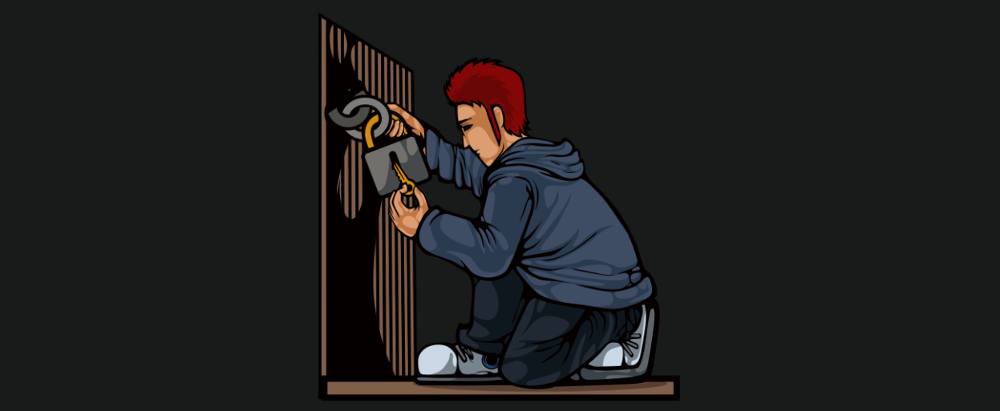
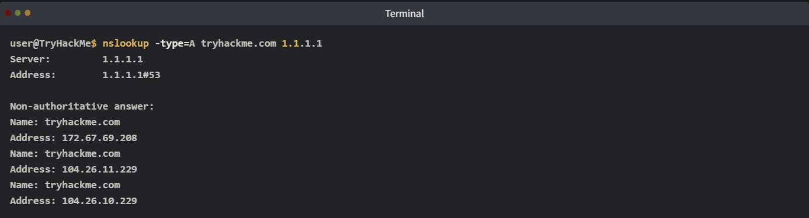
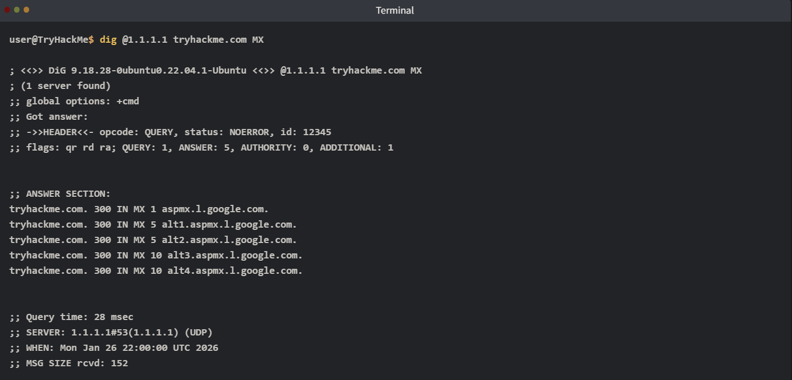
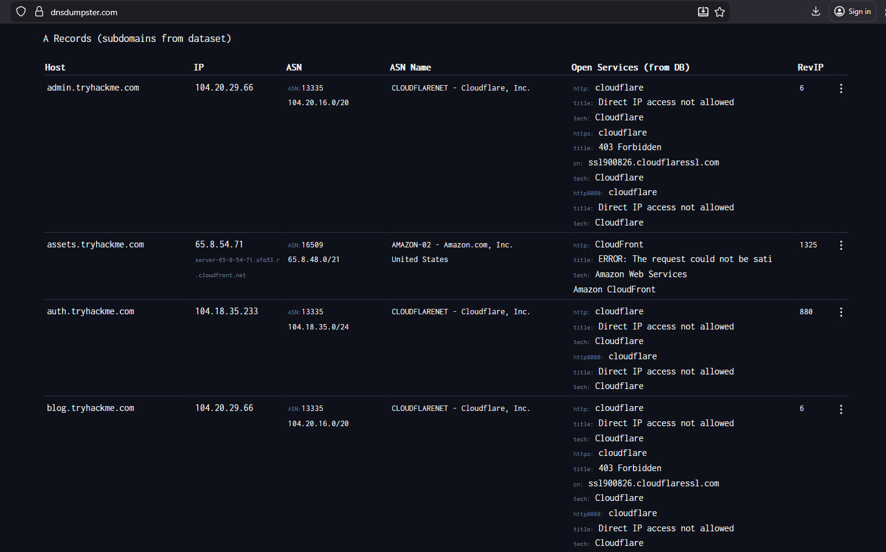
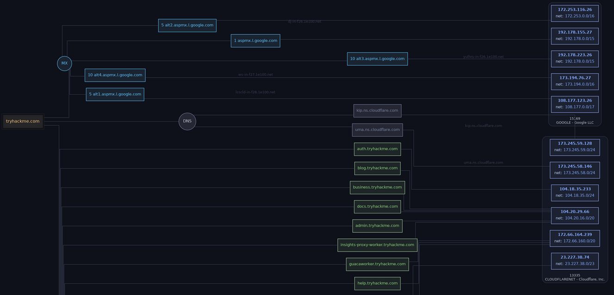
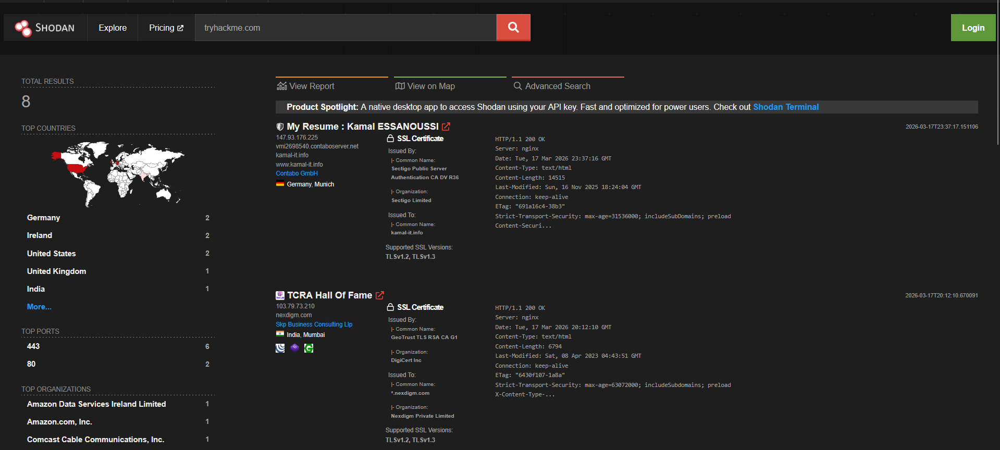

# Passive Reconnaissance
## 1. Introduction

### Khái niệm

- **Passive Reconnaissance**: Thu thập thông tin từ **nguồn công khai** mà **không tương tác trực tiếp với mục tiêu**, nên rất khó bị phát hiện.
- Khác với **Active Reconnaissance**: Có gửi request/tương tác trực tiếp đến hệ thống mục tiêu → có nguy cơ bị phát hiện.

### Vai trò

- Là một trong những giai đoạn **an toàn và hiệu quả nhất** trong:
  - Penetration Testing
  - Bug Bounty
  - Threat Hunting

- Dù có các luật bảo vệ dữ liệu (GDPR, CCPA), vẫn còn nhiều thông tin công khai có thể khai thác.

### Nguồn thông tin thường dùng

- **WHOIS** (thông tin đăng ký domain)
- **DNS Records**
- **Certificate Transparency Logs (crt.sh)**
- **Search Engines (Google Dorks)**
- **Shodan**
- **DNSDumpster**

### Mục tiêu học

- Sử dụng **whois** để xem thông tin domain.
- Sử dụng **dig** (hoặc **nslookup**) để truy vấn DNS.
- Hiểu vì sao WHOIS và DNS được xem là **passive**.
- Tìm **subdomain** bằng DNSDumpster và Certificate Transparency Logs.
- Thu thập thông tin dịch vụ công khai bằng **Shodan**.

## Lưu ý

- Nếu dùng **AttackBox miễn phí**, sẽ **không có Internet**.
- Muốn sử dụng các dịch vụ như **DNSDumpster**, **Shodan**, **crt.sh**... cần kết nối **OpenVPN** vào mạng TryHackMe.

> **Ý chính:** Passive Recon = **Thu thập thông tin công khai mà không chạm vào hệ thống mục tiêu**, giúp giảm nguy cơ bị phát hiện.

## 2. Passive Versus Active Recon
### Reconnaissance (Recon)

- Là giai đoạn **đầu tiên** trong quá trình tấn công hoặc pentest.
- Mục tiêu: **thu thập thông tin** về mục tiêu để tìm điểm yếu.
- Cũng giúp **defender** hiểu attacker có thể thu thập được gì từ nguồn công khai để giảm bề mặt lộ thông tin.

### Passive Reconnaissance

- Chỉ sử dụng **thông tin công khai (publicly available information)**.
- **Không gửi packet** và **không tương tác trực tiếp** với hệ thống mục tiêu.
- Nguy cơ bị phát hiện **rất thấp**.

#### Ví dụ
- WHOIS
- DNS records
- Google Dorks
- Certificate Transparency Logs
- Shodan
- DNSDumpster

#### Ví dụ thực tế
> Giống như **quan sát lãnh thổ của đối phương bằng ống nhòm từ xa**, không hề bước vào khu vực của họ.


#### Common Passive Recon Activities

- **Query DNS records**: Tra cứu bản ghi DNS công khai (A, MX, TXT, ...).
- **Certificate Transparency Logs**: Tìm subdomain và chứng chỉ SSL/TLS đã được cấp (ví dụ: **crt.sh**).
- **Job Postings**: Xem tin tuyển dụng (LinkedIn, Career) để suy ra **tech stack** của công ty.
- **Public Information**: Đọc tin tức, thông cáo báo chí hoặc tài liệu bị rò rỉ.
- **Shodan / Censys**: Tìm các thiết bị và dịch vụ đang public trên Internet.
- **GitHub**: Kiểm tra repository công khai để tìm:
  - Hardcoded credentials
  - API keys
  - Configuration files
  - Secrets

### Active Reconnaissance

- **Tương tác trực tiếp** với hệ thống mục tiêu để thu thập thông tin.
- Các request/probe có thể bị **ghi log**, **phát hiện** hoặc **chặn**.
- Nguy cơ bị phát hiện **cao hơn Passive Recon**.

#### Ví dụ
- Ping
- Nmap port scanning
- Banner grabbing
- Gobuster/Dirsearch
- Vulnerability scanning
- Truy cập trực tiếp website hoặc service

> **Ví dụ thực tế:** Giống như **đi đến tận cửa để thử khóa, kiểm tra camera và hệ thống báo động**.



### Common Active Recon Activities

- **Host Discovery**: Gửi packet để tìm host đang hoạt động (ICMP Ping, ARP).
- **Port Scanning / Service Enumeration**: Quét cổng và dịch vụ (Nmap, Masscan).
- **Web/API Interaction**:
  - Fuzzing endpoint
  - Directory brute-forcing (Gobuster, Dirsearch)
- **Social Engineering**:
  - Phishing
  - Vishing
  - Pretexting (giả danh để lấy thông tin)
- **Physical Recon**:
  - Tailgating
  - Giả làm nhà cung cấp (vendor)

### Đặc điểm

- Dễ bị phát hiện bởi:
  - IDS / IPS
  - WAF
  - Logging
- Nguy cơ bị chặn hoặc cảnh báo cao.
- Chỉ nên thực hiện khi có **ủy quyền rõ ràng** (Pentest Contract, Bug Bounty Scope).

> **Lưu ý:** Mọi **tương tác trực tiếp với nhân viên của mục tiêu** cũng được xem là **Active Recon**, kể cả **không gửi packet**.

## 3. **WHOIS**
### **Khái niệm**

- **WHOIS** là giao thức **query/response** (RFC 3912).
- Hoạt động trên **TCP port 43**.
- Dùng để truy vấn thông tin đăng ký của **domain name**.
- Dữ liệu được quản lý bởi **domain registrar**.

### Thông tin có thể thu được

- **Registrar**: Nhà đăng ký domain (Namecheap, GoDaddy,...).
- **Registrant**: Thông tin chủ sở hữu *(thường bị ẩn bởi GDPR/CCPA hoặc dịch vụ Privacy Protection)*.
- **Dates**:
  - Creation Date
  - Updated Date
  - Expiration Date
- **Name Servers**: DNS server có thẩm quyền của domain.
- **Domain Status**: Ví dụ `clientTransferProhibited`.
- **Abuse Contact**: Email/SĐT để báo cáo lạm dụng.

### Giá trị trong Passive Recon

Do thông tin cá nhân thường bị ẩn, attacker thường tập trung vào:

- Tuổi của domain (Creation Date).
- Thời điểm hết hạn (Expiration Date).
- Registrar (phục vụ social engineering/phishing).
- Name Servers.
- Lịch sử thay đổi WHOIS (owner, registrar, nameserver...).

> Có thể xem **WHOIS lịch sử** bằng các dịch vụ như **whoxy.com**.

### **WHOIS → RDAP**

Từ **28/01/2025**, **ICANN** chính thức thay thế WHOIS (đối với **gTLDs**) bằng **RDAP (Registration Data Access Protocol)**.

#### Ưu điểm của RDAP

- HTTPS (an toàn hơn).
- Trả về **JSON** (dễ xử lý).
- Hỗ trợ quốc tế hóa.
- Kiểm soát quyền truy cập dữ liệu tốt hơn.
- Phù hợp với GDPR và các quy định bảo vệ dữ liệu.

> WHOIS vẫn còn được hỗ trợ trên nhiều hệ thống, nhưng **RDAP là tiêu chuẩn hiện đại và chính thức**.

### Câu lệnh

```bash
whois example.com
```

### **RDAP Output**

- RDAP trả về dữ liệu **có cấu trúc (JSON)** → dễ **parse**, **script** và tự động hóa.
- An toàn hơn WHOIS (sử dụng **HTTPS**).
- Là định dạng sẽ ngày càng phổ biến trong các công cụ hiện đại.

### Khi phân tích RDAP / WHOIS

- **Redirection Chain**: Theo dõi quá trình chuyển hướng từ **Verisign → Registrar**.
- **Dates**:
  - Ước lượng tuổi của công ty/domain.
  - Xác định thời điểm dễ bị **renewal phishing**.
- **Name Servers**:
  - Có thể là mục tiêu tiếp theo trong quá trình recon *(nếu nằm trong phạm vi kiểm thử)*.
- **Status**:
  - Ví dụ: `clientTransferProhibited` → Domain đã khóa, khó bị chiếm đoạt.

### Online Tools

- **whois.icann.org** → WHOIS truyền thống.
- **lookup.icann.org** → RDAP hiện đại.
- **whoxy.com** → WHOIS lịch sử (giới hạn miễn phí).

### Thực hành

```bash
whois tryhackme.com
```

```bash
└─$ whois tryhackme.com                                               
   Domain Name: TRYHACKME.COM
   Registry Domain ID: 2282723194_DOMAIN_COM-VRSN
   Registrar WHOIS Server: whois.namecheap.com
   Registrar URL: http://www.namecheap.com
   Updated Date: 2025-05-11T14:06:02Z
   Creation Date: 2018-07-05T19:46:15Z
   Registry Expiry Date: 2034-07-05T19:46:15Z
   Registrar: NameCheap, Inc.
   Registrar IANA ID: 1068
   Registrar Abuse Contact Email: abuse@namecheap.com
   Registrar Abuse Contact Phone: +1.6613102107
   Domain Status: clientTransferProhibited https://icann.org/epp#clientTransferProhibited
   Name Server: KIP.NS.CLOUDFLARE.COM
   Name Server: UMA.NS.CLOUDFLARE.COM
   DNSSEC: unsigned
   URL of the ICANN Whois Inaccuracy Complaint Form: https://www.icann.org/wicf/
>>> Last update of whois database: 2026-07-03T08:27:59Z <<<

For more information on Whois status codes, please visit https://icann.org/epp
```

Hoặc sử dụng `curl` để truy vấn **RDAP**

```bash
curl -s https://rdap.verisign.com/com/v1/domain/tryhackme.com | jq
```

```
{
  "objectClassName": "domain",
  "handle": "2282723194_DOMAIN_COM-VRSN",
  "ldhName": "TRYHACKME.COM",
  "links": [
    {
      "value": "https://rdap.verisign.com/com/v1/domain/TRYHACKME.COM",
      "rel": "self",
      "href": "https://rdap.verisign.com/com/v1/domain/TRYHACKME.COM",
      "type": "application/rdap+json"
    },
    {
      "value": "https://rdap.namecheap.com/domain/TRYHACKME.COM",
      "rel": "related",
      "href": "https://rdap.namecheap.com/domain/TRYHACKME.COM",
      "type": "application/rdap+json"
    }
  ],
  "status": [
    "client transfer prohibited"
  ],
  "entities": [
    {
      "objectClassName": "entity",
      "handle": "1068",
      "roles": [
        "registrar"
      ],
      "links": [
        {
          "href": "http://www.namecheap.com",
          "type": "text/html",
          "value": "https://rdap.namecheap.com/",
          "rel": "about"
        }
      ],
      "publicIds": [
        {
          "type": "IANA Registrar ID",
          "identifier": "1068"
        }
      ],
      "vcardArray": [
        "vcard",
        [
          [
            "version",
            {},
            "text",
            "4.0"
          ],
          [
            "fn",
            {},
            "text",
            "NameCheap, Inc."
          ]
        ]
      ],
      "entities": [
        {
          "objectClassName": "entity",
          "roles": [
            "abuse"
          ],
          "vcardArray": [
            "vcard",
            [
              [
                "version",
                {},
                "text",
                "4.0"
              ],
              [
                "fn",
                {},
                "text",
                ""
              ],
              [
                "tel",
                {
                  "type": "voice"
                },
                "uri",
                "tel:+1.6613102107"
              ],
              [
                "email",
                {},
                "text",
                "abuse@namecheap.com"
              ]
            ]
          ]
        }
      ]
    }
  ],
  "events": [
    {
      "eventAction": "registration",
      "eventDate": "2018-07-05T19:46:15Z"
    },
    {
      "eventAction": "expiration",
      "eventDate": "2034-07-05T19:46:15Z"
    },
    {
      "eventAction": "last changed",
      "eventDate": "2025-05-11T14:06:02Z"
    },
    {
      "eventAction": "last update of RDAP database",
      "eventDate": "2026-07-03T08:22:44Z"
    }
  ],
  "secureDNS": {
    "delegationSigned": false
  },
  "nameservers": [
    {
      "objectClassName": "nameserver",
      "ldhName": "KIP.NS.CLOUDFLARE.COM"
    },
    {
      "objectClassName": "nameserver",
      "ldhName": "UMA.NS.CLOUDFLARE.COM"
    }
  ],
  "rdapConformance": [
    "rdap_level_0",
    "icann_rdap_technical_implementation_guide_1",
    "icann_rdap_response_profile_1"
  ],
  "notices": [
    {
      "title": "Terms of Service",
      "description": [
        "Service subject to Terms of Use."
      ],
      "links": [
        {
          "href": "https://www.verisign.com/domain-names/registration-data-access-protocol/terms-service/index.xhtml",
          "type": "text/html",
          "value": "https://rdap.verisign.com/com/v1/domain/tryhackme.com",
          "rel": "terms-of-service"
        }
      ]
    },
    {
      "title": "Status Codes",
      "description": [
        "For more information on domain status codes, please visit https://icann.org/epp"
      ],
      "links": [
        {
          "href": "https://icann.org/epp",
          "type": "text/html"
        }
      ]
    },
    {
      "title": "RDDS Inaccuracy Complaint Form",
      "description": [
        "URL of the ICANN RDDS Inaccuracy Complaint Form: https://icann.org/wicf"
      ],
      "links": [
        {
          "href": "https://icann.org/wicf",
          "type": "text/html",
          "value": "https://rdap.verisign.com/com/v1/domain/tryhackme.com",
          "rel": "help"
        }
      ]
    }
  ]
}
```
## 4. nslookup & dig
### Khái niệm

- Sau khi WHOIS cho biết **authoritative name servers**, ta có thể truy vấn **DNS records** để lấy thêm thông tin.
- Đây vẫn là **Passive Recon** vì truy vấn đi qua **public/open DNS resolvers**, không tương tác trực tiếp với server của mục tiêu.

### DNS Records dùng để làm gì?

- Dịch domain → IP address.
- Tìm mail servers.
- Xem TXT records như:
  - SPF
  - DKIM
  - DMARC
  - Verification strings

### Vì sao nên dùng dig hơn nslookup?

- **dig** là công cụ hiện đại và được khuyến nghị hơn.
- Output sạch, dễ đọc.
- Hiển thị **TTL** mặc định.
- Phù hợp hơn cho truy vấn phức tạp và scripting.
- **nslookup** vẫn hữu ích vì có trên Windows và tài liệu cũ.

### nslookup

- Viết tắt của **Name Server Lookup**.
- Dùng để truy vấn DNS records.

#### Cú pháp

```bash
nslookup DOMAIN_NAME
```

→ Lookup cơ bản bằng DNS resolver mặc định.

```bash
nslookup -type=TYPE DOMAIN_NAME [SERVER]
```

→ Truy vấn loại record cụ thể, có thể chỉ định DNS server.

### Common DNS Record Types

| Type | Ý nghĩa |
|---|---|
| A | IPv4 address của domain |
| AAAA | IPv6 address của domain |
| CNAME | Alias trỏ domain này sang domain khác |
| MX | Mail servers xử lý email |
| SOA | Primary name server, admin email, zone serial |
| TXT | Text records, thường dùng cho SPF, DKIM, DMARC, verification |



## Khái niệm
- **dig** là công cụ truy vấn DNS hiện đại và được khuyến nghị sử dụng.
- Dùng để xem các DNS record như:
  - A
  - AAAA
  - MX
  - TXT
  - NS
  - SOA

## Cú pháp

```bash
dig [@SERVER] DOMAIN_NAME [TYPE]
```



### Lưu ý

#### Privacy Tip

- Nên sử dụng **public DNS resolvers** như **1.1.1.1 (Cloudflare)**.
- Hỗ trợ:
  - **DNS over HTTPS (DoH)**
  - **DNS over TLS (DoT)**
- Giúp giảm việc **ISP ghi log các truy vấn DNS**.

#### Defender Note

- Theo dõi các thay đổi DNS bất thường, chẳng hạn:
  - Xuất hiện **MX record** mới.
  - Có **TXT record** lạ.
- Đây có thể là dấu hiệu của:
  - **Subdomain Takeover**
  - Cấu hình DNS sai (Misconfiguration)

## 5. DNSDumpster
### Vấn đề

- **dig/nslookup** chỉ truy vấn được **domain đã biết**.
- **Không thể tự tìm** các subdomain chưa biết như:
  - `blog.example.com`
  - `app.example.com`
  - `dev.example.com`

### Vì sao Subdomain quan trọng?

Subdomain có thể chứa:

- Website hoặc CMS cũ, còn lỗ hổng.
- Development/Test panels.
- Shadow IT.
- Ứng dụng cấu hình sai.
- API hoặc Admin Portal bị public.

→ Làm tăng **attack surface**.

### Passive Subdomain Discovery

- Tìm subdomain từ **nguồn OSINT công khai**.
- **Không gửi request trực tiếp** tới hệ thống mục tiêu.
- Vẫn được xem là **Passive Recon**.

### DNSDumpster

- Công cụ miễn phí dùng để tìm **subdomain**.
- Thu thập dữ liệu từ:
  - Search engine caches
  - DNS databases
  - Certificate records
- **Không brute-force subdomain** → vẫn là Passive Recon.

#### Kết quả có thể thu được

- Subdomains.
- Hosts.
- IP addresses + Geolocation.
- MX records.
- TXT records.
- CNAME records.
- Sơ đồ quan hệ giữa các host.



---


## Certificate Transparency (CT) Logs

### Khái niệm

- **Certificate Transparency (CT)** là hệ thống **ghi log công khai** mọi chứng chỉ **SSL/TLS** được cấp bởi các **Certificate Authorities (CA)**.
- Được áp dụng rộng rãi từ khoảng **2015**.
- Là một trong những **phương pháp Passive Subdomain Discovery hiệu quả nhất** hiện nay.

### Cách hoạt động

- Mỗi SSL/TLS certificate chứa trường **Subject Alternative Name (SAN)**.
- SAN liệt kê tất cả **domain** và **subdomain** mà certificate bảo vệ.
- Tìm kiếm trong CT Logs giúp phát hiện subdomain **mà không cần gửi request tới mục tiêu**.

### crt.sh

- Website tra cứu CT Logs phổ biến.
- Tìm kiếm:

```text
%.tryhackme.com
```

- Ký tự `%` là wildcard, tìm **mọi subdomain** của `tryhackme.com`.

### Ưu điểm

- **100% Passive Recon**.
- Dữ liệu gần như **real-time**.
- Không giới hạn số lần tra cứu cơ bản.
- Thường tìm được **nhiều subdomain hơn DNSDumpster (10–100 lần)**.

### Công cụ khác

- SecurityTrails (giới hạn miễn phí).
- Subfinder (CLI, tổng hợp nhiều nguồn Passive OSINT).

### Defender Perspective

- Theo dõi **CT Logs** để phát hiện:
  - Subdomain trái phép.
  - Dangling DNS Records.
  - Nguy cơ **Subdomain Takeover**.'

## 6. Shodan.io
### Khái niệm

- **Shodan** là công cụ tìm kiếm các **thiết bị kết nối Internet**.
- Khác với Google (tìm web pages), Shodan lập chỉ mục:
  - Servers
  - IoT devices
  - Cameras
  - Routers
  - Industrial Control Systems (ICS)
  - Và nhiều dịch vụ khác

- Shodan **tự quét Internet** và thu thập:
  - Open ports
  - Service banners
  - Version information
  - SSL certificates
  - ...

→ Vì dữ liệu đã được Shodan thu thập sẵn nên **việc tìm kiếm trên Shodan là Passive Recon**.

### Giá trị với Defender

- Kiểm tra những gì Internet đang nhìn thấy về hệ thống của mình.
- Phát hiện:
  - Rogue servers.
  - Máy test bị bỏ quên.
  - Dịch vụ dễ bị tấn công.
  - Cấu hình sai.

### Cách sử dụng

- Truy cập **shodan.io**.
- Tìm theo:
  - Domain (ví dụ: `tryhackme.com`)
  - IP address (ví dụ: `104.26.10.229`)

### Thông tin có thể thu được

- **IP Address**.
- **ASN (Autonomous System Number)**.
- **Hosting Provider / Organization** (Cloudflare, AWS,...).
- **Geographic Location** (quốc gia, thành phố).
- **Open Ports**.
- **Services** và **Version Strings**.
- **Banners**.
- **Tags** (ví dụ: `cdn`, `vuln`).



### Search Filters

- `hostname:tryhackme.com`
  - Tìm **hostname** cụ thể.

- `org:"TryHackMe"`
  - Lọc theo **tên tổ chức**.

- `port:443 country:US`
  - Tìm host mở **port 443** tại **Hoa Kỳ**.

- `http.component:"wordpress"`
  - Tìm host sử dụng **WordPress** *(nếu Shodan phát hiện được)*.

### Công dụng

- Thu hẹp phạm vi tìm kiếm.
- Xác định:
  - Công nghệ đang sử dụng.
  - Quốc gia.
  - Tổ chức.
  - Port.
  - Host cụ thể.

### Công cụ tương tự

#### Censys

- Cung cấp:
  - Host information.
  - SSL/TLS Certificates.
  - Internet-exposed services.
- Có thể dùng để **đối chiếu (cross-reference)** với Shodan.
- Hỗ trợ tìm kiếm miễn phí ở mức cơ bản.

