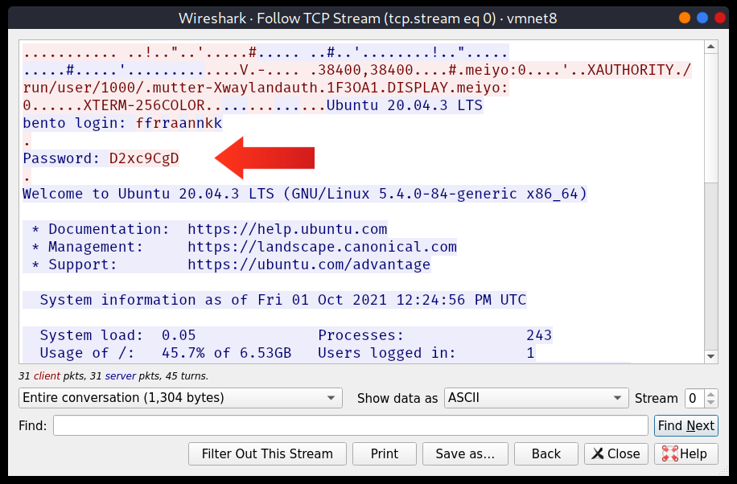
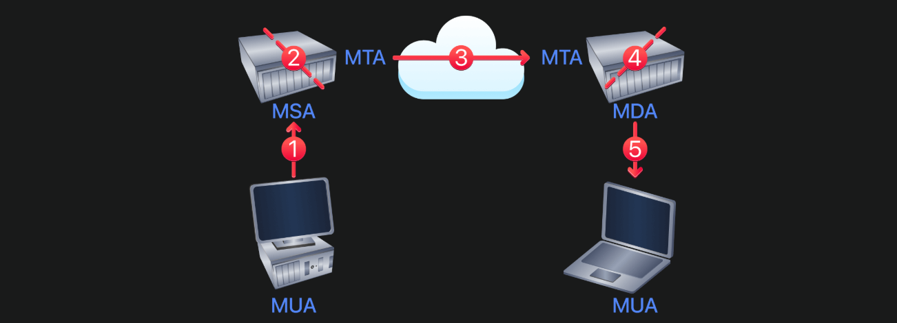
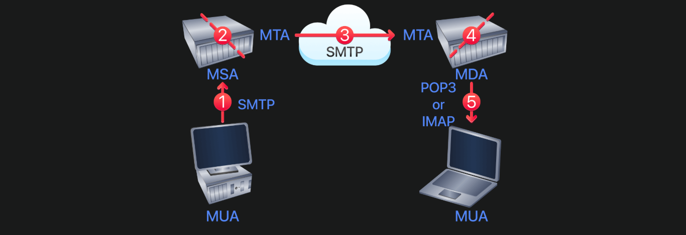

# **Protocol and Server**
## Introduction

### Các giao thức sẽ học
- HTTP
- FTP
- POP3
- SMTP
- IMAP

### Mục tiêu
- Hiểu cách các giao thức mạng hoạt động ở mức thấp (low-level).
- Quan sát quá trình client và server giao tiếp thay vì chỉ sử dụng GUI.
- Thực hành gửi lệnh trực tiếp bằng **Telnet** để hiểu những gì ứng dụng thực hiện phía sau.

### Tại sao cần học?

- **Vẫn được sử dụng:** Dù hiện nay chủ yếu dùng HTTPS, SFTP, IMAPS..., cơ chế của giao thức gốc vẫn giữ nguyên, chỉ được mã hóa thêm bằng **TLS**.
- **Quan trọng trong Pentest:** Legacy systems, mạng nội bộ, IoT và các dịch vụ cấu hình sai vẫn có thể sử dụng giao thức plaintext.
- **Hiểu giao thức → Hiểu tấn công:** Ví dụ:
  - HTTP → Hiểu các lỗ hổng Web.
  - SMTP → Hiểu Email Spoofing.
- **Hiểu điểm yếu bảo mật:** Các giao thức cũ thường truyền **username/password dưới dạng plaintext**, nên dễ bị **sniffing** nếu không có mã hóa.

### Nội dung tiếp theo
- Học cách bảo vệ các giao thức bằng **TLS**.
- Tìm hiểu các cuộc tấn công:
  - Sniffing
  - Man-in-the-Middle (MITM)
  - Password attacks

### Kiến thức cần có
- TCP/IP
- Port
- Client-Server Model
- Linux Terminal

## 2. Telnet
## Telnet

### Telnet là gì?
- **Telnet** là giao thức tầng ứng dụng (application-layer protocol), **TCP only**.
- Dùng để kết nối tới **terminal/console** của máy khác từ xa.
- Người dùng có thể:
  - Đăng nhập vào máy remote
  - Chạy lệnh
  - Quản trị hệ thống từ xa

### Cách Telnet hoạt động
- Telnet server thường lắng nghe ở **TCP port 23**.
- Khi kết nối:
  1. Người dùng nhập username.
  2. Nhập password.
  3. Nếu đúng thông tin đăng nhập, hệ thống cấp quyền truy cập terminal.
  4. Người dùng nhận được command prompt để chạy lệnh.

Ví dụ prompt:

```bash
frank@bento:~$
```

- Dấu `$` cho biết đây là user thường, **không phải root**.

### Telnet Today

Ngày nay Telnet gần như đã bị thay thế bởi **SSH (Secure Shell)**.

Tuy nhiên vẫn có thể gặp Telnet trong:
- Legacy systems
- Thiết bị mạng cũ như router, switch
- Industrial controllers
- Embedded devices / IoT devices
- Internal networks ít ưu tiên bảo mật
- Misconfigured systems

Trong pentest, phát hiện **Telnet port 23 mở** thường là finding quan trọng vì có thể cho thấy:
- Hệ thống cũ
- Cấu hình sai bảo mật

### Telnet Client as a Testing Tool

Dù Telnet server ít dùng, **Telnet client** vẫn hữu ích để test các cổng TCP.

Ví dụ kết nối tới web server port 80:

```bash
telnet target 80
```

Có thể dùng để tương tác thủ công với các giao thức text-based như:
- HTTP
- SMTP
- POP3
- IMAP

### Vì sao Telnet không an toàn?

Telnet gửi toàn bộ dữ liệu dưới dạng **cleartext**, bao gồm:
- Username
- Password
- Command
- Output trả về



Điều này có nghĩa là ai bắt được traffic mạng đều có thể đọc được thông tin đăng nhập.

Các đối tượng có thể đánh cắp dữ liệu Telnet:
- Attacker cùng mạng LAN
- Người kiểm soát router/switch trên đường truyền
- Malicious insider
- Kẻ thực hiện Man-in-the-Middle attack

### Lưu ý về password

- Khi nhập password trên terminal, ký tự không hiện ra màn hình.
- Nhưng đây chỉ là bảo vệ hiển thị.
- Password vẫn được gửi qua mạng dưới dạng **cleartext**.
- Vì vậy attacker sniff traffic vẫn có thể thấy password.

### Giải pháp thay thế

- Sử dụng **SSH** thay cho Telnet.
- SSH mã hóa toàn bộ traffic, bao gồm cả credentials.
- SSH là tiêu chuẩn hiện nay cho remote command-line access.

## 3. HTTP
## HTTP (Hypertext Transfer Protocol)

### HTTP là gì?
- Giao thức dùng để truyền tải nội dung Web:
  - HTML
  - Images
  - CSS/JS
  - Form data
  - File upload
- Mỗi lần truy cập website là đang sử dụng HTTP.

## HTTP vs HTTPS

### HTTP
- Truyền dữ liệu dưới dạng **cleartext** (không mã hóa).
- Có thể bị đọc nếu attacker bắt được traffic.

### HTTPS
- HTTP được mã hóa bằng **TLS**.
- Cú pháp và cách hoạt động giống HTTP, chỉ khác là dữ liệu được mã hóa.

> Học HTTP trước giúp hiểu cách HTTPS hoạt động.

## Gửi HTTP Request bằng Telnet

Kết nối tới Web Server:

```bash
telnet <IP> 80
```

Gửi request:

```http
GET /index.html HTTP/1.1
Host: telnet
```

> Sau dòng `Host:` nhấn **Enter 2 lần** để gửi request.

Server sẽ trả về:
- HTTP Status
- Response Headers
- Nội dung trang web

## HTTP Response Headers

Ví dụ:

```http
Server: nginx/1.18.0 (Ubuntu)
```

Header có thể tiết lộ:
- Web Server
- Version
- Operating System

→ Rất hữu ích trong **Reconnaissance** để tìm lỗ hổng tương ứng.

## Web Server phổ biến

- Nginx
- Apache
- IIS
- LiteSpeed
- Caddy

## HTTP Versions

### HTTP/1.1
- Text-based.
- Dễ đọc và test bằng Telnet.
- Phù hợp nhất để học.

### HTTP/2
- Binary protocol.
- Multiplexing, Header Compression.

### HTTP/3
- Dùng **QUIC (UDP)** thay vì TCP.
- Hiệu năng cao hơn trên mạng không ổn định.

## 4. FTP (File Transfer Protocol) 

### FTP là gì?
- Giao thức dùng để **truyền file** giữa các máy tính.
- Mặc định sử dụng **TCP port 21**.

### FTP hiện nay

FTP không an toàn vì truyền:
- Username
- Password
- File
- Commands

đều dưới dạng **cleartext**.

Các giao thức thay thế:
- **SFTP** (SSH, port 22) ⭐ Khuyến nghị
- **FTPS** (TLS, port 990 hoặc 21)
- **SCP** (đang dần được thay bằng SFTP)

Tuy nhiên vẫn gặp FTP trên:
- Legacy systems
- Anonymous FTP servers
- Internal networks
- Embedded/IoT devices
- Misconfigured servers

> Trong Pentest, phát hiện FTP (đặc biệt cho phép **Anonymous Login**) là một finding quan trọng.

---

### Kết nối FTP bằng Telnet

```bash
telnet <IP> 21
```

Một số lệnh cơ bản:

```text
USER <username>
PASS <password>
SYST    # Xem hệ điều hành
STAT    # Xem trạng thái server
PASV    # Chuyển sang Passive Mode
TYPE A  # ASCII mode
TYPE I  # Binary mode
QUIT
```

> **Telnet chỉ gửi được command**, không tải file vì FTP cần một **data connection** riêng.

---

### FTP hoạt động

FTP sử dụng **2 kết nối TCP**:

- **Control Connection (Port 21)**: gửi lệnh.
- **Data Connection**: truyền dữ liệu/file.

Hai chế độ truyền dữ liệu:

- **Active Mode:** Server chủ động mở kết nối dữ liệu về client.
- **Passive Mode (PASV):** Client chủ động mở cả hai kết nối (phổ biến hơn, thân thiện với Firewall/NAT).

---

### FTP Client

Để tải file cần dùng FTP client:

```bash
ftp <IP>
```

Một số lệnh:

```text
ls          # Liệt kê file
ascii       # Chế độ ASCII
binary      # Chế độ Binary
get FILE    # Download file
exit
```

---

### Anonymous FTP

Luôn thử khi Pentest:

```text
USER anonymous
PASS anything@example.com
```

Có thể truy cập:
- File công khai
- Backup
- File cấu hình
- Thậm chí upload file nếu server cấp quyền ghi.

---

### Security

FTP truyền **cleartext** nên attacker có thể đọc được:
- Username / Password
- Nội dung file
- Directory Listing
- Các command người dùng thực hiện

👉 Khuyến nghị:
- Dùng **SFTP** nếu có thể.
- Nếu bắt buộc dùng FTP thì nên dùng **FTPS (TLS)**.

## 5. SMTP

### Thành phần trong quá trình gửi Email



- **MUA (Mail User Agent):** Ứng dụng email (Outlook, Thunderbird, Webmail...)
- **MSA (Mail Submission Agent):** Nhận email từ MUA, kiểm tra lỗi rồi chuyển tiếp.
- **MTA (Mail Transfer Agent):** Chuyển email giữa các mail server.
- **MDA (Mail Delivery Agent):** Lưu email vào mailbox của người nhận.

Luồng gửi email:

```text
MUA → MSA → MTA → MTA → MDA → MUA
```

---

### Các giao thức Email

- **SMTP:** Gửi email.
- **POP3:** Nhận email.
- **IMAP:** Nhận và đồng bộ email.

---

### SMTP

SMTP dùng để gửi email đến Mail Server.

### Các cổng SMTP

| Port | Mục đích |
|------|----------|
| **25** | MTA ↔ MTA (STARTTLS) |
| **587** | MUA → MSA (Submission - Khuyến nghị) |
| **465** | SMTPS (TLS ngay khi kết nối) |

---

### Gửi Email bằng Telnet

```bash
telnet <IP> 25
```

Các lệnh cơ bản:

```text
HELO <hostname>
MAIL FROM:
RCPT TO:
DATA
<Email content>
.
QUIT
```

> Dấu `.` trên một dòng riêng dùng để kết thúc nội dung email.

---

### Email Spoofing

SMTP **không xác thực địa chỉ người gửi**.

→ Có thể tự khai báo `MAIL FROM:` là bất kỳ địa chỉ email nào.

Đây là nguyên nhân khiến **Email Spoofing** và nhiều cuộc **Phishing** có thể xảy ra.

---

### Security

SMTP truyền dữ liệu dạng **cleartext** nếu không dùng TLS.

Các rủi ro:
- Lộ nội dung email.
- Lộ username/password.
- Open Relay bị lợi dụng để gửi spam.
- Email Spoofing.

Các cơ chế bảo vệ hiện nay:
- **SPF**
- **DKIM**
- **DMARC**

## 6. Post Office Protocol v3 (**POP3**)

### POP3 là gì?
- Giao thức dùng để **nhận (download) email** từ Mail Server (MDA).
- Sau khi tải về, email **có thể bị xóa khỏi server** (mặc định).


---

### POP3 Ports

| Port | Mô tả |
|------|------|
| **110** | POP3 (cleartext, hỗ trợ STLS) |
| **995** | POP3S (TLS ngay từ đầu) |

---

### POP3 bằng Telnet

```bash
telnet <IP> 110
```

Các lệnh cơ bản:

```text
USER <username>   # Username
PASS <password>   # Password
STAT              # Số email và tổng dung lượng
LIST              # Danh sách email
RETR n            # Đọc email số n
DELE n            # Đánh dấu xóa email
RSET              # Hủy đánh dấu xóa
QUIT              # Thoát (xóa các email đã đánh dấu)
```

Ví dụ:

```text
STAT
+OK 1 179
```

- `1`: Có **1 email**.
- `179`: Tổng dung lượng **179 bytes**.

---

### Đặc điểm POP3

- Download email về máy.
- Mặc định có thể xóa email trên server.
- Không đồng bộ giữa nhiều thiết bị.
- Phù hợp khi:
  - Chỉ dùng 1 thiết bị.
  - Muốn đọc email offline.
  - Muốn lưu trữ email cục bộ.

---

### POP3 vs IMAP

- **POP3:** Download email về máy, ít đồng bộ.
- **IMAP:** Đồng bộ email giữa nhiều thiết bị.

---

### Security

POP3 trên **port 110** truyền:
- Username
- Password
- Nội dung email

đều dưới dạng **cleartext**.

Nếu bắt được traffic có thể lấy:
- Credentials (`USER`, `PASS`)
- Nội dung email
- Password reset links hoặc thông tin nhạy cảm khác.

## 7. IMAP (Internet Message Access Protocol)

#### IMAP là gì?
- Giao thức dùng để **nhận và đồng bộ email** giữa nhiều thiết bị.
- Email được **lưu trên server**, không tải về rồi xóa như POP3.

---

### Ưu điểm của IMAP

- Đồng bộ email trên nhiều thiết bị.
- Đồng bộ trạng thái:
  - Read/Unread
  - Folders
  - Flags
- Xóa email ở một thiết bị → xóa ở mọi thiết bị.
- Hỗ trợ tìm kiếm trực tiếp trên server.

---

### IMAP Ports

| Port | Mô tả |
|------|------|
| **143** | IMAP (cleartext, hỗ trợ STARTTLS) |
| **993** | IMAPS (TLS ngay từ đầu) |

---

### IMAP bằng Telnet

```bash
telnet <IP> 143
```

Một số lệnh cơ bản:

```text
c1 LOGIN user pass      # Đăng nhập
c2 LIST "" "*"          # Liệt kê mailbox
c3 SELECT INBOX         # Mở inbox (đọc/ghi)
c4 EXAMINE INBOX        # Mở inbox (chỉ đọc)
c5 FETCH 1 BODY[]       # Đọc email
c6 SEARCH ALL           # Tìm email
c7 LOGOUT               # Thoát
```

> Mỗi lệnh phải có **tag** (`c1`, `c2`, `A001`...) để server ghép đúng response với request.

---

### CAPABILITY

Server trả về danh sách các tính năng hỗ trợ, ví dụ:

- `IMAP4rev1`: Phiên bản IMAP.
- `STARTTLS`: Hỗ trợ nâng cấp sang TLS.
- `IDLE`: Thông báo email mới theo thời gian thực.
- `ACL`: Hỗ trợ phân quyền.

---

### POP3 vs IMAP

| POP3 | IMAP |
|------|------|
| Download email | Đồng bộ email |
| Có thể xóa email trên server | Email luôn lưu trên server |
| Phù hợp 1 thiết bị | Phù hợp nhiều thiết bị |

---

### Security

Nếu dùng IMAP không mã hóa (port 143), attacker có thể lấy:
- Username / Password (`LOGIN`)
- Toàn bộ lịch sử email.
- Email reset mật khẩu.
- Thông tin phục vụ Business Email Compromise (BEC) và Lateral Movement.

👉 Khuyến nghị: **IMAPS (port 993)**.

## 8. Sumary
## Protocol Summary

| Protocol | Default Port | Mục đích | Bảo mật mặc định | Giao thức thay thế | Secure Port |
|----------|:------------:|----------|------------------|--------------------|:-----------:|
| **FTP** | **21** | Truyền file | ❌ Cleartext | **SFTP / FTPS** | **22 (SFTP)** / **990 (FTPS)** |
| **HTTP** | **80** | Truy cập Web | ❌ Cleartext | **HTTPS** | **443** |
| **SMTP** | **25** | Gửi Email (MUA → MSA / MTA ↔ MTA) | ❌ Cleartext | **SMTPS / SMTP + STARTTLS** | **465 (SMTPS)** / **587 (Submission)** |
| **POP3** | **110** | Nhận Email (Download) | ❌ Cleartext | **POP3S** | **995** |
| **IMAP** | **143** | Nhận & Đồng bộ Email | ❌ Cleartext | **IMAPS** | **993** |
| **Telnet** | **23** | Remote Terminal | ❌ Cleartext | **SSH** | **22** |

### Ghi nhớ nhanh

| Giao thức | Chức năng |
|-----------|-----------|
| **HTTP** | Truy cập Website |
| **FTP** | Truyền File |
| **SMTP** | Gửi Email |
| **POP3** | Tải Email về máy |
| **IMAP** | Đồng bộ Email nhiều thiết bị |
| **Telnet** | Điều khiển máy từ xa (Remote Terminal) |

### Các cổng cần nhớ

| Port | Dịch vụ |
|:----:|---------|
| **21** | FTP |
| **22** | SSH / SFTP |
| **23** | Telnet |
| **25** | SMTP |
| **80** | HTTP |
| **110** | POP3 |
| **143** | IMAP |
| **443** | HTTPS |
| **465** | SMTPS |
| **587** | SMTP Submission (STARTTLS) |
| **990** | FTPS |
| **993** | IMAPS |
| **995** | POP3S |