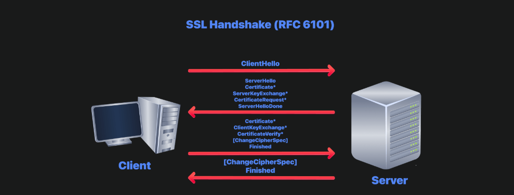

# Protocol and Server 2
## 1. Introduction
### Tổng quan
- Các giao thức mạng đời cũ được thiết kế khi **bảo mật chưa được ưu tiên**, nên truyền dữ liệu dưới dạng **cleartext** (không mã hóa).
- Nếu sử dụng trên mạng không an toàn (ví dụ Wi-Fi công cộng), kẻ tấn công có thể đọc được toàn bộ dữ liệu truyền đi, bao gồm:
  - Username
  - Password
  - Email
  - Nội dung giao tiếp

### Các giao thức được đề cập
- Telnet
- HTTP
- FTP
- SMTP
- POP3
- IMAP

> Mặc dù các giao thức này vẫn được sử dụng, hầu hết hệ thống hiện đại đều triển khai **phiên bản mã hóa**.

| Giao thức cũ | Phiên bản bảo mật |
|--------------|-------------------|
| HTTP | HTTPS |
| FTP | SFTP / FTPS |
| SMTP | SMTPS |
| Telnet | SSH |

**Hiểu các giao thức không an toàn giúp:**
- Nhận biết các hệ thống cũ (Legacy Systems).
- Phát hiện sai cấu hình (Misconfiguration).
- Hiểu cách các giao thức bảo mật hiện đại hoạt động.

---

### Các mối đe dọa chính đối với server

- **Sniffing Attack** (Network Packet Capture)
- **Man-in-the-Middle (MITM) Attack**
- **Password Attack** (Authentication Attack)
- **Vulnerability Exploitation**

---

### CIA Triad (Mục tiêu bảo vệ)

| Thành phần | Ý nghĩa |
|------------|---------|
| **Confidentiality** | Ngăn chặn việc lộ dữ liệu. |
| **Integrity** | Đảm bảo dữ liệu không bị thay đổi trái phép. |
| **Availability** | Đảm bảo dịch vụ luôn sẵn sàng. |

Mỗi hệ thống sẽ ưu tiên khác nhau:
- **Confidentiality:** Cơ quan tình báo.
- **Integrity:** Ngân hàng trực tuyến.
- **Availability:** Các nền tảng cung cấp dịch vụ trực tuyến.

---

### DAD (Mục tiêu của kẻ tấn công)

| CIA | DAD |
|-----|-----|
| Confidentiality | **Disclosure** (Lộ dữ liệu) |
| Integrity | **Alteration** (Sửa đổi dữ liệu) |
| Availability | **Destruction** (Phá hoại/Gián đoạn) |

---

### Tấn công ảnh hưởng đến CIA

| Tấn công | Ảnh hưởng |
|----------|-----------|
| Sniffing | Disclosure → Confidentiality |
| Password Attack | Disclosure → Confidentiality |
| MITM | Alteration → Integrity |
| DoS (khai thác lỗ hổng) | Destruction → Availability |

---

### Modern Attack Landscape

#### Sniffing
- Khó thực hiện hơn nhờ TLS.
- Vẫn hiệu quả trên:
  - Legacy systems.
  - Dịch vụ cấu hình sai.
  - Mạng nội bộ không mã hóa.

#### MITM
Được giảm thiểu nhờ:
- HSTS
- Certificate Pinning
- Certificate Transparency

> Vẫn có thể thành công nếu các cơ chế trên không được triển khai đúng.

#### Password Attacks
Ngoài Brute Force còn có:
- **Credential Stuffing:** Dùng tài khoản/mật khẩu bị rò rỉ.
- **Password Spraying:** Thử một vài mật khẩu phổ biến trên nhiều tài khoản.
- Khai thác các cơ sở dữ liệu mật khẩu bị leak.

#### Vulnerabilities
- Lỗ hổng chỉ tạo ra **rủi ro**, thiệt hại chỉ xảy ra khi bị khai thác.

Ví dụ:
- **DoS** → Ảnh hưởng Availability.
- **RCE** → Có thể chiếm quyền điều khiển hệ thống.

---

### Mục tiêu của Room

- Hiểu cách các giao thức được **nâng cấp hoặc thay thế** để bảo vệ:
  - **Confidentiality**
  - **Integrity**
- Làm quen với **Hydra** để kiểm tra độ mạnh của mật khẩu bằng wordlist.
- Hiểu vì sao cần:
  - Strong Passwords
  - Account Lockout
  - Multi-Factor Authentication (MFA)

## 2. Sniffing Attacks
### Khái niệm

- Sniffing là kỹ thuật bắt các gói tin trên mạng để đọc dữ liệu truyền đi.
- Nếu giao thức sử dụng **cleartext**, attacker có thể lấy được:
  - Username
  - Password
  - Email
  - Nội dung trao đổi

> Vi phạm **Confidentiality (CIA)**.

---

### Khi nào vẫn hiệu quả?

- Internal network
- Legacy systems
- Misconfigured TLS
- IoT devices
- Wireless network
- Sau khi thực hiện MITM
- Internal Pentest / Red Team

---

### Công cụ

| Tool | Đặc điểm |
|------|----------|
| tcpdump | CLI, nhẹ, có sẵn trên Linux |
| Wireshark | GUI, phân tích mạnh |
| tshark | CLI của Wireshark |
| tcpflow | Ghép TCP stream |
| ngrep | Tìm pattern trong packet |
| NetworkMiner | Trích xuất file từ packet |

---

### Ví dụ: Capture POP3 Credentials

#### Capture POP3

```bash
sudo tcpdump port 110 -A
```

**Ý nghĩa:**

- `sudo`: chạy với quyền root.
- `port 110`: chỉ bắt gói tin POP3.
- `-A`: hiển thị nội dung dưới dạng ASCII.

Ví dụ output:

```text
USER frank
PASS D2xc9CgD
```

➡️ Username và Password bị lộ vì POP3 truyền **cleartext**.

---

### Một số filter tcpdump

#### Capture theo port

```bash
sudo tcpdump port 110 -A
```

#### Capture theo host

```bash
sudo tcpdump host 10.20.30.148 -A
```

#### Capture HTTP

```bash
sudo tcpdump port 80 -A
```

#### Capture FTP

```bash
sudo tcpdump port 21 -A
```

#### Lưu packet

```bash
sudo tcpdump -w capture.pcap
```

#### Đọc file pcap

```bash
tcpdump -r capture.pcap -A
```

---

### Mitigation

- Sử dụng TLS.
- HTTPS thay HTTP.
- SSH thay Telnet.
- SFTP/FTPS thay FTP.
- Network Segmentation.
- Encrypted VLAN/Tunnel.
- 802.1X Authentication.
- Zero Trust Architecture.
- Phát hiện ARP Spoofing.

> **Best Practice:** Luôn coi mạng là không đáng tin cậy (**Hostile Network**) và mã hóa toàn bộ lưu lượng, kể cả trong mạng nội bộ.

## 3. Man-in-the-Middle (MITM) Attack

### Khái niệm

- **MITM (Man-in-the-Middle)** xảy ra khi attacker đứng giữa **Client (A)** và **Server (B)**.
- Client tưởng đang giao tiếp trực tiếp với Server, nhưng thực tế mọi dữ liệu đều đi qua Attacker.
- Attacker có thể:
  - Đọc dữ liệu.
  - Chỉnh sửa dữ liệu.
  - Chuyển tiếp dữ liệu mà nạn nhân không biết.

#### Ví dụ

```
A ---------> E ---------> B
(Client)   (Attacker)   (Server)

A gửi: Transfer $20
        ↓
E sửa thành: Transfer $200
        ↓
B nhận: Transfer $200
```

> **Vi phạm Integrity**, đồng thời có thể làm lộ **Confidentiality**. :contentReference[oaicite:0]{index=0}

---

### Điều kiện để MITM thành công

- Hai bên không xác minh:
  - Tính xác thực (Authentication).
  - Tính toàn vẹn (Integrity).
- Giao thức không hỗ trợ bảo mật hoặc sử dụng giao thức cleartext.

---

### Các kỹ thuật thực hiện MITM

#### ARP Spoofing
- Hoạt động trên **LAN**.
- Gửi ARP giả để ánh xạ IP Gateway/Target → MAC của Attacker.
- Toàn bộ lưu lượng sẽ đi qua Attacker.

---

#### DNS Spoofing
- Trả về DNS Response giả.
- Chuyển người dùng đến server do Attacker kiểm soát.

Có thể thông qua:
- DNS Cache Poisoning.
- DNS Server bị compromise.
- Trả lời DNS nhanh hơn server thật.

---

#### Rogue Access Point (Evil Twin)

- Tạo Wi-Fi giả giống Wi-Fi thật.
- Ví dụ:

```
Airport_WiFi_Free
```

- Khi nạn nhân kết nối, toàn bộ traffic đi qua Attacker.

---

#### BGP Hijacking

- Giả mạo route BGP.
- Chuyển hướng traffic Internet qua hạ tầng của Attacker.
- Thường nhắm vào ISP hoặc tổ chức lớn.

---

### Công cụ MITM

| Tool | Chức năng |
|------|-----------|
| Bettercap | ARP Spoofing, DNS Spoofing, HTTP/HTTPS Proxy |
| Ettercap | MITM trên LAN (cũ) |
| mitmproxy | Proxy HTTPS, xem và chỉnh sửa HTTP/HTTPS |
| Responder | Thu thập credential trong môi trường Windows (LLMNR/NBT-NS) |

---

### MITM với HTTPS

#### SSL Stripping

- Hạ kết nối từ:

```
HTTPS
   ↓
HTTP
```

- Attacker kết nối HTTPS tới Server.
- Nhưng trả dữ liệu HTTP cho Client.
- Người dùng có thể không nhận ra nếu không kiểm tra biểu tượng ổ khóa.

---

#### Fake Certificate

- Attacker tạo certificate giả.
- Thành công nếu:
  - Người dùng bấm **Accept** khi trình duyệt cảnh báo.
  - Hoặc CA bị compromise.

---

#### Compromised / Rogue CA

- Attacker kiểm soát hoặc lợi dụng một **CA**.
- Có thể tạo certificate hợp lệ cho bất kỳ domain nào.

---

### Phòng chống MITM

#### HTTPS Everywhere
- Website mặc định sử dụng HTTPS.
- Browser cảnh báo hoặc chặn HTTP.

---

#### HSTS (HTTP Strict Transport Security)

- Ép browser chỉ dùng HTTPS.
- Chống **SSL Stripping**.

---

#### Certificate Transparency (CT)

- Mọi certificate phải được ghi vào **CT Log** công khai.
- Browser có thể phát hiện certificate giả hoặc chưa được ghi log.

---

#### Certificate Pinning

- Ứng dụng chỉ chấp nhận certificate/public key đã được chỉ định trước.
- Thường dùng trên mobile app.
- Vẫn an toàn ngay cả khi CA bị compromise.

---

#### DANE

- Sử dụng **DNSSEC** để xác thực certificate.
- Giảm phụ thuộc vào hệ thống CA.

---

### Khi nào MITM vẫn thành công?

- Người dùng bỏ qua cảnh báo certificate.
- Ứng dụng không kiểm tra certificate đúng cách.
- Website sử dụng giao thức cleartext.
- CA bị compromise.
- Mạng nội bộ không mã hóa.
- Legacy systems không hỗ trợ cơ chế bảo mật hiện đại.

---

### Mitigation

- Sử dụng **TLS/HTTPS**.
- Xác thực certificate đúng cách.
- Không bỏ qua cảnh báo SSL/TLS.
- Sử dụng **PKI** và Trusted Root Certificates.
- Mã hóa hoặc ký (sign) dữ liệu để đảm bảo:
  - Authentication.
  - Integrity.
  - Confidentiality.

> **Note:** MITM không chỉ ảnh hưởng HTTP mà còn các giao thức cleartext như **FTP, SMTP, POP3**. Khi **TLS** được triển khai đúng cùng với **PKI**, nguy cơ MITM sẽ được giảm đáng kể.

## 4. TLS (Transport Layer Security)

### Tổng quan

- TLS là giải pháp tiêu chuẩn để bảo vệ:
  - **Confidentiality** (bí mật dữ liệu).
  - **Integrity** (toàn vẹn dữ liệu).
- Giúp chống:
  - Password Sniffing.
  - Man-in-the-Middle (MITM).

---

### Lịch sử SSL/TLS

| Phiên bản | Trạng thái |
|-----------|------------|
| SSL 2.0 / SSL 3.0 | ❌ Deprecated, không an toàn |
| TLS 1.0 / 1.1 | ❌ Deprecated (2021) |
| TLS 1.2 | ✅ Vẫn an toàn nếu cấu hình đúng |
| TLS 1.3 | ✅ Chuẩn hiện nay |

> **Note:** Thuật ngữ **SSL Certificate** vẫn được sử dụng phổ biến, nhưng thực tế các hệ thống hiện đại đều dùng **TLS**. :contentReference[oaicite:0]{index=0}

---

### TLS trong mô hình mạng

- Các giao thức như:
  - HTTP
  - FTP
  - SMTP
  - POP3
  - IMAP

  đều truyền dữ liệu **cleartext**.

- TLS thêm một lớp **mã hóa (ciphertext)** trước khi dữ liệu được gửi đi.

> Trên thực tế, TLS hoạt động **giữa Transport Layer và Application Layer**.

---

### Nâng cấp giao thức bằng TLS

| Protocol | Port | Secure Protocol | Secure Port |
|----------|-----:|-----------------|------------:|
| HTTP | 80 | HTTPS | 443 |
| FTP | 21 | FTPS | 990 |
| SMTP | 25 | SMTPS | 465 |
| POP3 | 110 | POP3S | 995 |
| IMAP | 143 | IMAPS | 993 |

#### DNS cũng có TLS

| Protocol | Port |
|----------|-----:|
| DNS over TLS (DoT) | 853 |
| DNS over HTTPS (DoH) | 443 |

> DoT và DoH giúp mã hóa truy vấn DNS, tránh bị nghe lén website người dùng truy cập.

---

### Implicit TLS vs STARTTLS

#### Implicit TLS

- Dùng **port riêng**.
- TLS được thiết lập **ngay khi kết nối**.

Ví dụ:

- HTTPS → 443
- IMAPS → 993

---

#### STARTTLS

- Ban đầu kết nối **cleartext**.
- Sau đó gửi lệnh **STARTTLS** để nâng cấp sang TLS.

Ví dụ:

- SMTP:
  - Port 25
  - Port 587 (khuyến nghị)

---

#### So sánh

| Implicit TLS | STARTTLS |
|--------------|-----------|
| Mã hóa ngay từ đầu | Nâng cấp sau khi kết nối |
| Dùng port riêng | Dùng chung port |
| An toàn hơn | Có nguy cơ **Downgrade Attack** nếu triển khai sai |

---

### HTTPS hoạt động như thế nào?

#### HTTP

1. TCP Connection.
2. Gửi HTTP Request.

---

#### HTTPS

1. TCP Connection.
2. TLS Handshake.
3. Gửi HTTP Request.

---

### TLS Handshake (TLS 1.2)


#### 1. ClientHello

Client gửi:

- TLS Version
- Cipher Suites
- Random Value

---

#### 2. ServerHello

Server gửi:

- Cipher Suite được chọn.
- Certificate.
- Random Value.

---

#### 3. Key Exchange

Hai bên trao đổi thông tin để tạo:

- **Shared Secret Key**

---

#### 4. Finished

- Xác nhận Handshake thành công.
- Chuyển sang truyền dữ liệu được mã hóa.

---

### TLS 1.3 cải tiến

- Chỉ cần **1 RTT** để handshake (TLS 1.2 cần 2 RTT).
- Hỗ trợ **0-RTT** cho kết nối đã từng thiết lập.
- **Forward Secrecy** mặc định.
- Loại bỏ cipher suite yếu.
- Mã hóa nhiều bước của Handshake hơn.

---

### Chứng chỉ (Certificate)

Server HTTPS gửi certificate để chứng minh danh tính.

Certificate chứa:

- Domain/Organization.
- Certificate Authority (CA).
- Thời gian hiệu lực.

Browser sẽ kiểm tra:

- Certificate có hợp lệ không.
- Có hết hạn không.
- Có được CA đáng tin cậy ký không.

---

### Hệ sinh thái Certificate hiện đại

#### Let's Encrypt

- Cung cấp certificate miễn phí.
- Tự động cấp và gia hạn.
- Giúp HTTPS trở nên phổ biến.

---

#### Certificate Transparency (CT)

- Mọi certificate đều được ghi vào **CT Log**.
- Browser có thể phát hiện certificate giả.

---

#### Short-lived Certificate

- Certificate chỉ có hiệu lực ngắn (ví dụ 90 ngày).
- Giảm rủi ro nếu certificate bị lộ.

---

#### ACME

- Giao thức tự động:
  - Xin certificate.
  - Gia hạn certificate.

Ví dụ:

- Certbot

---

### Công cụ kiểm tra TLS

| Tool | Chức năng |
|------|-----------|
| testssl.sh | Kiểm tra TLS Configuration |
| sslyze | Phân tích TLS bằng Python |
| SSL Labs | Phân tích HTTPS trực tuyến |
| nmap ssl-enum-ciphers | Liệt kê Cipher Suites |

#### Ví dụ

```bash
nmap --script ssl-enum-ciphers <target>
```

---

### Các lỗi cấu hình thường gặp

- TLS 1.0 / TLS 1.1 còn được bật.
- Cipher Suite yếu.
- Không hỗ trợ Forward Secrecy.
- Certificate:
  - Hết hạn.
  - Không hợp lệ.
  - Sai Domain.

---

### Tổng kết

```text
HTTP
      ↓
TCP Connection
      ↓
HTTP Request

HTTPS
      ↓
TCP Connection
      ↓
TLS Handshake
      ↓
Shared Secret Key
      ↓
Encrypted HTTP Communication
```

> **Note:** Mục tiêu của TLS là giúp Client và Server tạo ra một **Shared Secret Key** mà kẻ thứ ba không thể biết được. Sau khi Handshake hoàn tất, toàn bộ dữ liệu trao đổi sẽ được mã hóa, giúp chống **Sniffing** và **MITM**.'

## 5. SSH (Secure Shell)

### Tổng quan

- SSH là giao thức **đăng nhập và quản trị từ xa an toàn**, thay thế Telnet.
- Mặc định sử dụng **port 22**.
- Đảm bảo:
  - **Authentication**: Xác minh đúng server.
  - **Confidentiality**: Mã hóa dữ liệu.
  - **Integrity**: Phát hiện dữ liệu bị sửa đổi.

> SSH là tiêu chuẩn hiện nay để quản trị Server, Network Device và Cloud Infrastructure. :contentReference[oaicite:0]{index=0}

---

### Các phương thức xác thực

| Phương thức | Đặc điểm |
|-------------|----------|
| Password Authentication | Đơn giản nhưng dễ bị Brute Force nếu mật khẩu yếu. |
| Public Key Authentication | Khuyến nghị sử dụng, dùng cặp Public/Private Key. |
| Certificate-based Authentication | Dùng SSH CA, phù hợp doanh nghiệp lớn. |
| Multi-factor Authentication (MFA) | Kết hợp nhiều phương thức (Key + OTP,...). |

---

### Kết nối SSH

#### Kết nối mặc định

```bash
ssh mark@MACHINE_IP
```

SSH sẽ:
1. Kết nối tới port 22.
2. Xác thực người dùng.
3. Mở terminal từ xa.

---

### Host Key Verification

Lần đầu kết nối sẽ xuất hiện:

```text
The authenticity of host 'MACHINE_IP' can't be established.
ED25519 key fingerprint is SHA256:xxxxxxxx...
Are you sure you want to continue connecting (yes/no)?
```

#### Mục đích

- Xác minh đúng server.
- Phòng chống **MITM Attack**.

Sau khi chấp nhận:

- Host key được lưu tại:

```text
~/.ssh/known_hosts
```

Nếu fingerprint thay đổi bất thường:

- Có thể server bị cài lại.
- Hoặc đang xảy ra **MITM Attack**.

---

### Tạo SSH Key

#### Ed25519 (Khuyến nghị)

```bash
ssh-keygen -t ed25519 -C "your_email@example.com"
```

#### RSA 4096

```bash
ssh-keygen -t rsa -b 4096 -C "your_email@example.com"
```

#### File được tạo

Private Key:

```text
~/.ssh/id_ed25519
```

Public Key:

```text
~/.ssh/id_ed25519.pub
```

> **Private Key** phải được giữ bí mật và nên đặt **passphrase**.

---

### Cài Public Key lên Server

```bash
ssh-copy-id mark@MACHINE_IP
```

Public key sẽ được thêm vào:

```text
~/.ssh/authorized_keys
```

Sau đó có thể đăng nhập mà không cần nhập password.

---

### Một số tùy chọn SSH

#### Kết nối qua port khác

```bash
ssh -p 2222 mark@MACHINE_IP
```

---

#### Chỉ định Private Key

```bash
ssh -i ~/.ssh/custom_key mark@MACHINE_IP
```

---

#### Jump Host (Bastion)

```bash
ssh -J bastion.example.com mark@internal-server
```

Dùng khi muốn truy cập server nội bộ thông qua Bastion Host.

---

#### Local Port Forwarding

```bash
ssh -L 8080:localhost:80 mark@MACHINE_IP
```

Truy cập:

```
localhost:8080
```

↓

Server:

```
localhost:80
```

---

#### Dynamic Port Forwarding (SOCKS Proxy)

```bash
ssh -D 9050 mark@MACHINE_IP
```

---

#### Thực thi một lệnh

```bash
ssh mark@MACHINE_IP "cat /etc/passwd"
```

Không cần mở interactive shell.

---

### SSH Config

File:

```text
~/.ssh/config
```

Ví dụ:

```text
Host webserver
    HostName MACHINE_IP
    User mark
    Port 22
    IdentityFile ~/.ssh/id_ed25519
```

Sau đó chỉ cần:

```bash
ssh webserver
```

---

### Truyền file qua SSH

#### SFTP (Khuyến nghị)

```bash
sftp mark@MACHINE_IP
```

- Truyền file an toàn.
- Chạy trên SSH (Port 22).

---

#### SCP

Remote → Local

```bash
scp mark@MACHINE_IP:/home/mark/archive.tar.gz ~/
```

Local → Remote

```bash
scp backup.tar.bz2 mark@MACHINE_IP:/home/mark/
```

> OpenSSH khuyến nghị dùng **SFTP** thay cho **SCP**.

---

#### rsync qua SSH

```bash
rsync -avz -e ssh /local/directory/ mark@MACHINE_IP:/remote/directory/
```

Ưu điểm:

- Chỉ truyền phần dữ liệu thay đổi.
- Phù hợp đồng bộ thư mục lớn.

---

### SSH vs FTPS vs SFTP

| Giao thức | Port | Mô tả |
|-----------|-----:|-------|
| SSH | 22 | Remote Administration |
| SFTP | 22 | File Transfer chạy trên SSH |
| FTPS | 990 | FTP + TLS |
| SCP | 22 | Copy file qua SSH (đang dần bị thay thế) |

> **SFTP ≠ FTPS**
>
> - **SFTP** sử dụng **SSH**.
> - **FTPS** sử dụng **TLS**.

---

### SSH Hardening

Các cấu hình trong:

```text
/etc/ssh/sshd_config
```

#### Tắt Password Authentication

```text
PasswordAuthentication no
```

---

#### Cấm đăng nhập Root

```text
PermitRootLogin no
```

---

#### Chỉ cho phép user/group nhất định

```text
AllowUsers
AllowGroups
```

---

#### Đổi port mặc định

- Giảm các cuộc quét tự động.
- Không phải biện pháp bảo mật mạnh (**Security through Obscurity**).

---

#### Chặn Brute Force

Ví dụ:

- fail2ban

---

#### Sử dụng thuật toán hiện đại

Cấu hình:

- KexAlgorithms
- Ciphers
- MACs

---

### Tổng kết

```text
SSH
├── Port 22
├── Encrypted Communication
├── Authentication
│   ├── Password
│   ├── Public Key
│   ├── Certificate
│   └── MFA
├── Remote Administration
├── Secure File Transfer (SFTP)
└── Port Forwarding
```

> **Best Practice**
>
> - Sử dụng **Public Key Authentication** thay vì Password.
> - Xác minh **Host Key Fingerprint** khi kết nối lần đầu.
> - Ưu tiên **SFTP** thay cho SCP/FTPS.
> - Tắt Root Login và Password Authentication sau khi cấu hình SSH Key.

## 6. Password Attacks

### Authentication

**Authentication** là quá trình xác minh danh tính người dùng trước khi cấp quyền truy cập.

Ví dụ POP3:

```bash
telnet 10.49.148.111 110

USER frank
PASS D2xc9CgD
```

Nếu username/password đúng → Server cho phép truy cập mailbox. :contentReference[oaicite:0]{index=0}

---

### Authentication Factors

Có 3 yếu tố xác thực:

| Factor | Ví dụ |
|---------|--------|
| Something you know | Password, PIN |
| Something you have | Phone, Security Key, Smart Card |
| Something you are | Fingerprint, Face ID |

> Bài này tập trung vào **Password** (Something you know).

---

### Tại sao Password yếu vẫn tồn tại?

Người dùng thường:

- Dùng password đơn giản.
- Tái sử dụng password.
- Đặt theo:
  - Tên công ty
  - Mùa + năm
  - Đội bóng
  - Văn hóa đại chúng

Ví dụ:

```text
123456
password
Password1
qwerty
Summer2024
Welcome1
```

---

### Các kiểu Password Attack

#### Password Guessing

- Đoán mật khẩu dựa trên thông tin của nạn nhân.

Ví dụ:

- Tên thú cưng
- Ngày sinh
- Đội bóng yêu thích

Nguồn thông tin:

- Facebook
- LinkedIn
- Instagram

---

#### Dictionary Attack

- Thử password từ **wordlist**.

Ví dụ:

```
password
welcome
summer2024
```

---

#### Brute Force

- Thử **mọi khả năng**.

Ví dụ:

```
a
aa
ab
abc
...
```

> Password càng dài → Brute Force càng khó.

---

#### Credential Stuffing

- Sử dụng username/password bị rò rỉ từ các vụ leak.
- Thử đăng nhập vào các dịch vụ khác.

Khai thác:

- Password Reuse.

---

#### Password Spraying

- Thử **một vài password phổ biến** trên **nhiều account**.

Ví dụ:

```
admin : Password1
john  : Password1
mary  : Password1
...
```

Ưu điểm:

- Tránh Account Lockout.

---

#### Hybrid Attack

Kết hợp:

- Dictionary
- Pattern

Ví dụ:

```
Summer2024
Summer2025
P@ssw0rd
Adm1n!
```

---

### Wordlists

#### RockYou

Có sẵn:

```text
/usr/share/wordlists/rockyou.txt
```

---

#### SecLists

```text
/usr/share/seclists/
```

Chứa nhiều wordlist:

- Password
- Username
- Directory
- DNS
- ...

---

#### Khác

- CrackStation
- Breach Password Collections

> **Best Practice:** Wordlist càng phù hợp mục tiêu thì càng hiệu quả.

---

### THC Hydra

Hydra là công cụ **Online Password Cracking** hỗ trợ nhiều giao thức:

- FTP
- SSH
- SMTP
- POP3
- IMAP
- HTTP
- ...

---

### Cú pháp

```bash
hydra -l <user> -P <wordlist> <target> <service>
```

Ví dụ:

```bash
hydra -l mark -P /usr/share/wordlists/rockyou.txt 10.49.148.111 ftp
```

Hoặc:

```bash
hydra -l mark -P /usr/share/wordlists/rockyou.txt ftp://10.49.148.111
```

---

#### SSH

```bash
hydra -l frank -P /usr/share/wordlists/rockyou.txt 10.49.148.111 ssh
```

---

#### IMAP

```bash
hydra -l lazie -P /usr/share/wordlists/rockyou.txt 10.49.148.111 imap
```

---

#### Credential Stuffing

```bash
hydra -L users.txt -P passwords.txt 10.49.148.111 ssh
```

---

### Các option quan trọng

| Option | Ý nghĩa |
|---------|----------|
| `-l` | Một username |
| `-L` | File username |
| `-p` | Một password |
| `-P` | File password |
| `-s` | Port |
| `-V` / `-vV` | Hiển thị tiến trình |
| `-t` | Số thread |
| `-d` | Debug |
| `-f` | Dừng khi tìm thấy password |
| `-w` | Thời gian chờ |

> Có thể nhấn **Ctrl + C** sau khi tìm được password.

---

### Công cụ khác

| Tool | Chức năng |
|------|-----------|
| Medusa | Password Attack tương tự Hydra |
| Ncrack | Password Cracking tốc độ cao |
| CrackMapExec / NetExec | Password Spraying trong Active Directory |
| Burp Suite Intruder | Tấn công Web Login Form |
| Hashcat | Offline Hash Cracking |
| John the Ripper | Offline Hash Cracking |

> **Hydra** → Tấn công **dịch vụ đang chạy (Online)**.
>
> **Hashcat / John** → Bẻ khóa **Password Hash (Offline)**.

---

### Phòng chống Password Attack

#### Password Policy

- Password đủ dài.
- Chặn password phổ biến.
- Không bắt buộc đổi password định kỳ nếu chưa bị compromise.

---

#### Account Lockout

- Khóa tài khoản sau nhiều lần đăng nhập sai.

---

#### Rate Limiting / Throttling

- Tăng thời gian chờ sau mỗi lần đăng nhập thất bại.

---

#### CAPTCHA

- Ngăn bot tự động.

---

#### Multi-Factor Authentication (MFA)

Ví dụ:

- OTP
- Authenticator App
- Hardware Key

> Một trong những biện pháp hiệu quả nhất.

---

#### Passwordless Authentication

Không dùng password.

Ví dụ:

- Passkeys (FIDO2/WebAuthn)
- Magic Link
- YubiKey

---

#### Breached Password Detection

- Kiểm tra password có nằm trong các vụ leak hay không.

Ví dụ:

- Have I Been Pwned

---

#### Behavioral Analysis

Phát hiện:

- Login từ vị trí bất thường.
- Impossible Travel.
- Hành vi giống bot.

---

#### IP-based Controls

- Geofencing.
- Chặn IP độc hại.
- Xác minh khi đăng nhập từ thiết bị/vị trí mới.

---

### Tổng kết

```text
Password Attacks
├── Guessing
├── Dictionary
├── Brute Force
├── Credential Stuffing
├── Password Spraying
└── Hybrid

Defense
├── Strong Password Policy
├── Account Lockout
├── Rate Limiting
├── CAPTCHA
├── MFA
├── Passwordless
├── Breached Password Detection
└── Behavioral Analysis
```

> **Best Practice**
>
> - Sử dụng **MFA**.
> - Không tái sử dụng password.
> - Dùng password dài thay vì chỉ phức tạp.
> - Kiểm tra password với cơ sở dữ liệu bị rò rỉ.
> - Với pentest, **Hydra** dùng để tấn công **live service**, còn **Hashcat/John** dùng để bẻ **password hash**.