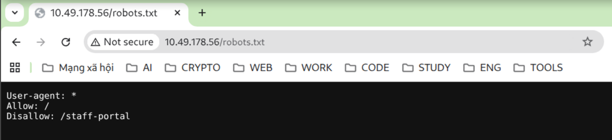
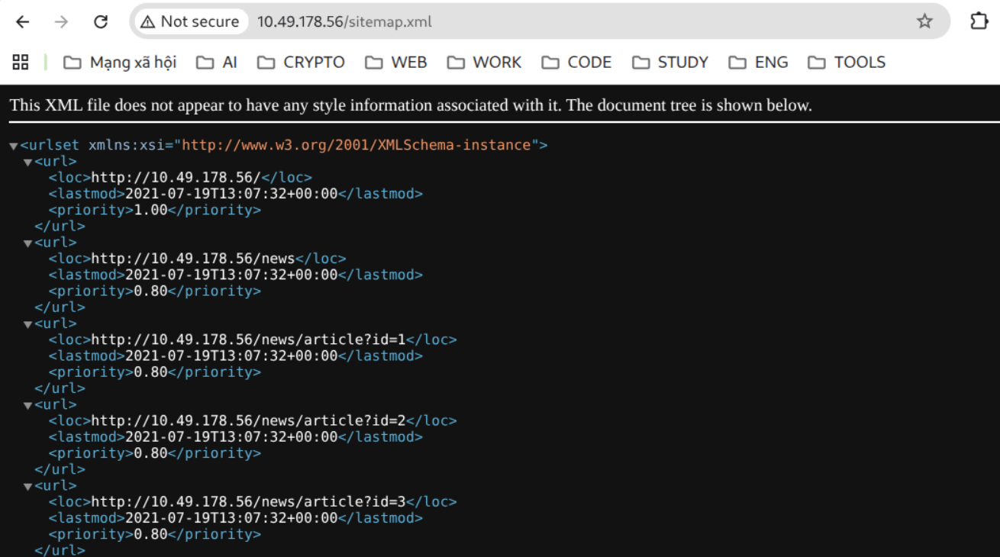
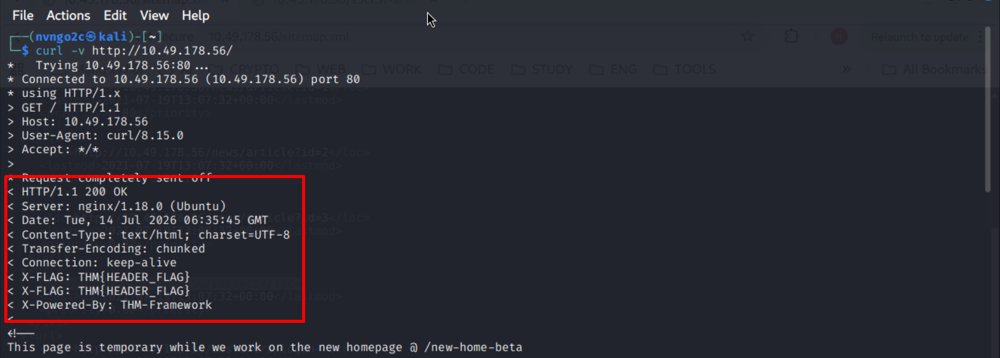
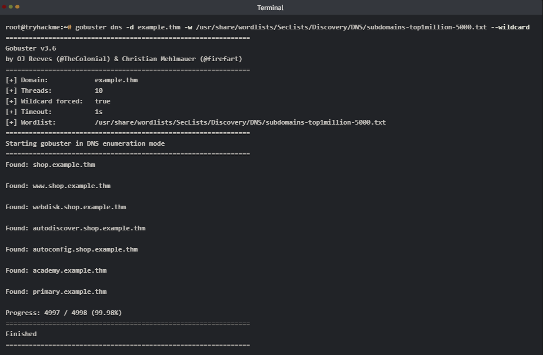

# **Content Discovery**
## **1. Introduction**
Bài học này ta sẽ học:
- Tìm kiếm thủ công những nội dung ẩn bằng: `robots.txt`, `sitemap.xml`, `favicons`, `HTTP headers` và phân tích `Framework`
- Sử dụng những tool OSINT: `Google dorking`, `Wappalyzer`, `the Wayback Machine`, `GitHub`, và `S3 bucket enumeration`
- Sử dụng `Gobuster` để **brute-force** *thư mục*, *subdomain* và *các host ảo*
- Áp dụng phương pháp tìm kiếm nội dung có cấu trúc 

## **2. Manual Discovery - Common Files**
### 2.1 robots.txt
- `robots.txt` là file nói với những trình craw dữ liệu của trình duyệt rằng trang nào chúng được quét
- Người sở hữu trang web thường liệt kê những file nhạy cảm và không cho phép chúng bị các trình craw quét



- Ta truy cập vào `/robots.txt` thấy 
    - `Allow: /` : cho phép vào tất cả các thư mục
    - `Disallow: /staff-portal` : Không cho vào /staff-portal

### 2.2 sitemap.xml


`sitemap.xml`: liệt kê các **URL quan trọng** của website để công cụ tìm kiếm dễ phát hiện và lập chỉ mục

## **3. Manual Discovery - Headers & Framework Stack**
### 3.1 HTTP Headers
- Khi server trả về 1 responds, nó bao gồm các `HTTP Header` có thể tiết lộ những công nghệ mà web sử dụng: `Server`, `X-Powered-By`, ... 
- Ta có thể sử dụng `curl` với `-v` để nhìn thấy chi tiết response



## **4. OSINT - Search Engines & Web Tools**
### 4.1 Google Hacking / Dorking
- Những toán tử tìm kiếm nâng cao của Google sẽ cho phép bạn lọc được những kết quả tìm kiếm về target (đã được đán chỉ mục trước đó)
- Bằng việc kết hợp những toán tử đó, ta có thể tìm được **admin panels**, **tài liệu bị lộ**, **trang đăng nhập**, ... hoặc những gì mà trang web không có ý định công khai

- `site:` : Trả về kết quả từ 1 domain chỉ định
- `inurl`: trả về những từ chỉ định có trong URL
- `filetype:` : Trả về những kết quả chứa những file chỉ định
- `intitle:` : Trả về những từ có trong tiêu đề của trang
- `intext:` : Trả về kết quả có chứa từ chỉ định trong phần thân nội dung 
- `cache:` : Cho thấy được phiên bản đã cache của trang web

### 4.2 Wappalyzer
Là 1 extension có thể xác định được những công nghệ mà web sử dụng, framwork, CMS Platform, ...\
Nó có thể phát hiện số phiên bản để phục vụ cho tìm kiếm những lỗ hổng đã biết

## **5. OSINT - Repositories & Achives**
### 5.1 Wayback Machine
`Wayback Machine` là 1 trang web lưu trữ dữ liệu Internet từ năm 1990\
Tra `domain`, ta có thể thấy được tất cả những `snapshot` được lấy từ các thời điểm mà web thu thập\

### 5.2 GitHub
- `Git` là 1 hệ thống quản lý phiên bản lưu những thay đổi của mã nguồn mọi lúc
- `Github` là 1 nền tảng cloud lưu trữ các repository
- Dev đôi lúc có thể vô tình up những dữ liệu nhạy cảm: **API key**, **thông tin đăng nhập**, **file cấu hình**, **/env** 

### 5.3 S3 Buckets
**S3 Bucket** là thư mục lưu trữ cấp cao nhất trên Amazon S3, còn các file bên trong là các object.

## **6. Automated Discovery - Gobuster Fundamentals**
- Gobuster là 1 công cụ mã nguồn mở viết bằng Go
- Nó hỗ trợ nhiều mode:
    - `dir`: liệt kê file, thư mục
    - `dns`: liêt kê các DNS subdomain
    - `vhost`: host ảo
    
- Các tham số:
    - `-t/--threads`: Số luồng
    - `-w/--wordlist`: Wordlist dùng để quét 
    - `-o/--output`: chỉ định output
    - `--delay`: Thời gian chờ giữa các request, hữu ích để tránh những web có **rate-limit**

## **7. Automated Discovery - Subdomain & Virtual Hosts**
### Phân biệt giữa subdomain và virtual host:
- `1 subdomain` là 1 `DNS record`, được phân giải thông qua DNS, nó chỉ đến 1 `IP` address
- `1 virtual` host được phân giải bởi web server, nhiều web có thể chạy cùng trên 1 IP, server sẽ sử dụng `Host:`(*HTTP Header*) để xác định web nào sẽ phục vụ

---

### Chuẩn bị môi trường
- Sửa file `/etc/resolv-dnsmasq` để chỉ định `DNS server`
```
nameserver 10.48.173.223
nameserver 169.254.169.253
```

- Fix host: sửa file /etc/hosts

```
10.48.173.223 example.thm
```

--- 
## DNS mode
```bash
gobuster dns -d example.thm -w /usr/share/wordlists/SecLists/Discovery/DNS/subdomains-top1million-5000.txt --wildcard
```

- `--wildcard`: 
    - Mặc định, Gobuster sẽ kiểm tra trước bằng một đường dẫn ngẫu nhiên: `/asdkjhaskjdh123123`
    - Nếu nhận được: `200 OK`
    - Gobuster sẽ báo lỗi kiểu: `Error: the server returns a status code that matches the provided options for non existing URLs` và dừng quét.
    - Nếu thêm `--wildcard` Gobuster sẽ không dừng, mà tiếp tục quét dù server có `wildcard response`.
    > **Lưu ý**: Kết quả có thể chứa rất nhiều false positive, nên bạn cần tự phân tích thêm (so sánh độ dài nội dung, tiêu đề, body,...)

- Các flag hữu dụng:
    - `-d / --domain`: mục tiêu quét
    - `-i / --show-ips`: hiển thị IP mà phân giải từ subdomain đó
    - `-r / --resolver`: sử dụng DNS server khác để phân giải



---
### vhost mode
- `vhost` không sử dụng `DNS`, không gửi truy vấn `DNS`
- Chế độ này gửi trực tiếp các `HTTP request` đến `IP` của máy chủ, sau đó `Gobuster` sẽ đặt từng từ trong `wordlist` vào `Host:`; 
- VD: 
```
GET / HTTP/1.1
Host: admin.example.com
```

```bash
gobuster vhost -u "http://10.48.173.223" --domain acmeitsupport.thm -w /usr/share/wordlists/SecLists/Discovery/DNS/subdomains-top1million-5000.txt --append-domain --exclude-length 250-320
```


