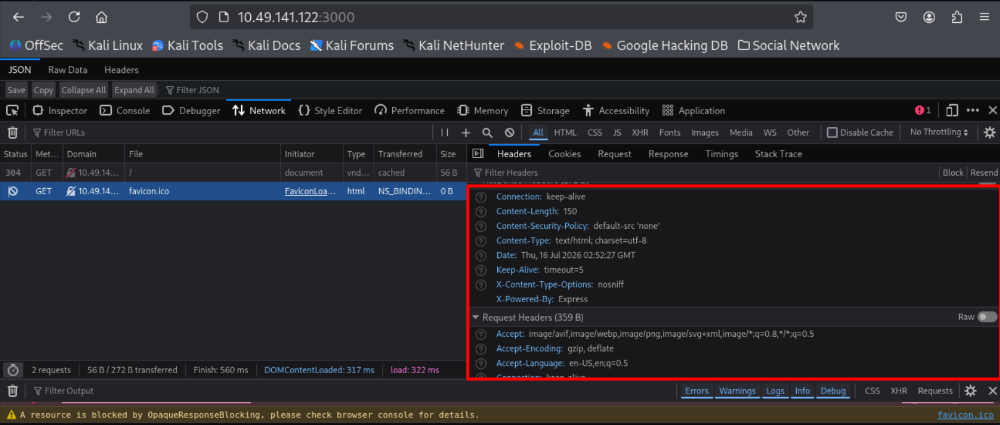
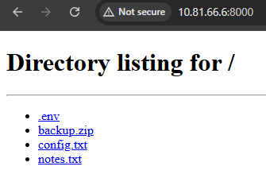
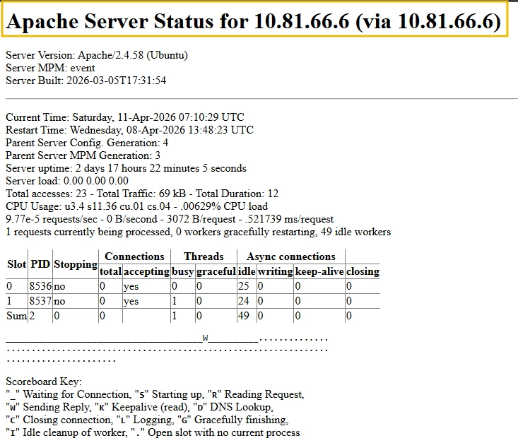
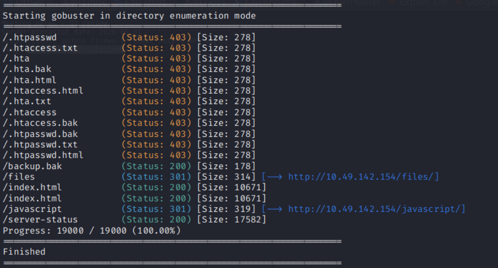
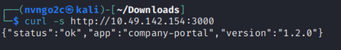

# **Web Server Attacks - I**
## **1. Introduction**
- Phòng này chủ yếu tìm hiểu, phân tích cách tìm những điểm yếu, lỗi cấu hình (reconnaise), chưa đi sâu vào kĩ các kĩ thuật khai thác
- Mục tiêu học tập:
    - Xác minh web server, phiên bản bằng cách sử dụng response headers và trang lỗi mặc định
    - Khám phá những rủi ro của HTTP server dựng bằng Python khi tai nạn không mong muốn xảy ra
    - Liệt kê danh sách thư mục Apache, các trang trạng thái được hiển thị và các tệp sao lưu không được liên kết
    - Xác định các điểm cuối gỡ lỗi, thông báo lỗi dài dòng và mức độ hiển thị biến môi trường trong các ứng dụng Node.js Express
    - Phát hiện danh sách thư mục Nginx autoindex và nginx_status được hiển thị
    - Thực hiện kiểm tra security header trên nhiều máy chủ bằng cách sử dụng Curl và Nikto

## **2. Indentifying Web Server**
- Những web server Apache, Nginx thường xác định được qua header `Server` 
- Nhưng với `Node.js Express` lại được xác định bằng Header `X-Powered-By`
- Ngoài việc xem request, header bằng những công cụ như curl, Burp Suite, Postman, ... ta còn có thể xem trực tiếp trên trình duyệt bằng tab Network trong Devtools 



- Khi ta gửi request bao gồm 1 đường dẫn không có thật, web sẽ trả về 1 page lỗi, mỗi web server đều có 1 kiểu page lỗi khác nhau
- Điều này có thể giúp ta biết được web server ngay cả khi các tiêu đề trực tiếp liên quan đến web server được ẩn đi

```bash
# HEAD request: chỉ gồm header, không có body
curl -sI http://10.49.141.122:PORT/

# GET request: full header và body
curl -s http://10.49.141.122:PORT/nonexistent-page-xyz
```

## **3. Python HTTP Server**

- Python có thể dựng lên 1 HTTP web server rất dễ dàng bằng lệnh
```bash
# This command serves the current working directory over HTTP on port 8000
python3 -m http.server 8000
```

- PHP HTTP Server chủ yếu được dựng lên để chia sẻ file nhanh chóng, test web tĩnh, chuyển thứ gì đó qua 2 máy trong cùng 1 mạng
- Nhưng vấn đề ở đây là có thể sẽ bị quên không tắt khi đã xong việc, điều đó có thể dẫn đến việc truy cập mà không cần xác thực, không log

- Python's HTTP server không có file cấu hình, không có blocklist, bật sẵn directory listing. Vì vậy tất cả những ai truy cập port 8000 đều có thể dowload những file có trong đó



- Khi phát hiện 1 Python's HTTP Server, ta thường nghiêng về việc lấy những thông tin trong đó thay vì khai thác lỗ hổng

## **4. Apache2**
- mod_status Page: khi cấu hình đúng nó chỉ cho phép truy cập từ localhost nhưng khi cấu hình sai nó sẽ cho phép truy cập từ mọi IP



- Khi truy cập bằng `http://10.49.142.154:80/server-status`, ta thấy được chi tiết về server

### **Tìm các tệp không được liên kết bằng Gobuster**
- Unlinked file là những file không có thẻ <a href="..."> nào trỏ đến, không xuất hiện trên menu của website, không được liệt kê trong sitemap, người dùng bình thường sẽ không biết để truy cập
- Unlinked file thường là những Backup file, Source code cũ, Database dump, File test, File cấu hình, Nhật ký (log)

```bash
gobuster dir -u http://10.49.142.154:80 -w /usr/share/wordlists/seclists/Discovery/Web-Content/common.txt -x bak,txt,html -t 20
```



## **5. Node.js (Express)**

- Khi truy cập web có Header `X-Powered-By: Express`, ta có thể biết đó là `Node.js`
- Node.js có thể trả về cả phiên bản trong respond của nó



- Thông thường, pentester phải dùng gobuster để kiểm tra xem web có những rote nào, nhưng khi lộ `/api/routes`, họ có thể biết chính xác web có những endpoint nào


 