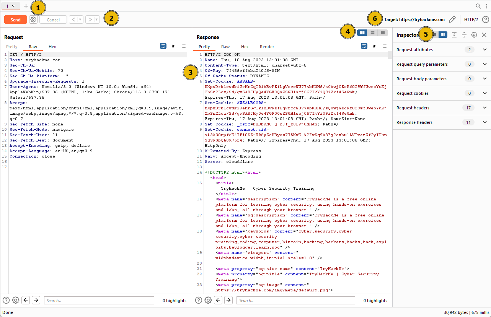
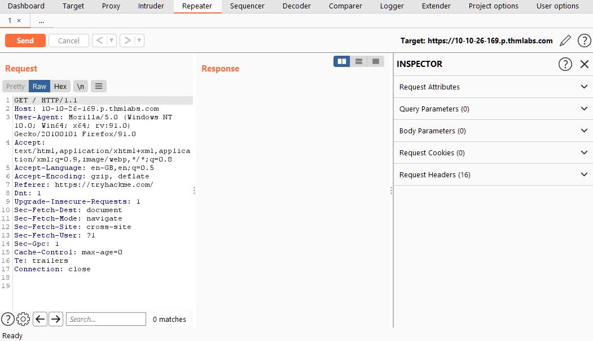
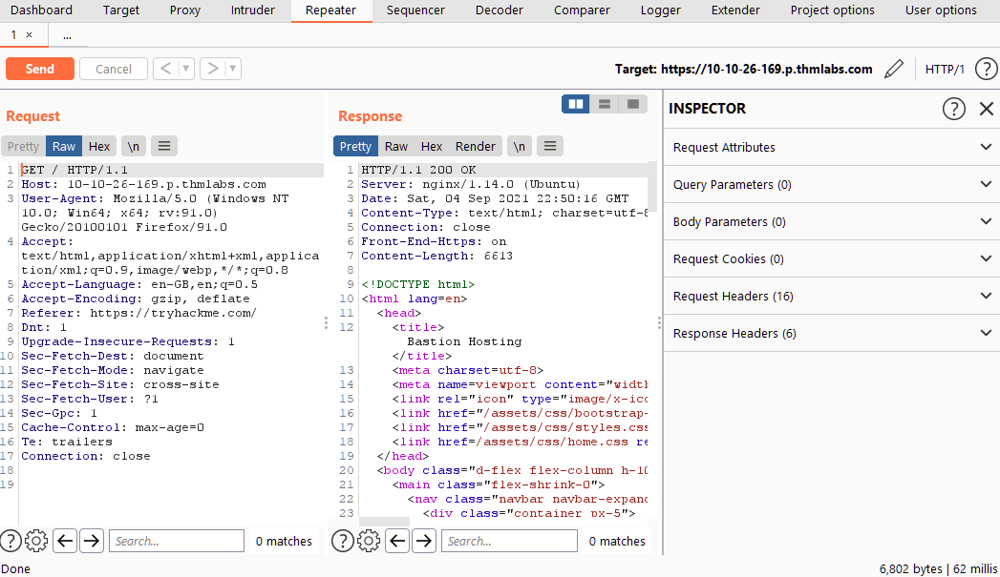
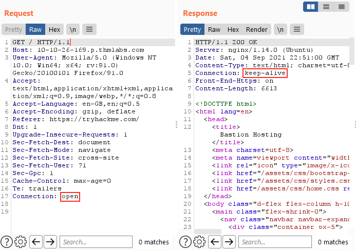

# **Burp Suite: Repeater**
## **2. What is Repeater?**
- Burp Suite Repeater cho phép chúng ta sửa và gửi lại request mà đã bắt được từ proxy - điều này có thể làm thủ công bằng `curl`

- Repeater bao gồm 6 phần:
    - **Request List**: vị trí ở trên cùng bên phải, và nó hiển thị những Repeater request, mỗi khi có request gửi sang repeater sẽ xuất hiện ở đây
    - **Request Controls**: cho phép gửi yêu cầu, hủy request treo và điều hướng qua lịch sử request
    - **Request and Response View**: phần này sẽ hiển thị Request and Response view; chúng ta có thể sửa sau đó gửi ở Request view và xem response trong Response view
    - **Layout Options**: cho chúng ta custom bố cục của  Request and Response view
    - **Inspector**: cho phép chúng ta phân tích, chỉnh sửa request một cách trực quan
    - **Target**: hiện thị IP hoặc domain mà ta sẽ gửi request đến 

## **3. Basic Usage**
- Từ tab `Proxy`, chúng ta click chuột phải vào request muốn chỉnh sửa/gửi lại, chọn `Send to Repeater` hoặc phím tắt `Ctrl + R`
- Sau đó chuyển sang tab **Repeater**, chúng ta có thể nhìn thấy được request đó

- Hiện tại chưa có response, ta click vào `Send` để có thể gửi và nhận response:

- Ta có thể dễ dàng chỉnh sửa request bằng cách sửa trực tiếp trong **Request view**, ví dụ có thể sửa header `Connection: open`

- Ta có thể quay lại request trước bằng nút điều hướng lịch sử (`<` và `>`) nằm bên phải của nút `Send` 

## **4. Message Analysis Toolbar**

- Repeater cung cấp cho chúng ta nhiều cách biểu diễn request và response, từ **Hex** đến **Render** giao diện của trang web
- Các cách biểu diễn:
    - **Pretty**: đây là option mặc định, nó biểu diễn bằng response thô nhưng cho khả năng đọc tốt hơn
    - **Raw**: hiển thị response không thể sửa được nhận trực tiếp từ server mà không thêm bất kì định dạng nào
    - **Hex**: biểu diễn request dưới dạng byte - điều này hữu dụng khi ta làm việc với những file binary
    - **Render**: hiển thị trang giao diện web

## **5. Inspector**
- **Request Attributes**: thay đổi những phần tử liên quan đến vị trí, phương thức, giao thức của request; VD: đổi từ `HTTP/1` sang `HTTP/2`
- **Request Query Parameters**: chứa những tham số ở URL của phương thức `GET`
- **Request Body Parameters**: tương tự như **Request Query Parameters** nhưng của phương thức `POST`, những tham số này ở phần thân của request
- **Request Cookies**: chứa cookie 
- **Request Headers**: cho phép xem, sửa, truy cập vào các header trong request của chúng ta
- **Response Headers**: dùng để xem, không chỉnh sửa được những header của reponse mà server gửi về

