# **Burp Suite: Intruder**
- Burp Suite Intruder là 1 công cụ rất mạnh mẽ, nó cho phép tự động hóa và custom những payload tấn công

##  **1. What is Intruder**
- Intruder là công cụ mạnh mẽ tích hợp của Burp Suite cho phép sửa đổi yêu cầu tự động và kiểm tra lặp đi lặp lại với các biến thể trong giá trị input
- Nó phục vụ rất nhiều mục đích: brute-forcing form đăng nhập hoặc fuzzing các thư mục con, endpoint, virtual host
- Các công cụ có chức năng tương tự nhưng dùng CLI là Wfuzz hoặc ffuf

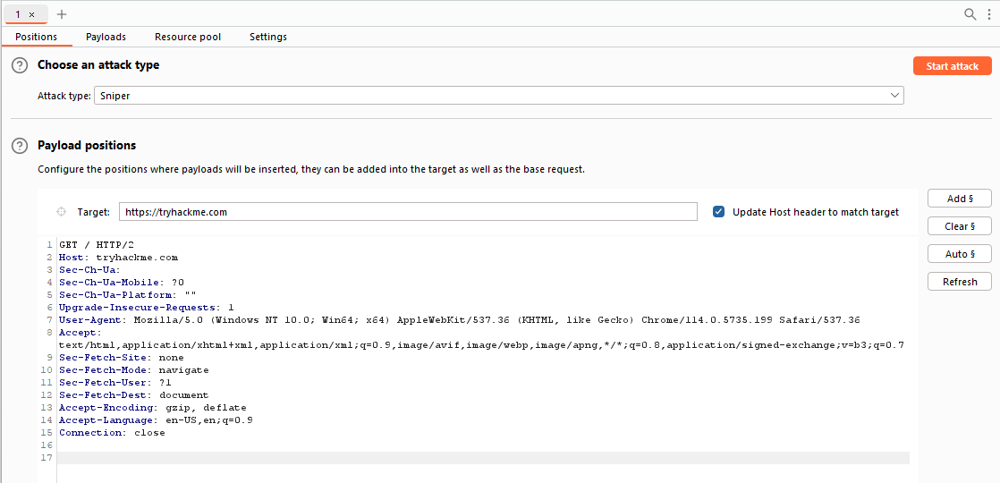

- Ta có thể lấy request từ Proxy chuyển sang Intruder ta chỉ cần nhấn Ctrl + I
- Có `4` tab con trong giao diện của Intruder:
    - **Positions**: cho phép chúng ta lựa chọn kiểu tấn công và cấu hình vị trí và chúng ta sẽ chèn payload của ta vào request mẫu
    - **Payloads**: chỉnh sửa hành vi của payload như là định nghĩa hành động nào đó trước khi gửi payload đi: thêm tiền tố, hậu tố, tìm kiếm và thay thế, bỏ qua payload dựa trên biểu thức chính quy
    - **Resource Pool**: cho phép phân bổ tài nguyên giữa các tác vụ khác nhau
    - **Settings**: cho phép cấu hình hành vi tấn công, xử lý kết quả và chính request tấn công
    
## **2. Positions**
- Điều đầu tiên khi muốn thực hiện cuộc tấn công, ta phải xác định được vị trí trên request mà ta muốn chèn payload của chúng ta vào

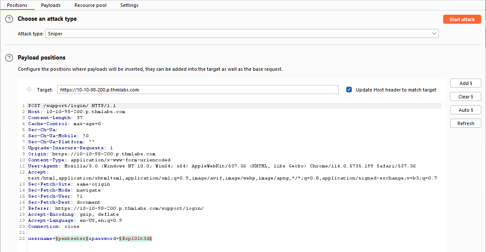

- Có `3` nút liên quan đến thực hiện thêm, xóa và tự động:
    - `Add §`: cho phép chúng ta tự điều chỉnh thủ công vị trí cần thêm trên request
    - `Clear §`: xóa tất cả những vị trí đã được định nghĩa trước
    - `Auto §`: cố gắng xác định các vị trí có khả năng nhất dựa trên request

## **4. Payload**
- Trong tab Payload của Burp Suite Intruder, chúng ta có thể tạo, chỉ định và cấu hình payload cho cuộc tấn công của mình

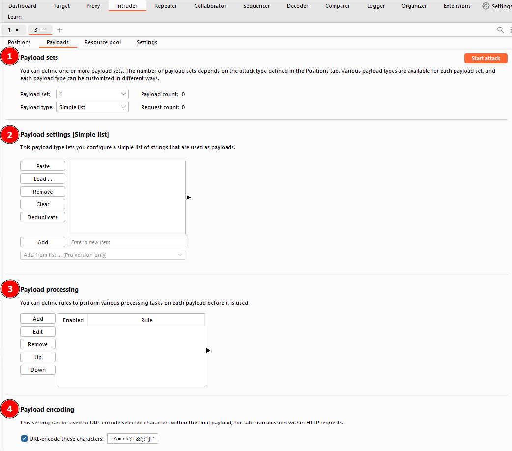

- Tab phụ này được chia thành 4 phần:
    - Payload Sets
    - Payload settings
    - Payload Processing
    - Payload Encoding

## **5. Introduction to Attack Types**
Có 4 chế độ attack:
- **Sniper**: thêm một payload mỗi lần
- **Battering ram**: giống sniper những gửi tất cả các request cùng nhau (Race Condition)
- **Pitchfork**: cho phép gửi theo kiểu các bộ payload 
- **Cluster bomb**: gửi kiểu kết hợp tất cả các từ trong danh sách này với danh sach khác (**m*n**)

## **6. Sniper**
- **Sniper** là kiểu tấn công mặc định và được sử dụng phổ biến nhất trong Burp Suite Intruder
- Nó đặc biệt hiệu quả đối với các cuộc tấn công vào một vị trí, chẳng hạn như **brute-force** mật khẩu hoặc **fuzzing** các điểm cuối API
- Chúng ta cung cấp một list các payload, có thể là một danh sách từ hoặc một dãy số và Intruder sẽ chèn từng tải trọng vào từng vị trí được xác định trong Request

## **7. Battering Ram**
- Nó cũng giống **Sniper** nhưng lần này sẽ có nhiều vị trí được đánh dấu hơn thay vì 1 vị trí
- Sau đó những từ ở trong wordlist sẽ được thay thế vào những vị trí đó
- Điều này có có nghĩa là chế độ này phục vụ cho những request nào yêu cầu 1 từ payload phải xuất hiện ở nhiều vị trí khác nhau

## **8. Pitchfork**
- **Pitchfork** dùng nhiều danh sách payload, mỗi vị trí §...§ có một danh sách riêng, và Burp lấy payload cùng hàng để gửi trong một request.

## **9. Cluster bomb**
- **Cluster bomb** là kiểu tấn công mạnh nhất của Burp Intruder vì nó thử mọi tổ hợp giữa các payload set

## **10. Extra-mile Challange**
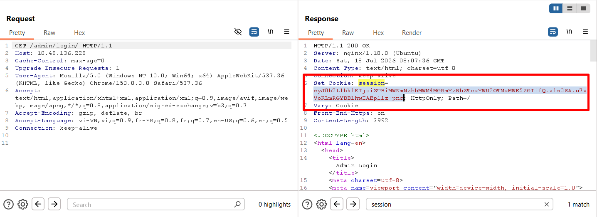

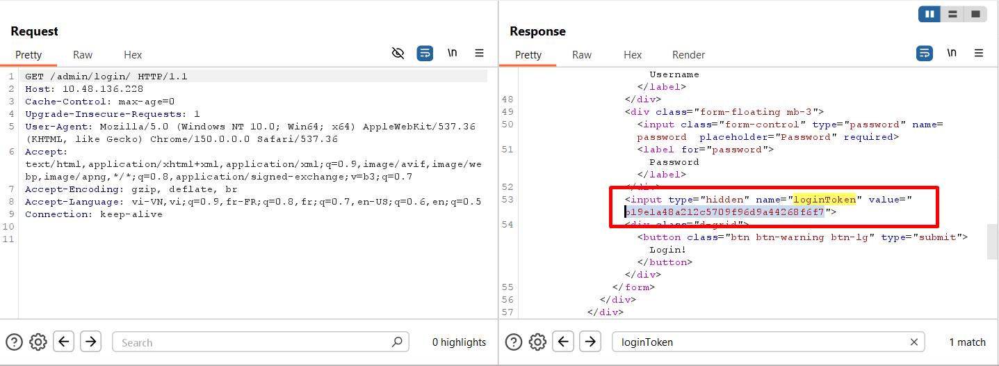

Khi gửi request `GET` đến `/admin/login/`, ta thấy response trả về gồm 2 trường là `session` và `loginToken`

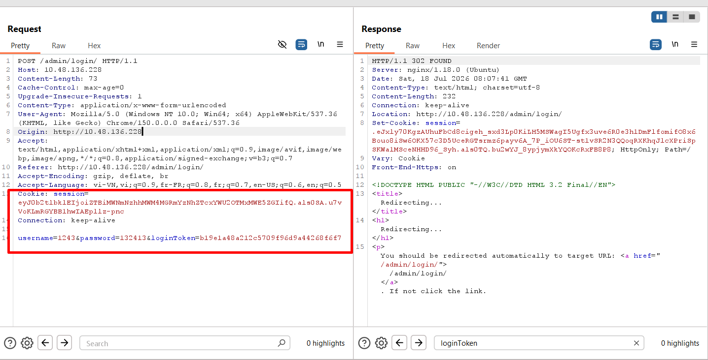

Sau đó ta quan sát request khi gửi thông tin **username/password** lên để xác thực đăng nhập, thấy nó bao gồm đúng 2 trường `session` và `loginToken` gửi kèm theo giống hệt như trong request `GET`

Vì vậy bây giờ muốn brute-Force được ta cần phải có cách nào để: gửi request GET để lấy loginToken và session rồi từ đó lại thay vào trường tương tự của request POST

Ta sẽ dùng **Macro** cho Intruder

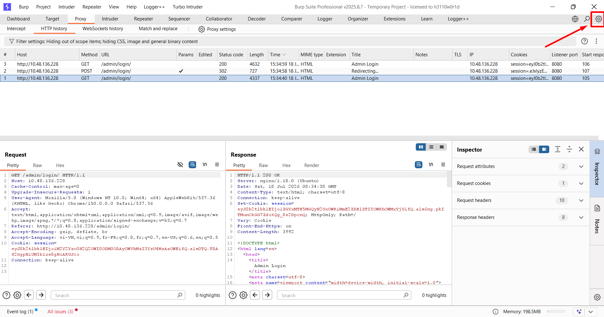

Bước đầu tiên vào cài đặt 

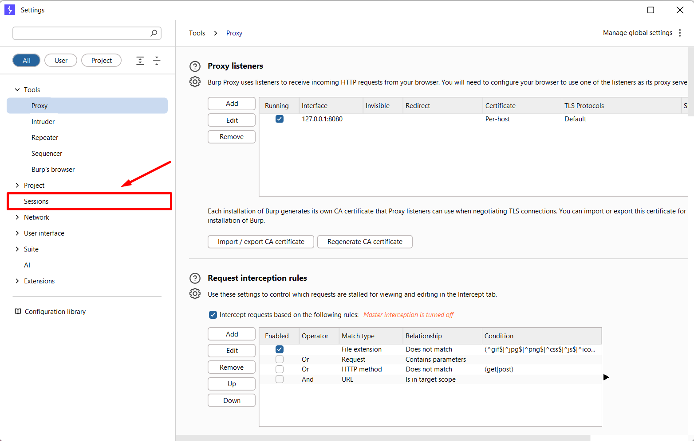

Tiếp theo là `Session`

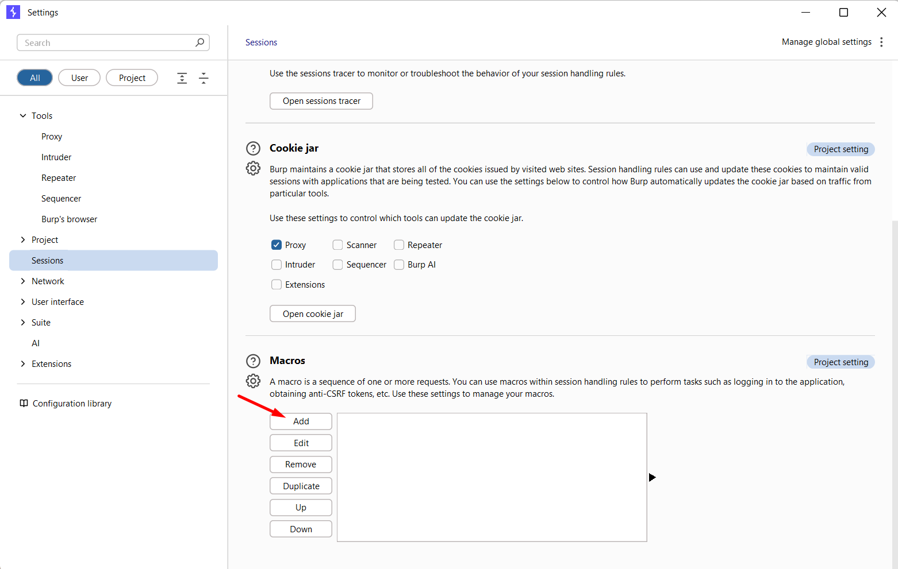

**Add**

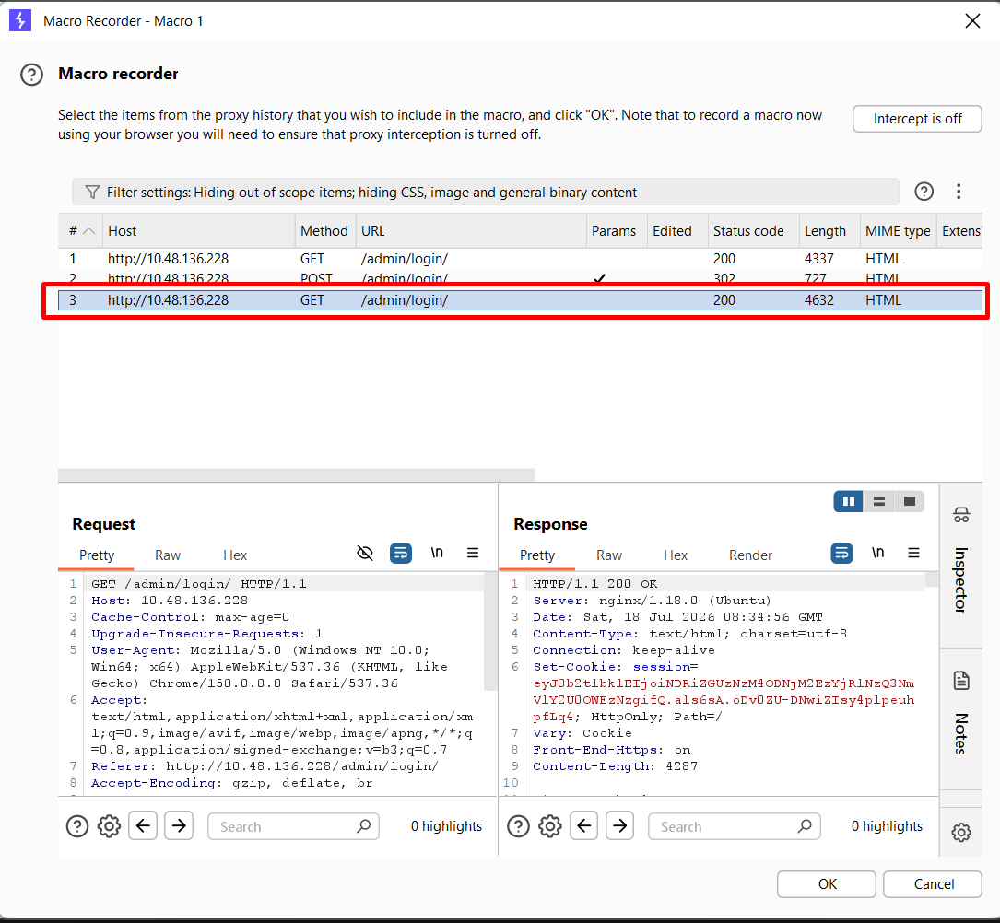

Chọn request `GET`

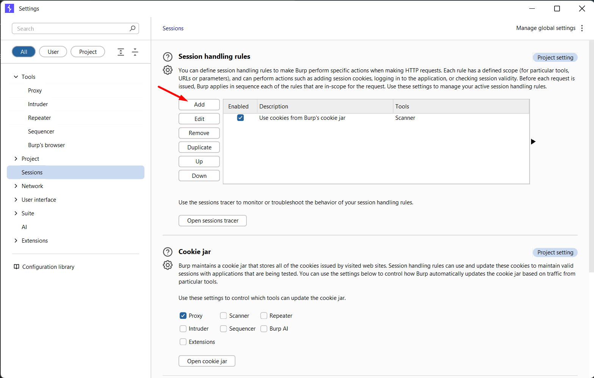

**Add** 

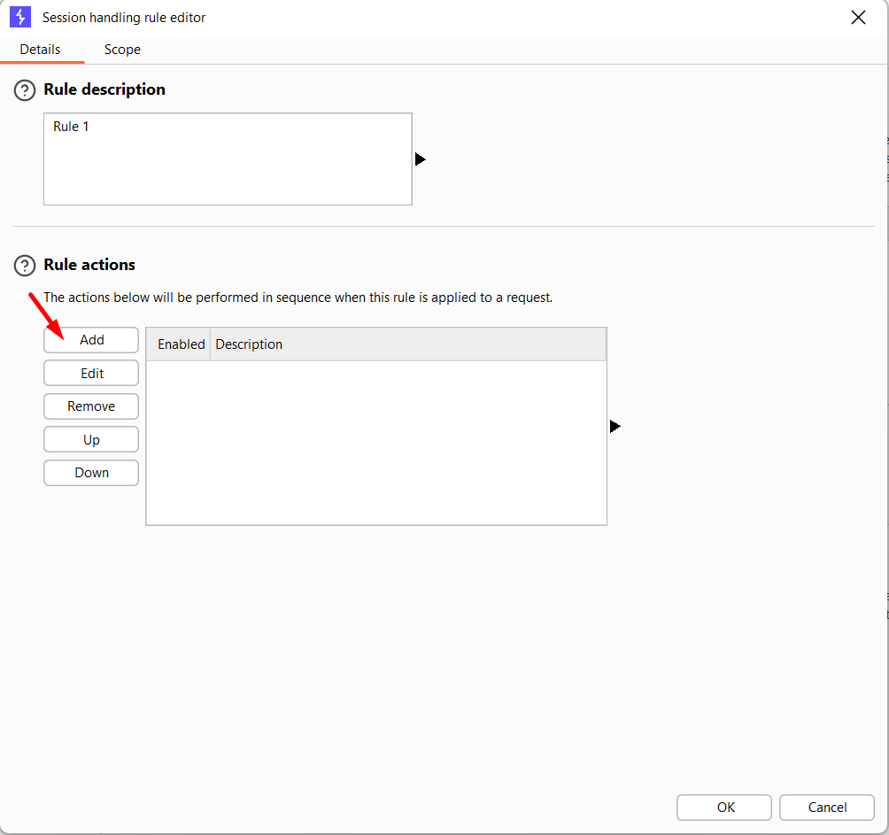

**Add**

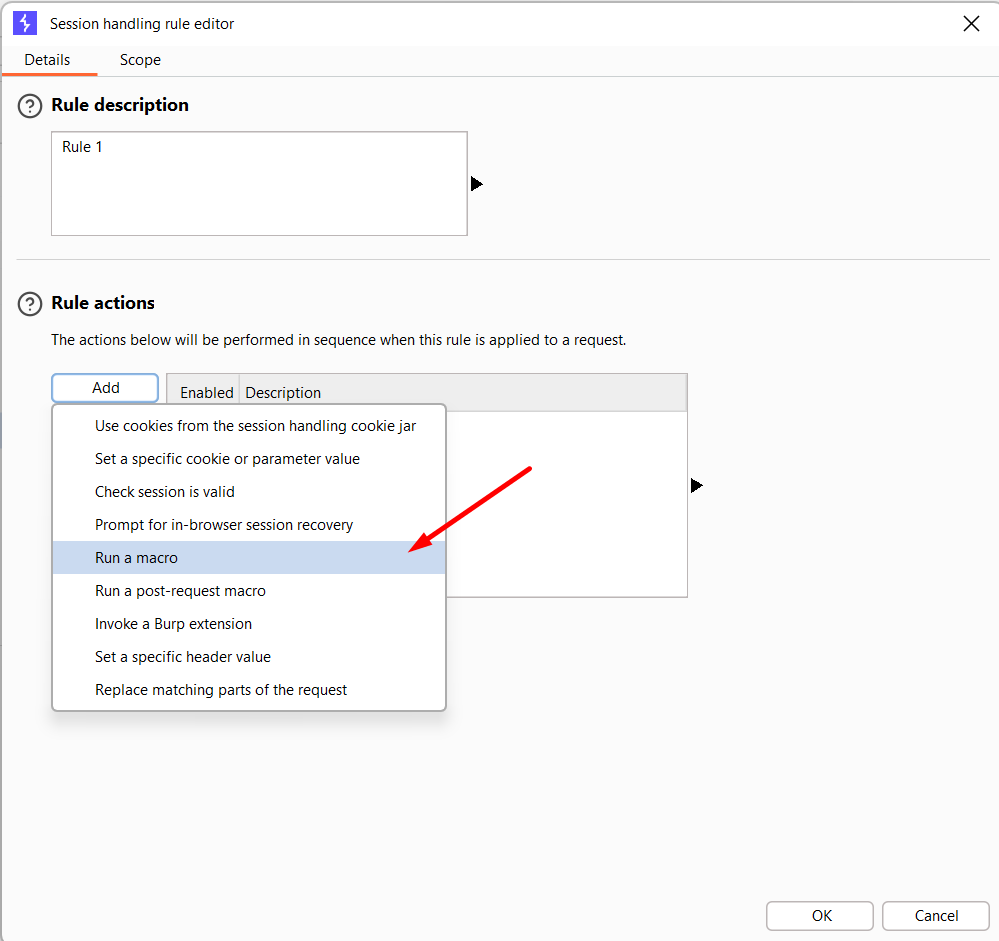

**Run a macro**

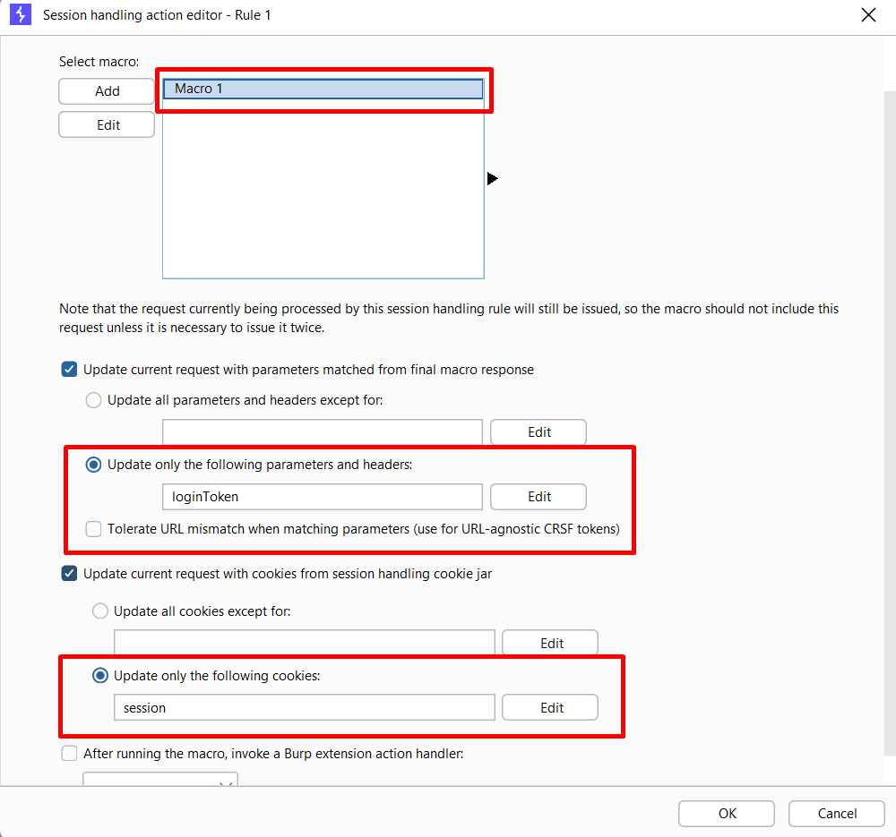

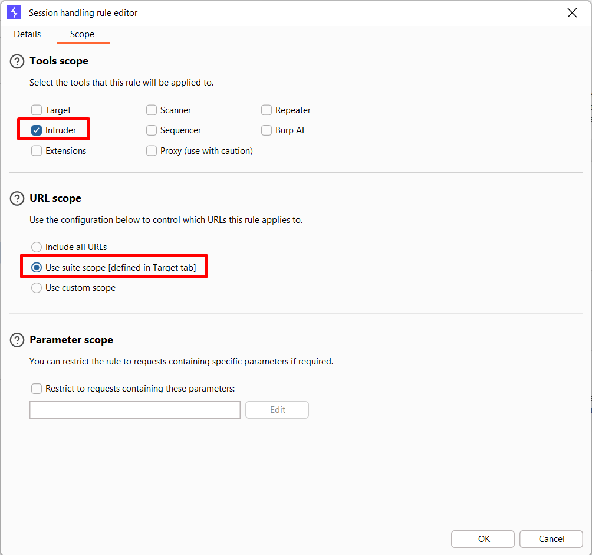

Chỉ giữ lại Intruder được phép dùng **Macro**\
Và chỉ thực hiện trong những URL nào trong scope 

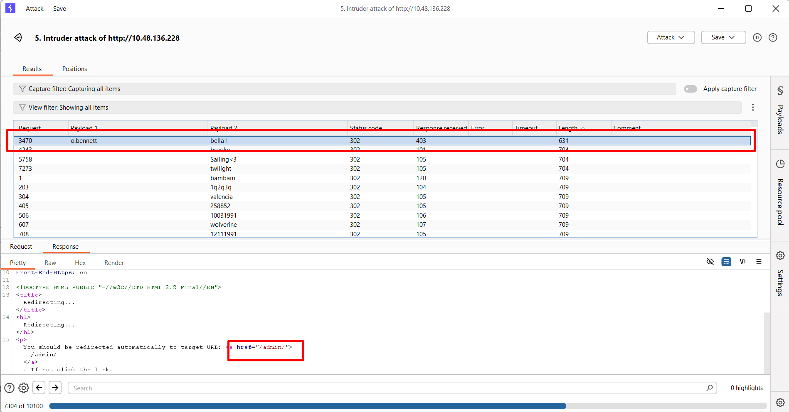

Ta vẫn cấu hình và chạy Intruder như bình thường

