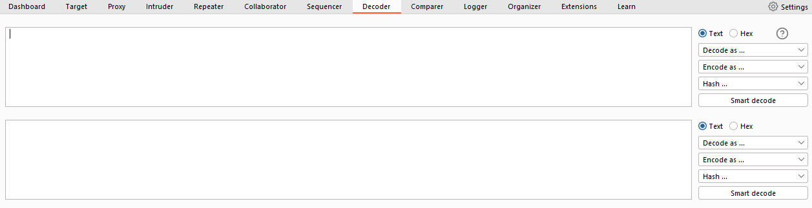
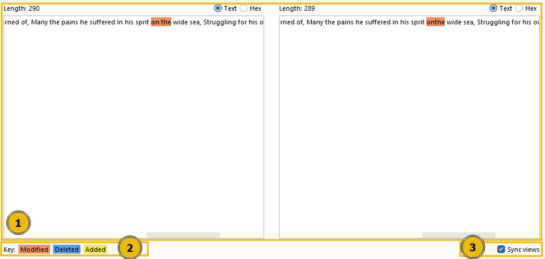
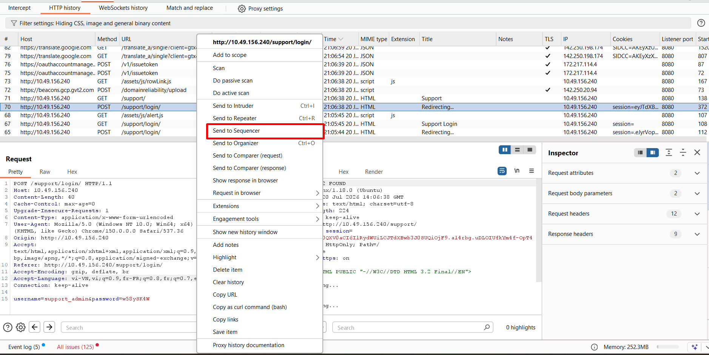
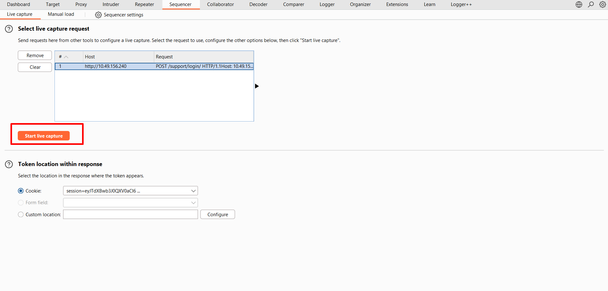
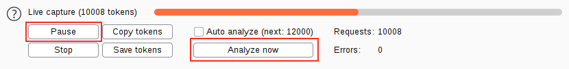

# **Burp Suite: Other Modules**
## **1. Introduction**
Phòng này sẽ tập trung vào các công cụ khác như **Decoder**, **Comparer**, **Sequencer**, and **Organizer tools**, nhiệm vụ của chúng khác đơn giản nhưng nếu áp dụng được thì chúng sẽ tiết kiệm được khá nhiều thời gian trong quá trình kiểm thử của chúng ta

## **2. Decoder Overview**
- Decoder giải mã cả dữ liệu mà Burp thu thập được và có thể mã hóa cả những payload trước khi gửi request
- Nó cũng cung cấp tính năng Smart Decode (*Giải mã thông minh*), nó cố gắng giả mã dữ liệu bằng cách giải mã đệ quy cho đến khi dữ liệu trở về dạng văn bản đọc được

- Ta có thể bôi đen phần muốn giải mã --> chuột phải --> Send to Decoder
- Bên phải có tùy chọn định dạng của đầu vào bao gồm *text, URL, Hex, Base64*

## **3. Decoder: Encoding/Decoding**
- Plain: là văn bản thô trước khi áp dụng các tính năng decode/encode
- URL: dùng khi ta cần đảm bảo dữ liệu được gửi đi được encode dưới dạng URL; nó thay thế các kí tự `ASCII` sang dạng `Hex` với dấu `%` đứng trước; VD: dấu `/` --> `%2F` 
- HTML: Mã hóa các HTML entity thay thế các kí tự đặc biệt bằng dấu `&` và kết thúc bằng dấu `;` 
- Base64: encode/decode dữ liệu sang dạng `Base64`
- ASCII Hex: chuyển sang dạng `Hex` tương ứng
- Hex, Octal, and Binary: Các tùy chọn này chỉ áp dụng đối với đầu vào là số

## **4. Decoder Hashing**
Dùng các thuật toán băm để băm dữ liệu theo một thuật toán cụ thể

## **5. Comparer: Overview**

- Dùng để so sánh dữ liệu mà ta đưa vào
- Nó so sánh bằng byte của 2 mẫu dữ liệu
- Nó có thể hiện thị những kí tự nào đã được sửa, xóa và thêm giữa 2 dữ liệu

## **7. Sequence: Overview**
- Tab này có chức năng kiểm tra tính ngẫu nhiên của token
- Có 2 cách chính để thực hiện:
    - Live Capture: cách này ta cho phép Sequence tự động gửi và lấy token từ request ta gửi sang, sau đó tự động phân tích tính ngẫu nhiên
    - Manual Load: cách này cho phép ta load sẵn một danh sách token có sẵn mà ta đã thu thập từ trước giúp Burp không cần phải gửi cả nghìn request để thu thập token 

## **8. Sequence: Live Capture**

- Ta sẽ lấy request từ Proxy (*hoặc Repeater, Intruder*) --> chuột phải ----> Send to Sequencer 

- Sau đó chọn **Start live capture**

## **9. Sequencer: Analysis**

### 1. Overall Result
- Đánh giá tổng quan về **độ an toàn của cơ chế sinh token**.
- Dựa trên chất lượng ngẫu nhiên (randomness) của token.
- Kết quả có thể là:
  - Excellent: rất an toàn.
  - Good: tốt.
  - Poor / Extremely poor: token có thể dự đoán được.

---

### 2. Effective Entropy
- Đo **mức độ ngẫu nhiên thực tế** của token.
- Đơn vị: **bit**.
- Entropy càng cao → token càng khó đoán.
- Ví dụ:
  - ~117 bits → rất an toàn.
  - 0 bits → gần như không có tính ngẫu nhiên.

---

### 3. Reliability (Significance Level)
- Thể hiện **độ tin cậy của kết quả thống kê**.
- Ví dụ:
  - Significance level = 1%
  - ⇒ khoảng 99% tin tưởng vào kết quả phân tích.

---

### 4. Sample
- Thông tin về tập token được phân tích:
  - Số lượng token.
  - Đặc điểm của token.
- Mẫu càng nhiều → kết quả càng chính xác.

---

### Lưu ý
- Summary chỉ đưa ra đánh giá tổng quan.
- Muốn phân tích sâu hơn cần xem thêm:
  - Character-level analysis
  - Bit-level analysis

- Entropy cao là dấu hiệu tốt nhưng **không đủ để khẳng định hệ thống hoàn toàn an toàn**.
- Cần kết hợp với các phân tích khác vì kết quả vẫn dựa trên xác suất và thống kê.

## **10. Organizer: Overvieư**

### Chức năng
- Lưu trữ và ghi chú (annotate) các HTTP request để xem lại sau.
- Giúp tổ chức và quản lý quá trình pentest.

### Khi nào dùng?
- Lưu các request cần phân tích sau.
- Lưu các request đã phát hiện thú vị.
- Lưu các request dự định đưa vào báo cáo.

### Cách gửi request vào Organizer
- Chuột phải vào request → **Send to Organizer**
- Hoặc dùng phím tắt **Ctrl + O**.
- Có thể gửi từ các module như:
  - Proxy
  - Repeater
  - (và các module khác)

> Request được lưu là **bản sao chỉ đọc (read-only)** tại thời điểm gửi.

### Thông tin được lưu
Mỗi request hiển thị trong bảng với các thông tin như:
- Index (STT)
- Thời gian
- Workflow status
- Module gửi request
- HTTP Method
- Host
- URL Path
- Query String
- Số lượng tham số
- HTTP Status Code
- Kích thước response
- Ghi chú (Notes)

### Xem request/response
- Chọn một mục trong Organizer để xem.
- Request và Response đều **chỉ đọc (read-only)**.
- Có thể:
  - Tìm kiếm trong request/response.
  - Đọc và xem lại nội dung.

