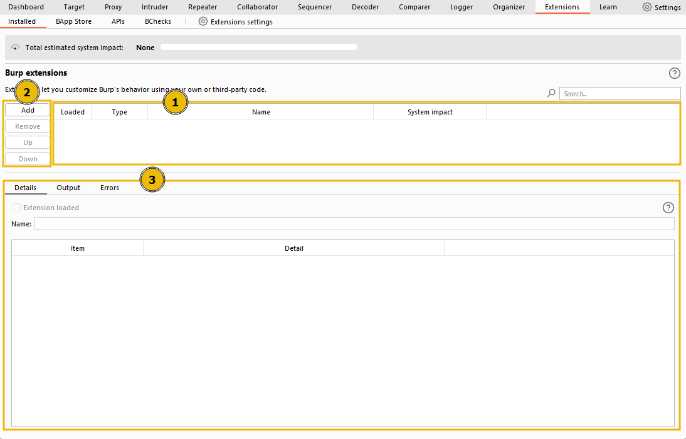

# **Burp Suite: Extensions**
## **1. The Extensions Interface**

1. **Extensions List**: drop box hiển thị các extension hiện có trong dự án, có thể kích hoạt hoặc hủy kích hoạt
2. **Managing Extensions**: có những tùy chọn để quản lý extension:
    - **Add**: thêm 1 extension bên ngoài từ máy của chúng ta
    - **Remove**: cho phép gỡ 1 extension đang chọn
    - **Up/Down**: cho phép sắp xếp thứ tự của các extension
    
3. **Details, Output, and Errors**:
- **Details**: cung cấp những chi tiết của extension như tên, phiên bản, mô tả
- **Output**: hiển thị những kết quả mà extension tạo ra trong quá trình thực thi
- **Errors**: hiển thị những lỗi mà extension gặp phải trong quá trình chạy, dùng cho debug và khắc phục sửa chữa lỗi

## **2. The BApp Store**
- BApp cho phép chúng ta khám phá những extension chính thức của Burp Suite
- Ở đây ta có thể tải xuống những extension phù hợp với từng nhiệm vụ của mình

## **3. Jython**

- Nhiều extesion được viết bằng Python, vì vậy ta cần phải cài Jython để có thể chạy được những extension này

## **4. The Burp Suite API**
- Tab này cho phép chúng ta xem những tài liệu về APIs và tải về những mẫu để có thể tự viết những extension của mình
- Burp Suite hỗ trợ nhiều ngôn ngữ để viết extension như:
    - Java: có thể viết trực tiếp extension
    - Python: khi viết extension bằng Python, ta cần cài Jython để có thể chạy 
    - Ruby: tương tự như Python, ta phải cài thêm JRubu 

