# **CSRF Introduction**
## **1. What is CSRF**
- CSRF là một lỗ hổng web cho phép attacker có thể lợi dụng trình duyệt mà người dùng đã xác thực để có thể gửi request
- Bởi vì trình duyệt luôn lưu giữ những session cookie cho mọi request, nên khi request được gửi đi, web sẽ cho rằng request đó do chính người dùng thực hiện
- Thay vì lấy thông tin người dùng, attacker lợi dụng sự tin tưởng giữa trình duyệt và web
- Nếu hành động đó là những hành động nhạy cảm như đổi email hoặc cập nhật cài đặt tài khoản người dùng, attacker có thể chỉnh sửa tài khoản của nạn nhân mà họ không hề hay biết

---
### Cách CSRF hoạt động
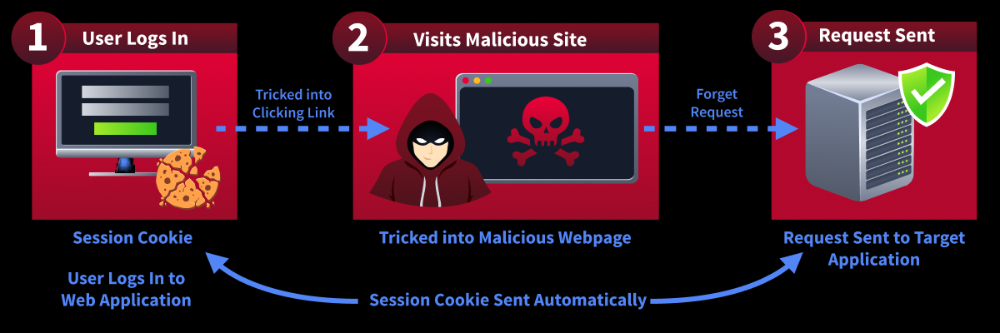

- CSRF thường diễn ra theo 3 bước:
    - Nạn nhân trước đó đã đăng nhập vào 1 web hợp lệ(*nhưng tồn tại lỗ hổng*)
    - Attacker lừa nạn nhân vào trang web đã có request mà hắn tạo sẵn và chờ nạn nhân click vào(*hoặc có thể không cần tác động gì của nạn nhân*)
    - Sau khi vào trang web độc hại, trình duyệt của người dùng tự động gửi đi request đã được tạo sẵn và kèm theo đó là cookie của nạn nhân
- Bởi vì request chứa những cookie hợp lệ, nên ứng dụng web vẫn thực hiện request đó như người dùng hợp lệ gửi

---
### **Tại sao nó lại nguy hiểm**
CSRF có thể được sử dụng để thực hiện hành vi phụ thuộc vào chức năng của web như:
- Đổi email của người dùng
- Cập nhật cài đặt người dùng 
- Thực hiện những giao dịch tài chính
- Thay đổi tùy chọn bảo mật

## **2. Why CSRF Works**
- CSRF hoạt động dựa trên lỗi của trình duyệt, nó xảy ra khi web tin tưởng vào request quá mức
- Thông thường khi người dùng đăng nhập vào 1 trang web, trang web sẽ trả về session cookie-như một tấm vé vào cửa xác minh danh tính của người dùng cho lần truy cập tiếp theo, trình duyệt sẽ lưu trữ thứ này
- Nguyên nhân chính ở đây là trình duyệt luôn tự động gửi cookie này một cách tự động mà không biết request này đến từ một trang hợp pháp hay một trang độc hại

--- 
3 điều kiện chính để CSRF hoạt động:
- Nạn nhân đã đăng nhập trên web có lỗ hổng
- Web mục tiêu phải thực hiện 1 hành động thay đổi nào dó ví dụ như cập nhật cài đặt người dùng hoặc sủa đổi dữ liệu người dùng
- Web không kiểm tra liệu request có đến từ nguồn tin tưởng không

## **3. Finding CSRF Vulnerabilities**
- Trước khi thực hiện khai thác CSRF, pentester phải xác định nơi nào có thể tồn tại lỗ hổng
- Không phải mọi chức năng trong web đều là mục tiêu tốt, CSRF thường nhắm đến những hành động thay đổi dữ liệu người dùng 

---

- Các tính năng phổ biến dễ bị CSRF:
    - Thay đổi email
    - Đổi mật khẩu
    - Thay đổi thông tin các nhân
    - Thay đổi thông tin mua bán

---
 
### **Quan niệm sai lầm về GET và POST **
- Rât nhiều lập trình viên nghĩ rằng phương thức `POST` sẽ mặc định chống lại CSRF
- Nhưng không, cả GET và POST đều có thể bị lợi dụng để tấn công CSRF nếu web không xác minh requeset đến từ một nguồn tin cậy

## **4. Exploitation using HTML Form**
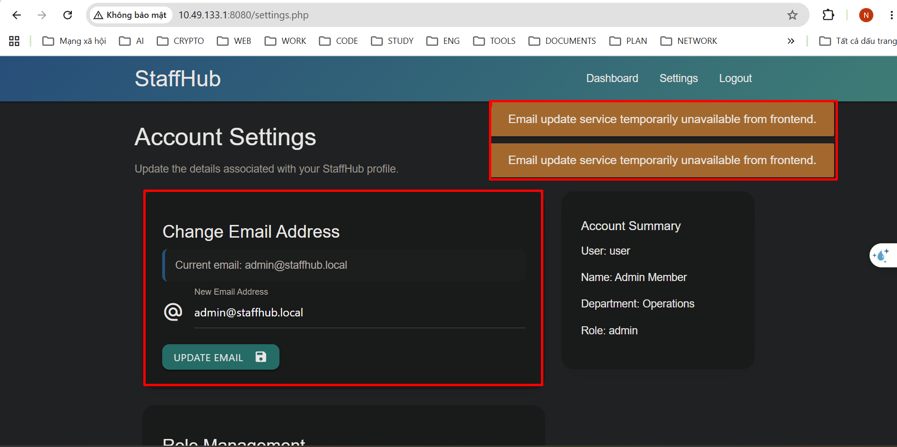

- Đề cho ta một trang web và thông tin người dùng để đăng nhập
- Sau khi đăng nhập ta thấy có chức năng đổi mật khẩu, nhưng nó lại bị vô hiệu hóa ở Frontend

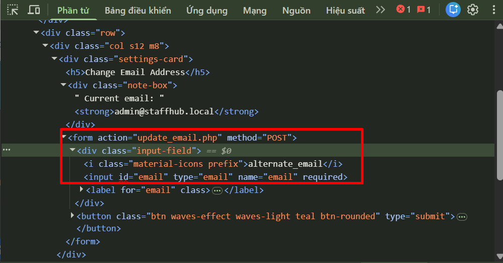

- Tại đây ta thấy được rằng, Frontend chỉ có trường input là `email` chứ không hề có bất kì mã `CSRF` nào để xác thực

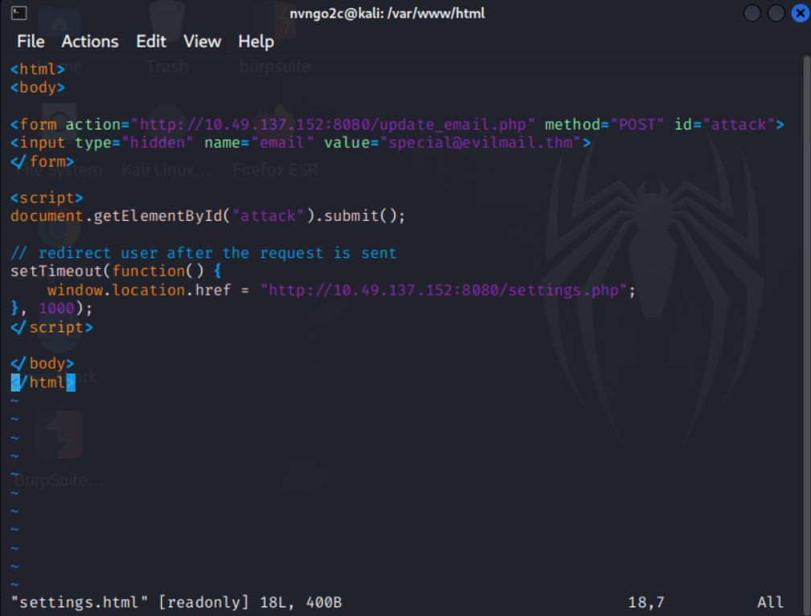

- Ta chuẩn bị 1 server và file để có thể làm server chuyển hướng URL, tạo 1 file `settings.html` 
- Tiếp theo dùng lệnh 
```bash
python -m http.server 81
```
để có thể deploy file `settings.html` lên

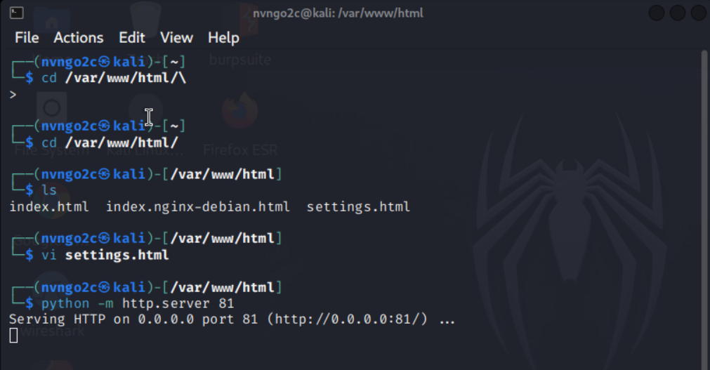

- Tiếp theo ta sẽ truy cập bằng trình duyệt của nạn nhân (*giả sử bị lừa bấm vào*)

```url
http://192.168.1.138:81/settings.html
```

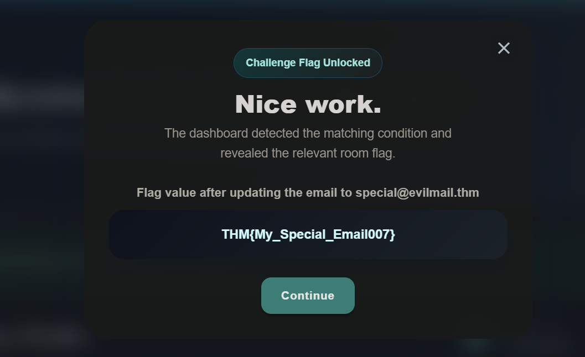

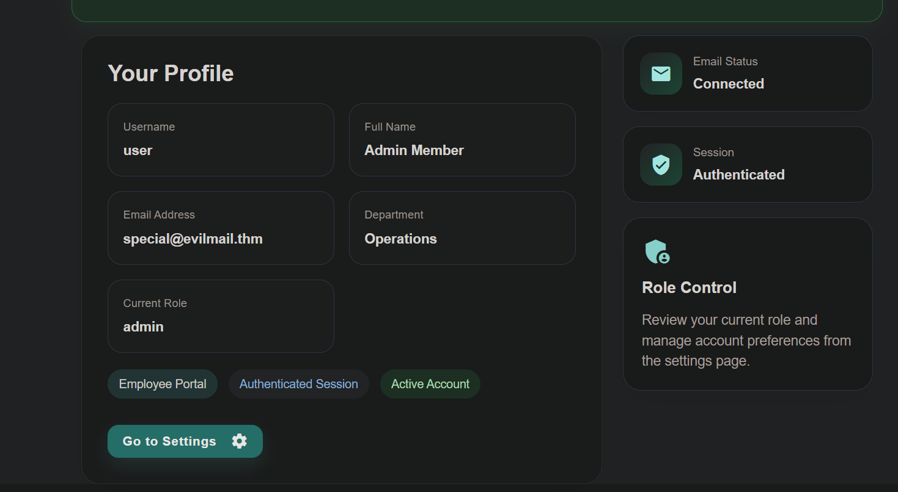

- Ngay khi truy cập đường dẫn trên, ta bị chuyển hướng đến trang web ban đầu và cùng lúc đó nó thực hiện hành động đổi email của nạn nhân

## **5. Exploitation over Weak Tokens**
- Trong bài trước thì ta khai thác ứng dụng web khi nó không có bất kì mã gì để có thể bảo vệ ứng dụng
- Nhưng trong thực tế, web thường sẽ có mã CSRF cho mỗi request để đảm bảo hành động được thực hiện bởi người dùng hợp pháp
- Nhưng khi có CSRF token rồi, có 1 vấn đề phát sinh đó chính là CSRF có thể bị bypass do quá yếu, hoặc cấu hình xác thực sai

---

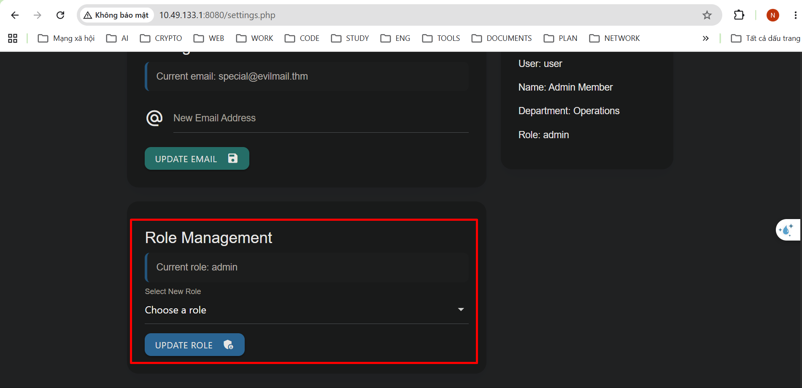

- Vẫn là trang web vừa rồi nhưng có thêm chức năng sửa đổi quyền

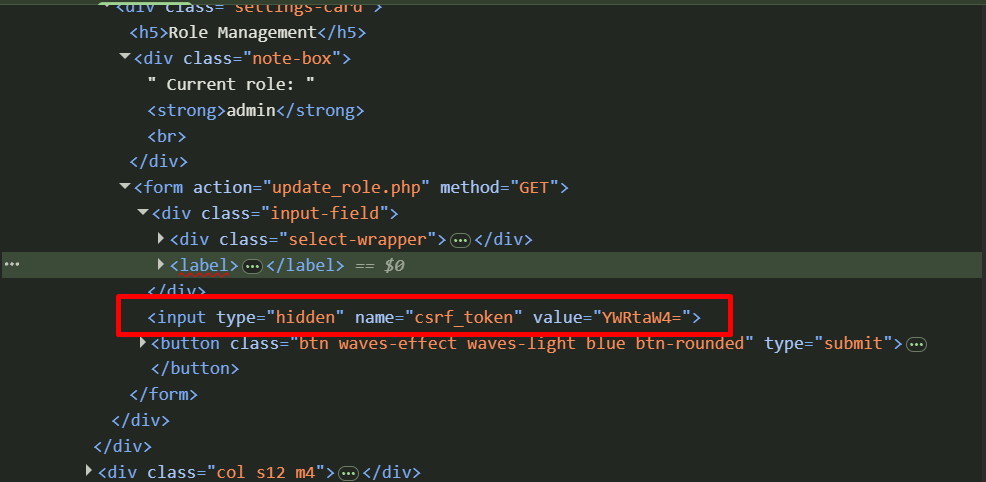

- Khi dùng DevTools để xem, ta thấy rằng chức năng này đã gửi kèm CSRF token kèm theo
- Nhưng khi reload lại trang web vài lần thì ta thấy CSRF token này không đổi và nó chỉ là Base64 được encode

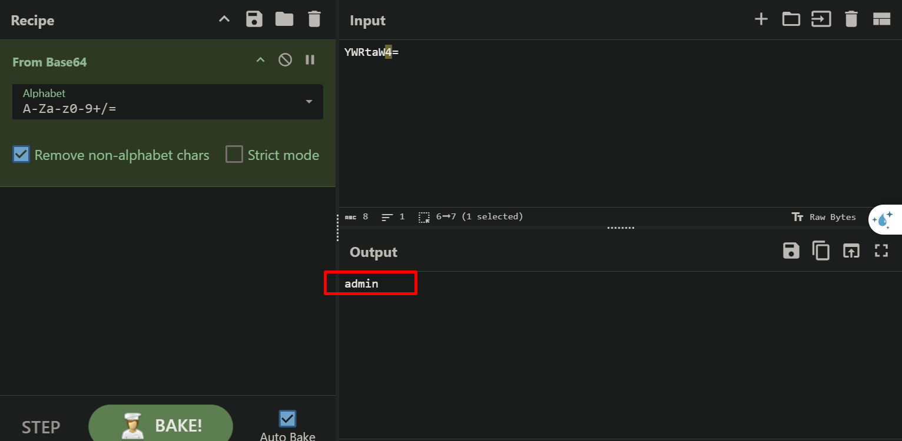

- Vậy việc bây giờ cần làm là tạo 1 request có kèm theo CSRF token, rồi nhúng nó vào trang web của ta

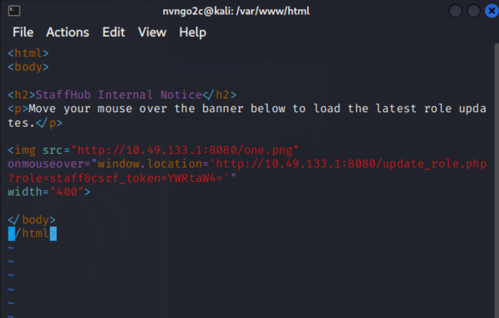

- Ta tạo thêm 1 file `role.html` có nội dung
```html
<html>
<body>

<h2>StaffHub Internal Notice</h2>
<p>Move your mouse over the banner below to load the latest role updates.</p>


</body>
</html>
```

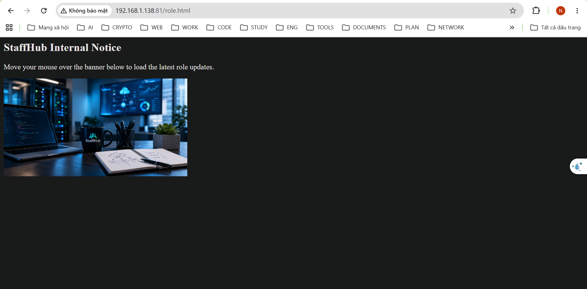

- File này sẽ có 1 ảnh, khi nạn nhân chỉ cần di chuột vào ảnh đó là chuyển hướng và thực hiện hành động sử đổi thông tin


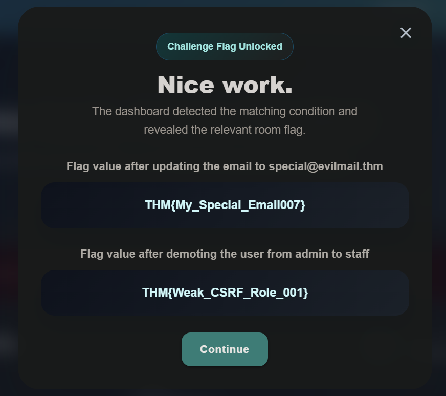

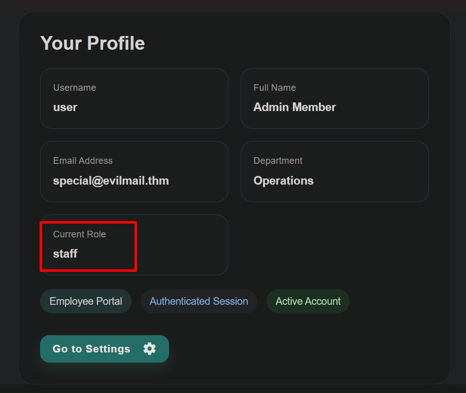

- Cuối cùng quyền của nạn nhân bị thay đổi và trả về Flag 

## **6. Best Practice**
Bài học thực tiễn:
- Tập trung vào những chức năng có thể thể tạo ra những thay đổi bởi vì đây là những chức năng dễ bị CSRF nhắm tới
- Kiểm tra rằng những hành động nhạy cảm có kèm theo mã CSRF để xác thực không, nếu không thì phải sửa bổ sung, nếu có thì kiểm tra nó có đủ mạnh hoặc tĩnh không
- Phần tích phương thức của HTTP: các hành động nhạy cảm nên sử dụng POST. Dùng GET sẽ dễ bị khai thác bằng ảnh hoặc một link đơn giản
- Kiểm tra những request từ bên ngoài ứng dụng web
- Quan sát hành vi của cookies: kiểm tra liệu rằng chức năng xác thực chỉ dựa vào cookie, nếu web tự động chấp nhận những request chứa cookie mà không kiểm tra tính hợp lệ của nguồn gửi thì có thể xảy ra CSRF 

