# **Intro to SSRF**
## **1. Introduction**
### **What is SSRF?**
- Server-Side Request Forgery (SSRF) là lỗ hỗ cho phép attacker làm cho server tạo 1 HTTP request đến nơi mà attacker đã chọn, attacker thường lợi dụng 1 tham số mà web dùng để xây dựng lên yêu cầu của server, sau đó điều hướng những request này đến những dịch vụ nội bộ, cloud metadata endpoint, hoặc đến một server mà attacker kiểm soát
- SSRF khai thác bằng sự tin tưởng của hệ thống nội bộ, nó xảy ra khi web giả định rằng những request đến từ IP nội bộ thường hợp lệ, không có gì nguy hiểm

### **Types of SSRF**
- Có 2 thể loại SSRF:
    - Regular SSRF: có phản hồi được hiển thị ở phía frontend để có thể đọc. VD: khi attacker bắt server lấy giao diện của trang admin panel thì nó sẽ được hiển thị ở frontend
    - Blind SSRF: server không phản hồi lại, attacker phải thực hiện những phương thức gián tiếp để có thể xác định được thành công hay chưa. VD: mặc dù thể loại này không trả lại phản hồi như thể loại bên trên, nhưng kẻ tấn công có thể xác nhận bằng cách tạo request đến server chúng kiểm soát hoặc quan sát thời gian phản hồi, mã lỗi, hoặc những sự khác biệt trong phản hồi thành công và không thành công

### **Impact**
SSRF có thể gây ra những tác động:
- Truy cập vào những endpoint nội bộ: Admin panels, config, bảng điều khiển, ..
- Tiết lộ những thông tin nhạy cảm: DB, API nội bộ, công cụ nội bộ
- Phân tích mạng nội bộ
- Lấy cắp cloud metadata
- Thông tin đăng nhập và token

## **2. Server-Side Request Forgery**
Có `4` vector của SSRF:
### **Full URL in a Parameter**
- Web cho phép một URL hoàn chỉnh được nhập như một đầu vào để tạo 1 yêu cầu về phía server
- Các chức năng URL preview, webhook configuration, PDF generator thường theo mẫu hành động này

VD: Một web cho phép kiểm tra hàng tồn bằng API `https://website.thm/item/2?server=api`\
Sau đó web sẽ lấy giá trị của tham số server rồi tạo 1 request `https://server.website.thm/api/item?id=2`\
Attacker có thể chỉnh tham số này thành `server=server.website.thm/flag?id=9&x=`, khi đó, web sẽ tạo 1 request `https://server.website.thm/flag?id=9&x=/api/item?id=2`\
Tham số `x` được sử dụng như một thùng chứa những thứ được web nối vào, nếu `flag` không sử dụng tham số `x`, thì URL được xử lý sẽ giống với `https://server.website.thm/flag?id=9`

---
### **Partial URL (Hostname or Path Only)**
- Một số web chỉ chấp nhận phần host name hoặc một đoạn đường dẫn và nó sẽ xây dựng URL bên phía máy chủ

VD: Một request có dạng: `https://website.thm/stock?server=api.internal`, web sẽ xây dựng request phía máy chủ là `https://api.internal/stock/item`\
Nếu không thực hiện kiểm tra tham số `server`, attacker có thể thay đổi thành `https://website.thm/stock?server=attacker.com`\
Khi này, request sẽ được gửi đến server của attacker, điều đó ít nhất giúp hắn xác định được rằng lỗ hổng có tồn tại

---
### **Path Traversal in the URL**
- Khi attacker chỉ có thể điều khiển được 1 phần của đường dẫn, path traversal thường được sử dụng để có thể lấy được những endpoint bên ngoài thư mục mà web mong muốn

VD: web có cấu trúc request `https://website.thm/stock?url=/item/123/details`, attacker có thể thay thế bằng `/../admin`\
Khi đó, request của server sẽ trở thành `https://website.thm/admin`


### **Hidden Form Fields**
- Không phải tất cả SSRF vector đều có thể nhìn thấy rõ ràng từ thanh URL
- Một số được nhúng vào trang HTML và chỉ có thể biết được khi ta phân tích thủ công hoặc là chặn request

VD: một web có chức năng hiển thị avatar của người dùng 
```html
<input type="hidden" name="avatar" value="/images/avatars/default.png">
```

- Nếu máy chủ lấy đường dẫn từ thẻ này để tạo request rồi hiển thị hình ảnh, thì đó cũng là một bề mặt tấn công tiềm năng cho SSRF

## **3. Finding an SSRF**
### **Common Indicators**(*Những tham số phổ biến*)
- Full URL in a parameter

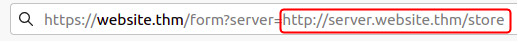

- Hidden form fields

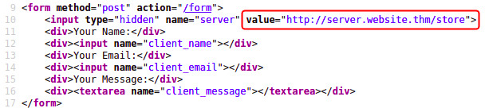

- Partial URL (hostname only): web cho phép 1 hostname và tạo URL đầy đủ phía server

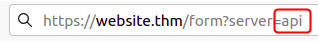

- Path only: chỉ có một phần của URL do người dùng điều khiển, ứng dụng sẽ tự động thêm phần scheme và hostname

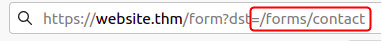

### **Confirming Blind SSRF**
Khi mà server thực hiện request nhưng không hiển thị ra màn hình thì ta phải xác định lỗ hổng bằng các phương thức khác
- External HTTP logger (e.g. requestbin.com): cung cấp URL để truyền vào tham số trên mục tiêu, cuối cùng kiểm tra request đến ở dashboard 
- Burp Collaborator
- Self-hosted listener (`python3 -m http.server`)
- Timing analysis: so sánh thời gian giữa các request tới các server nội bộ và server không tồn tại, nếu có sự khác biệt, điều đó chứng tỏ rằng server đã xử lý 2 request này một khác nhau
- Error-based inference

## **4. Defeating Common SSRF Defenses**
Dev cũng nhận thức được sự nguy hiểm của SSRF, nên những chức năng cho phép tạo request được họ kiểm tra khá chặt chẽ\
Có 3 kiểu kiểm tra: **deny lists**, **allow lists**, và **open redirect abuse**

--- 
### **Deny Lists**
- Deny Lists chặn tất cả những địa chỉ theo list trong khi cho phép tất cả những địa chỉ khác ngoài list 
- Mục tiêu của kiểu này là chống tất cả những đích đến có thể gây ra lỗ hổng như **localhost**, `127.0.0.1` hoặc các **cloud endpoint**
- Nhưng việc sử dụng Deny Lists không hiệu quả bởi vì nó có thẻ bị bypass bằng nhiều định dạng khác nhau của input
- Vd: `127.0.0.1` có thể được biểu diễn ở nhiều dạng như `2130706433`, `017700000001`, `127.*.*.*`, ...

### **Allow Lists**
- Allow Lists từ chối tất cả những địa chỉ đích mà không khớp với list cho sẵn
- VD: URL yêu câu phải bắt đầu bằng `https://website.thm`
- Tuy nhiên nếu Allow Lists được triển khai sai, nó vẫn có thể bị bypass

- Subdomain matching: `https://website.thm.attackers-domain.thm` allow lists yêu cầu đầu vào bắt đầu bằng `https://website.thm` thì attacker tạo 1 subdomain trên server của họ và thế là đã có URL bắt đầu bằng chuỗi đó
- URL credential abuse: Một số thư viện mặc định cho rằng phần đứng trước kí tự `@` trong URL chính là thông tin đăng nhập của người dùng, còn phần đứng sau là domain; VD: `https://website.thm@attacker.com/`, URL này vẫn có thể bypass yêu cầu của Allow Lists

----

### **Open Redirects**

Website chuyển hướng người dùng hoặc server sang URL khác

## **5. Practice**

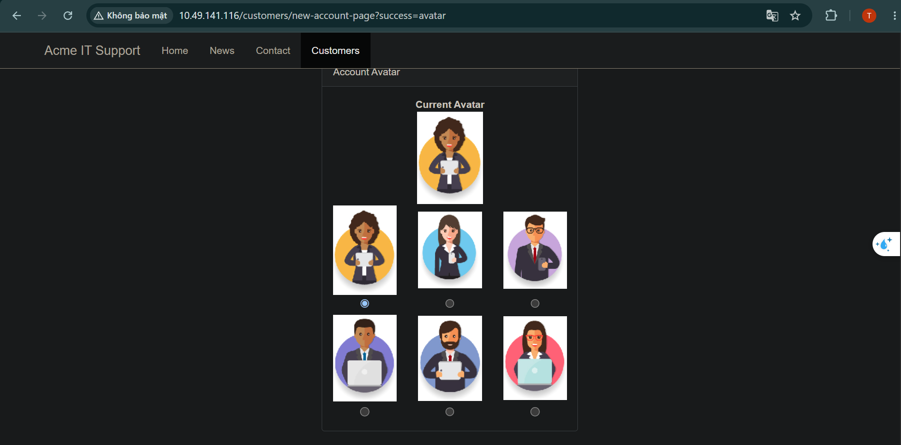

- Khi vào web, ta truy cập vào `/customers/new-account-page` để có thể chọn avatar ở đây

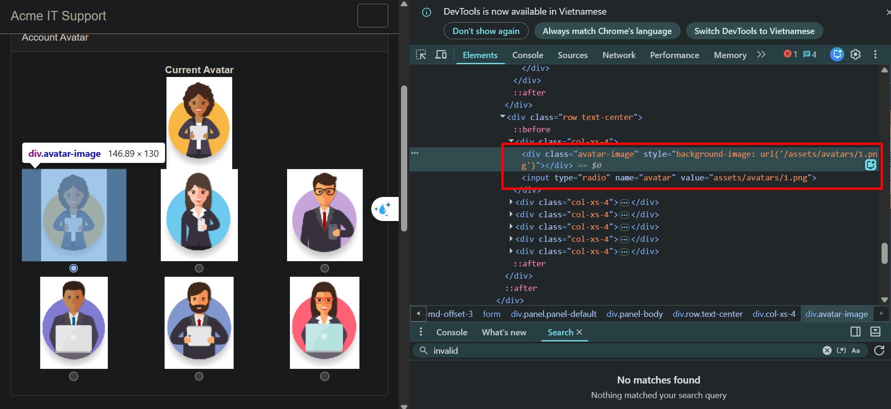

- Tại đây ta có thể thấy được mỗi ảnh đều có một đường dẫn
 
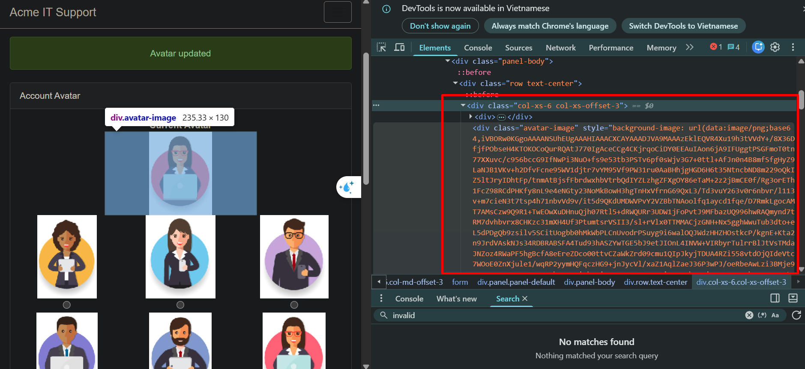

- Ta thử chọn 1 ảnh và update ảnh đó làm ảnh đại diện
- Khi đó ta được web đã cập nhật và trong Devtool có trả về đoạn mã hóa base64 của ảnh

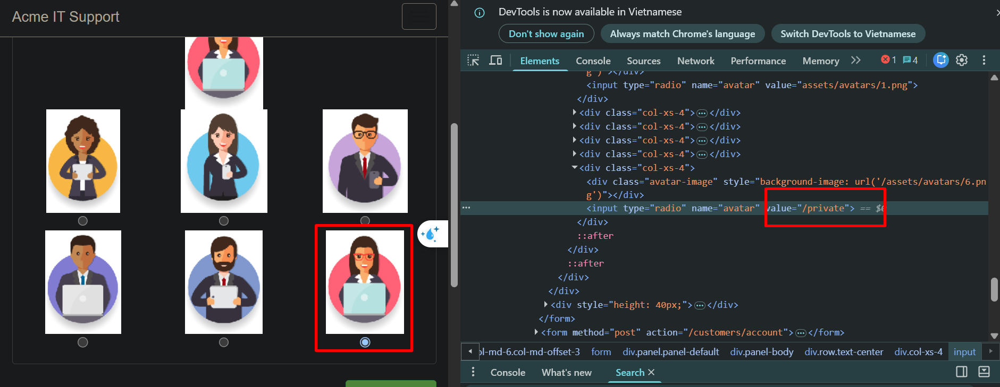

- Đề cho biết file chứa flag là `/private`, vậy nên ta thử sửa đường dẫn của 1 ảnh thành `/private` 
- Sau đó ta thử cập nhật chính ảnh đó làm ảnh đại diện

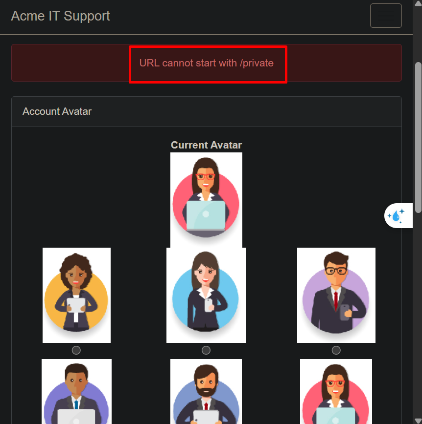

- Khi quan sát bằng Burp, ta thực sự thấy được có 1 request được gửi bằng `/private`


- Nhưng sau đó, web trả về rằng URL không thể bắt đầu bằng `/private`, vì vậy có thể web đã sử dụng denylist hoặc allowlist
- Ta sẽ thử bypass Deny list trước
- Vì URL không cho phép bắt đầu bằng `/private` nên ta chèn thêm chuỗi path traversal vào thành `x/../private`

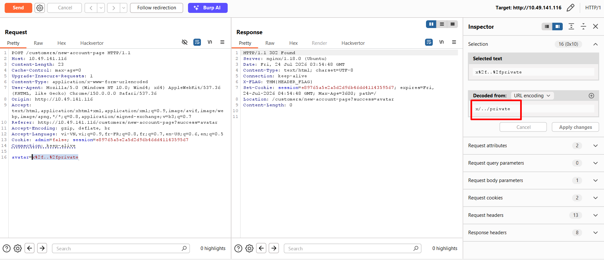

- Sau khi sửa đường dẫn, payload đã pass qua bước filter của web và nó chuyển hướng đến một request khác

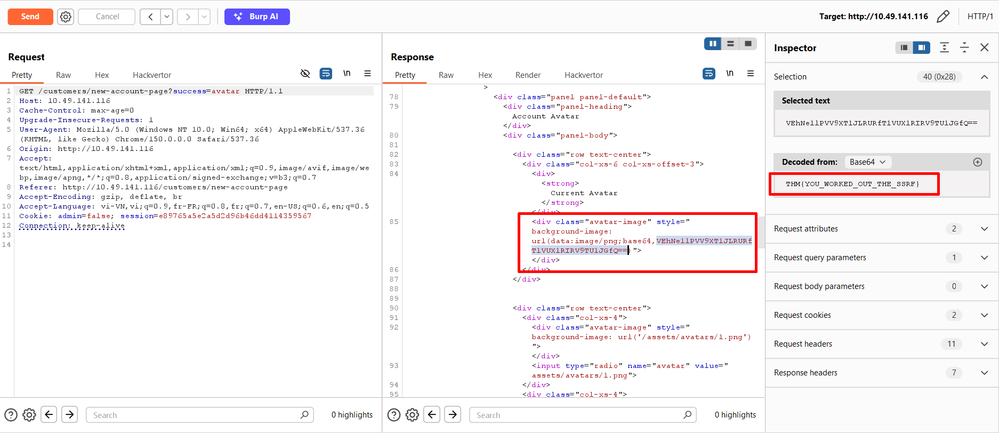

- Khi chuyển sang, ta thấy được ảnh được trả về dưới dạng base64 nhưng lại là nội dung của file `/private`


