# Nmap Live Host Discovery
## 1. Introduction
### Nmap là gì?
- **Nmap (Network Mapper)** là công cụ mã nguồn mở (GPL), được phát triển bởi **Gordon Lyon (Fyodor)**.
- Là công cụ tiêu chuẩn trong ngành để:
  - Khám phá mạng (Network Mapping)
  - Phát hiện host đang hoạt động (Host Discovery)
  - Quét cổng và dịch vụ (Port & Service Discovery)
- Hỗ trợ **Nmap Scripting Engine (NSE)** để:
  - Fingerprinting dịch vụ
  - Tự động hóa tác vụ
  - Kiểm tra và khai thác một số lỗ hổng

### Quy trình quét của Nmap
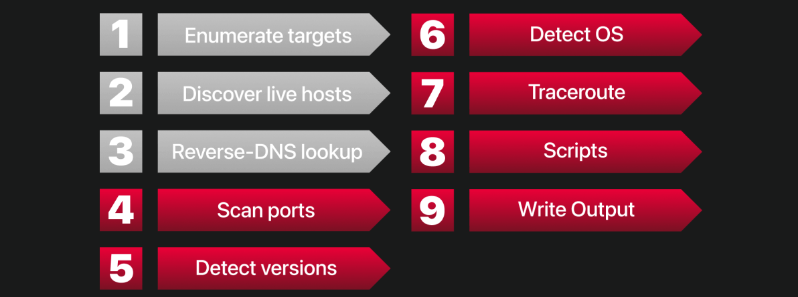

1. Host Discovery (xác định host còn sống)
2. Port Scanning (quét cổng)
3. Service Detection
4. OS Detection
5. NSE Scripts (tùy chọn)

> Nhiều bước là tùy chọn, phụ thuộc vào tham số dòng lệnh.

### Mục tiêu của phần Host Discovery
Trả lời câu hỏi:
- Host nào đang online?
- (Các phần sau sẽ trả lời: Host đang chạy những dịch vụ gì?)

**Host Discovery luôn nên thực hiện trước Port Scanning** vì:
- Tiết kiệm thời gian.
- Tránh quét các host đã tắt.
- Giảm lưu lượng và dấu vết trên mạng.

### Các kỹ thuật Host Discovery

#### ARP Scan
- Hoạt động ở **Layer 2 (Data Link)**.
- Gửi **ARP Broadcast** để tìm host trong **cùng subnet**.
- Nhanh và rất chính xác trên mạng LAN.

#### ICMP Ping
Sử dụng các gói ICMP:
- Echo Request
- Timestamp Request
- Address Mask Request

=> Phát hiện host trên các mạng khác nhau.

#### TCP Ping
- TCP SYN Ping
- TCP ACK Ping

Đặc điểm:
- Dùng gói TCP để xác định host còn hoạt động.
- Hành vi có thể khác nhau tùy quyền của người dùng (**privileged** hoặc **unprivileged**).

#### UDP Ping
- Gửi UDP đến cổng đóng.
- Nếu host online sẽ trả về **ICMP Port Unreachable**.
- Từ đó xác nhận host còn hoạt động.

### Kiến thức cần có
- Web Application Basics
- Networking Essentials
- Networking Secure Protocols

## 2. Network Segment và Subnet

### Network Segment là gì?
- **Network Segment**: Nhóm các thiết bị kết nối chung một môi trường truyền dẫn vật lý.
- Ví dụ:
  - Cùng một Ethernet Switch.
  - Cùng một Wi-Fi Access Point.

=> Đây là **kết nối vật lý (Physical Connection).**

### Subnet là gì?
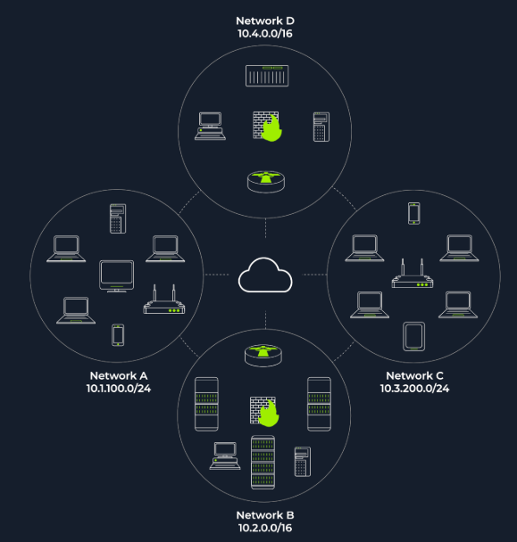

- **Subnet (Subnetwork)**: Một mạng logic có phạm vi địa chỉ IP riêng.
- Thường gồm một hoặc nhiều network segment.
- Các subnet kết nối với nhau thông qua **Router**.

=> Đây là **kết nối logic (Logical Connection).**

> **Phân biệt**
>
> - **Network Segment** → Kết nối vật lý.
> - **Subnet** → Phân chia logic bằng địa chỉ IP.

### Vai trò của Router và Firewall

- **Router**
  - Kết nối các subnet với nhau.
  - Chuyển tiếp (route) gói tin giữa các mạng.

- **Firewall** (có thể đặt giữa các subnet)
  - Kiểm soát lưu lượng đi qua.
  - Áp dụng các chính sách bảo mật.

### Ví dụ Subnet

#### /16
- Subnet Mask: `255.255.0.0`
- Khoảng **65.000 host**

#### /24
- Subnet Mask: `255.255.255.0`
- Khoảng **250 host**

### ARP trong Host Discovery

Nếu scanner và target **cùng subnet**:

- Scanner sử dụng **ARP Request** để tìm host còn hoạt động.
- Mục đích chính:
  - Tìm **MAC Address**.
- Đồng thời cũng xác định được host đang online.

### Giới hạn của ARP

ARP **chỉ hoạt động trong cùng subnet** vì:

- ARP là giao thức **Layer 2 (Data Link)**.
- Router **không chuyển tiếp (forward)** gói ARP.
- Do đó ARP **không thể vượt qua Router**.

Ví dụ:

Scanner: `10.1.100.10`

Target: `10.1.100.20`

➡ Có thể dùng ARP.

---

Scanner: `10.1.100.10`

Target: `10.1.101.20`

➡ Không thể dùng ARP.
➡ Gói tin sẽ được gửi đến **Default Gateway (Router)** để định tuyến sang subnet khác.

### Ghi nhớ

- **Cùng subnet** → ARP Discovery.
- **Khác subnet** → Router định tuyến.
- **ARP không đi qua Router.**

## 3. Understanding Hosts Discovery Through TCP/IP Layer

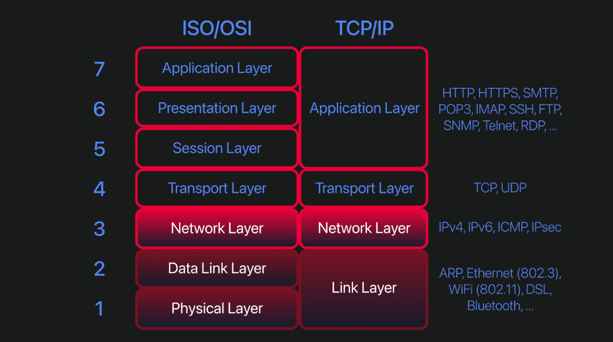

| Layer | Protocol | Mục đích |
|--------|----------|----------|
| Link | ARP | Tìm host trong cùng subnet |
| Network | ICMP | Ping kiểm tra host online |
| Transport | TCP | Phát hiện host khi ICMP bị chặn |
| Transport | UDP | Phát hiện host qua phản hồi UDP |

### ARP
- Hoạt động ở **Layer 2**.
- Gửi **ARP Request (Broadcast)** để lấy **MAC Address**.
- Chỉ hoạt động trong **cùng subnet**.

### ICMP
- Dùng **Echo Request (Type 8)** và **Echo Reply (Type 0)**.
- Nếu cùng subnet, **ARP diễn ra trước ICMP** để lấy MAC.

### TCP
- Gửi các gói TCP (SYN/ACK) đến cổng của target.
- Hữu ích khi **ICMP bị chặn**.

### UDP
- Gửi UDP đến các cổng của target.
- Nếu nhận **ICMP Port Unreachable** ⇒ Host online.

> **Ghi nhớ:** ARP → cùng subnet; ICMP → Ping; TCP/UDP → thay thế khi ICMP bị chặn.

## 4. Enumerating Target
- **Scan 3 IP liên tiếp**
```bash
nmap ip_1 ip_2 ip_3
```

- Scan bằng hỗn hợp cả **IP** lẫn **Domain**
```bash
nmap ip_1 domain_1 ip_2
```

- Scan theo **1 khoảng IP**
```bash
nmap 192.168.19.9-15
```
sẽ scan lần lượt từ `192.168.19.9`, `192.168.9.10`, ..., `192.168.9.15`

- Scan theo **subnet**
```bash
nmap 192.168.19.0/30
```
sẽ scan `4` IP

- Scan theo 1 file list chứa IP (*`-iL` = Input List*)
```bash
nmap -iL list_of_host.txt
```

- Chỉ **liệt kê** chứ mục phạm vi mục tiêu chứ *không gửi gói tin nào để mục tiêu* (*`-sL` = List Scan*)
```bash
nmap -sL 192.168.19.0/24
```
Sẽ liệt kê tất cả những host sẽ scan

- Tham số `-n` để **không phân giải reverse-DNS**
---
### **Thực hành**
> **?** What is the first IP address Nmap would scan if you provided 10.10.12.13/29 as your target?

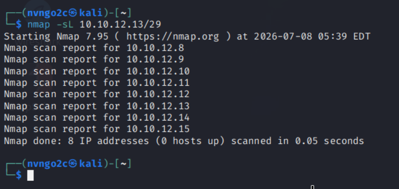

Ta dùng lệnh 
```bash
nmap -sL 10.10.12.13/29
```
để biết được danh sách mục tiêu sẽ quét\
-> ta thấy được IP đầu tiên sẽ quét là `10.10.12.8`

> **?** How many IP addresses will Nmap scan if you provide the following range: 10.10.0-255.101-125?

```bash
nmap -sL 10.10.0-255.101-125
```

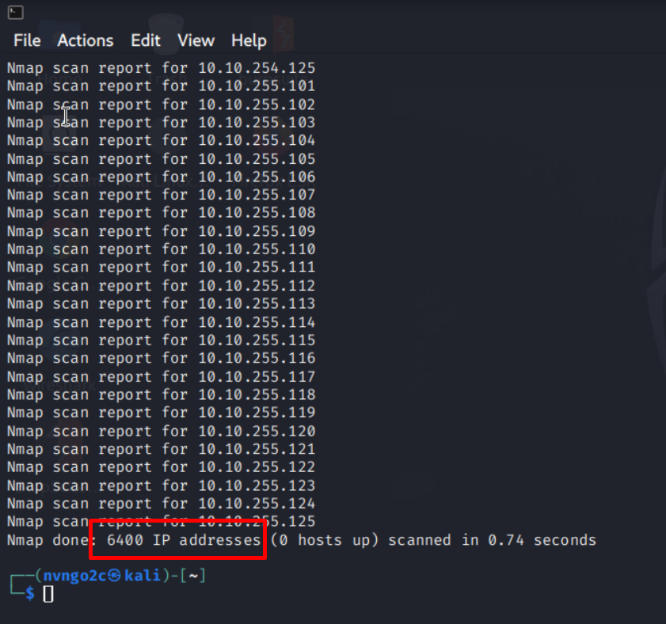

--> `6400` IP

## 5. Nmap Host Discovery Using ARP
- **Chỉ xác định những host đang up**, không thực hiện scan port (*`-sn` = No Scan Port*)
```bash
nmap -sn 192.168.19/24
```

- Dùng `ARP` để xác định những host up (*`-PR` = ARP Ping*)
```bash
nmap -PR nmap -sn 192.168.19/24
```
> *__Lưu ý__*: chỉ dùng được `-PR` khi đang ở trong cùng dải mạng đó vì ARP chỉ hoạt động ở `tầng 2`

- `-PR -sn`: chỉ tìm những host up bằng ARP, không scan port

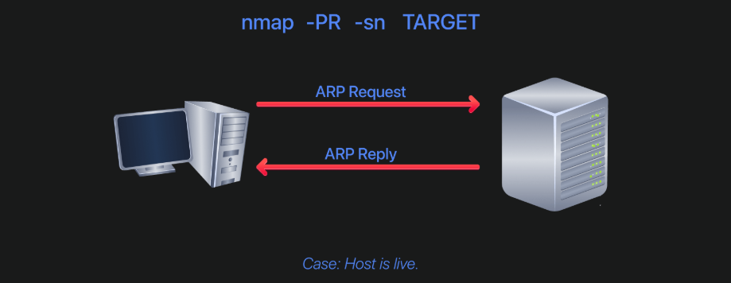

---
> Phần này rất hữu ích nếu attacker đã có 1 chỗ đứng trong mạng nội bộ, hắn sẽ scan bằng ARP, bởi vì ARP chỉ hoạt động ở tầng 2 nên không bị kiểm soát bởi **Firewall** 

---
### **Thực hành**
> **?** How many hosts are found alive after scanning the CONNECTION_IP/24?

```bash
nmap -sn -PR 10.200.6.250/24
```

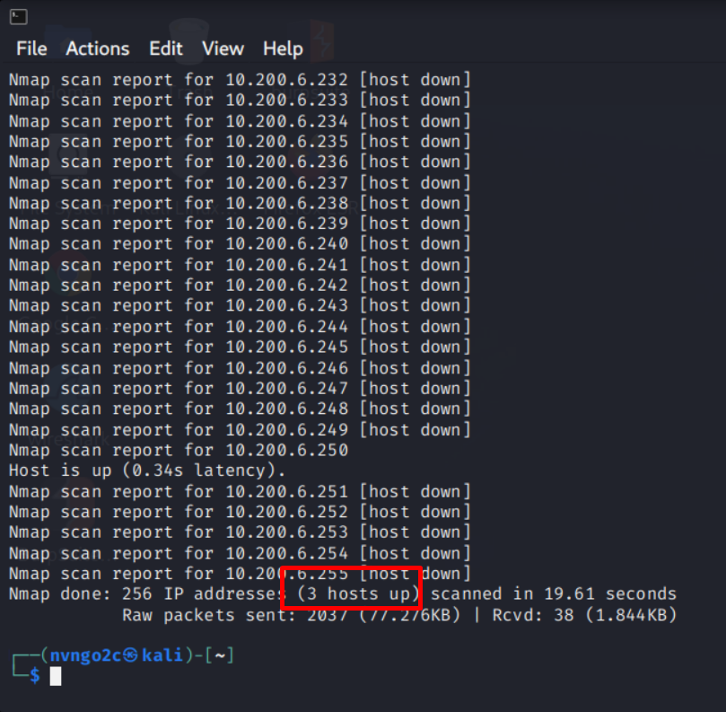

--> `3`
 
### Nmap Default Host Discovery

- **Root/Sudo + cùng subnet** → **ARP** (`-PR`)
- **Root/Sudo + khác subnet** → **ICMP + TCP ACK (80) + TCP SYN (443) + ICMP Timestamp**
- **Không có quyền** → **TCP SYN** đến **port 80, 443** (TCP 3-way Handshake)

> **Mặc định:** Nmap tự chọn phương thức phù hợp nếu không chỉ định tùy chọn Host Discovery.

## 6. Nmap Host Discovery Using ICMP
- `-PE` (*Ping Echo*): để quét bằng `ICMP`
```bash
nmap -sn -PE 192.168.19.0/24
```

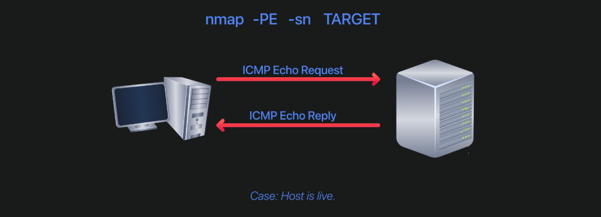

- `ICMP types`:
    - `ICMP type 0` (*Echo request*)
    - `ICMP type 13` (*Echo reply*)
    - `ICMP type 13` (*Timestamp request*): dùng để gửi yêu cầu lấy thời gian và đồng bộ thời gian 
    - `ICMP type 14` (*Timestamp reply*)
    - `ICMP type 17` (*Mask request*): gửi yêu cầu lấy *subnetmask*
    - `ICMP type 18` (*Mask reply*)

- Các hệ thống thống thường sẽ chặn ICMP type `0` và `8`, nhưng có thể không chặn type `13` và `14` nên có thể lợi dụng để quét bằng `ICMP`

- `-PP` (*Timestamp Ping*): sử dụng để quét bằng `ICMP type 13`
```bash
nmap -sn -PP 192.168.19.0/24
```

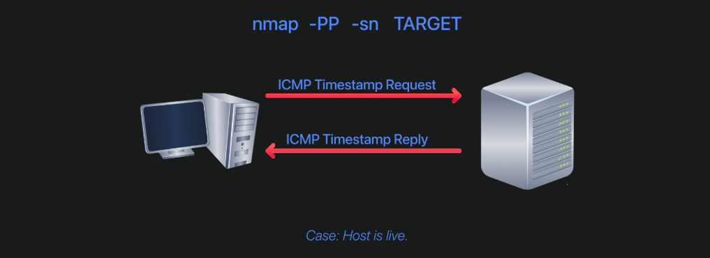

- `-PM` (*Mask Ping*): quét bằng `ICMP type 18`
```bash
nmap -sn -PM 192.168.19.0/24
```
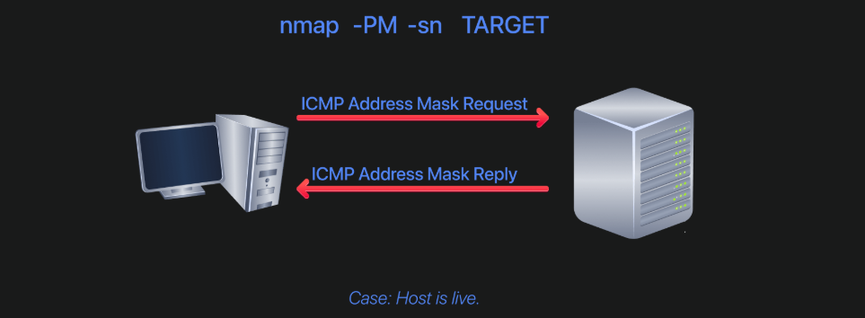

## 7. Nmap Discovery Host Using TCP and UDP

### TCP SYN Ping
Ta sẽ gửi 1 gói tin `TCP SYN` tới mục tiêu rồi đợi phản hồi, nếu mục tiêu trả về bản tin:
- `SYN/ACK` --> **Host UP**
- `RST` (Reset) --> **Host DOWN**

Vì mục tiêu là xác định host UP hay không thì trạng thái Port (đóng/mở) **không quan trọng**

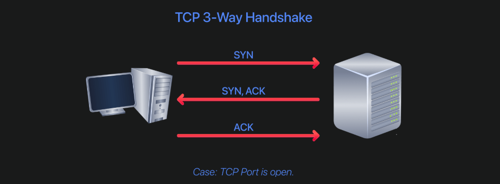

---

- `-PS` (*TCP SYN Ping*): quét bằng cách gửi bản tin SYN để xác định host UP hay không bằng quá trình **TCP 3-way handshake** 
    - `-PS`: mặc định là `port 80`
    - `-PS21`: gửi bản tin TCP SYN đến `port 21` 
    - `-PS21-25`: gửi bản tin từ `port 21` đến `port 25` của mục tiêu (*21, 22, ..., 25*)
    - `-PS80,443,8080`: gửi bản tin đến 3 port chỉ định
```bash
nmap -sn -PS dải_mạng/mục_tiêu/subnet
```

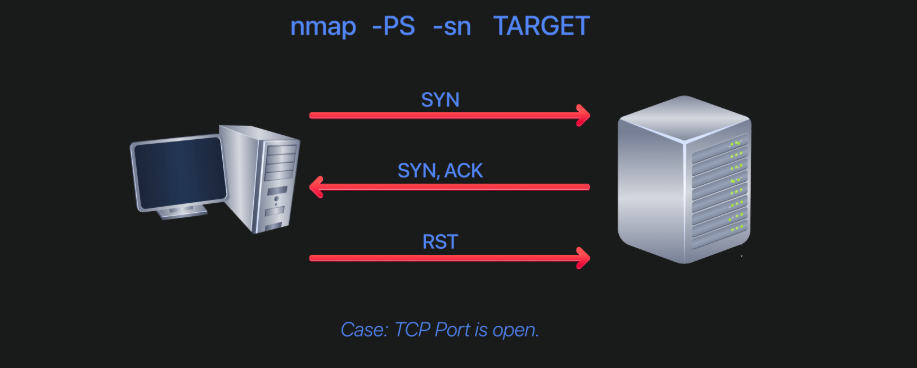

> *__Lưu ý__*:- Với người dùng root, ta có thể không cần phải hoàn tất thiết lập bắt tay 3 bước, có thể gửi gói tin Raw; Ngược lại người dùng thường bắt buộc phải thiết lập xong bắt tay 3 bước --> Có thể thấy rằng chạy bằng `root/sudo` sẽ hiệu quả hơn bằng việc chạy bằng người dùng thường

```
root
Scanner -------- SYN --------> Target
Scanner <----- SYN/ACK ------- Target
Scanner -------- RST --------> Target (hoặc không cần ACK)
```

```user
Scanner -------- SYN --------> Target
Scanner <----- SYN/ACK ------- Target
Scanner -------- ACK --------> Target 
Scanner -------- RST --------> Target
```

### TCP ACK Ping
- `-PA` (*TCP ACK Ping*): gửi gói tin `ACK` tới mục tiêu để xác định host UP nếu nhận lại được gói tin `RST`

- Cũng có các tham số tương tự như `-PS`
```bash
nmap -sn -PA target
```
 
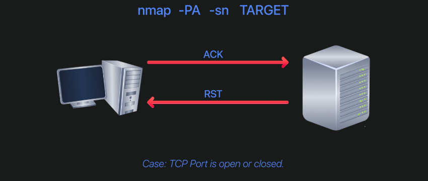

### UDP Ping 
- Không giống như `TCP` có quá trình *3-way handshake*, `UDP` là giao thức không hướng kết nối, vì vậy, khi gửi gói tin đi sẽ không có phản hồi trở lại
- Có 1 điểm mà UDP có thể phát hiện ra host UP, đó chính là khi nó gửi bản tin vào những *port UDP* nhưng port đó lại **đóng** và **nếu host UP** thì nó sẽ trả về `ICMP port-unreachable packet`

- `-PU`: quét host bằng việc gửi gói tin UDP
```bash
nmap -sn -PU target
```

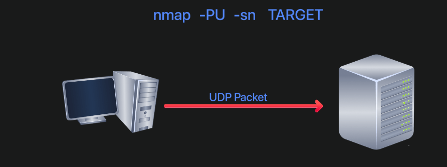

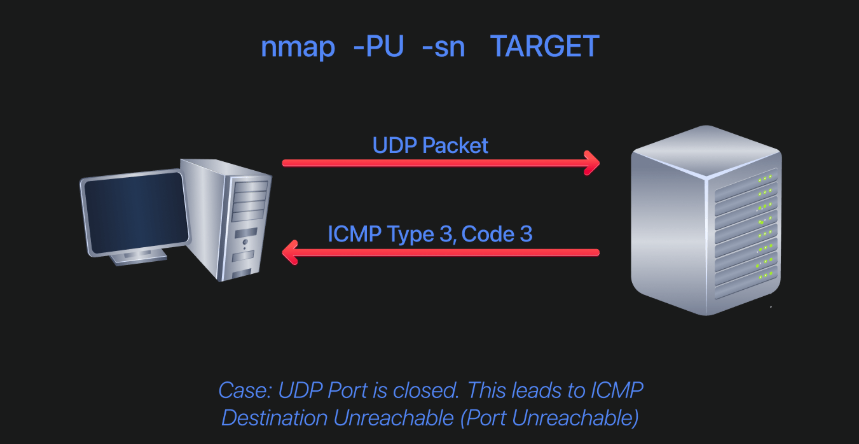

>> **Lưu ý**: nếu gửi 1 gói tin UDP mà không nhận được phản hồi thì chưa thể xác định được host UP hay không, bởi vì khi port UDP mở thì nó sẽ không phản hồi

### Masscan
Masscan là công cụ quét cổng (Port Scanner) cực nhanh, được thiết kế để quét Internet hoặc các mạng rất lớn.

- Có thể quét hàng triệu gói tin/giây.
- Nhanh hơn Nmap rất nhiều (có thể nhanh hơn 10–100 lần tùy cấu hình).
- Chỉ tập trung vào Port Scanning, không mạnh về Service Detection hay OS Detection.

```
Masscan
    ↓
Tìm host và port mở thật nhanh

Nmap
    ↓
Quét chi tiết các port đã tìm được
```

## 8. Using Reverse-DNS Lookup
- `Reverse DNS` là quá trình đảo ngược của `DNS`, thay vì hỏi *Domain này của IP nào?* thì nó hỏi *IP này có Domain nào?*

- Nmap có 2 tham số:
    - `-R`: buộc dùng *reverse-DNS*
    - `-n`: không cho phép *reverse-DNS*

> **Lưu ý**: việc dùng `reverse-DNS` cũng có thể làm chậm đi đáng kể quá trình quét, và đôi khi các bản ghi rDNS cũng không được cấu hình chính xác dẫn đến việc hiểu lầm, đi sai hướng

## 9. Tổng kết
### Nmap Host Discovery Cheat Sheet

| Scan | Option | Mục đích |
|------|--------|----------|
| ARP Scan | `-PR` | Host Discovery trong **cùng subnet** |
| ICMP Echo Scan | `-PE` | Ping bằng **ICMP Echo Request (Type 8)** |
| ICMP Timestamp Scan | `-PP` | Ping bằng **ICMP Timestamp (Type 13)** |
| ICMP Address Mask Scan | `-PM` | Ping bằng **ICMP Address Mask (Type 17)** |
| TCP SYN Ping | `-PS[port]` | Gửi **TCP SYN** đến port chỉ định |
| TCP ACK Ping | `-PA[port]` | Gửi **TCP ACK** đến port chỉ định |
| UDP Ping | `-PU[port]` | Gửi **UDP** đến port chỉ định |

### Ví dụ

```bash
# ARP
sudo nmap -PR -sn 10.200.6.0/24

# ICMP Echo
sudo nmap -PE -sn 10.200.6.0/24

# TCP SYN (port 22,80,443)
sudo nmap -PS22,80,443 -sn 10.200.6.0/30

# TCP ACK (port 22,80,443)
sudo nmap -PA22,80,443 -sn 10.200.6.0/30

# UDP (port 53,161,162)
sudo nmap -PU53,161,162 -sn 10.200.6.0/30
```

### Một số tùy chọn hữu ích

| Option | Chức năng |
|--------|-----------|
| `-n` | Không thực hiện DNS Lookup |
| `-R` | Reverse DNS Lookup cho tất cả host |
| `-sn` | Chỉ Host Discovery, **không Port Scan** |

> **Lưu ý:** Nếu bỏ `-sn`, Nmap sẽ tiếp tục **Port Scanning** trên các host được phát hiện là online.
```** 
