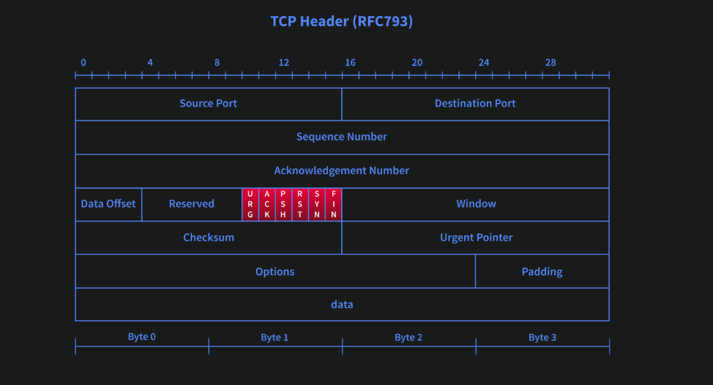
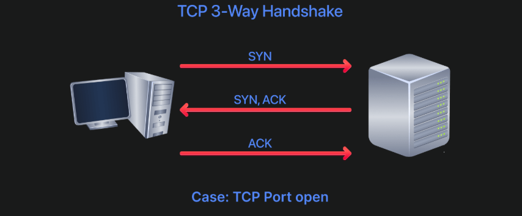
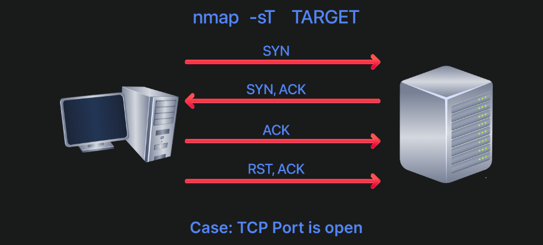
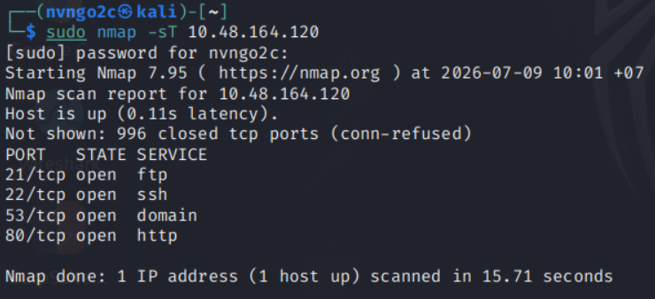
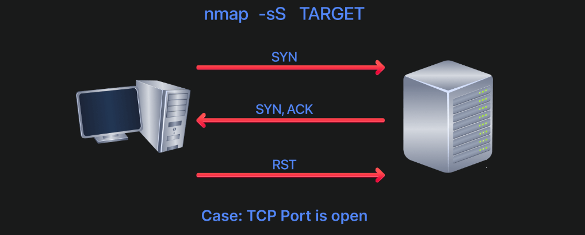
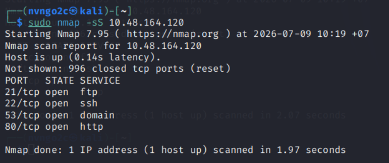
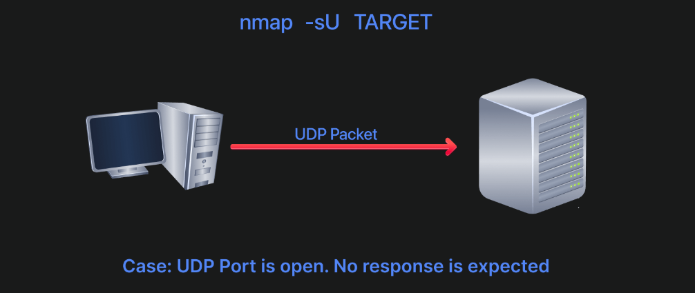
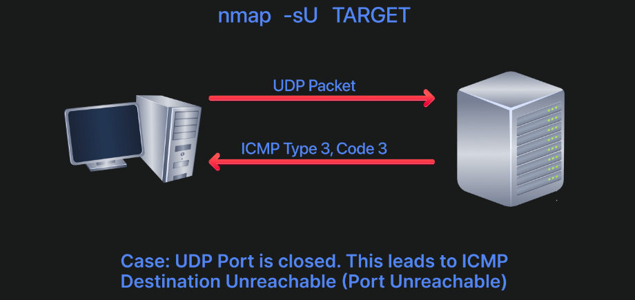
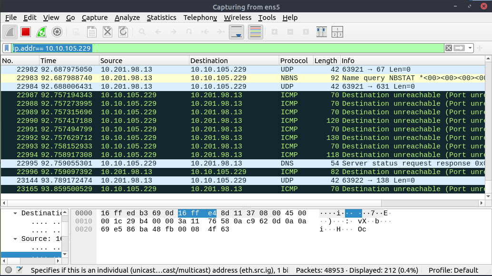

# **Nmap Basic Ports Scan**
## **1. Introduction**
Trước đó ta đã học cách sử dụng `Nmap` để tìm ra những "*Live Host*"

Đến bài học này ta sẽ tập trung vào việc tìm ra những port **đang mở và lắng nghe**

Các kiểu quét sẽ học:
- **TCP connect port scan**
- **TCP SYN port scan**
- **UDP port scan**

## 2. **TCP and UDP ports**

Khi quét có thể gặp `6` trạng thái chính của port:
- `open`: port có dịch vụ đang mở
- `close`: không có dich vụ nào
- `filter`: bị firewall chặn
- `unfilter`: không xác định được open hay close mặc dù vẫn truy cập được
- `open|filter`
- `close|filter`

>> **Lưu ý**: `-sA`: dùng để kiểm tra xem có port có bị firewall chặn hay không, chứ chưa biết được rằng port open hay close bởi vì trường hợp bị chặn thì không trả về gì (**filtered**); nhưng trường hợp không bị chặn (**unfiltered**) thì kể cả port open hay close đều trả về bản tin `TCP RST`
## **3. TCP Flags**


Hình trên mô tả cấu trúc của 1 của 1 bản tin `TCP Header`\
Header có `6` hàng, độ dài của 1 hàng là `32 bits` = `4 bytes`\
--> Tổng Header Length = `4 * 6` = `32 bytes` 

Trường **flag** (*được đánh dấu đỏ*), nó bao gồm `6 bit`, với vị trí tương ứng được set là `1`, ta sẽ biết được giá trị của flag

`URG     ACK     PSH     RST     SYN     FIN`

VD:  `010000` = `ACK flag`\
`010010` = `SYN/ACK`

- `URG` (*Urgen flag*): báo rằng packet này cần được gửi **khẩn cấp, ưu tiên**
- `ACK` (*Acknownledgement flag*): xác nhận đã nhận gói dữ liệu trước đó
- `PSH` (*Push flag*): đẩy dữ liệu ngay lên tầng 7, không cần đợi gom thêm dữ liệu 
- `RST` (*Reset flag*): ngắt/reset kết nối ngay lập tức
- `SYN` (*Sychnonise flag*): bắt đầu 1 kết nối `TCP`
- `FIN` (*Finish flag*): ngắt kết nối `TCP` một cách bình thường 


## **4. TCP connect scan**

- **TCP connect scan** hoạt động bằng việc bắt tay 3 bước chuẩn:
    - Client gửi `TCP packet` với cờ `SYN` 
    - Server trả về với cờ `SYN/ACK` (*nếu port open/listen*)
    - Client hoàn thành 3-way handshake bằng việc gửi `ACK`



- Thông thường chỉ quét khoảng `1000 ports` phổ biết
---

```bash
nmap -sT target
```



>> **Lưu ý**: nếu chạy Nmap mà không có quyền như *root hoặc sudoer* thì lựa chọn duy nhất là `-sT`, bởi vì nó là tiêu chuẩn, không phải tạo gói thô riêng

---
**Thực hành**


## **5. TCP SYN Scan**
- Như đã nói trên, nếu khi chạy `Nmap` mà không có quyền *root hoặc sudoer* thì cách duy nhất để quét bằng `TCP` là hoàn thành **3-way handshake** 
- Nhưng với tài khoản có quyền, ta có thể quét nhanh hơn mà không phải hoàn thành **3-way handshake**, nó **tự động ngắt kết nối** khi nhận được phản hồi từ server
- Chính vì vậy nên nó **ít khi bị log** lại trên server
- `-sS` (*SYN scan*)
```bash
nmap -sS target
```



---
>> Nếu chạy Nmap với `sudo` hoặc `root`, Nmap mặc định chạy bằng `TCP SYN Scan`



## **6. UDP Scan**
- `UDP` là giao thức không hướng kết nối, tức là nó chỉ gửi packet đi mà không cần nhận lại tín hiệu gì từ server
- Nhưng khi gửi 1 gói tin `UDP` đến port down --> nó sẽ trả về tín hiệu lỗi như `ICMP port unreachable`
--> Nếu gửi `UDP packet` đến port đang open, ta có thể không nhận được tín hiệu



---



---

- `-sU` (*UDP scan*)
```bash
nmap -sU target
```



Ta có thể thấy phản hồi của những port đang down, nó trả về `Destination unreachable`

## **7. Fine-Tuning Scope and Performance**

### Tinh chỉnh scope
- **list**
```bash
-p80,443,8080
```
- **range**
```bash
-p1-2048
```
- **ALL**
```bash
-p-
```
- **100 port phổ biến**
```bash
-F
```
```bash
-top--ports 100
```

### Hiệu suất

| Tùy chọn | Đặc điểm | Khi nào dùng |
|----------|----------|--------------|
| **`-T0` (Paranoid)** | Cực kỳ chậm, mỗi probe cách nhau khoảng **5 phút** | Né IDS/IPS tối đa, rất hiếm khi dùng |
| **`-T1` (Sneaky)** | Rất chậm | Pentest thực tế cần tính **stealth** cao |
| **`-T2` (Polite)** | Chậm, giảm tải cho mạng | Khi không muốn ảnh hưởng hệ thống |
| **`-T3` (Normal)** | Mặc định | Hầu hết các trường hợp |
| **`-T4` (Aggressive)** | Nhanh | Lab, CTF, mạng ổn định |
| **`-T5` (Insane)** | Nhanh nhất | Chỉ dùng trên mạng rất nhanh và ổn định |

- `--min-rate 100`: gửi ít nhất `100 packets/s`
- `--max-rate 100`: gửi nhiều nhất `100 packets/s`

- `--min-paralellism 10`: gửi ít nhất song song `10 luồng/s`
- `--max-paralellism 10`: gửi nhiều nhất song song `10 luồng/s`


