# **Nmap Advanced Port Scans**

## 1. **Introduction**
### 1.1 Advance Ports Scan
- **Type Null Scan**: Gửi `TCP Packet` mà không có cờ nào 
- **FIN Scan**: Gửi `TCP Packet` mà chỉ có duy nhất cờ `FIN`
- **Xmas Scan**(*Christmas Tree Scan*): Bật cả FIN, PSH, URG; vì bật nhiều cờ nên nó giống cây thông noel nên mới có tên gọi là Xmas
- **Maimon Scan**: `FIN` và `ACK` đều được bật --> Chủ yếu hiệu quả trên các hệ điều hành `BSD`(*Berkeley Software Distribution*)
- `ACK Scan`: chỉ `ACK` được bật --> Chủ yếu dùng để xem port có bị *firewall filter* hay không
- **Window Scan**: Xác định trường `TCP Window` trong `RST` được trả về khác gì nhau giữa những port mở và đóng
- **Custom Scan**: Sử dụng `--scanflag` để tạo ra `TCP flag` tùy chỉnh cho phù hợp với quá trình quét

### 1.2 Evasion and Spoofing Techniques
- **Spoofing IP**: Giả mạo `IP nguồn` bằng cách sử dụng `-S`
- **Spoofing MAC**: Giả mạo `MAC nguồn` bằng cách sử dụng `--spoof-mac` (*Chỉ khi đã ở trong mạng nội bộ*)
- **Decoy Scan**: Dùng hỗn hợp giữa `IP thật` và `IP Decoy` (*đánh lạc hướng*) để làm cho target không thể nhận ra bằng cờ `-D`
- **Fragmented Packets**: Chia bản tin ra thành những gói tin `IP` nhỏ hơn sử dụng `-f` hoặc `-ff`
- **Idle/Zombie Scan**: Sử dụng host của *bên thứ 3* để quét mà không làm lộ `IP` bằng cờ `-sl`

## **2. TCP Null Scan, FIN Scan, Xmas Scan**
### 2.1 Null scan
- **Null Scan** sẽ gửi đi `TCP packet` mà không có `Flag` nào được bật (*6 bits đều la `0`*)

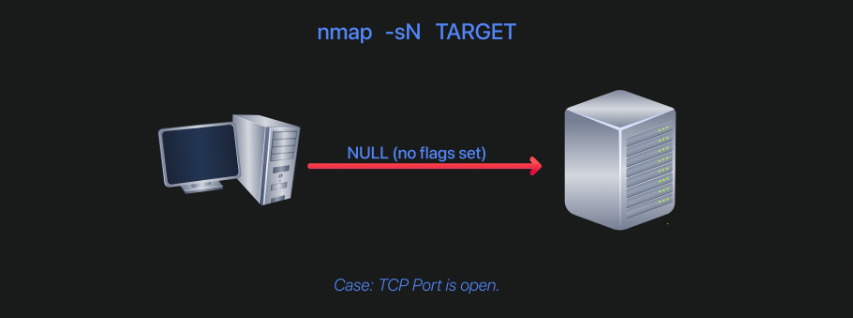

- `-sN`(*Null Scan*)
```bash
nmap -sN target
```

- Khi gửi `TCP packet` với `0` flag, những port đóng sẽ trả về `RST packet`; vì vậy nếu gửi đến port mà không phản hồi thì ta có biết được port đó `open` hoặc bị `filter`

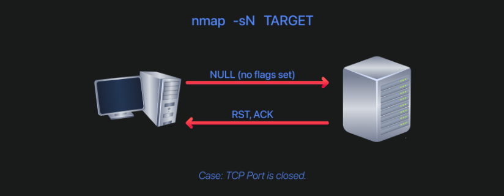

---
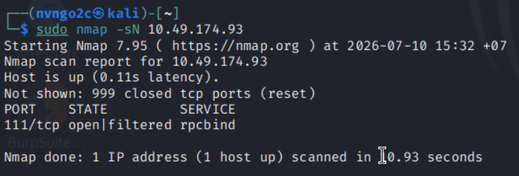

> **Lưu ý**: nên chạy với quyền root hoặc sudo


### 2.2 FIN Scan
- Tương tự như `NULL scan`, `FIN Scan` cũng sẽ không có phản hồi lại nếu port mở hoặc bị `fitered`

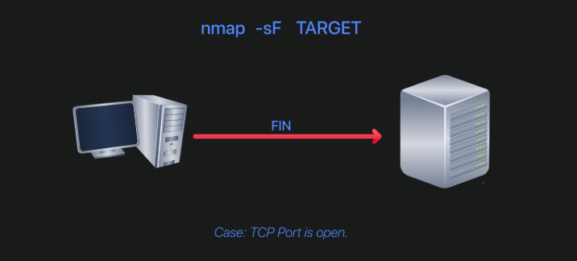

- `-sF` (*FIN Scan*): gửi với cờ `FIN`
```bash
nmap -sF target
```

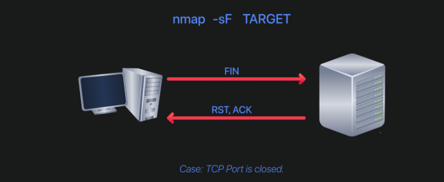

> Tại sao cả `Null scan` và `FIN scan` đều có cách xác định port khác nhau nhưng lại được tách riêng ra?\
> --> Tại vì trong mỗi hệ thống lại có các xử lý 2 gói tin này khác nhau, có hệ thống thì chặn gói `Null` nhưng có hệ thống lại chặn gói `FIN` --> Vậy nên mục đích tách ra là để cho thử mọi khả năng hệ thống xử lý gói tin

---

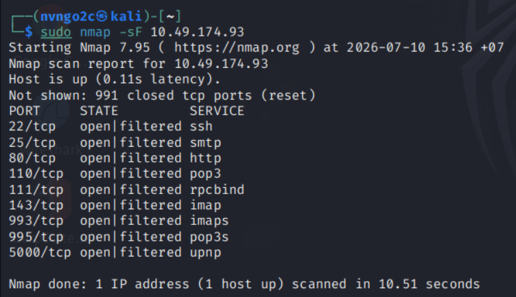

Với kết quả chạy này thì ta thấy cùng 1 target, nhưng với 2 kiểu quét, ta lại được số lượng port được quét là **khác nhau**

### 2.3 Xmas Scan

- `-sX`: Bật đồng thời `3` flag `FIN`, `PSH`, `URG`
```bash
nmap -sX target
```

- Cũng giống như `Null` và `FIN Scan`, server sẽ trả về `RST` nếu port đóng và không trả về gì thì sẽ báo `open|filtered`

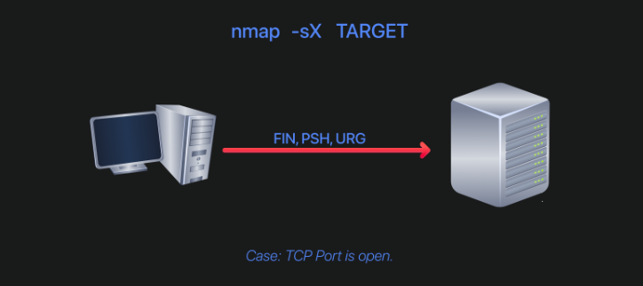

.

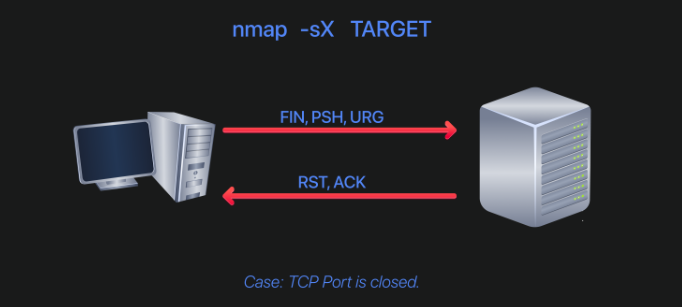

---

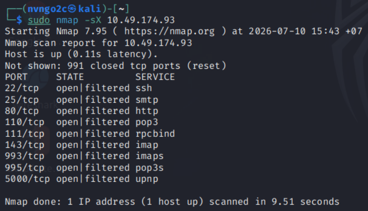

## **3. TCP Maimon Scan**

- `Maimon Scan` gửi packet có cả flag `FIN` và `ACK` được bật
- Target sẽ trả về `RST` nếu port đóng và không phản hồi có thể được báo là `open|filered`
- Cách quét này chỉ áp dụng đối với họ HĐH `BSD`, không phù hợp với hầu hết mọi hệ điều hành hiện nay

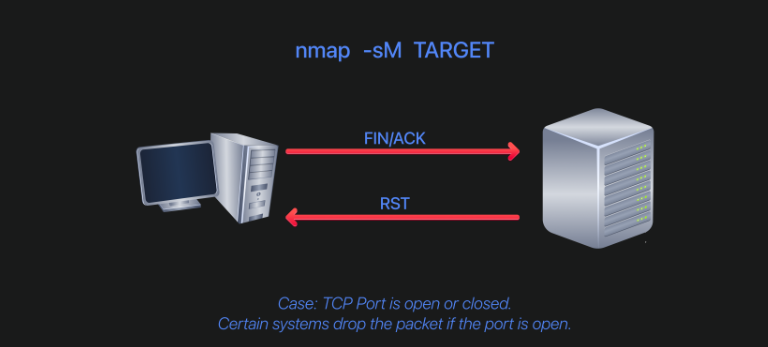

- `-sM` (*Maimon Scan*)
```bash
nmap -sM target
```

## 4. **TCP ACK, Window, and Custom Scan**

### 4.1 TCP ACK Scan
- Khi gửi 1 gói `ACK` đến mục tiêu, thông thường nó sẽ so với bảng trạng thái, nếu không thuộc kiểu kết nối nào thì nó sẽ trả về `RST packet` bất kể port đang đóng hay đang mở

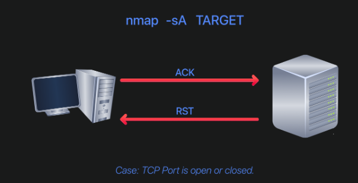

- Nhưng nếu có `firewall` đứng trước, nó sẽ **drop và không trả về bất cứ packet nào**

--> `ACK scan` sẽ tập trung vào việc "**port này có bị filter không?**" 

```bash
nmap -sA target
```

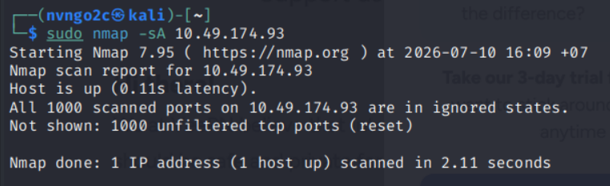

Khi chưa bật `firewall`, ta nhận được kết quả là `1000` port đều không bị `filtered`

---

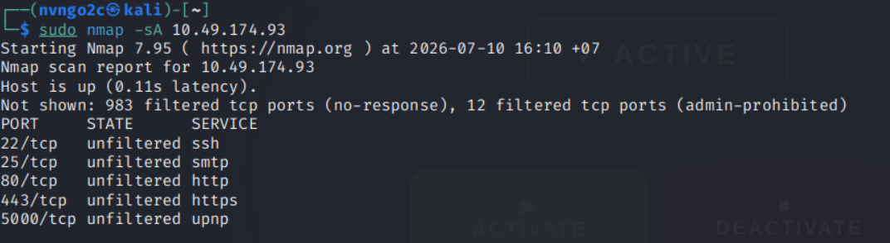

Khi đã bật `firewall`, ta nhận được kết quả những port không bị `firewall` filter, tức là `ACK packet` đã được đi vào và trả về `RST packet`

### 4.2 Window Scan

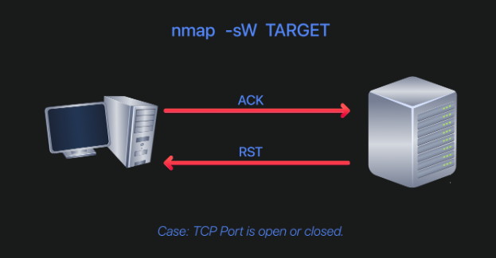

- `Window scan` cũng có cách hoạt động giống với `ACK Scan` nhưng nó không chỉ nhìn vào hành động trả về của target mà nó còn phân tích trường `TCP Window Size` để kết luận:
    - `Nếu Window size > 0 --> open`
    - `Nếu Window size = 0 --> close`\
--> Ở đây không chỉ tìm ra những port không bị `filtered` mà thậm chí còn có thể kết luận được nó đang `open` hay `close`

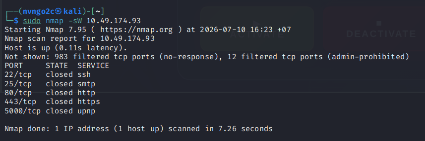

> **Lưu ý**: Cách này chủ yếu áp dụng cho những hệ điều hành cũ, bởi vì những hệ điều hành hiện đại ngày nay trả về `RST Packet` những trường `Window size` không chính xác dẫn đến việc kết luận các port đều `close`

### 4.3 Custom Scan

```bash
nmap --scanflags CUSTOM_FLAGS Target

nmap --scanflags SYN 10.49.174.93 #Bật cờ SYN
```

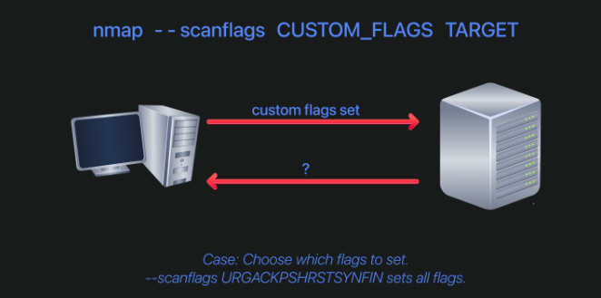


## **5. Spoofing and Decoys**
### 5.1 Spoofing Scan

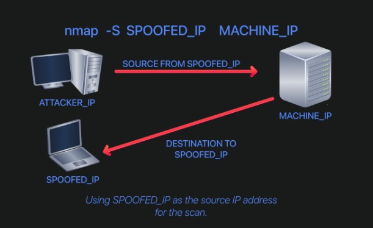

-  Cách hoạt động:
    - Nmap sẽ tạo 1 `TCP packet` với 1 `Source IP giả` (*có thể giao tiếp với mạng target*)
    - Khi packet được target nhận, nó sẽ phản hồi (*hoặc không*) đề `Source IP giả` kia --> Máy của attacker không thấy được phản hồi
    - Vậy nên cách scan này cần phải **có 1 chỗ đứng trong mạng, kiểm soát 1 vị trí nào đó** thì mới có thể lấy được phản hồi
    
--> Cách này khá thiếu thực tế, nó chỉ có tác dụng **làm nhiễu thông tin của target**

- Dùng `-S` thông thường sẽ phải dùng kèm `-e <interface>` (Chọn interface để gửi gói tin ra) và `-Pn` (*quét mà không cần ping từ bước đầu*)

```bash
nmap -S -e <interface> -Pn SPOOFED_IP TARGET_IP
```

---

Nếu ở trong mạng nội bộ của target, ta có thể dùng `--spoof-mac SPOOFED_MAC`

---

- `Spoofing Scan` chỉ dùng được trong 1 số ít các trường hợp, trong thực tế người ta thường dùng `Decoy Scan`
- **Cách hoạt động**: `Decoy Scan` sẽ gửi gói tin có `Source IP` của họ kèm 1 vài packet có `Source IP khác` nhằm làm nhiễu log

```bash
nmap -D 10.10.0.1,100.10.0.2,ME 10.48.178.211

nmap -D 10.10.0.1,10.10.0.2,RND,RND,ME 10.48.178.211 #RND: random
```

## **6. Fragement Packets**
- `Firewall/IDS` thường nhìn vào `Header` của toàn bộ gói tin để lọc, vì vậy ta có thể `Fragment Packet`(*Phân mảnh*) nhỏ ra để làm cho `Firewall/IDS` khó phân tích hơn

- Bình thường sau khi nhận packet, `Firewall/IDS` sẽ nhìn thấy
```text
IP Header + TCP Header + Flags + Data
```

- Nhưng sau khi **Fragment**:
```text
Fragment 1: một phần TCP header
Fragment 2: phần TCP header còn lại
```

- `-f` sẽ chia packet ra thành những khối `8` bytes
- `-ff` sẽ chia thành `16` bytes

> Thông thường sẽ chia thành khối 8 bytes

- `--data-lenght <NUM>`: custom số lượng bytes mỗi khối nhỏ để cho tin cậy hơn

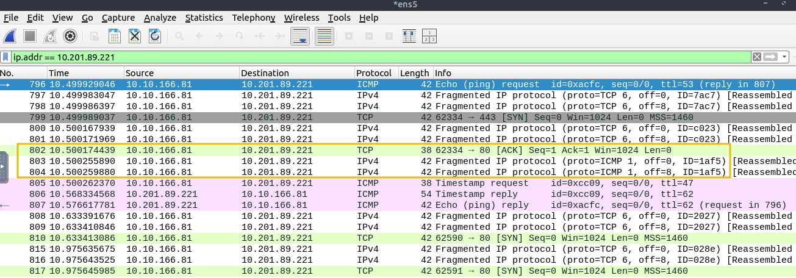

> **Lưu ý**: Fragmentation vẫn để lộ đầy đủ IP header, nhưng chia nhỏ TCP/UDP header và payload, khiến firewall/IDS cũ khó đọc đủ port, flags hoặc nội dung nếu không ghép lại các fragment.

## **7. Idle/Zoombie Scan**

- `Idle/Zombie Scan` là kĩ thuật quét: `scanner` sử dụng 1 máy `zoombie` và phân tích trường `IP ID` của máy `zoombie` trả về để kết luận
- `Máy zoombie` tiêu chuẩn:
    - có `IP ID` tăng tuần tự và có thể dự đoán;
    - đang ít hoạt động, nếu không lưu lượng khác sẽ làm `IP ID` thay đổi;
    - có thể truy cập được từ cả `scanner` và `target`;
    - không dùng cơ chế `IP ID` ngẫu nhiên hoặc riêng biệt theo từng kết nối.

### **Cách hoạt động**
**TH1: Port mở** 

Giả sử `IP ID` ban đầu của `zombie` là `1000`

```
1. Scanner hỏi zombie → zombie trả lời, IP ID = 1000

2. Scanner giả mạo IP zombie, gửi SYN đến target

3. Target thấy cổng mở → gửi SYN/ACK về zombie

4. Zombie không hề tạo kết nối này
   → gửi RST lại target
   → IP ID tăng lên 1001

5. Scanner hỏi lại zombie
   → zombie trả lời
   → IP ID tăng lên 1002
```

`Scanner` thấy `IP ID` tăng khoảng `2` đơn vị, nên suy ra: `OPEN`

**TH2: Port đóng**

```
1. Scanner kiểm tra zombie → IP ID = 1000

2. Scanner giả IP zombie, gửi SYN đến target

3. Target thấy cổng đóng → gửi RST về zombie

4. Zombie nhận RST thì thường không cần trả lời

5. Scanner kiểm tra lại zombie
   → zombie chỉ tăng IP ID do trả lời scanner
   → IP ID = 1001
```

## **8. Getting More Details**

- `--reason`: cho biết lý do tại sao lại đưa ra kết luận đó

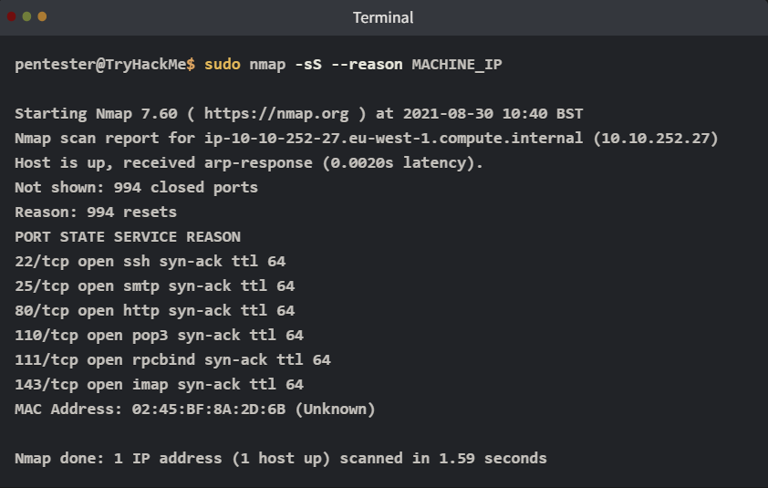

--> Trong ảnh trên, nó đưa ra lý do là nhận được `SYN/ACK` nên mới kết luận là `open`

---

- `-v` (*verbose*): hiển thị chi tiết status của quá trình quét
- `-d` (*debug*)

    