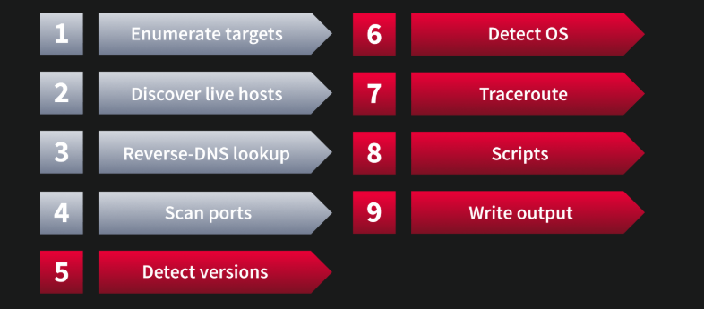
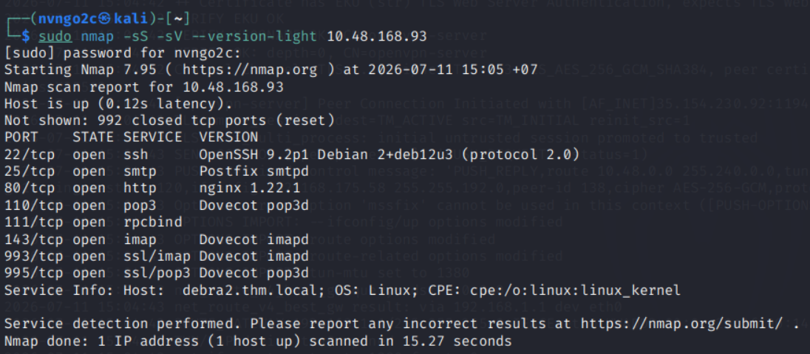
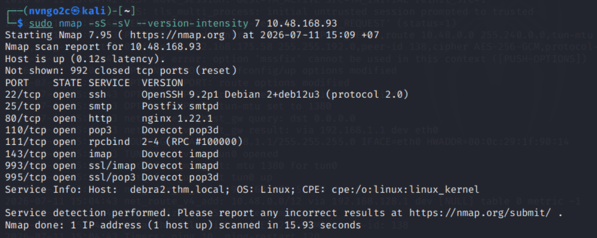
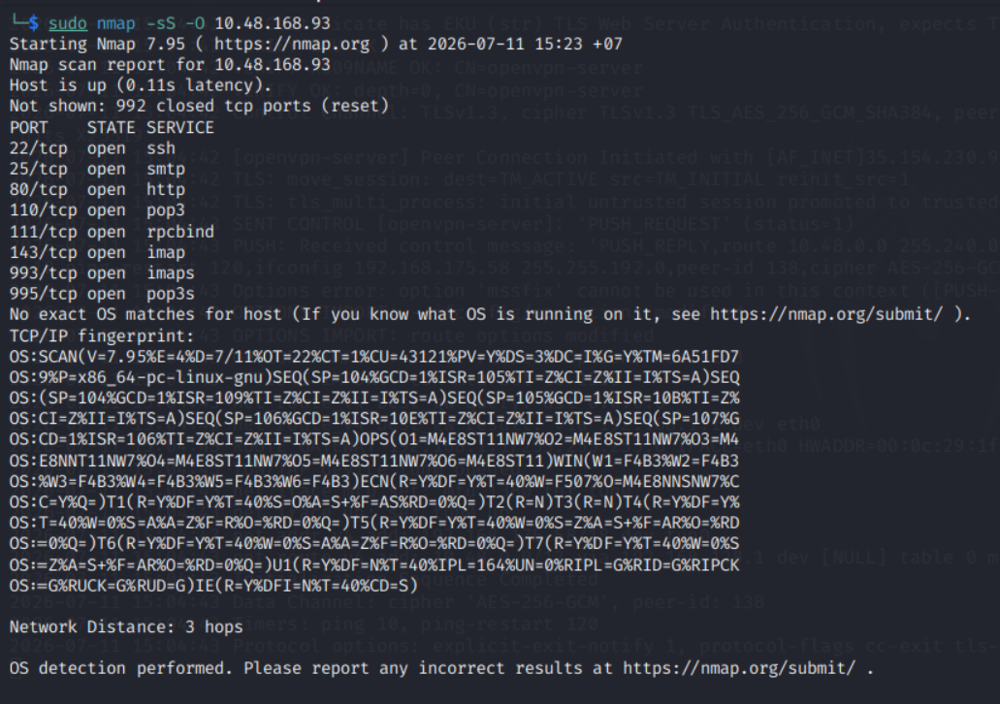
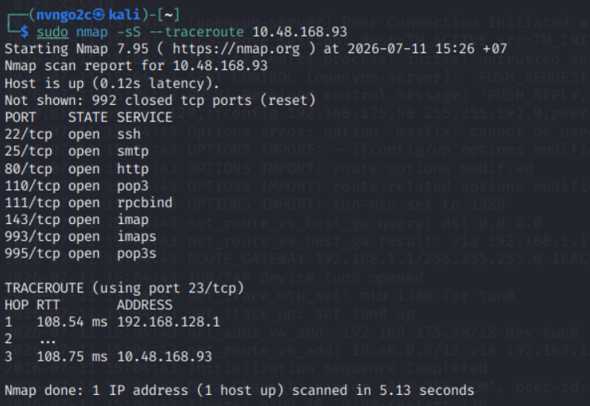
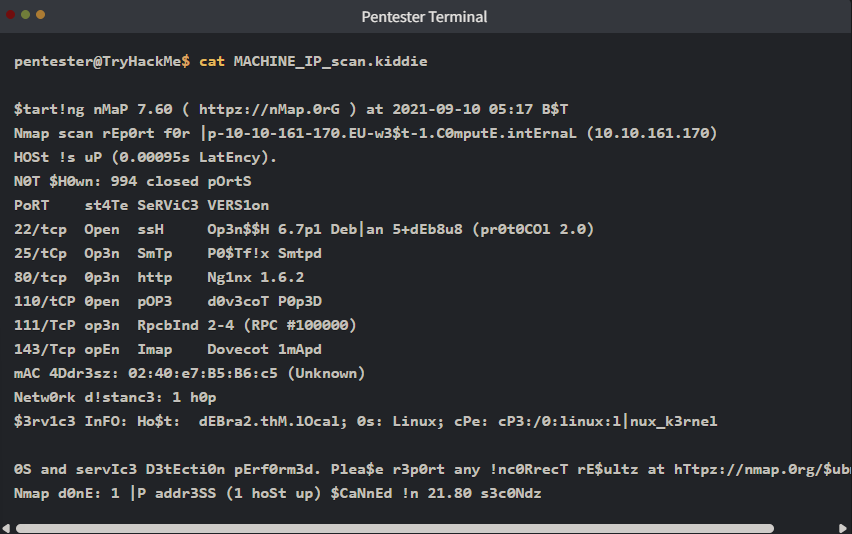

# **Nmap Post Ports Scan**

## **1. Introduction**
Ở bài này, ta sẽ học:
- Lấy được **service name** và **thông tin version** từ những port mở
- Lấy được thông tin của **hệ điều hành** và đường đi của gói tin đến target
- Quét mở rộng với **Nmap Scripting Engine** (`NSE`)
- Lưu và ghi lại kết quả dưới nhiều dạng khác nhau phục vụ report



## **2. Service Detection**
- Scan Version cần phải thực hiện `3-way handshake` nó chỉ có tác dụng sau khi đã xác định được port mở, nó sẽ hoàn thành bắt tay 3 bước
VD: 
```bash
sudo nmap -sS -sV 10.10.10.5
```

Ở giai đoạn đầu, `-sS` vẫn hoạt động đúng kiểu `SYN scan`:

```
Scanner → Target: SYN
Target → Scanner: SYN/ACK
Scanner → Target: RST
```

Nmap chưa hoàn thành bắt tay, nhưng đã biết port đang mở.

Sau khi biết port mở, `-sV` sẽ kết nối lại tới port đó:

```
Scanner → Target: SYN
Target → Scanner: SYN/ACK
Scanner → Target: ACK
```

Lúc này `TCP 3-way handshake` được **hoàn tất**. Sau đó Nmap gửi các probe ứng dụng

---

- `-sV` (Version Scan):  kết hợp và **xác định dịch vụ** và **phiên bản** chạy trên open port
- Ta có thể tăng cường độ bằng `-sV --version-intensity <LEVEL>`, `LEVEL` có khoảng từ `0`(*lightest*) --> `9`(*the most complete*)
    - `0`: Chỉ dùng các probe rất cơ bản, **nhanh** nhưng **ít chính xác**
    - `1`–`3`: Nhẹ, gửi ít probe
    - `4`–`6`: Mức trung bình
    - `7`: Mức mặc định của Nmap
    - `8`: Quét kỹ hơn, gửi thêm nhiều probe hiếm
    - `9`: Thử gần như toàn bộ probe, chính xác hơn nhưng lâu và gây nhiều traffic hơn

---



Khi dùng ở chế độ `--version-light`, ta không thu được version của service `rpcbind`



Nhưng khi tăng cường độ lên mức `7`, ta đã thu được version của `rpcbind`

## **3. OS Detection and Traceroute**
### 3.1 OS Detection
- Nmap có thể phát hiện được OS của target dựa vào hành vi và một số tín hiệu response
- `-O` (OS)
```bash
nmap -sS -O target
```

---



---
> Lưu ý: 
> - Không phải lúc nào cũng có kết quả được trả về
> - Kết quả trả về không phải lúc nào cũng chính xác

### 3.2 Traceroute

- `--traceroute`: Thêm cờ này vào nmap sẽ chạy thêm traceroute để biết được đường đi đến mục tiêu qua nhữn router nào



## **4. Nmap Scripting Engine(NSE)**
- Script cho phép ta mở rộng chức năng của Nmap
- Ta có thể xem các Script ở `/usr/share/nmap/scripts`
- Ta có thể sử dụng thể loại default bằng cách sử dụng `--script=default` hoặc đơn giản là `-sC`
- Ta có thể tự điều chỉnh bằng `--script "SCRIPT-NAME"`
- Ngoài `default` ta còn có cá thể loại khác:
    - `auth`: chạy các script liên quan đến xác thực
    - `broadcast`: tìm các host bằng việc gửi các gói tin `broadcast`
    - `brute`: thực hiện brute-force vào các trường login
    - `discovery`: lấy thông tin truy cập như bảng DB, DNS name
    - `dos`: thực hiện DoS
    - `exploit`: cố gắng khai thác những lỗ hổng (nếu có) trên service
    - `external`: kiểm tra bằng cách sử dụng các dịch vụ bên thứ 3
    - `fuzzer`: tấn công fuzzing 
    - `intrusive`: thực hiện các script xâm nhận và khai thác
    - `malware`: quét để backdoor
    - `safe`: chạy để không làm ảnh hưởng đến hệ thống
    - `version`: lấy thông tin phiên bản của dịch vụ
    - `vuln`: kiểm tra những lỗ hổng và thực hiện khai thác các lỗ hổng của dịch vụ đó
    

## **5. Saving the Output**
### 5.1 Normal
- `oN FILNAME` (Nomal): lưu dưới dạng text bình thường có thể đọc

### 5.2 Grepable
- `oG FILNAME`: lưu dưới dạng để các lệnh `grep`, `awk`, ... có thể sử dụng

### 5.3 XML
- `-oX FILENAME`: lưu dưới dạng `XML` phục vụ cho việc tự động hóa, ...

- `-oA FILENAME`: lưu dưới cả 3 dạng
```bash
nmap -sS -oA my_scan 192.168.19.9
```

Khi đó nó sẽ xuất ra 3 file: `my_scan.nmap`, `my_scan.gnmap`, `my_scan.xml`

### 5.3 Script Kiddie

- `-oS`




