# Enumeration & Brute Force
## 1. Introduction
### Khái niệm
- Thu thập thông tin về cơ chế **authentication** của ứng dụng web.
- Kiểm tra:
  - Username validation
  - Password policy
  - Session management
- **Mục đích:** Tìm điểm yếu để hỗ trợ **brute-force attack**.

### Mục tiêu
- Hiểu vai trò của **enumeration** trước brute-force.
- Khai thác **verbose error messages** để lấy thông tin.
- Thực hành **Burp Suite** và các kỹ thuật enumeration, brute-force.

### Kiến thức cần có
- HTTP/HTTPS (Request, Response, Status Code)
- Burp Suite
- Linux cơ bản

## 2. Authentication Enumeration

### Mục tiêu
Thu thập thông tin về cơ chế xác thực để hỗ trợ tấn công (đặc biệt là **brute-force**).

### Những gì cần enumerate

#### 1. Valid Usernames
- Xác định username tồn tại.
- Thường dựa vào phản hồi của ứng dụng:
  - `Account doesn't exist` → Username sai.
  - `Incorrect password` → Username đúng, password sai.

> Có username hợp lệ → Chỉ cần brute-force password.

#### 2. Password Policy
- Thu thập chính sách mật khẩu:
  - Độ dài
  - Chữ hoa
  - Số
  - Ký tự đặc biệt
- Có thể lấy từ **regex**, thông báo lỗi hoặc hướng dẫn.
- Giúp tạo **wordlist** phù hợp.

---

### Nơi thường xảy ra Enumeration

#### Registration Page
- Thông báo như **"Username/Email already exists"** xác nhận tài khoản tồn tại.

#### Password Reset
- Phản hồi khác nhau giữa username tồn tại và không tồn tại giúp xác minh tài khoản.

#### Verbose Errors
- Lỗi quá chi tiết (ví dụ: `Username not found` vs `Incorrect password`) làm lộ username hợp lệ.

#### Data Breach Information
- Dùng dữ liệu từ các vụ rò rỉ để kiểm tra:
  - Username có được tái sử dụng không.
  - Password có bị dùng lại trên nhiều dịch vụ không.

## 3. Enumeration Users via Verbose Errors
### Verbose Errors là gì?
- Thông báo lỗi quá chi tiết, vô tình tiết lộ thông tin nội bộ của hệ thống.
- Có thể làm lộ:
  - **Internal Paths** (đường dẫn, cấu trúc thư mục)
  - **Database Details** (tên bảng, cột, schema)
  - **User Information** (username, email...)

---

### Cách tạo Verbose Errors

- **Invalid Login**: Thử username/password sai để phân biệt tài khoản tồn tại.
- **SQL Injection**: Gây lỗi SQL để lộ thông tin database.
- **File Inclusion / Path Traversal**: Truy cập đường dẫn trái phép để lộ file nội bộ.
- **Form Manipulation**: Sửa tham số/form để lộ logic xử lý.
- **Application Fuzzing**: Gửi nhiều payload (Burp Intruder) để tìm phản hồi bất thường.

---
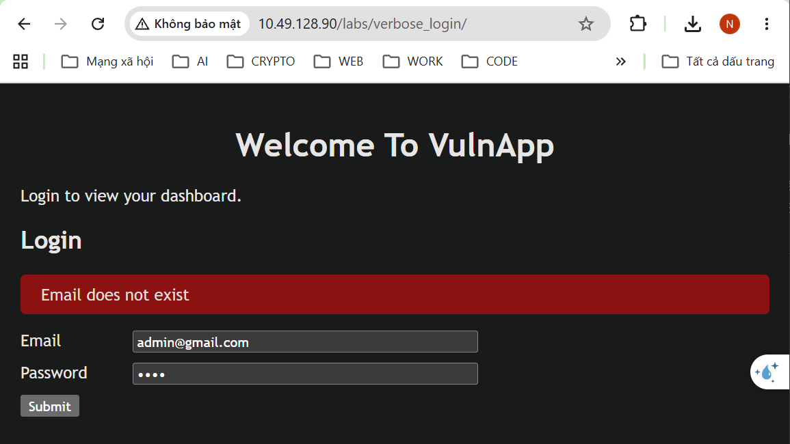

Truy cập mục tiêu, thấy được 2 ô nhập dữ liệu `email/password`\
Nhập thử vào 1 cặp `email/password`\

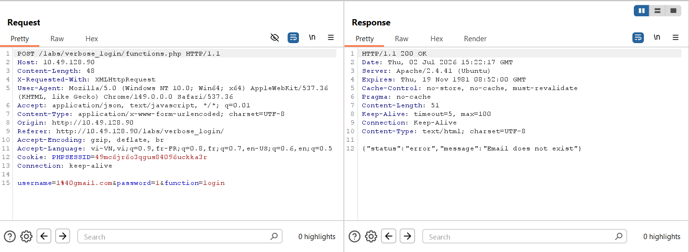

Mở `BurpSuite` để xem request\
Ta muốn **BruteForce** để tìm ra email tồn tại trong hệ thống bằng việc web trả về thông báo lỗi quá chi tiết

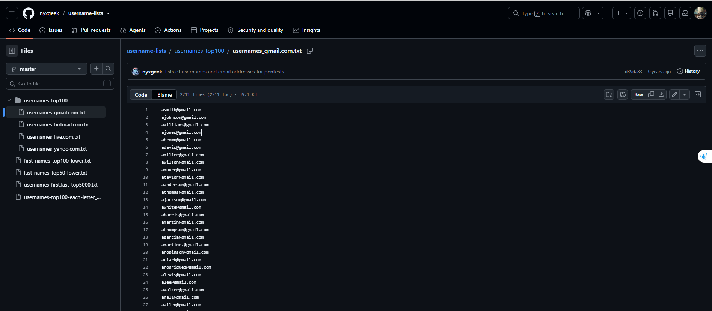

Tải list email phổ biến [tại đây](https://github.com/nyxgeek/username-lists/blob/master/usernames-top100/usernames_gmail.com.txt)

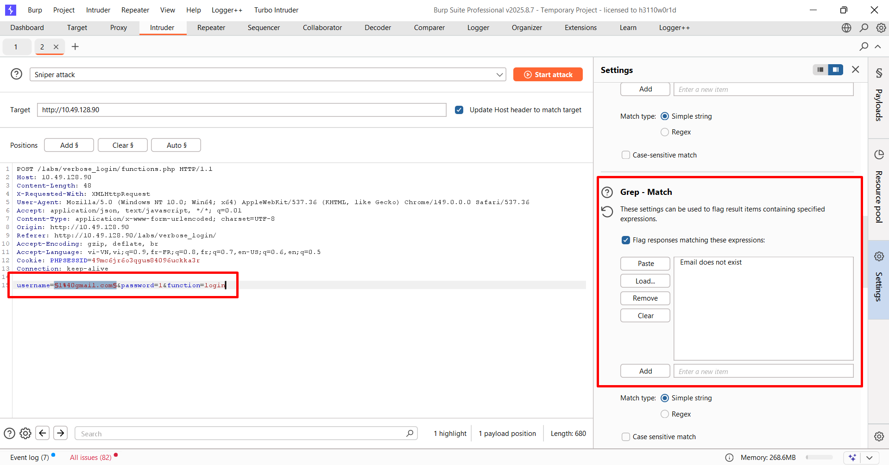

Chuyển request sang tab `Intruder` để BruteForce\
Add tham số *email* thay đổi\
Thêm phần tìm kiếm chuỗi **Email does not exist** để xem sự khác biệt

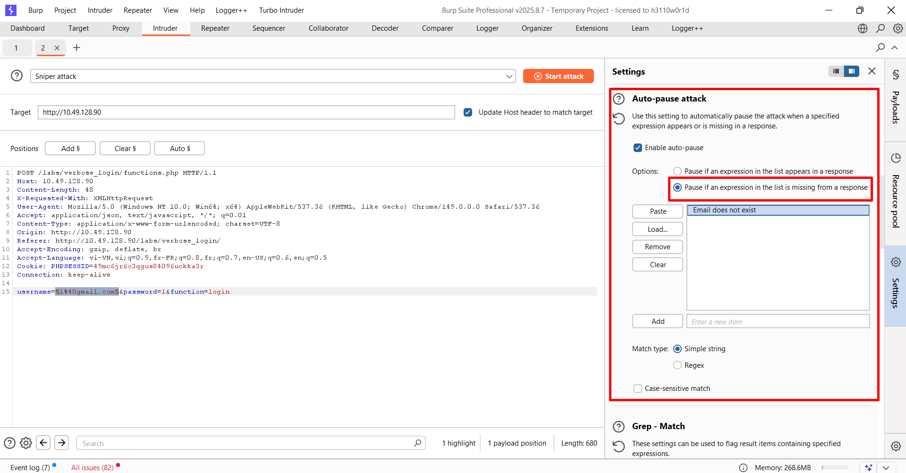

Dừng khi không gặp chuỗi **Email does not exist** 

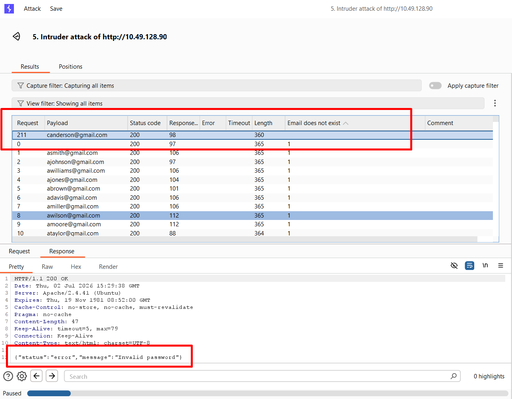

Ta thấy được 1 email có response trả về khác chuỗi '**Invalid password**'

## 4. Exploiting Vunerable Password Reset Logic
### Password Reset Methods
- **Email-based Reset**: Gửi **link/token** qua email → phụ thuộc vào bảo mật email.
- **Security Question-based Reset**: Trả lời câu hỏi bảo mật → dễ bị khai thác nếu attacker biết **PII**.
- **SMS-based Reset**: Gửi mã/link qua SMS → có thể bị **SIM swapping** hoặc chặn tin nhắn.

### Common Vulnerabilities
- **Predictable Tokens**: Token dễ đoán → có thể bị **guess/brute-force**.
- **Token Expiration Issues**: Token hết hạn chậm hoặc không vô hiệu sau khi dùng → tăng nguy cơ bị lợi dụng.
- **Insufficient Validation**: Xác minh danh tính yếu (câu hỏi dễ đoán, email bị chiếm...).
- **Information Disclosure**: Lỗi tiết lộ email/username tồn tại → hỗ trợ **user enumeration**.
- **Insecure Transport**: Truyền token qua **HTTP** thay vì **HTTPS** → dễ bị **interception**.

### Secure Practices
- Token phải **random**, **khó đoán**, **one-time use**.
- Token **hết hạn nhanh**.
- Luôn sử dụng **HTTPS**.
- Không tiết lộ tài khoản có tồn tại hay không qua thông báo lỗi.

---

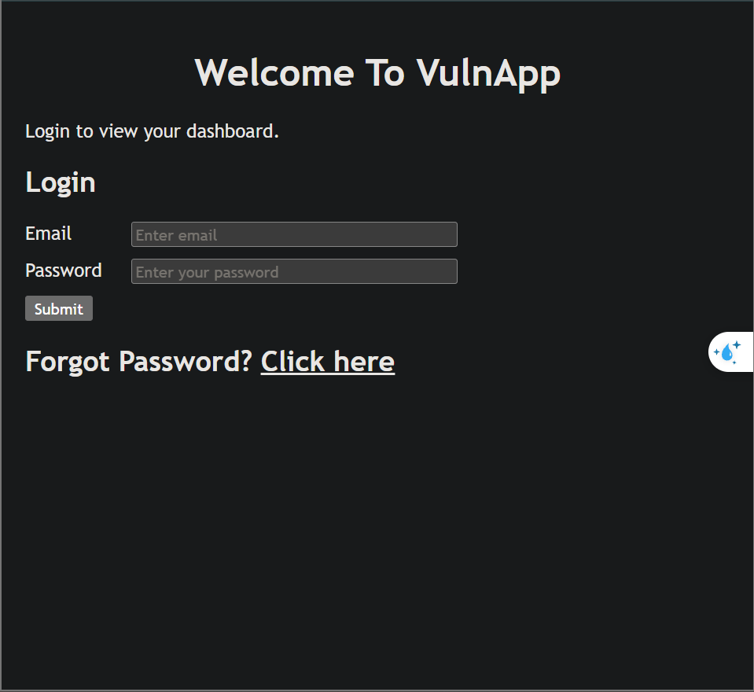

Vào giao diện của web

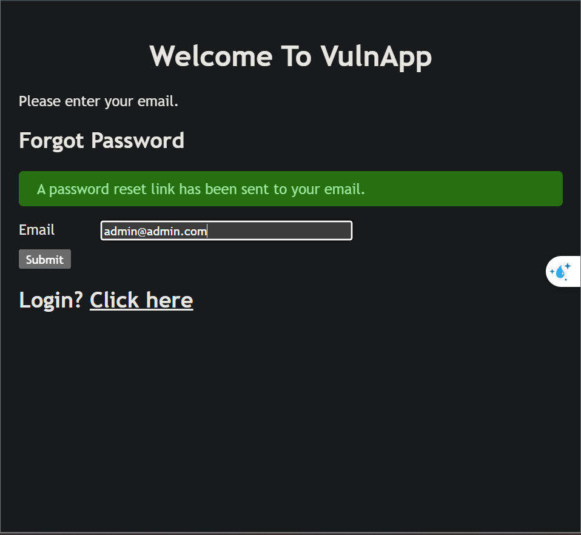

Truy cập chức năng quên mật khẩu, đề bài đã cho ta biết email của Admin là `admin@admin.com` \
Gửi 1 request để gửi Token đổi mật khẩu về email của admin

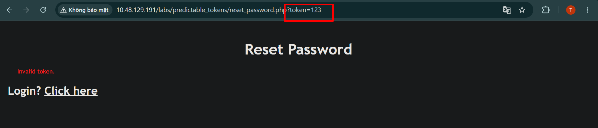

Request đổi mật khẩu có dạng `http://10.48.129.191/labs/predictable_tokens/reset_password.php?token=123`

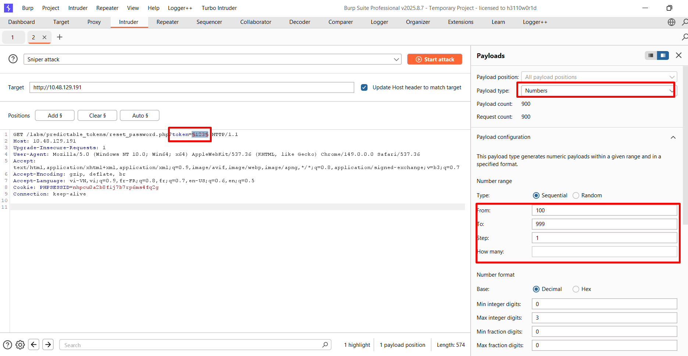

Vào `BurpSuite`, chuyển request sang tab `Intruder`\
Add phần Token vào làm tham số\
Phần list chọn dãy từ `100` --> `999`

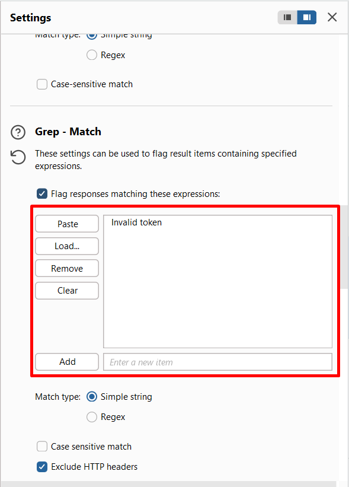

Phần `Setting` -> `Grep - Match` --> thêm chuỗi `Invalid token` vào 

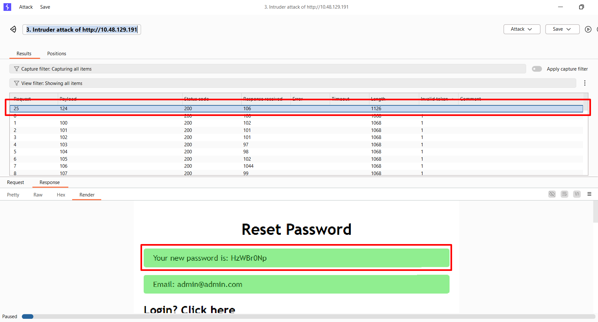

Sau khi chạy, ta thấy khi token ở `124` thì đã thành công lấy được mật khẩu của Admin do web tự sinh, không cần đặt lại 

## 5. Exploiting HTTP Basic Authentication
### Khái niệm
- Chỉ yêu cầu **username + password** để xác thực.
- Đơn giản, dễ triển khai, phù hợp với thiết bị có tài nguyên hạn chế (ví dụ: **router**, thiết bị mạng).

### Đặc điểm
- Không cần **session management** hay theo dõi người dùng.
- Thích hợp cho các giao diện quản trị, nơi chỉ cần đăng nhập để cấu hình.

### Cách hoạt động
- Theo **RFC 7617**.
- Username và password được **Base64-encode** rồi gửi trong HTTP header:
  ```http
  Authorization: Basic <Base64(username:password)>
  ```
- Server sử dụng cơ chế **challenge-response** để yêu cầu thông tin đăng nhập.

### Hạn chế / Lỗ hổng
- **Base64 chỉ là encoding, không phải encryption** → dễ bị giải mã.
- Nếu dùng **HTTP** thay vì **HTTPS**, attacker có thể đọc được credentials.
- Mật khẩu yếu dễ bị **brute-force attack**.

### Best Practice
- Luôn sử dụng **HTTPS**.
- Dùng **mật khẩu mạnh** để giảm nguy cơ brute-force.
- Chỉ nên dùng Basic Authentication trong các trường hợp đơn giản hoặc nội bộ.

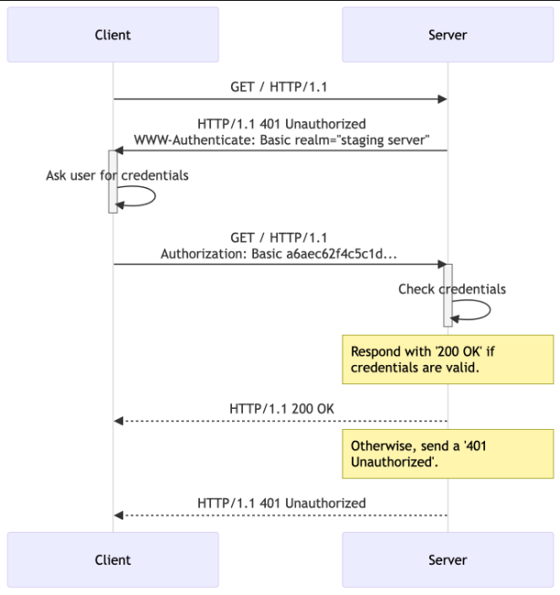

---

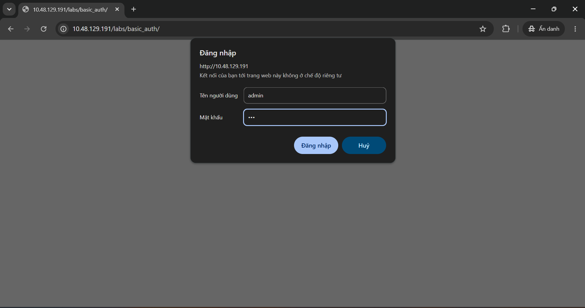

Truy cập vào Lab, đề cho biết là có user `admin`\
Ta đăng nhập thử 1 lần để lấy payload chuẩn

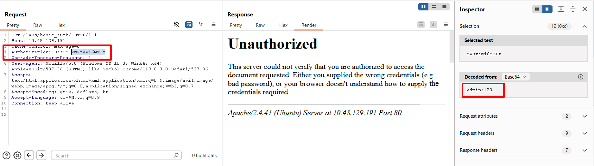

Ta thấy được web không gửi bằng method `POST` mà lại gửi bằng method `GET`
Phần Header ta thấy có Header:
`Authorization: Basic YWRtaW46MTIz`\
Khi decode đoạn base64 ta thấy được thông tin vừa nhập vào, được phân cách nhau bằng dấu `:`\
**Ý tưởng:** ta sẽ BruteForce, mỗi payload gửi lên sẽ thêm tiền tố `admin:` và ghép sau đó là chuỗi mật khẩu dự đoán; sau đó sẽ encode cả chuỗi rồi gửi lên

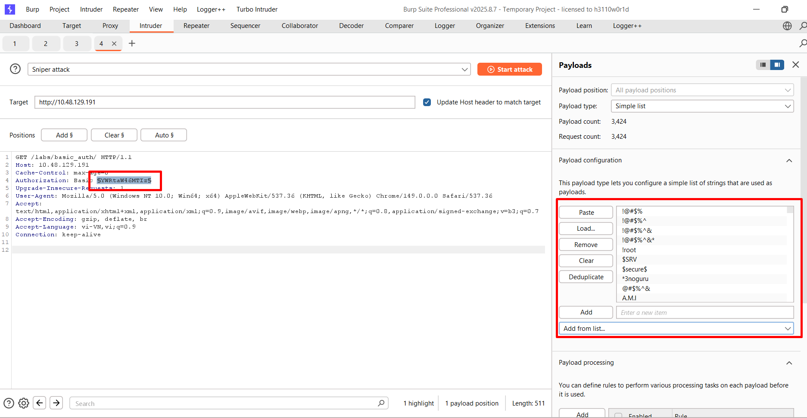

Trước tiên là thêm tham số ở phần Header `Authorization`\
Sau đó là thêm danh sách mật khẩu dự đoán

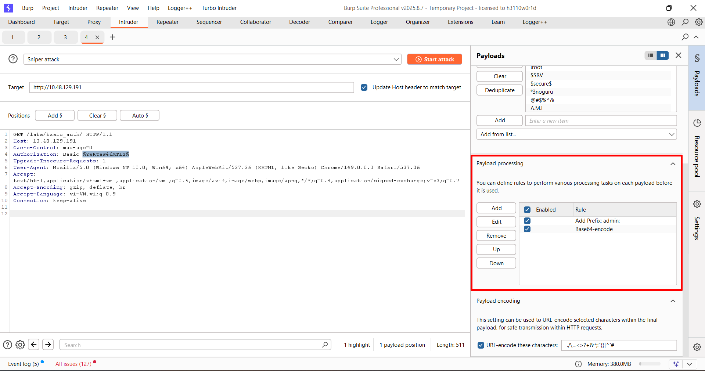

Phần `Payload processing` ta sẽ thêm rule:
- Thêm tiền tố `admin:`
- Encode base64

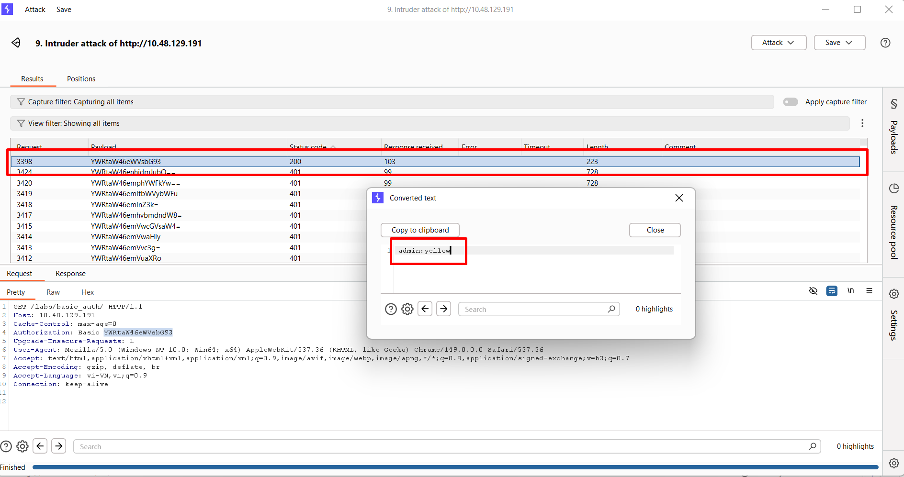

Sau khi chạy, ta được 1 payload trả về status code `200`\
Payload đó cho ta biết được mật khẩu là `yellow`

## 6. OSINT
### Wayback Machine
- Sử dụng **Wayback Machine** để xem **các phiên bản cũ (snapshots)** của website.
- Giúp tìm:
  - URL cũ
  - Thư mục (directories) đã bị ẩn/xóa
  - File cũ (`.bak`, `.zip`, `.sql`, `.env`, `.pdf`, ...)
- Một số tài nguyên cũ có thể **vẫn còn tồn tại trên server**, dù không còn được liên kết trên website.
- Hữu ích trong **Reconnaissance** để mở rộng bề mặt tấn công (attack surface).

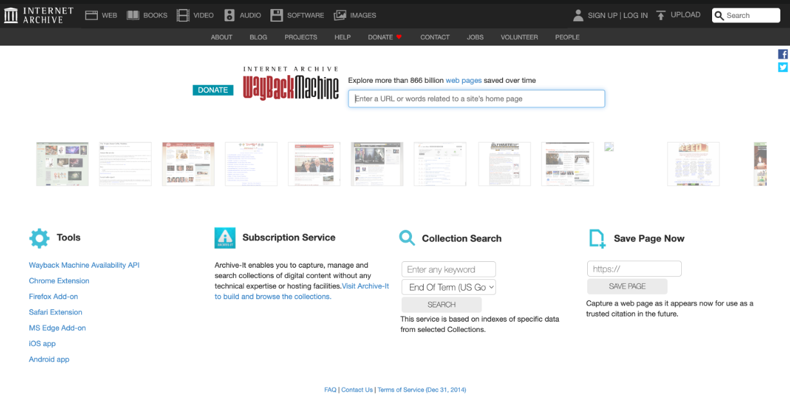

### Wayback URL

- **waybackurls** là công cụ dùng để lấy tất cả URL đã được lưu trong **Wayback Machine**.
- Công cụ này được host trên **GitHub** và thường dùng trong giai đoạn **Reconnaissance / Information Gathering**.
- Nó giúp dump ra các link cũ của một domain, bao gồm:
  - Trang cũ
  - Endpoint cũ
  - File cũ
  - Thư mục từng tồn tại

#### Mục đích sử dụng

- Tìm các URL không còn xuất hiện trên website hiện tại.
- Phát hiện file/thư mục cũ có thể vẫn còn tồn tại trên server.
- Mở rộng phạm vi kiểm thử trong pentest.
- Hỗ trợ tìm endpoint hoặc tài nguyên bị bỏ quên.

#### Lưu ý
- Việc cài đặt công cụ không nằm trong phạm vi bài học.
- Nên cài và chạy công cụ trong **máy ảo riêng (VM)**.
- Chỉ sử dụng với hệ thống được phép kiểm thử.

### Google Dorks

- **Google Dorks** là các câu truy vấn tìm kiếm nâng cao trên Google.
- Dùng để tìm thông tin bị public ngoài ý muốn, ví dụ:
  - Trang admin
  - File log
  - Thư mục backup
  - File cấu hình
  - Directory listing
  - Tài liệu nhạy cảm
    
