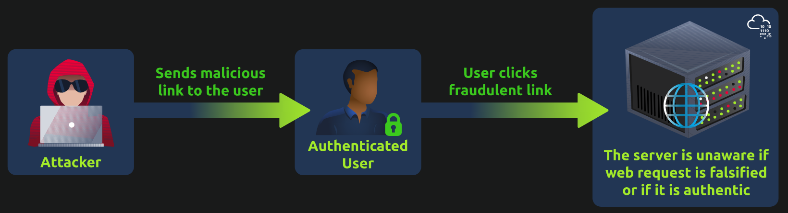
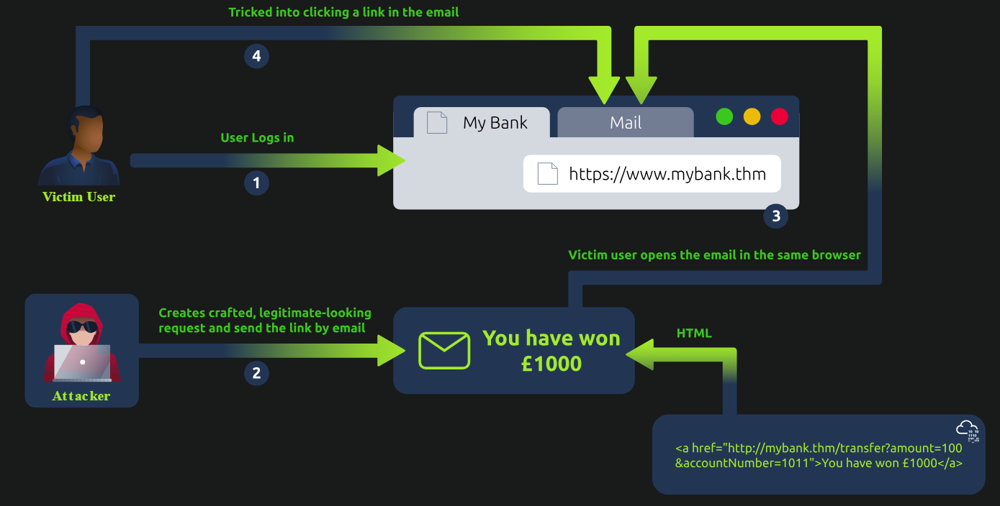
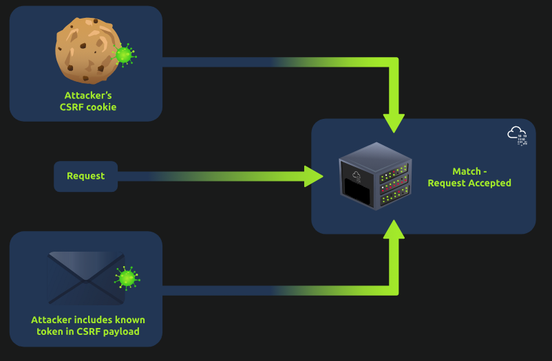

# **CSRF**
## **1. Overview of CSRF Attack**
**CSRF** là một loại lỗ hổng bảo mật trong đó kẻ tấn công lừa trình duyệt web của người dùng thực hiện một hành động không mong muốn trên một trang web đáng tin cậy nơi người dùng được xác thực. Điều này đạt được bằng cách khai thác thực tế là trình duyệt tự động bao gồm mọi cookie (thông tin xác thực) có liên quan, cho phép kẻ tấn công giả mạo và gửi yêu cầu trái phép thay mặt người dùng (thông qua trình duyệt). Trang web của kẻ tấn công có thể chứa các biểu mẫu HTML hoặc mã JavaScript nhằm gửi truy vấn đến ứng dụng web được nhắm mục tiêu

Một cuộc tấn công CSRF có 3 phần:
- Kẻ tấn công đã biết định dạng các yêu cầu của ứng dụng web để thực hiện một tác vụ cụ thể và gửi một liên kết độc hại đến người dùng
- Danh tính của nạn nhân trên trang web được xác minh, thường bằng cookie được truyền tự động với mỗi yêu cầu tên miền và nhấp vào liên kết được chia sẻ bởi kẻ tấn công. Sự tương tác này có thể là một cú nhấp chuột, di chuột qua hoặc bất kỳ hành động nào khác
- Các biện pháp bảo mật không đầy đủ sẽ khiến ứng dụng web không phân biệt được đâu là request của người dùng thật, đâu là request giả do attacker làm giả



Tác động của **CSRF**:
- **Unauthorised Access**: thực hiện các hành động của người dùng, khiến họ có nguy cơ mất tiền, hủy hoại danh tiếng
- **Exploiting Trust**: CSRF khai thác các trang web tin cậy của người dùng, làm suy yếu cảm giác an toàn khi duyệt trực tuyến
- **Stealthy Exploitation**: CSRF hoạt động lặng lẽ, sử dụng hành vi tiêu chuẩn của trình duyệt mà không cần phần mềm độc hại nâng cao. Người dùng có thể không biết về cuộc tấn công, khiến họ dễ bị khai thác nhiều lần

## **2. Types of CSRF Attack**
### **Traditional CSRF**



Các bước trong hình ảnh trên mô tả các bước của một cuộc tấn công **CSRF**:
1. Victim đã đăng nhập vào ngân hàng. Attacker thực hiện tạo một đường link chứa mã độc và gửi tới victim
2. Victim mở đường link đó trên cùng trình duyệt đã đăng nhập ngân hàng
3. Khi click, mã độc thực hiện tự động chuyển tiền của người dùng đến tài khoản mà attacker chỉ định trong link

### **XMLHttpRequest CSRF**
**Asynchronous CSRF** về bản chất khá giống **Traditional CSRF** nhưng khác về cách gửi request, Asynchronous CSRF thực hiện gửi request bằng `XMLHttpRequest` hoặc **Fetch API**, vì vậy nó không cần tải lại toàn bộ trang như **Traditional CSRF**

```
1. Victim đăng nhập vào mailbox.thm
        ↓
2. Browser lưu session cookie của mailbox.thm
        ↓
3. Victim bị dụ mở trang attacker
        ↓
4. JavaScript trên trang attacker gửi AJAX request tới:
   mailbox.thm/api/updateEmail
        ↓
5. Browser gửi session cookie của victim kèm request
        ↓
6. mailbox.thm nhận request
        ↓
7. Nếu không có CSRF protection
   → server tưởng đây là thao tác hợp lệ của victim
        ↓
8. Email forwarding bị đổi sang địa chỉ của attacker
```

### **Flash-based CSRF**
Flash thường được dùng để làm:
- nội dung tương tác,
- video streaming,
- animation,
- ứng dụng web phức tạp.
- có đuôi `.swf`

Attacker có thể đặt một file `.swf` độc hại trên website của mình. Khi victim mở trang đó, Flash file có thể cố gửi request sang website khác

```
Victim đăng nhập target.com
        ↓
Browser có session cookie
        ↓
Victim mở evil.com
        ↓
evil.com chạy malicious.swf
        ↓
Flash gửi request tới target.com
        ↓
Nếu target không có CSRF protection
        ↓
Hành động được thực hiện dưới session của victim
```

## **3. Basic CSRF - Hidden link/Image Exploitation**
**Hidden link / image exploitation trong CSRF** attacker giấu một request bên trong link hoặc image để trình duyệt của victim vô tình gửi request tới website mục tiêu

```html
<a href="https://mybank.thm/transfer.php" target="_blank">
    Click Here
</a>
```

Nếu victim đang đăng nhập `mybank.thm`, rồi mở trang của attacker và bấm link này, browser có thể tự gửi cookie phiên của `mybank.thm` kèm request

- Giả sử victim là Josh có mail tại `http://mailbox.thm:8081` và có tài khoản ngân hàng tại `http://mybank.thm:8080`
- Attacker cũng có một tài khoản ở ngân hàng đó, hắn sử dụng tài khoản đó để quan sát request hợp lệ
- Tiếp đó hắn tạo một đường link trên trang web hắn kiểm soát với nội dung:

```php
<a href="http://mybank.thm:8080/dashboard.php?to_account=GB82MYBANK5698&amount=1000" target="_blank">Click Here to Redeem</a>
```

Đây là kĩ thuật hidden image thực hiện tự động chuyển tiền khi victim nhấn vào dòng `Click Here to Redeem`
- Cuối cùng hắn gửi đường link web độc đến cho victim, khi này victim mà đã xác thực tài khoản ở ngân hàng trên và thực hiện nhấn vào đường link này, hàm chuyển tiền sẽ tự động được gọi và chuyển tiền đến tài khoản mà attacker chỉ định

## **4. Double Submit Cookie Bypass**
Kĩ thuật này đặt CSRF token ở 2 nơi:

```
1. Cookie
2. Request body / form field
```

Ví dụ khi gửi một request thực hiện hành động:

```
POST /transfer

Cookie:
session=abc123
csrf=hello123

Body:
to=bob
amount=100
csrf=hello123
```

`CSRF token` xuất hiện ở cả phần body và cookie, attacker có thể biết được `CSRF token` ở phía client nhưng ở cookie khi người dùng gửi đi bằng request của hắn lại không trùng với `CSRF token` của victim, khi đó server sẽ so sánh 2 giá trị này và thấy nó không giống nhau nên reject

Gọi là double submit vì nó thực hiện gửi `2` lần: 1 lần ở cookie và 1 lần ở trong form



**Double Submit Cookie** tốt, nhưng nếu token hoặc cookie bị lộ, đoán được, hoặc bị attacker can thiệp thì cơ chế này có thể bị vượt qua

Nếu attacker có cách làm cho cả hai giá trị cùng trở thành một giá trị mà attacker biết hoặc kiểm soát, thì check này không còn hữu ích

```
Cookie:
csrf=attacker123

Body:
csrf=attacker123
```

Trong ảnh có `5` kịch bản chính:
- **Session Cookie Hijacking / Man-in-the-Middle**
- **Subverting Same-Origin Policy / attacker-controlled subdomain**: attacker kiểm soát một subdomain như `evil.example.com`, trong một số cấu hình cookie không an toàn họ có thể đặt cookie cho domain cha `example.com`. Khi đó attacker có thể ép browser có CSRF cookie do attacker chọn
- **XSS**: đây là trường hợp rất nguy hiểm. Nếu website có XSS, JavaScript của attacker chạy ngay trong origin của website. Khi đó attacker có thể đọc CSRF token từ DOM, JavaScript variable hoặc cookie nếu cookie không có HttpOnly, rồi gửi request hợp lệ. Vì vậy người ta hay nói rằng XSS có thể làm suy yếu hoặc vô hiệu hóa nhiều cơ chế CSRF
- **Predictable token generation**: nếu token kiểu 12345, timestamp, username, số tăng dần... thì attacker có thể đoán token tiếp theo. CSRF token phải đủ ngẫu nhiên và khó đoán
- **Subdomain Cookie Injection**: đây là case rất hay gặp trong lab. Attacker kiểm soát một subdomain và dùng nó để đặt cookie CSRF trên browser nạn nhân. Sau đó attacker gửi request với body chứa chính giá trị đó

Cách hoạt động khi attacker nắm giữ một subdomain:
- Nếu attacker kiểm soát một subdomain như:
```
evil.example.com
```

thì nó nằm dưới cùng domain cha:

```
example.com
```

Trong một số cấu hình cookie không an toàn, response từ:

```
evil.example.com
```

có thể đặt:

```
Set-Cookie: csrf=attacker123; Domain=.example.com
```

Khi đó cookie này có thể được browser gửi tới:
```
bank.example.com
```

## **5. Samesite Cookie Bypass**
Chính sách có cho phép gửi kèm cookie không

`3` giá trị SameSite:
```
Set-Cookie: session=abc123; SameSite=Strict
```

Chặt nhất, nếu request bắt nguồn từ site khác ví dụ `evil.com → bank.com` browser thường sẽ không gửi cookie session.

`SameSite=Lax` mềm hơn Strict
```
Set-Cookie: session=abc123; SameSite=Lax
```

Trong phần lớn request cross-site nguy hiểm như `POST`:

```
evil.com
   ↓ POST
bank.com/change-email
```

cookie sẽ không được gửi

Nhưng một số top-level navigation bằng `GET` có thể vẫn được gửi cookie

Ví dụ user bấm link:
```html
<a href="https://bank.com/profile">Bank</a>
```

Browser chuyển toàn bộ tab sang `bank.com`:

```
evil.com
   ↓ user navigation
bank.com/profile
```

`SameSite=None` nghĩa là cookie được phép gửi trong ngữ cảnh cross-site

## **6. Few Additional Exploitation Techniques**
